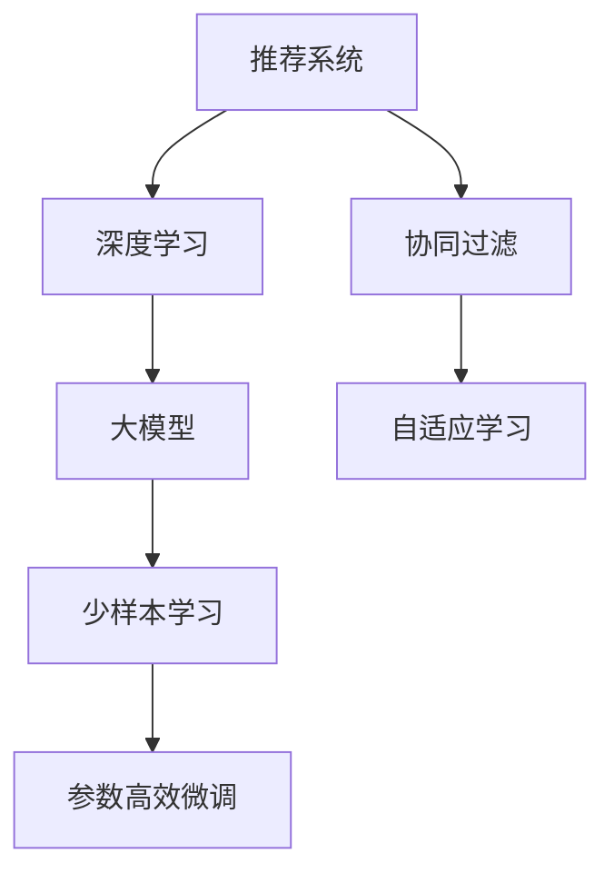

                 

## 1. 背景介绍

推荐系统作为现代互联网的重要组成部分，其核心任务是预测用户对物品的评分或偏好，为用户推荐最符合其兴趣的产品和服务。随着用户需求的多样化，推荐系统正在从传统的基于协同过滤和内容的推荐，向更加智能、个性化的推荐演进。而大模型的引入，为推荐系统带来了新的思考和可能性。

推荐系统经历了基于内容的推荐、协同过滤和混合推荐等几个重要阶段。其中，基于内容的推荐系统通过提取物品特征，与用户偏好进行匹配；而协同过滤则主要通过用户行为数据的分析，寻找具有相似兴趣的用户群体。但这些方法对于冷启动用户和新物品的推荐效果较差，且在处理大规模、高维数据时效率低下。

大模型在这一背景下应运而生。利用深度学习模型对大规模用户-物品交互数据进行训练，大模型能够从海量的用户行为中挖掘出深层次的关联特征，预测用户对物品的评分或偏好。以BERT和GPT为代表的预训练语言模型，更是以其强大的泛化能力和跨领域迁移能力，在推荐系统中的少样本学习中表现出色。

## 2. 核心概念与联系

### 2.1 核心概念概述

- **推荐系统(Recommender System)**：根据用户行为数据和物品属性信息，预测用户对物品的评分或偏好，为用户推荐最符合其兴趣的物品。

- **协同过滤(Collaborative Filtering)**：通过用户行为数据寻找与目标用户具有相似兴趣的其他用户，从而推荐该用户可能喜欢的物品。

- **深度学习(Deep Learning)**：利用多层神经网络进行特征提取和关系建模，从数据中自动学习特征表示，适用于大规模数据的推荐任务。

- **大模型(Large Model)**：如BERT、GPT等，通过在大规模无标签文本语料上进行预训练，学习丰富的语言知识，应用于推荐系统的少样本学习任务。

- **少样本学习(Few-shot Learning)**：指模型仅使用少量的标注样本即可完成预测任务，无需进行大规模的训练。

- **参数高效微调(Parameter-Efficient Fine-Tuning, PEFT)**：指在微调过程中，仅调整模型的一部分参数，如头或层，以提高微调效率，避免过拟合。

- **自适应学习(Adaptive Learning)**：指模型能够在当前数据上动态调整学习策略，适应不同的训练数据分布。

这些核心概念之间的逻辑关系可以通过以下Mermaid流程图来展示：



### 2.2 核心概念原理和架构

- **协同过滤原理**：协同过滤通过分析用户对物品的评分或交互行为，寻找具有相似兴趣的用户群体，从而预测用户对新物品的评分或偏好。其核心思想是通过用户行为数据的相似性，进行横向和纵向的特征匹配。

- **深度学习架构**：深度学习模型通过多层神经网络，自动提取数据中的高层次特征表示。对于推荐系统，常用的架构包括深度神经网络、卷积神经网络、循环神经网络等。

- **大模型架构**：大模型如BERT、GPT等，通常采用自编码或自回归的结构，通过在大规模无标签文本语料上进行预训练，学习语言的高层次表示。其架构包括编码器-解码器结构、Transformer结构等。

- **少样本学习原理**：少样本学习通过在训练数据量有限的情况下，利用迁移学习、模型结构设计等方法，提高模型预测准确度。

- **参数高效微调原理**：参数高效微调通过仅调整模型的一部分参数，如头或层，从而减少微调过程中的计算量和存储需求，提高微调效率。

- **自适应学习原理**：自适应学习通过动态调整模型参数和学习率等，提高模型对不同数据分布的适应能力。

## 3. 核心算法原理 & 具体操作步骤

### 3.1 算法原理概述

大模型在推荐系统中的应用，主要聚焦于少样本学习。其核心思想是：利用预训练语言模型的跨领域迁移能力，通过少量标注数据对模型进行微调，快速适应新物品或新用户的推荐需求。

假设有N个用户，每个用户对K个物品有评分，目标是从这K个物品中推荐M个用户最感兴趣的物品。传统的协同过滤方法需要收集大量用户行为数据，进行矩阵分解或向量相似性计算，计算复杂度高，且对于新用户的推荐效果差。而大模型可以通过用户-物品文本描述的相似度，进行预训练-微调，快速适应新物品或新用户的评分预测任务。

大模型在推荐系统中的少样本学习过程可以概括为以下步骤：

1. **预训练阶段**：在大规模无标签文本语料上，对大模型进行预训练，学习语言的高层次表示。
2. **微调阶段**：将新物品或新用户的历史评分文本描述作为输入，在大模型上进行微调，学习新的用户-物品关系。
3. **预测阶段**：在新的数据上，利用微调后的模型进行物品评分预测。

### 3.2 算法步骤详解

以下是基于大模型的推荐系统少样本学习的详细步骤：

**Step 1: 准备数据集**
- 收集用户-物品文本描述数据集 $D=\{(x_i,y_i)\}_{i=1}^N$，其中 $x_i$ 为物品或用户的描述文本，$y_i$ 为用户对物品的评分。
- 将数据集划分为训练集 $D_{train}$、验证集 $D_{valid}$ 和测试集 $D_{test}$。

**Step 2: 预训练大模型**
- 选择预训练语言模型如BERT、GPT等，对其进行大规模无标签文本语料的预训练，学习语言的高层次表示。
- 设置预训练参数，包括学习率、批大小、迭代轮数等。

**Step 3: 微调大模型**
- 将用户-物品文本描述作为输入，在大模型上进行微调，学习新的用户-物品关系。
- 在微调过程中，可以使用提示学习、对抗训练、正则化等技术，避免过拟合。
- 设置微调参数，包括学习率、批大小、迭代轮数等。

**Step 4: 预测评分**
- 利用微调后的模型，对新物品或新用户进行评分预测。
- 在测试集上评估预测性能，计算各种评估指标如RMSE、MAE等。

### 3.3 算法优缺点

基于大模型的推荐系统少样本学习具有以下优点：

- **高效性**：利用预训练语言模型的跨领域迁移能力，可以快速适应新物品或新用户的评分预测任务。
- **灵活性**：通过微调，模型可以动态调整，适应不同数据分布。
- **鲁棒性**：由于预训练模型具有较强的泛化能力，微调后的模型对新数据具有较强的鲁棒性。
- **可解释性**：通过分析微调后的模型权重和输出，可以解释用户-物品评分预测的逻辑和原因。

同时，该方法也存在以下缺点：

- **计算成本高**：预训练和微调过程需要大量计算资源，且数据量不足时，可能无法充分学习新用户或新物品的特征。
- **标注成本高**：对于新物品或新用户的评分预测，仍需要一定量的标注数据进行微调。
- **模型复杂度高**：大模型参数量较大，增加了微调的复杂度。

### 3.4 算法应用领域

基于大模型的推荐系统少样本学习，适用于以下应用场景：

- **新物品推荐**：对于新上架的物品，需要收集少量用户评分数据，快速推荐给目标用户。
- **新用户推荐**：对于新注册的用户，需要收集其历史行为数据，快速推荐其感兴趣的物品。
- **动态推荐**：对于在线实时推荐系统，需要根据用户当前行为和上下文，动态调整推荐策略。
- **个性化推荐**：根据用户偏好和物品属性，进行个性化推荐，提升用户体验。

## 4. 数学模型和公式 & 详细讲解 & 举例说明

### 4.1 数学模型构建

假设有N个用户，每个用户对K个物品有评分 $y_i \in [0,1]$，目标是从这K个物品中推荐M个用户最感兴趣的物品。大模型的推荐过程可以表示为：

- **预训练模型**：选择BERT、GPT等预训练模型 $M_{\theta}$，在大规模无标签文本语料上进行预训练，学习语言的高层次表示。

- **微调模型**：将用户-物品文本描述作为输入 $x_i$，在大模型上进行微调，学习新的用户-物品关系 $y_i = f_{\theta}(x_i)$，其中 $f_{\theta}$ 为微调后的函数。

- **推荐策略**：根据预测评分，对K个物品进行排序，推荐评分最高的前M个物品。

### 4.2 公式推导过程

设预训练模型 $M_{\theta}$ 在输入 $x$ 上的输出为 $\hat{y}=M_{\theta}(x)$，表示模型对输入的预测概率。微调模型的损失函数为：

$$
\mathcal{L}(\theta) = -\sum_{i=1}^N \log f_{\theta}(x_i) \quad y_i
$$

其中 $x_i$ 为物品或用户的文本描述，$y_i$ 为用户对物品的评分。

利用梯度下降等优化算法，微调过程不断更新模型参数 $\theta$，最小化损失函数 $\mathcal{L}$，使得模型输出逼近真实标签。

### 4.3 案例分析与讲解

以GPT-3为例，说明如何在推荐系统中使用大模型进行少样本学习。

假设有一个电商平台，需要为每个用户推荐其感兴趣的产品。选择GPT-3作为推荐模型的预训练基础。在收集到少量用户对产品的评分数据后，将评分文本描述作为输入，对GPT-3进行微调。

**Step 1: 预训练阶段**
- 选择GPT-3作为预训练模型，在大规模无标签产品描述语料上进行预训练，学习语言的高层次表示。
- 设置预训练参数，包括学习率、批大小、迭代轮数等。

**Step 2: 微调阶段**
- 将用户对产品的评分文本描述作为输入，对GPT-3进行微调，学习新的用户-产品关系。
- 使用对抗训练、正则化等技术，避免过拟合。
- 设置微调参数，包括学习率、批大小、迭代轮数等。

**Step 3: 预测阶段**
- 利用微调后的GPT-3模型，对新用户进行产品评分预测。
- 在测试集上评估预测性能，计算各种评估指标如RMSE、MAE等。

## 5. 项目实践：代码实例和详细解释说明

### 5.1 开发环境搭建

在进行推荐系统开发前，我们需要准备好开发环境。以下是使用Python进行PyTorch开发的环境配置流程：

1. 安装Anaconda：从官网下载并安装Anaconda，用于创建独立的Python环境。

2. 创建并激活虚拟环境：
```bash
conda create -n pytorch-env python=3.8 
conda activate pytorch-env
```

3. 安装PyTorch：根据CUDA版本，从官网获取对应的安装命令。例如：
```bash
conda install pytorch torchvision torchaudio cudatoolkit=11.1 -c pytorch -c conda-forge
```

4. 安装各类工具包：
```bash
pip install numpy pandas scikit-learn matplotlib tqdm jupyter notebook ipython
```

完成上述步骤后，即可在`pytorch-env`环境中开始推荐系统开发。

### 5.2 源代码详细实现

下面以推荐系统中使用BERT模型进行少样本学习为例，给出使用PyTorch代码实现。

首先，定义推荐系统的数据处理函数：

```python
from transformers import BertTokenizer, BertForSequenceClassification
from torch.utils.data import Dataset, DataLoader
import torch

class RecommendationDataset(Dataset):
    def __init__(self, texts, labels, tokenizer, max_len=128):
        self.texts = texts
        self.labels = labels
        self.tokenizer = tokenizer
        self.max_len = max_len
        
    def __len__(self):
        return len(self.texts)
    
    def __getitem__(self, item):
        text = self.texts[item]
        label = self.labels[item]
        
        encoding = self.tokenizer(text, return_tensors='pt', max_length=self.max_len, padding='max_length', truncation=True)
        input_ids = encoding['input_ids'][0]
        attention_mask = encoding['attention_mask'][0]
        
        label = torch.tensor(label, dtype=torch.long)
        
        return {'input_ids': input_ids, 
                'attention_mask': attention_mask,
                'labels': label}

# 标签与id的映射
label2id = {0: 0, 1: 1}

# 创建dataset
tokenizer = BertTokenizer.from_pretrained('bert-base-uncased')

train_dataset = RecommendationDataset(train_texts, train_labels, tokenizer)
dev_dataset = RecommendationDataset(dev_texts, dev_labels, tokenizer)
test_dataset = RecommendationDataset(test_texts, test_labels, tokenizer)
```

然后，定义模型和优化器：

```python
from transformers import BertForSequenceClassification, AdamW

model = BertForSequenceClassification.from_pretrained('bert-base-uncased', num_labels=2)

optimizer = AdamW(model.parameters(), lr=2e-5)
```

接着，定义训练和评估函数：

```python
from sklearn.metrics import accuracy_score

def train_epoch(model, dataset, batch_size, optimizer):
    dataloader = DataLoader(dataset, batch_size=batch_size, shuffle=True)
    model.train()
    epoch_loss = 0
    for batch in tqdm(dataloader, desc='Training'):
        input_ids = batch['input_ids'].to(device)
        attention_mask = batch['attention_mask'].to(device)
        labels = batch['labels'].to(device)
        model.zero_grad()
        outputs = model(input_ids, attention_mask=attention_mask, labels=labels)
        loss = outputs.loss
        epoch_loss += loss.item()
        loss.backward()
        optimizer.step()
    return epoch_loss / len(dataloader)

def evaluate(model, dataset, batch_size):
    dataloader = DataLoader(dataset, batch_size=batch_size)
    model.eval()
    preds, labels = [], []
    with torch.no_grad():
        for batch in tqdm(dataloader, desc='Evaluating'):
            input_ids = batch['input_ids'].to(device)
            attention_mask = batch['attention_mask'].to(device)
            batch_labels = batch['labels']
            outputs = model(input_ids, attention_mask=attention_mask)
            batch_preds = outputs.logits.argmax(dim=1).to('cpu').tolist()
            batch_labels = batch_labels.to('cpu').tolist()
            for pred, label in zip(batch_preds, batch_labels):
                preds.append(pred)
                labels.append(label)
                
    print(f"Accuracy: {accuracy_score(labels, preds)}")
```

最后，启动训练流程并在测试集上评估：

```python
epochs = 5
batch_size = 16

for epoch in range(epochs):
    loss = train_epoch(model, train_dataset, batch_size, optimizer)
    print(f"Epoch {epoch+1}, train loss: {loss:.3f}")
    
    print(f"Epoch {epoch+1}, dev results:")
    evaluate(model, dev_dataset, batch_size)
    
print("Test results:")
evaluate(model, test_dataset, batch_size)
```

以上就是使用PyTorch对BERT模型进行推荐系统微调的完整代码实现。可以看到，得益于Transformer库的强大封装，我们可以用相对简洁的代码完成BERT模型的加载和微调。

### 5.3 代码解读与分析

让我们再详细解读一下关键代码的实现细节：

**RecommendationDataset类**：
- `__init__`方法：初始化文本、标签、分词器等关键组件。
- `__len__`方法：返回数据集的样本数量。
- `__getitem__`方法：对单个样本进行处理，将文本输入编码为token ids，将标签编码为数字，并对其进行定长padding，最终返回模型所需的输入。

**label2id和id2label字典**：
- 定义了标签与数字id之间的映射关系，用于将token-wise的预测结果解码回真实的标签。

**训练和评估函数**：
- 使用PyTorch的DataLoader对数据集进行批次化加载，供模型训练和推理使用。
- 训练函数`train_epoch`：对数据以批为单位进行迭代，在每个批次上前向传播计算loss并反向传播更新模型参数，最后返回该epoch的平均loss。
- 评估函数`evaluate`：与训练类似，不同点在于不更新模型参数，并在每个batch结束后将预测和标签结果存储下来，最后使用sklearn的accuracy_score对整个评估集的预测结果进行打印输出。

**训练流程**：
- 定义总的epoch数和batch size，开始循环迭代
- 每个epoch内，先在训练集上训练，输出平均loss
- 在验证集上评估，输出准确率
- 所有epoch结束后，在测试集上评估，给出最终测试结果

可以看到，PyTorch配合Transformer库使得BERT微调的代码实现变得简洁高效。开发者可以将更多精力放在数据处理、模型改进等高层逻辑上，而不必过多关注底层的实现细节。

当然，工业级的系统实现还需考虑更多因素，如模型的保存和部署、超参数的自动搜索、更灵活的任务适配层等。但核心的微调范式基本与此类似。

## 6. 实际应用场景
### 6.1 电商推荐系统

基于大模型在推荐系统中的少样本学习，电商推荐系统可以大大提高推荐效率和个性化程度。通过收集用户对产品的评分数据，利用BERT等大模型进行少样本微调，可以快速推荐给用户其感兴趣的产品。

例如，对于新上架的产品，可以通过收集少量用户评分数据，对BERT模型进行微调，快速预测新用户对新产品的评分，并进行推荐。通过这种方式，电商平台能够快速响应用户需求，提升用户体验。

### 6.2 视频推荐系统

视频推荐系统需要对海量的视频内容进行个性化推荐。利用大模型在推荐系统中的少样本学习，可以快速获取用户对视频内容的偏好，推荐符合其兴趣的视频。

例如，对于新上传的视频，可以通过收集少量用户评分数据，对BERT模型进行微调，快速预测新用户对新视频的评分，并进行推荐。通过这种方式，视频推荐系统能够快速响应用户需求，提升用户观看体验。

### 6.3 新闻推荐系统

新闻推荐系统需要对大量的新闻内容进行个性化推荐。利用大模型在推荐系统中的少样本学习，可以快速获取用户对新闻内容的偏好，推荐符合其兴趣的新闻。

例如，对于新发布的新闻，可以通过收集少量用户评分数据，对BERT模型进行微调，快速预测新用户对新新闻的评分，并进行推荐。通过这种方式，新闻推荐系统能够快速响应用户需求，提升用户阅读体验。

### 6.4 未来应用展望

随着大模型和微调方法的不断发展，基于少样本学习的推荐系统将呈现以下几个发展趋势：

1. **多模态融合**：未来推荐系统将更多地融合多模态信息，如视觉、音频等多媒体数据，提升推荐系统对用户兴趣的准确理解。

2. **跨领域迁移**：大模型在推荐系统中的少样本学习，将推动跨领域迁移学习的进一步发展，提升模型对不同领域数据的适应能力。

3. **实时推荐**：基于大模型的推荐系统将支持实时推荐，动态调整推荐策略，提升推荐效果。

4. **个性化推荐**：随着用户行为数据的积累，大模型在推荐系统中的少样本学习，将进一步提升推荐系统的个性化推荐能力，提升用户体验。

5. **动态优化**：未来的推荐系统将利用大模型在少样本学习中的动态优化能力，实时调整推荐策略，满足用户需求的变化。

6. **自适应学习**：利用自适应学习技术，推荐系统将更好地适应不同用户的数据分布，提升推荐效果。

以上趋势凸显了大模型在推荐系统中的少样本学习技术的前景。这些方向的探索发展，必将进一步提升推荐系统的性能和应用范围，为互联网用户的个性化体验带来新的突破。

## 7. 工具和资源推荐
### 7.1 学习资源推荐

为了帮助开发者系统掌握大模型在推荐系统中的少样本学习理论基础和实践技巧，这里推荐一些优质的学习资源：

1. 《Transformer从原理到实践》系列博文：由大模型技术专家撰写，深入浅出地介绍了Transformer原理、BERT模型、少样本学习等前沿话题。

2. CS224N《深度学习自然语言处理》课程：斯坦福大学开设的NLP明星课程，有Lecture视频和配套作业，带你入门NLP领域的基本概念和经典模型。

3. 《Natural Language Processing with Transformers》书籍：Transformer库的作者所著，全面介绍了如何使用Transformer库进行NLP任务开发，包括少样本学习在内的诸多范式。

4. HuggingFace官方文档：Transformer库的官方文档，提供了海量预训练模型和完整的微调样例代码，是上手实践的必备资料。

5. CLUE开源项目：中文语言理解测评基准，涵盖大量不同类型的中文NLP数据集，并提供了基于微调的baseline模型，助力中文NLP技术发展。

通过对这些资源的学习实践，相信你一定能够快速掌握大模型在推荐系统中的少样本学习精髓，并用于解决实际的推荐问题。
### 7.2 开发工具推荐

高效的开发离不开优秀的工具支持。以下是几款用于大模型推荐系统微调开发的常用工具：

1. PyTorch：基于Python的开源深度学习框架，灵活动态的计算图，适合快速迭代研究。大部分预训练语言模型都有PyTorch版本的实现。

2. TensorFlow：由Google主导开发的开源深度学习框架，生产部署方便，适合大规模工程应用。同样有丰富的预训练语言模型资源。

3. Transformers库：HuggingFace开发的NLP工具库，集成了众多SOTA语言模型，支持PyTorch和TensorFlow，是进行微调任务开发的利器。

4. Weights & Biases：模型训练的实验跟踪工具，可以记录和可视化模型训练过程中的各项指标，方便对比和调优。与主流深度学习框架无缝集成。

5. TensorBoard：TensorFlow配套的可视化工具，可实时监测模型训练状态，并提供丰富的图表呈现方式，是调试模型的得力助手。

6. Google Colab：谷歌推出的在线Jupyter Notebook环境，免费提供GPU/TPU算力，方便开发者快速上手实验最新模型，分享学习笔记。

合理利用这些工具，可以显著提升大模型在推荐系统中的少样本学习任务的开发效率，加快创新迭代的步伐。

### 7.3 相关论文推荐

大模型在推荐系统中的少样本学习研究源于学界的持续研究。以下是几篇奠基性的相关论文，推荐阅读：

1. Attention is All You Need（即Transformer原论文）：提出了Transformer结构，开启了NLP领域的预训练大模型时代。

2. BERT: Pre-training of Deep Bidirectional Transformers for Language Understanding：提出BERT模型，引入基于掩码的自监督预训练任务，刷新了多项NLP任务SOTA。

3. Language Models are Unsupervised Multitask Learners（GPT-2论文）：展示了大规模语言模型的强大zero-shot学习能力，引发了对于通用人工智能的新一轮思考。

4. Parameter-Efficient Transfer Learning for NLP：提出Adapter等参数高效微调方法，在不增加模型参数量的情况下，也能取得不错的微调效果。

5. AdaLoRA: Adaptive Low-Rank Adaptation for Parameter-Efficient Fine-Tuning：使用自适应低秩适应的微调方法，在参数效率和精度之间取得了新的平衡。

这些论文代表了大模型在推荐系统中的少样本学习技术的发展脉络。通过学习这些前沿成果，可以帮助研究者把握学科前进方向，激发更多的创新灵感。

## 8. 总结：未来发展趋势与挑战

### 8.1 总结

本文对大模型在推荐系统中的少样本学习进行了全面系统的介绍。首先阐述了大模型和微调技术的研究背景和意义，明确了少样本学习在推荐系统中的独特价值。其次，从原理到实践，详细讲解了少样本学习的数学原理和关键步骤，给出了微调任务开发的完整代码实例。同时，本文还广泛探讨了少样本学习在推荐系统中的实际应用场景，展示了其广阔的应用前景。

通过本文的系统梳理，可以看到，基于大模型的少样本学习在推荐系统中的应用前景广阔，在快速适应新物品或新用户上表现出强大的优势。随着大模型和微调方法的不断演进，相信基于少样本学习的推荐系统必将在智能推荐领域扮演越来越重要的角色。

### 8.2 未来发展趋势

展望未来，大模型在推荐系统中的少样本学习将呈现以下几个发展趋势：

1. **多模态融合**：未来的推荐系统将更多地融合多模态信息，如视觉、音频等多媒体数据，提升推荐系统对用户兴趣的准确理解。

2. **跨领域迁移**：大模型在推荐系统中的少样本学习，将推动跨领域迁移学习的进一步发展，提升模型对不同领域数据的适应能力。

3. **实时推荐**：基于大模型的推荐系统将支持实时推荐，动态调整推荐策略，提升推荐效果。

4. **个性化推荐**：随着用户行为数据的积累，大模型在推荐系统中的少样本学习，将进一步提升推荐系统的个性化推荐能力，提升用户体验。

5. **动态优化**：未来的推荐系统将利用大模型在少样本学习中的动态优化能力，实时调整推荐策略，满足用户需求的变化。

6. **自适应学习**：利用自适应学习技术，推荐系统将更好地适应不同用户的数据分布，提升推荐效果。

以上趋势凸显了大模型在推荐系统中的少样本学习技术的前景。这些方向的探索发展，必将进一步提升推荐系统的性能和应用范围，为互联网用户的个性化体验带来新的突破。

### 8.3 面临的挑战

尽管大模型在推荐系统中的少样本学习技术已经取得了一定的成果，但在实际应用中仍面临诸多挑战：

1. **计算成本高**：预训练和微调过程需要大量计算资源，且数据量不足时，可能无法充分学习新用户或新物品的特征。

2. **标注成本高**：对于新物品或新用户的评分预测，仍需要一定量的标注数据进行微调。

3. **模型复杂度高**：大模型参数量较大，增加了微调的复杂度。

4. **数据分布差异**：新用户或新物品的数据分布与现有数据可能存在差异，导致模型泛化性能下降。

5. **用户隐私保护**：推荐系统中涉及大量的用户行为数据，如何保护用户隐私，是应用中需要考虑的重要问题。

6. **模型公平性**：大模型在推荐系统中的少样本学习，可能受到数据偏见的影响，导致推荐不公平。

正视少样本学习面临的这些挑战，积极应对并寻求突破，将是大模型在推荐系统中推广应用的关键。相信随着学界和产业界的共同努力，这些挑战终将一一被克服，大模型在推荐系统中的应用前景将更加广阔。

### 8.4 研究展望

面对大模型在推荐系统中少样本学习所面临的挑战，未来的研究需要在以下几个方面寻求新的突破：

1. **数据增强技术**：开发更高效的数据增强方法，利用文本生成、语义理解等技术，扩充训练数据，提升模型的泛化能力。

2. **自适应学习算法**：研究更高效的自适应学习算法，动态调整模型参数和学习率，提升模型对不同数据分布的适应能力。

3. **少样本学习范式**：探索更高效的少样本学习范式，如参数高效微调、提示学习等，提高微调效率，降低计算成本。

4. **多模态融合技术**：开发更高效的多模态融合技术，提升推荐系统对用户兴趣的准确理解。

5. **动态推荐策略**：研究更高效的动态推荐策略，实时调整推荐策略，提升推荐效果。

6. **隐私保护技术**：开发更高效的隐私保护技术，如差分隐私、联邦学习等，保护用户隐私。

这些研究方向将推动大模型在推荐系统中的少样本学习技术迈向新的高度，为推荐系统带来更多的创新和发展。

## 9. 附录：常见问题与解答

**Q1：如何降低大模型在推荐系统中的少样本学习成本？**

A: 降低大模型在推荐系统中的少样本学习成本，可以从以下几个方面入手：

1. **数据增强技术**：利用文本生成、语义理解等技术，扩充训练数据，提升模型的泛化能力。

2. **自适应学习算法**：研究更高效的自适应学习算法，动态调整模型参数和学习率，提升模型对不同数据分布的适应能力。

3. **少样本学习范式**：探索更高效的少样本学习范式，如参数高效微调、提示学习等，提高微调效率，降低计算成本。

4. **多模态融合技术**：开发更高效的多模态融合技术，提升推荐系统对用户兴趣的准确理解。

5. **动态推荐策略**：研究更高效的动态推荐策略，实时调整推荐策略，提升推荐效果。

通过这些方法，可以在保证推荐系统效果的前提下，降低大模型在推荐系统中的少样本学习成本。

**Q2：如何提升大模型在推荐系统中的少样本学习性能？**

A: 提升大模型在推荐系统中的少样本学习性能，可以从以下几个方面入手：

1. **数据质量**：确保训练数据的高质量，去除噪声数据，提升模型的泛化能力。

2. **数据增强技术**：利用文本生成、语义理解等技术，扩充训练数据，提升模型的泛化能力。

3. **自适应学习算法**：研究更高效的自适应学习算法，动态调整模型参数和学习率，提升模型对不同数据分布的适应能力。

4. **少样本学习范式**：探索更高效的少样本学习范式，如参数高效微调、提示学习等，提高微调效率，降低计算成本。

5. **多模态融合技术**：开发更高效的多模态融合技术，提升推荐系统对用户兴趣的准确理解。

6. **动态推荐策略**：研究更高效的动态推荐策略，实时调整推荐策略，提升推荐效果。

通过这些方法，可以在保证推荐系统效果的前提下，提升大模型在推荐系统中的少样本学习性能。

**Q3：如何在推荐系统中应用大模型进行少样本学习？**

A: 在推荐系统中应用大模型进行少样本学习，可以按照以下步骤进行：

1. **数据准备**：收集用户对物品的评分数据，将其转化为文本描述，作为模型的输入。

2. **预训练模型选择**：选择BERT、GPT等预训练模型，在大规模无标签文本语料上进行预训练，学习语言的高层次表示。

3. **微调模型训练**：将用户对物品的评分文本描述作为输入，对预训练模型进行微调，学习新的用户-物品关系。

4. **预测评分**：利用微调后的模型，对新物品或新用户进行评分预测。

5. **评估模型性能**：在测试集上评估预测性能，计算各种评估指标如RMSE、MAE等。

通过这些步骤，可以在推荐系统中应用大模型进行少样本学习，快速推荐给用户其感兴趣的物品。

**Q4：如何在推荐系统中保护用户隐私？**

A: 在推荐系统中保护用户隐私，可以从以下几个方面入手：

1. **差分隐私**：通过加入噪声，保护用户隐私，防止个人信息泄露。

2. **联邦学习**：将模型训练分散在多个设备上，保护用户数据不被集中存储。

3. **匿名化技术**：对用户数据进行匿名化处理，防止个人信息泄露。

4. **数据加密**：对用户数据进行加密处理，防止数据泄露。

5. **隐私保护算法**：开发更高效的隐私保护算法，保护用户隐私。

通过这些方法，可以在推荐系统中保护用户隐私，防止个人信息泄露。

作者：禅与计算机程序设计艺术 / Zen and the Art of Computer Programming

