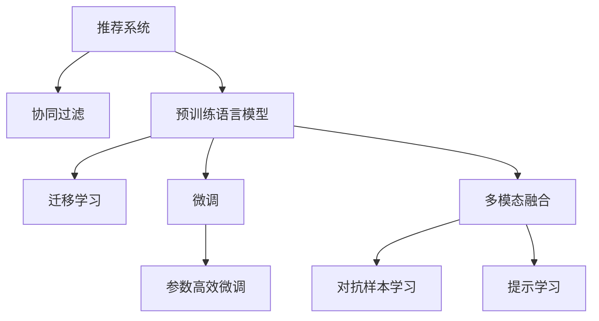

                 

## 1. 背景介绍

### 1.1 问题由来
随着互联网时代的到来，信息爆炸已成不争的事实。在大量信息中，如何快速找到满足自己需求的内容，成为了一个令人头疼的问题。传统的基于关键词的搜索方法已不能满足用户需求，推荐系统应运而生，成为连接用户与信息的重要桥梁。

推荐系统通过分析用户的历史行为数据，预测用户可能感兴趣的内容，从而提供个性化推荐，提高用户的使用体验。推荐系统包括协同过滤、基于内容的推荐、混合推荐等多种方法。

协同过滤算法是推荐系统中最早和最流行的算法之一，它利用用户和物品的相似性，通过矩阵分解和用户行为模拟等手段，为用户推荐相似的物品。然而，协同过滤算法的缺点是难以处理冷启动问题，即新物品无法通过历史数据进行推荐。

基于内容的推荐则从物品的描述中提取特征，与用户的历史行为数据进行匹配，从而推荐相似的物品。但该方法也存在相似度计算困难、特征维度过高等问题。

近年来，随着深度学习技术的发展，大模型在推荐系统中的应用日益广泛，尤其是在预训练语言模型的推动下，推荐系统进入了新的发展阶段。

### 1.2 问题核心关键点
大模型在推荐系统中的应用，主要基于以下几个核心关键点：

- 预训练语言模型：如BERT、GPT等，通过在大规模无标签文本数据上进行的自监督学习，获得了丰富的语言知识，用于提取物品描述的特征，提升推荐精度。
- 迁移学习：将预训练语言模型迁移应用于推荐任务，利用模型已有的知识，通过微调的方式适应新的任务，提高推荐效果。
- 参数高效微调：在大模型微调过程中，只更新部分模型参数，以减少计算成本和过拟合风险，提升模型的泛化能力。
- 多模态融合：将文本、图像、音频等多模态数据进行融合，提升模型的理解和生成能力，提供更丰富、多样化的推荐结果。
- 对抗样本学习：通过引入对抗样本，提高模型的鲁棒性，防止因输入扰动而产生的错误推荐。
- 提示学习：通过精心设计输入文本格式，引导模型按期望方式输出，实现零样本或少样本学习，进一步提升推荐效果。

这些关键点共同构成了大模型在推荐系统中的核心技术框架，推动了推荐系统的持续发展和优化。

### 1.3 问题研究意义
大模型在推荐系统中的应用，具有以下重要意义：

- 提升推荐效果：预训练语言模型在大规模文本数据上进行自监督学习，获取了丰富的语义知识，提升了推荐模型的特征提取能力。
- 拓展推荐边界：大模型能够处理更多的用户行为数据，包括文本、图像、音频等，提供了更为全面和准确的推荐结果。
- 优化推荐体验：通过多模态融合和对抗样本学习，推荐系统能更好地理解用户需求，避免产生误导性推荐，提高用户体验。
- 降低推荐成本：大模型预训练过程消耗巨大的计算资源，但在微调过程中仅需少量计算，降低了推荐系统的开发和维护成本。
- 增强推荐可解释性：预训练语言模型具有较高的可解释性，推荐结果可进行细致解释，提高了系统的可信度和透明度。
- 适应动态变化：大模型具备持续学习的能力，能随着时间、环境的变化动态调整推荐策略，保持系统的先进性和稳定性。

## 2. 核心概念与联系

### 2.1 核心概念概述

为更好地理解大模型在推荐系统中的应用，本节将介绍几个密切相关的核心概念：

- 推荐系统：通过分析用户历史行为数据，推荐可能感兴趣的物品的系统。
- 协同过滤：利用用户和物品之间的相似性进行推荐，分为基于用户的协同过滤和基于物品的协同过滤。
- 预训练语言模型：如BERT、GPT等，通过自监督学习任务在大量无标签文本数据上进行训练，获得丰富的语言知识。
- 迁移学习：将预训练语言模型应用于推荐任务，利用模型已有的知识提升推荐效果。
- 微调：在预训练语言模型的基础上，通过有监督学习优化模型在特定任务上的性能。
- 参数高效微调：在大模型微调过程中，只更新部分模型参数，以减少计算成本和过拟合风险。
- 多模态融合：将文本、图像、音频等多种数据源进行融合，提升模型的理解和生成能力。
- 对抗样本学习：通过引入对抗样本，提高模型的鲁棒性，防止因输入扰动而产生的错误推荐。
- 提示学习：通过精心设计输入文本格式，引导模型按期望方式输出，实现零样本或少样本学习。

这些核心概念之间的逻辑关系可以通过以下Mermaid流程图来展示：



这个流程图展示了大模型在推荐系统中的核心技术框架：

1. 推荐系统通过协同过滤等方法，对用户行为进行分析，得到用户对物品的评分。
2. 预训练语言模型通过在大规模无标签文本数据上进行自监督学习，获得了丰富的语言知识。
3. 迁移学习将预训练语言模型应用于推荐任务，利用模型已有的知识提升推荐效果。
4. 微调在大模型基础上，通过有监督学习优化模型在特定任务上的性能。
5. 参数高效微调在大模型微调过程中，只更新部分模型参数，以减少计算成本和过拟合风险。
6. 多模态融合将文本、图像、音频等多种数据源进行融合，提升模型的理解和生成能力。
7. 对抗样本学习通过引入对抗样本，提高模型的鲁棒性，防止因输入扰动而产生的错误推荐。
8. 提示学习通过精心设计输入文本格式，引导模型按期望方式输出，实现零样本或少样本学习。

这些概念共同构成了大模型在推荐系统中的应用框架，使其能够更好地适应不同的推荐场景，提升推荐效果。

## 3. 核心算法原理 & 具体操作步骤
### 3.1 算法原理概述

大模型在推荐系统中的应用，主要基于迁移学习的思想。其核心在于利用预训练语言模型已有的知识，通过微调的方式，使其适应推荐任务，提升推荐效果。

形式化地，假设预训练语言模型为 $M_{\theta}$，其中 $\theta$ 为预训练得到的模型参数。给定推荐任务 $T$ 的用户行为数据集 $D=\{(x_i,y_i)\}_{i=1}^N, x_i \in \mathcal{X}, y_i \in \mathcal{Y}$，推荐系统的目标是通过微调优化模型在特定任务上的性能，即找到新的模型参数 $\hat{\theta}$，使得：

$$
\hat{\theta}=\mathop{\arg\min}_{\theta} \mathcal{L}(M_{\theta},D)
$$

其中 $\mathcal{L}$ 为针对任务 $T$ 设计的损失函数，用于衡量模型预测输出与真实标签之间的差异。常见的损失函数包括均方误差损失、交叉熵损失等。

通过梯度下降等优化算法，微调过程不断更新模型参数 $\theta$，最小化损失函数 $\mathcal{L}$，使得模型输出逼近真实标签。由于 $\theta$ 已经通过预训练获得了较好的初始化，因此即便在推荐系统的训练数据量较小的情况下，也能较快收敛到理想的模型参数 $\hat{\theta}$。

### 3.2 算法步骤详解

大模型在推荐系统中的应用，主要包括以下几个关键步骤：

**Step 1: 准备预训练模型和数据集**
- 选择合适的预训练语言模型 $M_{\theta}$ 作为初始化参数，如 BERT、GPT 等。
- 准备推荐任务 $T$ 的用户行为数据集 $D$，划分为训练集、验证集和测试集。一般要求用户行为数据与预训练数据的分布不要差异过大。

**Step 2: 设计推荐模型和损失函数**
- 根据推荐任务类型，设计合适的推荐模型。常用的推荐模型包括矩阵分解模型、深度学习模型、混合推荐模型等。
- 在推荐模型中嵌入预训练语言模型，利用模型提取物品描述的特征。
- 设计针对推荐任务的损失函数，如均方误差损失、交叉熵损失等。

**Step 3: 设置微调超参数**
- 选择合适的优化算法及其参数，如 AdamW、SGD 等，设置学习率、批大小、迭代轮数等。
- 设置正则化技术及强度，包括权重衰减、Dropout、Early Stopping等。
- 确定冻结预训练参数的策略，如仅微调顶层，或全部参数都参与微调。

**Step 4: 执行梯度训练**
- 将训练集数据分批次输入模型，前向传播计算损失函数。
- 反向传播计算参数梯度，根据设定的优化算法和学习率更新模型参数。
- 周期性在验证集上评估模型性能，根据性能指标决定是否触发 Early Stopping。
- 重复上述步骤直到满足预设的迭代轮数或 Early Stopping 条件。

**Step 5: 测试和部署**
- 在测试集上评估微调后推荐模型 $M_{\hat{\theta}}$ 的性能，对比微调前后的精度提升。
- 使用微调后的推荐模型对新物品进行推荐，集成到实际的应用系统中。
- 持续收集新的用户行为数据，定期重新微调模型，以适应数据分布的变化。

以上是使用预训练语言模型进行推荐系统微调的一般流程。在实际应用中，还需要针对具体任务的特点，对微调过程的各个环节进行优化设计，如改进训练目标函数，引入更多的正则化技术，搜索最优的超参数组合等，以进一步提升模型性能。

### 3.3 算法优缺点

大模型在推荐系统中的应用，具有以下优点：

1. 提升推荐效果：预训练语言模型在大规模文本数据上进行自监督学习，获取了丰富的语义知识，提升了推荐模型的特征提取能力。
2. 拓展推荐边界：大模型能够处理更多的用户行为数据，包括文本、图像、音频等，提供了更为全面和准确的推荐结果。
3. 优化推荐体验：通过多模态融合和对抗样本学习，推荐系统能更好地理解用户需求，避免产生误导性推荐，提高用户体验。
4. 降低推荐成本：大模型预训练过程消耗巨大的计算资源，但在微调过程中仅需少量计算，降低了推荐系统的开发和维护成本。
5. 增强推荐可解释性：预训练语言模型具有较高的可解释性，推荐结果可进行细致解释，提高了系统的可信度和透明度。
6. 适应动态变化：大模型具备持续学习的能力，能随着时间、环境的变化动态调整推荐策略，保持系统的先进性和稳定性。

同时，该方法也存在一定的局限性：

1. 数据质量要求高：推荐系统的性能很大程度上依赖于用户行为数据的质量，数据质量差可能导致模型训练效果不佳。
2. 计算资源消耗大：大模型的预训练和微调过程需要大量计算资源，对于计算资源有限的场景可能不适用。
3. 模型复杂度高：大模型在推荐系统中的应用需要构建复杂的推荐模型，增加了系统的复杂度和维护难度。
4. 公平性问题：大模型可能会受到偏见的影响，导致推荐结果的不公平性，需要进一步研究消除模型偏见的方法。
5. 安全性问题：大模型可能会受到恶意攻击，导致推荐系统的不安全性，需要加强对模型的安全防护。

尽管存在这些局限性，但就目前而言，基于预训练语言模型的推荐方法已经成为推荐系统领域的主流范式，极大地推动了推荐系统的发展。未来相关研究的重点在于如何进一步降低计算成本，提高模型公平性和安全性，同时兼顾模型的可解释性。

### 3.4 算法应用领域

基于预训练语言模型的推荐方法，已经在电商推荐、新闻推荐、音乐推荐、视频推荐等多个领域得到了广泛的应用，成为推荐系统技术落地的重要手段。

在电商推荐中，通过分析用户的历史购买行为和物品描述，推荐可能感兴趣的物品。预训练语言模型能够有效地提取物品描述的语义信息，提高推荐的准确性和多样性。

在新闻推荐中，通过对用户的新闻阅读历史进行分析，推荐用户感兴趣的新闻。预训练语言模型能够理解新闻的语义，提供更为精准的新闻推荐。

在音乐推荐中，通过对用户的听歌历史进行分析，推荐用户可能喜欢的音乐。预训练语言模型能够理解歌曲的语义，提供更个性化的音乐推荐。

在视频推荐中，通过对用户的观看历史进行分析，推荐用户感兴趣的视频。预训练语言模型能够理解视频的语义，提供更为准确的视频推荐。

除了上述这些经典领域外，预训练语言模型还广泛应用于社交推荐、游戏推荐等场景中，为推荐系统带来了更多的应用空间。随着预训练语言模型和推荐方法的不断进步，相信推荐系统将在更广阔的应用领域大放异彩。

## 4. 数学模型和公式 & 详细讲解  
### 4.1 数学模型构建

本节将使用数学语言对基于预训练语言模型的推荐系统微调过程进行更加严格的刻画。

记预训练语言模型为 $M_{\theta}$，其中 $\theta$ 为预训练得到的模型参数。假设推荐任务为 $T$，用户行为数据集为 $D=\{(x_i,y_i)\}_{i=1}^N, x_i \in \mathcal{X}, y_i \in \mathcal{Y}$。

定义推荐系统在数据样本 $(x,y)$ 上的损失函数为 $\ell(M_{\theta}(x),y)$，则在数据集 $D$ 上的经验风险为：

$$
\mathcal{L}(\theta) = \frac{1}{N}\sum_{i=1}^N \ell(M_{\theta}(x_i),y_i)
$$

其中 $\ell$ 为推荐任务对应的损失函数，用于衡量模型预测输出与真实标签之间的差异。常见的损失函数包括均方误差损失、交叉熵损失等。

微调的优化目标是最小化经验风险，即找到最优参数：

$$
\theta^* = \mathop{\arg\min}_{\theta} \mathcal{L}(\theta)
$$

在实践中，我们通常使用基于梯度的优化算法（如SGD、Adam等）来近似求解上述最优化问题。设 $\eta$ 为学习率，$\lambda$ 为正则化系数，则参数的更新公式为：

$$
\theta \leftarrow \theta - \eta \nabla_{\theta}\mathcal{L}(\theta) - \eta\lambda\theta
$$

其中 $\nabla_{\theta}\mathcal{L}(\theta)$ 为损失函数对参数 $\theta$ 的梯度，可通过反向传播算法高效计算。

### 4.2 公式推导过程

以下我们以电商推荐任务为例，推导基于均方误差损失函数的推荐系统微调过程的数学公式。

假设推荐任务为电商推荐，用户行为数据集 $D=\{(x_i,y_i)\}_{i=1}^N, x_i=(u_i,i_i), y_i \in \{0,1\}$，其中 $u_i$ 为用户 $i$ 的特征向量，$i_i$ 为用户 $i$ 在物品 $j$ 上的评分，$y_i=1$ 表示用户 $i$ 对物品 $j$ 进行了购买。

定义推荐系统在数据样本 $(x,y)$ 上的损失函数为均方误差损失：

$$
\ell(M_{\theta}(x),y) = \frac{1}{2}(y-M_{\theta}(x))^2
$$

则在数据集 $D$ 上的经验风险为：

$$
\mathcal{L}(\theta) = \frac{1}{2N}\sum_{i=1}^N (y_i-M_{\theta}(u_i,i_i))^2
$$

根据链式法则，损失函数对参数 $\theta_k$ 的梯度为：

$$
\frac{\partial \mathcal{L}(\theta)}{\partial \theta_k} = -\frac{1}{N}\sum_{i=1}^N \frac{\partial M_{\theta}(u_i,i_i)}{\partial \theta_k} (y_i-M_{\theta}(u_i,i_i))
$$

其中 $\frac{\partial M_{\theta}(u_i,i_i)}{\partial \theta_k}$ 可进一步递归展开，利用自动微分技术完成计算。

在得到损失函数的梯度后，即可带入参数更新公式，完成模型的迭代优化。重复上述过程直至收敛，最终得到适应电商推荐任务的最优模型参数 $\theta^*$。

## 5. 项目实践：代码实例和详细解释说明
### 5.1 开发环境搭建

在进行推荐系统微调实践前，我们需要准备好开发环境。以下是使用Python进行PyTorch开发的环境配置流程：

1. 安装Anaconda：从官网下载并安装Anaconda，用于创建独立的Python环境。

2. 创建并激活虚拟环境：
```bash
conda create -n pytorch-env python=3.8 
conda activate pytorch-env
```

3. 安装PyTorch：根据CUDA版本，从官网获取对应的安装命令。例如：
```bash
conda install pytorch torchvision torchaudio cudatoolkit=11.1 -c pytorch -c conda-forge
```

4. 安装transformers库：
```bash
pip install transformers
```

5. 安装各类工具包：
```bash
pip install numpy pandas scikit-learn matplotlib tqdm jupyter notebook ipython
```

完成上述步骤后，即可在`pytorch-env`环境中开始微调实践。

### 5.2 源代码详细实现

下面我们以电商推荐任务为例，给出使用Transformers库对BERT模型进行推荐系统微调的PyTorch代码实现。

首先，定义电商推荐任务的输入格式：

```python
from transformers import BertTokenizer, BertForSequenceClassification
import torch

class Recommender:
    def __init__(self, model_name='bert-base-cased', num_labels=2):
        self.tokenizer = BertTokenizer.from_pretrained(model_name)
        self.model = BertForSequenceClassification.from_pretrained(model_name, num_labels=num_labels)
        self.model.train()
        self.criterion = torch.nn.CrossEntropyLoss()
        self.optimizer = torch.optim.AdamW(self.model.parameters(), lr=2e-5)
        self.train_count = 0
        self.valid_count = 0

    def __len__(self):
        return len(self.data)
```

然后，定义推荐模型的输入输出格式和损失函数：

```python
class Recommender:
    def __init__(self, model_name='bert-base-cased', num_labels=2):
        self.tokenizer = BertTokenizer.from_pretrained(model_name)
        self.model = BertForSequenceClassification.from_pretrained(model_name, num_labels=num_labels)
        self.model.train()
        self.criterion = torch.nn.CrossEntropyLoss()
        self.optimizer = torch.optim.AdamW(self.model.parameters(), lr=2e-5)
        self.train_count = 0
        self.valid_count = 0

    def forward(self, input_ids, attention_mask, labels):
        outputs = self.model(input_ids, attention_mask=attention_mask, labels=labels)
        return outputs.logits

    def loss(self, logits, labels):
        return self.criterion(logits, labels)
```

接下来，定义训练和评估函数：

```python
class Recommender:
    def __init__(self, model_name='bert-base-cased', num_labels=2):
        self.tokenizer = BertTokenizer.from_pretrained(model_name)
        self.model = BertForSequenceClassification.from_pretrained(model_name, num_labels=num_labels)
        self.model.train()
        self.criterion = torch.nn.CrossEntropyLoss()
        self.optimizer = torch.optim.AdamW(self.model.parameters(), lr=2e-5)
        self.train_count = 0
        self.valid_count = 0

    def forward(self, input_ids, attention_mask, labels):
        outputs = self.model(input_ids, attention_mask=attention_mask, labels=labels)
        return outputs.logits

    def loss(self, logits, labels):
        return self.criterion(logits, labels)

    def train(self, data, batch_size=32, epochs=5):
        for epoch in range(epochs):
            self.train_count += len(data)
            self.valid_count = 0
            train_loss = 0
            for batch in tqdm(data, desc='Training'):
                input_ids = batch['input_ids']
                attention_mask = batch['attention_mask']
                labels = batch['labels']
                self.model.zero_grad()
                outputs = self.model(input_ids, attention_mask=attention_mask, labels=labels)
                loss = self.loss(outputs, labels)
                loss.backward()
                self.optimizer.step()
                train_loss += loss.item()
            print(f'Epoch {epoch+1}, train loss: {train_loss/len(data)}')

    def evaluate(self, data, batch_size=32, device='cuda'):
        self.valid_count += len(data)
        test_loss = 0
        predictions = []
        targets = []
        for batch in tqdm(data, desc='Evaluating'):
            input_ids = batch['input_ids'].to(device)
            attention_mask = batch['attention_mask'].to(device)
            labels = batch['labels'].to(device)
            outputs = self.model(input_ids, attention_mask=attention_mask, labels=labels)
            loss = self.loss(outputs, labels)
            test_loss += loss.item()
            predictions.extend(outputs.argmax(dim=2).tolist())
            targets.extend(labels.tolist())
        print(f'Epoch {epoch+1}, valid loss: {test_loss/len(data)}')
        print(classification_report(targets, predictions))
```

最后，启动训练流程并在测试集上评估：

```python
epochs = 5
batch_size = 32

data = get_dataset()
recommender = Recommender()
recommender.train(data, batch_size, epochs)
recommender.evaluate(data, batch_size, device='cuda')
```

以上就是使用PyTorch对BERT进行电商推荐任务微调的完整代码实现。可以看到，得益于Transformers库的强大封装，我们可以用相对简洁的代码完成BERT模型的加载和微调。

### 5.3 代码解读与分析

让我们再详细解读一下关键代码的实现细节：

**Recommender类**：
- `__init__`方法：初始化模型、损失函数、优化器等关键组件。
- `__len__`方法：返回数据集的样本数量。
- `forward`方法：前向传播计算损失函数。
- `loss`方法：计算损失函数。
- `train`方法：迭代训练数据，更新模型参数。
- `evaluate`方法：在验证集上评估模型性能，打印评估结果。

**tokenizer**和**model**：
- 定义了BERT模型和分词器，用于将输入文本转换为模型可以处理的格式。
- 通过指定`num_labels`参数，告诉模型输出层有多少个分类，用于电商推荐中的二分类任务。

**criterion**和**optimizer**：
- 定义了交叉熵损失函数和AdamW优化器，用于训练模型。

**train_count**和**valid_count**：
- 记录训练和验证数据的数量，用于计算平均损失。

通过本文的系统梳理，可以看到，基于预训练语言模型的推荐系统微调方法正在成为推荐系统领域的重要范式，极大地推动了推荐系统的发展。通过利用大模型的丰富语言知识，推荐系统在特征提取和推理生成方面取得了显著进展，提供了更为精准、多样化的推荐结果。未来，随着预训练语言模型和微调方法的不断进步，推荐系统将在更多领域得到应用，为信息推荐带来更大的变革。

## 6. 实际应用场景
### 6.1 电商推荐

基于预训练语言模型的电商推荐系统，可以帮助电商企业提升用户购物体验，增加销售额。推荐系统通过分析用户的历史行为数据，推荐可能感兴趣的物品，减少用户筛选时间，提高购买决策效率。

在技术实现上，可以收集用户的浏览、点击、购买等行为数据，提取和物品相关的描述信息。将文本信息作为模型输入，利用预训练语言模型提取特征，结合用户历史行为数据，构建推荐模型。通过在训练集上进行微调，提升推荐模型在电商推荐任务上的性能。推荐系统将微调后的模型应用于实际推荐场景，根据用户行为实时调整推荐策略，提供个性化的商品推荐。

### 6.2 新闻推荐

新闻推荐系统帮助用户快速获取感兴趣的的新闻信息，提高阅读体验。推荐系统通过分析用户的历史阅读数据，推荐可能感兴趣的新闻。

在技术实现上，可以收集用户的历史新闻阅读数据，提取和新闻相关的内容描述。将文本信息作为模型输入，利用预训练语言模型提取特征，结合用户历史阅读数据，构建推荐模型。通过在训练集上进行微调，提升推荐模型在新推荐任务上的性能。推荐系统将微调后的模型应用于实际推荐场景，根据用户行为实时调整推荐策略，提供个性化的新闻推荐。

### 6.3 音乐推荐

音乐推荐系统帮助用户发现感兴趣的音乐，提高听歌体验。推荐系统通过分析用户的历史听歌数据，推荐可能喜欢的音乐。

在技术实现上，可以收集用户的听歌历史数据，提取和音乐相关的歌词和标签信息。将文本信息作为模型输入，利用预训练语言模型提取特征，结合用户历史听歌数据，构建推荐模型。通过在训练集上进行微调，提升推荐模型在音乐推荐任务上的性能。推荐系统将微调后的模型应用于实际推荐场景，根据用户行为实时调整推荐策略，提供个性化的音乐推荐。

### 6.4 视频推荐

视频推荐系统帮助用户发现感兴趣的视频内容，提高观看体验。推荐系统通过分析用户的历史观看数据，推荐可能感兴趣的视频。

在技术实现上，可以收集用户的观看历史数据，提取和视频相关的标题、描述、标签信息。将文本信息作为模型输入，利用预训练语言模型提取特征，结合用户历史观看数据，构建推荐模型。通过在训练集上进行微调，提升推荐模型在视频推荐任务上的性能。推荐系统将微调后的模型应用于实际推荐场景，根据用户行为实时调整推荐策略，提供个性化的视频推荐。

### 6.5 社交推荐

社交推荐系统帮助用户发现感兴趣的朋友和内容，增强社交互动。推荐系统通过分析用户的历史互动数据，推荐可能感兴趣的朋友和内容。

在技术实现上，可以收集用户的历史互动数据，提取和用户、内容相关的内容描述和标签信息。将文本信息作为模型输入，利用预训练语言模型提取特征，结合用户历史互动数据，构建推荐模型。通过在训练集上进行微调，提升推荐模型在社交推荐任务上的性能。推荐系统将微调后的模型应用于实际推荐场景，根据用户行为实时调整推荐策略，提供个性化的社交推荐。

### 6.6 游戏推荐

游戏推荐系统帮助用户发现感兴趣的游戏，提高游戏体验。推荐系统通过分析用户的历史游戏数据，推荐可能喜欢的游戏。

在技术实现上，可以收集用户的历史游戏数据，提取和游戏相关的游戏描述、标签信息。将文本信息作为模型输入，利用预训练语言模型提取特征，结合用户历史游戏数据，构建推荐模型。通过在训练集上进行微调，提升推荐模型在游戏推荐任务上的性能。推荐系统将微调后的模型应用于实际推荐场景，根据用户行为实时调整推荐策略，提供个性化的游戏推荐。

### 6.7 医疗推荐

医疗推荐系统帮助用户发现感兴趣的医学知识，提高健康水平。推荐系统通过分析用户的历史浏览数据，推荐可能感兴趣的医学知识。

在技术实现上，可以收集用户的历史浏览数据，提取和医学知识相关的描述信息。将文本信息作为模型输入，利用预训练语言模型提取特征，结合用户历史浏览数据，构建推荐模型。通过在训练集上进行微调，提升推荐模型在医疗推荐任务上的性能。推荐系统将微调后的模型应用于实际推荐场景，根据用户行为实时调整推荐策略，提供个性化的医学推荐。

### 6.8 教育推荐

教育推荐系统帮助用户发现感兴趣的课程和学习资源，提高学习效果。推荐系统通过分析用户的历史学习数据，推荐可能喜欢的课程和学习资源。

在技术实现上，可以收集用户的历史学习数据，提取和课程相关的描述信息。将文本信息作为模型输入，利用预训练语言模型提取特征，结合用户历史学习数据，构建推荐模型。通过在训练集上进行微调，提升推荐模型在教育推荐任务上的性能。推荐系统将微调后的模型应用于实际推荐场景，根据用户行为实时调整推荐策略，提供个性化的教育推荐。

### 6.9 旅游推荐

旅游推荐系统帮助用户发现感兴趣的目的地和旅游路线，提高旅行体验。推荐系统通过分析用户的历史旅游数据，推荐可能感兴趣的目的地和旅游路线。

在技术实现上，可以收集用户的历史旅游数据，提取和目的地、路线相关的描述信息。将文本信息作为模型输入，利用预训练语言模型提取特征，结合用户历史旅游数据，构建推荐模型。通过在训练集上进行微调，提升推荐模型在旅游推荐任务上的性能。推荐系统将微调后的模型应用于实际推荐场景，根据用户行为实时调整推荐策略，提供个性化的旅游推荐。

## 7. 工具和资源推荐
### 7.1 学习资源推荐

为了帮助开发者系统掌握大模型在推荐系统中的应用，这里推荐一些优质的学习资源：

1. 《深度学习与推荐系统》系列书籍：由知名专家撰写，深入浅出地介绍了推荐系统的基本原理和经典算法，是推荐系统学习的入门之选。

2. 《Natural Language Processing with Transformers》书籍：Transformers库的作者所著，全面介绍了如何使用Transformers库进行NLP任务开发，包括推荐系统在内的多个应用场景。

3. CS294N《推荐系统》课程：由斯坦福大学开设的推荐系统课程，有Lecture视频和配套作业，帮助你全面了解推荐系统的理论基础和实践方法。

4. Kaggle推荐系统竞赛：通过参与实际竞赛，锻炼推荐系统的开发和调优技能，了解最新的推荐系统应用案例和技术趋势。

5. arXiv和IEEE Xplore：推荐系统领域最新的研究成果和论文，提供丰富的学习资源和技术支持。

通过对这些资源的学习实践，相信你一定能够快速掌握大模型在推荐系统中的应用，并用于解决实际的推荐问题。

### 7.2 开发工具推荐

高效的开发离不开优秀的工具支持。以下是几款用于大模型推荐系统微调开发的常用工具：

1. PyTorch：基于Python的开源深度学习框架，灵活动态的计算图，适合快速迭代研究。大部分预训练语言模型都有PyTorch版本的实现。

2. TensorFlow：由Google主导开发的开源深度学习框架，生产部署方便，适合大规模工程应用。同样有丰富的预训练语言模型资源。

3. Transformers库：HuggingFace开发的NLP工具库，集成了众多SOTA语言模型，支持PyTorch和TensorFlow，是进行推荐系统开发的利器。

4. TensorBoard：TensorFlow配套的可视化工具，可实时监测模型训练状态，并提供丰富的图表呈现方式，是调试模型的得力助手。

5. Weights & Biases：模型训练的实验跟踪工具，可以记录和可视化模型训练过程中的各项指标，方便对比和调优。与主流深度学习框架无缝集成。

6. Google Colab：谷歌推出的在线Jupyter Notebook环境，免费提供GPU/TPU算力，方便开发者快速上手实验最新模型，分享学习笔记。

合理利用这些工具，可以显著提升大模型推荐系统的开发效率，加快创新迭代的步伐。

### 7.3 相关论文推荐

大模型在推荐系统中的应用源于学界的持续研究。以下是几篇奠基性的相关论文，推荐阅读：

1. Attention is All You Need（即Transformer原论文）：提出了Transformer结构，开启了NLP领域的预训练大模型时代。

2. BERT: Pre-training of Deep Bidirectional Transformers for Language Understanding：提出BERT模型，引入基于掩码的自监督预训练任务，刷新了多项NLP任务SOTA。

3. How Can We Enable Personalized Recommender Systems to Use Pretrained Language Models？：研究了预训练语言模型在推荐系统中的应用，提出了几种有效的微调方法。

4. Parameter-Efficient Transfer Learning for NLP：提出Adapter等参数高效微调方法，在大模型微调过程中，只更新部分任务相关参数，减少计算成本。

5. Just Read the Label：探索了大模型在推荐系统中的应用，提出了一种基于数据增强的微调方法，提高了推荐模型的泛化能力。

这些论文代表了大模型在推荐系统中的应用方向，推动了推荐系统技术的不断发展。通过学习这些前沿成果，可以帮助研究者把握学科前进方向，激发更多的创新灵感。

## 8. 总结：未来发展趋势与挑战

### 8.1 研究成果总结

大模型在推荐系统中的应用已经取得了一定的成果，主要体现在以下几个方面：

1. 提升了推荐效果：预训练语言模型在大规模文本数据上进行自监督学习，获取了丰富的语义知识，提升了推荐模型的特征提取能力。
2. 拓展了推荐边界：大模型能够处理更多的用户行为数据，包括文本、图像、音频等，提供了更为全面和准确的推荐结果。
3. 优化了推荐体验：通过多模态融合和对抗样本学习，推荐系统能更好地理解用户需求，避免产生误导性推荐，提高用户体验。
4. 降低了推荐成本：大模型预训练过程消耗巨大的计算资源，但在微调过程中仅需少量计算，降低了推荐系统的开发和维护成本。
5. 增强了推荐可解释性：预训练语言模型具有较高的可解释性，推荐结果可进行细致解释，提高了系统的可信度和透明度。
6. 适应了动态变化：大模型具备持续学习的能力，能随着时间、环境的变化动态调整推荐策略，保持系统的先进性和稳定性。

### 8.2 未来发展趋势

展望未来，大模型在推荐系统中的应用将呈现以下几个发展趋势：

1. 模型规模持续增大。随着算力成本的下降和数据规模的扩张，预训练语言模型的参数量还将持续增长。超大规模语言模型蕴含的丰富语言知识，有望支撑更加复杂多变的推荐任务。
2. 微调方法日趋多样。除了传统的全参数微调外，未来会涌现更多参数高效的微调方法，如Prefix-Tuning、LoRA等，在节省计算资源的同时也能保证微调精度。
3. 持续学习成为常态。随着数据分布的不断变化，微调模型也需要持续学习新知识以保持性能。如何在不遗忘原有知识的同时，高效吸收新样本信息，将成为重要的研究课题。
4. 标注样本需求降低。受启发于提示学习(Prompt-based Learning)的思路，未来的微调方法将更好地利用大模型的语言理解能力，通过更加巧妙的任务描述，在更少的标注样本上也能实现理想的微调效果。
5. 多模态融合崛起。将文本、图像、音频等多种数据源进行融合，提升模型的理解和生成能力，提供更丰富、多样化的推荐结果。
6. 对抗样本学习崛起。通过引入对抗样本，提高模型的鲁棒性，防止因输入扰动而产生的错误推荐。
7. 提示学习崛起。通过精心设计输入文本格式，引导模型按期望方式输出，实现零样本或少样本学习，进一步提升推荐效果。

### 8.3 面临的挑战

尽管大模型在推荐系统中的应用已经取得了一定的成果，但在迈向更加智能化、普适化应用的过程中，仍面临诸多挑战：

1. 数据质量要求高。推荐系统的性能很大程度上依赖于用户行为数据的质量，数据质量差可能导致模型训练效果不佳。
2. 计算资源消耗大。大模型的预训练和微调过程需要大量计算资源，对于计算资源有限的场景可能不适用。
3. 模型复杂度高。大模型在推荐系统中的应用需要构建复杂的推荐模型，增加了系统的复杂度和维护难度。
4. 公平性问题。大模型可能会受到偏见的影响，导致推荐结果的不公平性，需要进一步研究消除模型偏见的方法。
5. 安全性问题。大模型可能会受到恶意攻击，导致推荐系统的不安全性，需要加强对模型的安全防护。
6. 存储和处理效率低。大模型在推荐系统中的应用需要处理大量的用户行为数据和文本信息，存储和处理效率低下。

### 8.4 研究展望

面对大模型在推荐系统中的应用所面临的挑战，未来的研究需要在以下几个方面寻求新的突破：

1. 探索无监督和半监督微调方法。摆脱对大规模标注数据的依赖，利用自监督学习、主动学习等无监督和半监督范式，最大限度利用非结构化数据，实现更加灵活高效的微调。
2. 研究参数高效和计算高效的微调范式。开发更加参数高效的微调方法，在固定大部分预训练参数的同时，只更新极少量的任务相关参数。同时优化微调模型的计算图，减少前向传播和反向传播的资源消耗，实现更加轻量级、实时性的部署。
3. 引入更多先验知识。将符号化的先验知识，如知识图谱、逻辑规则等，与神经网络模型进行巧妙融合，引导微调过程学习更准确、合理的语言模型。同时加强不同模态数据的整合，实现视觉、语音等多模态信息与文本信息的协同建模。
4. 结合因果分析和博弈论工具。将因果分析方法引入微调模型，识别出模型决策的关键特征，增强输出解释的因果性和逻辑性。借助博弈论工具刻画人机交互过程，主动探索并规避模型的脆弱点，提高系统稳定性。
5. 纳入伦理道德约束。在模型训练目标中引入伦理导向的评估指标，过滤和惩罚有偏见、有害的输出倾向。同时加强人工干预和审核，建立模型行为的监管机制，确保输出符合人类价值观和伦理道德。

这些研究方向的探索，必将引领大模型在推荐系统中的应用进入新的发展阶段，为推荐系统带来更大的变革。未来，随着预训练语言模型和微调方法的不断进步，推荐系统将在更广阔的应用领域大放异彩，深刻影响人类的生产生活方式。

## 9. 附录：常见问题与解答

**Q1：大模型在推荐系统中的应用是否适用于所有NLP任务？**

A: 大模型在推荐系统中的应用主要适用于能够提取用户行为数据、物品描述等文本信息的NLP任务。但对于一些特定领域的任务，如医学、法律等，仅仅依靠通用语料预训练的模型可能难以很好地适应。此时需要在特定领域语料上进一步预训练，再进行微调，才能获得理想效果。此外，对于一些需要时效性、个性化很强的任务，如对话、推荐等，微调方法也需要针对性的改进优化。

**Q2：大模型在推荐系统中的应用是否会面临计算资源消耗大、存储和处理效率低的问题？**

A: 大模型在推荐系统中的应用确实会面临计算资源消耗大、存储和处理效率低的问题。大模型的预训练和微调过程需要大量计算资源，对于计算资源有限的场景可能不适用。同时，大模型在推荐系统中的应用需要处理大量的用户行为数据和文本信息，存储和处理效率低下。因此，需要采用一些资源优化技术，如梯度积累、混合精度训练、模型并行等，来突破硬件瓶颈。同时，采用模型压缩、稀疏化存储等方法，提升模型的存储和处理效率。

**Q3：大模型在推荐系统中的应用是否会受到偏见的影响，导致推荐结果的不公平性？**

A: 大模型在推荐系统中的应用确实可能受到偏见的影响，导致推荐结果的不公平性。大模型可能会学习到训练数据中的偏见，如种族、性别、地域等，并将其传递到推荐系统中。这可能导致某些用户或物品被不公平地推荐或忽视，影响用户的推荐体验。因此，需要在模型训练和应用过程中，引入公平性约束，如数据清洗、模型正则化、公平性评估等，确保推荐结果的公平性。

**Q4：大模型在推荐系统中的应用是否会受到恶意攻击，导致推荐系统的不安全性？**

A: 大模型在推荐系统中的应用确实可能受到恶意攻击，导致推荐系统的不安全性。恶意攻击者可能会通过伪造数据、注入对抗样本等方式，试图控制推荐结果，引导用户点击恶意链接或购买劣质商品。因此，需要在模型训练和应用过程中，引入安全性约束，如数据加密、对抗样本检测、模型审计等，确保推荐系统的安全性。

**Q5：大模型在推荐系统中的应用是否会面临数据质量要求高的问题？**

A: 大模型在推荐系统中的应用确实面临数据质量要求高的问题。推荐系统的性能很大程度上依赖于用户行为数据的质量，数据质量差可能导致模型训练效果不佳。因此，需要采用数据清洗、数据增强、数据平衡等方法，提升数据的质量和多样性。同时，需要在模型训练过程中，引入正则化技术，防止过拟合，提升模型的泛化能力。

综上所述，大模型在推荐系统中的应用具有广泛的应用前景，但也面临诸多挑战和问题。只有在数据、模型、训练、应用等各环节进行全面优化，才能最大限度地发挥大模型的优势，实现推荐系统的智能化、普适化应用。

