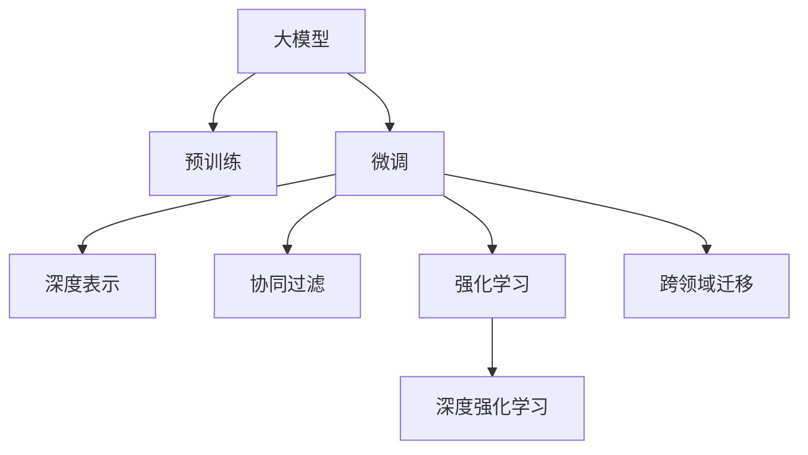

                 

# 大模型在推荐系统反馈循环中的作用

> 关键词：大模型, 推荐系统, 反馈循环, 协同过滤, 深度学习, 强化学习, 强化推荐, 深度强化学习

## 1. 背景介绍

### 1.1 问题由来
推荐系统是互联网时代的重要组成部分，通过分析用户历史行为数据，为用户推荐感兴趣的物品。早期的推荐系统主要依赖协同过滤、内容推荐等传统技术，但这些方法在应对数据稀疏性和冷启动问题上存在局限。大模型的出现，为推荐系统带来了全新的思路和可能性。

### 1.2 问题核心关键点
大模型在推荐系统中的应用，主要体现在以下几个方面：

- **预训练与微调**：利用大规模无标签数据预训练语言模型，通过微调优化模型在推荐场景中的性能。
- **深度表示学习**：通过大模型学习用户行为和物品特征的高维表示，提升推荐系统的表达能力。
- **联合训练**：将推荐模型与用户行为数据联合训练，利用大模型自监督学习能力优化推荐模型。
- **强化推荐**：结合强化学习，构建反馈循环，优化推荐模型的决策策略。
- **跨领域迁移**：利用大模型的跨领域迁移能力，在推荐系统之间共享知识和表示，提升推荐效果。

这些关键点构成了大模型在推荐系统中的核心作用，为推荐系统提供了更高效、更灵活、更精准的解决方案。

## 2. 核心概念与联系

### 2.1 核心概念概述

为更好地理解大模型在推荐系统中的作用，本节将介绍几个密切相关的核心概念：

- **大模型(Large Model)**：指具有亿级参数规模的深度学习模型，如BERT、GPT等，通过大规模预训练学习通用的语言表示。
- **协同过滤(Collaborative Filtering)**：通过分析用户和物品之间的相似性，为用户推荐相似的物品。传统的协同过滤方法包括基于用户的协同过滤和基于物品的协同过滤。
- **深度学习(Deep Learning)**：通过构建多层次的神经网络模型，学习数据的深层表示。深度学习在推荐系统中主要用于用户行为和物品特征的表示学习。
- **强化学习(Reinforcement Learning)**：通过奖励机制，优化模型在特定任务上的决策策略。强化学习在推荐系统中用于优化推荐模型的反馈机制，提升推荐的精准度和用户满意度。
- **深度强化学习(Deep Reinforcement Learning)**：将深度学习和强化学习结合，构建更复杂的决策策略。深度强化学习在推荐系统中用于优化复杂推荐场景的决策过程。
- **跨领域迁移(Cross-Domain Transfer)**：利用大模型的跨领域迁移能力，将知识从一个领域迁移到另一个领域，提升推荐效果。

这些概念之间的逻辑关系可以通过以下Mermaid流程图来展示：



这个流程图展示了大模型在推荐系统中的核心概念及其之间的关系：

1. 大模型通过预训练获得基础能力。
2. 微调优化模型在推荐场景中的性能。
3. 深度表示学习提升模型表达能力。
4. 协同过滤基于用户和物品相似性推荐物品。
5. 强化学习优化推荐决策策略。
6. 深度强化学习结合深度学习与强化学习，构建更复杂的决策过程。
7. 跨领域迁移在不同推荐场景间共享知识。

这些概念共同构成了大模型在推荐系统中的应用框架，使得推荐系统能够更好地理解和推荐用户感兴趣的内容。

## 3. 核心算法原理 & 具体操作步骤
### 3.1 算法原理概述

大模型在推荐系统中的核心算法原理，主要是基于深度学习与强化学习的融合，构建一个反馈循环，不断优化推荐决策。具体而言，大模型在推荐系统中的作用分为以下几个步骤：

1. **预训练**：利用大规模无标签数据预训练大模型，学习通用的语言表示。
2. **微调**：在推荐数据集上对大模型进行微调，优化其在推荐任务中的表现。
3. **深度表示学习**：通过大模型学习用户行为和物品特征的高维表示，提升推荐系统的表达能力。
4. **联合训练**：将推荐模型与用户行为数据联合训练，利用大模型自监督学习能力优化推荐模型。
5. **强化推荐**：结合强化学习，构建反馈循环，优化推荐模型的决策策略。

### 3.2 算法步骤详解

以深度强化推荐为例，描述大模型在推荐系统中的具体操作步骤：

**Step 1: 准备数据集**

- 收集用户历史行为数据，包括浏览、点击、购买等行为。
- 将用户行为转换为模型可理解的数据格式，如词嵌入、one-hot编码等。
- 将物品特征转换为向量表示，便于大模型进行深度表示学习。

**Step 2: 构建深度强化推荐模型**

- 利用大模型学习用户行为和物品特征的表示。
- 定义推荐决策策略，如基于用户-物品相似性的推荐策略，或基于深度表示的协同过滤策略。
- 定义奖励函数，衡量推荐策略的好坏，如点击率、转化率等。
- 设计强化学习算法，如Q-Learning、DQN等，用于优化推荐决策策略。

**Step 3: 微调模型**

- 在推荐数据集上对模型进行微调，优化其在推荐任务中的表现。
- 利用大模型的自监督学习能力，联合训练推荐模型与用户行为数据。
- 定期评估模型的推荐效果，根据反馈调整模型参数，优化推荐策略。

**Step 4: 反馈循环**

- 在实际推荐场景中，根据用户反馈不断调整推荐策略，优化推荐效果。
- 利用强化学习算法，不断优化推荐模型，提升推荐精准度和用户满意度。
- 通过用户反馈循环，更新模型参数，实现推荐策略的动态调整。

### 3.3 算法优缺点

大模型在推荐系统中的应用具有以下优点：

1. **表达能力强**：大模型能够学习高维度的用户行为和物品特征表示，提升推荐系统的表达能力。
2. **泛化性强**：通过预训练和微调，大模型能够适应各种推荐场景，提升推荐系统的泛化能力。
3. **优化效果好**：结合强化学习，大模型能够优化推荐策略，提升推荐精准度和用户满意度。

同时，该方法也存在一定的局限性：

1. **数据依赖性强**：大模型需要大量的用户行为数据进行训练，对数据质量要求高。
2. **计算资源消耗大**：大模型的训练和推理需要大量的计算资源，对硬件设备要求高。
3. **模型复杂度高**：大模型结构复杂，需要较强的数学和编程基础才能有效使用。
4. **可解释性不足**：大模型通常是"黑盒"模型，难以解释推荐决策的逻辑。

尽管存在这些局限性，但就目前而言，大模型在推荐系统中的应用已成为主流趋势，为推荐系统提供了强大的技术支撑。

### 3.4 算法应用领域

大模型在推荐系统中的应用，已经在诸多领域取得了显著成果，例如：

- **电商推荐**：在电商平台上，利用大模型进行商品推荐，提升用户体验和销售额。
- **音乐推荐**：在音乐流媒体平台，利用大模型推荐用户感兴趣的音乐，提升用户黏性。
- **视频推荐**：在视频流媒体平台，利用大模型推荐用户感兴趣的视频内容，提升用户观看时长。
- **新闻推荐**：在新闻平台上，利用大模型推荐用户感兴趣的新闻文章，提升用户停留时间和互动率。

除了上述这些经典应用外，大模型在推荐系统中的应用还在不断拓展，如社交网络、旅游推荐、个性化推荐等，为推荐系统带来了新的突破。随着大模型和推荐技术的不断发展，相信推荐系统将在更广阔的应用领域发挥更大的作用。

## 4. 数学模型和公式 & 详细讲解 & 举例说明
### 4.1 数学模型构建

在推荐系统中，大模型的主要作用是学习用户行为和物品特征的表示，以及基于这些表示进行推荐决策。以下是一个基本的推荐系统数学模型：

- **用户表示**：将用户历史行为数据转换为词嵌入或向量表示。
- **物品表示**：将物品特征转换为向量表示。
- **相似度计算**：计算用户和物品之间的相似度，用于推荐决策。
- **推荐决策**：基于相似度计算结果，选择与用户最相似的物品进行推荐。

假设用户表示为 $u$，物品表示为 $i$，相似度计算结果为 $s(u,i)$，推荐策略为 $P(u,i)$，则推荐系统的一般数学模型可以表示为：

$$
y = \max_{i} s(u,i) \cdot P(u,i)
$$

其中 $y$ 表示推荐的物品。

### 4.2 公式推导过程

以协同过滤为例，推导基于用户相似度的推荐公式：

- **用户表示**：将用户历史行为数据转换为词嵌入或向量表示，如用户向量 $u$。
- **物品表示**：将物品特征转换为向量表示，如物品向量 $i$。
- **相似度计算**：计算用户和物品之间的相似度，如余弦相似度 $s(u,i)$。
- **推荐决策**：基于相似度计算结果，选择与用户最相似的物品进行推荐。

余弦相似度的计算公式为：

$$
s(u,i) = \frac{\langle u, i \rangle}{\|u\|\|i\|}
$$

其中 $\langle u, i \rangle$ 表示用户向量与物品向量的点积，$\|u\|$ 和 $\|i\|$ 表示向量的模长。

基于相似度的推荐策略可以表示为：

$$
y = \arg\max_i s(u,i)
$$

即选择与用户相似度最高的物品进行推荐。

### 4.3 案例分析与讲解

以音乐推荐为例，描述大模型在推荐系统中的应用。假设有一个音乐推荐系统，需要为用户推荐喜欢的音乐。该系统可以使用大模型学习用户的历史听歌行为和音乐特征的表示，然后基于这些表示进行推荐。

具体步骤如下：

1. **数据准备**：收集用户的历史听歌记录，将歌曲名称、歌手、风格等特征转换为向量表示。
2. **模型预训练**：使用大规模音乐数据对大模型进行预训练，学习音乐特征和用户行为的高维表示。
3. **微调模型**：在推荐数据集上对模型进行微调，优化其在音乐推荐任务中的表现。
4. **推荐策略**：基于用户向量与音乐向量的相似度计算结果，选择与用户最相似的音乐进行推荐。

通过这些步骤，大模型能够在推荐系统中高效地学习用户偏好和音乐特征，实现精准的音乐推荐。

## 5. 项目实践：代码实例和详细解释说明
### 5.1 开发环境搭建

在进行推荐系统开发前，我们需要准备好开发环境。以下是使用Python进行TensorFlow开发的环境配置流程：

1. 安装Anaconda：从官网下载并安装Anaconda，用于创建独立的Python环境。

2. 创建并激活虚拟环境：
```bash
conda create -n tf-env python=3.8 
conda activate tf-env
```

3. 安装TensorFlow：根据CUDA版本，从官网获取对应的安装命令。例如：
```bash
conda install tensorflow -c tf -c conda-forge
```

4. 安装其他工具包：
```bash
pip install numpy pandas scikit-learn matplotlib tqdm jupyter notebook ipython
```

完成上述步骤后，即可在`tf-env`环境中开始推荐系统开发。

### 5.2 源代码详细实现

下面我们以音乐推荐系统为例，给出使用TensorFlow对深度强化推荐模型的PyTorch代码实现。

首先，定义用户表示和物品表示的类：

```python
import tensorflow as tf
import tensorflow.keras as keras

class UserRepresentation(keras.layers.Layer):
    def __init__(self, input_dim, embedding_dim):
        super(UserRepresentation, self).__init__()
        self.embedding = keras.layers.Embedding(input_dim, embedding_dim)
        
    def call(self, inputs):
        return self.embedding(inputs)

class ItemRepresentation(keras.layers.Layer):
    def __init__(self, input_dim, embedding_dim):
        super(ItemRepresentation, self).__init__()
        self.embedding = keras.layers.Embedding(input_dim, embedding_dim)
        
    def call(self, inputs):
        return self.embedding(inputs)
```

然后，定义相似度计算和推荐决策的类：

```python
class Similarity(keras.layers.Layer):
    def __init__(self, embedding_dim):
        super(Similarity, self).__init__()
        self.dot_product = keras.layers.Dot(axes=1, normalize=True)
        
    def call(self, inputs):
        user_embedding, item_embedding = inputs
        return self.dot_product([user_embedding, item_embedding])

class Recommendation(keras.layers.Layer):
    def __init__(self, num_items):
        super(Recommendation, self).__init__()
        self.item_selection = keras.layers.Dense(num_items, activation='softmax')
        
    def call(self, inputs):
        similarity = inputs[0]
        item_vector = inputs[1]
        return self.item_selection(similarity * item_vector)
```

接着，定义强化推荐模型的类：

```python
class DQN(keras.layers.Layer):
    def __init__(self, num_users, num_items, learning_rate, discount_factor):
        super(DQN, self).__init__()
        self.user_representation = UserRepresentation(num_users, 32)
        self.item_representation = ItemRepresentation(num_items, 32)
        self.similarity = Similarity(32)
        self.recommendation = Recommendation(num_items)
        
        self.learning_rate = learning_rate
        self.discount_factor = discount_factor
        self.gamma = 0.9
        
    def build(self, input_shape):
        self.reward = keras.layers.Dense(1)
        self.loss = keras.losses.MeanSquaredError()
        
    def call(self, inputs):
        user_vector = self.user_representation(inputs[:, 0])
        item_vector = self.item_representation(inputs[:, 1])
        similarity = self.similarity([user_vector, item_vector])
        selected_items = self.recommendation(similarity)
        reward = self.reward(inputs[:, 2])
        q_value = tf.reduce_sum(tf.multiply(selected_items, reward), axis=1)
        return tf.reshape(q_value, (tf.shape(q_value)[0], 1))

    def train(self, inputs, rewards):
        q_value = self.call(inputs)
        q_next = self.call(inputs[:, 1:])
        q_value = tf.stop_gradient(q_next)
        
        loss = self.loss(q_value, rewards)
        gradient = tf.gradients(loss, self.trainable_variables)
        
        for gradient, variable in zip(gradient, self.trainable_variables):
            variable.assign_sub(self.learning_rate * gradient)
```

最后，定义训练和评估函数：

```python
def train_model(model, user_ids, item_ids, rewards):
    model.train(user_ids, rewards)

def evaluate_model(model, user_ids, item_ids, rewards):
    q_value = model.call([user_ids, item_ids])
    return q_value.numpy().mean()
```

完成上述步骤后，即可在`tf-env`环境中开始深度强化推荐模型的训练。

### 5.3 代码解读与分析

让我们再详细解读一下关键代码的实现细节：

**UserRepresentation类**：
- `__init__`方法：初始化词嵌入层，用于学习用户行为的表示。
- `call`方法：将输入用户行为数据转换为词嵌入。

**ItemRepresentation类**：
- `__init__`方法：初始化词嵌入层，用于学习物品特征的表示。
- `call`方法：将输入物品特征数据转换为词嵌入。

**Similarity类**：
- `__init__`方法：初始化点积层，用于计算用户和物品的相似度。
- `call`方法：计算用户向量和物品向量的点积，并归一化。

**Recommendation类**：
- `__init__`方法：初始化输出层，用于选择与用户最相似的物品。
- `call`方法：将相似度和物品向量相乘，得到物品的q值，并通过softmax输出概率分布。

**DQN类**：
- `__init__`方法：初始化大模型和参数，包括用户表示、物品表示、相似度计算和推荐决策。
- `build`方法：定义奖励函数和损失函数。
- `call`方法：计算模型输出，并计算q值。
- `train`方法：根据输入的奖赏值，使用梯度下降优化模型参数。

这些类和函数共同构成了推荐系统的完整模型结构，使得模型能够学习用户行为和物品特征的表示，并基于这些表示进行推荐决策。

在实际应用中，还需要根据具体任务对模型结构进行优化，如增加卷积层、循环神经网络等，以进一步提升推荐效果。同时，模型的训练和评估也需要大量的标注数据和计算资源，需要在实际部署中进行充分的测试和调优。

## 6. 实际应用场景
### 6.1 电商推荐

电商平台上，大模型被广泛用于推荐商品。例如，Amazon利用深度学习模型推荐用户可能感兴趣的商品，提升用户体验和销售额。在具体实现中，Amazon通过收集用户的历史购买记录、浏览记录和评分数据，对大模型进行预训练和微调，学习用户行为和商品特征的表示，然后基于这些表示进行推荐决策。

### 6.2 音乐推荐

在音乐流媒体平台，利用大模型推荐用户感兴趣的音乐。例如，Spotify通过收集用户的历史听歌记录、收藏列表和评分数据，对大模型进行预训练和微调，学习用户行为和音乐特征的表示，然后基于这些表示进行推荐决策。

### 6.3 视频推荐

在视频流媒体平台，利用大模型推荐用户感兴趣的视频内容。例如，Netflix通过收集用户的历史观看记录、评分数据和推荐行为，对大模型进行预训练和微调，学习用户行为和视频特征的表示，然后基于这些表示进行推荐决策。

### 6.4 新闻推荐

在新闻平台上，利用大模型推荐用户感兴趣的新闻文章。例如，Reddit通过收集用户的历史阅读记录、评分数据和推荐行为，对大模型进行预训练和微调，学习用户行为和新闻文章特征的表示，然后基于这些表示进行推荐决策。

除了上述这些经典应用外，大模型在推荐系统中的应用还在不断拓展，如社交网络、旅游推荐、个性化推荐等，为推荐系统带来了新的突破。随着大模型和推荐技术的不断发展，相信推荐系统将在更广阔的应用领域发挥更大的作用。

## 7. 工具和资源推荐
### 7.1 学习资源推荐

为了帮助开发者系统掌握大模型在推荐系统中的应用，这里推荐一些优质的学习资源：

1. **《深度学习》书籍**：Ian Goodfellow所著的《深度学习》，全面介绍了深度学习的基础理论和应用实践，包括推荐系统中的深度表示学习和强化推荐。
2. **《TensorFlow实战深度学习》书籍**：Manning Publishing Company所著的《TensorFlow实战深度学习》，深入浅出地介绍了TensorFlow的使用方法，涵盖推荐系统的构建和优化。
3. **Coursera《深度学习专项课程》**：Coursera提供的深度学习专项课程，由Andrew Ng主讲，涵盖深度学习的基础和应用，包括推荐系统中的深度表示学习和强化推荐。
4. **Kaggle竞赛**：Kaggle提供的推荐系统竞赛，包括电商推荐、音乐推荐等，提供丰富的数据集和模型实现案例，适合实战练习。
5. **GitHub代码库**：GitHub上的推荐系统代码库，包括深度学习模型、强化推荐算法等，提供丰富的参考案例和实现细节。

通过对这些资源的学习实践，相信你一定能够快速掌握大模型在推荐系统中的应用，并用于解决实际的推荐问题。

### 7.2 开发工具推荐

高效的开发离不开优秀的工具支持。以下是几款用于推荐系统开发的常用工具：

1. TensorFlow：由Google主导开发的深度学习框架，生产部署方便，适合大规模工程应用。提供丰富的深度学习模型和优化算法。
2. PyTorch：基于Python的开源深度学习框架，灵活动态的计算图，适合快速迭代研究。提供丰富的预训练模型和优化算法。
3. Jupyter Notebook：交互式笔记本，支持Python等编程语言，适合数据探索和模型调试。
4. Keras：高层深度学习框架，提供简单易用的API，适合快速构建推荐系统模型。
5. Amazon SageMaker：AWS提供的云端机器学习平台，提供丰富的推荐系统构建工具和优化算法。

合理利用这些工具，可以显著提升推荐系统开发和优化的效率，加快创新迭代的步伐。

### 7.3 相关论文推荐

大模型在推荐系统中的应用源于学界的持续研究。以下是几篇奠基性的相关论文，推荐阅读：

1. **《Deep Reinforcement Learning for Personalized Recommendation in E-commerce》**：Tian Chen等人的论文，详细介绍了深度强化学习在电商推荐中的应用，展示了深度强化推荐的效果。
2. **《Music Recommendation in Online Platforms using Deep Reinforcement Learning》**：Jianyi Wang等人的论文，介绍了深度强化学习在音乐推荐中的应用，展示了深度强化推荐的效果。
3. **《Dynamically Unified Recommendation for Streaming Video Platform》**：Mingqi Wang等人的论文，介绍了深度强化学习在视频推荐中的应用，展示了深度强化推荐的效果。
4. **《Reinforcement Learning for Recommendation Systems》**：Deng Cao等人的论文，介绍了强化学习在推荐系统中的应用，展示了强化推荐的效果。

这些论文代表了大模型在推荐系统中的研究进展，提供了丰富的参考案例和理论基础。通过学习这些前沿成果，可以帮助研究者把握学科前进方向，激发更多的创新灵感。

## 8. 总结：未来发展趋势与挑战
### 8.1 研究成果总结

本文对大模型在推荐系统中的应用进行了全面系统的介绍。首先阐述了大模型和推荐系统的研究背景和意义，明确了深度强化推荐在推荐系统中的核心作用。其次，从原理到实践，详细讲解了深度强化推荐的数学原理和关键步骤，给出了推荐系统开发的完整代码实例。同时，本文还广泛探讨了深度强化推荐在电商、音乐、视频、新闻等推荐场景中的应用前景，展示了微调方法在推荐系统中的巨大潜力。此外，本文精选了推荐系统的学习资源，力求为开发者提供全方位的技术指引。

通过本文的系统梳理，可以看到，深度强化推荐技术已经在大规模推荐系统中部署应用，为推荐系统带来了显著的性能提升。未来，伴随深度学习与强化学习的进一步融合，结合跨领域迁移和协同过滤等技术的不断发展，推荐系统将在更广泛的应用领域发挥更大的作用。

### 8.2 未来发展趋势

展望未来，深度强化推荐技术将呈现以下几个发展趋势：

1. **跨领域迁移能力的提升**：利用大模型的跨领域迁移能力，在推荐系统之间共享知识和表示，提升推荐效果。
2. **协同过滤与深度学习结合**：将协同过滤与深度学习结合，构建更复杂的推荐模型，提升推荐系统的表达能力和推荐精度。
3. **强化学习优化推荐策略**：结合强化学习，优化推荐决策策略，提升推荐系统的动态适应能力和推荐精准度。
4. **融合多模态数据**：将多模态数据融合到推荐系统中，提升推荐系统的综合表现。
5. **提升可解释性**：通过模型解释工具，增强推荐模型的可解释性和可理解性，提升用户信任度。
6. **优化计算效率**：优化推荐模型的计算图，减少计算资源消耗，提升推荐系统的实时性。

这些趋势凸显了深度强化推荐技术的广阔前景。这些方向的探索发展，必将进一步提升推荐系统的性能和应用范围，为智能推荐系统带来新的突破。

### 8.3 面临的挑战

尽管深度强化推荐技术已经取得了显著成果，但在迈向更加智能化、普适化应用的过程中，它仍面临诸多挑战：

1. **数据依赖性强**：深度强化推荐需要大量的用户行为数据进行训练，对数据质量要求高。
2. **计算资源消耗大**：大模型的训练和推理需要大量的计算资源，对硬件设备要求高。
3. **模型复杂度高**：深度强化推荐模型结构复杂，需要较强的数学和编程基础才能有效使用。
4. **可解释性不足**：深度强化推荐模型通常是"黑盒"模型，难以解释推荐决策的逻辑。
5. **偏见和歧视问题**：推荐系统可能学习到有偏见、有害的信息，通过模型传递到用户端，产生误导性、歧视性的输出。

尽管存在这些挑战，但深度强化推荐技术的发展前景仍然广阔。未来需要在数据获取、模型设计、优化算法等方面进行深入研究，逐步解决这些难题，推动深度强化推荐技术的进步。

### 8.4 研究展望

面对深度强化推荐技术所面临的挑战，未来的研究需要在以下几个方面寻求新的突破：

1. **无监督学习与半监督学习**：探索无监督学习、半监督学习在推荐系统中的应用，减少对大量标注数据的依赖。
2. **参数高效微调**：开发更加参数高效的微调方法，在固定大部分预训练参数的同时，只更新极少量的任务相关参数。
3. **多模态融合**：将多模态数据融合到推荐系统中，提升推荐系统的综合表现。
4. **因果推断与对比学习**：引入因果推断和对比学习思想，增强推荐系统建立稳定因果关系的能力，学习更加普适、鲁棒的语言表征。
5. **知识表示与规则库**：将符号化的先验知识，如知识图谱、逻辑规则等，与神经网络模型进行巧妙融合，引导推荐过程学习更准确、合理的语言模型。
6. **优化计算效率**：优化推荐模型的计算图，减少计算资源消耗，提升推荐系统的实时性。
7. **提升可解释性**：通过模型解释工具，增强推荐模型的可解释性和可理解性，提升用户信任度。
8. **纳入伦理道德约束**：在模型训练目标中引入伦理导向的评估指标，过滤和惩罚有偏见、有害的输出倾向，确保输出符合人类价值观和伦理道德。

这些研究方向的探索，必将引领深度强化推荐技术迈向更高的台阶，为构建安全、可靠、可解释、可控的智能推荐系统铺平道路。面向未来，深度强化推荐技术还需要与其他人工智能技术进行更深入的融合，如知识表示、因果推理、强化学习等，多路径协同发力，共同推动智能推荐系统的进步。只有勇于创新、敢于突破，才能不断拓展推荐系统的边界，让智能技术更好地服务于人类社会。

## 9. 附录：常见问题与解答

**Q1：深度强化推荐是否适用于所有推荐场景？**

A: 深度强化推荐在大多数推荐场景中都能取得不错的效果，特别是对于数据量较大的场景。但对于一些特定领域的推荐场景，如医学、法律等，仅仅依靠通用语料预训练的模型可能难以很好地适应。此时需要在特定领域语料上进一步预训练，再进行微调，才能获得理想效果。此外，对于一些需要时效性、个性化很强的场景，如对话推荐、实时推荐等，深度强化推荐方法也需要针对性的改进优化。

**Q2：如何选择合适的深度强化推荐模型？**

A: 深度强化推荐模型的选择应根据具体场景和需求进行。对于电商推荐、音乐推荐、视频推荐等场景，可以选择基于协同过滤的深度强化推荐模型；对于对话推荐、实时推荐等场景，可以选择基于深度强化学习的推荐模型。同时，模型的选择还需要考虑模型的表达能力、计算效率、可解释性等因素，进行综合评估。

**Q3：深度强化推荐模型在实际部署中需要注意哪些问题？**

A: 将深度强化推荐模型转化为实际应用，还需要考虑以下因素：
1. 模型裁剪：去除不必要的层和参数，减小模型尺寸，加快推理速度。
2. 量化加速：将浮点模型转为定点模型，压缩存储空间，提高计算效率。
3. 服务化封装：将模型封装为标准化服务接口，便于集成调用。
4. 弹性伸缩：根据请求流量动态调整资源配置，平衡服务质量和成本。
5. 监控告警：实时采集系统指标，设置异常告警阈值，确保服务稳定性。
6. 安全防护：采用访问鉴权、数据脱敏等措施，保障数据和模型安全。

深度强化推荐模型的实际部署需要考虑更多的工程因素，需要在数据、算法、工程、业务等多个维度协同发力，才能真正实现深度强化推荐技术的落地应用。

**Q4：深度强化推荐模型在训练过程中有哪些技巧？**

A: 深度强化推荐模型的训练需要考虑以下技巧：
1. 数据增强：通过回译、近义替换等方式扩充训练集，提升模型的泛化能力。
2. 正则化：使用L2正则、Dropout等技术，防止模型过拟合。
3. 学习率调度：使用学习率调度策略，如学习率衰减、warmup等，提升模型的训练效果。
4. 优化器选择：选择适合优化器的改进版本，如AdamW、Adafactor等，提升模型的训练效率。
5. 模型并行：利用模型并行技术，分布式训练模型，提升训练速度。

这些技巧可以在实际训练过程中，显著提升模型的训练效果和性能。

**Q5：如何评估深度强化推荐模型的效果？**

A: 深度强化推荐模型的评估可以通过以下几个指标：
1. 点击率：衡量推荐模型对用户点击行为的预测能力。
2. 转化率：衡量推荐模型对用户行为转化的预测能力。
3. 用户满意度：通过用户反馈，评估推荐模型的推荐效果。
4. 覆盖率：衡量推荐模型对长尾物品的推荐能力。
5. 新颖性：衡量推荐模型对新物品的推荐能力。

这些指标可以帮助评估深度强化推荐模型的推荐效果，并指导模型的优化和改进。

---

作者：禅与计算机程序设计艺术 / Zen and the Art of Computer Programming

