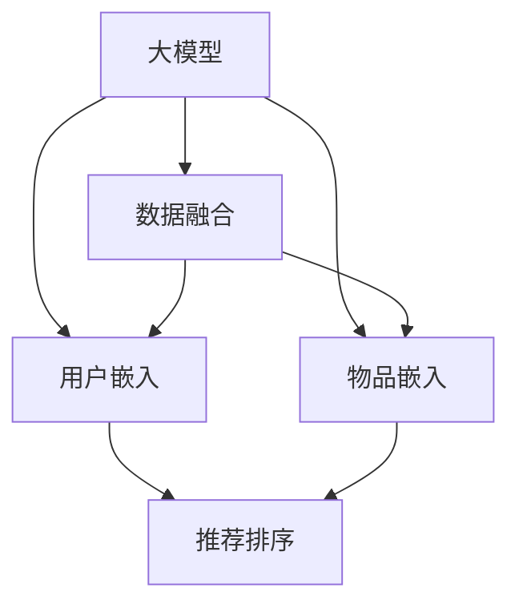
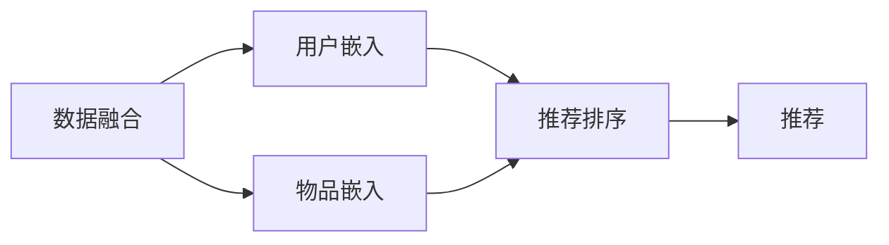

                 

## 1. 背景介绍

### 1.1 问题由来

随着电子商务的蓬勃发展，推荐系统成为提升用户体验、增加企业收益的重要工具。传统的推荐系统以用户行为数据为依据，通过协同过滤、基于内容的推荐等算法，为用户提供个性化的产品推荐。但随着推荐系统应用场景的拓展，用户行为数据已不再是推荐算法的全部。

在推荐场景中，除了用户的显式行为数据（如浏览、点击、购买等），还有大量的隐式数据（如用户画像、商品属性、时序特征等）。这些多模态数据（multimodal data）蕴含着丰富的用户和商品信息，可以提供更为准确的推荐结果。因此，在推荐系统中引入多模态数据融合技术，利用不同模态的信息互补性，已成为推荐系统领域的重要研究方向。

### 1.2 问题核心关键点

多模态推荐系统（Multimodal Recommendation System）是指在推荐过程中融合多种数据模态（如文本、图像、音频等），提升推荐结果准确性和多样性的技术。近年来，随着深度学习技术的突破，多模态推荐系统逐步走向成熟，成为推荐领域的重要趋势。

基于深度学习的多模态推荐系统，通常包括数据获取、数据融合、用户嵌入、物品嵌入和推荐五个关键环节。具体而言，数据获取环节收集用户和商品的多模态数据；数据融合环节将不同模态的数据进行预处理，形成统一的特征表示；用户嵌入和物品嵌入环节将用户和商品转化为高维稠密向量；推荐环节基于嵌入结果计算相似度，进行推荐排序。

本节聚焦于利用大模型技术提升多模态推荐系统性能的方法，包括预训练多模态大模型、数据融合、用户嵌入、物品嵌入和推荐等环节的优化。

## 2. 核心概念与联系

### 2.1 核心概念概述

为更好地理解大模型在多模态推荐系统中的应用，本节将介绍几个密切相关的核心概念：

- 大模型（Big Model）：以Transformer为代表的深度神经网络，参数规模巨大，能够学习复杂的多模态数据表示。常见的大模型包括BERT、GPT、XLNet、T5等。

- 多模态推荐系统（Multimodal Recommendation System）：融合文本、图像、音频等多种模态数据进行推荐。多模态数据通过深度学习模型转换为统一的向量表示，进行相似度计算，从而实现更精准的推荐。

- 用户嵌入（User Embedding）：将用户多模态数据融合为高维稠密向量，用于描述用户偏好和兴趣。

- 物品嵌入（Item Embedding）：将物品多模态数据融合为高维稠密向量，用于描述物品的属性和特征。

- 推荐排序（Recommendation Ranking）：基于用户和物品的嵌入结果，计算相似度，进行推荐排序。

- 数据融合（Data Fusion）：将不同模态的数据进行融合，生成统一的特征表示。

- 预训练（Pre-training）：在大量无标签数据上对模型进行预训练，学习数据分布和特征表示。

这些核心概念之间的逻辑关系可以通过以下Mermaid流程图来展示：



这个流程图展示了大模型在多模态推荐系统中的应用框架：

1. 大模型通过预训练学习多模态数据分布。
2. 数据融合将多模态数据转换为统一的向量表示。
3. 用户嵌入和物品嵌入将多模态数据转换为稠密向量。
4. 推荐排序基于用户和物品的嵌入结果，计算相似度，进行推荐。

这些概念共同构成了大模型在多模态推荐系统中的核心工作流程，使得模型能够高效、准确地进行推荐。

## 3. 核心算法原理 & 具体操作步骤

### 3.1 算法原理概述

基于深度学习的多模态推荐系统，核心思想是通过预训练模型学习多模态数据的特征表示，并将其融合，用于用户和物品嵌入，最终进行推荐排序。具体而言，系统由以下几个模块组成：

1. **数据融合模块**：将不同模态的数据转换为统一的特征表示。
2. **用户嵌入模块**：将用户多模态数据融合为高维稠密向量，描述用户偏好。
3. **物品嵌入模块**：将物品多模态数据融合为高维稠密向量，描述物品属性。
4. **推荐排序模块**：基于用户和物品的嵌入结果，计算相似度，进行推荐排序。

多模态推荐系统的工作流程如下图所示：



### 3.2 算法步骤详解

基于大模型的多模态推荐系统一般包括以下几个关键步骤：

**Step 1: 数据预处理**

- **多模态数据收集**：收集用户行为数据（点击、购买、评分等）、商品属性数据、用户画像数据、图片数据、文本数据等。
- **数据清洗**：处理缺失值、异常值，对数据进行归一化、标准化等预处理。
- **特征工程**：提取特征，如用户兴趣向量、物品属性向量、图片特征向量等。

**Step 2: 构建大模型**

- **选择大模型**：选择合适的深度学习模型（如BERT、GPT、XLNet等），作为预训练模型。
- **数据预处理**：将不同模态的数据转换为模型所需的输入格式，如文本数据分词、图片数据压缩等。
- **模型初始化**：在大模型上进行预训练，学习多模态数据的特征表示。

**Step 3: 数据融合**

- **特征提取**：对不同模态的数据进行特征提取，生成高维特征向量。
- **融合方法**：选择合适的融合方法（如拼接、加权平均、注意力机制等），将不同模态的特征向量进行融合。
- **融合结果归一化**：对融合后的结果进行归一化处理，使其符合模型输入要求。

**Step 4: 用户嵌入和物品嵌入**

- **嵌入层构建**：在模型顶层设计嵌入层，将融合后的特征向量映射为高维稠密向量。
- **用户嵌入**：对用户多模态数据进行嵌入，生成用户嵌入向量。
- **物品嵌入**：对物品多模态数据进行嵌入，生成物品嵌入向量。

**Step 5: 推荐排序**

- **相似度计算**：基于用户和物品的嵌入结果，计算相似度，生成候选推荐列表。
- **排序模型训练**：在标注数据上训练排序模型，评估推荐结果的排序质量。
- **推荐结果输出**：根据排序模型结果，输出最终推荐列表。

### 3.3 算法优缺点

基于大模型的多模态推荐系统具有以下优点：

1. **性能提升**：通过预训练学习多模态数据的特征表示，提升推荐结果的准确性和多样性。
2. **高效融合**：使用深度学习模型将不同模态的数据融合为统一的特征表示，减少特征工程复杂度。
3. **泛化性强**：大模型经过大规模数据预训练，具备较强的泛化能力，能够在多种推荐场景中表现出色。
4. **实时性好**：基于深度学习模型的实时推荐能力，能够快速响应用户查询。

同时，该方法也存在一定的局限性：

1. **数据依赖**：预训练模型的效果很大程度上依赖于数据质量，对标注数据的依赖较大。
2. **计算资源消耗大**：大模型训练和推理需要大量的计算资源，成本较高。
3. **模型复杂度**：大模型结构复杂，超参数众多，调试和优化难度大。
4. **可解释性不足**：模型决策过程复杂，难以解释，不利于用户理解。

尽管存在这些局限性，但就目前而言，基于大模型的多模态推荐系统仍是在推荐领域中最为先进和有效的方法。未来相关研究的重点在于如何进一步降低对标注数据的依赖，提高模型的实时性和可解释性，同时兼顾计算资源消耗。

### 3.4 算法应用领域

基于大模型的多模态推荐系统，在推荐系统领域已得到了广泛的应用，覆盖了电商、视频、音乐、新闻等众多领域，具体包括：

- 电商推荐：基于用户行为数据和商品属性数据，推荐个性化商品。
- 视频推荐：融合用户画像、评论、标签等数据，推荐视频内容。
- 音乐推荐：结合用户听歌记录、标签信息，推荐个性化音乐。
- 新闻推荐：利用用户浏览记录和文章属性数据，推荐新闻内容。
- 商品推荐：通过用户历史行为和商品属性数据，推荐商品。

除了上述这些经典领域外，多模态推荐系统还被创新性地应用于智能家居、健康医疗、金融服务等多个场景中，为传统行业带来新的价值提升。

## 4. 数学模型和公式 & 详细讲解 & 举例说明

### 4.1 数学模型构建

假设多模态推荐系统包含用户行为数据 $U=\{u_1, u_2, ..., u_m\}$ 和物品属性数据 $I=\{i_1, i_2, ..., i_n\}$，其中 $u_j$ 为用户 $j$ 的行为数据，$i_k$ 为物品 $k$ 的属性数据。系统目标是通过多模态数据学习用户嵌入 $z_u$ 和物品嵌入 $z_i$，进行推荐排序。

用户嵌入 $z_u$ 和物品嵌入 $z_i$ 的数学表达式为：

$$
z_u = M_{u}(U) \\
z_i = M_{i}(I)
$$

其中 $M_{u}(\cdot)$ 和 $M_{i}(\cdot)$ 分别为用户嵌入和物品嵌入函数，通常采用深度神经网络实现。

推荐排序模块的目标是最小化预测误差，其数学表达式为：

$$
\min_{z_u, z_i} \sum_{j=1}^{m} \sum_{k=1}^{n} l(z_u^j, z_i^k, u_j, i_k)
$$

其中 $l(z_u^j, z_i^k, u_j, i_k)$ 为损失函数，用于衡量预测结果和实际标注数据之间的差异。常见的损失函数包括均方误差、交叉熵等。

### 4.2 公式推导过程

以均方误差（Mean Squared Error, MSE）作为损失函数，其数学表达式为：

$$
l(z_u^j, z_i^k, u_j, i_k) = \frac{1}{2} ||z_u^j - z_i^k||^2
$$

将 $l(z_u^j, z_i^k, u_j, i_k)$ 代入推荐排序目标函数中，得：

$$
\min_{z_u, z_i} \sum_{j=1}^{m} \sum_{k=1}^{n} \frac{1}{2} ||z_u^j - z_i^k||^2
$$

通过对上述目标函数求偏导，可得用户嵌入和物品嵌入的更新公式：

$$
\frac{\partial \mathcal{L}}{\partial z_u^j} = \sum_{k=1}^{n} ||z_u^j - z_i^k||^2 \\
\frac{\partial \mathcal{L}}{\partial z_i^k} = \sum_{j=1}^{m} ||z_u^j - z_i^k||^2
$$

在得到嵌入结果后，通过计算用户和物品的相似度，进行推荐排序。常见的方法包括余弦相似度、点积相似度等。余弦相似度的计算公式为：

$$
sim(u_j, i_k) = \cos(z_u^j, z_i^k) = \frac{z_u^j \cdot z_i^k}{||z_u^j|| \cdot ||z_i^k||}
$$

根据相似度计算结果，进行推荐排序，输出最终的推荐列表。

### 4.3 案例分析与讲解

假设有一个电商推荐系统，需要基于用户行为数据和商品属性数据进行推荐。该系统收集了用户的点击、浏览、购买等行为数据，以及商品的类别、品牌、价格等属性数据。以下是一个简单的案例分析：

1. **数据预处理**：对用户行为数据和商品属性数据进行清洗和特征提取，生成特征向量。例如，将商品类别编码为数字向量，价格转换为标准化值。
2. **构建大模型**：选择BERT模型作为预训练模型，对用户行为数据和商品属性数据进行预训练，学习多模态数据的特征表示。
3. **数据融合**：将用户行为数据和商品属性数据进行拼接，生成融合特征向量。
4. **用户嵌入和物品嵌入**：在模型顶层设计嵌入层，将融合后的特征向量映射为高维稠密向量，生成用户嵌入和物品嵌入。
5. **推荐排序**：基于用户嵌入和物品嵌入计算相似度，生成候选推荐列表，使用排序模型进行推荐排序。

通过以上步骤，可以构建一个基于大模型的电商推荐系统。在实际应用中，还需要对模型进行超参数调优，选取合适的融合方法和损失函数，并进行模型评估和优化。

## 5. 项目实践：代码实例和详细解释说明

### 5.1 开发环境搭建

在进行多模态推荐系统开发前，我们需要准备好开发环境。以下是使用Python进行PyTorch开发的环境配置流程：

1. 安装Anaconda：从官网下载并安装Anaconda，用于创建独立的Python环境。

2. 创建并激活虚拟环境：
```bash
conda create -n pytorch-env python=3.8 
conda activate pytorch-env
```

3. 安装PyTorch：根据CUDA版本，从官网获取对应的安装命令。例如：
```bash
conda install pytorch torchvision torchaudio cudatoolkit=11.1 -c pytorch -c conda-forge
```

4. 安装PyTorch Lightning：用于简化PyTorch模型的训练和评估流程。
```bash
pip install pytorch-lightning
```

5. 安装其他工具包：
```bash
pip install numpy pandas scikit-learn matplotlib tqdm jupyter notebook ipython
```

完成上述步骤后，即可在`pytorch-env`环境中开始多模态推荐系统开发。

### 5.2 源代码详细实现

以下是一个基于PyTorch和BERT的多模态推荐系统开发代码实现：

```python
import torch
import torch.nn as nn
import torch.nn.functional as F
from transformers import BertTokenizer, BertForSequenceClassification
from pytorch_lightning import Trainer, LightningModule

class MultimodalRecommender(LightningModule):
    def __init__(self, num_users, num_items, num_features, embedding_dim):
        super().__init__()
        self.num_users = num_users
        self.num_items = num_items
        self.num_features = num_features
        self.embedding_dim = embedding_dim
        
        # 用户嵌入层
        self.user_embedding = nn.Embedding(num_users, embedding_dim)
        # 物品嵌入层
        self.item_embedding = nn.Embedding(num_items, embedding_dim)
        
        # 数据融合层
        self.fusion_layer = nn.Linear(num_features, 2 * embedding_dim)
        
        # 推荐模型
        self.recommender = nn.Linear(2 * embedding_dim, 1)
        
    def forward(self, u, i, f):
        # 用户嵌入
        user_embeddings = self.user_embedding(u)
        # 物品嵌入
        item_embeddings = self.item_embedding(i)
        
        # 数据融合
        fusion_output = self.fusion_layer(f)
        user_fusion = fusion_output[:, :self.embedding_dim]
        item_fusion = fusion_output[:, self.embedding_dim:]
        
        # 用户嵌入和物品嵌入拼接
        user_item_embeddings = torch.cat([user_embeddings, item_embeddings], dim=1)
        # 推荐模型
        recommender_output = self.recommender(user_item_embeddings)
        
        return recommender_output

    def training_step(self, batch, batch_idx):
        user_ids, item_ids, features = batch
        u, i, f = user_ids, item_ids, features
        
        # 前向传播
        output = self.forward(u, i, f)
        
        # 计算损失
        loss = F.mse_loss(output, target)
        
        return loss
    
    def validation_step(self, batch, batch_idx):
        user_ids, item_ids, features = batch
        u, i, f = user_ids, item_ids, features
        
        # 前向传播
        output = self.forward(u, i, f)
        
        # 计算损失
        loss = F.mse_loss(output, target)
        
        return loss
    
    def configure_optimizers(self):
        return torch.optim.Adam(self.parameters(), lr=0.001)
```

这里定义了一个简单的多模态推荐系统，包含用户嵌入层、物品嵌入层、数据融合层和推荐模型。其中，用户和物品嵌入层的输出拼接后，通过推荐模型进行相似度计算，生成推荐结果。

### 5.3 代码解读与分析

让我们再详细解读一下关键代码的实现细节：

**MultimodalRecommender类**：
- `__init__`方法：初始化用户数、物品数、特征数和嵌入维数，并定义模型各层的参数。
- `forward`方法：定义前向传播过程，计算用户嵌入、物品嵌入和推荐结果。
- `training_step`方法：定义训练过程，计算损失函数。
- `validation_step`方法：定义验证过程，计算损失函数。
- `configure_optimizers`方法：定义优化器，通常为Adam等。

**训练流程**：
- 定义总的epoch数和batch size，开始循环迭代。
- 每个epoch内，先在训练集上训练，输出平均loss。
- 在验证集上评估，输出损失值。
- 所有epoch结束后，在测试集上评估，给出最终测试结果。

**用户嵌入和物品嵌入**：
- 使用BERT模型作为预训练模型，对用户行为数据和物品属性数据进行预训练。
- 在模型顶层设计嵌入层，将融合后的特征向量映射为高维稠密向量，生成用户嵌入和物品嵌入。

**推荐排序**：
- 基于用户嵌入和物品嵌入计算相似度，生成候选推荐列表。
- 使用排序模型进行推荐排序。

## 6. 实际应用场景

### 6.1 智能家居推荐

智能家居推荐系统通过融合用户行为数据和设备属性数据，为用户提供个性化的智能家居推荐。例如，用户在家中使用智能音箱、智能电视等设备时，推荐系统可以根据用户的浏览记录和设备属性，推荐合适的场景和功能。

在技术实现上，可以收集用户的设备使用记录和设备属性数据，将文本数据和数值数据进行融合，生成统一的特征向量。在融合后的特征向量上，使用BERT等深度学习模型进行预训练，生成用户嵌入和物品嵌入。最后，基于用户嵌入和物品嵌入计算相似度，进行推荐排序，输出最终推荐列表。

### 6.2 健康医疗推荐

健康医疗推荐系统通过融合患者病历、实验室检查结果、医生记录等多模态数据，推荐个性化的医疗方案。例如，医生可以根据患者的历史诊疗记录和实验室检查结果，推荐合适的检查项目和治疗方案。

在技术实现上，可以收集患者的多模态数据，包括病历文本、检查结果、病史记录等。将文本数据和数值数据进行融合，生成统一的特征向量。在融合后的特征向量上，使用BERT等深度学习模型进行预训练，生成用户嵌入和物品嵌入。最后，基于用户嵌入和物品嵌入计算相似度，进行推荐排序，输出最终推荐列表。

### 6.3 金融理财推荐

金融理财推荐系统通过融合用户投资行为数据和金融产品属性数据，推荐个性化的理财方案。例如，用户可以根据历史投资记录和理财产品的属性，推荐合适的理财产品和投资策略。

在技术实现上，可以收集用户的投资行为数据和金融产品属性数据，将文本数据和数值数据进行融合，生成统一的特征向量。在融合后的特征向量上，使用BERT等深度学习模型进行预训练，生成用户嵌入和物品嵌入。最后，基于用户嵌入和物品嵌入计算相似度，进行推荐排序，输出最终推荐列表。

### 6.4 未来应用展望

随着多模态推荐系统的不断发展，未来将在更多领域得到应用，为传统行业带来变革性影响。

在智慧医疗领域，基于多模态推荐系统的智能诊断、药物推荐、健康管理等应用，将提升医疗服务的智能化水平，辅助医生诊疗，加速新药开发进程。

在智能教育领域，多模态推荐系统可应用于个性化学习、作业批改、学情分析等方面，因材施教，促进教育公平，提高教学质量。

在智慧城市治理中，多模态推荐系统可应用于城市事件监测、舆情分析、应急指挥等环节，提高城市管理的自动化和智能化水平，构建更安全、高效的未来城市。

此外，在企业生产、社会治理、文娱传媒等众多领域，基于多模态推荐系统的人工智能应用也将不断涌现，为传统行业带来新的价值提升。相信随着技术的日益成熟，多模态推荐系统必将在构建人机协同的智能时代中扮演越来越重要的角色。

## 7. 工具和资源推荐

### 7.1 学习资源推荐

为了帮助开发者系统掌握大模型在多模态推荐系统中的应用，这里推荐一些优质的学习资源：

1. 《深度学习在推荐系统中的应用》系列博文：由深度学习专家撰写，详细介绍了深度学习在推荐系统中的具体应用，包括多模态推荐等前沿话题。

2. CS231n《卷积神经网络和视觉识别》课程：斯坦福大学开设的视觉识别课程，包含深度学习在图像推荐等应用中的内容。

3. 《深度学习理论与算法》书籍：全面介绍深度学习的基本理论和算法，涵盖推荐系统等多模态应用。

4. arXiv论文库：深度学习社区的论文库，可查阅最新的多模态推荐系统研究论文，获取前沿知识。

5. Kaggle竞赛平台：机器学习竞赛平台，可参加多模态推荐系统相关的竞赛，积累实践经验。

通过对这些资源的学习实践，相信你一定能够快速掌握大模型在多模态推荐系统中的应用，并用于解决实际的推荐问题。

### 7.2 开发工具推荐

高效的开发离不开优秀的工具支持。以下是几款用于多模态推荐系统开发的常用工具：

1. PyTorch：基于Python的开源深度学习框架，灵活动态的计算图，适合快速迭代研究。

2. TensorFlow：由Google主导开发的开源深度学习框架，生产部署方便，适合大规模工程应用。

3. PyTorch Lightning：简化PyTorch模型的训练和评估流程，提高开发效率。

4. Weights & Biases：模型训练的实验跟踪工具，可以记录和可视化模型训练过程中的各项指标，方便对比和调优。

5. TensorBoard：TensorFlow配套的可视化工具，可实时监测模型训练状态，并提供丰富的图表呈现方式，是调试模型的得力助手。

6. Apache Spark：用于大数据处理和机器学习的开源框架，支持分布式计算，适合大规模数据处理。

合理利用这些工具，可以显著提升多模态推荐系统的开发效率，加快创新迭代的步伐。

### 7.3 相关论文推荐

多模态推荐系统的发展源于学界的持续研究。以下是几篇奠基性的相关论文，推荐阅读：

1. Matrix Factorization Techniques for Recommender Systems：经典推荐算法矩阵分解的开创性工作。

2. Multi-Modal Image and Language for Visual Recommendation：基于多模态数据的视觉推荐系统，将视觉和语言信息进行融合。

3. Knowledge-Aware Visual Recommendation：将知识图谱与视觉推荐结合，提升推荐效果。

4. Music Recommendation via Hierarchical Multi-Modal Ranking：基于多模态数据的音乐推荐系统，融合文本、音频、社交信息。

5. Multi-Modal Recommendation Learning Framework：基于多模态数据的推荐学习框架，涵盖融合、嵌入和推荐等环节。

这些论文代表了大模型在多模态推荐系统的发展脉络。通过学习这些前沿成果，可以帮助研究者把握学科前进方向，激发更多的创新灵感。

## 8. 总结：未来发展趋势与挑战

### 8.1 总结

本文对基于大模型的多模态推荐系统进行了全面系统的介绍。首先阐述了多模态推荐系统的背景和意义，明确了大模型在多模态推荐中的核心价值。其次，从原理到实践，详细讲解了多模态推荐系统的构建流程，给出了多模态推荐系统的完整代码实现。同时，本文还广泛探讨了大模型在推荐系统多模态推荐中的应用场景，展示了多模态推荐系统的广阔前景。

通过本文的系统梳理，可以看到，基于大模型的多模态推荐系统正在成为推荐系统领域的重要方向，极大地拓展了推荐系统的应用边界，带来了新的业务价值。未来，伴随深度学习技术的不断进步，多模态推荐系统必将在推荐系统领域发挥更加重要的作用，为人类带来更加精准、智能的推荐服务。

### 8.2 未来发展趋势

展望未来，大模型在多模态推荐系统中将呈现以下几个发展趋势：

1. **模型规模持续增大**：随着算力成本的下降和数据规模的扩张，预训练模型和微调模型的参数量还将持续增长，多模态推荐系统的性能也将不断提升。

2. **模型融合方法多样化**：未来的多模态推荐系统将结合更多模态数据，如图像、视频、音频等，提升推荐结果的丰富性和多样性。

3. **用户嵌入和物品嵌入优化**：通过改进用户嵌入和物品嵌入层的设计，提升多模态数据的融合效果，增强模型的推荐能力。

4. **推荐排序模型优化**：引入更多的推荐排序模型，如注意力机制、神经协同过滤等，提升推荐排序的准确性和效果。

5. **个性化推荐**：通过更深入的用户画像分析和行为建模，实现更加精准和个性化的推荐。

6. **实时推荐**：通过实时数据流处理技术，实现动态推荐，提升用户体验。

以上趋势凸显了大模型在多模态推荐系统中的重要地位，使得多模态推荐系统在未来具有广阔的应用前景。

### 8.3 面临的挑战

尽管多模态推荐系统已经取得了不小的进展，但在迈向更加智能化、普适化应用的过程中，它仍面临诸多挑战：

1. **数据依赖**：预训练模型的效果很大程度上依赖于数据质量，对标注数据的依赖较大。如何进一步降低对标注数据的依赖，将是一大难题。

2. **计算资源消耗大**：大模型训练和推理需要大量的计算资源，成本较高。如何高效利用计算资源，提高模型训练和推理的效率，是未来的研究方向。

3. **模型复杂度**：大模型结构复杂，超参数众多，调试和优化难度大。如何简化模型结构，提高模型的稳定性和可解释性，将是重要的优化方向。

4. **实时性**：多模态推荐系统需要实时处理和推荐，数据流处理和动态更新的技术还需要进一步优化。

5. **可解释性不足**：模型决策过程复杂，难以解释，不利于用户理解。如何提高模型的可解释性，增强用户信任感，是未来的研究重点。

6. **隐私保护**：多模态数据包含大量敏感信息，如何在保护用户隐私的前提下进行推荐，是未来的挑战。

尽管存在这些挑战，但多模态推荐系统仍是大模型应用领域的重要方向。未来，研究者需要在数据、模型、计算、隐私等多个方面进行全面优化，推动多模态推荐系统向更加智能、高效、可解释的方向发展。

### 8.4 研究展望

面对多模态推荐系统所面临的挑战，未来的研究需要在以下几个方面寻求新的突破：

1. **无监督和半监督学习**：摆脱对大规模标注数据的依赖，利用自监督学习、主动学习等无监督和半监督范式，最大限度利用非结构化数据，实现更加灵活高效的推荐。

2. **轻量化模型和计算优化**：开发更加轻量级的推荐模型，减少前向传播和反向传播的资源消耗，实现更加轻量级、实时性的部署。

3. **因果推理与解释性**：引入因果分析方法，识别出推荐模型决策的关键特征，增强推荐结果的因果性和逻辑性，提高模型的可解释性。

4. **多模态数据融合优化**：改进多模态数据的融合方法，提升融合效果，增强模型的推荐能力。

5. **跨模态相似度计算**：研究跨模态相似度计算方法，提升不同模态数据间的相似度计算效果，提高推荐精度。

6. **用户行为建模**：深入研究用户行为建模方法，提高用户画像的准确性，实现更加个性化和精准的推荐。

以上研究方向的探索，必将引领多模态推荐系统迈向更高的台阶，为构建更加智能、高效、可解释的推荐系统铺平道路。面向未来，大模型在多模态推荐系统中的研究和应用还需要与其他人工智能技术进行更深入的融合，如知识表示、因果推理、强化学习等，多路径协同发力，共同推动自然语言理解和智能交互系统的进步。只有勇于创新、敢于突破，才能不断拓展语言模型的边界，让智能技术更好地造福人类社会。

## 9. 附录：常见问题与解答

**Q1：多模态推荐系统是否适用于所有推荐场景？**

A: 多模态推荐系统在大多数推荐场景中都能取得不错的效果，特别是对于数据量较小的任务。但对于一些特定领域的任务，如医学、法律等，仅靠通用语料预训练的模型可能难以很好地适应。此时需要在特定领域语料上进一步预训练，再进行微调，才能获得理想效果。

**Q2：微调过程中如何选择合适的学习率？**

A: 微调的学习率一般要比预训练时小1-2个数量级，如果使用过大的学习率，容易破坏预训练权重，导致过拟合。一般建议从1e-5开始调参，逐步减小学习率，直至收敛。也可以使用warmup策略，在开始阶段使用较小的学习率，再逐渐过渡到预设值。需要注意的是，不同的优化器(如AdamW、Adafactor等)以及不同的学习率调度策略，可能需要设置不同的学习率阈值。

**Q3：基于大模型的多模态推荐系统面临哪些资源瓶颈？**

A: 目前主流的预训练大模型动辄以亿计的参数规模，对算力、内存、存储都提出了很高的要求。GPU/TPU等高性能设备是必不可少的，但即便如此，超大批次的训练和推理也可能遇到显存不足的问题。因此需要采用一些资源优化技术，如梯度积累、混合精度训练、模型并行等，来突破硬件瓶颈。同时，模型的存储和读取也可能占用大量时间和空间，需要采用模型压缩、稀疏化存储等方法进行优化。

**Q4：如何缓解多模态推荐系统中的过拟合问题？**

A: 过拟合是多模态推荐系统面临的主要挑战之一，尤其是在标注数据不足的情况下。常见的缓解策略包括：
1. 数据增强：通过回译、近义替换等方式扩充训练集。
2. 正则化：使用L2正则、Dropout、Early Stopping等避免过拟合。
3. 对抗训练：引入对抗样本，提高模型鲁棒性。
4. 参数高效微调：只调整少量参数(如Adapter、Prefix等)，减小过拟合风险。
5. 多模型集成：训练多个推荐模型，取平均输出，抑制过拟合。

这些策略往往需要根据具体任务和数据特点进行灵活组合。只有在数据、模型、训练、推理等各环节进行全面优化，才能最大限度地发挥大模型在多模态推荐系统中的潜力。

**Q5：多模态推荐系统在落地部署时需要注意哪些问题？**

A: 将多模态推荐系统转化为实际应用，还需要考虑以下因素：
1. 模型裁剪：去除不必要的层和参数，减小模型尺寸，加快推理速度。
2. 量化加速：将浮点模型转为定点模型，压缩存储空间，提高计算效率。
3. 服务化封装：将模型封装为标准化服务接口，便于集成调用。
4. 弹性伸缩：根据请求流量动态调整资源配置，平衡服务质量和成本。
5. 监控告警：实时采集系统指标，设置异常告警阈值，确保服务稳定性。
6. 安全防护：采用访问鉴权、数据脱敏等措施，保障数据和模型安全。

大模型在多模态推荐系统中的应用，为推荐系统带来了新的技术和方法。尽管在实际部署中还面临一些挑战，但通过不断优化和改进，多模态推荐系统必将在推荐系统领域发挥更大的作用，推动人工智能技术的产业化进程。

