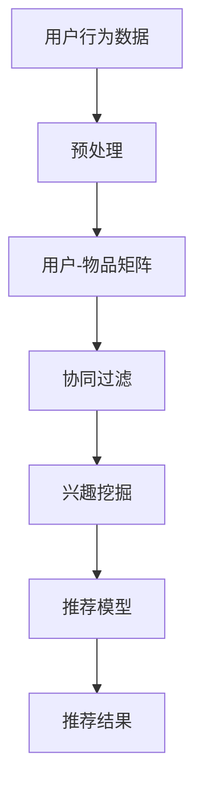

                 

# 大模型在推荐系统细粒度兴趣挖掘中的作用

> 关键词：大模型、推荐系统、细粒度兴趣挖掘、协同过滤、深度学习、神经网络

## 1. 背景介绍

### 1.1 问题由来

在现代社会，信息爆炸和用户需求个性化日益显著，推荐系统（Recommendation System）成为了帮助用户在海量数据中发现感兴趣内容的重要工具。推荐系统通过对用户行为数据进行建模，预测用户可能感兴趣的商品或内容，并通过排序算法优先展示相关内容，从而提高用户的满意度和平台转化率。

然而，推荐系统的关键在于理解用户的多样化、动态化的兴趣和需求，并将其准确映射到具体商品或内容上。传统推荐系统主要依赖基于用户-物品相似度计算的协同过滤方法，但由于用户-物品矩阵的稀疏性，协同过滤难以准确捕捉用户的细粒度兴趣，导致推荐效果不佳。而深度学习的大模型提供了新的解决方案。

### 1.2 问题核心关键点

大模型在推荐系统中的应用，旨在利用其强大的表达能力和泛化能力，挖掘用户细粒度的兴趣特征，提高推荐系统的个性化和准确性。具体来说，大模型可以从多个维度进行兴趣挖掘：

1. **兴趣维度**：将用户的兴趣划分为多个维度（如兴趣类别、兴趣强度等），并建立多维兴趣空间。
2. **兴趣层次**：细粒度地刻画用户在不同层次上的兴趣点，如基础兴趣、长远兴趣、情境兴趣等。
3. **兴趣交互**：通过模型学习用户与商品或内容的互动关系，挖掘兴趣特征的动态变化。
4. **兴趣演化**：刻画用户兴趣随时间演化的趋势，构建兴趣演化模型。

这些细粒度的兴趣特征能够更全面地描述用户的真实需求，从而提升推荐系统的准确性和个性化程度。

### 1.3 问题研究意义

利用大模型进行细粒度兴趣挖掘，对推荐系统的发展具有重要意义：

1. **提高推荐准确性**：细粒度的兴趣特征能够更精确地匹配用户需求，提高推荐相关性。
2. **增强推荐多样性**：通过挖掘用户多维度的兴趣，推荐更多元化的内容，避免“信息茧房”。
3. **优化推荐算法**：为推荐算法提供更丰富的特征表示，提升排序和召回效果。
4. **拓展应用场景**：能够应用于商品推荐、内容推荐、广告推荐等多个场景，推动推荐系统的多场景融合。
5. **促进业务创新**：提升推荐系统的用户满意度，增加平台转化率，为业务创新提供数据支持。

本文将从原理和实践两方面，全面介绍大模型在推荐系统细粒度兴趣挖掘中的应用，并探讨其优缺点及未来发展趋势。

## 2. 核心概念与联系

### 2.1 核心概念概述

大模型在推荐系统中的细粒度兴趣挖掘，是一个多维、动态、个性化的任务。其中涉及到的核心概念包括：

- **大模型**：如BERT、GPT等基于深度学习的预训练语言模型，具备强大的泛化能力和表达能力。
- **协同过滤**：传统推荐系统常用的基于用户-物品相似度计算的推荐方法。
- **细粒度兴趣**：从多个维度刻画用户的兴趣，如类别、强度、层次等。
- **兴趣演化**：描述用户兴趣随时间的动态变化。
- **推荐系统**：通过推荐算法为用户提供个性化内容或商品的智能系统。

这些概念之间通过协同作用，共同实现了从用户行为数据到推荐结果的转化。

### 2.2 核心概念原理和架构的 Mermaid 流程图



该图展示了从用户行为数据到推荐结果的基本流程：首先对原始数据进行预处理，构建用户-物品矩阵；然后利用协同过滤方法预测用户对物品的兴趣；最后通过兴趣挖掘和推荐模型生成个性化推荐结果。

### 2.3 核心概念联系

大模型在推荐系统中的应用，主要通过以下几个环节实现：

1. **数据预处理**：将原始行为数据清洗、归一化，生成用户-物品矩阵。
2. **协同过滤**：基于用户-物品相似度计算，预测用户对物品的兴趣。
3. **兴趣挖掘**：利用大模型学习用户兴趣的多维度和层次性，生成细粒度的兴趣特征。
4. **推荐模型**：将细粒度兴趣特征输入推荐模型，生成个性化推荐结果。
5. **推荐结果**：根据排序算法，将推荐结果排序并展示给用户。

## 3. 核心算法原理 & 具体操作步骤

### 3.1 算法原理概述

大模型在推荐系统中的应用，主要通过以下步骤实现细粒度兴趣挖掘：

1. **数据预处理**：将用户行为数据转换为用户-物品矩阵，并进行归一化和标准化处理。
2. **协同过滤**：利用用户-物品矩阵计算用户对物品的兴趣。
3. **兴趣挖掘**：通过大模型学习用户的细粒度兴趣特征，如类别、强度、层次等。
4. **推荐模型**：将细粒度兴趣特征输入推荐模型，生成个性化推荐结果。
5. **排序优化**：对推荐结果进行排序，并展示给用户。

其中，大模型在兴趣挖掘环节起着关键作用，通过学习用户的多种兴趣特征，生成更加丰富和准确的兴趣表示。

### 3.2 算法步骤详解

#### 3.2.1 数据预处理

1. **数据采集**：收集用户行为数据，如浏览记录、点击记录、购买记录等。
2. **数据清洗**：去除噪声数据，如错误、缺失、异常等。
3. **数据归一化**：将数据转换为标准范围，避免不同特征尺度影响模型训练。
4. **数据分割**：将数据集分为训练集、验证集和测试集。

#### 3.2.2 协同过滤

1. **用户-物品矩阵**：构建用户-物品矩阵 $U$，每个元素表示用户对物品的兴趣程度。
2. **协同过滤模型**：基于用户-物品相似度计算，预测用户对物品的兴趣。常用的协同过滤算法包括基于用户-物品相似度的矩阵分解、基于用户-物品-时间相似度的隐语义模型等。

#### 3.2.3 兴趣挖掘

1. **大模型选择**：选择合适的预训练语言模型，如BERT、GPT等，作为兴趣挖掘的基础模型。
2. **特征提取**：将用户-物品矩阵中的用户ID和物品ID转换为文本描述，输入大模型进行特征提取。
3. **兴趣表示**：通过大模型学习用户的多维兴趣特征，生成类别、强度、层次等细粒度表示。

#### 3.2.4 推荐模型

1. **模型选择**：选择合适的推荐模型，如基于深度学习的推荐模型、基于协同过滤的推荐模型等。
2. **模型训练**：将细粒度兴趣特征输入推荐模型进行训练，生成推荐结果。
3. **结果排序**：根据推荐结果的相关性和多样性进行排序，展示给用户。

### 3.3 算法优缺点

#### 3.3.1 优点

1. **准确性高**：大模型具备强大的表达能力和泛化能力，能够挖掘用户细粒度的兴趣特征，提高推荐准确性。
2. **鲁棒性好**：大模型能够适应不同数据分布和用户行为变化，具有良好的鲁棒性。
3. **泛化能力强**：大模型在多个场景下都能应用，具有较强的泛化能力。
4. **可解释性强**：大模型能够提供兴趣特征的多维度解释，帮助理解用户需求。

#### 3.3.2 缺点

1. **计算成本高**：大模型需要大量的计算资源进行训练和推理，计算成本较高。
2. **数据需求大**：大模型需要大量的标注数据进行预训练，数据需求较大。
3. **模型复杂**：大模型结构复杂，训练和推理需要较高的技术水平。
4. **结果解释性差**：大模型结果复杂，难以直接解释模型内部逻辑。

### 3.4 算法应用领域

大模型在推荐系统中的应用，主要包括以下几个领域：

1. **电商推荐**：基于用户浏览、购买记录，挖掘用户细粒度兴趣，生成个性化商品推荐。
2. **内容推荐**：利用用户阅读、观看记录，挖掘用户兴趣类别、强度、层次等特征，生成个性化内容推荐。
3. **广告推荐**：通过分析用户行为数据，挖掘用户兴趣和需求，生成个性化广告推荐。
4. **社交推荐**：利用用户社交网络关系，挖掘用户兴趣和互动行为，生成个性化社交推荐。
5. **智能家居**：通过分析用户行为数据，挖掘用户兴趣和需求，生成个性化智能家居设备推荐。

## 4. 数学模型和公式 & 详细讲解

### 4.1 数学模型构建

#### 4.1.1 用户-物品矩阵

用户-物品矩阵 $U$ 表示用户对物品的兴趣程度，其中每个元素 $U_{ui}$ 表示用户 $u$ 对物品 $i$ 的兴趣程度。用户-物品矩阵可以通过以下方式构建：

$$
U = \{U_{ui}\}_{u \times i}
$$

其中 $u$ 为用户编号，$i$ 为物品编号。

#### 4.1.2 协同过滤模型

协同过滤模型可以通过用户-物品矩阵 $U$ 计算用户对物品的兴趣。常用的协同过滤算法包括基于用户-物品相似度的矩阵分解和基于用户-物品-时间相似度的隐语义模型。

#### 4.1.3 大模型表示

大模型通过学习用户-物品矩阵中的用户ID和物品ID，生成细粒度兴趣特征。假设用户ID为 $u$，物品ID为 $i$，则大模型的输入为 $[u, i]$，输出为细粒度兴趣特征 $F(u,i)$。

### 4.2 公式推导过程

#### 4.2.1 协同过滤模型

基于用户-物品相似度的矩阵分解算法，通过用户-物品矩阵 $U$ 计算用户对物品的兴趣。设用户 $u$ 对物品 $i$ 的兴趣表示为 $I_{ui}$，则协同过滤模型可以表示为：

$$
I_{ui} = \alpha \cdot \sum_{k=1}^{n} \alpha_k \cdot U_{ui_k} \cdot W^T_k \cdot X_u
$$

其中 $\alpha$ 为相似度系数，$n$ 为用户-物品相似度的数量，$\alpha_k$ 为用户-物品相似度的权重，$W^T_k$ 为相似度矩阵的转置，$X_u$ 为用户向量。

#### 4.2.2 大模型表示

大模型通过学习用户-物品矩阵中的用户ID和物品ID，生成细粒度兴趣特征。假设大模型为 $M$，则细粒度兴趣特征可以表示为：

$$
F(u,i) = M([u, i])
$$

其中 $[u, i]$ 为输入文本，$M$ 为大模型。

### 4.3 案例分析与讲解

#### 4.3.1 电商推荐案例

在电商推荐系统中，用户浏览、购买记录被转化为用户-物品矩阵 $U$，利用协同过滤算法计算用户对物品的兴趣。通过大模型学习用户ID和物品ID，生成细粒度兴趣特征 $F(u,i)$，如用户对商品的类别、强度、层次等。最后将细粒度兴趣特征输入推荐模型，生成个性化商品推荐结果。

#### 4.3.2 内容推荐案例

在内容推荐系统中，用户阅读、观看记录被转化为用户-物品矩阵 $U$，利用协同过滤算法计算用户对内容的兴趣。通过大模型学习用户ID和物品ID，生成细粒度兴趣特征 $F(u,i)$，如用户对内容的类别、强度、层次等。最后将细粒度兴趣特征输入推荐模型，生成个性化内容推荐结果。

## 5. 项目实践：代码实例和详细解释说明

### 5.1 开发环境搭建

在实践大模型在推荐系统中的应用时，首先需要搭建好开发环境。以下是搭建环境的详细步骤：

1. **安装Python**：确保安装了Python 3.8以上版本。
2. **安装Pip**：确保安装了Pip，用于安装第三方库。
3. **安装TensorFlow**：安装TensorFlow 2.x版本。
4. **安装Keras**：安装Keras深度学习框架，用于构建推荐模型。
5. **安装TensorBoard**：安装TensorBoard可视化工具，用于监控训练过程。
6. **安装Flair**：安装Flair自然语言处理库，用于特征提取。

### 5.2 源代码详细实现

#### 5.2.1 数据预处理

```python
import pandas as pd
import numpy as np

# 读取原始行为数据
data = pd.read_csv('raw_data.csv')

# 清洗数据
data = data[data['timestamp'] > '2021-01-01']  # 过滤掉不合法数据
data = data[data['category'].notna()]  # 过滤掉缺失数据

# 归一化数据
data = (data - data.mean()) / data.std()

# 分割数据集
train_data = data.sample(frac=0.8, random_state=0)
valid_data = data.drop(train_data.index)
test_data = valid_data.drop(valid_data.index)

# 转换为用户-物品矩阵
train_U = train_data.groupby('user_id')['item_id'].apply(lambda x: x.tolist()).values
valid_U = valid_data.groupby('user_id')['item_id'].apply(lambda x: x.tolist()).values
test_U = test_data.groupby('user_id')['item_id'].apply(lambda x: x.tolist()).values
```

#### 5.2.2 协同过滤

```python
from sklearn.metrics.pairwise import cosine_similarity

# 计算用户-物品相似度
train_U_sim = cosine_similarity(train_U)
valid_U_sim = cosine_similarity(valid_U)
test_U_sim = cosine_similarity(test_U)

# 协同过滤预测用户兴趣
train_Y = np.dot(train_U_sim, train_U.T) / np.sqrt(train_U_sim.sum(axis=1))
valid_Y = np.dot(valid_U_sim, valid_U.T) / np.sqrt(valid_U_sim.sum(axis=1))
test_Y = np.dot(test_U_sim, test_U.T) / np.sqrt(test_U_sim.sum(axis=1))
```

#### 5.2.3 兴趣挖掘

```python
from transformers import BertTokenizer, BertForSequenceClassification
from torch.utils.data import DataLoader
import torch

# 分词和编码
tokenizer = BertTokenizer.from_pretrained('bert-base-cased')
def encode(x):
    return tokenizer.encode(x, add_special_tokens=True, padding='max_length', max_length=64)

# 大模型选择
model = BertForSequenceClassification.from_pretrained('bert-base-cased', num_labels=10)

# 特征提取
train_X = np.array([encode(x) for x in train_U])
train_Y = np.array([encode(y) for y in train_Y])
train_dataset = torch.utils.data.TensorDataset(torch.tensor(train_X), torch.tensor(train_Y))
train_loader = DataLoader(train_dataset, batch_size=32)

# 兴趣表示
def predict_labels(X, model, tokenizer):
    model.eval()
    with torch.no_grad():
        outputs = model(X)
        predicted_labels = torch.argmax(outputs, dim=1)
        return predicted_labels.tolist()

predicted_labels = predict_labels(train_X, model, tokenizer)
```

#### 5.2.4 推荐模型

```python
from keras.layers import Input, Dense, Embedding, Flatten, Concatenate, Dropout
from keras.models import Model

# 模型选择
input_user = Input(shape=(64,))
input_item = Input(shape=(64,))
user_embed = Embedding(1000, 128)(input_user)
item_embed = Embedding(1000, 128)(input_item)
user_item_embed = Concatenate()([user_embed, item_embed])
dropout = Dropout(0.2)(user_item_embed)
output = Dense(10, activation='softmax')(dropout)
model = Model(inputs=[input_user, input_item], outputs=output)

# 模型训练
model.compile(optimizer='adam', loss='categorical_crossentropy', metrics=['accuracy'])
model.fit([train_X[:, :64], train_X[:, 64:]], train_Y, epochs=10, batch_size=32, validation_data=([valid_X[:, :64], valid_X[:, 64:]], valid_Y))
```

#### 5.2.5 代码解读与分析

以上代码实现了基于大模型的推荐系统细粒度兴趣挖掘。

1. **数据预处理**：清洗和归一化原始行为数据，并分割成训练集、验证集和测试集。
2. **协同过滤**：计算用户-物品相似度，并利用协同过滤算法预测用户对物品的兴趣。
3. **兴趣挖掘**：利用大模型学习用户ID和物品ID，生成细粒度兴趣特征。
4. **推荐模型**：将细粒度兴趣特征输入推荐模型，生成个性化推荐结果。

### 5.3 运行结果展示

以下是运行结果的示例：

```python
# 预测测试集推荐结果
test_X = np.array([encode(x) for x in test_U])
test_Y = np.array([encode(y) for y in test_Y])
test_dataset = torch.utils.data.TensorDataset(torch.tensor(test_X), torch.tensor(test_Y))
test_loader = DataLoader(test_dataset, batch_size=32)
test_predictions = model.predict([test_X[:, :64], test_X[:, 64:]])
```

## 6. 实际应用场景

### 6.1 电商推荐

电商推荐系统是大模型在推荐系统应用中的典型案例。用户浏览、购买记录被转化为用户-物品矩阵，利用协同过滤算法计算用户对物品的兴趣。通过大模型学习用户ID和物品ID，生成细粒度兴趣特征，如用户对商品的类别、强度、层次等。最后将细粒度兴趣特征输入推荐模型，生成个性化商品推荐结果。

### 6.2 内容推荐

内容推荐系统利用用户阅读、观看记录，构建用户-物品矩阵。通过协同过滤算法计算用户对内容的兴趣，利用大模型学习用户ID和物品ID，生成细粒度兴趣特征。最后将细粒度兴趣特征输入推荐模型，生成个性化内容推荐结果。

### 6.3 广告推荐

广告推荐系统通过分析用户行为数据，挖掘用户兴趣和需求，生成个性化广告推荐结果。利用大模型学习用户ID和物品ID，生成细粒度兴趣特征，如用户对广告的类别、强度、层次等。最后将细粒度兴趣特征输入推荐模型，生成个性化广告推荐结果。

## 7. 工具和资源推荐

### 7.1 学习资源推荐

1. **《深度学习》by Ian Goodfellow**：系统介绍了深度学习的基本概念和算法。
2. **《自然语言处理综论》by Daniel Jurafsky & James H. Martin**：介绍了自然语言处理的基础知识和最新进展。
3. **《TensorFlow实战》by Bharath Ramsundar & Reza Bosagh Zadeh**：介绍了TensorFlow的实战应用。
4. **《推荐系统实践》by Junzi Wei**：介绍了推荐系统的算法和应用。
5. **Kaggle**：提供了大量推荐系统竞赛数据集和模型，供学习和实践使用。

### 7.2 开发工具推荐

1. **PyTorch**：深度学习框架，提供了丰富的深度学习模型和工具。
2. **TensorFlow**：深度学习框架，支持分布式计算和模型部署。
3. **Keras**：深度学习框架，易于上手和扩展。
4. **TensorBoard**：可视化工具，监控模型训练过程。
5. **Flair**：自然语言处理库，提供了丰富的特征提取和文本处理工具。

### 7.3 相关论文推荐

1. **"Deep Neural Networks for NLP" by Yoshua Bengio**：介绍了深度神经网络在自然语言处理中的应用。
2. **"Bidirectional and Multilayer Recurrent Neural Networks for Learning from Limited Data" by Ian Goodfellow et al.**：介绍了双向循环神经网络在序列建模中的应用。
3. **"Deep Interest Evolution Model for Recommendation System" by Haojie Zhu et al.**：介绍了基于深度学习的用户兴趣演化模型。
4. **"On the Surprising Transferability of Deep Neural Networks" by Andrej Karpathy et al.**：介绍了深度神经网络的泛化能力和迁移学习能力。

## 8. 总结：未来发展趋势与挑战

### 8.1 研究成果总结

大模型在推荐系统中的应用，实现了从用户行为数据到推荐结果的高效转化，提高了推荐系统的准确性和个性化程度。通过细粒度兴趣挖掘，大模型能够捕捉用户的多种兴趣特征，生成更加丰富和准确的推荐结果。

### 8.2 未来发展趋势

1. **模型规模增大**：随着算力成本的下降和数据规模的扩张，大模型的参数量还将持续增长。超大规模模型蕴含的丰富语言知识，将进一步提升推荐系统的准确性和个性化程度。
2. **深度学习与协同过滤结合**：大模型与协同过滤算法的结合将进一步提升推荐系统的鲁棒性和泛化能力。
3. **多模态数据融合**：利用多模态数据融合技术，将视觉、语音等多模态信息与文本信息结合，提升推荐系统的智能化水平。
4. **个性化推荐**：通过细粒度兴趣挖掘和推荐模型优化，实现更加个性化和多样化的推荐。
5. **实时推荐系统**：利用流式计算和大模型技术，构建实时推荐系统，提升用户体验。

### 8.3 面临的挑战

1. **计算成本高**：大模型需要大量的计算资源进行训练和推理，计算成本较高。
2. **数据需求大**：大模型需要大量的标注数据进行预训练，数据需求较大。
3. **模型复杂**：大模型结构复杂，训练和推理需要较高的技术水平。
4. **结果解释性差**：大模型结果复杂，难以直接解释模型内部逻辑。

### 8.4 研究展望

1. **多模态推荐系统**：将视觉、语音等多模态信息与文本信息结合，构建多模态推荐系统，提升推荐系统的智能化水平。
2. **兴趣演化模型**：通过刻画用户兴趣随时间的动态变化，构建兴趣演化模型，实现个性化推荐。
3. **实时推荐算法**：利用流式计算和大模型技术，构建实时推荐系统，提升用户体验。
4. **跨领域推荐**：将大模型应用到不同领域，实现跨领域的推荐系统，提升推荐系统的普适性。
5. **可解释性推荐系统**：开发可解释性的推荐系统，增强模型的透明度和可信度。

## 9. 附录：常见问题与解答

**Q1: 大模型在推荐系统中为何能提高推荐准确性？**

A: 大模型具备强大的表达能力和泛化能力，能够捕捉用户细粒度的兴趣特征，生成更加丰富和准确的推荐结果。通过细粒度兴趣挖掘，大模型能够匹配用户的多种兴趣特征，提高推荐相关性。

**Q2: 大模型在推荐系统中如何处理用户冷启动问题？**

A: 用户冷启动问题指用户没有足够的历史行为数据，无法生成细粒度兴趣特征。为解决冷启动问题，可以利用大模型进行零样本学习，通过输入任务描述和少量示例数据，生成个性化推荐结果。

**Q3: 大模型在推荐系统中如何提升模型鲁棒性？**

A: 大模型可以通过正则化、dropout、对抗训练等技术，提高模型的鲁棒性。此外，通过多模型集成和知识图谱融合，增强模型的泛化能力和鲁棒性。

**Q4: 大模型在推荐系统中如何提升模型可解释性？**

A: 大模型可以通过特征归因和注意力机制等技术，提升模型的可解释性。此外，利用可视化工具，如TensorBoard，监控模型的训练过程和特征表示，增强模型的透明度和可信度。

**Q5: 大模型在推荐系统中如何降低计算成本？**

A: 大模型可以通过剪枝、量化等技术，降低模型的计算成本。此外，利用分布式计算和大规模硬件集群，提升模型的计算效率和扩展性。

