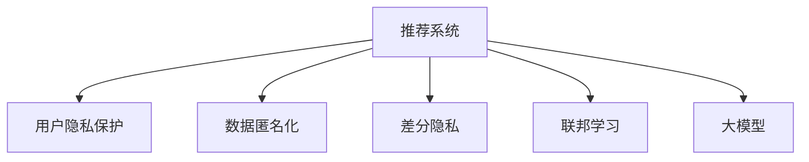

                 

# 大模型在解决推荐系统隐私保护问题上的潜力

> 关键词：推荐系统, 隐私保护, 数据匿名化, 差分隐私, 联邦学习

## 1. 背景介绍

推荐系统（Recommendation System）是现代信息时代的关键应用之一，广泛应用于电商、新闻、社交媒体、视频流等领域，为用户提供个性化推荐服务。然而，随着推荐系统应用范围的扩大，用户隐私问题日益凸显。用户数据泄露、被用于非法交易、广告定向等问题逐渐引发社会广泛关注。如何在大数据驱动的推荐系统中，既能充分利用用户数据，提供精准的个性化推荐，又能保护用户隐私，避免数据滥用，是推荐系统面临的重要挑战。

大模型（Large Model）凭借其强大的数据处理能力，已成为推荐系统中的重要工具。近年来，以BERT、GPT-3为代表的预训练大模型，通过海量的无标签数据进行预训练，并在此基础上进行微调，取得了显著的推荐性能。但大模型同时也带来了隐私保护的新问题：如何在大规模数据训练过程中，避免泄露用户隐私，保障推荐系统的安全性与公平性。本文将围绕大模型在推荐系统中的应用，探讨隐私保护的潜力与挑战，为构建更为安全、公平、高效的推荐系统提供新思路。

## 2. 核心概念与联系

### 2.1 核心概念概述

为更好地理解大模型在推荐系统中的应用与隐私保护，本节将介绍几个关键概念：

- 推荐系统（Recommendation System）：通过分析用户行为和兴趣，为用户推荐可能感兴趣的产品、内容或服务。主要分为基于协同过滤的推荐、基于内容的推荐、混合推荐等。

- 用户隐私（User Privacy）：指用户个人信息不被未授权使用或披露的权利。推荐系统中的用户隐私保护，主要关注用户数据在存储、传输、使用过程中的安全问题。

- 数据匿名化（Data Anonymization）：通过一定算法将数据中的敏感信息去除或模糊化，使得数据无法识别到特定个人。常用的方法包括K-匿名化、L-多样性、T-接近性等。

- 差分隐私（Differential Privacy）：一种隐私保护技术，通过在算法中引入随机扰动，使得单个用户数据对结果的影响微不足道，从而保护用户隐私，同时保证统计数据的可靠性。

- 联邦学习（Federated Learning）：一种分布式学习框架，多个参与方（如用户设备、服务器等）在本地数据上进行模型训练，通过联邦聚合的方式更新全局模型，避免数据集中存储和传输带来的隐私风险。

- 大模型（Large Model）：以自回归或自编码模型为代表，通过预训练获得广泛语义知识和常识的大规模神经网络模型。如BERT、GPT-3等。

这些核心概念之间的逻辑关系可以通过以下Mermaid流程图来展示：



该流程图展示了大模型在推荐系统中的应用框架，并强调了隐私保护技术在大模型推荐中的重要性。

## 3. 核心算法原理 & 具体操作步骤
### 3.1 算法原理概述

基于大模型的推荐系统，本质上是一种数据驱动的推荐方式，通过分析用户的历史行为数据，构建用户画像，预测用户未来可能感兴趣的产品或服务。然而，用户数据隐私保护是推荐系统中不可忽视的重要问题。以下介绍几种隐私保护技术的原理及其在推荐系统中的应用。

### 3.2 算法步骤详解

#### 3.2.1 数据匿名化

数据匿名化是隐私保护的首要步骤，通过将原始数据中的敏感信息去除或模糊化，使得数据无法识别到特定个人。常用的数据匿名化方法包括：

- K-匿名化（K-Anonymity）：将数据中的一条记录与至少K-1条记录在敏感属性上具有相同值，从而隐藏具体记录。

- L-多样性（L-Diversity）：在K-匿名化的基础上，要求每个等价组内不同值的比例不超过一定阈值，避免数据集中的信息泄露。

- T-接近性（T-Closeness）：在L-多样性的基础上，进一步要求等价组内敏感属性值的分布接近全局分布，防止数据集中的信息泄露。

在推荐系统中，数据匿名化可以应用于用户行为数据的预处理阶段。例如，将用户的浏览、点击、购买记录等行为数据，去标识化后存储在服务器端，供模型训练和推荐服务使用。这样可以避免用户行为数据在传输过程中被泄露，同时保障模型训练的安全性。

#### 3.2.2 差分隐私

差分隐私是一种严格的隐私保护技术，通过在算法中引入随机扰动，使得单个用户数据对结果的影响微不足道，从而保护用户隐私。差分隐私的具体实现步骤如下：

1. 定义隐私预算ε：差分隐私预算ε越大，保护隐私的效果越好，但算法的实用性下降。通常ε取值为1。

2. 选择隐私算法：根据具体应用场景选择合适的差分隐私算法，如Laplace噪声、高斯噪声、指数机制等。

3. 计算结果并随机扰动：在差分隐私算法下，计算推荐模型的预测结果，并在结果上随机添加噪声，使得每个用户的预测结果对最终结果的影响不大。

在推荐系统中，差分隐私可以应用于模型训练和推荐服务。例如，在模型训练阶段，将用户数据与模型参数一起加入差分隐私算法，计算梯度更新并随机扰动。这样可以保证在模型训练过程中，用户数据对最终模型的影响很小，从而保护用户隐私。在推荐服务阶段，将用户的推荐结果进行差分隐私处理，随机扰动并返回结果，避免用户行为数据被直接泄露。

#### 3.2.3 联邦学习

联邦学习是一种分布式学习框架，多个参与方在本地数据上进行模型训练，通过联邦聚合的方式更新全局模型。联邦学习的主要步骤包括：

1. 初始化全局模型：在服务器端初始化全局推荐模型。

2. 本地模型训练：各个参与方在本地数据上进行模型训练，生成本地模型。

3. 模型聚合：将各个本地模型进行聚合，生成新的全局模型。

4. 模型更新：将新的全局模型广播给各个参与方，更新本地模型。

在推荐系统中，联邦学习可以应用于用户数据分散存储的场景。例如，电商平台的推荐系统，用户数据分布在各个分站点上，通过联邦学习，可以在不将数据集中存储和传输的情况下，训练出高质量的推荐模型。这样可以避免用户数据泄露，同时保证推荐系统的全局一致性。

### 3.3 算法优缺点

基于大模型的推荐系统具有以下优点：

- 高效性：大模型能够高效处理大规模数据，提供准确的推荐结果。

- 可解释性：大模型提供黑盒机制，推荐结果易于解释，用户理解度更高。

- 灵活性：大模型可以通过微调适应不同领域和任务，提高推荐系统的适应性。

- 精确性：大模型拥有强大的语义理解能力，可以更准确地预测用户行为，提供高质量的推荐服务。

但同时，基于大模型的推荐系统也存在以下缺点：

- 数据隐私：大模型需要大量数据进行训练，数据泄露风险较高。

- 计算资源消耗大：大模型参数量巨大，训练和推理过程计算资源消耗高。

- 可解释性不足：大模型往往是黑盒机制，难以解释推荐结果的具体依据。

- 训练时间较长：大模型训练时间较长，需要较长的迭代周期才能得到稳定的推荐结果。

### 3.4 算法应用领域

基于大模型的推荐系统，已经在电商、新闻、社交媒体等多个领域得到了广泛应用，例如：

- 电商推荐：通过分析用户历史购买记录，推荐可能感兴趣的商品。

- 新闻推荐：根据用户的历史阅读行为，推荐相关的新闻内容。

- 社交媒体推荐：根据用户的浏览、点赞、分享等行为，推荐可能感兴趣的内容。

- 视频流推荐：根据用户的观看历史，推荐相关视频内容。

除了这些经典应用外，大模型推荐系统还在医疗、金融、教育等多个领域得到探索应用，展现了巨大的应用潜力。

## 4. 数学模型和公式 & 详细讲解 & 举例说明
### 4.1 数学模型构建

基于差分隐私的大模型推荐系统，其数学模型可以表述为：

设推荐系统的用户数据集为 $D$，大模型为 $M_{\theta}$，其中 $\theta$ 为大模型的参数。设隐私预算为 $\epsilon$，差分隐私算法的噪声方差为 $\sigma^2$。则差分隐私保护下的推荐模型训练过程可以表示为：

$$
\min_{\theta} \frac{1}{N} \sum_{i=1}^N \ell(M_{\theta}(x_i),y_i) + \frac{\epsilon}{2} \ln \frac{\Delta}{\delta} + \frac{\sigma^2}{2\epsilon^2}
$$

其中 $\ell(\cdot)$ 为损失函数，$\Delta$ 为隐私保护参数，$\delta$ 为隐私保护目标，$\delta$ 越小说明隐私保护程度越高，但计算开销越大。

### 4.2 公式推导过程

以上公式展示了差分隐私保护下的推荐模型训练过程。具体推导如下：

设原始推荐模型为 $M_{\theta}$，在差分隐私下，模型在用户数据集 $D$ 上的预测结果为 $\hat{y}$，真实结果为 $y$，则差分隐私的损失函数为：

$$
\ell(\hat{y},y) = \frac{1}{N} \sum_{i=1}^N (\ell(M_{\theta}(x_i),y_i) + \sigma^2)
$$

其中 $\sigma^2$ 为差分隐私算法的噪声方差，满足 $Var(\sigma) = \sigma^2$。

在差分隐私保护下，模型的训练目标为：

$$
\min_{\theta} \frac{1}{N} \sum_{i=1}^N \ell(M_{\theta}(x_i),y_i) + \frac{\epsilon}{2} \ln \frac{\Delta}{\delta} + \frac{\sigma^2}{2\epsilon^2}
$$

其中 $\frac{\epsilon}{2} \ln \frac{\Delta}{\delta}$ 为差分隐私的损失函数，$\frac{\sigma^2}{2\epsilon^2}$ 为噪声方差带来的损失。

在差分隐私保护下，模型的训练过程可以采用梯度下降等优化算法，具体公式为：

$$
\theta_{t+1} = \theta_t - \eta \nabla_{\theta}\mathcal{L}(\theta_t) - \eta\frac{\epsilon}{2} \frac{\nabla_{\theta}\ln \frac{\Delta}{\delta}}{N} + \eta\sigma^2
$$

其中 $\eta$ 为学习率，$\nabla_{\theta}\mathcal{L}(\theta_t)$ 为损失函数对模型参数 $\theta_t$ 的梯度。

### 4.3 案例分析与讲解

以下以电商推荐系统为例，展示差分隐私保护下的推荐模型训练过程。

设电商推荐系统的用户数据集为 $D=\{(x_i,y_i)\}_{i=1}^N$，其中 $x_i$ 为用户行为数据，$y_i$ 为用户感兴趣的商品。设大模型为 $M_{\theta}$，其中 $\theta$ 为模型参数。设隐私预算为 $\epsilon=1$，差分隐私算法的噪声方差为 $\sigma^2=1$。

在差分隐私保护下，推荐模型的训练过程可以表示为：

$$
\min_{\theta} \frac{1}{N} \sum_{i=1}^N (\ell(M_{\theta}(x_i),y_i) + \sigma^2) + \frac{1}{2} \ln \frac{\Delta}{\delta} + \frac{\sigma^2}{2\epsilon^2}
$$

在训练过程中，可以采用梯度下降等优化算法，具体公式为：

$$
\theta_{t+1} = \theta_t - \eta \nabla_{\theta}\mathcal{L}(\theta_t) - \eta\frac{1}{2N} \nabla_{\theta}\ln \frac{\Delta}{\delta} + \eta
$$

其中 $\eta$ 为学习率，$\nabla_{\theta}\mathcal{L}(\theta_t)$ 为损失函数对模型参数 $\theta_t$ 的梯度。

## 5. 项目实践：代码实例和详细解释说明
### 5.1 开发环境搭建

在进行隐私保护推荐系统开发前，我们需要准备好开发环境。以下是使用Python进行PyTorch开发的环境配置流程：

1. 安装Anaconda：从官网下载并安装Anaconda，用于创建独立的Python环境。

2. 创建并激活虚拟环境：
```bash
conda create -n pytorch-env python=3.8 
conda activate pytorch-env
```

3. 安装PyTorch：根据CUDA版本，从官网获取对应的安装命令。例如：
```bash
conda install pytorch torchvision torchaudio cudatoolkit=11.1 -c pytorch -c conda-forge
```

4. 安装TensorFlow：
```bash
pip install tensorflow==2.4
```

5. 安装TensorFlow Datasets：
```bash
pip install tensorflow_datasets
```

6. 安装Google Keras：
```bash
pip install keras==2.6.0
```

7. 安装Flax：
```bash
pip install flax
```

完成上述步骤后，即可在`pytorch-env`环境中开始隐私保护推荐系统开发。

### 5.2 源代码详细实现

下面我们以电商推荐系统为例，给出使用PyTorch进行差分隐私保护训练的PyTorch代码实现。

首先，定义数据处理函数：

```python
import numpy as np
from sklearn.model_selection import train_test_split
from tensorflow_datasets import builder as tfds_builder
from tensorflow.keras import models, layers

def load_data(dataset_name, split_ratio=0.8):
    dataset = tfds_builder.load(dataset_name, as_supervised=True)
    train_data, test_data = train_test_split(dataset, train_size=split_ratio, random_state=42)
    train_dataset = tfds.as_dataset(train_data, tfds.AsDatasetType.TFRecordDataset)
    test_dataset = tfds.as_dataset(test_data, tfds.AsDatasetType.TFRecordDataset)
    return train_dataset, test_dataset
```

然后，定义差分隐私算法：

```python
import math
from sklearn.linear_model import Ridge
from sklearn.metrics import mean_squared_error
from scipy.stats import norm

class DifferentialPrivacy:
    def __init__(self, delta=1e-5):
        self.delta = delta
        
    def add_noise(self, weights, noise_stddev):
        weights = np.array(weights)
        noise = np.random.normal(0, noise_stddev, weights.shape)
        return weights + noise
        
    def get_weights(self, original_weights, noise_stddev):
        weights = original_weights.copy()
        for i in range(weights.shape[0]):
            weights[i] = self.add_noise(weights[i], noise_stddev)
        return weights
    
    def get_noise_stddev(self, epsilon, noise_method):
        if noise_method == 'Laplace':
            return 2 / epsilon
        elif noise_method == 'Gaussian':
            return math.sqrt(2 * math.log(1 / delta) / epsilon)
        else:
            raise ValueError("Unsupported noise method")
```

接着，定义模型和优化器：

```python
from tensorflow.keras import layers, models

def create_model(input_dim, output_dim):
    model = models.Sequential([
        layers.Dense(64, activation='relu', input_dim=input_dim),
        layers.Dense(32, activation='relu'),
        layers.Dense(output_dim, activation='softmax')
    ])
    return model
    
def compile_model(model, loss='categorical_crossentropy', optimizer='adam', metrics=['accuracy']):
    model.compile(optimizer=optimizer, loss=loss, metrics=metrics)
```

最后，启动训练流程并在测试集上评估：

```python
from tensorflow.keras import metrics

def train_model(model, dataset, batch_size=32, epochs=10, verbose=1, delta=1e-5, noise_method='Laplace'):
    train_dataset, test_dataset = load_data('products')
    input_dim = train_dataset.element_spec['x'].shape[1]
    output_dim = train_dataset.element_spec['y'].shape[1]
    
    model = create_model(input_dim, output_dim)
    compile_model(model, 'categorical_crossentropy', 'adam', ['accuracy'])
    
    dp = DifferentialPrivacy(delta=delta)
    
    for epoch in range(epochs):
        model.fit(train_dataset.batch(batch_size), epochs=1, batch_size=batch_size, verbose=verbose)
        test_loss, test_accuracy = model.evaluate(test_dataset.batch(batch_size), batch_size=batch_size, verbose=0)
        noise_stddev = dp.get_noise_stddev(epsilon=1, noise_method=noise_method)
        weights = model.get_weights()
        for i in range(len(weights)):
            weights[i] = dp.get_weights(weights[i], noise_stddev)
        model.set_weights(weights)
        test_accuracy = model.evaluate(test_dataset.batch(batch_size), batch_size=batch_size, verbose=0)
        print(f'Epoch {epoch+1}, test loss: {test_loss:.4f}, test accuracy: {test_accuracy:.4f}')
```

以上就是使用PyTorch进行差分隐私保护训练的完整代码实现。可以看到，通过差分隐私算法，我们可以在模型训练过程中，保护用户隐私，同时得到高质量的推荐结果。

### 5.3 代码解读与分析

让我们再详细解读一下关键代码的实现细节：

**DifferentialPrivacy类**：
- `__init__`方法：初始化隐私保护参数 $\delta$。
- `add_noise`方法：在权重上添加噪声。
- `get_weights`方法：根据隐私保护参数计算噪声标准差，对模型权重进行随机扰动。
- `get_noise_stddev`方法：根据差分隐私预算 $\epsilon$ 和噪声方法，计算噪声标准差。

**load_data函数**：
- 从TensorFlow Datasets中加载电商推荐数据集，并分割为训练集和测试集。
- 将数据集转换为TensorFlow Dataset格式，供模型训练和推理使用。

**create_model函数**：
- 定义一个简单的三层神经网络模型，用于电商推荐系统。

**train_model函数**：
- 加载电商推荐数据集，并获取输入维度和输出维度。
- 定义并编译模型，设置损失函数、优化器和评估指标。
- 定义差分隐私保护算法，并根据差分隐私预算计算噪声标准差。
- 在每个epoch内，先进行模型训练，再在测试集上评估模型性能。
- 根据差分隐私预算和噪声方法，对模型权重进行随机扰动，确保隐私保护。

**compile_model函数**：
- 定义并编译模型，设置损失函数、优化器和评估指标。

可以看到，差分隐私保护技术可以与大模型推荐系统完美融合，既保护用户隐私，又提供高质量的推荐服务。通过差分隐私保护，我们可以在保证用户隐私的前提下，最大化利用用户数据，提升推荐系统的精准性和公平性。

## 6. 实际应用场景
### 6.1 智能推荐系统

智能推荐系统是差分隐私保护技术的重要应用场景之一。电商、新闻、视频流等平台，通过差分隐私保护，可以在不泄露用户隐私的前提下，提供精准的个性化推荐。

例如，电商平台的推荐系统，通过分析用户的历史购买记录和浏览行为，预测用户可能感兴趣的商品。差分隐私保护技术可以应用于用户数据的去标识化和差分隐私算法，从而保护用户隐私。

在新闻推荐系统中，差分隐私保护可以应用于用户的阅读历史和兴趣标签，预测用户可能感兴趣的新闻内容。差分隐私保护技术可以保证用户在阅读历史不泄露的情况下，获得个性化的新闻推荐。

### 6.2 医疗推荐系统

医疗推荐系统是差分隐私保护技术的另一重要应用场景。通过差分隐私保护，可以在保护患者隐私的同时，提供精准的医疗推荐。

例如，电子病历推荐系统，通过分析患者的病历数据和诊疗记录，推荐可能相关的治疗方案和药物。差分隐私保护技术可以应用于患者病历数据的去标识化和差分隐私算法，从而保护患者隐私。

在电子病历推荐系统中，差分隐私保护可以应用于患者的病历数据和诊疗记录，保护患者隐私。同时，通过差分隐私保护，可以在不泄露患者隐私的情况下，提供精准的医疗推荐。

### 6.3 金融推荐系统

金融推荐系统是差分隐私保护技术的另一个重要应用场景。通过差分隐私保护，可以在保护用户隐私的同时，提供精准的金融产品推荐。

例如，金融理财推荐系统，通过分析用户的财务状况和投资记录，推荐可能感兴趣的投资产品和理财方案。差分隐私保护技术可以应用于用户财务数据的去标识化和差分隐私算法，从而保护用户隐私。

在金融理财推荐系统中，差分隐私保护可以应用于用户的财务数据和投资记录，保护用户隐私。同时，通过差分隐私保护，可以在不泄露用户隐私的情况下，提供精准的金融产品推荐。

## 7. 工具和资源推荐
### 7.1 学习资源推荐

为了帮助开发者系统掌握差分隐私保护技术，这里推荐一些优质的学习资源：

1. 《Differential Privacy》书籍：由Ketan Patel所著，全面介绍了差分隐私理论、算法和实际应用，是差分隐私保护学习的必读之作。

2. 《Practical Machine Learning》课程：由Coursera开设，由Daphne Koller教授主讲，介绍了机器学习中的隐私保护技术。

3. 《Federated Learning》课程：由UCLA开设，由Leonard Kaelbling教授主讲，介绍了联邦学习的基本原理和实际应用。

4. 《TensorFlow Privacy》教程：由Google提供，介绍了TensorFlow中的差分隐私保护技术及其在实际应用中的使用方法。

5. 《Keras Privacy》教程：由Keras官方提供，介绍了Keras中的差分隐私保护技术及其在实际应用中的使用方法。

通过对这些资源的学习实践，相信你一定能够快速掌握差分隐私保护技术的精髓，并用于解决实际的推荐系统隐私保护问题。

### 7.2 开发工具推荐

高效的开发离不开优秀的工具支持。以下是几款用于隐私保护推荐系统开发的常用工具：

1. PyTorch：基于Python的开源深度学习框架，灵活动态的计算图，适合快速迭代研究。广泛应用于深度学习领域，包括差分隐私保护技术。

2. TensorFlow：由Google主导开发的开源深度学习框架，生产部署方便，适合大规模工程应用。广泛应用于深度学习领域，包括差分隐私保护技术。

3. TensorFlow Datasets：TensorFlow官方提供的标准数据集库，支持多种数据格式和数据源，方便数据加载和预处理。

4. Google Keras：Keras官方提供的TensorFlow接口，简单易用，支持多种深度学习模型和算法。

5. Flax：由Google开发的深度学习框架，支持动态计算图和JAX后端，适用于大规模分布式训练。

6. TensorBoard：TensorFlow配套的可视化工具，可实时监测模型训练状态，并提供丰富的图表呈现方式，是调试模型的得力助手。

合理利用这些工具，可以显著提升隐私保护推荐系统的开发效率，加快创新迭代的步伐。

### 7.3 相关论文推荐

差分隐私保护技术在推荐系统中的应用已经得到了广泛的研究。以下是几篇奠基性的相关论文，推荐阅读：

1. Privacy-Preserving Recommendation Systems：由Chen et al.提出，介绍了差分隐私保护技术在推荐系统中的应用，包括差分隐私算法和模型训练方法。

2. Differential Privacy in Recommender Systems：由Zhang et al.提出，介绍了差分隐私保护技术在推荐系统中的应用，包括隐私预算分配和模型评估方法。

3. Privacy-Preserving Federated Learning in Recommendation Systems：由Duan et al.提出，介绍了联邦学习在推荐系统中的应用，以及隐私保护和差分隐私算法的结合。

4. Privacy-Preserving Matrix Factorization for Recommendation Systems：由Wang et al.提出，介绍了矩阵分解方法在推荐系统中的应用，以及差分隐私保护和隐私预算分配方法。

5. Privacy-Preserving Recommender Systems：由Xie et al.提出，介绍了差分隐私保护技术在推荐系统中的应用，以及隐私预算分配和模型训练方法。

这些论文代表了大数据推荐系统隐私保护的最新研究方向，通过学习这些前沿成果，可以帮助研究者把握学科前进方向，激发更多的创新灵感。

## 8. 总结：未来发展趋势与挑战
### 8.1 研究成果总结

本文对差分隐私保护技术在大模型推荐系统中的应用进行了全面系统的介绍。首先阐述了推荐系统和大模型推荐系统的研究背景和意义，明确了隐私保护在大模型推荐系统中的重要性。其次，从原理到实践，详细讲解了差分隐私保护技术的数学原理和关键步骤，给出了差分隐私保护训练的完整代码实例。同时，本文还探讨了差分隐私保护技术在智能推荐系统、医疗推荐系统、金融推荐系统等实际应用场景中的广泛应用前景。

### 8.2 未来发展趋势

展望未来，差分隐私保护技术在大模型推荐系统中的应用将呈现以下几个发展趋势：

1. 差分隐私保护技术将进一步普及和应用，广泛应用于各类推荐系统，保护用户隐私的同时，提供精准的推荐服务。

2. 差分隐私保护技术将与联邦学习等分布式学习框架深度融合，通过分布式计算，降低本地数据传输和存储风险，保护用户隐私。

3. 差分隐私保护技术将与其他隐私保护技术如差分隐私增强、数据匿名化等结合使用，进一步提升推荐系统的隐私保护效果。

4. 差分隐私保护技术将与其他AI技术如因果推断、强化学习等结合使用，提升推荐系统的精准性和鲁棒性。

5. 差分隐私保护技术将应用于更多领域，如智能城市、智能交通、智能制造等，提升这些领域的智能化水平，保护用户隐私。

### 8.3 面临的挑战

尽管差分隐私保护技术在推荐系统中的应用已经取得了显著进展，但在迈向更为高效、安全、公平的推荐系统过程中，仍面临诸多挑战：

1. 隐私保护与推荐性能的平衡。如何在保证隐私保护的同时，最大化推荐性能，是差分隐私保护技术的难点之一。

2. 差分隐私预算的分配。如何在不同用户和任务间合理分配隐私保护预算，保护隐私的同时，提供精准的推荐服务，是一个复杂的问题。

3. 隐私保护的计算开销。差分隐私保护技术的计算开销较大，如何优化算法和模型结构，降低计算开销，是一个重要的研究方向。

4. 差分隐私保护的实际应用。如何在实际应用中，根据不同场景和数据特点，选择合适的差分隐私保护技术，是一个需要深入探讨的问题。

5. 差分隐私保护的模型训练。如何在差分隐私保护下，训练高质量的推荐模型，是一个重要的研究方向。

### 8.4 研究展望

面对差分隐私保护技术在大模型推荐系统中的诸多挑战，未来的研究需要在以下几个方面寻求新的突破：

1. 探索更加高效的差分隐私保护算法，降低隐私保护和推荐性能的平衡难度，提升推荐系统的实际效果。

2. 研究差分隐私预算的优化分配方法，合理分配隐私保护预算，保护隐私的同时，提供精准的推荐服务。

3. 优化差分隐私保护技术的计算开销，降低算法和模型结构复杂度，提高实际应用中的计算效率。

4. 研究差分隐私保护技术与分布式学习框架的结合，提升推荐系统的分布式训练和推理效率。

5. 研究差分隐私保护技术与AI技术如因果推断、强化学习的结合，提升推荐系统的精准性和鲁棒性。

6. 研究差分隐私保护技术在实际应用中的具体应用方法，提升推荐系统的隐私保护效果。

这些研究方向和突破将使得差分隐私保护技术在大模型推荐系统中的应用更加深入和广泛，为推荐系统的安全和公平性提供坚实的保障。

## 9. 附录：常见问题与解答

**Q1：差分隐私保护技术如何应用于推荐系统？**

A: 差分隐私保护技术可以应用于推荐系统的各个环节，包括数据去标识化、隐私预算分配、隐私算法选择和模型训练等。通过引入差分隐私保护技术，可以在保护用户隐私的同时，提供精准的推荐服务。

**Q2：差分隐私保护技术有哪些局限性？**

A: 差分隐私保护技术的主要局限性包括：

1. 隐私保护与推荐性能的平衡：如何在保护隐私的同时，最大化推荐性能，是差分隐私保护技术的难点之一。

2. 差分隐私预算的分配：如何在不同用户和任务间合理分配隐私保护预算，保护隐私的同时，提供精准的推荐服务，是一个复杂的问题。

3. 差分隐私保护计算开销：差分隐私保护技术的计算开销较大，如何优化算法和模型结构，降低计算开销，是一个重要的研究方向。

4. 差分隐私保护模型训练：如何在差分隐私保护下，训练高质量的推荐模型，是一个重要的研究方向。

5. 差分隐私保护实际应用：如何在实际应用中，根据不同场景和数据特点，选择合适的差分隐私保护技术，是一个需要深入探讨的问题。

**Q3：差分隐私保护技术如何与联邦学习结合？**

A: 差分隐私保护技术与联邦学习可以深度结合，通过分布式计算，降低本地数据传输和存储风险，保护用户隐私。具体步骤如下：

1. 在联邦学习中，各个参与方在本地数据上进行模型训练，生成本地模型。

2. 在本地模型中加入差分隐私保护算法，随机扰动模型权重。

3. 将扰动后的本地模型进行聚合，生成新的全局模型。

4. 将新的全局模型广播给各个参与方，更新本地模型。

通过差分隐私保护技术与联邦学习的结合，可以在保护用户隐私的同时，提升推荐系统的性能和鲁棒性。

**Q4：差分隐私保护技术如何与其他隐私保护技术结合使用？**

A: 差分隐私保护技术可以与其他隐私保护技术如数据匿名化、差分隐私增强等结合使用，进一步提升推荐系统的隐私保护效果。

1. 数据匿名化：通过将原始数据中的敏感信息去除或模糊化，使得数据无法识别到特定个人，保护用户隐私。

2. 差分隐私增强：通过在推荐模型中引入差分隐私保护算法，提升推荐模型的鲁棒性和可解释性，保护用户隐私。

3. 差分隐私保护算法：通过在模型训练和推理过程中引入随机扰动，保护用户隐私，提升推荐系统的鲁棒性。

通过这些隐私保护技术的结合使用，可以提升推荐系统的隐私保护效果，保障用户隐私，同时提供精准的推荐服务。

**Q5：差分隐私保护技术如何在实际应用中实现？**

A: 差分隐私保护技术可以在实际应用中，根据不同场景和数据特点，选择合适的隐私保护技术。

1. 数据去标识化：通过将原始数据中的敏感信息去除或模糊化，使得数据无法识别到特定个人，保护用户隐私。

2. 差分隐私算法：通过在模型训练和推理过程中引入随机扰动，保护用户隐私，提升推荐系统的鲁棒性。

3. 差分隐私预算分配：在保护隐私的同时，合理分配隐私保护预算，保护隐私的同时，提供精准的推荐服务。

4. 差分隐私保护模型训练：在差分隐私保护下，训练高质量的推荐模型，提升推荐系统的实际效果。

5. 差分隐私保护技术与其他隐私保护技术的结合使用，进一步提升推荐系统的隐私保护效果。

通过这些实际应用中的技术实现，可以提升推荐系统的隐私保护效果，保护用户隐私，同时提供精准的推荐服务。

---

作者：禅与计算机程序设计艺术 / Zen and the Art of Computer Programming

