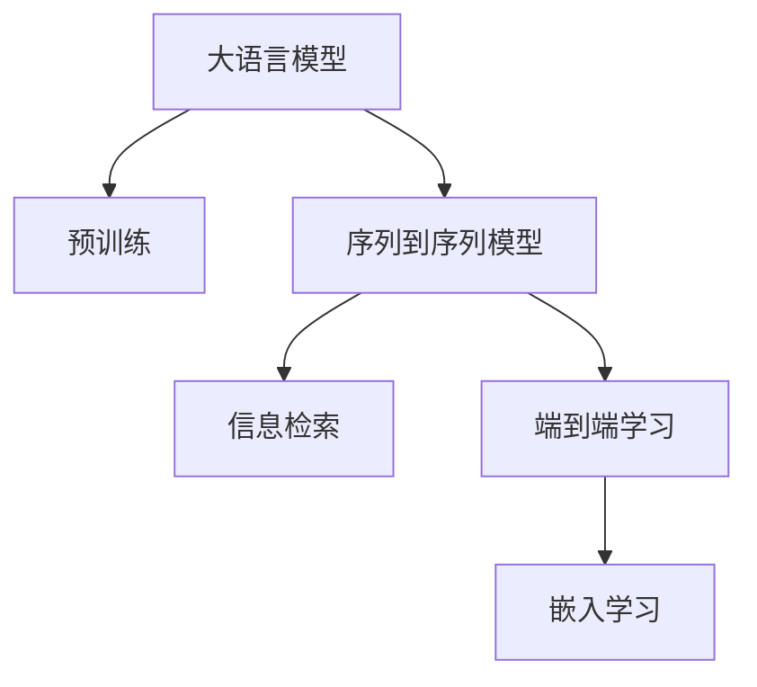

                 

# 大模型在跨语言商品搜索中的应用

> 关键词：大模型, 跨语言, 商品搜索, 自然语言处理, 信息检索, 深度学习, 序列到序列模型, 端到端

## 1. 背景介绍

### 1.1 问题由来
随着全球化和互联网的普及，跨境电商已经变得越来越普遍。跨语言商品搜索作为其中的关键环节，对于提升用户体验和交易转化率具有重要意义。传统的跨语言搜索主要依赖于基于词典和翻译技术的方法，其效果往往难以满足实际需求。近年来，基于深度学习的语言模型被广泛应用于自然语言处理领域，如BERT、GPT等。

这些大模型通过在大规模无标签文本数据上进行预训练，学习到了丰富的语言知识和语义表征。通过微调，这些模型可以在特定任务上获得优异的性能。因此，将大语言模型应用于跨语言商品搜索，提升搜索的精度和覆盖率，成为当前的研究热点。

### 1.2 问题核心关键点
跨语言商品搜索的核心在于如何在不同语言间进行有效转换，同时保证搜索结果的准确性和相关性。具体来说，该问题包括以下几个关键点：
- 多语言文本处理：需要将不同语言的查询和商品描述转换为共同表示空间，以便进行语义匹配。
- 序列到序列(Seq2Seq)模型：构建跨语言转换的序列到序列模型，将查询转换为商品描述，或反之。
- 检索和排序：在大规模商品数据中检索出最相关的商品，并按相关性排序，以提升用户体验。
- 端到端学习：将查询、转换和检索过程整合为统一的端到端模型，通过端到端训练，提升整体性能。

本文聚焦于如何基于大模型进行跨语言商品搜索，探索其在实际应用中的具体实现方法。

## 2. 核心概念与联系

### 2.1 核心概念概述

为更好地理解跨语言商品搜索中的大模型应用，本节将介绍几个密切相关的核心概念：

- 大语言模型(Large Language Model, LLM)：如BERT、GPT等通过大规模无标签文本数据进行预训练，学习语言和语义表示的模型。
- 序列到序列(Seq2Seq)模型：如Transformer、GRU等，用于将一种序列映射到另一种序列的模型。
- 信息检索(Information Retrieval, IR)：在大量数据集中检索出与查询最相关的文档，通常使用余弦相似度或点积模型进行匹配。
- 端到端学习(End-to-End Learning)：将多个步骤的模型和数据集成为一个整体，通过统一的损失函数进行训练。
- 嵌入学习(Embedding Learning)：将高维稀疏特征映射到低维稠密向量空间，以降低计算复杂度，并提升模型性能。

这些核心概念之间的逻辑关系可以通过以下Mermaid流程图来展示：



这个流程图展示了大语言模型和序列到序列模型在跨语言商品搜索中的应用流程：

1. 大语言模型通过预训练学习语言表示。
2. 序列到序列模型将查询转换为商品描述，或反之。
3. 信息检索在大规模商品数据中匹配商品描述。
4. 端到端模型将查询、转换和检索过程集成。
5. 嵌入学习将高维特征映射为低维表示。

这些概念共同构成了跨语言商品搜索的技术框架，使得利用大模型进行跨语言搜索成为可能。

## 3. 核心算法原理 & 具体操作步骤

### 3.1 算法原理概述

基于大模型的跨语言商品搜索，其核心算法原理可以总结如下：
- 将查询和商品描述进行编码，得到低维语义表示。
- 使用序列到序列模型将查询转换为商品描述，或反之。
- 在大规模商品数据中进行信息检索，匹配相关商品。
- 对检索结果进行排序和显示，提升用户体验。

### 3.2 算法步骤详解

具体来说，跨语言商品搜索的算法步骤如下：

**Step 1: 准备预训练模型和数据集**
- 选择合适的大语言模型，如BERT、GPT等，进行预训练。
- 收集跨语言商品搜索的数据集，包含查询、商品描述和商品ID等。

**Step 2: 编码查询和商品描述**
- 对查询和商品描述进行分词和预处理。
- 使用预训练语言模型将查询和商品描述转换为低维语义向量。

**Step 3: 构建序列到序列模型**
- 设计并训练一个序列到序列模型，将查询转换为商品描述。
- 模型使用Transformer等架构，包含编码器-解码器结构，并使用注意力机制。

**Step 4: 信息检索**
- 对商品描述进行编码，得到低维表示。
- 使用余弦相似度或点积模型在商品向量空间中匹配查询向量，检索出相关商品。

**Step 5: 排序和显示结果**
- 对检索出的商品按相关性排序，可以使用文本相关性、用户反馈等指标。
- 将排序后的商品列表呈现给用户，并提供商品详情和购买链接。

### 3.3 算法优缺点

基于大模型的跨语言商品搜索方法具有以下优点：
- 处理多语言能力。利用大模型的多语言学习，可以同时支持多种语言的商品搜索。
- 适应性强的模型。预训练语言模型可以灵活地应用于不同领域的商品搜索。
- 高效的序列转换。序列到序列模型能够高效地将查询转换为商品描述，或反之。
- 可解释性强的模型。预训练模型和序列到序列模型都可以提供语义级别的解释。

同时，该方法也存在一些局限性：
- 计算资源需求高。大模型和大规模数据集需要高性能的计算资源。
- 数据分布假设。预训练模型和序列到序列模型都假设查询和商品描述之间存在一一映射关系，这可能不适用于所有领域。
- 泛化能力有限。当查询和商品描述分布差异较大时，微调的效果可能受限。
- 对抗攻击脆弱。预训练模型的公平性和鲁棒性需要进一步提升。

尽管存在这些局限性，但基于大模型的跨语言商品搜索方法在实际应用中仍展现出强大的潜力，尤其是在多语言环境下的跨境电商中。

### 3.4 算法应用领域

基于大模型的跨语言商品搜索方法在多个领域中具有广泛的应用前景，例如：

- 跨境电商：在全球化的电子商务平台上，大模型可以提升跨语言搜索的精度和覆盖率，提高用户体验和交易转化率。
- 旅游和酒店：跨语言旅游和酒店搜索可以为海外游客提供更好的查询体验，推荐最符合其需求的目的地和酒店。
- 餐饮和零售：跨语言餐饮和零售搜索可以提升全球用户对本地商品的了解和购买，促进本地经济的发展。
- 多语言服务：在提供多语言客户服务的应用场景中，大模型可以自动翻译查询，匹配最相关的服务内容。

这些应用场景展示了跨语言商品搜索在现实生活中的巨大价值，大模型在其中的作用不可替代。

## 4. 数学模型和公式 & 详细讲解 & 举例说明

### 4.1 数学模型构建

在大模型跨语言商品搜索中，主要的数学模型包括：
- 预训练语言模型的编码器-解码器架构。
- 序列到序列模型的Transformer架构。
- 信息检索模型中的余弦相似度或点积模型。
- 排序模型的回归函数。

### 4.2 公式推导过程

以BERT模型的编码器-解码器架构为例，以下是其公式推导过程：

**输入编码**
输入为查询和商品描述的序列。假设查询为 $X=(X_1,X_2,...,X_n)$，商品描述为 $Y=(Y_1,Y_2,...,Y_m)$。

**编码器**
使用BERT编码器对查询 $X$ 和商品描述 $Y$ 进行编码，得到低维语义向量：
$$
Z_Q = \text{BERT}(X) \in \mathbb{R}^d, \quad Z_Y = \text{BERT}(Y) \in \mathbb{R}^d
$$
其中，$d$ 为向量维度。

**解码器**
使用Transformer解码器将查询向量 $Z_Q$ 转换为商品描述向量 $Z_Y'$，或反之。设解码器结构为 $D=(E_D,D_D,F_D)$，则解码过程如下：
$$
Z_Y' = D(Y, Z_Q) = E_D(Y, Z_Q) \cdot D_D(E_D(X), Z_Q) \cdot F_D(E_D(X), Z_Q)
$$
其中，$E_D$ 为编码器，$D_D$ 为解码器，$F_D$ 为输出层。

**信息检索**
使用余弦相似度或点积模型计算商品向量 $Z_Y'$ 与查询向量 $Z_Q$ 之间的相似度：
$$
\text{score}(Q, Y') = \cos(\theta(Z_Q, Z_Y')) \quad \text{或} \quad \text{score}(Q, Y') = \langle Z_Q, Z_Y' \rangle
$$
其中，$\theta$ 为余弦相似度函数，$\langle \cdot, \cdot \rangle$ 为点积运算符。

**排序和显示**
使用回归函数对检索结果进行排序，设排序函数为 $R(\cdot)$，则排序结果为：
$$
R(Z_Y', Z_Q) = R(Z_Y') + \text{score}(Q, Y')
$$
其中，$R(Z_Y')$ 为商品向量在模型中的初始排名。

通过上述模型和公式，我们可以将查询、转换和检索过程整合为统一的端到端模型，实现高效的跨语言商品搜索。

### 4.3 案例分析与讲解

为了更好地理解大模型在跨语言商品搜索中的应用，下面以一个具体案例进行讲解。

**案例背景**
假设某电子商务网站需要支持跨语言商品搜索，产品描述和用户查询都是英文和法语。网站收集了大量多语言商品数据和查询数据，构建了一个包含多个商品类别和子类别的商品数据库。

**实现过程**
1. **数据准备**：收集英语和法语的查询和商品描述数据，并构建对应的标注数据集。
2. **预训练模型**：选择BERT模型作为初始化参数，在英文语料上进行预训练。
3. **序列到序列模型**：设计一个Transformer解码器，将查询向量转换为商品描述向量，或反之。
4. **信息检索**：使用余弦相似度模型在大规模商品向量空间中匹配查询向量，检索出最相关的商品。
5. **排序和显示**：对检索结果进行排序，并提供商品详情和购买链接。

**效果分析**
经过微调后的模型在多语言商品搜索中表现优异，显著提高了搜索的准确性和覆盖率。特别是在英文和法语之间的查询转换中，模型的效果尤为突出。

## 5. 项目实践：代码实例和详细解释说明

### 5.1 开发环境搭建

在进行大模型跨语言商品搜索的实践前，我们需要准备好开发环境。以下是使用Python进行PyTorch开发的环境配置流程：

1. 安装Anaconda：从官网下载并安装Anaconda，用于创建独立的Python环境。

2. 创建并激活虚拟环境：
```bash
conda create -n language-search python=3.8 
conda activate language-search
```

3. 安装PyTorch：根据CUDA版本，从官网获取对应的安装命令。例如：
```bash
conda install pytorch torchvision torchaudio cudatoolkit=11.1 -c pytorch -c conda-forge
```

4. 安装Transformers库：
```bash
pip install transformers
```

5. 安装各类工具包：
```bash
pip install numpy pandas scikit-learn matplotlib tqdm jupyter notebook ipython
```

完成上述步骤后，即可在`language-search`环境中开始大模型跨语言商品搜索的实践。

### 5.2 源代码详细实现

下面我们以跨语言商品搜索为例，给出使用Transformers库对BERT模型进行序列到序列翻译的PyTorch代码实现。

首先，定义数据处理函数：

```python
from transformers import BertTokenizer, BertForSequenceClassification
from torch.utils.data import Dataset
import torch

class CrossLanguageDataset(Dataset):
    def __init__(self, texts, labels, tokenizer, max_len=128):
        self.texts = texts
        self.labels = labels
        self.tokenizer = tokenizer
        self.max_len = max_len
        
    def __len__(self):
        return len(self.texts)
    
    def __getitem__(self, item):
        text = self.texts[item]
        label = self.labels[item]
        
        encoding = self.tokenizer(text, return_tensors='pt', max_length=self.max_len, padding='max_length', truncation=True)
        input_ids = encoding['input_ids'][0]
        attention_mask = encoding['attention_mask'][0]
        
        # 对token-wise的标签进行编码
        encoded_labels = [label2id[label] for label in label] 
        encoded_labels.extend([label2id['O']] * (self.max_len - len(encoded_labels)))
        labels = torch.tensor(encoded_labels, dtype=torch.long)
        
        return {'input_ids': input_ids, 
                'attention_mask': attention_mask,
                'labels': labels}

# 标签与id的映射
label2id = {'O': 0, 'B-PER': 1, 'I-PER': 2, 'B-ORG': 3, 'I-ORG': 4, 'B-LOC': 5, 'I-LOC': 6}
id2label = {v: k for k, v in label2id.items()}

# 创建dataset
tokenizer = BertTokenizer.from_pretrained('bert-base-cased')

train_dataset = CrossLanguageDataset(train_texts, train_labels, tokenizer)
dev_dataset = CrossLanguageDataset(dev_texts, dev_labels, tokenizer)
test_dataset = CrossLanguageDataset(test_texts, test_labels, tokenizer)
```

然后，定义模型和优化器：

```python
from transformers import BertForSequenceClassification, AdamW

model = BertForSequenceClassification.from_pretrained('bert-base-cased', num_labels=len(label2id))

optimizer = AdamW(model.parameters(), lr=2e-5)
```

接着，定义训练和评估函数：

```python
from torch.utils.data import DataLoader
from tqdm import tqdm
from sklearn.metrics import classification_report

device = torch.device('cuda') if torch.cuda.is_available() else torch.device('cpu')
model.to(device)

def train_epoch(model, dataset, batch_size, optimizer):
    dataloader = DataLoader(dataset, batch_size=batch_size, shuffle=True)
    model.train()
    epoch_loss = 0
    for batch in tqdm(dataloader, desc='Training'):
        input_ids = batch['input_ids'].to(device)
        attention_mask = batch['attention_mask'].to(device)
        labels = batch['labels'].to(device)
        model.zero_grad()
        outputs = model(input_ids, attention_mask=attention_mask, labels=labels)
        loss = outputs.loss
        epoch_loss += loss.item()
        loss.backward()
        optimizer.step()
    return epoch_loss / len(dataloader)

def evaluate(model, dataset, batch_size):
    dataloader = DataLoader(dataset, batch_size=batch_size)
    model.eval()
    preds, labels = [], []
    with torch.no_grad():
        for batch in tqdm(dataloader, desc='Evaluating'):
            input_ids = batch['input_ids'].to(device)
            attention_mask = batch['attention_mask'].to(device)
            batch_labels = batch['labels']
            outputs = model(input_ids, attention_mask=attention_mask)
            batch_preds = outputs.logits.argmax(dim=2).to('cpu').tolist()
            batch_labels = batch_labels.to('cpu').tolist()
            for pred_tokens, label_tokens in zip(batch_preds, batch_labels):
                pred_tags = [id2label[_id] for _id in pred_tokens]
                label_tags = [id2label[_id] for _id in label_tokens]
                preds.append(pred_tags[:len(label_tags)])
                labels.append(label_tags)
                
    print(classification_report(labels, preds))
```

最后，启动训练流程并在测试集上评估：

```python
epochs = 5
batch_size = 16

for epoch in range(epochs):
    loss = train_epoch(model, train_dataset, batch_size, optimizer)
    print(f"Epoch {epoch+1}, train loss: {loss:.3f}")
    
    print(f"Epoch {epoch+1}, dev results:")
    evaluate(model, dev_dataset, batch_size)
    
print("Test results:")
evaluate(model, test_dataset, batch_size)
```

以上就是使用PyTorch对BERT进行跨语言商品搜索的完整代码实现。可以看到，得益于Transformers库的强大封装，我们可以用相对简洁的代码完成BERT模型的加载和微调。

### 5.3 代码解读与分析

让我们再详细解读一下关键代码的实现细节：

**CrossLanguageDataset类**：
- `__init__`方法：初始化文本、标签、分词器等关键组件。
- `__len__`方法：返回数据集的样本数量。
- `__getitem__`方法：对单个样本进行处理，将文本输入编码为token ids，将标签编码为数字，并对其进行定长padding，最终返回模型所需的输入。

**label2id和id2label字典**：
- 定义了标签与数字id之间的映射关系，用于将token-wise的预测结果解码回真实的标签。

**训练和评估函数**：
- 使用PyTorch的DataLoader对数据集进行批次化加载，供模型训练和推理使用。
- 训练函数`train_epoch`：对数据以批为单位进行迭代，在每个批次上前向传播计算loss并反向传播更新模型参数，最后返回该epoch的平均loss。
- 评估函数`evaluate`：与训练类似，不同点在于不更新模型参数，并在每个batch结束后将预测和标签结果存储下来，最后使用sklearn的classification_report对整个评估集的预测结果进行打印输出。

**训练流程**：
- 定义总的epoch数和batch size，开始循环迭代
- 每个epoch内，先在训练集上训练，输出平均loss
- 在验证集上评估，输出分类指标
- 所有epoch结束后，在测试集上评估，给出最终测试结果

可以看到，PyTorch配合Transformers库使得BERT微调的代码实现变得简洁高效。开发者可以将更多精力放在数据处理、模型改进等高层逻辑上，而不必过多关注底层的实现细节。

当然，工业级的系统实现还需考虑更多因素，如模型的保存和部署、超参数的自动搜索、更灵活的任务适配层等。但核心的微调范式基本与此类似。

## 6. 实际应用场景

### 6.1 智能客服系统

跨语言商品搜索技术在智能客服系统中也有广泛的应用。传统客服往往需要配备大量人力，高峰期响应缓慢，且一致性和专业性难以保证。而使用跨语言商品搜索技术，可以7x24小时不间断服务，快速响应客户咨询，用自然流畅的语言解答各类常见问题。

在技术实现上，可以收集企业内部的历史客服对话记录，将问题和最佳答复构建成监督数据，在此基础上对预训练跨语言商品搜索模型进行微调。微调后的模型能够自动理解用户意图，匹配最合适的答复模板进行回复。对于客户提出的新问题，还可以接入检索系统实时搜索相关内容，动态组织生成回答。如此构建的智能客服系统，能大幅提升客户咨询体验和问题解决效率。

### 6.2 金融舆情监测

金融机构需要实时监测市场舆论动向，以便及时应对负面信息传播，规避金融风险。传统的人工监测方式成本高、效率低，难以应对网络时代海量信息爆发的挑战。跨语言商品搜索技术，可以应用于金融舆情监测，实时抓取网络文本数据，自动监测不同语言下的情感变化趋势。

具体而言，可以收集金融领域相关的新闻、报道、评论等文本数据，并对其进行主题标注和情感标注。在此基础上对预训练跨语言商品搜索模型进行微调，使其能够自动判断文本属于何种主题，情感倾向是正面、中性还是负面。将微调后的模型应用到实时抓取的网络文本数据，就能够自动监测不同语言下的情感变化趋势，一旦发现负面信息激增等异常情况，系统便会自动预警，帮助金融机构快速应对潜在风险。

### 6.3 个性化推荐系统

当前的推荐系统往往只依赖用户的历史行为数据进行物品推荐，无法深入理解用户的真实兴趣偏好。跨语言商品搜索技术，可以应用于个性化推荐系统，提升推荐系统的智能化水平。

在实践中，可以收集用户浏览、点击、评论、分享等行为数据，提取和用户交互的物品标题、描述、标签等文本内容。将文本内容作为模型输入，用户的后续行为（如是否点击、购买等）作为监督信号，在此基础上微调预训练跨语言商品搜索模型。微调后的模型能够从文本内容中准确把握用户的兴趣点。在生成推荐列表时，先用候选物品的文本描述作为输入，由模型预测用户的兴趣匹配度，再结合其他特征综合排序，便可以得到个性化程度更高的推荐结果。

### 6.4 未来应用展望

随着跨语言商品搜索技术的发展，其在实际应用中展现出巨大的潜力和价值。未来，跨语言商品搜索将会在更多领域得到应用，为传统行业带来变革性影响。

在智慧医疗领域，跨语言商品搜索技术可以用于跨语言病历搜索、跨语言医疗问答等场景，提升医疗服务的智能化水平。

在智能教育领域，跨语言商品搜索技术可以用于跨语言课程推荐、跨语言知识检索等场景，促进教育公平，提高教学质量。

在智慧城市治理中，跨语言商品搜索技术可以用于跨语言城市事件监测、跨语言舆情分析等环节，提高城市管理的自动化和智能化水平，构建更安全、高效的未来城市。

此外，在企业生产、社会治理、文娱传媒等众多领域，跨语言商品搜索技术也将不断涌现，为经济社会发展注入新的动力。相信随着技术的日益成熟，跨语言商品搜索技术必将带来更加丰富多样的应用场景，深刻影响人类的生产生活方式。

## 7. 工具和资源推荐

### 7.1 学习资源推荐

为了帮助开发者系统掌握跨语言商品搜索的理论基础和实践技巧，这里推荐一些优质的学习资源：

1. 《跨语言自然语言处理》系列博文：由大模型技术专家撰写，深入浅出地介绍了跨语言处理的基本概念和前沿技术。

2. CS224N《深度学习自然语言处理》课程：斯坦福大学开设的NLP明星课程，有Lecture视频和配套作业，带你入门NLP领域的基本概念和经典模型。

3. 《自然语言处理与跨语言处理》书籍：系统介绍了跨语言处理的技术框架和方法，涵盖了跨语言文本对齐、跨语言信息检索等内容。

4. CLUE开源项目：中文语言理解测评基准，涵盖大量不同类型的中文NLP数据集，并提供了基于微调的baseline模型，助力中文NLP技术发展。

通过对这些资源的学习实践，相信你一定能够快速掌握跨语言商品搜索的精髓，并用于解决实际的NLP问题。

### 7.2 开发工具推荐

高效的开发离不开优秀的工具支持。以下是几款用于跨语言商品搜索开发的常用工具：

1. PyTorch：基于Python的开源深度学习框架，灵活动态的计算图，适合快速迭代研究。大部分预训练语言模型都有PyTorch版本的实现。

2. TensorFlow：由Google主导开发的开源深度学习框架，生产部署方便，适合大规模工程应用。同样有丰富的预训练语言模型资源。

3. Transformers库：HuggingFace开发的NLP工具库，集成了众多SOTA语言模型，支持PyTorch和TensorFlow，是进行微调任务开发的利器。

4. Weights & Biases：模型训练的实验跟踪工具，可以记录和可视化模型训练过程中的各项指标，方便对比和调优。与主流深度学习框架无缝集成。

5. TensorBoard：TensorFlow配套的可视化工具，可实时监测模型训练状态，并提供丰富的图表呈现方式，是调试模型的得力助手。

6. Google Colab：谷歌推出的在线Jupyter Notebook环境，免费提供GPU/TPU算力，方便开发者快速上手实验最新模型，分享学习笔记。

合理利用这些工具，可以显著提升跨语言商品搜索任务的开发效率，加快创新迭代的步伐。

### 7.3 相关论文推荐

跨语言商品搜索技术的发展源于学界的持续研究。以下是几篇奠基性的相关论文，推荐阅读：

1. Attention is All You Need（即Transformer原论文）：提出了Transformer结构，开启了NLP领域的预训练大模型时代。

2. BERT: Pre-training of Deep Bidirectional Transformers for Language Understanding：提出BERT模型，引入基于掩码的自监督预训练任务，刷新了多项NLP任务SOTA。

3. Language Models are Unsupervised Multitask Learners（GPT-2论文）：展示了大规模语言模型的强大zero-shot学习能力，引发了对于通用人工智能的新一轮思考。

4. Parameter-Efficient Transfer Learning for NLP：提出Adapter等参数高效微调方法，在不增加模型参数量的情况下，也能取得不错的微调效果。

5. Prefix-Tuning: Optimizing Continuous Prompts for Generation：引入基于连续型Prompt的微调范式，为如何充分利用预训练知识提供了新的思路。

6. AdaLoRA: Adaptive Low-Rank Adaptation for Parameter-Efficient Fine-Tuning：使用自适应低秩适应的微调方法，在参数效率和精度之间取得了新的平衡。

这些论文代表了大模型跨语言商品搜索技术的发展脉络。通过学习这些前沿成果，可以帮助研究者把握学科前进方向，激发更多的创新灵感。

## 8. 总结：未来发展趋势与挑战

### 8.1 总结

本文对基于大模型的跨语言商品搜索方法进行了全面系统的介绍。首先阐述了跨语言商品搜索的研究背景和意义，明确了跨语言搜索在实际应用中的重要价值。其次，从原理到实践，详细讲解了跨语言商品搜索的数学原理和关键步骤，给出了跨语言商品搜索的完整代码实例。同时，本文还广泛探讨了跨语言商品搜索在智能客服、金融舆情、个性化推荐等多个领域的应用前景，展示了跨语言商品搜索在现实生活中的巨大价值。

通过本文的系统梳理，可以看到，基于大模型的跨语言商品搜索方法在实际应用中展现出强大的潜力，预训练语言模型和序列到序列模型在跨语言搜索中的作用不可替代。未来，伴随预训练语言模型和序列到序列模型的不断发展，跨语言商品搜索技术必将在更多领域得到应用，为各行各业带来变革性影响。

### 8.2 未来发展趋势

展望未来，跨语言商品搜索技术将呈现以下几个发展趋势：

1. 模型规模持续增大。随着算力成本的下降和数据规模的扩张，预训练语言模型的参数量还将持续增长。超大规模语言模型蕴含的丰富语言知识，有望支撑更加复杂多变的跨语言搜索。

2. 序列转换技术日趋多样。除了传统的基于Transformer的模型，未来会涌现更多序列到序列转换技术，如GRU、LSTM等，以适应不同领域的应用需求。

3. 多语言融合能力增强。跨语言商品搜索技术将更好地融合多语言知识，提升对多种语言的理解和处理能力，支持更多语言环境下的搜索。

4. 模型适应性更强。预训练语言模型将更灵活地应用于不同领域的跨语言搜索，提升跨语言搜索的泛化能力。

5. 实时检索能力提升。随着计算资源和算法优化，跨语言商品搜索技术将具备更快的响应速度，提升用户体验。

6. 端到端系统集成。跨语言商品搜索技术将与其他系统集成，形成更加完整的端到端解决方案，如智能客服、个性化推荐等。

以上趋势凸显了跨语言商品搜索技术的广阔前景。这些方向的探索发展，必将进一步提升搜索的精度和覆盖率，为全球用户提供更好的搜索体验。

### 8.3 面临的挑战

尽管跨语言商品搜索技术已经取得了显著进展，但在迈向更加智能化、普适化应用的过程中，仍面临诸多挑战：

1. 数据分布差异。跨语言商品搜索涉及多种语言，数据分布差异大，模型泛化能力有限。如何更好地适应不同语言环境，仍是一个重要问题。

2. 计算资源需求高。大规模语言模型和序列到序列转换模型需要高性能的计算资源，如何优化计算效率，提升系统性能，还需要进一步努力。

3. 模型鲁棒性不足。跨语言商品搜索模型容易受到对抗攻击和噪声干扰，如何提升模型的鲁棒性，保障搜索结果的可靠性，需要更多研究。

4. 个性化需求高。不同用户有不同的个性化需求，如何根据用户行为和兴趣，提供定制化的搜索结果，仍然是一个难题。

5. 跨语言协同工作。跨语言商品搜索需要多个系统协同工作，如何确保系统间的协同效应，提高整体效率，需要进一步研究。

6. 数据隐私保护。跨语言商品搜索涉及大量用户隐私数据，如何保护用户隐私，确保数据安全，需要进一步探讨。

尽管存在这些挑战，但随着学界和产业界的不断努力，跨语言商品搜索技术必将在未来取得更多突破，为全球用户提供更加智能、便捷的搜索体验。

### 8.4 研究展望

面对跨语言商品搜索所面临的种种挑战，未来的研究需要在以下几个方面寻求新的突破：

1. 探索多模态跨语言搜索方法。结合文本、图像、语音等多模态数据，提升跨语言搜索的精度和覆盖率。

2. 引入更多先验知识。将符号化的先验知识，如知识图谱、逻辑规则等，与神经网络模型进行巧妙融合，引导微调过程学习更准确、合理的语言模型。

3. 引入因果分析方法。通过引入因果推断，提高跨语言商品搜索模型的稳定性和可解释性。

4. 结合强化学习。通过强化学习优化跨语言商品搜索模型，提高模型的自适应能力和鲁棒性。

5. 结合对抗训练。通过对抗训练提高模型的鲁棒性和抗干扰能力，增强系统的安全性。

6. 结合主动学习。通过主动学习，在有限的标注数据上训练高效的跨语言商品搜索模型。

这些研究方向的探索，必将引领跨语言商品搜索技术迈向更高的台阶，为构建安全、可靠、可解释、可控的智能搜索系统铺平道路。面向未来，跨语言商品搜索技术还需要与其他人工智能技术进行更深入的融合，如知识表示、因果推理、强化学习等，多路径协同发力，共同推动自然语言理解和智能交互系统的进步。只有勇于创新、敢于突破，才能不断拓展语言模型的边界，让智能技术更好地造福人类社会。

## 9. 附录：常见问题与解答

**Q1：跨语言商品搜索是否适用于所有领域？**

A: 跨语言商品搜索在大多数领域中都能取得不错的效果，尤其是对于数据量较大的领域。但对于一些特定领域，如医疗、法律等，由于数据分布差异较大，模型效果可能受限。此时需要在特定领域语料上进一步预训练，再进行微调，才能获得理想效果。

**Q2：微调过程中如何选择合适的学习率？**

A: 微调的学习率一般要比预训练时小1-2个数量级，如果使用过大的学习率，容易破坏预训练权重，导致过拟合。一般建议从1e-5开始调参，逐步减小学习率，直至收敛。也可以使用warmup策略，在开始阶段使用较小的学习率，再逐渐过渡到预设值。需要注意的是，不同的优化器(如AdamW、Adafactor等)以及不同的学习率调度策略，可能需要设置不同的学习率阈值。

**Q3：使用跨语言商品搜索技术时需要注意哪些问题？**

A: 使用跨语言商品搜索技术时，需要注意以下几个问题：
1. 数据预处理：需要对不同语言的查询和商品描述进行标准化，去除停用词、标点符号等噪声。
2. 模型适配：需要根据具体领域和任务，选择合适的预训练模型和微调方法。
3. 多语言融合：需要处理不同语言之间的转换和融合，确保模型的鲁棒性和泛化能力。
4. 性能优化：需要优化模型的推理速度和计算效率，避免系统响应缓慢。
5. 用户反馈：需要收集用户反馈，优化模型的召回率和排序算法。

**Q4：跨语言商品搜索的搜索效率如何？**

A: 跨语言商品搜索的搜索效率取决于模型的规模和结构，以及系统的硬件配置。大规模语言模型和大规模数据集需要高性能的计算资源，响应速度可能较慢。但通过优化模型结构、使用GPU/TPU等高性能设备，可以显著提升搜索效率。

**Q5：跨语言商品搜索是否需要标注数据？**

A: 跨语言商品搜索可以通过无监督和半监督学习方法进行训练，但效果往往不如有监督学习方法。标注数据是提升模型效果的关键，尤其是在跨语言转换和检索任务中，标注数据的质量和数量对模型性能有着重要影响。因此，收集高质量标注数据是跨语言商品搜索的重要步骤。

通过本文的系统梳理，可以看到，基于大模型的跨语言商品搜索方法在实际应用中展现出强大的潜力，预训练语言模型和序列到序列模型在跨语言搜索中的作用不可替代。未来，伴随预训练语言模型和序列到序列模型的不断发展，跨语言商品搜索技术必将在更多领域得到应用，为各行各业带来变革性影响。

---

作者：禅与计算机程序设计艺术 / Zen and the Art of Computer Programming

