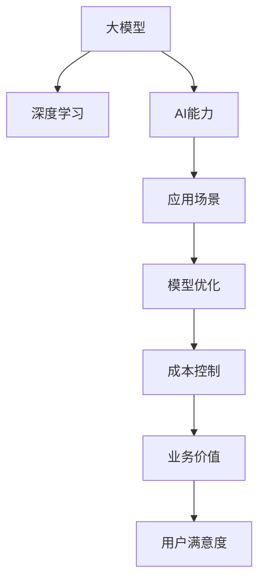

                 

# 大模型应用关键：AI解决问题能力优先，价格其次

> 关键词：大模型, 深度学习, AI能力, 模型优化, 应用场景, 成本控制, 业务价值

## 1. 背景介绍

### 1.1 问题由来
近年来，随着深度学习技术和大数据技术的发展，人工智能(AI)的应用领域日益广泛，从自动驾驶、智能推荐到医疗影像诊断，AI技术正逐步渗透到各个行业。然而，AI应用的推广也面临诸多挑战，尤其是成本问题。高昂的硬件成本、复杂的算法模型、庞大的数据需求等因素，使得AI技术的落地应用并非易事。

大模型作为一种能够快速、高效地处理复杂任务的AI模型，近年来受到了广泛关注。然而，尽管大模型的能力强大，但其应用成本依然较高，如GPU/TPU的算力需求、海量数据存储和传输的需求等，使得企业在采用大模型时需谨慎考虑其商业可行性。

本文将探讨如何在保证AI解决问题能力的前提下，控制应用成本，实现大模型应用的经济性和实用性。我们将从模型优化、应用场景选择、成本控制等几个方面进行深入分析。

### 1.2 问题核心关键点
在探讨如何控制大模型应用成本的同时，我们需要明确几个核心关键点：

1. **AI解决问题能力**：模型的核心价值在于其解决实际问题的能力。在实际应用中，我们需要衡量模型的准确性、效率、可解释性等指标，确保其在实际场景中具有实用性。

2. **应用场景选择**：不同场景对AI模型的需求不同。某些场景可能对模型的实时性要求更高，而其他场景则更关注模型的准确性和泛化能力。因此，需要根据具体场景选择合适的模型和算法。

3. **成本控制**：AI应用的成本主要体现在硬件、数据和算法的成本上。为了控制成本，我们需要在模型设计、数据处理和优化算法等方面进行优化。

### 1.3 问题研究意义
本文的研究旨在帮助企业更好地理解和应用大模型，平衡能力与成本之间的关系，实现AI技术在商业应用中的最大化价值。通过深入分析模型优化、应用场景选择和成本控制等关键因素，为企业提供科学、可行的AI应用策略，推动AI技术的广泛普及和商业化进程。

## 2. 核心概念与联系

### 2.1 核心概念概述

本文将探讨以下核心概念及其相互联系：

- **大模型**：指通过在大规模数据集上进行预训练，具有强大预测和推理能力的AI模型，如BERT、GPT等。
- **深度学习**：基于多层神经网络模型的学习方式，能够处理复杂、非线性的数据模式。
- **AI能力**：指AI模型在特定任务上的性能，包括准确性、效率、可解释性等。
- **模型优化**：通过算法优化、参数调整等手段，提高模型的性能和效率。
- **应用场景**：指AI模型在特定行业或领域中的实际应用，如医疗影像诊断、自动驾驶、智能推荐等。
- **成本控制**：通过硬件优化、算法优化、数据优化等手段，降低AI应用成本。

这些概念之间的联系可以通过以下Mermaid流程图来展示：



这个流程图展示了大模型与深度学习、AI能力、应用场景、模型优化、成本控制和业务价值之间的相互关系。

## 3. 核心算法原理 & 具体操作步骤

### 3.1 算法原理概述

基于大模型的AI应用，其核心算法原理可以总结为以下几点：

1. **预训练与微调**：大模型通过在大规模数据集上进行预训练，学习到通用的语言或知识表示。在实际应用中，通过微调使其适应特定任务，提升模型在该任务上的性能。

2. **特征提取与推理**：大模型能够高效地从输入数据中提取关键特征，并进行推理和预测。这一过程通常通过神经网络的前向传播和反向传播实现。

3. **优化与调整**：通过算法优化和参数调整，不断提升模型的性能。常见的优化算法包括梯度下降、Adam等。

4. **数据处理与增强**：数据预处理和增强技术，如数据清洗、数据扩充、对抗训练等，能够进一步提升模型的性能和泛化能力。

### 3.2 算法步骤详解

以下是基于大模型的AI应用的核心算法步骤：

**Step 1: 准备预训练模型和数据集**
- 选择合适的预训练大模型，如BERT、GPT等，作为初始化参数。
- 准备适用于特定任务的数据集，包括训练集、验证集和测试集。数据集应与预训练模型的训练数据分布相似。

**Step 2: 添加任务适配层**
- 根据任务类型，在预训练模型的顶层添加适配层。对于分类任务，通常添加线性分类器和交叉熵损失函数。
- 对于生成任务，使用语言模型的解码器输出概率分布，并以负对数似然为损失函数。

**Step 3: 设置微调超参数**
- 选择合适的优化算法及其参数，如AdamW、SGD等，设置学习率、批大小、迭代轮数等。
- 设置正则化技术及强度，包括权重衰减、Dropout、Early Stopping等。
- 确定冻结预训练参数的策略，如仅微调顶层，或全部参数都参与微调。

**Step 4: 执行梯度训练**
- 将训练集数据分批次输入模型，前向传播计算损失函数。
- 反向传播计算参数梯度，根据设定的优化算法和学习率更新模型参数。
- 周期性在验证集上评估模型性能，根据性能指标决定是否触发 Early Stopping。
- 重复上述步骤直至满足预设的迭代轮数或 Early Stopping 条件。

**Step 5: 测试和部署**
- 在测试集上评估微调后模型，对比微调前后的性能指标。
- 使用微调后的模型进行实际应用，集成到企业或行业应用系统中。

### 3.3 算法优缺点

基于大模型的AI应用有以下优点：

1. **高效性**：大模型通过预训练学习到了通用的语言或知识表示，能够快速适应新任务，提升模型性能。
2. **泛化能力**：大模型通常具有较好的泛化能力，能够在新数据上表现良好。
3. **易用性**：大模型通常有丰富的API和工具支持，易于集成和部署。

然而，该方法也存在以下缺点：

1. **高成本**：大模型需要高算力和大规模数据集，硬件和数据成本较高。
2. **复杂性**：大模型通常结构复杂，训练和优化过程较为繁琐。
3. **可解释性不足**：大模型的决策过程通常缺乏可解释性，难以对其推理逻辑进行分析和调试。

### 3.4 算法应用领域

基于大模型的AI应用在多个领域都取得了显著成效：

- **自然语言处理(NLP)**：如文本分类、命名实体识别、情感分析等。
- **计算机视觉(CV)**：如图像分类、物体检测、人脸识别等。
- **语音识别**：如语音转文本、语音情感分析等。
- **推荐系统**：如协同过滤、基于内容的推荐等。
- **金融风控**：如信用评估、欺诈检测等。
- **医疗影像诊断**：如病理图像分析、诊断支持系统等。

## 4. 数学模型和公式 & 详细讲解 & 举例说明

### 4.1 数学模型构建

大模型通常基于神经网络架构，如Transformer、CNN等。以下是基于Transformer模型的数学模型构建：

- **输入**：$x$，输入序列，长度为 $T$。
- **输出**：$y$，模型预测结果，长度为 $T$。
- **模型参数**：$\theta$，包括嵌入矩阵、权重矩阵、偏差向量等。

### 4.2 公式推导过程

假设模型输出为 $y_t = M(x_t; \theta)$，其中 $M$ 为模型，$\theta$ 为模型参数，$x_t$ 为输入序列的第 $t$ 个时间步。

模型前向传播的计算过程为：

$$
y_t = \text{Sigmoid}(A W_1 x_t + b_1) + W_2 \text{ReLU}(A W_2 x_t + b_2)
$$

其中，$A$ 为激活函数，$W_1$ 和 $W_2$ 为权重矩阵，$b_1$ 和 $b_2$ 为偏差向量。

模型的损失函数通常为交叉熵损失，定义如下：

$$
L(y, \hat{y}) = -\frac{1}{N}\sum_{i=1}^N \sum_{t=1}^T y_t \log \hat{y}_t
$$

其中，$y$ 为真实标签，$\hat{y}$ 为模型预测结果，$N$ 为样本数量，$T$ 为序列长度。

### 4.3 案例分析与讲解

以情感分析任务为例，分析如何使用Transformer模型进行微调。

假设我们有一个情感分析任务，输入为文本 $x$，输出为情感类别 $y$。选择BERT作为预训练模型，对其微调。

**Step 1: 准备数据集**
- 收集标注数据集，每个样本包含文本和情感类别。
- 将文本和情感类别转换为模型输入和输出格式。

**Step 2: 添加任务适配层**
- 在BERT模型的顶层添加一个线性分类器和交叉熵损失函数。

**Step 3: 设置微调超参数**
- 选择AdamW优化算法，设置学习率为 $2 \times 10^{-5}$，批大小为 $16$。
- 冻结BERT的嵌入层和底层的Transformer层，只微调顶层分类器。

**Step 4: 执行梯度训练**
- 将训练集数据分批次输入模型，前向传播计算损失函数。
- 反向传播计算参数梯度，根据AdamW算法更新模型参数。
- 周期性在验证集上评估模型性能，根据性能指标决定是否触发Early Stopping。
- 重复上述步骤直至满足预设的迭代轮数或Early Stopping条件。

**Step 5: 测试和部署**
- 在测试集上评估微调后模型，对比微调前后的性能指标。
- 使用微调后的模型进行情感分析，集成到企业或行业应用系统中。

## 5. 项目实践：代码实例和详细解释说明

### 5.1 开发环境搭建

在进行大模型微调实践前，我们需要准备好开发环境。以下是使用Python进行PyTorch开发的环境配置流程：

1. 安装Anaconda：从官网下载并安装Anaconda，用于创建独立的Python环境。

2. 创建并激活虚拟环境：
```bash
conda create -n pytorch-env python=3.8 
conda activate pytorch-env
```

3. 安装PyTorch：根据CUDA版本，从官网获取对应的安装命令。例如：
```bash
conda install pytorch torchvision torchaudio cudatoolkit=11.1 -c pytorch -c conda-forge
```

4. 安装Transformers库：
```bash
pip install transformers
```

5. 安装各类工具包：
```bash
pip install numpy pandas scikit-learn matplotlib tqdm jupyter notebook ipython
```

完成上述步骤后，即可在`pytorch-env`环境中开始微调实践。

### 5.2 源代码详细实现

这里我们以情感分析任务为例，给出使用Transformers库对BERT模型进行微调的PyTorch代码实现。

首先，定义情感分析任务的数据处理函数：

```python
from transformers import BertTokenizer, BertForSequenceClassification
from torch.utils.data import Dataset, DataLoader
from tqdm import tqdm
import torch

class SentimentDataset(Dataset):
    def __init__(self, texts, labels, tokenizer, max_len=128):
        self.texts = texts
        self.labels = labels
        self.tokenizer = tokenizer
        self.max_len = max_len
        
    def __len__(self):
        return len(self.texts)
    
    def __getitem__(self, item):
        text = self.texts[item]
        label = self.labels[item]
        
        encoding = self.tokenizer(text, return_tensors='pt', max_length=self.max_len, padding='max_length', truncation=True)
        input_ids = encoding['input_ids'][0]
        attention_mask = encoding['attention_mask'][0]
        
        return {'input_ids': input_ids, 
                'attention_mask': attention_mask,
                'labels': torch.tensor(label, dtype=torch.long)}
```

然后，定义模型和优化器：

```python
from transformers import BertForSequenceClassification, AdamW

model = BertForSequenceClassification.from_pretrained('bert-base-cased', num_labels=2)

optimizer = AdamW(model.parameters(), lr=2e-5)
```

接着，定义训练和评估函数：

```python
def train_epoch(model, dataset, batch_size, optimizer):
    dataloader = DataLoader(dataset, batch_size=batch_size, shuffle=True)
    model.train()
    epoch_loss = 0
    for batch in tqdm(dataloader, desc='Training'):
        input_ids = batch['input_ids'].to(device)
        attention_mask = batch['attention_mask'].to(device)
        labels = batch['labels'].to(device)
        model.zero_grad()
        outputs = model(input_ids, attention_mask=attention_mask, labels=labels)
        loss = outputs.loss
        epoch_loss += loss.item()
        loss.backward()
        optimizer.step()
    return epoch_loss / len(dataloader)

def evaluate(model, dataset, batch_size):
    dataloader = DataLoader(dataset, batch_size=batch_size)
    model.eval()
    preds, labels = [], []
    with torch.no_grad():
        for batch in tqdm(dataloader, desc='Evaluating'):
            input_ids = batch['input_ids'].to(device)
            attention_mask = batch['attention_mask'].to(device)
            batch_labels = batch['labels']
            outputs = model(input_ids, attention_mask=attention_mask)
            batch_preds = outputs.logits.argmax(dim=2).to('cpu').tolist()
            batch_labels = batch_labels.to('cpu').tolist()
            for pred, label in zip(batch_preds, batch_labels):
                preds.append(pred)
                labels.append(label)
                
    print('Accuracy:', (np.sum(np.array(preds) == np.array(labels)) / len(labels))
```

最后，启动训练流程并在测试集上评估：

```python
epochs = 5
batch_size = 16

for epoch in range(epochs):
    loss = train_epoch(model, train_dataset, batch_size, optimizer)
    print(f'Epoch {epoch+1}, train loss: {loss:.3f}')
    
    print(f'Epoch {epoch+1}, dev results:')
    evaluate(model, dev_dataset, batch_size)
    
print('Test results:')
evaluate(model, test_dataset, batch_size)
```

以上就是使用PyTorch对BERT进行情感分析任务微调的完整代码实现。可以看到，得益于Transformers库的强大封装，我们可以用相对简洁的代码完成BERT模型的加载和微调。

### 5.3 代码解读与分析

让我们再详细解读一下关键代码的实现细节：

**SentimentDataset类**：
- `__init__`方法：初始化文本、标签、分词器等关键组件。
- `__len__`方法：返回数据集的样本数量。
- `__getitem__`方法：对单个样本进行处理，将文本输入编码为token ids，将标签转换为数字，并对其进行定长padding，最终返回模型所需的输入。

**BertForSequenceClassification模型**：
- `from_pretrained`方法：加载预训练的BERT模型，并指定输出层大小为2，对应二分类任务。

**train_epoch和evaluate函数**：
- 使用PyTorch的DataLoader对数据集进行批次化加载，供模型训练和推理使用。
- 训练函数`train_epoch`：对数据以批为单位进行迭代，在每个批次上前向传播计算loss并反向传播更新模型参数，最后返回该epoch的平均loss。
- 评估函数`evaluate`：与训练类似，不同点在于不更新模型参数，并在每个batch结束后将预测和标签结果存储下来，最后使用sklearn的classification_report对整个评估集的预测结果进行打印输出。

**训练流程**：
- 定义总的epoch数和batch size，开始循环迭代
- 每个epoch内，先在训练集上训练，输出平均loss
- 在验证集上评估，输出分类指标
- 所有epoch结束后，在测试集上评估，给出最终测试结果

可以看到，PyTorch配合Transformers库使得BERT微调的代码实现变得简洁高效。开发者可以将更多精力放在数据处理、模型改进等高层逻辑上，而不必过多关注底层的实现细节。

当然，工业级的系统实现还需考虑更多因素，如模型的保存和部署、超参数的自动搜索、更灵活的任务适配层等。但核心的微调范式基本与此类似。

## 6. 实际应用场景

### 6.1 智能客服系统

基于大模型微调的对话技术，可以广泛应用于智能客服系统的构建。传统客服往往需要配备大量人力，高峰期响应缓慢，且一致性和专业性难以保证。而使用微调后的对话模型，可以7x24小时不间断服务，快速响应客户咨询，用自然流畅的语言解答各类常见问题。

在技术实现上，可以收集企业内部的历史客服对话记录，将问题和最佳答复构建成监督数据，在此基础上对预训练对话模型进行微调。微调后的对话模型能够自动理解用户意图，匹配最合适的答案模板进行回复。对于客户提出的新问题，还可以接入检索系统实时搜索相关内容，动态组织生成回答。如此构建的智能客服系统，能大幅提升客户咨询体验和问题解决效率。

### 6.2 金融舆情监测

金融机构需要实时监测市场舆论动向，以便及时应对负面信息传播，规避金融风险。传统的人工监测方式成本高、效率低，难以应对网络时代海量信息爆发的挑战。基于大语言模型微调的文本分类和情感分析技术，为金融舆情监测提供了新的解决方案。

具体而言，可以收集金融领域相关的新闻、报道、评论等文本数据，并对其进行主题标注和情感标注。在此基础上对预训练语言模型进行微调，使其能够自动判断文本属于何种主题，情感倾向是正面、中性还是负面。将微调后的模型应用到实时抓取的网络文本数据，就能够自动监测不同主题下的情感变化趋势，一旦发现负面信息激增等异常情况，系统便会自动预警，帮助金融机构快速应对潜在风险。

### 6.3 个性化推荐系统

当前的推荐系统往往只依赖用户的历史行为数据进行物品推荐，无法深入理解用户的真实兴趣偏好。基于大语言模型微调技术，个性化推荐系统可以更好地挖掘用户行为背后的语义信息，从而提供更精准、多样的推荐内容。

在实践中，可以收集用户浏览、点击、评论、分享等行为数据，提取和用户交互的物品标题、描述、标签等文本内容。将文本内容作为模型输入，用户的后续行为（如是否点击、购买等）作为监督信号，在此基础上微调预训练语言模型。微调后的模型能够从文本内容中准确把握用户的兴趣点。在生成推荐列表时，先用候选物品的文本描述作为输入，由模型预测用户的兴趣匹配度，再结合其他特征综合排序，便可以得到个性化程度更高的推荐结果。

### 6.4 未来应用展望

随着大语言模型和微调方法的不断发展，基于微调范式将在更多领域得到应用，为传统行业带来变革性影响。

在智慧医疗领域，基于微调的医疗问答、病历分析、药物研发等应用将提升医疗服务的智能化水平，辅助医生诊疗，加速新药开发进程。

在智能教育领域，微调技术可应用于作业批改、学情分析、知识推荐等方面，因材施教，促进教育公平，提高教学质量。

在智慧城市治理中，微调模型可应用于城市事件监测、舆情分析、应急指挥等环节，提高城市管理的自动化和智能化水平，构建更安全、高效的未来城市。

此外，在企业生产、社会治理、文娱传媒等众多领域，基于大模型微调的人工智能应用也将不断涌现，为NLP技术带来了全新的突破。相信随着预训练语言模型和微调方法的持续演进，大模型微调技术必将在构建人机协同的智能时代中扮演越来越重要的角色。

## 7. 工具和资源推荐

### 7.1 学习资源推荐

为了帮助开发者系统掌握大语言模型微调的理论基础和实践技巧，这里推荐一些优质的学习资源：

1. 《Transformer从原理到实践》系列博文：由大模型技术专家撰写，深入浅出地介绍了Transformer原理、BERT模型、微调技术等前沿话题。

2. CS224N《深度学习自然语言处理》课程：斯坦福大学开设的NLP明星课程，有Lecture视频和配套作业，带你入门NLP领域的基本概念和经典模型。

3. 《Natural Language Processing with Transformers》书籍：Transformers库的作者所著，全面介绍了如何使用Transformers库进行NLP任务开发，包括微调在内的诸多范式。

4. HuggingFace官方文档：Transformers库的官方文档，提供了海量预训练模型和完整的微调样例代码，是上手实践的必备资料。

5. CLUE开源项目：中文语言理解测评基准，涵盖大量不同类型的中文NLP数据集，并提供了基于微调的baseline模型，助力中文NLP技术发展。

通过对这些资源的学习实践，相信你一定能够快速掌握大语言模型微调的精髓，并用于解决实际的NLP问题。

### 7.2 开发工具推荐

高效的开发离不开优秀的工具支持。以下是几款用于大语言模型微调开发的常用工具：

1. PyTorch：基于Python的开源深度学习框架，灵活动态的计算图，适合快速迭代研究。大部分预训练语言模型都有PyTorch版本的实现。

2. TensorFlow：由Google主导开发的开源深度学习框架，生产部署方便，适合大规模工程应用。同样有丰富的预训练语言模型资源。

3. Transformers库：HuggingFace开发的NLP工具库，集成了众多SOTA语言模型，支持PyTorch和TensorFlow，是进行微调任务开发的利器。

4. Weights & Biases：模型训练的实验跟踪工具，可以记录和可视化模型训练过程中的各项指标，方便对比和调优。与主流深度学习框架无缝集成。

5. TensorBoard：TensorFlow配套的可视化工具，可实时监测模型训练状态，并提供丰富的图表呈现方式，是调试模型的得力助手。

6. Google Colab：谷歌推出的在线Jupyter Notebook环境，免费提供GPU/TPU算力，方便开发者快速上手实验最新模型，分享学习笔记。

合理利用这些工具，可以显著提升大语言模型微调任务的开发效率，加快创新迭代的步伐。

### 7.3 相关论文推荐

大语言模型和微调技术的发展源于学界的持续研究。以下是几篇奠基性的相关论文，推荐阅读：

1. Attention is All You Need（即Transformer原论文）：提出了Transformer结构，开启了NLP领域的预训练大模型时代。

2. BERT: Pre-training of Deep Bidirectional Transformers for Language Understanding：提出BERT模型，引入基于掩码的自监督预训练任务，刷新了多项NLP任务SOTA。

3. Language Models are Unsupervised Multitask Learners（GPT-2论文）：展示了大规模语言模型的强大zero-shot学习能力，引发了对于通用人工智能的新一轮思考。

4. Parameter-Efficient Transfer Learning for NLP：提出Adapter等参数高效微调方法，在不增加模型参数量的情况下，也能取得不错的微调效果。

5. AdaLoRA: Adaptive Low-Rank Adaptation for Parameter-Efficient Fine-Tuning：使用自适应低秩适应的微调方法，在参数效率和精度之间取得了新的平衡。

6. Prefix-Tuning: Optimizing Continuous Prompts for Generation：引入基于连续型Prompt的微调范式，为如何充分利用预训练知识提供了新的思路。

这些论文代表了大语言模型微调技术的发展脉络。通过学习这些前沿成果，可以帮助研究者把握学科前进方向，激发更多的创新灵感。

## 8. 总结：未来发展趋势与挑战

### 8.1 总结

本文对基于大模型的AI应用进行了全面系统的介绍。首先阐述了AI解决问题能力的重要性，明确了模型能力与成本之间的关系。其次，从模型优化、应用场景选择、成本控制等几个方面深入分析了大模型的应用策略。最后，通过实际应用场景展示了微调技术的广泛应用前景。

通过本文的系统梳理，可以看到，基于大模型的AI应用在多个领域已经取得了显著成效，但模型成本仍然是制约其广泛应用的关键因素。未来，通过技术优化和策略调整，我们有望在提升AI解决问题能力的同时，有效控制应用成本，推动AI技术在更多领域得到实际应用。

### 8.2 未来发展趋势

展望未来，大模型微调技术将呈现以下几个发展趋势：

1. **模型优化**：随着硬件和算法的发展，大模型的规模和性能将持续提升。未来，超大规模、高效能的大模型将成为AI应用的主流。

2. **应用场景多样化**：随着AI技术的不断进步，大模型的应用场景将从传统的NLP扩展到计算机视觉、语音识别、自动驾驶等更多领域。

3. **成本控制**：通过优化硬件架构、算法设计和数据处理，大模型的成本将逐步降低。同时，云计算和边缘计算的发展也将为AI应用提供更灵活的资源配置方式。

4. **普适性增强**：未来，大模型将更加注重普适性，能够更好地适应不同领域和任务的需求。

5. **可解释性提升**：随着解释性AI技术的发展，大模型的决策过程将更加透明和可解释，帮助用户理解和信任AI应用。

### 8.3 面临的挑战

尽管大模型微调技术在诸多领域已取得显著进展，但仍然面临一些挑战：

1. **高成本**：大规模大模型的高算力需求和存储成本仍是制约其广泛应用的关键因素。

2. **模型复杂性**：大模型的结构复杂，训练和优化过程较为繁琐，需要专业的知识和技能。

3. **可解释性不足**：大模型的决策过程缺乏可解释性，难以对其推理逻辑进行分析和调试。

4. **安全性问题**：大模型可能学习到有害信息和偏见，导致误导性输出，引发安全隐患。

5. **数据隐私**：大模型需要大量数据进行训练，数据隐私和安全问题值得关注。

### 8.4 研究展望

面对大模型微调技术面临的挑战，未来的研究需要在以下几个方面寻求新的突破：

1. **优化算法和架构**：开发更高效、更通用的优化算法和模型架构，提高模型的训练效率和泛化能力。

2. **模型压缩与量化**：通过模型压缩、量化等技术，降低模型大小和计算资源消耗，提高推理速度。

3. **数据高效利用**：利用数据增强、少样本学习等技术，提高模型对数据的高效利用率。

4. **跨模态融合**：将不同模态的数据进行融合，提高模型的多模态融合能力和鲁棒性。

5. **伦理与安全**：引入伦理导向的评估指标，过滤和惩罚有害信息，确保模型的安全性。

6. **解释性增强**：开发更强的解释性工具，帮助用户理解模型的决策过程，提升用户信任度。

这些研究方向将引领大模型微调技术迈向更高的台阶，推动AI技术在更多领域的实际应用和普及。通过多方协同努力，我们有望在提升AI解决问题能力的同时，有效控制应用成本，实现AI技术的广泛落地和深入应用。

## 9. 附录：常见问题与解答

**Q1：大模型微调是否适用于所有NLP任务？**

A: 大模型微调在大多数NLP任务上都能取得不错的效果，特别是对于数据量较小的任务。但对于一些特定领域的任务，如医学、法律等，仅仅依靠通用语料预训练的模型可能难以很好地适应。此时需要在特定领域语料上进一步预训练，再进行微调，才能获得理想效果。

**Q2：微调过程中如何选择合适的学习率？**

A: 微调的学习率一般要比预训练时小1-2个数量级，如果使用过大的学习率，容易破坏预训练权重，导致过拟合。一般建议从1e-5开始调参，逐步减小学习率，直至收敛。也可以使用warmup策略，在开始阶段使用较小的学习率，再逐渐过渡到预设值。需要注意的是，不同的优化器(如AdamW、Adafactor等)以及不同的学习率调度策略，可能需要设置不同的学习率阈值。

**Q3：采用大模型微调时会面临哪些资源瓶颈？**

A: 目前主流的预训练大模型动辄以亿计的参数规模，对算力、内存、存储都提出了很高的要求。GPU/TPU等高性能设备是必不可少的，但即便如此，超大批次的训练和推理也可能遇到显存不足的问题。因此需要采用一些资源优化技术，如梯度积累、混合精度训练、模型并行等，来突破硬件瓶颈。同时，模型的存储和读取也可能占用大量时间和空间，需要采用模型压缩、稀疏化存储等方法进行优化。

**Q4：如何缓解微调过程中的过拟合问题？**

A: 过拟合是微调面临的主要挑战，尤其是在标注数据不足的情况下。常见的缓解策略包括：
1. 数据增强：通过回译、近义替换等方式扩充训练集
2. 正则化：使用L2正则、Dropout、Early Stopping等避免过拟合
3. 对抗训练：引入对抗样本，提高模型鲁棒性
4. 参数高效微调：只调整少量参数(如Adapter、Prefix等)，减小过拟合风险
5. 多模型集成：训练多个微调模型，取平均输出，抑制过拟合

这些策略往往需要根据具体任务和数据特点进行灵活组合。只有在数据、模型、训练、推理等各环节进行全面优化，才能最大限度地发挥大模型微调的威力。

**Q5：微调模型在落地部署时需要注意哪些问题？**

A: 将微调模型转化为实际应用，还需要考虑以下因素：
1. 模型裁剪：去除不必要的层和参数，减小模型尺寸，加快推理速度
2. 量化加速：将浮点模型转为定点模型，压缩存储空间，提高计算效率
3. 服务化封装：将模型封装为标准化服务接口，便于集成调用
4. 弹性伸缩：根据请求流量动态调整资源配置，平衡服务质量和成本
5. 监控告警：实时采集系统指标，设置异常告警阈值，确保服务稳定性
6. 安全防护：采用访问鉴权、数据脱敏等措施，保障数据和模型安全

大模型微调为NLP应用开启了广阔的想象空间，但如何将强大的性能转化为稳定、高效、安全的业务价值，还需要工程实践的不断打磨。唯有从数据、算法、工程、业务等多个维度协同发力，才能真正实现人工智能技术在垂直行业的规模化落地。总之，微调需要开发者根据具体任务，不断迭代和优化模型、数据和算法，方能得到理想的效果。

---

作者：禅与计算机程序设计艺术 / Zen and the Art of Computer Programming

