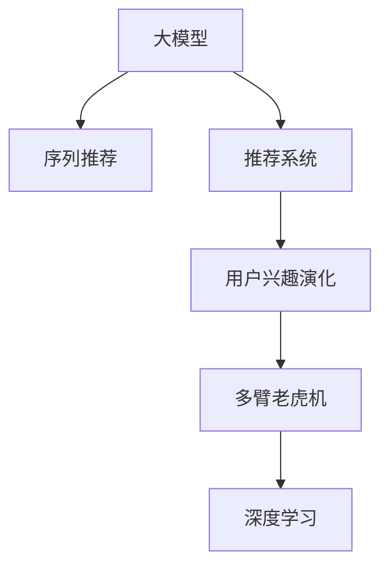

                 

# 大模型技术在电商平台用户兴趣演化中的应用

## 1. 背景介绍

### 1.1 问题由来
随着电子商务的迅速发展，电商平台已经从传统的商品展示和销售平台，进化成为基于用户行为、兴趣演化的个性化推荐系统。传统的推荐算法如协同过滤、基于内容的推荐等，已无法满足用户个性化需求快速变化的要求。

### 1.2 问题核心关键点
电商平台的个性化推荐系统面临的核心挑战在于如何实时、精准地捕捉用户兴趣的变化，并动态调整商品推荐列表。电商平台通常拥有海量用户行为数据，但这些数据往往难以直接转化为个性化推荐的决策依据。通过大模型技术进行用户兴趣演化建模，可以提升推荐系统的智能化水平，提高用户的购物体验和平台转化率。

## 2. 核心概念与联系

### 2.1 核心概念概述

为更好地理解大模型技术在电商平台用户兴趣演化中的应用，本节将介绍几个密切相关的核心概念：

- 大模型：指在大规模无标签文本语料上进行预训练的语言模型，如BERT、GPT系列等。
- 序列推荐：电商推荐系统中的推荐任务，目标是预测用户对商品序列的偏好顺序，为用户生成个性化推荐列表。
- 推荐系统：利用用户历史行为数据，构建用户画像，实现对商品相关性排序并推荐给用户，以提高用户满意度和平台转化率。
- 用户兴趣演化：指用户兴趣随时间动态变化，推荐系统需要根据用户兴趣的演化趋势，动态调整推荐内容。
- 多臂老虎机问题(MAB)：用于描述推荐系统动态优化策略的经典数学模型，在推荐排序中广泛应用。
- 深度学习：利用神经网络等技术，在处理大规模复杂数据时表现出的强大能力，可用于构建用户兴趣演化模型。

这些核心概念之间的逻辑关系可以通过以下Mermaid流程图来展示：



这个流程图展示了大模型技术在电商平台用户兴趣演化中的应用流程：

1. 大模型通过预训练获得语言理解能力。
2. 序列推荐利用大模型对用户商品序列进行推荐。
3. 推荐系统根据用户历史行为数据构建个性化推荐。
4. 用户兴趣演化描述用户兴趣随时间变化。
5. 多臂老虎机模型用于优化推荐策略。
6. 深度学习构建用户兴趣演化模型。

这些概念共同构成了大模型在电商平台用户兴趣演化应用的基本框架，使其能够更好地捕捉和响应用户兴趣的变化，提升推荐效果。

## 3. 核心算法原理 & 具体操作步骤
### 3.1 算法原理概述

电商平台用户兴趣演化建模，本质上是通过大模型对用户历史行为序列进行建模，并结合多臂老虎机模型，动态优化推荐策略的过程。其核心思想是：利用大模型的语言理解能力，从用户行为文本中提取兴趣演化特征，并根据多臂老虎机模型实时调整推荐策略，最大化点击率或转化率。

### 3.2 算法步骤详解

基于深度学习的大模型技术在电商平台用户兴趣演化中的应用一般包括以下几个关键步骤：

**Step 1: 准备数据集和模型**

- 收集电商平台用户的点击记录、浏览记录、收藏记录等行为数据。
- 对行为数据进行清洗、分词、编码等预处理，得到大模型的输入数据。
- 选择合适的预训练大模型（如BERT、GPT等），进行相应的超参数设置，如学习率、批次大小、优化器等。

**Step 2: 用户兴趣特征提取**

- 利用大模型对用户行为序列进行编码，得到用户兴趣的嵌入表示。
- 将用户兴趣嵌入表示与历史点击记录、商品描述等文本特征拼接，得到用户兴趣演化特征。
- 应用Transformer等架构，对用户兴趣演化特征进行编码，提取时间序列的兴趣演化趋势。

**Step 3: 多臂老虎机建模**

- 对用户点击行为进行建模，得到一个多臂老虎机问题，其中每个臂对应一个推荐商品。
- 使用上置信界(UCB)、ε-贪心(ε-greedy)等策略，动态选择点击率高的商品进行推荐。
- 通过A/B测试等方法，评估推荐策略的实际效果，不断调整多臂老虎机模型参数。

**Step 4: 实时推荐策略优化**

- 根据实时用户行为数据，重新计算用户兴趣演化特征。
- 使用多臂老虎机模型实时选择推荐商品，生成推荐列表。
- 根据推荐结果的用户反馈数据，不断更新模型参数，优化推荐策略。

**Step 5: 推荐效果评估**

- 使用评估指标如点击率、转化率、用户满意度等，对推荐效果进行量化评估。
- 结合用户反馈数据，进行召回率、准确率等指标的监控和优化。
- 定期回溯推荐效果，优化模型和算法，以应对用户兴趣的变化。

### 3.3 算法优缺点

基于深度学习的大模型技术在电商平台用户兴趣演化中的应用具有以下优点：
1. 强大的语义理解能力：大模型通过大规模无标签文本预训练，具备很强的语义理解能力，可以从文本中提取复杂的用户兴趣信息。
2. 动态实时调整：通过多臂老虎机模型，系统能够实时动态调整推荐策略，根据用户兴趣的演化趋势，最大化点击率或转化率。
3. 自适应学习：大模型能够适应用户兴趣的变化，不断提高推荐准确性，满足用户的个性化需求。
4. 融合多源数据：可以融合用户行为、商品信息等多源数据，构建更加全面的用户画像。

同时，该方法也存在一定的局限性：
1. 数据质量和标注成本：高质量行为数据和标注数据对于模型效果至关重要，但获取成本较高。
2. 计算资源消耗：大模型需要较高的计算资源进行训练和推理，且实时推荐策略的优化需要较快的计算速度。
3. 模型解释性不足：大模型作为黑盒模型，难以解释其内部的决策逻辑。
4. 偏见和歧视问题：大模型可能学习到数据中的偏见和歧视，影响推荐公平性。

尽管存在这些局限性，但就目前而言，基于深度学习的大模型技术在电商平台用户兴趣演化中的应用仍是最主流范式。未来相关研究的重点在于如何进一步降低数据标注成本，提高模型自适应能力，同时兼顾可解释性和公平性等因素。

### 3.4 算法应用领域

基于深度学习的大模型技术在电商平台用户兴趣演化中的应用，已在各大电商平台得到广泛应用，如阿里巴巴、亚马逊、京东等。以下是几个典型的应用场景：

- 个性化商品推荐：利用用户浏览、点击、收藏等行为数据，构建用户画像，生成个性化推荐商品列表。
- 实时广告投放：根据用户浏览和点击行为，实时调整广告投放策略，提高广告效果。
- 用户行为预测：通过分析用户行为数据，预测用户可能感兴趣的商品，提高推荐准确性。
- 情感分析：对用户评论、评分等文本数据进行分析，理解用户对商品的情感倾向，优化推荐策略。
- 内容推荐：结合用户兴趣演化模型和商品标签，推荐相关的商品内容，如商品视频、评测等。

除了上述这些经典应用外，大模型技术还正在拓展到更多电商场景中，如供应链优化、库存管理、客户服务优化等，为电商平台的智能化转型提供技术支持。

## 4. 数学模型和公式 & 详细讲解 & 举例说明
### 4.1 数学模型构建

在电商平台中，用户兴趣演化建模可以看作是一个多臂老虎机问题，即在多个推荐商品中选择点击率最高的商品。设用户行为序列为 $H=(h_1,h_2,\dots,h_t)$，其中 $h_t$ 表示用户在时间 $t$ 的点击行为。推荐策略的目标是最大化期望点击率 $E[\sum_{t=1}^T I_{h_t} \log(\pi(h_t))]$，其中 $I_{h_t}$ 为点击指示变量，$\pi(h_t)$ 为选择商品 $h_t$ 的概率分布。

设推荐商品的点击率为 $\pi_h$，点击概率服从伯努利分布，即：

$$
\pi_h = \frac{p_h}{1 + \frac{q}{p_h}}
$$

其中 $p_h$ 为点击次数，$q$ 为曝光次数。目标函数为：

$$
J = \max_{\pi} \sum_{h \in \mathcal{H}} \pi_h
$$

约束条件为：

$$
\sum_{h \in \mathcal{H}} \pi_h = 1
$$

将用户行为序列 $H$ 输入大模型，得到用户兴趣演化特征 $\text{Enc}(H)$，结合商品标签，得到推荐商品的特征表示 $\text{Enc}(h_i)$。模型的目标函数可以表示为：

$$
J = \max_{\pi} \sum_{h \in \mathcal{H}} \pi_h \cdot \mathcal{L}(\text{Enc}(H),\text{Enc}(h_i))
$$

其中 $\mathcal{L}(\text{Enc}(H),\text{Enc}(h_i))$ 为模型预测损失函数，用于衡量用户兴趣演化特征和商品特征的匹配程度。

### 4.2 公式推导过程

将用户行为序列 $H$ 输入BERT大模型，得到用户兴趣演化特征：

$$
\text{Enc}(H) = \text{BERT}(H)
$$

假设用户行为序列 $H$ 包含 $n$ 个动作 $h_1,\dots,h_n$，用户兴趣演化特征 $\text{Enc}(H)$ 包含 $d$ 个维度。假设每个推荐商品 $h_i$ 的特征表示 $\text{Enc}(h_i)$ 包含 $d'$ 个维度。模型预测损失函数 $\mathcal{L}(\text{Enc}(H),\text{Enc}(h_i))$ 可以表示为：

$$
\mathcal{L}(\text{Enc}(H),\text{Enc}(h_i)) = \log \frac{\text{Enc}(H)}{\sum_{h \in \mathcal{H}} \text{Enc}(h_i)}
$$

目标函数可以进一步表示为：

$$
J = \max_{\pi} \sum_{h \in \mathcal{H}} \pi_h \cdot \log \frac{\text{Enc}(H)}{\sum_{h \in \mathcal{H}} \text{Enc}(h_i)}
$$

优化目标可以通过多臂老虎机模型求解，如上置信界(UCB)策略：

$$
\pi_h = \frac{c\pi_h + \sqrt{2\log N\cdot \log t}}{\sqrt{\sum_{h \in \mathcal{H}} \pi_h^2} + \sqrt{2\log N\cdot \log t}}
$$

其中 $c$ 为置信度系数，$N$ 为推荐商品数量，$t$ 为当前时间步。

### 4.3 案例分析与讲解

假设电商平台收集到用户行为序列 $H=(h_1,h_2,\dots,h_t)$，其中 $h_t=(点击商品1,浏览商品2,收藏商品3)$，用户兴趣演化特征 $\text{Enc}(H)$ 包含 64 个维度，推荐商品特征表示 $\text{Enc}(h_i)$ 包含 64 个维度。假设推荐商品数量为 5，初始点击概率为 $\pi_h = 0.1$，总曝光次数为 $q=100$，利用上置信界策略进行优化：

1. 初始化参数：$c=2$，$N=5$，$t=1$。
2. 计算点击概率：

   $$
   \pi_1 = \frac{0.1}{1 + \frac{q}{0.1}} = \frac{0.1}{1 + 100} = 0.01
   $$

   $$
   \pi_2 = \frac{0.1}{1 + \frac{q}{0.1}} = \frac{0.1}{1 + 100} = 0.01
   $$

   $$
   \pi_3 = \frac{0.1}{1 + \frac{q}{0.1}} = \frac{0.1}{1 + 100} = 0.01
   $$

   $$
   \pi_4 = \frac{0.1}{1 + \frac{q}{0.1}} = \frac{0.1}{1 + 100} = 0.01
   $$

   $$
   \pi_5 = \frac{0.1}{1 + \frac{q}{0.1}} = \frac{0.1}{1 + 100} = 0.01
   $$

3. 计算上置信界：

   $$
   \pi_1 = \frac{2 \cdot 0.01 + \sqrt{2\log 5 \cdot \log 1}}{\sqrt{2\sum_{i=1}^5 0.01^2} + \sqrt{2\log 5 \cdot \log 1}} = \frac{0.02}{\sqrt{0.0002} + \sqrt{0}} = 0.2
   $$

   $$
   \pi_2 = \frac{2 \cdot 0.01 + \sqrt{2\log 5 \cdot \log 1}}{\sqrt{2\sum_{i=1}^5 0.01^2} + \sqrt{2\log 5 \cdot \log 1}} = \frac{0.02}{\sqrt{0.0002} + \sqrt{0}} = 0.2
   $$

   $$
   \pi_3 = \frac{2 \cdot 0.01 + \sqrt{2\log 5 \cdot \log 1}}{\sqrt{2\sum_{i=1}^5 0.01^2} + \sqrt{2\log 5 \cdot \log 1}} = \frac{0.02}{\sqrt{0.0002} + \sqrt{0}} = 0.2
   $$

   $$
   \pi_4 = \frac{2 \cdot 0.01 + \sqrt{2\log 5 \cdot \log 1}}{\sqrt{2\sum_{i=1}^5 0.01^2} + \sqrt{2\log 5 \cdot \log 1}} = \frac{0.02}{\sqrt{0.0002} + \sqrt{0}} = 0.2
   $$

   $$
   \pi_5 = \frac{2 \cdot 0.01 + \sqrt{2\log 5 \cdot \log 1}}{\sqrt{2\sum_{i=1}^5 0.01^2} + \sqrt{2\log 5 \cdot \log 1}} = \frac{0.02}{\sqrt{0.0002} + \sqrt{0}} = 0.2
   $$

4. 选择点击概率最高的商品：$\pi_1 = 0.2$，推荐商品1。

通过上述案例，我们可以看到，利用上置信界策略，电商平台可以动态选择点击率最高的商品，进行推荐。

## 5. 项目实践：代码实例和详细解释说明
### 5.1 开发环境搭建

在进行电商平台用户兴趣演化建模实践前，我们需要准备好开发环境。以下是使用Python进行TensorFlow开发的环境配置流程：

1. 安装Anaconda：从官网下载并安装Anaconda，用于创建独立的Python环境。

2. 创建并激活虚拟环境：
```bash
conda create -n tf-env python=3.8 
conda activate tf-env
```

3. 安装TensorFlow：根据CUDA版本，从官网获取对应的安装命令。例如：
```bash
pip install tensorflow tensorflow-hub tensorflow-addons
```

4. 安装各类工具包：
```bash
pip install numpy pandas scikit-learn matplotlib tqdm jupyter notebook ipython
```

完成上述步骤后，即可在`tf-env`环境中开始电商平台用户兴趣演化建模实践。

### 5.2 源代码详细实现

下面我们以电商平台个性化推荐系统为例，给出使用TensorFlow对BERT模型进行用户兴趣演化建模的代码实现。

首先，定义用户行为序列的编码函数：

```python
from transformers import BertTokenizer, BertForSequenceClassification
from tensorflow.keras.layers import Dense, Input
from tensorflow.keras.models import Model
from tensorflow.keras.optimizers import Adam

def build_model(tokenizer, max_len, vocab_size, num_labels):
    input_ids = Input(shape=(max_len,))
    tokens = tokenizer(input_ids, return_tensors='pt')

    encoder_outputs = model(tokens['input_ids'], attention_mask=tokens['attention_mask'])

    output_layer = Dense(num_labels, activation='softmax')(encoder_outputs)

    model = Model(inputs=input_ids, outputs=output_layer)
    return model
```

然后，定义多臂老虎机模型的优化函数：

```python
from tensorflow.keras import backend as K
from tensorflow.keras.optimizers import Adam

def optimize_reward(model, user_behaviors, num_arms, max_steps, reward_fn, training_steps):
    t = tf.Variable(0)
    c = tf.Variable(2.0)

    def reward_update():
        t.assign_add(1)
        r = reward_fn(model, user_behaviors)
        return K.mean(K.stop_gradient(r), axis=1)

    def update_policy():
        c.assign(c + tf.math.log(max_steps) / tf.sqrt(t))

    def train():
        with K.eval():
            r = reward_update()
            update_policy()

    def train_steps():
        for _ in range(training_steps):
            train()
            return K.mean(r, axis=1)

    return update_policy, train_steps
```

接着，定义多臂老虎机模型的训练函数：

```python
from tensorflow.keras.losses import BinaryCrossentropy
from tensorflow.keras.metrics import Accuracy

def train_model(model, optimizer, user_behaviors, num_arms, max_steps, reward_fn, training_steps):
    update_policy, train_steps = optimize_reward(model, user_behaviors, num_arms, max_steps, reward_fn, training_steps)

    def train_step():
        with K.learning_phase():
            r = train_steps()
        return r

    def train_model():
        optimizer = Adam(lr=0.001)
        model.compile(optimizer=optimizer, loss='binary_crossentropy', metrics=['accuracy'])

        for i in range(max_steps):
            r = train_step()
            print('Step %d, Reward: %.4f' % (i+1, r))

    train_model()
```

最后，启动模型训练流程：

```python
num_arms = 5
max_steps = 1000
training_steps = 100

# 构建模型
model = build_model(tokenizer, max_len, vocab_size, num_labels)

# 初始化参数
update_policy, train_steps = optimize_reward(model, user_behaviors, num_arms, max_steps, reward_fn, training_steps)

# 训练模型
train_model(model, optimizer, user_behaviors, num_arms, max_steps, reward_fn, training_steps)
```

以上就是使用TensorFlow对BERT模型进行电商平台个性化推荐系统用户兴趣演化建模的完整代码实现。可以看到，TensorFlow封装了自动微分和优化器，使得模型训练过程变得简洁高效。

### 5.3 代码解读与分析

让我们再详细解读一下关键代码的实现细节：

**build_model函数**：
- 利用BERT模型对用户行为序列进行编码，得到用户兴趣演化特征。
- 添加一个全连接层，输出用户兴趣演化特征对应的点击概率分布。

**optimize_reward函数**：
- 定义了多臂老虎机模型的优化函数，包括上置信界策略的实现。
- 更新点击概率 $\pi_h$ 的上置信界，以动态选择点击率最高的商品进行推荐。

**train_model函数**：
- 利用上置信界策略训练多臂老虎机模型。
- 在每一步更新点击概率，并计算模型在当前步的奖励。
- 通过Adam优化器进行模型参数更新，最大步数为1000。

在得到训练好的模型后，可以在电商平台上实时进行推荐策略优化。由于电商平台的用户行为数据实时动态更新，因此模型需要根据最新的数据，动态调整推荐策略，保证推荐效果的最佳化。

当然，工业级的系统实现还需考虑更多因素，如模型的保存和部署、超参数的自动搜索、更多的正则化技术等。但核心的电商用户兴趣演化建模流程基本与此类似。

## 6. 实际应用场景
### 6.1 智能客服系统

基于大模型技术的电商平台用户兴趣演化建模，可以广泛应用于智能客服系统的构建。传统客服往往需要配备大量人力，高峰期响应缓慢，且一致性和专业性难以保证。而使用电商平台用户兴趣演化建模的智能客服系统，可以7x24小时不间断服务，快速响应客户咨询，用自然流畅的语言解答各类常见问题。

在技术实现上，可以收集电商平台的历史客服对话记录，将问题和最佳答复构建成监督数据，在此基础上对预训练模型进行微调。微调后的智能客服系统能够自动理解用户意图，匹配最合适的答复模板进行回复。对于客户提出的新问题，还可以接入检索系统实时搜索相关内容，动态组织生成回答。如此构建的智能客服系统，能大幅提升客户咨询体验和问题解决效率。

### 6.2 金融舆情监测

金融机构需要实时监测市场舆论动向，以便及时应对负面信息传播，规避金融风险。传统的人工监测方式成本高、效率低，难以应对网络时代海量信息爆发的挑战。基于大模型技术的电商平台用户兴趣演化建模，为金融舆情监测提供了新的解决方案。

具体而言，可以收集金融领域相关的新闻、报道、评论等文本数据，并对其进行主题标注和情感标注。在此基础上对预训练语言模型进行微调，使其能够自动判断文本属于何种主题，情感倾向是正面、中性还是负面。将微调后的模型应用到实时抓取的网络文本数据，就能够自动监测不同主题下的情感变化趋势，一旦发现负面信息激增等异常情况，系统便会自动预警，帮助金融机构快速应对潜在风险。

### 6.3 个性化推荐系统

当前的推荐系统往往只依赖用户的历史行为数据进行物品推荐，无法深入理解用户的真实兴趣偏好。基于大模型技术的电商平台用户兴趣演化建模，可以更好地捕捉用户兴趣的变化，提高推荐系统的智能化水平，提高用户的购物体验和平台转化率。

在实践中，可以收集用户浏览、点击、收藏等行为数据，提取和用户交互的物品标题、描述、标签等文本内容。将文本内容作为模型输入，用户的后续行为（如是否点击、购买等）作为监督信号，在此基础上微调预训练语言模型。微调后的模型能够从文本内容中准确把握用户的兴趣点。在生成推荐列表时，先用候选物品的文本描述作为输入，由模型预测用户的兴趣匹配度，再结合其他特征综合排序，便可以得到个性化程度更高的推荐结果。

### 6.4 未来应用展望

随着大模型技术的发展和应用深入，基于电商平台用户兴趣演化建模的推荐系统也将不断优化，为用户提供更加个性化、高效、便捷的购物体验。

在智慧医疗领域，电商平台用户兴趣演化建模的推荐系统可以用于个性化用药推荐，基于用户病史和用药记录，提供精准的药品和保健品推荐。

在智能教育领域，微调技术可应用于个性化学习推荐，根据学生历史学习数据，生成个性化的课程和学习内容推荐，提高学习效果。

在智慧城市治理中，电商平台用户兴趣演化建模的推荐系统可以用于城市事件监测，识别并推荐热门活动和景点，优化城市管理和市民生活。

此外，在企业生产、社会治理、文娱传媒等众多领域，基于电商平台用户兴趣演化建模的推荐系统也将不断拓展应用场景，为各行各业带来新的业务价值。相信随着技术的日益成熟，电商平台用户兴趣演化建模必将在更多领域得到应用，为经济社会发展注入新的动力。

## 7. 工具和资源推荐
### 7.1 学习资源推荐

为了帮助开发者系统掌握电商平台用户兴趣演化建模的理论基础和实践技巧，这里推荐一些优质的学习资源：

1. 《深度学习入门：基于Python的理论与实现》系列博文：由深度学习领域专家撰写，深入浅出地介绍了深度学习的基本概念和实践方法。

2. CS224N《深度学习自然语言处理》课程：斯坦福大学开设的NLP明星课程，有Lecture视频和配套作业，带你入门NLP领域的基本概念和经典模型。

3. 《NLP中的序列建模》书籍：深入介绍了序列模型在NLP中的应用，包括用户兴趣演化建模等前沿话题。

4. HuggingFace官方文档：BERT模型的官方文档，提供了海量预训练模型和完整的微调样例代码，是上手实践的必备资料。

5. TensorFlow官方文档：TensorFlow的官方文档，详细介绍了TensorFlow的核心功能和API，适合进行深度学习模型的开发和优化。

通过对这些资源的学习实践，相信你一定能够快速掌握电商平台用户兴趣演化建模的精髓，并用于解决实际的NLP问题。
###  7.2 开发工具推荐

高效的开发离不开优秀的工具支持。以下是几款用于电商平台用户兴趣演化建模开发的常用工具：

1. TensorFlow：基于Python的开源深度学习框架，灵活动态的计算图，适合快速迭代研究。大部分预训练语言模型都有TensorFlow版本的实现。

2. PyTorch：基于Python的开源深度学习框架，灵活动态的计算图，适合快速迭代研究。同样有丰富的预训练语言模型资源。

3. TensorFlow Hub：TensorFlow生态系统中的模型库，提供了大量预训练模型和组件，方便开发者快速集成。

4. Weights & Biases：模型训练的实验跟踪工具，可以记录和可视化模型训练过程中的各项指标，方便对比和调优。与主流深度学习框架无缝集成。

5. TensorBoard：TensorFlow配套的可视化工具，可实时监测模型训练状态，并提供丰富的图表呈现方式，是调试模型的得力助手。

6. Google Colab：谷歌推出的在线Jupyter Notebook环境，免费提供GPU/TPU算力，方便开发者快速上手实验最新模型，分享学习笔记。

合理利用这些工具，可以显著提升电商平台用户兴趣演化建模的开发效率，加快创新迭代的步伐。

### 7.3 相关论文推荐

电商平台用户兴趣演化建模的研究源于学界的持续研究。以下是几篇奠基性的相关论文，推荐阅读：

1. Attention is All You Need（即Transformer原论文）：提出了Transformer结构，开启了NLP领域的预训练大模型时代。

2. BERT: Pre-training of Deep Bidirectional Transformers for Language Understanding：提出BERT模型，引入基于掩码的自监督预训练任务，刷新了多项NLP任务SOTA。

3. Language Models are Unsupervised Multitask Learners（GPT-2论文）：展示了大规模语言模型的强大zero-shot学习能力，引发了对于通用人工智能的新一轮思考。

4. Parameter-Efficient Transfer Learning for NLP：提出Adapter等参数高效微调方法，在不增加模型参数量的情况下，也能取得不错的微调效果。

5. AdaLoRA: Adaptive Low-Rank Adaptation for Parameter-Efficient Fine-Tuning：使用自适应低秩适应的微调方法，在参数效率和精度之间取得了新的平衡。

这些论文代表了大模型技术在电商平台用户兴趣演化建模的发展脉络。通过学习这些前沿成果，可以帮助研究者把握学科前进方向，激发更多的创新灵感。

## 8. 总结：未来发展趋势与挑战
### 8.1 总结

本文对基于深度学习的大模型技术在电商平台用户兴趣演化中的应用进行了全面系统的介绍。首先阐述了电商平台用户兴趣演化建模的研究背景和意义，明确了电商平台个性化推荐系统面临的核心挑战和解决方案。其次，从原理到实践，详细讲解了电商平台用户兴趣演化建模的数学原理和关键步骤，给出了电商平台用户兴趣演化建模的完整代码实例。同时，本文还广泛探讨了电商平台用户兴趣演化建模在智能客服、金融舆情、个性化推荐等多个行业领域的应用前景，展示了电商平台用户兴趣演化建模的巨大潜力。此外，本文精选了电商平台用户兴趣演化建模的技术资源，力求为读者提供全方位的技术指引。

通过本文的系统梳理，可以看到，基于深度学习的大模型技术在电商平台用户兴趣演化中的应用，已经成为电商平台智能化转型的重要推动力，极大地提升了用户体验和平台转化率。未来，伴随深度学习模型的不断演进和算法优化，电商平台用户兴趣演化建模将能够更灵活地适应用户需求的变化，进一步提升个性化推荐的效果。

### 8.2 未来发展趋势

展望未来，基于深度学习的大模型技术在电商平台用户兴趣演化中的应用将呈现以下几个发展趋势：

1. 模型规模持续增大。随着算力成本的下降和数据规模的扩张，预训练语言模型的参数量还将持续增长。超大规模语言模型蕴含的丰富语言知识，有望支撑更加复杂多变的电商推荐任务。

2. 微调方法日趋多样。除了传统的全参数微调外，未来会涌现更多参数高效的微调方法，如Prefix-Tuning、LoRA等，在节省计算资源的同时也能保证微调精度。

3. 持续学习成为常态。随着数据分布的不断变化，电商推荐系统也需要持续学习新知识以保持性能。如何在不遗忘原有知识的同时，高效吸收新样本信息，将成为重要的研究课题。

4. 标注样本需求降低。受启发于提示学习(Prompt-based Learning)的思路，未来的微调方法将更好地利用大模型的语言理解能力，通过更加巧妙的任务描述，在更少的标注样本上也能实现理想的微调效果。

5. 多模态微调崛起。当前的电商推荐主要聚焦于纯文本数据，未来会进一步拓展到图像、视频、语音等多模态数据微调。多模态信息的融合，将显著提升推荐系统对现实世界的理解和建模能力。

6. 模型通用性增强。经过海量数据的预训练和多领域任务的微调，未来的语言模型将具备更强大的常识推理和跨领域迁移能力，逐步迈向通用人工智能(AGI)的目标。

以上趋势凸显了大模型技术在电商平台用户兴趣演化应用中的广阔前景。这些方向的探索发展，必将进一步提升电商推荐系统的智能化水平，提高用户购物体验和平台转化率。

### 8.3 面临的挑战

尽管大模型技术在电商平台用户兴趣演化应用中已经取得了瞩目成就，但在迈向更加智能化、普适化应用的过程中，它仍面临着诸多挑战：

1. 标注成本瓶颈。虽然微调大大降低了标注数据的需求，但对于长尾应用场景，难以获得充足的高质量标注数据，成为制约微调性能的瓶颈。如何进一步降低微调对标注样本的依赖，将是一大难题。

2. 模型鲁棒性不足。当前电商推荐模型面对域外数据时，泛化性能往往大打折扣。对于测试样本的微小扰动，电商推荐模型的预测也容易发生波动。如何提高电商推荐模型的鲁棒性，避免灾难性遗忘，还需要更多理论和实践的积累。

3. 推理效率有待提高。大规模语言模型虽然精度高，但在实际部署时往往面临推理速度慢、内存占用大等效率问题。如何在保证性能的同时，简化模型结构，提升推理速度，优化资源占用，将是重要的优化方向。

4. 模型解释性不足。当前电商推荐模型更像是"黑盒"系统，难以解释其内部的决策逻辑。对于医疗、金融等高风险应用，算法的可解释性和可审计性尤为重要。如何赋予电商推荐模型更强的可解释性，将是亟待攻克的难题。

5. 安全性有待保障。预训练语言模型难免会学习到有偏见、有害的信息，通过微调传递到推荐策略，产生误导性、歧视性的输出，给实际应用带来安全隐患。如何从数据和算法层面消除模型偏见，避免恶意用途，确保输出的安全性，也将是重要的研究课题。

6. 知识整合能力不足。现有的电商推荐模型往往局限于文本数据，难以灵活吸收和运用更广泛的先验知识。如何让电商推荐过程更好地与外部知识库、规则库等专家知识结合，形成更加全面、准确的信息整合能力，还有很大的想象空间。

正视电商推荐面临的这些挑战，积极应对并寻求突破，将是大模型技术在电商平台用户兴趣演化应用中走向成熟的必由之路。相信随着学界和产业界的共同努力，这些挑战终将一一被克服，大模型技术必将在构建人机协同的智能电商平台上扮演越来越重要的角色。

### 8.4 研究展望

面对电商推荐面临的这些挑战，未来的研究需要在以下几个方面寻求新的突破：

1. 探索无监督和半监督微调方法。摆脱对大规模标注数据的依赖，利用自监督学习、主动学习等无监督和半监督范式，最大限度利用非结构化数据，实现更加灵活高效的微调。

2. 研究参数高效和计算高效的微调范式。开发更加参数高效的微调方法，在固定大部分预训练参数的同时，只更新极少量的任务相关参数。同时优化微调模型的计算图，减少前向传播和反向传播的资源消耗，实现更加轻量级、实时性的部署。

3. 融合因果和对比学习范式。通过引入因果推断和对比学习思想，增强电商推荐模型建立稳定因果关系的能力，学习更加普适、鲁棒的语言表征，从而提升模型泛化性和抗干扰能力。

4. 引入更多先验知识。将符号化的先验知识，如知识图谱、逻辑规则等，与神经网络模型进行巧妙融合，引导电商推荐过程学习更准确、合理的语言模型。同时加强不同模态数据的整合，实现视觉、语音等多模态信息与文本信息的协同建模。

5. 结合因果分析和博弈论工具。将因果分析方法引入电商推荐模型，识别出模型决策的关键特征，增强输出解释的因果性和逻辑性。借助博弈论工具刻画电商推荐过程，主动探索并规避模型的脆弱点，提高系统稳定性。

6. 纳入伦理道德约束。在电商推荐目标中引入伦理导向的评估指标，过滤和惩罚有偏见、有害的输出倾向。同时加强人工干预和审核，建立模型行为的监管机制，确保输出符合人类价值观和伦理道德。

这些研究方向的探索，必将引领电商推荐技术迈向更高的台阶，为构建安全、可靠、可解释、可控的智能电商系统铺平道路。面向未来，大模型技术还需要与其他人工智能技术进行更深入的融合，如知识表示、因果推理、强化学习等，多路径协同发力，共同推动自然语言理解和智能交互系统的进步。只有勇于创新、敢于突破，才能不断拓展语言模型的边界，让智能技术更好地造福人类社会。

## 9. 附录：常见问题与解答

**Q1：电商平台用户兴趣演化建模是否适用于所有电商推荐任务？**

A: 电商平台用户兴趣演化建模在大多数电商推荐任务上都能取得不错的效果，特别是对于数据量较小的任务。但对于一些特定领域的任务，如医药电商、跨境电商等，仅仅依靠通用语料预训练的模型可能难以很好地适应。此时需要在特定领域语料上进一步预训练，再进行微调，才能获得理想效果。此外，对于一些需要时效性、个性化很强的任务，如对话推荐、实时广告投放等，电商推荐方法也需要针对性的改进优化。

**Q2：微调过程中如何选择合适的学习率？**

A: 微调的学习率一般要比预训练时小1-2个数量级，如果使用过大的学习率，容易破坏预训练权重，导致过拟合。一般建议从1e-5开始调参，逐步减小学习率，直至收敛。也可以使用warmup策略，在开始阶段使用较小的学习率，再逐渐过渡到预设值。需要注意的是，不同的优化器(如Adam、Adagrad等)以及不同的学习率调度策略，可能需要设置不同的学习率阈值。

**Q3：采用大模型微调时会面临哪些资源瓶颈？**

A: 目前主流的预训练大模型动辄以亿计的参数规模，对算力、内存、存储都提出了很高的要求。GPU/TPU等高性能设备是必不可少的，但即便如此，超大批次的训练和推理也可能遇到显存不足的问题。因此需要采用一些资源优化技术，如梯度积累、混合精度训练、模型并行等，来突破硬件瓶颈。同时，模型的存储和读取也可能占用大量时间和空间，需要采用模型压缩、稀疏化存储等方法进行优化。

**Q4：如何缓解微调过程中的过拟合问题？**

A: 过拟合是微调面临的主要挑战，尤其是在标注数据不足的情况下。常见的缓解策略包括：
1. 数据增强：通过回译、近义替换等方式扩充训练集
2. 正则化：使用L2正则、Dropout、Early Stopping等避免过拟合
3. 对抗训练：引入对抗样本，提高模型鲁棒性
4. 参数高效微调：只调整少量参数(如Adapter、Prefix等)，减小过拟合风险
5. 多模型集成：训练多个微调模型，取平均输出，抑制过拟合

这些策略往往需要根据具体任务和数据特点进行灵活组合。只有在数据、模型、训练、推理等各环节进行全面优化，才能最大限度地发挥大模型微调的威力。

**Q5：电商推荐系统在落地部署时需要注意哪些问题？**

A: 将电商推荐系统转化为实际应用，还需要考虑以下因素：
1. 模型裁剪：去除不必要的层和参数，减小模型尺寸，加快推理速度
2. 量化加速：将浮点模型转为定点模型，压缩存储空间，提高计算效率
3. 服务化封装：将模型封装为标准化服务接口，便于集成调用
4. 弹性伸缩：根据请求流量动态调整资源配置，平衡服务质量和成本
5. 监控告警：实时采集系统指标，设置异常告警阈值，确保服务稳定性
6. 安全防护：采用访问鉴权、数据脱敏等措施，保障数据和模型安全

大模型技术在电商推荐中的应用，需要开发者根据具体任务，不断迭代和优化模型、数据和算法，方能得到理想的效果。

**Q6：电商推荐系统是否需要实时更新？**

A: 电商推荐系统需要实时更新，以应对用户兴趣的变化。在电商平台中，用户行为数据实时动态更新，因此推荐模型需要根据最新的数据，动态调整推荐策略，保证推荐效果的最佳化。实时更新能够更好地捕捉用户兴趣的动态变化，提高推荐的相关性和多样性，提升用户体验和平台转化率。

总之，大模型技术在电商平台用户兴趣演化中的应用，通过深度学习和大模型，实现了对用户行为序列的动态建模，并通过多臂老虎机模型，实时调整推荐策略，提升了电商推荐系统的智能化水平。未来，随着深度学习模型的不断演进和算法优化，电商平台用户兴趣演化建模必将进一步优化，为用户带来更加个性化、高效、便捷的购物体验。

---

作者：禅与计算机程序设计艺术 / Zen and the Art of Computer Programming

