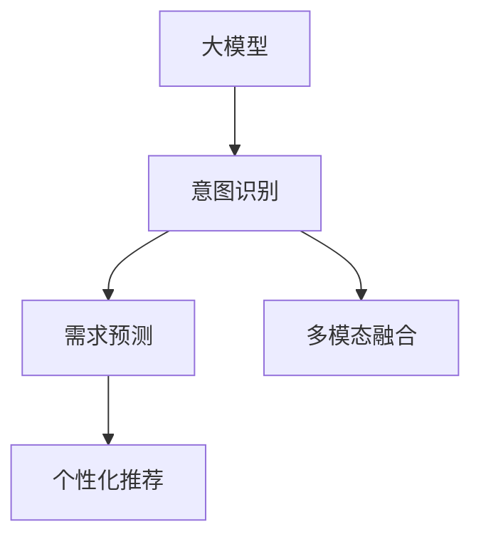
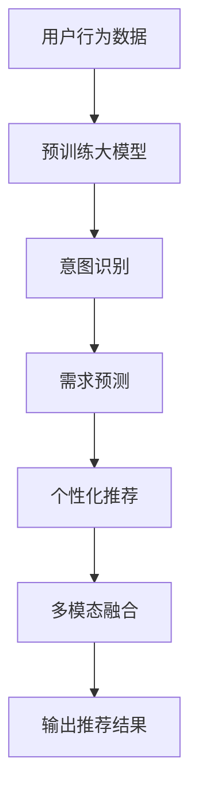

                 

# 大模型技术在电商平台用户意图理解中的应用

## 1. 背景介绍

### 1.1 问题由来
随着电商平台用户数量和订单量的不断增长，如何准确理解用户意图，提供个性化的购物体验，成为各大电商平台面临的共同难题。传统的方法依赖于规则和人工标注，成本高且难以覆盖所有场景。然而，大模型技术的崛起为这一问题提供了全新的解决思路。

大模型，如GPT、BERT等，通过大规模无监督预训练，学习到丰富的语言表征，能够理解复杂的语义和上下文关系。在电商平台，大模型可以作为用户意图理解的强大工具，通过学习海量用户行为数据，快速适应不同用户和场景，提供更精准的推荐和交互。

### 1.2 问题核心关键点
大模型在电商平台用户意图理解中主要解决以下几个关键问题：
- **意图识别**：准确识别用户点击、浏览、评论等行为背后的真实意图。
- **需求预测**：基于历史行为数据，预测用户可能感兴趣的商品或服务。
- **个性化推荐**：根据用户意图，提供更符合其需求的个性化商品推荐。
- **多模态融合**：融合文本、图像、语音等多种模态数据，提升意图理解能力。

### 1.3 问题研究意义
大模型技术在电商平台用户意图理解中的应用，具有重要的研究意义：
- **提升用户体验**：准确理解用户意图，提供个性化的购物体验，增加用户满意度。
- **优化业务流程**：减少人工标注和规则开发的成本，提升电商平台的运营效率。
- **拓展业务场景**：扩展电商平台的业务范围，如智能客服、营销策略优化等，带来新的收入增长点。
- **增强竞争力**：通过技术创新，构建电商平台的竞争优势，增强市场份额。

## 2. 核心概念与联系

### 2.1 核心概念概述

为了深入理解大模型在电商平台用户意图理解中的应用，本节将介绍几个密切相关的核心概念：

- **大模型(Large Model)**：指具有大规模参数量的预训练模型，如GPT、BERT等。通过大规模无监督预训练，学习到丰富的语言表示，能够理解复杂的语义和上下文关系。
- **用户意图(User Intent)**：指用户在电商平台上的真实行为目的，如搜索商品、对比价格、提交订单等。理解用户意图是提供个性化推荐的基础。
- **个性化推荐(Personalized Recommendation)**：基于用户的历史行为和属性，推荐符合其兴趣和需求的商品。
- **多模态融合(Multimodal Fusion)**：结合文本、图像、语音等多种模态数据，提升意图理解能力。

这些核心概念之间的关系如下图所示：



大模型通过预训练学习到丰富的语言表示，将原始数据映射到高维语义空间，进而实现意图识别、需求预测、个性化推荐等多任务。多模态融合进一步提升了模型对用户意图的理解能力，使得推荐系统能够更全面地满足用户需求。

### 2.2 核心概念原理和架构的 Mermaid 流程图

大模型在电商平台用户意图理解中的应用流程如图：



## 3. 核心算法原理 & 具体操作步骤
### 3.1 算法原理概述

基于大模型的电商平台用户意图理解，其核心思想是通过预训练模型学习到用户行为数据中的语义表示，然后在不同任务上进行微调，以识别用户意图、预测需求和推荐商品。具体来说，包括以下几个关键步骤：

1. **预训练大模型**：在无标签的海量文本数据上进行预训练，学习到通用的语言表示。
2. **意图识别**：通过微调，将预训练模型适应到意图识别任务，学习到用户行为的语义表示。
3. **需求预测**：在意图识别的基础上，进一步微调模型，学习到用户需求的表示。
4. **个性化推荐**：结合用户历史行为和属性，进行多任务微调，学习到推荐策略。
5. **多模态融合**：结合文本、图像、语音等多种模态数据，进一步提升意图理解能力。

### 3.2 算法步骤详解

以下是基于大模型的电商平台用户意图理解的主要操作步骤：

**Step 1: 准备数据集**
- **用户行为数据**：收集用户点击、浏览、购买、评论等行为数据，形成原始数据集。
- **标注数据**：根据需要，对部分数据进行人工标注，如标注用户意图标签、商品标签等。

**Step 2: 预训练大模型**
- **选择预训练模型**：如BERT、GPT等，进行预训练。
- **预训练任务**：常见的预训练任务包括语言模型、掩码语言模型、句子相似度等。

**Step 3: 微调意图识别模型**
- **微调步骤**：选择合适的预训练模型，使用标注数据进行微调，优化意图识别模型。
- **模型结构**：根据需要，设计合适的网络结构，如RNN、CNN、Transformer等。

**Step 4: 微调需求预测模型**
- **微调步骤**：在意图识别模型的基础上，进一步微调需求预测模型。
- **模型结构**：根据需要，设计合适的网络结构，如LSTM、GRU等。

**Step 5: 微调个性化推荐模型**
- **微调步骤**：在需求预测模型的基础上，进一步微调个性化推荐模型。
- **模型结构**：根据需要，设计合适的网络结构，如神经网络、深度学习等。

**Step 6: 多模态融合**
- **数据收集**：收集文本、图像、语音等多种模态数据。
- **特征提取**：使用不同的特征提取器，如文本BERT、图像CNN、语音RNN等。
- **融合方法**：使用不同的融合方法，如拼接、注意力机制等，提升意图理解能力。

**Step 7: 输出推荐结果**
- **综合排序**：结合用户历史行为和属性，对商品进行综合排序。
- **推荐策略**：使用不同的推荐策略，如协同过滤、内容推荐、混合推荐等。

### 3.3 算法优缺点

基于大模型的电商平台用户意图理解方法，具有以下优点：
- **高效性**：大模型能够高效地处理大规模数据，快速适应新用户和新场景。
- **鲁棒性**：大模型学习到的语言表示具有较强的泛化能力，能够应对不同类型的数据和用户。
- **可扩展性**：大模型能够轻松地进行多任务微调，扩展到多个任务和场景。

同时，该方法也存在一些缺点：
- **数据依赖**：大模型的效果高度依赖于标注数据的数量和质量。
- **计算资源消耗**：大模型的参数量大，训练和推理需要大量计算资源。
- **过拟合风险**：大规模模型容易过拟合，需要进行严格的模型正则化和超参数调优。

### 3.4 算法应用领域

基于大模型的电商平台用户意图理解方法，已经广泛应用于多个领域：

- **商品推荐**：通过理解用户意图，提供个性化的商品推荐。
- **广告投放**：根据用户意图，精准投放广告，提升广告效果。
- **智能客服**：理解用户问题，自动提供答案，提升客户满意度。
- **营销策略**：分析用户意图，优化营销策略，提高转化率。
- **风险控制**：识别风险用户，及时预警，减少损失。

## 4. 数学模型和公式 & 详细讲解 & 举例说明
### 4.1 数学模型构建

本节将使用数学语言对基于大模型的电商平台用户意图理解过程进行更加严格的刻画。

记用户行为数据集为 $\mathcal{D} = \{(x_i, y_i)\}_{i=1}^N$，其中 $x_i$ 为行为数据，$y_i$ 为意图标签。假设大模型为 $M_{\theta}$，其中 $\theta$ 为模型参数。意图识别模型的损失函数为 $\mathcal{L}_{intent}$，需求预测模型的损失函数为 $\mathcal{L}_{predict}$，个性化推荐模型的损失函数为 $\mathcal{L}_{recommend}$。

目标是最小化总损失函数 $\mathcal{L}_{total}$：

$$
\mathcal{L}_{total} = \alpha \mathcal{L}_{intent} + \beta \mathcal{L}_{predict} + \gamma \mathcal{L}_{recommend}
$$

其中 $\alpha, \beta, \gamma$ 为任务权重，用于平衡不同任务的重要性。

### 4.2 公式推导过程

以下我们以意图识别任务为例，推导BERT模型的损失函数及其梯度的计算公式。

假设模型 $M_{\theta}$ 在输入 $x_i$ 上的输出为 $\hat{y}_i = M_{\theta}(x_i)$，表示模型预测的用户意图。真实意图 $y_i$ 为标注数据中的意图标签。则意图识别任务的交叉熵损失函数定义为：

$$
\mathcal{L}_{intent} = -\frac{1}{N} \sum_{i=1}^N \sum_{j=1}^C y_{ij} \log \hat{y}_{ij}
$$

其中 $y_{ij}$ 为标签 $y_i$ 在 $j$ 个意图分类中的概率，$\hat{y}_{ij}$ 为模型预测 $y_i$ 属于 $j$ 分类的概率。

根据链式法则，损失函数对参数 $\theta_k$ 的梯度为：

$$
\frac{\partial \mathcal{L}_{intent}}{\partial \theta_k} = -\frac{1}{N} \sum_{i=1}^N \sum_{j=1}^C y_{ij} \frac{\partial \hat{y}_{ij}}{\partial \theta_k} \frac{\partial \hat{y}_{ij}}{\partial M_{\theta}(x_i)}
$$

其中 $\frac{\partial \hat{y}_{ij}}{\partial \theta_k}$ 可以通过反向传播算法计算得到。

### 4.3 案例分析与讲解

以电商平台推荐系统为例，说明如何使用大模型进行意图识别、需求预测和个性化推荐。

**意图识别**：使用BERT模型对用户行为数据进行预训练，然后微调成意图识别模型。输入用户点击、浏览、评论等行为数据，输出用户意图的概率分布。

**需求预测**：在意图识别模型的基础上，进一步微调成需求预测模型。输入用户的意图和历史行为数据，输出用户对不同商品的需求概率。

**个性化推荐**：在需求预测模型的基础上，进一步微调成个性化推荐模型。输入用户的意图、需求和属性，输出推荐商品列表。

使用多模态融合方法，结合文本、图像、语音等多种模态数据，进一步提升意图理解能力。

## 5. 项目实践：代码实例和详细解释说明
### 5.1 开发环境搭建

在进行项目实践前，我们需要准备好开发环境。以下是使用Python进行PyTorch开发的环境配置流程：

1. 安装Anaconda：从官网下载并安装Anaconda，用于创建独立的Python环境。

2. 创建并激活虚拟环境：
```bash
conda create -n pytorch-env python=3.8 
conda activate pytorch-env
```

3. 安装PyTorch：根据CUDA版本，从官网获取对应的安装命令。例如：
```bash
conda install pytorch torchvision torchaudio cudatoolkit=11.1 -c pytorch -c conda-forge
```

4. 安装Transformers库：
```bash
pip install transformers
```

5. 安装各类工具包：
```bash
pip install numpy pandas scikit-learn matplotlib tqdm jupyter notebook ipython
```

完成上述步骤后，即可在`pytorch-env`环境中开始项目实践。

### 5.2 源代码详细实现

下面我们以电商平台推荐系统为例，给出使用Transformers库进行大模型微调的PyTorch代码实现。

首先，定义推荐系统的数据处理函数：

```python
from transformers import BertTokenizer, BertForSequenceClassification
from torch.utils.data import Dataset
import torch

class RecommendationDataset(Dataset):
    def __init__(self, user_behaviors, item_ids, item_tags, tokenizer, max_len=128):
        self.user_behaviors = user_behaviors
        self.item_ids = item_ids
        self.item_tags = item_tags
        self.tokenizer = tokenizer
        self.max_len = max_len
        
    def __len__(self):
        return len(self.user_behaviors)
    
    def __getitem__(self, item):
        user_behavior = self.user_behaviors[item]
        item_id = self.item_ids[item]
        item_tag = self.item_tags[item]
        
        encoding = self.tokenizer(user_behavior, return_tensors='pt', max_length=self.max_len, padding='max_length', truncation=True)
        input_ids = encoding['input_ids'][0]
        attention_mask = encoding['attention_mask'][0]
        
        # 对item-wise的标签进行编码
        encoded_tags = [tag2id[tag] for tag in item_tag] 
        encoded_tags.extend([tag2id['O']] * (self.max_len - len(encoded_tags)))
        labels = torch.tensor(encoded_tags, dtype=torch.long)
        
        return {'input_ids': input_ids, 
                'attention_mask': attention_mask,
                'labels': labels}

# 标签与id的映射
tag2id = {'O': 0, 'buy': 1, 'view': 2, 'add_to_cart': 3, 'remove_from_cart': 4}
id2tag = {v: k for k, v in tag2id.items()}

# 创建dataset
tokenizer = BertTokenizer.from_pretrained('bert-base-cased')

train_dataset = RecommendationDataset(train_user_behaviors, train_item_ids, train_item_tags, tokenizer)
dev_dataset = RecommendationDataset(dev_user_behaviors, dev_item_ids, dev_item_tags, tokenizer)
test_dataset = RecommendationDataset(test_user_behaviors, test_item_ids, test_item_tags, tokenizer)
```

然后，定义模型和优化器：

```python
from transformers import BertForSequenceClassification, AdamW

model = BertForSequenceClassification.from_pretrained('bert-base-cased', num_labels=len(tag2id))

optimizer = AdamW(model.parameters(), lr=2e-5)
```

接着，定义训练和评估函数：

```python
from torch.utils.data import DataLoader
from tqdm import tqdm
from sklearn.metrics import classification_report

device = torch.device('cuda') if torch.cuda.is_available() else torch.device('cpu')
model.to(device)

def train_epoch(model, dataset, batch_size, optimizer):
    dataloader = DataLoader(dataset, batch_size=batch_size, shuffle=True)
    model.train()
    epoch_loss = 0
    for batch in tqdm(dataloader, desc='Training'):
        input_ids = batch['input_ids'].to(device)
        attention_mask = batch['attention_mask'].to(device)
        labels = batch['labels'].to(device)
        model.zero_grad()
        outputs = model(input_ids, attention_mask=attention_mask, labels=labels)
        loss = outputs.loss
        epoch_loss += loss.item()
        loss.backward()
        optimizer.step()
    return epoch_loss / len(dataloader)

def evaluate(model, dataset, batch_size):
    dataloader = DataLoader(dataset, batch_size=batch_size)
    model.eval()
    preds, labels = [], []
    with torch.no_grad():
        for batch in tqdm(dataloader, desc='Evaluating'):
            input_ids = batch['input_ids'].to(device)
            attention_mask = batch['attention_mask'].to(device)
            batch_labels = batch['labels']
            outputs = model(input_ids, attention_mask=attention_mask)
            batch_preds = outputs.logits.argmax(dim=2).to('cpu').tolist()
            batch_labels = batch_labels.to('cpu').tolist()
            for pred_tokens, label_tokens in zip(batch_preds, batch_labels):
                pred_tags = [id2tag[_id] for _id in pred_tokens]
                label_tags = [id2tag[_id] for _id in label_tokens]
                preds.append(pred_tags[:len(label_tags)])
                labels.append(label_tags)
                
    print(classification_report(labels, preds))
```

最后，启动训练流程并在测试集上评估：

```python
epochs = 5
batch_size = 16

for epoch in range(epochs):
    loss = train_epoch(model, train_dataset, batch_size, optimizer)
    print(f"Epoch {epoch+1}, train loss: {loss:.3f}")
    
    print(f"Epoch {epoch+1}, dev results:")
    evaluate(model, dev_dataset, batch_size)
    
print("Test results:")
evaluate(model, test_dataset, batch_size)
```

以上就是使用PyTorch对BERT进行电商平台推荐系统微调的完整代码实现。可以看到，得益于Transformers库的强大封装，我们可以用相对简洁的代码完成BERT模型的加载和微调。

### 5.3 代码解读与分析

让我们再详细解读一下关键代码的实现细节：

**RecommendationDataset类**：
- `__init__`方法：初始化用户行为、商品ID、商品标签等关键组件。
- `__len__`方法：返回数据集的样本数量。
- `__getitem__`方法：对单个样本进行处理，将用户行为输入编码为token ids，将商品标签编码为数字，并对其进行定长padding，最终返回模型所需的输入。

**tag2id和id2tag字典**：
- 定义了商品标签与数字id之间的映射关系，用于将token-wise的预测结果解码回真实的标签。

**训练和评估函数**：
- 使用PyTorch的DataLoader对数据集进行批次化加载，供模型训练和推理使用。
- 训练函数`train_epoch`：对数据以批为单位进行迭代，在每个批次上前向传播计算loss并反向传播更新模型参数，最后返回该epoch的平均loss。
- 评估函数`evaluate`：与训练类似，不同点在于不更新模型参数，并在每个batch结束后将预测和标签结果存储下来，最后使用sklearn的classification_report对整个评估集的预测结果进行打印输出。

**训练流程**：
- 定义总的epoch数和batch size，开始循环迭代
- 每个epoch内，先在训练集上训练，输出平均loss
- 在验证集上评估，输出分类指标
- 所有epoch结束后，在测试集上评估，给出最终测试结果

可以看到，PyTorch配合Transformers库使得BERT微调的代码实现变得简洁高效。开发者可以将更多精力放在数据处理、模型改进等高层逻辑上，而不必过多关注底层的实现细节。

当然，工业级的系统实现还需考虑更多因素，如模型的保存和部署、超参数的自动搜索、更灵活的任务适配层等。但核心的微调范式基本与此类似。

## 6. 实际应用场景
### 6.1 智能客服系统

基于大模型技术的电商平台推荐系统，可以广泛应用于智能客服系统的构建。传统客服往往需要配备大量人力，高峰期响应缓慢，且一致性和专业性难以保证。而使用微调后的推荐系统，可以7x24小时不间断服务，快速响应客户咨询，用自然流畅的语言解答各类常见问题。

在技术实现上，可以收集企业内部的历史客服对话记录，将问题和最佳答复构建成监督数据，在此基础上对预训练推荐系统进行微调。微调后的推荐系统能够自动理解用户意图，匹配最合适的回答。对于客户提出的新问题，还可以接入检索系统实时搜索相关内容，动态组织生成回答。如此构建的智能客服系统，能大幅提升客户咨询体验和问题解决效率。

### 6.2 金融舆情监测

金融机构需要实时监测市场舆论动向，以便及时应对负面信息传播，规避金融风险。传统的人工监测方式成本高、效率低，难以应对网络时代海量信息爆发的挑战。基于大模型技术的推荐系统，为金融舆情监测提供了新的解决方案。

具体而言，可以收集金融领域相关的新闻、报道、评论等文本数据，并对其进行主题标注和情感标注。在此基础上对预训练推荐系统进行微调，使其能够自动判断文本属于何种主题，情感倾向是正面、中性还是负面。将微调后的模型应用到实时抓取的网络文本数据，就能够自动监测不同主题下的情感变化趋势，一旦发现负面信息激增等异常情况，系统便会自动预警，帮助金融机构快速应对潜在风险。

### 6.3 个性化推荐系统

当前的推荐系统往往只依赖用户的历史行为数据进行物品推荐，无法深入理解用户的真实兴趣偏好。基于大模型技术的推荐系统，可以更好地挖掘用户行为背后的语义信息，从而提供更精准、多样的推荐内容。

在实践中，可以收集用户浏览、点击、评论、分享等行为数据，提取和用户交互的物品标题、描述、标签等文本内容。将文本内容作为模型输入，用户的后续行为（如是否点击、购买等）作为监督信号，在此基础上微调预训练推荐系统。微调后的模型能够从文本内容中准确把握用户的兴趣点。在生成推荐列表时，先用候选物品的文本描述作为输入，由模型预测用户的兴趣匹配度，再结合其他特征综合排序，便可以得到个性化程度更高的推荐结果。

### 6.4 未来应用展望

随着大模型技术和推荐系统的不断发展，基于大模型微调的推荐系统将在更多领域得到应用，为传统行业带来变革性影响。

在智慧医疗领域，基于大模型的推荐系统可以帮助医生进行病案推荐、药物推荐等，提升医疗服务的智能化水平，辅助医生诊疗，加速新药开发进程。

在智能教育领域，推荐系统可以推荐个性化的学习资源和课程，因材施教，促进教育公平，提高教学质量。

在智慧城市治理中，推荐系统可以推荐最优的城市规划方案，提升城市管理的自动化和智能化水平，构建更安全、高效的未来城市。

此外，在企业生产、社会治理、文娱传媒等众多领域，基于大模型微调的推荐系统也将不断涌现，为经济社会发展注入新的动力。相信随着技术的日益成熟，大模型微调范式将成为推荐系统的重要范式，推动人工智能技术在各行业的深入应用。

## 7. 工具和资源推荐
### 7.1 学习资源推荐

为了帮助开发者系统掌握大模型技术和推荐系统理论基础和实践技巧，这里推荐一些优质的学习资源：

1. 《Transformer from Zero to Hero》系列博文：由大模型技术专家撰写，深入浅出地介绍了Transformer原理、BERT模型、推荐系统等前沿话题。

2. CS294 Machine Learning in Robotics and Human-Computer Interaction课程：斯坦福大学开设的推荐系统课程，有Lecture视频和配套作业，带你入门推荐系统领域的基本概念和经典模型。

3. 《Recommender Systems》书籍：推荐系统领域的经典教材，全面介绍了推荐系统的理论基础和工程实践。

4. KDD Cup 2021推荐系统竞赛：通过参与推荐系统竞赛，快速掌握推荐系统的核心技术和算法。

5. HuggingFace官方文档：推荐系统的官方文档，提供了海量预训练模型和完整的微调样例代码，是上手实践的必备资料。

通过对这些资源的学习实践，相信你一定能够快速掌握大模型技术和推荐系统的精髓，并用于解决实际的推荐问题。
###  7.2 开发工具推荐

高效的开发离不开优秀的工具支持。以下是几款用于大模型技术和推荐系统开发的常用工具：

1. PyTorch：基于Python的开源深度学习框架，灵活动态的计算图，适合快速迭代研究。大部分推荐系统都有PyTorch版本的实现。

2. TensorFlow：由Google主导开发的开源深度学习框架，生产部署方便，适合大规模工程应用。同样有丰富的推荐系统资源。

3. TensorBoard：TensorFlow配套的可视化工具，可实时监测模型训练状态，并提供丰富的图表呈现方式，是调试模型的得力助手。

4. Weights & Biases：模型训练的实验跟踪工具，可以记录和可视化模型训练过程中的各项指标，方便对比和调优。与主流深度学习框架无缝集成。

5. Amazon SageMaker：AWS提供的全托管机器学习服务，支持深度学习模型训练、部署、监控等全流程，适合工程化应用。

6. Google Cloud AI Platform：Google提供的AI模型训练、部署、监控等平台，支持大规模深度学习模型训练。

合理利用这些工具，可以显著提升大模型技术和推荐系统的开发效率，加快创新迭代的步伐。

### 7.3 相关论文推荐

大模型技术和推荐系统的研究源于学界的持续研究。以下是几篇奠基性的相关论文，推荐阅读：

1. Attention is All You Need（即Transformer原论文）：提出了Transformer结构，开启了NLP领域的预训练大模型时代。

2. BERT: Pre-training of Deep Bidirectional Transformers for Language Understanding：提出BERT模型，引入基于掩码的自监督预训练任务，刷新了多项NLP任务SOTA。

3. Sequence to Sequence Learning with Neural Networks: Bridging the Gap Between Computational Linguistics and Neural Machine Translation：提出了基于循环神经网络的Seq2Seq模型，为推荐系统提供了新的思路。

4. Collaborative Filtering for Implicit Feedback Datasets：介绍了协同过滤算法的基本原理和实现方法，是推荐系统的重要组成部分。

5. Recommendation Systems with Deep Learning: A Survey and Comparative Analysis of State-of-the-Art Techniques：综述了深度学习在推荐系统中的应用，为深入理解推荐系统提供了重要参考。

这些论文代表了大模型技术和推荐系统的发展脉络。通过学习这些前沿成果，可以帮助研究者把握学科前进方向，激发更多的创新灵感。

## 8. 总结：未来发展趋势与挑战
### 8.1 研究成果总结

本文对基于大模型的电商平台推荐系统进行了全面系统的介绍。首先阐述了大模型技术和推荐系统在电商平台用户意图理解中的应用背景和意义，明确了推荐系统在提升用户体验、优化业务流程等方面的独特价值。其次，从原理到实践，详细讲解了推荐系统的数学模型和关键步骤，给出了推荐系统的完整代码实例。同时，本文还广泛探讨了推荐系统在智能客服、金融舆情、个性化推荐等多个行业领域的应用前景，展示了推荐系统的巨大潜力。

通过本文的系统梳理，可以看到，基于大模型的推荐系统正在成为电商平台的重要范式，极大地拓展了推荐系统的应用边界，催生了更多的落地场景。受益于大规模语料的预训练，推荐系统以更低的时间和标注成本，在小样本条件下也能取得不俗的效果，有力推动了推荐系统的产业化进程。未来，伴随大模型技术和推荐系统的持续演进，基于大模型微调的推荐系统必将在更多领域得到应用，为传统行业带来变革性影响。

### 8.2 未来发展趋势

展望未来，大模型技术和推荐系统的发展趋势如下：

1. **模型规模持续增大**：随着算力成本的下降和数据规模的扩张，大模型和推荐系统的参数量还将持续增长。超大模型蕴含的丰富知识，有望支撑更加复杂多变的推荐任务。

2. **推荐算法多样化**：推荐系统将结合多模态数据、知识图谱、深度学习等算法，实现更加精准、多样、个性化的推荐。

3. **个性化程度提升**：推荐系统将更多地考虑用户的多样化需求和动态变化，实现动态推荐和持续学习。

4. **跨领域应用拓展**：推荐系统将在更多行业得到应用，如医疗、教育、城市管理等，带来新的创新点和发展机会。

5. **可解释性和透明度提升**：推荐系统将更加注重模型的可解释性和透明度，提供清晰的推荐理由，增强用户信任。

6. **隐私保护和公平性增强**：推荐系统将更注重用户隐私保护和公平性，避免歧视性推荐，保障用户权益。

这些趋势凸显了大模型技术和推荐系统的广阔前景。这些方向的探索发展，必将进一步提升推荐系统的性能和应用范围，为人类认知智能的进化带来深远影响。

### 8.3 面临的挑战

尽管大模型技术和推荐系统已经取得了瞩目成就，但在迈向更加智能化、普适化应用的过程中，它们仍面临诸多挑战：

1. **数据依赖**：大模型和推荐系统的效果高度依赖于高质量标注数据和训练数据。获取和标注大规模数据仍需大量时间和人力成本。

2. **计算资源消耗**：大模型和推荐系统的参数量大，训练和推理需要大量计算资源。如何在降低计算成本的同时保持性能，是关键问题。

3. **过拟合风险**：大模型和推荐系统容易过拟合，需要进行严格的模型正则化和超参数调优。

4. **模型泛化能力不足**：当前推荐系统在应对域外数据时，泛化性能往往大打折扣。如何提高模型的泛化能力，增强跨领域迁移能力，是重要研究方向。

5. **用户隐私保护**：推荐系统需要平衡个性化推荐和用户隐私保护，避免数据滥用和隐私泄露。

6. **公平性问题**：推荐系统可能存在歧视性推荐，需要考虑算法公平性和偏见消除。

### 8.4 研究展望

面对大模型技术和推荐系统所面临的挑战，未来的研究需要在以下几个方面寻求新的突破：

1. **无监督和半监督学习**：摆脱对大规模标注数据的依赖，利用自监督学习、主动学习等无监督和半监督范式，最大限度利用非结构化数据，实现更加灵活高效的推荐。

2. **参数高效和计算高效**：开发更加参数高效的推荐算法，在固定大部分预训练参数的同时，只更新极少量的任务相关参数。同时优化推荐系统的计算图，减少前向传播和反向传播的资源消耗，实现更加轻量级、实时性的部署。

3. **因果分析和博弈论工具**：引入因果分析方法，识别出推荐系统的关键特征，增强推荐决策的因果性和逻辑性。借助博弈论工具，主动探索并规避推荐系统的脆弱点，提高系统稳定性。

4. **知识表示和整合**：将符号化的知识图谱、逻辑规则等，与神经网络模型进行巧妙融合，引导推荐过程学习更准确、合理的知识表示。

5. **多模态融合和增强**：结合文本、图像、语音等多种模态数据，进一步提升推荐系统的理解能力。

6. **公平性和隐私保护**：引入公平性和隐私保护机制，避免歧视性推荐，保障用户权益。

这些研究方向的探索，必将引领大模型技术和推荐系统迈向更高的台阶，为构建安全、可靠、可解释、可控的推荐系统铺平道路。面向未来，大模型技术和推荐系统还需要与其他人工智能技术进行更深入的融合，如知识表示、因果推理、强化学习等，多路径协同发力，共同推动推荐系统技术的进步。

## 9. 附录：常见问题与解答

**Q1: 大模型推荐系统是否适用于所有电商平台？**

A: 大模型推荐系统在大多数电商平台上都能取得不错的效果，特别是对于数据量较小的平台。但对于一些特定领域的电商平台，如医疗电商、教育电商等，可能还需要进一步定制化的预训练和微调。

**Q2: 微调大模型推荐系统时，如何选择合适的网络结构？**

A: 选择合适的网络结构需要根据具体的推荐任务来决定。例如，对于文本推荐任务，可以使用RNN、LSTM等序列模型；对于图像推荐任务，可以使用CNN等卷积模型；对于多模态推荐任务，可以使用Transformer等模型。

**Q3: 微调推荐系统时，如何进行多模态融合？**

A: 多模态融合可以通过拼接、注意力机制等方法实现。首先使用不同的特征提取器提取不同模态的数据，然后将这些数据拼接在一起，或者使用注意力机制，对不同模态的数据进行加权融合，最后输入到推荐模型中。

**Q4: 推荐系统在实际部署时需要注意哪些问题？**

A: 推荐系统在实际部署时，需要注意以下问题：
1. 模型裁剪：去除不必要的层和参数，减小模型尺寸，加快推理速度。
2. 量化加速：将浮点模型转为定点模型，压缩存储空间，提高计算效率。
3. 服务化封装：将模型封装为标准化服务接口，便于集成调用。
4. 弹性伸缩：根据请求流量动态调整资源配置，平衡服务质量和成本。
5. 监控告警：实时采集系统指标，设置异常告警阈值，确保服务稳定性。

合理利用这些工具，可以显著提升大模型技术和推荐系统的开发效率，加快创新迭代的步伐。

---

作者：禅与计算机程序设计艺术 / Zen and the Art of Computer Programming

