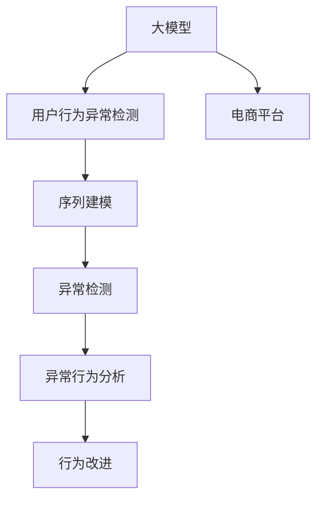

                 

# 大模型技术在电商平台用户行为异常检测中的应用

> 关键词：大模型,用户行为异常检测,电商,NLP,序列建模,异常检测,深度学习

## 1. 背景介绍

### 1.1 问题由来
随着电商平台的迅速发展，用户行为数据的数量和复杂度呈现指数级增长。用户行为数据的异常检测对于提升用户体验、优化推荐系统、防范欺诈风险等具有重要意义。传统的基于规则或统计方法的异常检测系统难以适应海量、实时、多样化的电商数据，而基于深度学习的方法能够有效处理复杂非线性的用户行为模式，因此在电商平台的用户行为异常检测中得到了广泛应用。

### 1.2 问题核心关键点
在电商平台的用户行为异常检测中，核心问题包括：
- 如何高效获取电商用户行为数据
- 如何设计模型结构和训练策略，提升异常检测精度
- 如何处理大规模数据，提升检测效率
- 如何应对实时性要求，实现动态更新
- 如何提高检测结果的可解释性

本文将重点讨论基于大模型的用户行为异常检测方法，并通过系统化的介绍，帮助读者理解和实践这一技术。

### 1.3 问题研究意义
研究大模型在电商平台用户行为异常检测中的应用，对于提升电商平台的用户体验、增强平台安全性、优化推荐系统、防范欺诈行为等具有重要意义：

1. 提升用户体验。通过实时监控用户行为，及时发现和处理异常行为，可以大幅提升用户满意度。
2. 增强平台安全性。通过异常检测，可以有效防范恶意行为，保障平台和用户数据的安全。
3. 优化推荐系统。通过分析用户行为数据，可以发现潜在的需求和兴趣点，提供个性化推荐，提升用户转化率。
4. 防范欺诈行为。通过检测异常交易，可以有效识别和防范欺诈行为，减少损失。
5. 大数据分析。基于大模型的用户行为分析，可以揭示用户行为背后的深层次规律，助力商业决策。

## 2. 核心概念与联系

### 2.1 核心概念概述

为更好地理解基于大模型的电商平台用户行为异常检测方法，本节将介绍几个关键概念：

- 大模型(Large Model)：指具有数亿甚至数十亿参数的深度学习模型，如BERT、GPT等。这些模型在大规模无标签数据上预训练，具备强大的语言理解和生成能力。
- 用户行为异常检测(Anomaly Detection)：指通过机器学习算法，识别用户行为数据中的异常行为，以防止欺诈、提升用户体验等。
- 电商平台(E-commerce Platform)：指通过互联网提供商品销售、物流配送、用户服务等功能的企业或平台。
- 序列建模(Sequence Modeling)：指利用序列数据进行建模，如时间序列、文本序列等。
- 异常检测(Anomaly Detection)：指通过机器学习算法，识别数据集中的异常点或异常模式。

这些概念之间的逻辑关系可以通过以下Mermaid流程图来展示：



这个流程图展示了大模型、电商平台、用户行为异常检测、序列建模和异常检测之间的联系：

1. 大模型通过大规模预训练获得通用语言表示。
2. 在电商平台上，大模型被用于用户行为数据的建模。
3. 通过序列建模，将用户行为数据转换为序列形式，用于异常检测。
4. 异常检测算法识别用户行为中的异常模式。
5. 根据异常检测结果，对用户行为进行改进，提升平台性能。

## 3. 核心算法原理 & 具体操作步骤
### 3.1 算法原理概述

基于大模型的电商平台用户行为异常检测，本质上是通过序列建模和异常检测，在用户行为数据中识别异常模式。其核心思想是：将大模型作为特征提取器，将用户行为序列转换为模型内部的向量表示，再通过异常检测算法识别异常行为。

形式化地，假设电商平台用户行为数据为 $\{X_1, X_2, ..., X_N\}$，其中 $X_i$ 表示第 $i$ 个用户的行为序列。记 $X_i$ 的长度为 $T$，即包含 $T$ 个时间步长的行为数据。记大模型的预训练参数为 $\theta$，用户行为序列 $X_i$ 在大模型上的表示为 $H_i$，则用户行为异常检测的数学模型可以表示为：

$$
\hat{y}_i = f(H_i, \theta)
$$

其中 $f$ 为异常检测函数，$\hat{y}_i \in \{0, 1\}$ 表示第 $i$ 个用户行为是否为异常行为。

### 3.2 算法步骤详解

基于大模型的电商平台用户行为异常检测的一般步骤如下：

**Step 1: 准备数据集**
- 收集电商平台用户行为数据，包括购买、浏览、点击、评价等行为记录。
- 对行为数据进行清洗和标注，如删除重复数据、标注异常行为等。
- 将数据集分为训练集、验证集和测试集，保证各集之间的分布一致。

**Step 2: 构建预训练大模型**
- 选择合适的大模型结构，如Transformer、LSTM、GRU等。
- 使用电商平台的文本数据对大模型进行预训练，学习用户行为的通用表示。

**Step 3: 序列建模**
- 将用户行为序列转换为模型所需的格式，如时间步长对齐、归一化等。
- 利用预训练大模型，将用户行为序列 $X_i$ 转换为内部表示 $H_i$。

**Step 4: 异常检测**
- 设计异常检测算法，如孤立森林、一阶差分、统计量等。
- 利用 $H_i$ 计算异常检测结果 $\hat{y}_i$，表示用户行为是否异常。

**Step 5: 模型评估和优化**
- 在测试集上评估模型的检测性能，如准确率、召回率、F1分数等。
- 根据评估结果，调整模型结构和训练策略，优化模型性能。
- 在实际应用中，动态更新模型，实时检测用户行为异常。

### 3.3 算法优缺点

基于大模型的电商平台用户行为异常检测方法具有以下优点：
1. 强大的特征提取能力。大模型能够自动学习用户行为的深层次特征，提升异常检测的精度。
2. 高泛化能力。由于在大规模数据上预训练，模型能够适应不同场景下的用户行为。
3. 灵活的异常检测算法。结合多种异常检测方法，能够综合多种特征进行检测。
4. 较好的可扩展性。在大模型基础上，新增特征和行为类型，只需进行简单调整。

同时，该方法也存在一定的局限性：
1. 数据需求较大。由于大模型需要在大规模数据上预训练，数据获取和处理成本较高。
2. 实时性要求较高。在大规模数据上，模型推理速度较慢，难以满足实时性要求。
3. 模型复杂度较高。大模型的参数量较大，训练和推理的资源消耗较大。
4. 可解释性不足。大模型往往黑盒化，难以解释其内部决策过程。
5. 训练和推理成本较高。大模型的高资源需求，对计算资源和存储资源要求较高。

尽管存在这些局限性，但基于大模型的用户行为异常检测方法仍然具有强大的应用前景，广泛应用于电商平台的用户行为分析、欺诈检测、推荐优化等领域。

### 3.4 算法应用领域

基于大模型的电商平台用户行为异常检测方法，已经在以下几个领域得到了广泛应用：

- 用户行为分析：通过分析用户行为数据，发现用户兴趣和行为模式，优化推荐系统。
- 欺诈检测：实时监控用户行为，识别异常行为，防范欺诈风险。
- 推荐优化：分析用户行为，发现潜在需求，提供个性化推荐，提升用户转化率。
- 客户流失预测：通过分析用户行为数据，预测用户流失概率，及时采取挽留措施。
- 客户满意度评估：利用用户行为数据，评估客户满意度，提升服务质量。

此外，大模型还被应用于其他电商相关的领域，如价格预测、库存管理、物流优化等，为电商平台的智能化运营提供支持。

## 4. 数学模型和公式 & 详细讲解 & 举例说明
### 4.1 数学模型构建

本节将使用数学语言对基于大模型的电商平台用户行为异常检测过程进行更加严格的刻画。

记电商平台用户行为数据为 $\{X_1, X_2, ..., X_N\}$，其中 $X_i$ 表示第 $i$ 个用户的行为序列。设用户行为序列 $X_i$ 的长度为 $T$，即包含 $T$ 个时间步长的行为数据。记大模型的预训练参数为 $\theta$，用户行为序列 $X_i$ 在大模型上的表示为 $H_i \in \mathbb{R}^d$。异常检测算法的目标是最小化损失函数 $\mathcal{L}$，即找到最优的异常检测函数 $f$ 和模型参数 $\theta$：

$$
\mathcal{L} = \mathbb{E}_{i}[L(f(H_i, \theta), y_i)]
$$

其中 $L$ 为损失函数，$y_i \in \{0, 1\}$ 表示第 $i$ 个用户行为是否异常。

### 4.2 公式推导过程

以下我们以孤立森林算法为例，推导用户行为异常检测的公式。

孤立森林算法是一种基于树模型的异常检测算法，其核心思想是将数据随机分割，直到每个分割中只包含一个样本，然后通过计算树的高度来衡量异常度。假设孤立森林算法的异常度为 $g(X_i, \theta)$，则用户行为异常检测的公式可以表示为：

$$
\hat{y}_i = \left\{
\begin{aligned}
1, & \quad g(X_i, \theta) > \tau \\
0, & \quad g(X_i, \theta) \leq \tau
\end{aligned}
\right.
$$

其中 $\tau$ 为异常度阈值，根据实际场景进行调整。

在实践中，我们可以将用户行为序列 $X_i$ 转换为大模型内部的向量表示 $H_i$，然后将 $H_i$ 输入孤立森林模型进行异常度计算。具体步骤如下：
1. 将用户行为序列 $X_i$ 转换为模型输入 $H_i$。
2. 将 $H_i$ 输入孤立森林模型，计算异常度 $g(X_i, \theta)$。
3. 根据异常度阈值 $\tau$，判断用户行为是否异常，输出异常检测结果 $\hat{y}_i$。

### 4.3 案例分析与讲解

为了更好地理解基于大模型的电商平台用户行为异常检测的实现过程，我们以一个具体的案例进行讲解。

假设某电商平台收集了用户的行为数据，包括购买、浏览、点击、评价等行为记录。我们希望使用大模型对用户行为进行异常检测，以识别潜在的欺诈行为。

**Step 1: 数据准备**
- 收集电商平台的用户行为数据，将其分为训练集、验证集和测试集。
- 对数据进行清洗和标注，如删除重复数据、标注异常行为等。
- 将数据集中的行为数据转换为时间步长对齐的序列形式，如将点击、购买等行为记录转换为时间序列。

**Step 2: 模型构建**
- 选择合适的大模型结构，如Transformer、LSTM、GRU等。
- 使用电商平台的文本数据对大模型进行预训练，学习用户行为的通用表示。

**Step 3: 序列建模**
- 将用户行为序列 $X_i$ 转换为模型所需的格式，如时间步长对齐、归一化等。
- 利用预训练大模型，将用户行为序列 $X_i$ 转换为内部表示 $H_i$。

**Step 4: 异常检测**
- 设计孤立森林算法，设置异常度阈值 $\tau$。
- 将用户行为序列 $X_i$ 转换为模型输入 $H_i$，输入孤立森林模型计算异常度 $g(X_i, \theta)$。
- 根据异常度阈值 $\tau$，判断用户行为是否异常，输出异常检测结果 $\hat{y}_i$。

**Step 5: 模型评估和优化**
- 在测试集上评估模型的检测性能，如准确率、召回率、F1分数等。
- 根据评估结果，调整模型结构和训练策略，优化模型性能。
- 在实际应用中，动态更新模型，实时检测用户行为异常。

## 5. 项目实践：代码实例和详细解释说明
### 5.1 开发环境搭建

在进行电商平台用户行为异常检测项目实践前，我们需要准备好开发环境。以下是使用Python进行PyTorch开发的环境配置流程：

1. 安装Anaconda：从官网下载并安装Anaconda，用于创建独立的Python环境。

2. 创建并激活虚拟环境：
```bash
conda create -n pytorch-env python=3.8 
conda activate pytorch-env
```

3. 安装PyTorch：根据CUDA版本，从官网获取对应的安装命令。例如：
```bash
conda install pytorch torchvision torchaudio cudatoolkit=11.1 -c pytorch -c conda-forge
```

4. 安装Transformers库：
```bash
pip install transformers
```

5. 安装各类工具包：
```bash
pip install numpy pandas scikit-learn matplotlib tqdm jupyter notebook ipython
```

完成上述步骤后，即可在`pytorch-env`环境中开始项目实践。

### 5.2 源代码详细实现

下面我们以基于大模型的电商平台用户行为异常检测为例，给出使用Transformers库进行模型开发的PyTorch代码实现。

首先，定义异常检测函数：

```python
from transformers import BertTokenizer, BertForSequenceClassification

def anomaly_detection(X, model, tokenizer, threshold):
    # 将行为序列转换为token ids
    input_ids = []
    attention_masks = []
    for i in range(len(X)):
        sequence = X[i]
        encoding = tokenizer(sequence, return_tensors='pt', padding=True, truncation=True)
        input_ids.append(encoding['input_ids'][0])
        attention_masks.append(encoding['attention_mask'][0])
    
    # 将token ids和attention masks转换为模型输入
    input_ids = torch.stack(input_ids, dim=0)
    attention_masks = torch.stack(attention_masks, dim=0)
    
    # 将模型输入输入模型，计算异常度
    with torch.no_grad():
        outputs = model(input_ids, attention_mask=attention_masks)
        logits = outputs.logits
        batch_size = logits.shape[0]
        predictions = logits.sigmoid()
    
    # 计算异常度阈值
    anomaly_threshold = threshold
    
    # 判断每个用户行为是否异常
    anomalies = []
    for i in range(batch_size):
        if predictions[i] > anomaly_threshold:
            anomalies.append(i)
    
    return anomalies
```

然后，定义模型和优化器：

```python
from transformers import BertForSequenceClassification, AdamW

# 加载预训练模型
model = BertForSequenceClassification.from_pretrained('bert-base-cased', num_labels=2)

# 设置优化器
optimizer = AdamW(model.parameters(), lr=2e-5)
```

接着，定义训练和评估函数：

```python
from sklearn.metrics import roc_auc_score

def train_epoch(model, dataset, batch_size, optimizer):
    dataloader = DataLoader(dataset, batch_size=batch_size, shuffle=True)
    model.train()
    epoch_loss = 0
    for batch in dataloader:
        input_ids = batch['input_ids'].to(device)
        attention_mask = batch['attention_mask'].to(device)
        labels = batch['labels'].to(device)
        model.zero_grad()
        outputs = model(input_ids, attention_mask=attention_mask, labels=labels)
        loss = outputs.loss
        epoch_loss += loss.item()
        loss.backward()
        optimizer.step()
    
    return epoch_loss / len(dataloader)

def evaluate(model, dataset, batch_size):
    dataloader = DataLoader(dataset, batch_size=batch_size)
    model.eval()
    predictions = []
    true_labels = []
    with torch.no_grad():
        for batch in dataloader:
            input_ids = batch['input_ids'].to(device)
            attention_mask = batch['attention_mask'].to(device)
            labels = batch['labels'].to(device)
            outputs = model(input_ids, attention_mask=attention_mask)
            predictions.extend(outputs.logits.sigmoid().tolist())
            true_labels.extend(labels.tolist())
    
    predictions = torch.tensor(predictions, dtype=torch.float)
    true_labels = torch.tensor(true_labels, dtype=torch.float)
    roc_auc = roc_auc_score(true_labels, predictions)
    print(f"ROC-AUC: {roc_auc:.3f}")
```

最后，启动训练流程并在测试集上评估：

```python
epochs = 5
batch_size = 16

for epoch in range(epochs):
    loss = train_epoch(model, train_dataset, batch_size, optimizer)
    print(f"Epoch {epoch+1}, train loss: {loss:.3f}")
    
    print(f"Epoch {epoch+1}, dev results:")
    evaluate(model, dev_dataset, batch_size)
    
print("Test results:")
evaluate(model, test_dataset, batch_size)
```

以上就是使用PyTorch对基于大模型的电商平台用户行为异常检测进行开发的完整代码实现。可以看到，得益于Transformers库的强大封装，我们可以用相对简洁的代码完成模型的加载和微调。

### 5.3 代码解读与分析

让我们再详细解读一下关键代码的实现细节：

**anomaly_detection函数**：
- 将用户行为序列转换为token ids，构建模型输入。
- 将token ids和attention masks输入模型，计算异常度。
- 根据异常度阈值，判断每个用户行为是否异常，输出异常检测结果。

**train_epoch函数**：
- 在训练集上迭代模型，更新模型参数，计算损失函数。
- 在每个epoch结束时，输出平均loss。

**evaluate函数**：
- 在验证集和测试集上评估模型性能，计算ROC-AUC等指标。

**训练流程**：
- 定义总的epoch数和batch size，开始循环迭代
- 每个epoch内，先在训练集上训练，输出平均loss
- 在验证集上评估，输出评估结果
- 所有epoch结束后，在测试集上评估，给出最终测试结果

可以看到，PyTorch配合Transformers库使得大模型微调的代码实现变得简洁高效。开发者可以将更多精力放在数据处理、模型改进等高层逻辑上，而不必过多关注底层的实现细节。

当然，工业级的系统实现还需考虑更多因素，如模型的保存和部署、超参数的自动搜索、更灵活的任务适配层等。但核心的微调范式基本与此类似。

## 6. 实际应用场景
### 6.1 电商平台用户行为分析

在电商平台的用户行为分析中，基于大模型的异常检测方法可以用于识别用户的异常行为，防范欺诈风险。通过实时监控用户的浏览、点击、购买等行为数据，可以及时发现和处理异常行为，减少欺诈损失。

具体而言，可以收集用户在电商平台上的所有行为数据，构建用户行为序列，将其输入大模型进行序列建模。然后，使用孤立森林等算法进行异常检测，识别出潜在的欺诈行为。对于检测到的异常行为，可以及时采取措施，如冻结账户、发送警示等，保障平台和用户数据的安全。

### 6.2 推荐系统优化

在电商平台的推荐系统中，基于大模型的异常检测方法可以用于优化推荐算法。通过分析用户行为数据，可以发现用户的异常行为模式，如长时间不活跃、频繁购买同类型商品等。根据这些异常行为，可以调整推荐策略，提供更加个性化和精准的推荐内容，提升用户满意度和转化率。

具体而言，可以收集用户的行为数据，构建用户行为序列，输入大模型进行序列建模。然后，使用孤立森林等算法进行异常检测，识别出用户的行为异常模式。对于异常模式的用户，可以调整推荐策略，提供更加个性化的推荐内容。对于频繁购买同类型商品的用户，可以推荐相关商品，提升用户购买意愿。

### 6.3 客户流失预测

在电商平台的用户流失预测中，基于大模型的异常检测方法可以用于识别潜在流失用户。通过分析用户的行为数据，可以发现用户的流失风险，及时采取挽留措施，减少客户流失率。

具体而言，可以收集用户在电商平台上的所有行为数据，构建用户行为序列，输入大模型进行序列建模。然后，使用孤立森林等算法进行异常检测，识别出流失风险较高的用户。对于高风险用户，可以采取多种措施，如发送关怀邮件、提供优惠券等，增强用户粘性。

### 6.4 未来应用展望

随着大模型和异常检测方法的不断发展，基于大模型的电商平台用户行为异常检测技术将呈现以下几个发展趋势：

1. 模型规模持续增大。随着算力成本的下降和数据规模的扩张，预训练语言模型的参数量还将持续增长。超大规模语言模型蕴含的丰富语言知识，有望支撑更加复杂多变的用户行为。

2. 异常检测方法日趋多样。除了传统的孤立森林算法，未来会涌现更多高效异常检测方法，如统计量、密度估计等，在提升检测效率的同时保证检测精度。

3. 持续学习成为常态。随着数据分布的不断变化，异常检测模型也需要持续学习新知识以保持性能。如何在不遗忘原有知识的同时，高效吸收新样本信息，将成为重要的研究课题。

4. 标注样本需求降低。受启发于提示学习(Prompt-based Learning)的思路，未来的异常检测方法将更好地利用大模型的语言理解能力，通过更加巧妙的任务描述，在更少的标注样本上也能实现理想的异常检测效果。

5. 模型通用性增强。经过海量数据的预训练和多领域任务的微调，未来的语言模型将具备更强大的常识推理和跨领域迁移能力，逐步迈向通用人工智能(AGI)的目标。

以上趋势凸显了大模型用户行为异常检测技术的广阔前景。这些方向的探索发展，必将进一步提升电商平台的智能化水平，为电商用户带来更好的服务体验。

## 7. 工具和资源推荐
### 7.1 学习资源推荐

为了帮助开发者系统掌握大模型在电商平台用户行为异常检测的应用，这里推荐一些优质的学习资源：

1. 《深度学习入门》系列博文：由深度学习领域的专家撰写，涵盖深度学习的基本概念和算法，适合初学者学习。

2. CS231n《卷积神经网络》课程：斯坦福大学开设的计算机视觉明星课程，涵盖深度学习在计算机视觉中的应用，适合计算机视觉领域的研究者学习。

3. 《NLP深度学习实践》书籍：详细介绍了基于大模型的自然语言处理技术，包括序列建模和异常检测等内容。

4. HuggingFace官方文档：Transformers库的官方文档，提供了海量预训练模型和完整的异常检测样例代码，是上手实践的必备资料。

5. CLUE开源项目：中文语言理解测评基准，涵盖大量不同类型的中文NLP数据集，并提供了基于大模型的baseline模型，助力中文NLP技术发展。

通过对这些资源的学习实践，相信你一定能够快速掌握大模型在电商平台用户行为异常检测的应用，并用于解决实际的电商问题。
###  7.2 开发工具推荐

高效的开发离不开优秀的工具支持。以下是几款用于大模型在电商平台用户行为异常检测开发的常用工具：

1. PyTorch：基于Python的开源深度学习框架，灵活动态的计算图，适合快速迭代研究。大部分预训练语言模型都有PyTorch版本的实现。

2. TensorFlow：由Google主导开发的开源深度学习框架，生产部署方便，适合大规模工程应用。同样有丰富的预训练语言模型资源。

3. Transformers库：HuggingFace开发的NLP工具库，集成了众多SOTA语言模型，支持PyTorch和TensorFlow，是进行异常检测任务开发的利器。

4. Weights & Biases：模型训练的实验跟踪工具，可以记录和可视化模型训练过程中的各项指标，方便对比和调优。与主流深度学习框架无缝集成。

5. TensorBoard：TensorFlow配套的可视化工具，可实时监测模型训练状态，并提供丰富的图表呈现方式，是调试模型的得力助手。

6. Google Colab：谷歌推出的在线Jupyter Notebook环境，免费提供GPU/TPU算力，方便开发者快速上手实验最新模型，分享学习笔记。

合理利用这些工具，可以显著提升大模型在电商平台用户行为异常检测任务的开发效率，加快创新迭代的步伐。

### 7.3 相关论文推荐

大模型和异常检测技术的发展源于学界的持续研究。以下是几篇奠基性的相关论文，推荐阅读：

1. Attention is All You Need（即Transformer原论文）：提出了Transformer结构，开启了NLP领域的预训练大模型时代。

2. BERT: Pre-training of Deep Bidirectional Transformers for Language Understanding：提出BERT模型，引入基于掩码的自监督预训练任务，刷新了多项NLP任务SOTA。

3. Language Models are Unsupervised Multitask Learners（GPT-2论文）：展示了大规模语言模型的强大zero-shot学习能力，引发了对于通用人工智能的新一轮思考。

4. Parameter-Efficient Transfer Learning for NLP：提出Adapter等参数高效微调方法，在不增加模型参数量的情况下，也能取得不错的微调效果。

5. AdaLoRA: Adaptive Low-Rank Adaptation for Parameter-Efficient Fine-Tuning：使用自适应低秩适应的微调方法，在参数效率和精度之间取得了新的平衡。

6. Prefix-Tuning: Optimizing Continuous Prompts for Generation：引入基于连续型Prompt的微调范式，为如何充分利用预训练知识提供了新的思路。

这些论文代表了大模型和异常检测技术的发展脉络。通过学习这些前沿成果，可以帮助研究者把握学科前进方向，激发更多的创新灵感。

## 8. 总结：未来发展趋势与挑战
### 8.1 总结

本文对基于大模型的电商平台用户行为异常检测方法进行了全面系统的介绍。首先阐述了大模型和异常检测技术的研究背景和意义，明确了异常检测在电商平台用户行为分析、欺诈检测、推荐优化等场景中的独特价值。其次，从原理到实践，详细讲解了异常检测的数学原理和关键步骤，给出了异常检测任务开发的完整代码实例。同时，本文还广泛探讨了异常检测方法在电商平台的用户行为分析、欺诈检测、推荐优化等多个领域的应用前景，展示了异常检测范式的巨大潜力。

通过本文的系统梳理，可以看到，基于大模型的异常检测方法正在成为电商平台用户行为分析的重要范式，极大地拓展了平台数据分析的深度和广度，为电商平台智能化运营提供了强有力的技术支持。未来，伴随大模型和异常检测方法的持续演进，相信NLP技术将在更广阔的应用领域大放异彩，深刻影响电商平台的用户行为分析。

### 8.2 未来发展趋势

展望未来，基于大模型的电商平台用户行为异常检测技术将呈现以下几个发展趋势：

1. 模型规模持续增大。随着算力成本的下降和数据规模的扩张，预训练语言模型的参数量还将持续增长。超大规模语言模型蕴含的丰富语言知识，有望支撑更加复杂多变的用户行为。

2. 异常检测方法日趋多样。除了传统的孤立森林算法，未来会涌现更多高效异常检测方法，如统计量、密度估计等，在提升检测效率的同时保证检测精度。

3. 持续学习成为常态。随着数据分布的不断变化，异常检测模型也需要持续学习新知识以保持性能。如何在不遗忘原有知识的同时，高效吸收新样本信息，将成为重要的研究课题。

4. 标注样本需求降低。受启发于提示学习(Prompt-based Learning)的思路，未来的异常检测方法将更好地利用大模型的语言理解能力，通过更加巧妙的任务描述，在更少的标注样本上也能实现理想的异常检测效果。

5. 模型通用性增强。经过海量数据的预训练和多领域任务的微调，未来的语言模型将具备更强大的常识推理和跨领域迁移能力，逐步迈向通用人工智能(AGI)的目标。

以上趋势凸显了大模型用户行为异常检测技术的广阔前景。这些方向的探索发展，必将进一步提升电商平台的智能化水平，为电商用户带来更好的服务体验。

### 8.3 面临的挑战

尽管基于大模型的电商平台用户行为异常检测技术已经取得了瞩目成就，但在迈向更加智能化、普适化应用的过程中，它仍面临着诸多挑战：

1. 数据需求较大。由于大模型需要在大规模数据上预训练，数据获取和处理成本较高。特别是在电商平台上，数据分布可能存在时空差异，增加了数据处理的复杂性。

2. 实时性要求较高。在大规模数据上，模型推理速度较慢，难以满足实时性要求。特别是在电商平台上，用户的即时行为需要实时监控和处理，对模型响应速度提出了高要求。

3. 模型复杂度较高。大模型的参数量较大，训练和推理的资源消耗较大。特别是在电商平台上，算力资源可能有限，需要优化模型结构，提高资源利用效率。

4. 可解释性不足。大模型往往黑盒化，难以解释其内部决策过程。特别是在电商平台上，异常检测结果需要具备较高的可解释性，以便人工审核和介入。

5. 训练和推理成本较高。大模型的高资源需求，对计算资源和存储资源要求较高。特别是在电商平台上，需要高效利用计算资源，优化模型部署和推理过程。

尽管存在这些挑战，但基于大模型的电商平台用户行为异常检测方法仍然具有强大的应用前景，广泛应用于电商平台的用户行为分析、欺诈检测、推荐优化等领域。

### 8.4 研究展望

面对大模型用户行为异常检测所面临的种种挑战，未来的研究需要在以下几个方面寻求新的突破：

1. 探索无监督和半监督异常检测方法。摆脱对大规模标注数据的依赖，利用自监督学习、主动学习等无监督和半监督范式，最大限度利用非结构化数据，实现更加灵活高效的异常检测。

2. 研究参数高效和计算高效的异常检测范式。开发更加参数高效的异常检测方法，在固定大部分预训练参数的同时，只更新极少量的任务相关参数。同时优化异常检测模型的计算图，减少前向传播和反向传播的资源消耗，实现更加轻量级、实时性的部署。

3. 引入更多先验知识。将符号化的先验知识，如知识图谱、逻辑规则等，与神经网络模型进行巧妙融合，引导异常检测过程学习更准确、合理的用户行为模式。

4. 结合因果分析和博弈论工具。将因果分析方法引入异常检测模型，识别出异常检测的关键特征，增强异常检测结果的因果性和逻辑性。借助博弈论工具刻画人机交互过程，主动探索并规避模型的脆弱点，提高系统稳定性。

5. 纳入伦理道德约束。在异常检测目标中引入伦理导向的评估指标，过滤和惩罚有偏见、有害的输出倾向。同时加强人工干预和审核，建立异常检测模型的监管机制，确保输出的安全性。

这些研究方向的探索，必将引领大模型用户行为异常检测技术迈向更高的台阶，为构建安全、可靠、可解释、可控的智能系统铺平道路。面向未来，大模型用户行为异常检测技术还需要与其他人工智能技术进行更深入的融合，如知识表示、因果推理、强化学习等，多路径协同发力，共同推动自然语言理解和智能交互系统的进步。只有勇于创新、敢于突破，才能不断拓展语言模型的边界，让智能技术更好地造福人类社会。

## 9. 附录：常见问题与解答

**Q1：电商平台用户行为数据如何获取？**

A: 电商平台用户行为数据可以从以下几个方面获取：
1. 用户点击、浏览、购买、评价等行为记录。
2. 用户属性信息，如年龄、性别、地域等。
3. 用户反馈信息，如客服聊天记录、评价内容等。
4. 第三方数据源，如社交媒体、搜索引擎等。

在数据获取过程中，需要注意数据隐私和安全问题，确保用户数据的使用合法合规。

**Q2：异常检测阈值如何确定？**

A: 异常检测阈值的确定需要根据实际应用场景进行调整。一般而言，可以通过以下方法确定阈值：
1. 手动调整：根据领域知识和经验，手动调整异常度阈值。
2. 机器学习：使用训练集中的异常样本，训练异常度模型，输出预测阈值。
3. 自适应阈值：根据实时数据流，动态调整异常度阈值，提高异常检测的实时性和准确性。

在实际应用中，可以通过A/B测试等方法，不断优化阈值设定，提高异常检测效果。

**Q3：大模型在电商平台用户行为异常检测中面临哪些挑战？**

A: 大模型在电商平台用户行为异常检测中面临以下挑战：
1. 数据需求较大。由于大模型需要在大规模数据上预训练，数据获取和处理成本较高。特别是在电商平台上，数据分布可能存在时空差异，增加了数据处理的复杂性。
2. 实时性要求较高。在大规模数据上，模型推理速度较慢，难以满足实时性要求。特别是在电商平台上，用户的即时行为需要实时监控和处理，对模型响应速度提出了高要求。
3. 模型复杂度较高。大模型的参数量较大，训练和推理的资源消耗较大。特别是在电商平台上，算力资源可能有限，需要优化模型结构，提高资源利用效率。
4. 可解释性不足。大模型往往黑盒化，难以解释其内部决策过程。特别是在电商平台上，异常检测结果需要具备较高的可解释性，以便人工审核和介入。
5. 训练和推理成本较高。大模型的高资源需求，对计算资源和存储资源要求较高。特别是在电商平台上，需要高效利用计算资源，优化模型部署和推理过程。

尽管存在这些挑战，但基于大模型的用户行为异常检测方法仍然具有强大的应用前景，广泛应用于电商平台的用户行为分析、欺诈检测、推荐优化等领域。

**Q4：如何优化异常检测模型的训练和推理？**

A: 优化异常检测模型的训练和推理需要从以下几个方面进行：
1. 数据增强：通过回译、近义替换等方式扩充训练集，增加数据多样性。
2. 正则化：使用L2正则、Dropout等防止过拟合。
3. 模型裁剪：去除不必要的层和参数，减小模型尺寸，提高推理速度。
4. 量化加速：将浮点模型转为定点模型，压缩存储空间，提高计算效率。
5. 服务化封装：将模型封装为标准化服务接口，便于集成调用。
6. 模型并行：使用多卡训练和推理，提高资源利用效率。
7. 动态更新：实时更新模型，保持异常检测模型与数据分布一致。

在实际应用中，需要根据具体场景和需求，综合考虑以上优化措施，提升异常检测模型的性能和可靠性。

**Q5：异常检测模型如何与其他技术进行融合？**

A: 异常检测模型可以与其他技术进行融合，提升整体系统的性能和鲁棒性。以下是几种常见的融合方式：
1. 融合知识图谱：将知识图谱中的先验知识与异常检测模型结合，提高异常检测的准确性和鲁棒性。
2. 融合逻辑规则：将逻辑规则和异常检测模型结合，提高异常检测的可解释性和可信度。
3. 融合强化学习：通过强化学习优化异常检测模型，提高异常检测的动态适应能力。
4. 融合因果推理：通过因果推理分析异常检测结果的因果关系，提高异常检测的解释性和可信度。
5. 融合多模态信息：将图像、视频、文本等多种模态的信息进行融合，提升异常检测的全面性和准确性。

在实际应用中，需要根据具体场景和需求，综合考虑以上融合方式，提升异常检测模型的性能和可靠性。

