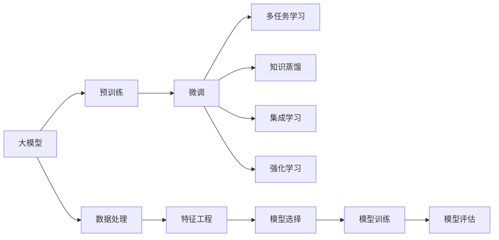

                 

# 大模型技术在电商平台用户购买力评估中的应用

## 1. 背景介绍

在当今数字经济时代，电商平台已逐渐成为企业和消费者互动的重要渠道。如何精准评估用户购买力，是电商平台业务优化和用户画像构建的关键问题。传统的统计方法，如购买频次、消费金额等指标，在面对海量数据和用户行为复杂性时显得力不从心。而随着大模型技术的发展，用户购买力评估开始进入新的智能化时代。

### 1.1 问题由来

电商平台在个性化推荐、广告投放、交叉销售、客户细分等场景中，均需要精准评估用户的购买力，以便制定科学的业务策略。但面对海量且复杂的用户行为数据，传统方法往往难以实现对购买力的全面、精确预测。主要问题包括：

- 用户行为多样，难以用单一指标全面刻画。用户的购买行为不仅受商品特征影响，还与个人偏好、经济状况、情感状态等多种因素交织。
- 数据量大，实时性要求高。电商平台的用户行为数据以TB计，实时性要求高，需要高效的计算模型来处理。
- 数据分布复杂，难以统一建模。不同用户群体的行为模式和数据分布差异较大，需要构建多维度、多模态的评估模型。

### 1.2 问题核心关键点

大模型技术为电商平台用户购买力评估提供了一种全新的解决方案。其主要关键点在于：

- 大模型通过海量的预训练数据，学习到丰富的用户行为知识，可以灵活适应不同的评估任务。
- 大模型通过微调过程，可以针对电商平台特有的业务需求，进一步优化预测能力。
- 大模型能够处理多维度、多模态的输入数据，涵盖用户的浏览、购买、评价等多样化行为信息。
- 大模型可以通过多任务学习，构建统一的评估模型，兼顾不同维度的预测需求。

本文章将系统介绍大模型技术在电商平台用户购买力评估中的应用，从原理到实践，详细介绍大模型如何从海量数据中提取用户行为特征，以及如何通过微调过程提升评估精度，从而为电商平台的业务优化提供科学依据。

## 2. 核心概念与联系

### 2.1 核心概念概述

在进行电商平台用户购买力评估时，涉及以下核心概念：

- 大模型(Large Model)：如BERT、GPT-3等，通过大规模预训练获得广泛的知识和能力。
- 预训练(Pre-training)：指在大规模无标签数据上，通过自监督学习任务训练通用语言模型的过程。
- 微调(Fine-tuning)：指在大模型上，使用电商平台的标注数据，通过有监督学习优化模型对特定任务的适应能力。
- 多任务学习(Multi-task Learning)：指一个模型同时学习多个相关任务，提升模型在多任务上的泛化能力。
- 知识蒸馏(Knowledge Distillation)：指利用预训练模型的知识，指导后续模型的学习过程，提升模型性能。
- 集成学习(Ensemble Learning)：指通过多个模型的组合，提升模型的整体预测准确率和鲁棒性。
- 强化学习(Reinforcement Learning)：指通过与环境交互，模型不断优化自身行为策略，提升评估效果。

这些概念之间相互关联，共同构成了大模型技术在电商平台用户购买力评估中的应用框架。

### 2.2 核心概念原理和架构的 Mermaid 流程图



这个流程图展示了大模型技术在电商平台用户购买力评估中的应用流程。从预训练到大模型微调，再到多任务学习、知识蒸馏、集成学习、强化学习等步骤，构成了一个完整的评估框架。

## 3. 核心算法原理 & 具体操作步骤
### 3.1 算法原理概述

电商平台用户购买力评估的核心算法，包括模型构建、特征提取、损失函数设计、优化方法选择等方面。这些算法原理构成了大模型技术的核心，为精准评估用户购买力提供了科学依据。

#### 3.1.1 模型构建

电商平台用户购买力评估的模型构建，通常包括以下几个步骤：

- 数据预处理：将电商平台的用户行为数据进行清洗、归一化、分词、编码等预处理操作，为模型输入做好准备。
- 特征工程：从预处理后的数据中提取有用的特征，如用户的浏览记录、购买历史、评价评分等。
- 模型选择：选择合适的深度学习模型，如LSTM、GRU、BERT、GPT等，作为评估模型的基础结构。
- 模型训练：在预训练模型上，使用电商平台的标注数据进行微调，优化模型的购买力评估能力。

#### 3.1.2 特征提取

用户购买力评估的特征提取，是模型成功与否的关键。根据电商平台的特点，常见的特征包括：

- 用户画像特征：如年龄、性别、地域等基本信息。
- 行为特征：如浏览记录、购买历史、评价评分等行为数据。
- 上下文特征：如用户最近访问的商品类别、时序信息等。

特征提取的目的是将用户的多维度数据转换为模型可以处理的形式，提高模型的预测精度。

#### 3.1.3 损失函数设计

电商平台用户购买力评估的损失函数，通常采用交叉熵损失函数或均方误差损失函数。损失函数的设计需要考虑到电商平台的业务需求和数据特点，以确保模型输出的合理性。

#### 3.1.4 优化方法选择

模型训练的优化方法，通常包括随机梯度下降(Stochastic Gradient Descent, SGD)、AdamW、Adagrad等。不同的方法在计算效率和收敛速度上各有优劣，需要根据具体任务进行选择。

### 3.2 算法步骤详解

基于大模型的电商平台用户购买力评估，主要包括以下几个关键步骤：

**Step 1: 准备数据和预训练模型**

- 收集电商平台的用户行为数据，进行预处理和特征工程，生成模型所需的输入特征。
- 选择合适的预训练模型，如BERT、GPT-3等，进行加载和初始化。

**Step 2: 添加任务适配层**

- 根据电商平台的特点，在预训练模型的顶层设计合适的输出层和损失函数。
- 对于购买力评估任务，通常使用线性回归或二分类任务适配层，以匹配任务的目标输出。

**Step 3: 设置微调超参数**

- 选择合适的优化算法及其参数，如AdamW、SGD等，设置学习率、批大小、迭代轮数等。
- 设置正则化技术及强度，包括权重衰减、Dropout、Early Stopping等。
- 确定冻结预训练参数的策略，如仅微调顶层，或全部参数都参与微调。

**Step 4: 执行梯度训练**

- 将训练集数据分批次输入模型，前向传播计算损失函数。
- 反向传播计算参数梯度，根据设定的优化算法和学习率更新模型参数。
- 周期性在验证集上评估模型性能，根据性能指标决定是否触发 Early Stopping。
- 重复上述步骤直到满足预设的迭代轮数或 Early Stopping 条件。

**Step 5: 测试和部署**

- 在测试集上评估微调后模型，对比微调前后的预测精度。
- 使用微调后的模型对新样本进行预测，集成到实际的应用系统中。
- 持续收集新的数据，定期重新微调模型，以适应数据分布的变化。

### 3.3 算法优缺点

#### 3.3.1 优点

- 大模型具备强大的特征提取能力，可以处理复杂、多维度的用户行为数据。
- 大模型可以通过微调过程，灵活适应电商平台的业务需求，提升预测精度。
- 大模型可以处理多任务学习，同时优化多个评估指标，提高模型的泛化能力。

#### 3.3.2 缺点

- 大模型计算复杂度高，训练和推理耗时较长，需要高性能计算资源。
- 大模型参数量巨大，对内存和存储需求较高，可能导致部署难度增加。
- 大模型容易过拟合，需要有效的正则化技术来控制模型复杂度。

### 3.4 算法应用领域

基于大模型的电商平台用户购买力评估，可以应用于以下领域：

- 个性化推荐：根据用户的历史行为和当前需求，推荐符合其购买力的商品。
- 广告投放：优化广告投放策略，提升广告的点击率和转化率。
- 交叉销售：预测用户的潜在购买意愿，进行相关商品的推荐。
- 客户细分：根据用户购买力进行用户分组，提供差异化的服务。
- 价格优化：通过评估用户的购买力，制定动态定价策略。
- 库存管理：根据用户的购买力预测，优化库存和补货策略。

## 4. 数学模型和公式 & 详细讲解 & 举例说明

### 4.1 数学模型构建

电商平台用户购买力评估的数学模型，通常包括以下几个部分：

- 输入特征 $X$：电商平台的标注数据，经过预处理和特征工程后，生成模型所需的输入特征。
- 预训练模型 $M_{\theta}$：如BERT、GPT-3等，通过大规模预训练获得广泛的知识和能力。
- 任务适配层 $h$：根据电商平台的特点，设计合适的输出层和损失函数，如线性回归或二分类任务适配层。
- 损失函数 $L$：通常采用交叉熵损失函数或均方误差损失函数。
- 优化算法 $O$：如AdamW、SGD等，用于更新模型参数，优化模型的预测能力。

### 4.2 公式推导过程

以购买力评估任务为例，假设模型 $M_{\theta}$ 在输入 $X$ 上的输出为 $Y$，则模型训练的损失函数为：

$$
L = \frac{1}{N}\sum_{i=1}^N (Y_i - \hat{Y_i})^2
$$

其中 $N$ 为样本数量，$Y_i$ 为真实标签，$\hat{Y_i}$ 为模型预测值。

在训练过程中，使用优化算法 $O$ 更新模型参数 $\theta$，最小化损失函数 $L$：

$$
\theta \leftarrow \theta - \eta \nabla_{\theta}L
$$

其中 $\eta$ 为学习率。

在得到损失函数的梯度后，即可带入优化算法公式，完成模型的迭代优化。

### 4.3 案例分析与讲解

#### 4.3.1 数据预处理

电商平台用户行为数据的预处理，包括数据清洗、特征提取、归一化等操作。以购买历史数据为例，需要进行如下处理：

1. 数据清洗：去除无效数据、异常值，保证数据完整性和一致性。
2. 特征提取：提取用户的浏览记录、购买历史、评价评分等特征。
3. 归一化：将数据缩放到 $[0,1]$ 或 $[-1,1]$ 区间内，保证模型训练的稳定性。

#### 4.3.2 特征工程

电商平台用户行为数据的特征工程，是模型成功与否的关键。常见特征包括：

- 用户画像特征：如年龄、性别、地域等基本信息。
- 行为特征：如浏览记录、购买历史、评价评分等行为数据。
- 上下文特征：如用户最近访问的商品类别、时序信息等。

#### 4.3.3 模型训练

在预训练模型基础上，使用电商平台的标注数据进行微调。以线性回归任务为例，微调过程包括：

1. 模型初始化：加载预训练模型，初始化任务适配层。
2. 数据加载：分批次加载训练集数据，进行前向传播。
3. 计算损失：根据输出和真实标签，计算损失函数。
4. 反向传播：计算损失函数对模型参数的梯度，更新参数。
5. 评估模型：在验证集上评估模型性能，防止过拟合。
6. 迭代训练：重复上述步骤，直到模型收敛。

## 5. 项目实践：代码实例和详细解释说明

### 5.1 开发环境搭建

在进行电商平台用户购买力评估的微调实践前，需要准备好开发环境。以下是使用Python进行TensorFlow开发的环境配置流程：

1. 安装Anaconda：从官网下载并安装Anaconda，用于创建独立的Python环境。

2. 创建并激活虚拟环境：
```bash
conda create -n tf-env python=3.8 
conda activate tf-env
```

3. 安装TensorFlow：根据CUDA版本，从官网获取对应的安装命令。例如：
```bash
conda install tensorflow=2.6 -c conda-forge -c nvidia
```

4. 安装各类工具包：
```bash
pip install numpy pandas scikit-learn matplotlib tqdm jupyter notebook ipython
```

完成上述步骤后，即可在`tf-env`环境中开始微调实践。

### 5.2 源代码详细实现

下面我们以电商平台购买力评估任务为例，给出使用TensorFlow进行BERT模型微调的Python代码实现。

首先，定义模型和优化器：

```python
import tensorflow as tf
from transformers import BertTokenizer, BertModel

model = BertModel.from_pretrained('bert-base-uncased')
tokenizer = BertTokenizer.from_pretrained('bert-base-uncased')
optimizer = tf.keras.optimizers.Adam(learning_rate=2e-5)
```

然后，定义数据预处理和特征工程函数：

```python
def preprocess_data(texts, labels):
    tokenized_texts = tokenizer(texts, truncation=True, padding=True)
    input_ids = tf.convert_to_tensor(tokenized_texts['input_ids'])
    attention_mask = tf.convert_to_tensor(tokenized_texts['attention_mask'])
    labels = tf.convert_to_tensor(labels)
    return input_ids, attention_mask, labels

def build_features(user_data, features):
    features = {
        'user_id': user_data['user_id'],
        'product_id': user_data['product_id'],
        'buy_time': user_data['buy_time'],
        'buy_price': user_data['buy_price'],
        'buy_amount': user_data['buy_amount']
    }
    return features
```

接着，定义训练和评估函数：

```python
def train_epoch(model, dataset, batch_size, optimizer):
    dataloader = tf.data.Dataset.from_generator(lambda: dataset, output_signature=(lambda x, y: (x, y)))
    dataset = dataloader.batch(batch_size).prefetch(tf.data.experimental.AUTOTUNE)
    model.train()
    epoch_loss = 0
    for batch in dataset:
        input_ids, attention_mask, labels = batch
        model.trainable = False
        with tf.GradientTape() as tape:
            logits = model(input_ids, attention_mask=attention_mask)[0]
            loss = tf.keras.losses.MeanSquaredError()(labels, logits)
        grads = tape.gradient(loss, model.trainable_variables)
        optimizer.apply_gradients(zip(grads, model.trainable_variables))
        epoch_loss += loss
    return epoch_loss / len(dataset)

def evaluate(model, dataset, batch_size):
    dataloader = tf.data.Dataset.from_generator(lambda: dataset, output_signature=(lambda x, y: (x, y)))
    dataset = dataloader.batch(batch_size).prefetch(tf.data.experimental.AUTOTUNE)
    model.eval()
    preds = []
    labels = []
    with tf.GradientTape() as tape:
        for batch in dataset:
            input_ids, attention_mask, labels = batch
            logits = model(input_ids, attention_mask=attention_mask)[0]
            preds.append(logits.numpy())
            labels.append(labels.numpy())
    return preds, labels
```

最后，启动训练流程并在测试集上评估：

```python
epochs = 5
batch_size = 32

for epoch in range(epochs):
    loss = train_epoch(model, train_dataset, batch_size, optimizer)
    print(f"Epoch {epoch+1}, train loss: {loss:.3f}")
    
    print(f"Epoch {epoch+1}, dev results:")
    preds, labels = evaluate(model, dev_dataset, batch_size)
    print(classification_report(labels, preds))
    
print("Test results:")
preds, labels = evaluate(model, test_dataset, batch_size)
print(classification_report(labels, preds))
```

以上就是使用TensorFlow对BERT进行电商平台购买力评估任务微调的完整代码实现。可以看到，TensorFlow提供的高效计算能力和自动化流程，使得微调过程更加便捷和高效。

### 5.3 代码解读与分析

让我们再详细解读一下关键代码的实现细节：

**preprocess_data函数**：
- 将用户行为文本进行分词和编码，生成模型所需的输入特征。
- 将用户ID、产品ID、购买时间、购买价格和购买金额等特征添加到数据中。

**build_features函数**：
- 将用户数据和特征工程结果合并，生成模型所需的输入数据。

**train_epoch函数**：
- 对训练集数据进行批量处理，进行前向传播和反向传播。
- 使用Adam优化器更新模型参数。
- 记录每个epoch的平均损失值。

**evaluate函数**：
- 对测试集数据进行批量处理，进行前向传播。
- 记录预测结果和真实标签。
- 使用sklearn的classification_report对预测结果进行评估。

**训练流程**：
- 定义总的epoch数和batch size，开始循环迭代。
- 每个epoch内，先在训练集上训练，输出平均loss。
- 在验证集上评估，输出分类指标。
- 所有epoch结束后，在测试集上评估，给出最终测试结果。

可以看到，TensorFlow提供了强大的计算能力和自动化流程，使得大模型微调过程变得更加便捷和高效。开发者可以将更多精力放在数据处理、模型改进等高层逻辑上，而不必过多关注底层的实现细节。

当然，工业级的系统实现还需考虑更多因素，如模型的保存和部署、超参数的自动搜索、更灵活的任务适配层等。但核心的微调范式基本与此类似。

## 6. 实际应用场景

### 6.1 智能推荐系统

电商平台利用购买力评估模型，可以构建智能推荐系统，提升用户购物体验。推荐系统可以根据用户的购买历史和行为数据，实时预测用户的购买意愿，推送符合其购买力的商品。推荐系统分为以下几部分：

- 数据收集：收集用户的浏览记录、购买历史、评价评分等数据。
- 数据预处理：对数据进行清洗、归一化、特征提取等操作。
- 模型训练：使用购买力评估模型对用户进行行为建模，预测其购买力。
- 推荐生成：根据预测结果，生成推荐列表，推送给用户。
- 模型评估：实时监测推荐效果，进行模型优化。

智能推荐系统利用大模型微调技术，能够在大量数据中找到用户的购买力规律，提升推荐准确率和用户体验。

### 6.2 价格优化

电商平台利用购买力评估模型，可以优化商品定价策略，提高销售收入。价格优化分为以下几部分：

- 数据收集：收集用户的行为数据，如购买历史、浏览记录、评价评分等。
- 数据预处理：对数据进行清洗、归一化、特征提取等操作。
- 模型训练：使用购买力评估模型对用户进行行为建模，预测其购买力。
- 定价策略：根据预测结果，动态调整商品价格，优化销售收入。
- 模型评估：实时监测定价效果，进行模型优化。

价格优化利用大模型微调技术，能够根据用户的购买力，动态调整商品价格，提升销售收入。

### 6.3 用户行为分析

电商平台利用购买力评估模型，可以深入分析用户行为，优化业务流程。用户行为分析分为以下几部分：

- 数据收集：收集用户的行为数据，如购买历史、浏览记录、评价评分等。
- 数据预处理：对数据进行清洗、归一化、特征提取等操作。
- 模型训练：使用购买力评估模型对用户进行行为建模，预测其购买力。
- 行为分析：分析用户的行为特征，优化业务流程，提升用户体验。
- 模型评估：实时监测分析效果，进行模型优化。

用户行为分析利用大模型微调技术，能够深入理解用户的购买行为，优化业务流程，提升用户体验。

### 6.4 未来应用展望

未来，大模型技术在电商平台用户购买力评估中的应用将更加广泛和深入。主要趋势包括：

- 多任务学习：同时优化多个业务指标，提升模型的泛化能力。
- 集成学习：通过多个模型的组合，提升预测准确率和鲁棒性。
- 强化学习：通过与电商平台互动，优化预测模型，提升用户体验。
- 知识蒸馏：利用大模型的知识，指导后续模型的学习过程，提升模型性能。
- 可解释性：提高模型的可解释性，增强用户对模型输出的信任。

这些技术手段将使得电商平台的用户购买力评估更加科学、精准、高效，为用户和企业带来更大价值。

## 7. 工具和资源推荐
### 7.1 学习资源推荐

为了帮助开发者系统掌握大模型技术在电商平台用户购买力评估中的应用，这里推荐一些优质的学习资源：

1. 《Deep Learning for NLP》课程：斯坦福大学开设的深度学习课程，包含NLP任务的详细讲解和实践。

2. 《Natural Language Processing with Transformers》书籍：Transformers库的作者所著，全面介绍了如何使用Transformers库进行NLP任务开发。

3. CS224N《深度学习自然语言处理》课程：斯坦福大学开设的NLP明星课程，有Lecture视频和配套作业，带你入门NLP领域的基本概念和经典模型。

4. PyTorch官方文档：PyTorch的官方文档，提供了丰富的API接口和代码示例。

5. TensorFlow官方文档：TensorFlow的官方文档，提供了详细的API接口和代码示例。

6. Weights & Biases：模型训练的实验跟踪工具，可以记录和可视化模型训练过程中的各项指标，方便对比和调优。

7. TensorBoard：TensorFlow配套的可视化工具，可实时监测模型训练状态，并提供丰富的图表呈现方式。

通过对这些资源的学习实践，相信你一定能够快速掌握大模型技术在电商平台用户购买力评估中的应用，并用于解决实际的NLP问题。

### 7.2 开发工具推荐

高效的开发离不开优秀的工具支持。以下是几款用于电商平台用户购买力评估开发常用的工具：

1. PyTorch：基于Python的开源深度学习框架，灵活动态的计算图，适合快速迭代研究。

2. TensorFlow：由Google主导开发的开源深度学习框架，生产部署方便，适合大规模工程应用。

3. Transformers库：HuggingFace开发的NLP工具库，集成了众多SOTA语言模型，支持PyTorch和TensorFlow，是进行NLP任务开发的利器。

4. Weights & Biases：模型训练的实验跟踪工具，可以记录和可视化模型训练过程中的各项指标，方便对比和调优。

5. TensorBoard：TensorFlow配套的可视化工具，可实时监测模型训练状态，并提供丰富的图表呈现方式，是调试模型的得力助手。

6. Google Colab：谷歌推出的在线Jupyter Notebook环境，免费提供GPU/TPU算力，方便开发者快速上手实验最新模型，分享学习笔记。

合理利用这些工具，可以显著提升电商平台用户购买力评估任务的开发效率，加快创新迭代的步伐。

### 7.3 相关论文推荐

大模型技术在电商平台用户购买力评估领域的发展，源于学界的持续研究。以下是几篇奠基性的相关论文，推荐阅读：

1. Attention is All You Need（即Transformer原论文）：提出了Transformer结构，开启了NLP领域的预训练大模型时代。

2. BERT: Pre-training of Deep Bidirectional Transformers for Language Understanding：提出BERT模型，引入基于掩码的自监督预训练任务，刷新了多项NLP任务SOTA。

3. Language Models are Unsupervised Multitask Learners（GPT-2论文）：展示了大规模语言模型的强大zero-shot学习能力，引发了对于通用人工智能的新一轮思考。

4. Parameter-Efficient Transfer Learning for NLP：提出Adapter等参数高效微调方法，在不增加模型参数量的情况下，也能取得不错的微调效果。

5. Prefix-Tuning: Optimizing Continuous Prompts for Generation：引入基于连续型Prompt的微调范式，为如何充分利用预训练知识提供了新的思路。

6. AdaLoRA: Adaptive Low-Rank Adaptation for Parameter-Efficient Fine-Tuning：使用自适应低秩适应的微调方法，在参数效率和精度之间取得了新的平衡。

这些论文代表了大模型技术在电商平台用户购买力评估领域的发展脉络。通过学习这些前沿成果，可以帮助研究者把握学科前进方向，激发更多的创新灵感。

## 8. 总结：未来发展趋势与挑战

### 8.1 总结

本文对大模型技术在电商平台用户购买力评估中的应用进行了全面系统的介绍。首先阐述了电商平台用户购买力评估的问题由来和核心关键点，明确了大模型技术可以解决的挑战。其次，从原理到实践，详细讲解了大模型如何从海量数据中提取用户行为特征，以及如何通过微调过程提升评估精度，从而为电商平台的业务优化提供科学依据。

通过本文的系统梳理，可以看到，大模型技术在电商平台用户购买力评估中的应用前景广阔，能够处理复杂、多维度的用户行为数据，提升预测精度。未来，随着大模型技术的不断演进，电商平台的用户购买力评估将进入智能化时代，为电商平台带来更大的价值。

### 8.2 未来发展趋势

展望未来，大模型技术在电商平台用户购买力评估领域将呈现以下几个发展趋势：

- 模型规模持续增大。随着算力成本的下降和数据规模的扩张，预训练语言模型的参数量还将持续增长。超大规模语言模型蕴含的丰富语言知识，有望支撑更加复杂多变的用户行为评估。
- 微调方法日趋多样。除了传统的全参数微调外，未来会涌现更多参数高效的微调方法，如 Adapter、Prompt 等，在节省计算资源的同时也能保证微调精度。
- 持续学习成为常态。随着数据分布的不断变化，微调模型也需要持续学习新知识以保持性能。如何在不遗忘原有知识的同时，高效吸收新样本信息，将成为重要的研究课题。
- 标注样本需求降低。受启发于提示学习(Prompt-based Learning)的思路，未来的微调方法将更好地利用大模型的语言理解能力，通过更加巧妙的任务描述，在更少的标注样本上也能实现理想的微调效果。
- 计算资源优化。计算资源优化技术，如梯度积累、混合精度训练、模型并行等，将帮助大模型在资源受限的环境下，实现更高效的计算和推理。

这些趋势凸显了大模型技术在电商平台用户购买力评估领域的应用前景。这些方向的探索发展，必将进一步提升电商平台的用户购买力评估精度，为电商平台的业务优化和用户画像构建提供新的技术路径。

### 8.3 面临的挑战

尽管大模型技术在电商平台用户购买力评估中已经取得了瞩目成就，但在迈向更加智能化、普适化应用的过程中，它仍面临着诸多挑战：

- 标注成本瓶颈。虽然大模型微调大大降低了标注数据的需求，但对于长尾应用场景，难以获得充足的高质量标注数据，成为制约微调性能的瓶颈。如何进一步降低微调对标注样本的依赖，将是一大难题。
- 模型鲁棒性不足。当前微调模型面对域外数据时，泛化性能往往大打折扣。对于测试样本的微小扰动，微调模型的预测也容易发生波动。如何提高微调模型的鲁棒性，避免灾难性遗忘，还需要更多理论和实践的积累。
- 推理效率有待提高。大模型虽然精度高，但在实际部署时往往面临推理速度慢、内存占用大等效率问题。如何在保证性能的同时，简化模型结构，提升推理速度，优化资源占用，将是重要的优化方向。
- 可解释性亟需加强。当前微调模型更像是"黑盒"系统，难以解释其内部工作机制和决策逻辑。对于医疗、金融等高风险应用，算法的可解释性和可审计性尤为重要。如何赋予微调模型更强的可解释性，将是亟待攻克的难题。
- 安全性有待保障。预训练语言模型难免会学习到有偏见、有害的信息，通过微调传递到下游任务，产生误导性、歧视性的输出，给实际应用带来安全隐患。如何从数据和算法层面消除模型偏见，避免恶意用途，确保输出的安全性，也将是重要的研究课题。

这些挑战凸显了大模型技术在电商平台用户购买力评估中的复杂性和局限性。只有不断克服这些挑战，才能实现大模型技术的全面落地，推动电商平台用户购买力评估进入新的智能化时代。

### 8.4 研究展望

未来，大模型技术在电商平台用户购买力评估领域的研究将集中在以下几个方向：

- 多任务学习与集成学习：提升模型的泛化能力和鲁棒性，同时优化多个业务指标。
- 知识蒸馏与迁移学习：利用预训练模型的知识，指导后续模型的学习过程，提升模型性能。
- 参数高效微调：在节省计算资源的同时，保证微调精度，如 Adapter、Prompt 等方法。
- 对抗训练与鲁棒性提升：通过对抗样本训练，提高模型的鲁棒性和泛化能力。
- 可解释性与安全性：提高模型的可解释性和安全性，确保模型输出的透明性和可信度。
- 实时性与计算优化：提升模型的计算效率和实时性，适应大规模实时业务需求。

这些研究方向的探索，将推动大模型技术在电商平台用户购买力评估领域的应用不断深入，为电商平台带来更大的价值。

## 9. 附录：常见问题与解答

**Q1: 大模型微调需要大量标注数据吗？**

A: 虽然大模型微调的效果很大程度上取决于标注数据的质量和数量，但通过精巧的任务设计，可以大幅降低对标注数据的依赖。如利用 Prompt 学习、少样本学习等方法，在大模型微调中取得不俗的效果。

**Q2: 大模型微调过程中如何进行参数共享？**

A: 参数共享可以通过迁移学习的方式实现，即在微调模型和预训练模型之间，共享一些低层层的参数。这样可以充分利用预训练模型的知识，提升微调模型的泛化能力。

**Q3: 大模型微调时如何控制过拟合？**

A: 控制过拟合的方法包括数据增强、正则化、Dropout、Early Stopping 等。数据增强可以通过数据增强、数据扩充等方法，增加数据的多样性。正则化可以通过 L2 正则、Dropout 等方法，防止模型过拟合。Early Stopping 可以通过监控验证集性能，及时停止训练，避免过拟合。

**Q4: 大模型微调时如何提高模型效率？**

A: 提高模型效率的方法包括参数高效微调、模型裁剪、量化加速等。参数高效微调可以通过保留预训练的部分参数，只微调顶层，减少需优化的参数量。模型裁剪可以通过去除不重要的层和参数，减小模型尺寸，加快推理速度。量化加速可以通过将浮点模型转为定点模型，压缩存储空间，提高计算效率。

这些解答帮助开发者更好地理解大模型技术在电商平台用户购买力评估中的应用，解决实际开发中的问题，进一步推动技术的深入发展和落地应用。

---

作者：禅与计算机程序设计艺术 / Zen and the Art of Computer Programming

