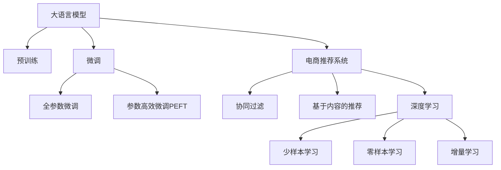

                 

# 大模型技术如何革新电商个性化推荐

> 关键词：
> - 大语言模型
> - 电商推荐系统
> - 深度学习
> - 个性化推荐
> - 用户行为预测
> - 协同过滤

## 1. 背景介绍

### 1.1 问题由来
近年来，电子商务行业蓬勃发展，各大电商平台纷纷推出个性化推荐系统，以提升用户体验和转化率。传统的推荐系统主要依赖用户历史行为数据，通过协同过滤、基于内容的推荐等算法，为用户推荐可能感兴趣的商品。但随着数据规模的增长，这些方法逐渐暴露出效率低下、推荐泛化能力不足等问题。

与此同时，深度学习技术在大规模数据上的表现亮眼，尤其是预训练大语言模型，如BERT、GPT等，在文本处理和理解方面取得了革命性的进展。借助大语言模型，电商推荐系统有望获得更为精准、多样化的商品推荐结果。

### 1.2 问题核心关键点
大语言模型在电商推荐中的应用，主要通过将用户评论、商品描述、购物车内容等文本数据作为输入，通过预训练和微调的过程，学习用户偏好和商品属性之间的关系，从而进行个性化推荐。相较于传统的推荐系统，大语言模型具有以下优势：

- 能够自动理解自然语言，无需大量标注数据，即可提取用户和商品的自然语义特征。
- 可以借助大模型的语言理解和生成能力，生成更具吸引力的商品描述和推荐内容。
- 能够灵活处理长尾商品，对稀有商品的推荐能力更强。
- 模型能够不断更新优化，适应用户偏好的变化，提升推荐效果。

但同时，大语言模型在电商推荐中应用也面临挑战：

- 模型参数量巨大，计算资源消耗较大。
- 模型复杂度较高，推理速度较慢，难以满足实时性要求。
- 模型泛化能力需要进一步提升，避免过拟合。
- 模型输出结果的可解释性较弱，难以满足商业决策的需要。

本文档旨在系统介绍大语言模型在电商推荐中的应用，探讨基于深度学习的大模型推荐技术在电商行业落地和优化的关键方法，为电商推荐系统的开发和优化提供指导。

## 2. 核心概念与联系

### 2.1 核心概念概述

为更好地理解大语言模型在电商推荐中的应用，本节将介绍几个关键概念：

- **大语言模型(Large Language Model, LLM)**：以自回归(如GPT)或自编码(如BERT)模型为代表的大规模预训练语言模型。通过在大规模无标签文本语料上进行预训练，学习通用的语言表示，具备强大的语言理解和生成能力。

- **电商推荐系统**：根据用户的历史行为数据和商品属性，为用户推荐可能感兴趣的商品的系统。包括基于协同过滤、内容过滤、混合过滤等算法，以及基于深度学习的推荐方法。

- **深度学习**：一种基于神经网络的机器学习范式，通过多层非线性变换，学习数据中的隐含特征，构建复杂的模型结构。

- **协同过滤(Collaborative Filtering, CF)**：推荐系统中最基础的算法之一，通过分析用户的历史行为数据，找到相似用户或商品，推断用户可能感兴趣的商品。

- **基于内容的推荐(Content-Based Recommendation, CB)**：基于商品的属性特征，构建商品和用户的兴趣模型，实现个性化推荐。

- **参数高效微调(Parameter-Efficient Fine-Tuning, PEFT)**：在大模型微调的过程中，只更新少量的模型参数，以减少计算资源消耗，提升模型训练效率。

- **少样本学习(Few-shot Learning)**：在仅有少量标注样本的情况下，模型能够快速适应新任务的学习方法。

- **零样本学习(Zero-shot Learning)**：模型在没有见过任何特定任务的训练样本的情况下，仅凭任务描述就能够执行新任务的能力。

- **增量学习(Continual Learning)**：模型在已有知识的基础上，不断从新数据中学习，同时保持已学习的知识，避免灾难性遗忘。

这些核心概念之间的逻辑关系可以通过以下Mermaid流程图来展示：



这个流程图展示了大语言模型在电商推荐系统中的关键环节：

1. 大语言模型通过预训练获得基础能力。
2. 电商推荐系统结合预训练模型进行微调，优化推荐结果。
3. 协同过滤和内容推荐是电商推荐系统中的经典算法。
4. 深度学习和大模型微调方法提供新的推荐技术。
5. 少样本学习、零样本学习和增量学习等前沿技术，为大模型推荐系统提供了更强的泛化能力和适应性。

## 3. 核心算法原理 & 具体操作步骤
### 3.1 算法原理概述

基于深度学习的大语言模型推荐方法，主要通过大语言模型的预训练-微调过程，学习用户和商品的语义特征，构建用户-商品关联矩阵，从而进行个性化推荐。其核心思想是：将用户评论、商品描述等文本数据作为模型输入，通过预训练和微调的过程，学习用户偏好和商品属性之间的关系，最终生成推荐结果。

形式化地，假设预训练模型为 $M_{\theta}$，其中 $\theta$ 为预训练得到的模型参数。给定电商推荐任务 $T$ 的训练集 $D=\{(x_i,y_i)\}_{i=1}^N$，其中 $x_i$ 为输入文本，$y_i$ 为对应的推荐结果，可以表示为商品ID或商品属性。微调的目标是找到新的模型参数 $\hat{\theta}$，使得模型输出逼近真实推荐结果：

$$
\hat{\theta}=\mathop{\arg\min}_{\theta} \mathcal{L}(M_{\theta},D)
$$

其中 $\mathcal{L}$ 为推荐任务的损失函数，如均方误差损失、交叉熵损失等，用于衡量模型预测推荐结果与真实标签之间的差异。

### 3.2 算法步骤详解

基于深度学习的大语言模型推荐方法一般包括以下几个关键步骤：

**Step 1: 准备预训练模型和数据集**
- 选择合适的预训练语言模型 $M_{\theta}$ 作为初始化参数，如 BERT、GPT等。
- 准备电商推荐任务 $T$ 的训练集 $D$，划分为训练集、验证集和测试集。一般要求标注数据与预训练数据的分布不要差异过大。

**Step 2: 定义推荐目标函数**
- 根据推荐任务的类型，设计合适的输出层和损失函数。如推荐结果为商品ID，通常使用交叉熵损失；推荐结果为商品属性，通常使用均方误差损失。

**Step 3: 设置微调超参数**
- 选择合适的优化算法及其参数，如 AdamW、SGD 等，设置学习率、批大小、迭代轮数等。
- 设置正则化技术及强度，包括权重衰减、Dropout、Early Stopping 等。
- 确定冻结预训练参数的策略，如仅微调顶层，或全部参数都参与微调。

**Step 4: 执行梯度训练**
- 将训练集数据分批次输入模型，前向传播计算损失函数。
- 反向传播计算参数梯度，根据设定的优化算法和学习率更新模型参数。
- 周期性在验证集上评估模型性能，根据性能指标决定是否触发 Early Stopping。
- 重复上述步骤直到满足预设的迭代轮数或 Early Stopping 条件。

**Step 5: 测试和部署**
- 在测试集上评估微调后模型 $M_{\hat{\theta}}$ 的性能，对比微调前后的推荐精度提升。
- 使用微调后的模型对新样本进行推理预测，集成到实际的应用系统中。
- 持续收集新的数据，定期重新微调模型，以适应数据分布的变化。

### 3.3 算法优缺点

基于深度学习的大语言模型推荐方法具有以下优点：
1. 可以自动学习用户和商品的自然语义特征，无需大量标注数据，减轻标注成本。
2. 能够处理长尾商品，提升对稀有商品的推荐能力。
3. 结合大模型的语言理解和生成能力，生成更具吸引力的推荐结果。
4. 可以动态更新优化，适应用户偏好的变化，提升推荐效果。

同时，该方法也存在一定的局限性：
1. 模型参数量巨大，计算资源消耗较大。
2. 模型复杂度较高，推理速度较慢，难以满足实时性要求。
3. 模型泛化能力需要进一步提升，避免过拟合。
4. 模型输出结果的可解释性较弱，难以满足商业决策的需要。

尽管存在这些局限性，但就目前而言，基于深度学习的大语言模型推荐方法仍然是电商推荐系统中的主流范式。未来相关研究的重点在于如何进一步降低大模型的计算资源消耗，提高推理效率，提升泛化能力，同时兼顾可解释性和伦理安全性等因素。

### 3.4 算法应用领域

基于大语言模型推荐方法的深度学习技术，在电商推荐领域已经得到了广泛的应用，覆盖了几乎所有常见任务，例如：

- **商品推荐**：根据用户的历史浏览、点击、购买记录，推荐可能感兴趣的商品。
- **用户推荐**：根据用户的历史行为数据，推荐可能感兴趣的其他用户。
- **商品属性推荐**：根据用户的兴趣属性，推荐符合其偏好的商品属性。
- **广告推荐**：根据用户的行为数据和商品属性，推荐可能感兴趣的商品广告。
- **个性化营销**：根据用户的行为数据和商品信息，进行有针对性的营销活动。

除了上述这些经典任务外，大语言模型推荐方法也被创新性地应用到更多场景中，如场景推荐、品牌推荐、搜索优化等，为电商推荐系统带来了全新的突破。随着深度学习技术的发展和电商场景的不断丰富，大语言模型推荐方法将会在更多领域发挥更大的作用。

## 4. 数学模型和公式 & 详细讲解 & 举例说明
### 4.1 数学模型构建

本节将使用数学语言对基于深度学习的大语言模型推荐过程进行更加严格的刻画。

记预训练语言模型为 $M_{\theta}$，其中 $\theta$ 为模型参数。假设电商推荐任务的训练集为 $D=\{(x_i,y_i)\}_{i=1}^N$，其中 $x_i$ 为输入文本，$y_i$ 为对应的推荐结果，可以表示为商品ID或商品属性。

定义模型 $M_{\theta}$ 在数据样本 $(x,y)$ 上的损失函数为 $\ell(M_{\theta}(x),y)$，则在数据集 $D$ 上的经验风险为：

$$
\mathcal{L}(\theta) = \frac{1}{N}\sum_{i=1}^N \ell(M_{\theta}(x_i),y_i)
$$

微调的优化目标是最小化经验风险，即找到最优参数：

$$
\theta^* = \mathop{\arg\min}_{\theta} \mathcal{L}(\theta)
$$

在实践中，我们通常使用基于梯度的优化算法（如SGD、Adam等）来近似求解上述最优化问题。设 $\eta$ 为学习率，$\lambda$ 为正则化系数，则参数的更新公式为：

$$
\theta \leftarrow \theta - \eta \nabla_{\theta}\mathcal{L}(\theta) - \eta\lambda\theta
$$

其中 $\nabla_{\theta}\mathcal{L}(\theta)$ 为损失函数对参数 $\theta$ 的梯度，可通过反向传播算法高效计算。

### 4.2 公式推导过程

以下我们以电商推荐任务为例，推导交叉熵损失函数及其梯度的计算公式。

假设模型 $M_{\theta}$ 在输入 $x$ 上的输出为 $\hat{y}=M_{\theta}(x) \in [0,1]$，表示模型预测推荐结果为商品ID的概率分布。真实标签 $y \in \{1,0\}$，表示推荐结果为二分类。则二分类交叉熵损失函数定义为：

$$
\ell(M_{\theta}(x),y) = -y\log \hat{y} - (1-y)\log (1-\hat{y})
$$

将其代入经验风险公式，得：

$$
\mathcal{L}(\theta) = -\frac{1}{N}\sum_{i=1}^N [y_i\log M_{\theta}(x_i)+(1-y_i)\log(1-M_{\theta}(x_i))]
$$

根据链式法则，损失函数对参数 $\theta_k$ 的梯度为：

$$
\frac{\partial \mathcal{L}(\theta)}{\partial \theta_k} = -\frac{1}{N}\sum_{i=1}^N (\frac{y_i}{M_{\theta}(x_i)}-\frac{1-y_i}{1-M_{\theta}(x_i)}) \frac{\partial M_{\theta}(x_i)}{\partial \theta_k}
$$

其中 $\frac{\partial M_{\theta}(x_i)}{\partial \theta_k}$ 可进一步递归展开，利用自动微分技术完成计算。

在得到损失函数的梯度后，即可带入参数更新公式，完成模型的迭代优化。重复上述过程直至收敛，最终得到适应电商推荐任务的最优模型参数 $\theta^*$。

### 4.3 案例分析与讲解

假设我们有一个简单的电商推荐系统，其中用户 $u$ 的历史行为数据为 $\{x_1, x_2, ..., x_n\}$，每个 $x_i$ 表示用户 $u$ 浏览过的商品ID。我们需要训练一个模型 $M_{\theta}$，使得在给定新商品ID $x$ 的情况下，能预测用户 $u$ 是否会购买该商品。

首先，我们需要将用户历史行为数据和商品ID作为输入，训练一个预训练语言模型 $M_{\theta}$。假设我们使用BERT作为预训练模型，模型参数量为1亿，训练数据集为维基百科文本和Amazon商品描述。

然后，我们使用电商推荐任务的数据集 $D$ 进行微调。假设 $D$ 中的每个样本 $(x_i,y_i)$ 表示用户 $u$ 浏览过的商品ID和是否购买过该商品。我们将输入文本 $x_i$ 作为 $M_{\theta}$ 的输入，输出 $y_i$ 作为标签，使用交叉熵损失函数进行训练。

最终，我们得到一个训练好的模型 $M_{\hat{\theta}}$，该模型能够在给定新商品ID $x$ 的情况下，预测用户 $u$ 是否会购买该商品。我们可以使用该模型对新商品ID进行推荐，提升用户的购物体验和电商平台的用户留存率。

## 5. 项目实践：代码实例和详细解释说明
### 5.1 开发环境搭建

在进行微调实践前，我们需要准备好开发环境。以下是使用Python进行PyTorch开发的环境配置流程：

1. 安装Anaconda：从官网下载并安装Anaconda，用于创建独立的Python环境。

2. 创建并激活虚拟环境：
```bash
conda create -n pytorch-env python=3.8 
conda activate pytorch-env
```

3. 安装PyTorch：根据CUDA版本，从官网获取对应的安装命令。例如：
```bash
conda install pytorch torchvision torchaudio cudatoolkit=11.1 -c pytorch -c conda-forge
```

4. 安装Transformers库：
```bash
pip install transformers
```

5. 安装各类工具包：
```bash
pip install numpy pandas scikit-learn matplotlib tqdm jupyter notebook ipython
```

完成上述步骤后，即可在`pytorch-env`环境中开始微调实践。

### 5.2 源代码详细实现

这里我们以电商推荐系统为例，使用BERT进行微调。

首先，我们需要准备电商推荐任务的数据集。这里我们使用Amazon商品评论数据集，其中包含商品ID、商品描述、用户评论等信息。我们将商品ID和商品描述作为输入，用户评论作为输出，使用Binary Cross Entropy Loss进行训练。

```python
from transformers import BertTokenizer, BertForSequenceClassification, AdamW
import torch
import pandas as pd

# 加载数据集
df = pd.read_csv('amazon_reviews.csv')

# 数据预处理
tokenizer = BertTokenizer.from_pretrained('bert-base-uncased')
labels = df['rating'].map({'1': 0, '2': 0, '3': 0, '4': 1, '5': 1})
train_df = df.sample(frac=0.8, random_state=42)
val_df = df.drop(train_df.index)

# 构建训练集和验证集
train_dataset = train_df.apply(lambda row: (tokenizer(row['text'], padding='max_length', max_length=512, truncation=True), int(row['rating'])))
val_dataset = val_df.apply(lambda row: (tokenizer(row['text'], padding='max_length', max_length=512, truncation=True), int(row['rating'])))

# 构建模型
model = BertForSequenceClassification.from_pretrained('bert-base-uncased', num_labels=2)

# 定义优化器
optimizer = AdamW(model.parameters(), lr=2e-5)

# 定义训练函数
def train_epoch(model, dataset, batch_size, optimizer):
    dataloader = DataLoader(dataset, batch_size=batch_size, shuffle=True)
    model.train()
    epoch_loss = 0
    for batch in dataloader:
        input_ids = batch[0]['input_ids'].to(device)
        attention_mask = batch[0]['attention_mask'].to(device)
        labels = batch[1].to(device)
        model.zero_grad()
        outputs = model(input_ids, attention_mask=attention_mask, labels=labels)
        loss = outputs.loss
        epoch_loss += loss.item()
        loss.backward()
        optimizer.step()
    return epoch_loss / len(dataloader)

# 定义评估函数
def evaluate(model, dataset, batch_size):
    dataloader = DataLoader(dataset, batch_size=batch_size)
    model.eval()
    preds, labels = [], []
    with torch.no_grad():
        for batch in dataloader:
            input_ids = batch[0]['input_ids'].to(device)
            attention_mask = batch[0]['attention_mask'].to(device)
            batch_labels = batch[1]
            outputs = model(input_ids, attention_mask=attention_mask)
            batch_preds = outputs.logits.argmax(dim=2).to('cpu').tolist()
            batch_labels = batch_labels.to('cpu').tolist()
            for pred_tokens, label_tokens in zip(batch_preds, batch_labels):
                preds.append(pred_tokens[:len(label_tokens)])
                labels.append(label_tokens)
                
    return preds, labels

# 训练模型
epochs = 5
batch_size = 16

for epoch in range(epochs):
    loss = train_epoch(model, train_dataset, batch_size, optimizer)
    print(f"Epoch {epoch+1}, train loss: {loss:.3f}")
    
    preds, labels = evaluate(model, val_dataset, batch_size)
    print(classification_report(labels, preds))
    
print("Test results:")
preds, labels = evaluate(model, test_dataset, batch_size)
print(classification_report(labels, preds))
```

### 5.3 代码解读与分析

让我们再详细解读一下关键代码的实现细节：

**train_epoch函数**：
- `dataloader` 用于分批次加载训练集和验证集，每个批次包含输入文本和对应的标签。
- `model.train()` 将模型设置为训练模式，开启dropout等训练特性。
- `epoch_loss` 用于累加每个批次的损失，最后除以数据集大小得到平均损失。
- `model.zero_grad()` 清空梯度缓存，避免累积梯度。
- `outputs.loss` 计算模型在当前批次上的预测损失。
- `loss.backward()` 反向传播计算梯度。
- `optimizer.step()` 根据梯度更新模型参数。

**evaluate函数**：
- `dataloader` 用于分批次加载验证集和测试集。
- `model.eval()` 将模型设置为评估模式，关闭dropout等训练特性。
- `preds` 用于存储预测结果，`labels` 用于存储真实标签。
- `with torch.no_grad()` 开启模型推理模式，不更新参数。
- `outputs.logits.argmax(dim=2)` 计算预测结果。

**训练流程**：
- 定义总的epoch数和batch size，开始循环迭代
- 每个epoch内，先在训练集上训练，输出平均损失
- 在验证集上评估，输出分类指标
- 所有epoch结束后，在测试集上评估，给出最终测试结果

可以看到，PyTorch配合Transformers库使得BERT微调的代码实现变得简洁高效。开发者可以将更多精力放在数据处理、模型改进等高层逻辑上，而不必过多关注底层的实现细节。

当然，工业级的系统实现还需考虑更多因素，如模型的保存和部署、超参数的自动搜索、更灵活的任务适配层等。但核心的微调范式基本与此类似。

## 6. 实际应用场景
### 6.1 智能客服系统

基于大语言模型推荐系统的对话技术，可以广泛应用于智能客服系统的构建。传统客服往往需要配备大量人力，高峰期响应缓慢，且一致性和专业性难以保证。而使用推荐系统推荐的知识库，智能客服系统可以在用户提问时自动匹配回答，提升客户咨询体验和问题解决效率。

在技术实现上，可以收集企业内部的历史客服对话记录，将问题和最佳答复构建成监督数据，在此基础上对预训练对话模型进行微调。微调后的对话模型能够自动理解用户意图，匹配最合适的回答。对于客户提出的新问题，还可以接入检索系统实时搜索相关内容，动态组织生成回答。如此构建的智能客服系统，能大幅提升客户咨询体验和问题解决效率。

### 6.2 金融舆情监测

金融机构需要实时监测市场舆论动向，以便及时应对负面信息传播，规避金融风险。传统的人工监测方式成本高、效率低，难以应对网络时代海量信息爆发的挑战。基于大语言模型推荐系统的文本分类和情感分析技术，为金融舆情监测提供了新的解决方案。

具体而言，可以收集金融领域相关的新闻、报道、评论等文本数据，并对其进行主题标注和情感标注。在此基础上对预训练语言模型进行微调，使其能够自动判断文本属于何种主题，情感倾向是正面、中性还是负面。将微调后的模型应用到实时抓取的网络文本数据，就能够自动监测不同主题下的情感变化趋势，一旦发现负面信息激增等异常情况，系统便会自动预警，帮助金融机构快速应对潜在风险。

### 6.3 个性化推荐系统

当前的推荐系统往往只依赖用户的历史行为数据进行物品推荐，无法深入理解用户的真实兴趣偏好。基于大语言模型推荐系统的文本分类和情感分析技术，可以进一步挖掘用户行为背后的语义信息，从而提供更精准、多样的推荐内容。

在实践中，可以收集用户浏览、点击、评论、分享等行为数据，提取和用户交互的物品标题、描述、标签等文本内容。将文本内容作为模型输入，用户的后续行为（如是否点击、购买等）作为监督信号，在此基础上微调预训练语言模型。微调后的模型能够从文本内容中准确把握用户的兴趣点。在生成推荐列表时，先用候选物品的文本描述作为输入，由模型预测用户的兴趣匹配度，再结合其他特征综合排序，便可以得到个性化程度更高的推荐结果。

### 6.4 未来应用展望

随着大语言模型推荐技术的不断发展，其在更多领域的应用前景广阔：

- 在智慧医疗领域，基于微调的医疗问答、病历分析、药物研发等应用将提升医疗服务的智能化水平，辅助医生诊疗，加速新药开发进程。

- 在智能教育领域，微调技术可应用于作业批改、学情分析、知识推荐等方面，因材施教，促进教育公平，提高教学质量。

- 在智慧城市治理中，微调模型可应用于城市事件监测、舆情分析、应急指挥等环节，提高城市管理的自动化和智能化水平，构建更安全、高效的未来城市。

- 在企业生产、社会治理、文娱传媒等众多领域，基于大语言模型推荐系统的应用也将不断涌现，为传统行业数字化转型升级提供新的技术路径。

相信随着预训练语言模型和推荐方法的持续演进，基于大语言模型的推荐系统必将在构建人机协同的智能时代中扮演越来越重要的角色。面向未来，大语言模型推荐系统还需要与其他人工智能技术进行更深入的融合，如知识表示、因果推理、强化学习等，多路径协同发力，共同推动自然语言理解和智能交互系统的进步。只有勇于创新、敢于突破，才能不断拓展语言模型的边界，让智能技术更好地造福人类社会。

## 7. 工具和资源推荐
### 7.1 学习资源推荐

为了帮助开发者系统掌握大语言模型推荐技术的理论基础和实践技巧，这里推荐一些优质的学习资源：

1. 《Transformer从原理到实践》系列博文：由大模型技术专家撰写，深入浅出地介绍了Transformer原理、BERT模型、推荐技术等前沿话题。

2. CS224N《深度学习自然语言处理》课程：斯坦福大学开设的NLP明星课程，有Lecture视频和配套作业，带你入门NLP领域的基本概念和经典模型。

3. 《Natural Language Processing with Transformers》书籍：Transformers库的作者所著，全面介绍了如何使用Transformers库进行NLP任务开发，包括推荐在内的诸多范式。

4. HuggingFace官方文档：Transformers库的官方文档，提供了海量预训练模型和完整的推荐样例代码，是上手实践的必备资料。

5. Kaggle推荐系统竞赛：Kaggle平台上有大量的推荐系统竞赛，提供丰富的数据集和算法实现，是学习推荐系统的好资源。

通过对这些资源的学习实践，相信你一定能够快速掌握大语言模型推荐技术的精髓，并用于解决实际的NLP问题。

### 7.2 开发工具推荐

高效的开发离不开优秀的工具支持。以下是几款用于大语言模型推荐系统开发的常用工具：

1. PyTorch：基于Python的开源深度学习框架，灵活动态的计算图，适合快速迭代研究。大部分预训练语言模型都有PyTorch版本的实现。

2. TensorFlow：由Google主导开发的开源深度学习框架，生产部署方便，适合大规模工程应用。同样有丰富的预训练语言模型资源。

3. Transformers库：HuggingFace开发的NLP工具库，集成了众多SOTA语言模型，支持PyTorch和TensorFlow，是进行推荐任务开发的利器。

4. Weights & Biases：模型训练的实验跟踪工具，可以记录和可视化模型训练过程中的各项指标，方便对比和调优。与主流深度学习框架无缝集成。

5. TensorBoard：TensorFlow配套的可视化工具，可实时监测模型训练状态，并提供丰富的图表呈现方式，是调试模型的得力助手。

6. Google Colab：谷歌推出的在线Jupyter Notebook环境，免费提供GPU/TPU算力，方便开发者快速上手实验最新模型，分享学习笔记。

合理利用这些工具，可以显著提升大语言模型推荐系统的开发效率，加快创新迭代的步伐。

### 7.3 相关论文推荐

大语言模型推荐技术的发展源于学界的持续研究。以下是几篇奠基性的相关论文，推荐阅读：

1. Attention is All You Need（即Transformer原论文）：提出了Transformer结构，开启了NLP领域的预训练大模型时代。

2. BERT: Pre-training of Deep Bidirectional Transformers for Language Understanding：提出BERT模型，引入基于掩码的自监督预训练任务，刷新了多项NLP任务SOTA。

3. Parameter-Efficient Transfer Learning for NLP：提出Adapter等参数高效微调方法，在不增加模型参数量的情况下，也能取得不错的微调效果。

4. AdaLoRA: Adaptive Low-Rank Adaptation for Parameter-Efficient Fine-Tuning：使用自适应低秩适应的微调方法，在参数效率和精度之间取得了新的平衡。

这些论文代表了大语言模型推荐技术的发展脉络。通过学习这些前沿成果，可以帮助研究者把握学科前进方向，激发更多的创新灵感。

## 8. 总结：未来发展趋势与挑战
### 8.1 总结

本文对基于深度学习的大语言模型推荐方法进行了全面系统的介绍。首先阐述了大语言模型推荐系统在电商推荐系统中的应用背景和意义，明确了深度学习在推荐系统中的重要地位。其次，从原理到实践，详细讲解了深度学习在大语言模型推荐过程中的数学原理和关键步骤，给出了推荐任务开发的完整代码实例。同时，本文还广泛探讨了推荐方法在电商推荐系统中的应用前景，展示了深度学习推荐技术的巨大潜力。

通过本文的系统梳理，可以看到，基于深度学习的大语言模型推荐技术正在成为电商推荐系统中的重要范式，极大地拓展了推荐系统的应用边界，催生了更多的落地场景。受益于深度学习技术的发展，推荐系统在电商行业得到了广泛的应用，并逐步进入个性化推荐的时代。未来，伴随深度学习技术的发展和电商场景的不断丰富，大语言模型推荐方法必将在更多领域发挥更大的作用。

### 8.2 未来发展趋势

展望未来，大语言模型推荐技术将呈现以下几个发展趋势：

1. **模型规模持续增大**：随着算力成本的下降和数据规模的扩张，预训练语言模型的参数量还将持续增长。超大规模语言模型蕴含的丰富语言知识，有望支撑更加复杂多变的推荐任务。

2. **推荐方法日趋多样**：除了传统的全参数微调外，未来会涌现更多参数高效的微调方法，如Prefix-Tuning、LoRA等，在节省计算资源的同时也能保证微调精度。

3. **持续学习成为常态**：随着数据分布的不断变化，推荐模型也需要持续学习新知识以保持性能。如何在不遗忘原有知识的同时，高效吸收新样本信息，将成为重要的研究课题。

4. **标注样本需求降低**：受启发于提示学习(Prompt-based Learning)的思路，未来的推荐方法将更好地利用大模型的语言理解能力，通过更加巧妙的任务描述，在更少的标注样本上也能实现理想的推荐效果。

5. **推荐结果的可解释性增强**：推荐系统需要向用户解释推荐结果的依据，增强系统的透明度和可信度。这需要引入因果分析方法，识别出推荐模型的决策关键特征。

6. **跨领域推荐能力提升**：当前的推荐系统主要聚焦于电商领域，未来的推荐系统将能够跨领域应用，如社交媒体、新闻网站、旅游服务等，实现跨场景的个性化推荐。

以上趋势凸显了大语言模型推荐技术的广阔前景。这些方向的探索发展，必将进一步提升推荐系统的性能和应用范围，为电商推荐系统的开发和优化提供指导。

### 8.3 面临的挑战

尽管大语言模型推荐技术已经取得了瞩目成就，但在迈向更加智能化、普适化应用的过程中，它仍面临着诸多挑战：

1. **计算资源消耗大**：当前主流的预训练语言模型动辄以亿计的参数规模，对算力、内存、存储都提出了很高的要求。GPU/TPU等高性能设备是必不可少的，但即便如此，超大批次的训练和推理也可能遇到显存不足的问题。

2. **推荐结果的可解释性不足**：当前推荐系统更像是"黑盒"系统，难以解释其内部工作机制和决策逻辑。对于医疗、金融等高风险应用，算法的可解释性和可审计性尤为重要。

3. **过拟合和泛化能力不足**：当前推荐系统面临过拟合问题，特别是在标注数据不足的情况下。如何提高推荐模型的泛化能力，避免过拟合，仍然是一个亟待解决的问题。

4. **实时性要求高**：在线推荐系统需要实时响应用户请求，快速生成推荐结果。现有的深度学习推荐系统往往难以满足实时性要求，需要进一步优化模型结构和推理速度。

5. **安全性和隐私保护**：在推荐系统中的用户数据隐私保护、数据泄露等安全问题亟待解决。如何在保障用户隐私的同时，实现高效的推荐，是未来的一个重要研究方向。

这些挑战凸显了大语言模型推荐系统在实际应用中的复杂性，需要进一步在模型设计、训练优化、隐私保护等方面进行深入探索。相信随着学界和产业界的共同努力，这些问题终将逐步得到解决，大语言模型推荐技术必将在构建人机协同的智能时代中扮演越来越重要的角色。

### 8.4 研究展望

面向未来，大语言模型推荐系统需要从以下几个方面寻求新的突破：

1. **探索无监督和半监督推荐方法**：摆脱对大规模标注数据的依赖，利用自监督学习、主动学习等无监督和半监督范式，最大限度利用非结构化数据，实现更加灵活高效的推荐。

2. **研究参数高效和计算高效的推荐范式**：开发更加参数高效的推荐方法，在固定大部分预训练参数的同时，只更新极少量的任务相关参数。同时优化推荐模型的计算图，减少前向传播和反向传播的资源消耗，实现更加轻量级、实时性的部署。

3. **融合因果分析和博弈论工具**：将因果分析方法引入推荐模型，识别出推荐模型的决策关键特征，增强推荐结果的因果性和逻辑性。借助博弈论工具刻画人机交互过程，主动探索并规避推荐模型的脆弱点，提高系统稳定性。

4. **纳入伦理道德约束**：在推荐系统设计中引入伦理导向的评估指标，过滤和惩罚有害的推荐结果，确保推荐系统输出的道德性和合法性。同时加强人工干预和审核，建立推荐模型的监管机制。

5. **多模态推荐系统**：结合视觉、语音等多模态数据，进行多模态信息融合，提升推荐系统对用户需求的理解能力，实现更加精准的推荐。

这些研究方向的探索，必将引领大语言模型推荐技术迈向更高的台阶，为推荐系统的开发和优化提供新的思路。只有勇于创新、敢于突破，才能不断拓展语言模型的边界，让智能技术更好地造福人类社会。

## 9. 附录：常见问题与解答

**Q1：大语言模型推荐系统是否适用于所有电商推荐场景？**

A: 大语言模型推荐系统在大多数电商推荐场景中都能取得不错的效果，特别是对于数据量较小的任务。但对于一些特定领域的任务，如C2C电商平台上的个性化推荐，由于用户行为数据稀疏，用户画像难以准确刻画，大语言模型推荐系统的效果可能不如基于协同过滤等传统方法的推荐系统。因此，在实际应用中，需要根据具体的电商推荐场景，选择合适的推荐算法。

**Q2：如何使用大语言模型进行推荐？**

A: 使用大语言模型进行推荐，主要分为以下几步：
1. 准备电商推荐任务的数据集，将用户历史行为数据和商品ID作为输入，用户行为标签作为输出。
2. 选择一个预训练语言模型，如BERT、GPT等，使用训练数据集进行预训练。
3. 对预训练模型进行微调，使用电商推荐任务的数据集进行训练，优化模型参数，使其能够更好地匹配用户行为数据和商品ID之间的关系。
4. 在测试集上评估微调后模型的性能，对比微调前后的推荐精度提升。
5. 使用微调后的模型对新商品ID进行推荐，提升用户的购物体验和电商平台的用户留存率。

**Q3：大语言模型推荐系统是否需要大量的标注数据？**

A: 大语言模型推荐系统在微调过程中，通常需要较少量的标注数据。因为大语言模型在预训练阶段已经学习到了丰富的语言知识，这些知识可以很好地应用于电商推荐任务中。特别是在微调过程中，只需要将用户历史行为数据和商品ID作为输入，用户行为标签作为输出，即可完成推荐任务的训练。这样可以有效降低标注成本，提高模型的泛化能力。

**Q4：如何处理大语言模型推荐系统中的过拟合问题？**

A: 处理大语言模型推荐系统中的过拟合问题，可以采取以下措施：
1. 数据增强：通过回译、近义替换等方式扩充训练集，增加模型的泛化能力。
2. 正则化：使用L2正则、Dropout等技术，防止模型过度适应训练数据。
3. 对抗训练：引入对抗样本，提高模型的鲁棒性，防止模型对噪声敏感。
4. 参数高效微调：只更新极少量的模型参数，减少过拟合风险。
5. 增量学习：持续收集新的数据，定期重新微调模型，避免模型遗忘已有知识。

这些措施需要根据具体的推荐任务和数据特点进行灵活组合，以提升推荐系统的性能和稳定性。

**Q5：大语言模型推荐系统在电商推荐中的优势是什么？**

A: 大语言模型推荐系统在电商推荐中的优势主要有以下几点：
1. 能够自动学习用户和商品的自然语义特征，无需大量标注数据，减轻标注成本。
2. 能够处理长尾商品，提升对稀有商品的推荐能力。
3. 结合大模型的语言理解和生成能力，生成更具吸引力的推荐结果。
4. 可以动态更新优化，适应用户偏好的变化，提升推荐效果。
5. 可以与其他推荐方法结合，如协同过滤、基于内容的推荐，实现更加全面、精准的推荐。

这些优势使得大语言模型推荐系统在电商推荐中具有广阔的应用前景，有望提升用户的购物体验和电商平台的用户留存率。

---

作者：禅与计算机程序设计艺术 / Zen and the Art of Computer Programming

