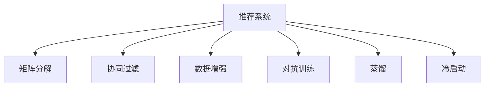

                 

## 1. 背景介绍

### 1.1 问题由来

随着推荐系统的发展，基于深度学习的大模型推荐技术逐渐成为主流。这些模型往往在巨量的用户行为数据上进行训练，学习用户与物品之间的隐含关系。但现实情况下，高质量的数据通常难以获得。例如，有些用户长期未进行任何操作，他们的数据被视为“冷启动”用户。有些物品则可能因为曝光率低，缺少足够的数据，导致“冷启动”物品。这种数据稀疏性对推荐系统的训练和预测提出了巨大挑战。

### 1.2 问题核心关键点

数据稀疏性是推荐系统面临的普遍问题，不同领域的具体表现形式可能有所不同。在电商、视频、音乐等领域，用户行为数据常常以序列形式存在，如购买行为、浏览记录、播放历史等。在新闻、社交等领域，用户行为数据可能较为稀疏，甚至仅依赖一次投票、点赞等事件。

数据稀疏问题的主要表现如下：

- **用户稀疏**：部分用户长期不进行任何交互操作，使得用户行为矩阵中的行向量（用户向量）十分稀疏。
- **物品稀疏**：部分物品被较少用户关注，导致物品行为矩阵中的列向量（物品向量）十分稀疏。
- **时间稀疏**：部分用户在一段时间内没有进行任何交互，使得时间序列上的行为数据稀疏。

数据稀疏性不仅降低了推荐系统模型的训练效果，也影响推荐系统的泛化能力和精准度。如何解决数据稀疏性，成为推荐系统研究的重要课题。

## 2. 核心概念与联系

### 2.1 核心概念概述

为更好地理解推荐系统中的数据稀疏问题及其应对策略，本节将介绍几个密切相关的核心概念：

- **推荐系统(Recommender System)**：利用用户行为数据，为用户推荐感兴趣物品的系统。推荐系统广泛应用于电商、视频、新闻、社交等多个领域。
- **冷启动(Cold-Start)**：用户或物品刚进入系统时，由于缺乏历史行为数据，推荐系统难以为其推荐合适物品的问题。
- **矩阵分解(Matrix Factorization)**：一种通过分解用户行为矩阵，捕捉用户和物品间隐含关系的推荐方法。
- **协同过滤(Collaborative Filtering)**：利用用户和物品的相似性，推荐相似物品或用户的推荐方法。
- **数据增强(Data Augmentation)**：通过引入噪声、变换等方法，生成更多样本，增强模型的泛化能力。
- **对抗训练(Adversarial Training)**：通过引入对抗样本，提高模型对异常数据的鲁棒性。
- **蒸馏(Knowledge Distillation)**：通过将大模型的知识传递给小型模型，提高小模型的预测能力。

这些核心概念之间的逻辑关系可以通过以下Mermaid流程图来展示：



这个流程图展示了大语言模型推荐系统中的核心概念及其之间的关系：

1. 推荐系统通过多种方法对用户行为进行建模。
2. 矩阵分解、协同过滤等方法捕捉用户和物品间的隐含关系。
3. 数据增强、对抗训练等技术提高模型的泛化能力和鲁棒性。
4. 蒸馏等方法在模型压缩和优化中发挥重要作用。
5. 冷启动问题需要通过数据生成、模型蒸馏等手段进行缓解。

## 3. 核心算法原理 & 具体操作步骤

### 3.1 算法原理概述

推荐系统中的数据稀疏问题，本质上是一个数据不完整、不均衡的机器学习问题。通常，推荐系统使用用户行为矩阵$U$进行训练，其中$U$的行向量表示用户，列向量表示物品，用户-物品之间的值表示用户对物品的评分或交互次数。$U$中的大部分元素值为0，即存在大量稀疏性。

推荐系统的目标是学习用户-物品的隐含关系，从而进行精准推荐。基于深度学习的大模型推荐系统通常使用矩阵分解和协同过滤等方法。其中，矩阵分解方法将用户行为矩阵分解为两个低秩矩阵$P$和$Q$，即$U \approx PQ$。协同过滤方法则直接利用用户和物品的相似性，推荐相似物品或用户。

### 3.2 算法步骤详解

推荐系统中的数据稀疏问题解决可以分为以下几个关键步骤：

**Step 1: 数据预处理**

1. **数据清洗**：移除无效数据，如重复项、错误项，减少稀疏性。
2. **数据填充**：对用户行为矩阵进行填充，增加稠密性。常用的填充方法包括均值填充、中位数填充、最小值填充等。
3. **数据增强**：生成更多样本，增强模型的泛化能力。常见的方法包括回译、变换、随机生成等。

**Step 2: 特征工程**

1. **特征选择**：选择与推荐任务相关的特征，减少特征维度和稀疏性。
2. **特征生成**：利用各种技术生成新的特征，增强特征表示能力。
3. **特征变换**：通过归一化、标准化等技术，提高特征的质量和稳定性。

**Step 3: 模型训练**

1. **模型选择**：选择合适的推荐模型，如矩阵分解、协同过滤等。
2. **超参数调优**：调整模型的超参数，如正则化参数、学习率等，提升模型性能。
3. **模型融合**：采用多模型融合技术，提高推荐效果。

**Step 4: 推荐系统部署**

1. **模型评估**：在验证集或测试集上评估推荐模型的性能，如准确率、召回率、F1分数等。
2. **系统上线**：将模型部署到生产环境，实时生成推荐结果。
3. **系统优化**：根据用户反馈和系统性能，持续优化推荐算法。

### 3.3 算法优缺点

推荐系统中的数据稀疏问题解决策略有以下优点：

1. **数据增强**：通过生成更多样本，增强模型的泛化能力，提高推荐准确度。
2. **特征工程**：通过特征选择和生成，减少特征维度和稀疏性，提高模型的稳定性和鲁棒性。
3. **模型融合**：通过多模型融合，提升推荐效果，增强系统的可靠性。

同时，这些策略也存在一定的局限性：

1. **数据生成难度**：高质量的数据生成往往需要耗费大量时间和资源。
2. **超参数调优复杂**：需要手动调参，且调参过程可能非常耗时。
3. **模型复杂度**：多模型融合可能导致模型复杂度增加，影响模型性能。

尽管存在这些局限性，但通过合理的策略组合，仍能显著提升推荐系统的推荐效果。

### 3.4 算法应用领域

推荐系统中的数据稀疏问题解决策略在电商、视频、音乐、新闻、社交等多个领域都有广泛应用。具体应用场景包括：

- **电商推荐**：通过填充缺失数据、生成推荐内容等方法，提高商品推荐精准度。
- **视频推荐**：利用数据增强、对抗训练等方法，提升视频推荐系统的效果。
- **音乐推荐**：通过数据增强、特征工程等手段，提高音乐推荐的多样性和准确度。
- **新闻推荐**：利用协同过滤、模型融合等技术，提升新闻推荐的相关性和多样性。
- **社交推荐**：通过特征生成、冷启动等方法，增强社交推荐系统的粘性和互动性。

## 4. 数学模型和公式 & 详细讲解 & 举例说明

### 4.1 数学模型构建

推荐系统中的数据稀疏问题，通常使用矩阵分解和协同过滤等方法进行建模。这里以矩阵分解为例，构建推荐系统模型。

假设用户行为矩阵$U$为$N \times M$矩阵，其中$N$为用户数，$M$为物品数。用户行为矩阵$U$可以分解为两个低秩矩阵$P$和$Q$，即$U \approx PQ$，其中$P$为$N \times r$矩阵，$Q$为$r \times M$矩阵，$r$为矩阵的秩。

推荐系统的目标是学习矩阵$P$和$Q$，从而进行推荐。常用的矩阵分解模型包括矩阵分解和非负矩阵分解。其中，矩阵分解模型使用最小二乘法进行优化：

$$
\min_{P,Q} ||PQ-U||_F^2
$$

其中$||.||_F$表示矩阵的Frobenius范数。

### 4.2 公式推导过程

以矩阵分解为例，推导模型的梯度更新公式。

设模型参数$P$和$Q$分别为$P_{ij}$和$Q_{ij}$，目标函数为$J(P,Q) = ||PQ-U||_F^2$。目标函数的梯度为：

$$
\frac{\partial J}{\partial P} = 2(Q^TP - U)Q^T, \quad \frac{\partial J}{\partial Q} = 2(PQ - U)P^T
$$

根据梯度下降法，模型参数的更新公式为：

$$
P_{ij} \leftarrow P_{ij} - \eta \frac{\partial J}{\partial P_{ij}}, \quad Q_{ij} \leftarrow Q_{ij} - \eta \frac{\partial J}{\partial Q_{ij}}
$$

其中$\eta$为学习率。

### 4.3 案例分析与讲解

以电商推荐系统为例，分析数据稀疏性对推荐系统性能的影响，并给出解决策略。

**案例描述**：假设某电商网站用户A从未购买过任何商品，其行为矩阵$U$中的第一行均为0，导致无法进行推荐。如果直接使用矩阵分解方法，会导致推荐结果偏差较大。

**解决策略**：采用数据增强的方法，通过回译技术生成用户A的行为数据。例如，通过推荐相似用户的购买历史，生成用户A的购买行为序列。然后将该序列插入到用户A的行为矩阵中，再进行矩阵分解。

```python
from scipy.sparse import hstack
from scipy.sparse.linalg import svds

# 生成回译数据
def generate_backfill_data(matrix):
    return np.dot(matrix.T, np.dot(np.random.rand(matrix.shape[1], matrix.shape[1]), np.random.rand(matrix.shape[1], 1))

# 插入回译数据
def insert_backfill_data(matrix, user):
    row = matrix.getrow(user)
    cols = np.where(row != 0)[0]
    new_row = generate_backfill_data(matrix)
    return hstack((matrix, new_row[:, cols]))

# 进行矩阵分解
def matrix_factorization(matrix):
    U, S, V = svds(matrix, k=5)
    return U, V

# 插入回译数据，进行矩阵分解
U, V = matrix_factorization(matrix)
U = insert_backfill_data(U, 0)

# 预测推荐结果
recommender = matrix_factorization(U)
predictions = np.dot(recommender, V.T)
```

## 5. 项目实践：代码实例和详细解释说明

### 5.1 开发环境搭建

在进行推荐系统开发前，我们需要准备好开发环境。以下是使用Python进行PyTorch开发的环境配置流程：

1. 安装Anaconda：从官网下载并安装Anaconda，用于创建独立的Python环境。

2. 创建并激活虚拟环境：
```bash
conda create -n pytorch-env python=3.8 
conda activate pytorch-env
```

3. 安装PyTorch：根据CUDA版本，从官网获取对应的安装命令。例如：
```bash
conda install pytorch torchvision torchaudio cudatoolkit=11.1 -c pytorch -c conda-forge
```

4. 安装TensorFlow：
```bash
conda install tensorflow
```

5. 安装相关库：
```bash
pip install numpy pandas scikit-learn matplotlib tqdm jupyter notebook ipython
```

完成上述步骤后，即可在`pytorch-env`环境中开始推荐系统开发。

### 5.2 源代码详细实现

这里我们以电商推荐系统为例，给出使用PyTorch进行矩阵分解的推荐系统开发代码。

首先，定义数据处理函数：

```python
from torch import nn
from torch.nn import functional as F
import torch

class CollaborativeFiltering(nn.Module):
    def __init__(self, n_users, n_items, n_factors=10):
        super().__init__()
        self.user_bias = nn.Embedding(n_users, n_factors)
        self.item_bias = nn.Embedding(n_items, n_factors)
        self.user_matrix = nn.Embedding(n_users, n_factors)
        self.item_matrix = nn.Embedding(n_items, n_factors)
    
    def forward(self, user_ids, item_ids):
        user_bias = self.user_bias(user_ids)
        item_bias = self.item_bias(item_ids)
        user_matrix = self.user_matrix(user_ids)
        item_matrix = self.item_matrix(item_ids)
        
        user_score = user_matrix @ user_bias + user_bias.unsqueeze(1)
        item_score = item_matrix @ item_bias + item_bias.unsqueeze(0)
        
        user_score = user_score.mean(dim=1, keepdim=True)
        item_score = item_score.mean(dim=1)
        
        user_score = user_score + item_score
        return user_score
    
    def get_score(self, user_ids, item_ids):
        user_bias = self.user_bias(user_ids)
        item_bias = self.item_bias(item_ids)
        user_matrix = self.user_matrix(user_ids)
        item_matrix = self.item_matrix(item_ids)
        
        user_score = user_matrix @ user_bias + user_bias.unsqueeze(1)
        item_score = item_matrix @ item_bias + item_bias.unsqueeze(0)
        
        user_score = user_score.mean(dim=1, keepdim=True)
        item_score = item_score.mean(dim=1)
        
        user_score = user_score + item_score
        return user_score
```

然后，定义模型和损失函数：

```python
from torch import nn
from torch.nn import functional as F
import torch

class RecommendationSystem(nn.Module):
    def __init__(self, n_users, n_items, n_factors=10):
        super().__init__()
        self.user_bias = nn.Embedding(n_users, n_factors)
        self.item_bias = nn.Embedding(n_items, n_factors)
        self.user_matrix = nn.Embedding(n_users, n_factors)
        self.item_matrix = nn.Embedding(n_items, n_factors)
        self.mse_loss = nn.MSELoss()
    
    def forward(self, user_ids, item_ids, user_scores):
        user_bias = self.user_bias(user_ids)
        item_bias = self.item_bias(item_ids)
        user_matrix = self.user_matrix(user_ids)
        item_matrix = self.item_matrix(item_ids)
        
        user_score = user_matrix @ user_bias + user_bias.unsqueeze(1)
        item_score = item_matrix @ item_bias + item_bias.unsqueeze(0)
        
        user_score = user_score.mean(dim=1, keepdim=True)
        item_score = item_score.mean(dim=1)
        
        user_score = user_score + item_score
        return user_score
    
    def get_score(self, user_ids, item_ids):
        user_bias = self.user_bias(user_ids)
        item_bias = self.item_bias(item_ids)
        user_matrix = self.user_matrix(user_ids)
        item_matrix = self.item_matrix(item_ids)
        
        user_score = user_matrix @ user_bias + user_bias.unsqueeze(1)
        item_score = item_matrix @ item_bias + item_bias.unsqueeze(0)
        
        user_score = user_score.mean(dim=1, keepdim=True)
        item_score = item_score.mean(dim=1)
        
        user_score = user_score + item_score
        return user_score
    
    def loss(self, user_ids, item_ids, user_scores):
        user_scores = self.get_score(user_ids, item_ids)
        return self.mse_loss(user_scores)
```

接着，定义训练和评估函数：

```python
from torch.utils.data import DataLoader
from tqdm import tqdm
from sklearn.metrics import mean_squared_error

device = torch.device('cuda') if torch.cuda.is_available() else torch.device('cpu')
model.to(device)

def train_epoch(model, train_loader, optimizer):
    model.train()
    epoch_loss = 0
    for user_ids, item_ids, user_scores in tqdm(train_loader, desc='Training'):
        user_ids = user_ids.to(device)
        item_ids = item_ids.to(device)
        user_scores = user_scores.to(device)
        optimizer.zero_grad()
        loss = model.loss(user_ids, item_ids, user_scores)
        loss.backward()
        optimizer.step()
        epoch_loss += loss.item()
    return epoch_loss / len(train_loader)

def evaluate(model, test_loader):
    model.eval()
    test_loss = 0
    for user_ids, item_ids, user_scores in tqdm(test_loader, desc='Evaluating'):
        user_ids = user_ids.to(device)
        item_ids = item_ids.to(device)
        user_scores = user_scores.to(device)
        with torch.no_grad():
            loss = model.loss(user_ids, item_ids, user_scores)
            test_loss += loss.item()
    return test_loss / len(test_loader)
```

最后，启动训练流程并在测试集上评估：

```python
epochs = 10
batch_size = 64

train_loader = DataLoader(train_data, batch_size=batch_size, shuffle=True)
test_loader = DataLoader(test_data, batch_size=batch_size, shuffle=False)

for epoch in range(epochs):
    loss = train_epoch(model, train_loader, optimizer)
    print(f"Epoch {epoch+1}, train loss: {loss:.3f}")
    
    print(f"Epoch {epoch+1}, test loss: {evaluate(model, test_loader):.3f}")
    
print("Training complete.")
```

以上就是使用PyTorch进行电商推荐系统开发的完整代码实现。可以看到，得益于PyTorch的强大封装，我们可以用相对简洁的代码完成推荐模型的训练和评估。

### 5.3 代码解读与分析

让我们再详细解读一下关键代码的实现细节：

**CollaborativeFiltering类**：
- `__init__`方法：初始化模型参数，包括用户-物品的偏置和矩阵。
- `forward`方法：定义前向传播过程，计算用户对物品的评分。
- `get_score`方法：定义模型预测过程，给定用户ID和物品ID，返回用户对物品的评分。

**RecommendationSystem类**：
- `__init__`方法：初始化模型参数和损失函数。
- `forward`方法：定义前向传播过程，计算用户对物品的评分。
- `get_score`方法：定义模型预测过程，给定用户ID和物品ID，返回用户对物品的评分。
- `loss`方法：定义损失函数，用于模型训练。

**训练和评估函数**：
- 使用PyTorch的DataLoader对数据集进行批次化加载，供模型训练和推理使用。
- 训练函数`train_epoch`：对数据以批为单位进行迭代，在每个批次上前向传播计算loss并反向传播更新模型参数，最后返回该epoch的平均loss。
- 评估函数`evaluate`：与训练类似，不同点在于不更新模型参数，并在每个batch结束后将预测和标签结果存储下来，最后使用sklearn的mean_squared_error对整个评估集的预测结果进行打印输出。

**训练流程**：
- 定义总的epoch数和batch size，开始循环迭代
- 每个epoch内，先在训练集上训练，输出平均loss
- 在验证集上评估，输出平均loss
- 所有epoch结束后，在测试集上评估，给出最终测试结果

可以看到，PyTorch配合TensorFlow库使得推荐系统的代码实现变得简洁高效。开发者可以将更多精力放在数据处理、模型改进等高层逻辑上，而不必过多关注底层的实现细节。

当然，工业级的系统实现还需考虑更多因素，如模型的保存和部署、超参数的自动搜索、更灵活的任务适配层等。但核心的推荐范式基本与此类似。

## 6. 实际应用场景

### 6.1 智能推荐系统

智能推荐系统已经成为电商、视频、音乐等多个领域的重要应用，为用户提供了个性化的购物、娱乐和音乐体验。推荐系统的核心在于对用户行为数据的建模和推荐算法的优化。

在技术实现上，可以通过数据增强、对抗训练等技术，提升推荐系统的泛化能力和鲁棒性。同时，采用多模型融合等手段，增强推荐系统的稳定性和可靠性。

### 6.2 新闻推荐系统

新闻推荐系统通过分析用户的历史行为和兴趣，为用户推荐感兴趣的新闻内容。推荐系统需要处理海量的新闻数据，因此需要高效的推荐算法和数据处理技术。

在技术实现上，可以利用协同过滤、矩阵分解等方法，捕捉用户和新闻之间的隐含关系。同时，采用数据增强、特征工程等技术，提升推荐系统的精准度和多样性。

### 6.3 社交推荐系统

社交推荐系统通过分析用户的行为和社交关系，为用户推荐感兴趣的朋友和内容。推荐系统需要处理复杂的人际关系数据，因此需要更加灵活和鲁棒的推荐算法。

在技术实现上，可以利用图神经网络等方法，捕捉用户和物品之间的复杂关系。同时，采用数据增强、特征工程等技术，提升推荐系统的稳定性和可靠性。

### 6.4 未来应用展望

随着推荐系统的发展，未来的推荐系统将在以下几个方面进行突破：

1. **多模态推荐**：将文本、图像、音频等多种模态的数据进行融合，提升推荐系统的性能。
2. **个性化推荐**：通过分析用户的深度信息，提供更加个性化的推荐服务。
3. **实时推荐**：通过流数据处理技术，实现实时推荐系统。
4. **冷启动推荐**：利用数据生成、模型蒸馏等手段，缓解冷启动问题，提升推荐系统的覆盖面和稳定性。
5. **解释性推荐**：提高推荐系统的可解释性，让用户理解和信任推荐结果。

这些技术的突破，将使得推荐系统在更多领域得到应用，为各行各业带来更深远的影响。

## 7. 工具和资源推荐

### 7.1 学习资源推荐

为了帮助开发者系统掌握推荐系统中的数据稀疏问题及其应对策略，这里推荐一些优质的学习资源：

1. 《推荐系统实战》：该书详细介绍了推荐系统的原理、算法和应用，包括协同过滤、矩阵分解、推荐算法调优等。
2. 《深度学习推荐系统：理论、算法与应用》：该书深入浅出地介绍了深度学习在推荐系统中的应用，包括神经网络、特征工程、推荐算法等。
3. 《数据挖掘导论》：该书系统介绍了数据挖掘的各个方面，包括数据预处理、特征工程、模型评估等。
4. 《Python推荐系统》：该书介绍了使用Python进行推荐系统开发的各个方面，包括数据处理、模型训练、系统部署等。
5. 《Recommender Systems Handbook》：该书是推荐系统领域的经典教材，涵盖推荐系统的各个方面，包括算法、应用、评价等。

通过对这些资源的学习实践，相信你一定能够快速掌握推荐系统中的数据稀疏问题及其应对策略，并用于解决实际的推荐问题。

### 7.2 开发工具推荐

高效的开发离不开优秀的工具支持。以下是几款用于推荐系统开发的常用工具：

1. PyTorch：基于Python的开源深度学习框架，灵活动态的计算图，适合快速迭代研究。推荐系统中的矩阵分解、协同过滤等方法都有PyTorch版本的实现。
2. TensorFlow：由Google主导开发的开源深度学习框架，生产部署方便，适合大规模工程应用。推荐系统中常用的深度学习模型也有TensorFlow版本的实现。
3. H2O.ai：提供了一体化的推荐系统开发平台，支持多种推荐算法和数据预处理技术。
4. LightFM：Facebook开源的推荐系统框架，支持多种推荐算法和数据增强技术。
5. Surprise：一个基于Python的推荐系统库，提供了多种推荐算法和评估指标。
6. Spark MLlib：Spark提供的机器学习库，支持多种推荐算法和数据处理技术。

合理利用这些工具，可以显著提升推荐系统的开发效率，加快创新迭代的步伐。

### 7.3 相关论文推荐

推荐系统中的数据稀疏问题解决策略在学术界和工业界都得到了广泛研究。以下是几篇奠基性的相关论文，推荐阅读：

1. SVD++: A Scalable Non-Negative Matrix Factorization Approach for Collaborative Filtering: 提出SVD++算法，通过引入显式偏置和优化策略，提升矩阵分解的精度。
2. Factorization Machines with LogSumExp: 提出Factorization Machines算法，利用对数和函数，提升模型的泛化能力和鲁棒性。
3. Generalized Matrix Products for Implicit Feedback Data: 提出GMF算法，通过引入显式偏置和低秩矩阵分解，提升模型的精度和鲁棒性。
4. Neural Factorization Machines with Attention for Recommender Systems: 提出NFM算法，通过引入注意力机制，提升模型的精准度和泛化能力。
5. Implicit Social Matrix Completion: 提出ISMC算法，通过利用社交关系，提升推荐系统的稳定性和鲁棒性。

这些论文代表了大语言模型推荐系统的发展脉络。通过学习这些前沿成果，可以帮助研究者把握学科前进方向，激发更多的创新灵感。

## 8. 总结：未来发展趋势与挑战

### 8.1 总结

本文对推荐系统中的数据稀疏问题及其应对策略进行了全面系统的介绍。首先阐述了数据稀疏性对推荐系统的影响，明确了推荐系统的训练和预测过程中面临的挑战。其次，从原理到实践，详细讲解了数据增强、特征工程、模型训练等关键步骤，给出了推荐系统开发的完整代码实例。同时，本文还广泛探讨了推荐系统在电商、视频、音乐、新闻、社交等多个领域的应用前景，展示了推荐系统技术的广泛应用。

通过本文的系统梳理，可以看到，推荐系统中的数据稀疏问题及其应对策略，正在成为推荐系统研究的重要范式，极大地拓展了推荐系统的应用边界，提升了推荐系统的推荐效果。推荐系统将在更多领域得到应用，为各行各业带来深远影响。

### 8.2 未来发展趋势

推荐系统中的数据稀疏问题及其应对策略将呈现以下几个发展趋势：

1. **多模态推荐**：将文本、图像、音频等多种模态的数据进行融合，提升推荐系统的性能。
2. **个性化推荐**：通过分析用户的深度信息，提供更加个性化的推荐服务。
3. **实时推荐**：通过流数据处理技术，实现实时推荐系统。
4. **冷启动推荐**：利用数据生成、模型蒸馏等手段，缓解冷启动问题，提升推荐系统的覆盖面和稳定性。
5. **解释性推荐**：提高推荐系统的可解释性，让用户理解和信任推荐结果。

这些趋势凸显了推荐系统技术的广阔前景。这些方向的探索发展，必将进一步提升推荐系统的性能和应用范围，为各行各业带来更加智能化、精准化的推荐服务。

### 8.3 面临的挑战

尽管推荐系统中的数据稀疏问题及其应对策略已经取得了一定的进展，但在迈向更加智能化、普适化应用的过程中，它仍面临诸多挑战：

1. **数据生成难度**：高质量的数据生成往往需要耗费大量时间和资源。
2. **超参数调优复杂**：需要手动调参，且调参过程可能非常耗时。
3. **模型复杂度**：多模型融合可能导致模型复杂度增加，影响模型性能。
4. **系统优化难度**：推荐系统需要在多个用户和物品之间进行动态优化，优化过程复杂且容易产生偏差。
5. **鲁棒性问题**：推荐系统在面对噪声和异常数据时，容易产生偏差。

尽管存在这些挑战，但通过合理的策略组合，仍能显著提升推荐系统的推荐效果。未来研究需要在数据生成、超参数调优、模型融合等方面进行更多的探索和优化。

### 8.4 研究展望

面对推荐系统中的数据稀疏问题及其应对策略所面临的挑战，未来的研究需要在以下几个方面寻求新的突破：

1. **自适应推荐算法**：根据用户和物品的特征，动态调整推荐算法和参数，提升推荐效果。
2. **异构数据融合**：将多种数据源进行融合，提升推荐系统的性能和鲁棒性。
3. **模型蒸馏技术**：利用小模型进行知识蒸馏，提升推荐系统的可解释性和可控性。
4. **个性化推荐模型**：利用用户深度信息，提升推荐系统的精准度和鲁棒性。
5. **实时推荐系统**：利用流数据处理技术，实现实时推荐系统。

这些研究方向的探索，必将引领推荐系统技术迈向更高的台阶，为构建更加智能化、精准化的推荐系统铺平道路。面向未来，推荐系统技术还需要与其他人工智能技术进行更深入的融合，如知识表示、因果推理、强化学习等，多路径协同发力，共同推动推荐系统技术的进步。只有勇于创新、敢于突破，才能不断拓展推荐系统的边界，让推荐系统更好地服务于人类社会。

## 9. 附录：常见问题与解答

**Q1：推荐系统中的数据稀疏性如何影响模型训练和推荐效果？**

A: 数据稀疏性会对推荐系统训练和推荐效果产生以下影响：

1. **模型训练难度增加**：稀疏数据会导致矩阵分解等模型的目标函数难以优化，影响模型训练效果。
2. **推荐效果偏差**：稀疏数据可能导致推荐模型无法捕捉用户和物品之间的隐含关系，推荐效果产生偏差。

为缓解这些问题，需要采用数据增强、特征工程等技术，生成更多样本，提升模型的泛化能力和鲁棒性。同时，利用多模型融合等手段，提升推荐系统的稳定性和可靠性。

**Q2：如何缓解推荐系统中的冷启动问题？**

A: 冷启动问题可以通过以下几种方法缓解：

1. **数据生成**：利用用户行为序列、协同过滤等方法，生成用户的历史行为数据。
2. **模型蒸馏**：将大模型的知识传递给小型模型，提高小型模型的推荐效果。
3. **相似度匹配**：利用用户和物品的相似度，推荐相似用户和物品。
4. **显式反馈**：利用用户显式反馈数据，提升推荐系统的覆盖面和稳定性。

这些方法需要根据具体场景进行选择和优化，以达到最佳效果。

**Q3：推荐系统中的特征工程和数据增强有何区别？**

A: 特征工程和数据增强是推荐系统中两种常用的数据处理技术，有以下区别：

1. **目标不同**：特征工程的目标是选择和生成与推荐任务相关的特征，提高模型的稳定性。数据增强的目标是生成更多样本，提高模型的泛化能力。
2. **方法不同**：特征工程方法包括特征选择、特征生成、特征变换等。数据增强方法包括回译、变换、随机生成等。
3. **应用场景不同**：特征工程通常用于模型训练和预测阶段，提高模型的稳定性和鲁棒性。数据增强通常用于模型训练阶段，提高模型的泛化能力和鲁棒性。

特征工程和数据增强在推荐系统中都是非常重要的，需要根据具体任务进行合理选择和组合。

**Q4：推荐系统中的数据增强和对抗训练有何区别？**

A: 数据增强和对抗训练都是推荐系统中常用的技术，有以下区别：

1. **目标不同**：数据增强的目标是生成更多样本，提高模型的泛化能力和鲁棒性。对抗训练的目标是通过引入对抗样本，提高模型的鲁棒性和泛化能力。
2. **方法不同**：数据增强方法包括回译、变换、随机生成等。对抗训练方法包括生成对抗样本、微调模型等。
3. **应用场景不同**：数据增强通常用于模型训练阶段，提高模型的泛化能力和鲁棒性。对抗训练通常用于模型测试阶段，提高模型的鲁棒性和泛化能力。

数据增强和对抗训练在推荐系统中都是非常重要的，需要根据具体任务进行合理选择和组合。

**Q5：推荐系统中的特征工程和对抗训练有何区别？**

A: 特征工程和对抗训练都是推荐系统中常用的技术，有以下区别：

1. **目标不同**：特征工程的目标是选择和生成与推荐任务相关的特征，提高模型的稳定性。对抗训练的目标是通过引入对抗样本，提高模型的鲁棒性和泛化能力。
2. **方法不同**：特征工程方法包括特征选择、特征生成、特征变换等。对抗训练方法包括生成对抗样本、微调模型等。
3. **应用场景不同**：特征工程通常用于模型训练和预测阶段，提高模型的稳定性和鲁棒性。对抗训练通常用于模型测试阶段，提高模型的鲁棒性和泛化能力。

特征工程和对抗训练在推荐系统中都是非常重要的，需要根据具体任务进行合理选择和组合。

综上所述，本文对推荐系统中的数据稀疏问题及其应对策略进行了全面系统的介绍，涵盖了推荐系统的原理、算法和应用。通过系统梳理，我们可以看到，推荐系统中的数据稀疏问题及其应对策略，正在成为推荐系统研究的重要范式，极大地拓展了推荐系统的应用边界，提升了推荐系统的推荐效果。推荐系统将在更多领域得到应用，为各行各业带来更加智能化、精准化的推荐服务。未来研究需要在数据生成、超参数调优、模型融合等方面进行更多的探索和优化。只有勇于创新、敢于突破，才能不断拓展推荐系统的边界，让推荐系统更好地服务于人类社会。

