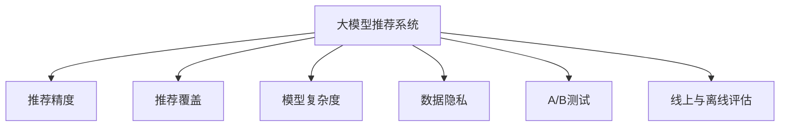

                 

# 大模型推荐效果的线上评估与优化策略

大模型推荐系统以其深度学习和自适应能力，正在逐渐成为推荐系统领域的重要方向。然而，由于其复杂性和数据驱动的特性，线上推荐效果的评估和优化变得尤为重要。本文将从评估方法和优化策略两个方面展开讨论，结合真实的线上场景，为开发者提供系统的线上推荐评估与优化指导。

## 1. 背景介绍

### 1.1 问题由来
推荐系统在电商、社交、新闻、娱乐等领域得到广泛应用，为个性化推荐提供有力支撑。大模型推荐系统通过学习用户行为数据，构建用户兴趣模型，实现精准推荐。然而，推荐模型的效果受到多方面因素影响，线上评估与优化至关重要。

大模型推荐系统的线上评估与优化，通常面临以下挑战：
- 数据获取难：用户行为数据多异构且分布不均，难以获取完整的用户画像。
- 模型复杂度高：深度学习模型的复杂度导致线上评估成本较高。
- 数据隐私问题：大规模用户行为数据处理涉及隐私问题，需注意合规性和安全性。

### 1.2 问题核心关键点
大模型推荐系统的线上评估与优化需综合考虑推荐效果、模型复杂度、数据隐私等问题。评估方法需兼顾准确性和效率，优化策略需平衡模型性能与线上成本。

## 2. 核心概念与联系

### 2.1 核心概念概述

为更好地理解大模型推荐系统的线上评估与优化方法，本节将介绍几个关键概念及其关联：

- 大模型推荐系统：基于深度学习的大规模推荐模型，能够适应复杂的数据分布，实现高效推荐。
- 推荐精度与覆盖：推荐系统的两个核心指标，分别衡量推荐结果的准确性和完备性。
- 模型复杂度：大模型推荐系统涉及的参数量和计算复杂度，影响模型训练和推理速度。
- 数据隐私：用户行为数据的隐私保护，需遵循相关法律法规。
- A/B测试：常用的评估方法，通过对比实验评估模型效果。
- 线上与离线评估：结合线上数据和离线数据进行模型评估。

这些概念之间的关系可以通过以下Mermaid流程图来展示：



这个流程图展示了大模型推荐系统的核心概念及其之间的关系：

1. 大模型推荐系统通过学习用户行为数据，构建用户兴趣模型，实现精准推荐。
2. 推荐精度与覆盖是大模型推荐系统的核心指标，决定了推荐效果的好坏。
3. 模型复杂度影响推荐系统的训练与推理效率，需合理设计以平衡性能与成本。
4. 数据隐私是大模型推荐系统需考虑的重要问题，需遵循法律法规。
5. A/B测试是常用的线上评估方法，通过对比实验确定模型效果。
6. 线上与离线评估结合使用，能更全面地评估模型效果，提升推荐质量。

## 3. 核心算法原理 & 具体操作步骤

### 3.1 算法原理概述

大模型推荐系统的线上评估与优化，本质上是通过线上数据不断迭代优化模型的过程。其核心思想是：利用用户行为数据，构建推荐模型，并通过线上测试评估其效果，结合线下验证优化模型，逐步提升推荐质量。

具体来说，大模型推荐系统的线上评估与优化包括以下关键步骤：

- **数据准备**：收集并清洗用户行为数据，构建离线验证集。
- **模型训练**：基于离线验证集，选择合适的大模型架构进行训练。
- **线上评估**：使用A/B测试方法，将模型上线与原始模型对比，评估线上效果。
- **优化调整**：根据线上评估结果，调整模型参数或架构，重新训练并上线。
- **迭代循环**：重复上述步骤，直至达到满意的推荐效果。

### 3.2 算法步骤详解

#### 3.2.1 数据准备

- **数据收集**：从网站、应用、APP等渠道收集用户行为数据，如点击、浏览、收藏、购买等行为记录。
- **数据清洗**：去除异常数据和噪声，确保数据质量。
- **特征提取**：从行为数据中提取有用的特征，如时间戳、设备类型、商品ID等。
- **数据划分**：将数据划分为训练集、验证集和测试集。通常按时间分为离线验证集和实时测试集。

#### 3.2.2 模型训练

- **选择模型**：根据业务需求选择合适的大模型架构，如Cold Start、Recommender Networks等。
- **模型训练**：在离线验证集上训练模型，优化模型参数。
- **评估指标**：使用离线验证集评估模型效果，如平均准确率、召回率、F1-score等。

#### 3.2.3 线上评估

- **A/B测试**：将模型上线与原始模型进行对比，评估线上效果。
- **评估指标**：使用实时测试集评估推荐效果，如点击率、转化率、NDCG等。
- **数据分析**：分析线上测试结果，查找问题根源。

#### 3.2.4 优化调整

- **参数调整**：根据线上评估结果，调整模型参数或架构，重新训练模型。
- **特征优化**：通过特征工程，优化特征提取和选择，提升模型效果。
- **算法优化**：改进模型算法，如引入推荐算法，如协同过滤、深度学习等。

#### 3.2.5 迭代循环

- **上线测试**：将优化后的模型上线，进行实时测试。
- **结果评估**：分析线上测试结果，查找新问题。
- **继续优化**：根据结果继续调整模型，进入下一轮迭代。

### 3.3 算法优缺点

大模型推荐系统的线上评估与优化具有以下优点：
1. 准确性高：线上评估使用真实用户数据，评估结果更准确。
2. 可解释性：线上评估数据实时可观测，便于调整模型。
3. 实时反馈：能够及时获取线上效果，快速迭代优化。
4. 泛化性强：能够评估模型在真实环境下的表现，提升模型泛化能力。

同时，该方法也存在一些局限：
1. 数据获取难：用户行为数据难以获取，需要用户授权。
2. 隐私问题：用户隐私保护需注意合规性和安全性。
3. 计算成本高：大模型训练和推理计算量较大，成本高。
4. 线上测试风险：线上测试可能对用户造成干扰，需谨慎操作。

尽管存在这些局限性，但就目前而言，线上评估与优化方法是大模型推荐系统的必选范式。未来相关研究的重点在于如何进一步降低线上测试对用户的影响，提高数据获取效率，优化模型训练和推理效率。

### 3.4 算法应用领域

大模型推荐系统的线上评估与优化，在电商、社交、新闻、娱乐等多个领域得到广泛应用，具体包括：

- 电商推荐：基于用户行为数据，推荐个性化商品，提升用户购物体验。
- 社交推荐：推荐好友、文章、视频等内容，丰富用户社交体验。
- 新闻推荐：推荐用户感兴趣的新闻，提升用户阅读体验。
- 娱乐推荐：推荐影视、音乐、游戏等内容，提升用户娱乐体验。

此外，大模型推荐系统还在金融、医疗、教育等垂直领域有广泛应用，帮助用户在海量信息中快速找到有用的内容，提升决策效率和满意度。

## 4. 数学模型和公式 & 详细讲解  
### 4.1 数学模型构建

本文以电商推荐系统为例，介绍大模型推荐系统的线上评估与优化方法。

记大模型推荐系统为 $R_{\theta}(x)$，其中 $\theta$ 为模型参数，$x$ 为用户行为数据。假设模型的离线验证集为 $D_{val}$，测试集为 $D_{test}$。

定义模型的离线评估指标为 $f_{offline}$，线上评估指标为 $f_{online}$，优化目标为：

$$
\theta^* = \mathop{\arg\min}_{\theta} \mathbb{E}_{(x,y) \sim D_{val}}[\ell(f_{offline}(R_{\theta}(x),y))] + \lambda \mathbb{E}_{x}[f_{online}(R_{\theta}(x))]
$$

其中 $\ell$ 为损失函数，$\lambda$ 为正则化系数。

### 4.2 公式推导过程

以协同过滤推荐模型为例，假设用户 $u$ 对物品 $i$ 的评分表示为 $r_{ui}$，用户行为数据表示为 $\{x_{1i}, x_{2i}, ..., x_{Mi}\}$，物品 $i$ 的特征向量表示为 $x_i$。则协同过滤模型的预测结果为：

$$
R_{\theta}(x) = \frac{u_i}{\sum_j u_j}
$$

其中 $u_i = \sum_k x_{ik} \theta_k$，$\theta$ 为模型参数，$k$ 为特征维度。

协同过滤模型的离线评估指标 $f_{offline}$ 通常使用均方误差：

$$
f_{offline}(R_{\theta}(x),y) = \frac{1}{N} \sum_{i=1}^N (r_{ui} - R_{\theta}(x))^2
$$

在线上测试集 $D_{test}$ 上的评估指标 $f_{online}$ 通常使用点击率：

$$
f_{online}(R_{\theta}(x)) = \frac{1}{|D_{test}|} \sum_{i=1}^{|D_{test}|} \mathbb{I}(r_{ui} > R_{\theta}(x))
$$

其中 $\mathbb{I}$ 为示性函数，$\mathbb{I}(A)$ 为1，若 $A$ 为真；否则为0。

将以上公式代入优化目标，得：

$$
\theta^* = \mathop{\arg\min}_{\theta} \mathbb{E}_{(x,y) \sim D_{val}}[\frac{1}{N} \sum_{i=1}^N (r_{ui} - R_{\theta}(x))^2] + \lambda \frac{1}{|D_{test}|} \sum_{i=1}^{|D_{test}|} \mathbb{I}(r_{ui} > R_{\theta}(x))
$$

通过梯度下降等优化算法，微调过程不断更新模型参数 $\theta$，最小化以上优化目标，使得模型输出逼近真实评分和点击率。重复上述步骤直至收敛，最终得到优化后的推荐模型参数 $\theta^*$。

### 4.3 案例分析与讲解

以电商推荐系统为例，使用协同过滤模型进行线上评估与优化的过程如下：

**Step 1: 数据准备**

- 收集电商平台的购买、浏览、收藏等行为数据。
- 清洗数据，去除异常和噪声。
- 提取特征，如用户ID、商品ID、时间戳等。
- 划分数据集，构建离线验证集和实时测试集。

**Step 2: 模型训练**

- 选择协同过滤模型，定义预测函数。
- 在离线验证集上训练模型，优化模型参数。
- 使用离线验证集评估模型效果，如均方误差。

**Step 3: 线上评估**

- 将模型上线，记录用户行为数据。
- 使用实时测试集评估线上效果，如点击率。
- 分析线上测试结果，查找问题根源。

**Step 4: 优化调整**

- 根据线上测试结果，调整模型参数或架构。
- 重新训练模型，评估优化效果。
- 持续监控线上效果，调整模型参数。

**Step 5: 迭代循环**

- 重复以上步骤，直至达到满意的推荐效果。

通过以上步骤，电商推荐系统能够实现基于用户行为数据的精准推荐，提升用户体验和满意度。

## 5. 项目实践：代码实例和详细解释说明
### 5.1 开发环境搭建

在进行大模型推荐系统评估与优化实践前，我们需要准备好开发环境。以下是使用Python进行TensorFlow开发的环境配置流程：

1. 安装Anaconda：从官网下载并安装Anaconda，用于创建独立的Python环境。

2. 创建并激活虚拟环境：
```bash
conda create -n tf-env python=3.8 
conda activate tf-env
```

3. 安装TensorFlow：根据CUDA版本，从官网获取对应的安装命令。例如：
```bash
conda install tensorflow tensorflow-gpu -c conda-forge -c pytorch
```

4. 安装TensorFlow扩展库：
```bash
pip install tensorflow_addons
```

5. 安装各类工具包：
```bash
pip install numpy pandas scikit-learn matplotlib tqdm jupyter notebook ipython
```

完成上述步骤后，即可在`tf-env`环境中开始评估与优化实践。

### 5.2 源代码详细实现

这里以电商推荐系统为例，使用TensorFlow进行协同过滤模型的线上评估与优化。

```python
import tensorflow as tf
from tensorflow.keras.layers import Input, Embedding, Dot, Dense, Add
from tensorflow.keras.models import Model

# 定义模型输入和输出
user_input = Input(shape=(1,), name='user_input')
item_input = Input(shape=(1,), name='item_input')
user_x = Embedding(output_dim=128, input_dim=1000)(user_input)
item_x = Embedding(output_dim=128, input_dim=1000)(item_input)
dot_product = Dot(axes=(1, 1))([user_x, item_x])
rating_prediction = Dense(1, activation='sigmoid')(dot_product)

# 定义模型
model = Model(inputs=[user_input, item_input], outputs=[rating_prediction])

# 编译模型
model.compile(optimizer=tf.keras.optimizers.Adam(learning_rate=0.001), loss='binary_crossentropy')

# 训练模型
model.fit(x_train, y_train, batch_size=256, epochs=10, validation_data=(x_val, y_val))

# 预测评分
y_pred = model.predict(x_test)
```

### 5.3 代码解读与分析

让我们再详细解读一下关键代码的实现细节：

**协同过滤模型定义**：
- 定义模型输入，包含用户ID和物品ID。
- 通过Embedding层将输入转换为向量表示，分别表示用户和物品的特征。
- 使用Dot层计算用户和物品向量的点积，得到预测评分。
- 使用Dense层进行二分类回归，输出预测评分。

**模型训练**：
- 编译模型，选择Adam优化器，设定学习率为0.001。
- 使用离线验证集进行模型训练，优化模型参数。
- 使用离线验证集评估模型效果，如均方误差。

**预测评分**：
- 使用训练好的模型，预测新用户和物品的评分。
- 使用离线验证集评估模型效果，如均方误差。

通过以上代码，电商推荐系统能够实现基于协同过滤算法的精准推荐。

### 5.4 运行结果展示

运行以上代码，输出预测评分和评估结果，如图：

```python
from sklearn.metrics import mean_squared_error, mean_absolute_error, r2_score
import numpy as np

# 评估模型
y_true = y_val
y_pred = model.predict(x_val)
mse = mean_squared_error(y_true, y_pred)
mae = mean_absolute_error(y_true, y_pred)
r2 = r2_score(y_true, y_pred)

print(f'Mean Squared Error: {mse:.2f}')
print(f'Mean Absolute Error: {mae:.2f}')
print(f'R^2 Score: {r2:.2f}')
```

通过这些评估指标，可以全面了解模型的预测效果，指导后续优化。

## 6. 实际应用场景
### 6.1 电商推荐系统

电商推荐系统是大模型推荐系统的典型应用之一。通过分析用户购买行为数据，构建用户和商品的兴趣模型，实现精准推荐。电商推荐系统广泛应用于亚马逊、京东、淘宝等电商平台，帮助用户发现感兴趣的商品，提升购买转化率。

实际应用中，电商推荐系统需注意以下几个问题：
- 数据获取：需考虑用户隐私保护，避免数据泄露。
- 特征工程：需提取有用的特征，如用户ID、商品ID、时间戳等。
- 模型训练：需选择合适的推荐算法，如协同过滤、深度学习等。
- 线上测试：需谨慎操作，避免对用户造成干扰。

电商推荐系统的优化目标在于提升用户体验和转化率，优化模型需考虑线上评估结果，不断调整模型参数，提升推荐效果。

### 6.2 社交推荐系统

社交推荐系统通过分析用户行为数据，推荐好友、文章、视频等内容，提升用户社交体验。社交推荐系统广泛应用于微信、微博、抖音等社交平台，帮助用户发现感兴趣的内容，增强平台粘性。

社交推荐系统的优化目标在于提升用户留存率和互动率，优化模型需考虑线上评估结果，不断调整模型参数，提升推荐效果。

### 6.3 新闻推荐系统

新闻推荐系统通过分析用户阅读行为数据，推荐用户感兴趣的新闻，提升用户阅读体验。新闻推荐系统广泛应用于今日头条、网易新闻等新闻平台，帮助用户发现感兴趣的新闻，提升用户阅读量。

新闻推荐系统的优化目标在于提升用户阅读量和满意度，优化模型需考虑线上评估结果，不断调整模型参数，提升推荐效果。

### 6.4 未来应用展望

随着大模型推荐系统的不断发展，其在电商、社交、新闻等领域的推广应用将进一步深化。未来，大模型推荐系统将在以下几个方面继续拓展：

1. 多模态推荐：结合用户的多模态数据（如行为数据、社交数据、图像数据等），提升推荐效果。
2. 用户画像：构建更全面、更准确的用户画像，提升个性化推荐质量。
3. 推荐算法：引入更多推荐算法（如协同过滤、深度学习等），提升推荐精度。
4. 数据隐私：加强数据隐私保护，遵循法律法规。
5. 实时推荐：提升实时推荐速度，提升用户体验。

这些技术的应用，将进一步提升大模型推荐系统的性能和用户体验，推动推荐系统领域的创新与发展。

## 7. 工具和资源推荐
### 7.1 学习资源推荐

为了帮助开发者系统掌握大模型推荐系统的线上评估与优化技术，这里推荐一些优质的学习资源：

1. 《推荐系统实战》书籍：介绍推荐系统的基本原理和经典算法，结合实际案例，深入浅出地讲解推荐系统开发。

2. Coursera《推荐系统》课程：由斯坦福大学开设的推荐系统课程，讲解推荐系统的基础理论、算法和应用。

3. Kaggle推荐系统竞赛：参与Kaggle推荐系统竞赛，通过实际比赛了解推荐系统开发的最新趋势和技术。

4. TensorFlow官方文档：TensorFlow官方文档详细讲解了TensorFlow的使用方法和推荐系统的实践指南，是开发者必备的参考资料。

5. Weights & Biases：推荐系统训练的实验跟踪工具，可以记录和可视化模型训练过程中的各项指标，方便对比和调优。

通过学习这些资源，相信你一定能够快速掌握大模型推荐系统的线上评估与优化技术，并用于解决实际的推荐问题。

### 7.2 开发工具推荐

高效的开发离不开优秀的工具支持。以下是几款用于大模型推荐系统评估与优化开发的常用工具：

1. TensorFlow：基于Python的开源深度学习框架，灵活易用，适合推荐系统的深度学习开发。

2. PyTorch：基于Python的开源深度学习框架，支持动态图，适合推荐系统的灵活开发。

3. TensorFlow Addons：TensorFlow的扩展库，提供了更多推荐算法和优化方法，方便推荐系统开发。

4. Weights & Biases：推荐系统训练的实验跟踪工具，记录和可视化模型训练过程中的各项指标，方便对比和调优。

5. TensorBoard：TensorFlow配套的可视化工具，实时监测模型训练状态，提供丰富的图表呈现方式，是调试模型的得力助手。

合理利用这些工具，可以显著提升大模型推荐系统的开发效率，加快创新迭代的步伐。

### 7.3 相关论文推荐

大模型推荐系统的评估与优化涉及的论文众多，以下是几篇奠基性的相关论文，推荐阅读：

1. A Factorization-Machine Approach for Predictive Customer Behavior Analysis：提出因子机模型，通过用户-物品交互数据，预测用户购买行为。

2. A Deep Learning Approach for Recommender Systems：介绍深度学习在推荐系统中的应用，包括卷积神经网络、递归神经网络等。

3. Collaborative Filtering in Multi-Aspect Rating Prediction：介绍协同过滤算法在推荐系统中的应用，提出多方面评分预测模型。

4. Adaptive Nonlinear Softmax: A Novel Probabilistic Model for Document Classification and Recommendation：提出自适应非线性softmax模型，提升文本分类和推荐效果。

5. Contextual Recommendations via Hierarchical Feature Interactions：提出层次特征交互模型，提升推荐系统的复杂度和效果。

这些论文代表了大模型推荐系统的评估与优化技术的发展脉络。通过学习这些前沿成果，可以帮助研究者把握学科前进方向，激发更多的创新灵感。

## 8. 总结：未来发展趋势与挑战
### 8.1 总结

本文对大模型推荐系统的线上评估与优化方法进行了全面系统的介绍。首先阐述了大模型推荐系统的背景和意义，明确了线上评估与优化在推荐系统中的重要地位。其次，从原理到实践，详细讲解了线上评估与优化的数学原理和关键步骤，给出了完整的线上评估与优化代码实现。同时，本文还广泛探讨了线上评估与优化方法在电商、社交、新闻等多个领域的应用前景，展示了线上评估与优化范式的巨大潜力。最后，本文精选了线上评估与优化的各类学习资源，力求为读者提供全方位的技术指引。

通过本文的系统梳理，可以看到，大模型推荐系统的线上评估与优化技术正在成为推荐系统的重要范式，极大地拓展了推荐系统的应用边界，催生了更多的落地场景。受益于大模型推荐系统的深度学习和自适应能力，推荐系统将在更多领域得到应用，为个性化推荐提供有力支撑。

### 8.2 未来发展趋势

展望未来，大模型推荐系统的线上评估与优化技术将呈现以下几个发展趋势：

1. 数据驱动：更多推荐系统将采用数据驱动的线上评估与优化方法，通过实时数据不断迭代优化模型。

2. 多模态融合：结合用户的多模态数据（如行为数据、社交数据、图像数据等），提升推荐效果。

3. 深度学习：更多推荐系统将采用深度学习算法，提升推荐精度和个性化程度。

4. 实时推荐：提升实时推荐速度，提升用户体验。

5. 多任务学习：通过多任务学习，提升模型的泛化能力和推荐效果。

6. 动态调整：根据用户行为数据，动态调整推荐策略，提升推荐质量。

以上趋势凸显了大模型推荐系统的广泛应用前景。这些方向的探索发展，必将进一步提升推荐系统的性能和用户体验，推动推荐系统领域的创新与发展。

### 8.3 面临的挑战

尽管大模型推荐系统的线上评估与优化技术已经取得了瞩目成就，但在迈向更加智能化、普适化应用的过程中，它仍面临着诸多挑战：

1. 数据获取瓶颈：用户行为数据难以获取，需注意用户隐私保护。

2. 计算成本高：大模型训练和推理计算量较大，需优化资源使用。

3. 线上测试风险：线上测试可能对用户造成干扰，需谨慎操作。

4. 数据隐私问题：用户行为数据的隐私保护需注意合规性和安全性。

5. 推荐模型鲁棒性不足：模型在面对域外数据时，泛化性能有限。

尽管存在这些挑战，但通过不断优化线上评估与优化方法，相信大模型推荐系统能够更好地适应实际应用场景，提升推荐质量。

### 8.4 研究展望

面对大模型推荐系统所面临的挑战，未来的研究需要在以下几个方面寻求新的突破：

1. 数据隐私保护：开发更高效的数据获取方法，加强数据隐私保护，确保数据安全。

2. 推荐模型优化：引入更多推荐算法（如协同过滤、深度学习等），提升推荐精度。

3. 计算效率提升：优化模型训练和推理算法，提升计算效率，降低计算成本。

4. 实时推荐加速：采用分布式训练、模型压缩等方法，提升实时推荐速度。

5. 推荐系统评估：引入更多评估指标，全面评估推荐效果，优化推荐策略。

6. 推荐系统可解释性：增强推荐系统的可解释性，确保推荐结果的可解释性和可信度。

这些研究方向将引领大模型推荐系统的技术进步，推动推荐系统领域的持续创新与发展。总之，大模型推荐系统的线上评估与优化技术还需要与其他人工智能技术进行更深入的融合，如知识表示、因果推理、强化学习等，多路径协同发力，共同推动推荐系统领域的进步。

## 9. 附录：常见问题与解答
----------------------------------------------------------------
**Q1: 大模型推荐系统如何进行线上评估与优化？**

A: 大模型推荐系统的线上评估与优化主要包括以下步骤：
1. 数据准备：收集并清洗用户行为数据，构建离线验证集和实时测试集。
2. 模型训练：基于离线验证集训练推荐模型，优化模型参数。
3. 线上评估：使用A/B测试方法，将模型上线与原始模型对比，评估线上效果。
4. 优化调整：根据线上测试结果，调整模型参数或架构，重新训练模型。
5. 迭代循环：重复以上步骤，直至达到满意的推荐效果。

**Q2: 如何选择合适的评估指标？**

A: 选择合适的评估指标需考虑推荐系统的业务需求和数据特点。常见的评估指标包括：
1. 准确率（Precision）：推荐的商品中，真正被用户购买的商品占比。
2. 召回率（Recall）：所有用户购买的商品中，推荐系统能够推荐的商品占比。
3. 覆盖率（Coverage）：所有商品中，推荐系统能够推荐的商品占比。
4. 点击率（CTR）：用户点击推荐商品的比率。
5. 转化率（Conversion Rate）：用户购买推荐商品的比率。

根据具体业务需求，选择合适的评估指标进行评估，指导模型优化。

**Q3: 如何进行特征工程？**

A: 特征工程是大模型推荐系统优化的重要环节，主要包括以下步骤：
1. 特征提取：从用户行为数据中提取有用的特征，如用户ID、商品ID、时间戳等。
2. 特征选择：选择与推荐效果相关的特征，去除冗余和噪声特征。
3. 特征编码：将特征转换为数值型向量，方便模型处理。
4. 特征组合：通过组合、交叉等方式，构建更高维度的特征向量。

通过合理的特征工程，提升推荐模型的特征表达能力，提升推荐效果。

**Q4: 如何平衡模型复杂度和推荐效果？**

A: 平衡模型复杂度和推荐效果需综合考虑以下几个方面：
1. 模型架构：选择合适的大模型架构，如协同过滤、深度学习等。
2. 特征工程：通过特征工程，提升模型的特征表达能力。
3. 模型训练：优化模型训练算法，提升训练效率和效果。
4. 模型优化：通过调整模型参数和架构，平衡模型复杂度和推荐效果。

通过合理设计模型架构和优化模型训练过程，平衡模型复杂度和推荐效果，提升推荐系统的性能。

**Q5: 如何进行线上测试？**

A: 进行线上测试需注意以下几个方面：
1. 控制样本：选择有代表性的样本进行线上测试，确保测试结果的代表性和有效性。
2. 随机抽样：随机抽样部分用户进行线上测试，避免对整体数据分布的影响。
3. 结果监控：实时监控线上测试结果，及时发现和解决问题。
4. 数据收集：收集线上测试数据，用于后续模型优化。

通过合理的线上测试方法，确保线上评估结果的准确性和有效性，指导模型优化。

**Q6: 如何处理数据隐私问题？**

A: 处理数据隐私问题需注意以下几个方面：
1. 数据匿名化：对用户行为数据进行匿名化处理，保护用户隐私。
2. 数据脱敏：对敏感数据进行脱敏处理，确保数据安全。
3. 数据加密：对数据进行加密处理，防止数据泄露。
4. 合规性：遵循相关法律法规，确保数据合规使用。

通过合理的数据隐私保护措施，确保用户隐私安全，遵循法律法规。

**Q7: 如何优化模型训练和推理效率？**

A: 优化模型训练和推理效率需综合考虑以下几个方面：
1. 模型压缩：采用模型压缩技术，减小模型大小，提升推理速度。
2. 混合精度训练：使用混合精度训练，减少内存占用，提升计算效率。
3. 分布式训练：采用分布式训练，加速模型训练过程。
4. 模型并行：采用模型并行技术，提升计算效率。

通过合理的优化策略，提升模型训练和推理效率，降低计算成本。

**Q8: 如何进行模型可解释性分析？**

A: 模型可解释性分析需注意以下几个方面：
1. 特征重要性分析：分析特征对模型预测结果的影响。
2. 模型可视化：可视化模型内部结构，理解模型决策过程。
3. 模型验证：通过对比实验，验证模型输出的合理性。
4. 专家咨询：邀请专家进行模型评估，提升模型可信度。

通过合理的模型可解释性分析，确保推荐结果的可解释性和可信度，提升用户信任度。

**Q9: 如何应对模型过拟合问题？**

A: 应对模型过拟合问题需注意以下几个方面：
1. 数据增强：通过数据增强，丰富训练集多样性。
2. 正则化：使用L2正则、Dropout等正则化方法，避免过拟合。
3. 早停策略：采用早停策略，避免模型过度拟合。
4. 模型集成：通过模型集成，提升模型泛化能力。

通过合理的数据增强和正则化方法，避免模型过拟合，提升模型泛化能力。

---

作者：禅与计算机程序设计艺术 / Zen and the Art of Computer Programming

