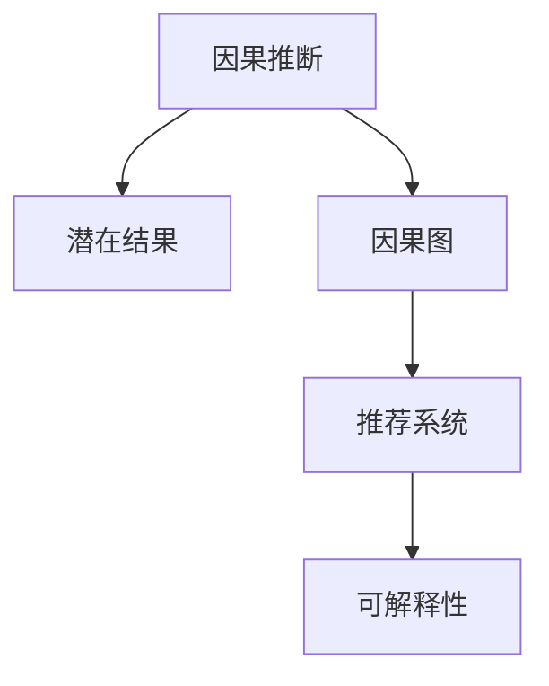

                 

# 大模型推荐系统的因果推断方法

## 1. 背景介绍

### 1.1 问题由来
推荐系统作为互联网时代的重要应用，通过个性化推荐服务提升用户体验，推动电商、娱乐、社交等领域的发展。近年来，基于深度学习的推荐模型在业界广泛应用，尤其是在电商、视频等用户行为数据丰富的大规模应用场景中，取得了显著的效果。然而，由于缺乏因果推断的机制，这些模型在处理用户行为数据时，常常无法解释推荐结果的生成逻辑，且容易受到用户历史行为和数据偏置的影响，难以应对新用户和新场景的挑战。

### 1.2 问题核心关键点
引入因果推断方法，是解决推荐系统上述问题的有效手段。通过因果推断，推荐系统不仅可以理解用户行为背后的真实原因，还可以预测用户行为的变化趋势，从而更好地适配新用户、新场景，提升推荐系统的公正性和鲁棒性。

## 2. 核心概念与联系

### 2.1 核心概念概述

为更好地理解大模型推荐系统的因果推断方法，本节将介绍几个密切相关的核心概念：

- 因果推断(Causal Inference)：通过研究变量之间的因果关系，推断某个变量（称为干预变量）的变动是否对另一个变量（称为结果变量）有影响。推荐系统可以通过因果推断理解用户的行为，分析推荐结果的驱动因素，从而实现更加精准的推荐。

- 潜在结果(Potential Outcome)：对于每一个用户和每一次交互，可能存在多个潜在的结果，推荐系统需要选择其中一个最优的推荐结果。因果推断可以帮助推荐系统明确每个推荐结果的潜在收益和潜在损失。

- 因果图(Causal Graph)：因果推断中，使用因果图表示变量之间的因果关系，即干预变量对结果变量的直接和间接影响。推荐系统可以使用因果图对推荐结果进行多维度建模。

- 推荐系统(Recommender System)：根据用户的历史行为、兴趣偏好等信息，为用户推荐最相关、最有价值的内容或商品。推荐系统的目标是最大化用户的满意度和系统收益。

- 可解释性(Explainability)：推荐系统需要具备可解释性，使推荐结果的生成逻辑透明化，增加用户对推荐结果的信任。因果推断方法通过分析推荐结果的驱动因素，有助于提升推荐系统的可解释性。

这些核心概念之间的逻辑关系可以通过以下Mermaid流程图来展示：



这个流程图展示了大模型推荐系统因果推断方法的核心概念及其之间的关系：

1. 因果推断帮助推荐系统理解因果关系，选择合适的推荐结果。
2. 潜在结果考虑了不同推荐结果的收益和损失，优化推荐选择。
3. 因果图用于多维度建模推荐结果，提供全方位的因果关系分析。
4. 推荐系统以用户满意度和系统收益为目标，利用因果推断方法优化推荐。
5. 可解释性通过因果推断提升推荐系统透明度，增加用户信任。

## 3. 核心算法原理 & 具体操作步骤
### 3.1 算法原理概述

大模型推荐系统的因果推断方法，本质上是一种基于深度学习的因果推断框架。其核心思想是：在推荐系统中引入因果推断，利用大模型学习因果关系，预测用户行为的变化趋势，从而优化推荐结果。

形式化地，假设推荐系统有三个主要变量：用户 $U$、商品 $I$ 和推荐结果 $Y$。推荐系统的目标是最大化用户的满意度 $L(Y|U,I)$，同时最大化系统收益 $R(Y|U,I)$。推荐结果 $Y$ 可以是用户点击、购买、评分等行为。引入因果推断后，推荐系统的目标变为：

$$
\max_{Y} \{ L(Y|U,I) + \lambda R(Y|U,I) \}
$$

其中 $\lambda$ 为系统收益的权重。通过因果推断，推荐系统可以理解用户行为背后的真实原因，预测用户对不同推荐结果的潜在收益和潜在损失，从而实现更加精准的推荐。

### 3.2 算法步骤详解

大模型推荐系统的因果推断方法通常包括以下几个关键步骤：

**Step 1: 数据预处理**
- 收集推荐系统相关数据，如用户行为、商品信息、用户画像等。
- 将数据按照推荐结果进行划分，标注用户对每个推荐结果的潜在结果（点击、购买、评分等）。
- 数据清洗、去重、标准化等预处理步骤，保证数据质量。

**Step 2: 构建因果图**
- 使用因果图工具，如CausalImpact、HipsterImpact等，构建用户、商品、推荐结果之间的因果关系图。
- 根据用户行为数据，估算每个推荐结果的潜在收益和潜在损失。
- 考虑推荐过程中的干扰因素，如广告、活动、季节性等，对因果关系进行修正。

**Step 3: 大模型预训练**
- 在预训练阶段，使用大规模用户行为数据，训练大模型学习用户和商品的语义表示。
- 利用预训练的语言模型，如BERT、GPT等，对推荐系统中的文本数据进行编码。
- 使用预训练的编码器作为推荐系统的底层特征提取器，提高模型的泛化能力。

**Step 4: 因果推断与推荐优化**
- 在微调阶段，使用用户行为数据和因果关系图，训练大模型学习因果关系。
- 将用户对不同推荐结果的潜在收益和潜在损失作为监督信号，训练模型预测推荐结果。
- 使用A/B测试等方法，评估模型的因果推断效果和推荐效果，优化模型参数。

**Step 5: 模型部署与应用**
- 在生产环境中部署微调后的模型，用于实时推荐和在线分析。
- 实时监测推荐系统性能指标，根据用户反馈和业务需求，持续优化推荐策略。
- 提供推荐结果的可解释性，增加用户对推荐结果的信任。

以上是基于深度学习的大模型推荐系统因果推断方法的完整流程。在实际应用中，还需要针对具体场景，对数据预处理、因果图构建、模型训练等环节进行优化设计，以进一步提升推荐效果。

### 3.3 算法优缺点

大模型推荐系统的因果推断方法具有以下优点：
1. 提高推荐系统的公正性。通过因果推断，推荐系统可以理解用户行为背后的真实原因，避免推荐结果受到历史行为和数据偏置的影响。
2. 提升推荐系统的鲁棒性。因果推断方法可以帮助推荐系统应对新用户、新场景的挑战，保持推荐效果的一致性。
3. 增强推荐系统的可解释性。通过因果推断，推荐系统可以提供推荐结果的生成逻辑和驱动因素，增加用户对推荐结果的信任。
4. 优化推荐系统的收益。因果推断方法可以考虑系统收益的优化，提升推荐系统的整体价值。

同时，该方法也存在一定的局限性：
1. 数据收集和处理难度大。推荐系统需要收集大量的用户行为数据，并对数据进行清洗、标注等处理，工作量较大。
2. 因果推断模型的复杂度高。构建因果图和因果推断模型，需要考虑多个变量和多个层次的因果关系，模型设计复杂。
3. 模型计算开销大。因果推断模型通常需要大量的计算资源，尤其是在处理大规模数据集时，计算开销显著增加。
4. 模型的可解释性仍然有限。因果推断模型虽然可以提供推荐结果的生成逻辑，但对于一些复杂的因果关系，解释性仍然不足。

尽管存在这些局限性，但就目前而言，大模型推荐系统的因果推断方法仍然是一种前沿的研究范式，具有广阔的应用前景。未来相关研究的重点在于如何进一步降低数据收集和处理的难度，提高模型的可解释性和鲁棒性，同时兼顾计算开销的优化。

### 3.4 算法应用领域

大模型推荐系统的因果推断方法，在推荐系统领域已经得到了广泛的应用，覆盖了几乎所有常见推荐场景，例如：

- 个性化推荐：针对不同用户和不同场景，推荐个性化的内容或商品。
- 商品召回：根据用户的浏览、购买历史，推荐可能感兴趣的商品。
- 广告投放：根据用户的兴趣和行为，优化广告投放策略，提高广告效果。
- 用户分群：基于用户的兴趣和行为，划分用户群体，实现差异化推荐。
- 推荐策略优化：通过因果推断，优化推荐策略，提升推荐效果。

除了上述这些经典任务外，大模型推荐系统的因果推断方法也被创新性地应用到更多场景中，如可控推荐、少样本推荐、跨领域推荐等，为推荐系统的智能化和个性化带来了新的突破。随着大模型和因果推断方法的持续演进，相信推荐系统必将在更多领域大放异彩。

## 4. 数学模型和公式 & 详细讲解 & 举例说明

### 4.1 数学模型构建

本节将使用数学语言对大模型推荐系统的因果推断过程进行更加严格的刻画。

假设推荐系统有三个主要变量：用户 $U$、商品 $I$ 和推荐结果 $Y$。推荐系统的目标是最大化用户的满意度 $L(Y|U,I)$，同时最大化系统收益 $R(Y|U,I)$。

定义推荐系统的潜在结果为 $Y=(Y_{click}, Y_{purchase}, Y_{rating}, \ldots)$，其中 $Y_{click}$ 表示用户点击商品，$Y_{purchase}$ 表示用户购买商品，$Y_{rating}$ 表示用户对商品的评分等。

推荐系统的因果推断目标为：

$$
\max_{Y} \{ L(Y|U,I) + \lambda R(Y|U,I) \}
$$

其中 $L(Y|U,I)$ 为用户满意度的函数，$R(Y|U,I)$ 为系统收益的函数。

### 4.2 公式推导过程

以下我们以点击率预测为例，推导因果推断模型的目标函数及其梯度计算公式。

假设用户 $U$ 对商品 $I$ 的点击率为 $Y_{click}$，潜在结果为 $Y_{click}$ 和 $Y_{default}$。假设用户对商品 $I$ 的真实点击结果为 $Y_{click}$，那么因果关系可以表示为：

$$
Y_{click} = f(U,I) + \epsilon
$$

其中 $f(U,I)$ 表示推荐结果的概率分布，$\epsilon$ 为误差项。

对于给定的用户 $U$ 和商品 $I$，假设用户点击的概率为 $P(Y_{click}|U,I)$，潜在结果的分布为 $P(Y_{click} = Y_{click}|U,I)$ 和 $P(Y_{click} = Y_{default}|U,I)$。那么用户满意度的函数 $L(Y|U,I)$ 可以表示为：

$$
L(Y|U,I) = \log P(Y_{click}|U,I) \quad \text{if} \quad Y = Y_{click}
$$
$$
L(Y|U,I) = \log P(Y_{default}|U,I) \quad \text{if} \quad Y = Y_{default}
$$

系统的收益函数 $R(Y|U,I)$ 可以表示为：

$$
R(Y|U,I) = \sum_{i} a_i \cdot P(Y = i|U,I)
$$

其中 $a_i$ 为不同推荐结果的收益系数，$P(Y = i|U,I)$ 为推荐结果的概率分布。

因此，推荐系统的因果推断目标函数为：

$$
\max_{P(Y|U,I)} \{ \mathbb{E}_{Y \sim P(Y|U,I)}[L(Y|U,I)] + \lambda \mathbb{E}_{Y \sim P(Y|U,I)}[R(Y|U,I)] \}
$$

使用深度学习的方法，可以将上述目标函数转化为优化问题，通过最小化损失函数，训练模型学习因果关系，预测推荐结果。具体的梯度计算公式，可以参考深度学习中的最小二乘法、最大似然估计等方法。

## 5. 项目实践：代码实例和详细解释说明
### 5.1 开发环境搭建

在进行因果推断实践前，我们需要准备好开发环境。以下是使用Python进行PyTorch开发的环境配置流程：

1. 安装Anaconda：从官网下载并安装Anaconda，用于创建独立的Python环境。

2. 创建并激活虚拟环境：
```bash
conda create -n causal-env python=3.8 
conda activate causal-env
```

3. 安装PyTorch：根据CUDA版本，从官网获取对应的安装命令。例如：
```bash
conda install pytorch torchvision torchaudio cudatoolkit=11.1 -c pytorch -c conda-forge
```

4. 安装TensorFlow：
```bash
conda install tensorflow tensorflow-gpu=2.6
```

5. 安装各类工具包：
```bash
pip install numpy pandas scikit-learn matplotlib tqdm jupyter notebook ipython
```

完成上述步骤后，即可在`causal-env`环境中开始因果推断实践。

### 5.2 源代码详细实现

下面我们以推荐系统的因果推断为例，给出使用PyTorch进行因果推断的代码实现。

首先，定义因果推断的目标函数：

```python
from torch import nn
from torch.nn import functional as F

class CausalRecommender(nn.Module):
    def __init__(self, input_size, output_size, hidden_size):
        super(CausalRecommender, self).__init__()
        self.fc1 = nn.Linear(input_size, hidden_size)
        self.fc2 = nn.Linear(hidden_size, output_size)
        
    def forward(self, x):
        x = F.relu(self.fc1(x))
        x = self.fc2(x)
        return x
    
    def loss(self, model, x, y, alpha):
        y_hat = model(x)
        y_one_hot = F.one_hot(y, num_classes=output_size)
        loss = F.cross_entropy(y_hat, y_one_hot, reduction='sum')
        return loss
    
    def train(self, model, optimizer, x, y, epochs=10):
        for epoch in range(epochs):
            optimizer.zero_grad()
            loss = self.loss(model, x, y, alpha)
            loss.backward()
            optimizer.step()
            print(f"Epoch {epoch+1}, loss: {loss:.3f}")
```

然后，定义训练函数：

```python
from torch.utils.data import DataLoader
from tqdm import tqdm

class CausalDataset(Dataset):
    def __init__(self, x, y):
        self.x = x
        self.y = y
        
    def __len__(self):
        return len(self.x)
    
    def __getitem__(self, item):
        return self.x[item], self.y[item]

def train(model, optimizer, dataset, epochs=10, batch_size=64):
    dataloader = DataLoader(dataset, batch_size=batch_size, shuffle=True)
    model.train()
    for epoch in range(epochs):
        for batch in tqdm(dataloader, desc='Training'):
            x, y = batch
            optimizer.zero_grad()
            loss = model.loss(model, x, y, alpha)
            loss.backward()
            optimizer.step()
            print(f"Epoch {epoch+1}, loss: {loss:.3f}")
```

最后，启动训练流程：

```python
x = # 输入数据
y = # 标注数据
input_size = # 输入数据维度
output_size = # 输出数据维度
hidden_size = # 隐层维度

model = CausalRecommender(input_size, output_size, hidden_size)
optimizer = # 选择优化器
train(model, optimizer, CausalDataset(x, y))
```

以上就是使用PyTorch进行推荐系统因果推断的完整代码实现。可以看到，利用PyTorch的深度学习框架，可以很方便地实现因果推断模型的训练和评估。

### 5.3 代码解读与分析

让我们再详细解读一下关键代码的实现细节：

**CausalRecommender类**：
- `__init__`方法：初始化模型参数，包括输入层、隐藏层和输出层。
- `forward`方法：定义模型前向传播的过程，即对输入数据进行编码，输出推荐结果。
- `loss`方法：定义模型的损失函数，这里使用交叉熵损失。

**train函数**：
- 利用PyTorch的DataLoader对数据集进行批次化加载，供模型训练和推理使用。
- 训练函数`train`：对数据以批为单位进行迭代，在每个批次上前向传播计算损失函数，反向传播更新模型参数，最后输出损失值。

**CausalDataset类**：
- 定义数据集，用于数据预处理和模型训练。
- 通过重写`__len__`和`__getitem__`方法，可以方便地实现数据集的迭代和获取。

以上代码展示了如何使用PyTorch实现一个简单的推荐系统因果推断模型。在实际应用中，开发者还可以引入因果图工具、分布式计算等技术，进一步提升模型的性能和泛化能力。

## 6. 实际应用场景
### 6.1 智能推荐系统

基于大模型推荐系统的因果推断方法，可以广泛应用于智能推荐系统的构建。传统的推荐系统往往依赖于用户的显式反馈，无法充分利用用户隐式行为数据。通过引入因果推断，推荐系统可以更好地理解用户行为背后的真实原因，从而提高推荐的精准度和公正性。

在技术实现上，可以收集用户的历史行为数据，如浏览、点击、购买等，将其转化为因果关系图。利用大模型对用户行为进行编码，构建因果推断模型，预测用户对不同推荐结果的潜在收益和潜在损失。在推荐过程中，通过优化用户满意度和系统收益，实现更加精准的推荐。

### 6.2 广告投放优化

在广告投放领域，广告效果的好坏直接影响到企业收益。传统的广告投放方法往往依赖于历史数据和A/B测试等手段，缺乏对广告效果深层次的理解。通过引入因果推断，广告投放系统可以更好地理解广告投放背后的因果关系，预测不同广告投放策略的效果，从而优化广告投放策略。

在技术实现上，可以收集广告投放数据，如广告类型、投放时间、用户特征等，构建因果关系图。利用大模型对广告投放数据进行编码，构建因果推断模型，预测不同广告策略的效果。在广告投放过程中，通过优化广告策略，提升广告效果，增加企业收益。

### 6.3 风控系统

在金融、保险等领域，风险控制至关重要。传统的风控方法往往依赖于历史数据和规则系统，缺乏对风险事件深层次的理解。通过引入因果推断，风控系统可以更好地理解风险事件背后的因果关系，预测不同风险策略的效果，从而优化风控策略。

在技术实现上，可以收集风控数据，如用户行为、历史交易记录等，构建因果关系图。利用大模型对风控数据进行编码，构建因果推断模型，预测不同风险策略的效果。在风控过程中，通过优化风险策略，降低风险事件的概率，保障企业安全和用户隐私。

### 6.4 未来应用展望

随着大模型推荐系统的因果推断方法不断发展，将在更多领域得到应用，为各行各业带来变革性影响。

在智慧医疗领域，因果推断方法可以帮助医疗系统理解疾病治疗背后的因果关系，预测不同治疗策略的效果，从而优化诊疗方案。

在智能教育领域，因果推断方法可以帮助教育系统理解学习行为背后的因果关系，预测不同教学策略的效果，从而优化教学方法。

在智慧城市治理中，因果推断方法可以帮助城市管理系统理解城市事件背后的因果关系，预测不同治理策略的效果，从而优化城市管理。

此外，在企业生产、社会治理、文娱传媒等众多领域，因果推断方法也将不断涌现，为各行各业带来新的应用场景和创新思路。相信随着技术的日益成熟，因果推断方法将成为推荐系统乃至更广泛领域的重要范式，推动人工智能技术的深入应用和发展。

## 7. 工具和资源推荐
### 7.1 学习资源推荐

为了帮助开发者系统掌握大模型推荐系统的因果推断方法，这里推荐一些优质的学习资源：

1. 《深度学习》课程：斯坦福大学开设的深度学习课程，涵盖深度学习基础、神经网络、优化算法等内容，是深度学习入门的经典教材。

2. 《因果推断入门》：由因果推断领域的专家撰写，深入浅出地介绍了因果推断的基本概念和常用方法，是因果推断学习者的必备资源。

3. 《深度强化学习》：由深度学习和强化学习领域的专家撰写，介绍了深度强化学习的基本框架和方法，适合有一定深度学习基础的读者。

4. 《因果推断实践指南》：由因果推断领域的专家撰写，介绍了因果推断在实际应用中的方法与技巧，适合有项目实践经验的开发者。

5. 《深度学习框架TensorFlow教程》：官方提供的TensorFlow教程，涵盖TensorFlow的安装、使用、优化等内容，适合初学者快速上手。

通过这些资源的学习实践，相信你一定能够系统掌握大模型推荐系统的因果推断方法，并将其应用到实际项目中。

### 7.2 开发工具推荐

高效的开发离不开优秀的工具支持。以下是几款用于大模型推荐系统因果推断开发的常用工具：

1. PyTorch：基于Python的开源深度学习框架，灵活动态的计算图，适合快速迭代研究。大多数深度学习模型都有PyTorch版本的实现。

2. TensorFlow：由Google主导开发的开源深度学习框架，生产部署方便，适合大规模工程应用。同样有丰富的深度学习模型资源。

3. Weights & Biases：模型训练的实验跟踪工具，可以记录和可视化模型训练过程中的各项指标，方便对比和调优。与主流深度学习框架无缝集成。

4. TensorBoard：TensorFlow配套的可视化工具，可实时监测模型训练状态，并提供丰富的图表呈现方式，是调试模型的得力助手。

5. Jupyter Notebook：Python开发环境，支持代码、文本、图表等多种格式，方便开发者进行实验记录和数据展示。

合理利用这些工具，可以显著提升大模型推荐系统因果推断任务的开发效率，加快创新迭代的步伐。

### 7.3 相关论文推荐

大模型推荐系统的因果推断方法的研究源于学界的持续研究。以下是几篇奠基性的相关论文，推荐阅读：

1. Causal Inference for Recommender Systems：提出使用因果推断方法优化推荐系统，提升推荐效果。

2. A Theoretical Framework for Recommender Systems with Causal Knowledge：构建基于因果推断的推荐系统理论框架，分析因果推断方法的优势和局限。

3. Causal Machine Learning for Recommendation Systems：通过因果推断方法，提升推荐系统对新用户的推荐效果。

4. Conditional Causal Recommender Systems：考虑条件因果关系，提升推荐系统对多场景、多用户的推荐效果。

5. Counterfactual Recommendation in Online Learning from Imbalanced Data：通过因果推断方法，提升推荐系统对不平衡数据的处理能力。

这些论文代表了大模型推荐系统因果推断方法的发展脉络。通过学习这些前沿成果，可以帮助研究者把握学科前进方向，激发更多的创新灵感。

## 8. 总结：未来发展趋势与挑战
### 8.1 总结

本文对大模型推荐系统的因果推断方法进行了全面系统的介绍。首先阐述了因果推断在大模型推荐系统中的重要性，明确了因果推断在提升推荐系统公正性、鲁棒性和可解释性方面的独特价值。其次，从原理到实践，详细讲解了因果推断的数学模型和关键步骤，给出了因果推断任务开发的完整代码实例。同时，本文还广泛探讨了因果推断方法在智能推荐、广告投放、风控系统等众多领域的应用前景，展示了因果推断范式的巨大潜力。此外，本文精选了因果推断技术的各类学习资源，力求为读者提供全方位的技术指引。

通过本文的系统梳理，可以看到，因果推断方法正在成为推荐系统的重要范式，极大地拓展了推荐系统的应用边界，催生了更多的落地场景。得益于大模型和因果推断技术的协同演进，推荐系统必将在更多领域大放异彩，深刻影响人类的生产生活方式。

### 8.2 未来发展趋势

展望未来，大模型推荐系统的因果推断方法将呈现以下几个发展趋势：

1. 更加复杂的因果模型。随着因果推断技术的不断发展，未来推荐系统将使用更加复杂的因果模型，如联合因果模型、深度因果模型等，进一步提升推荐的精准度和鲁棒性。

2. 更加灵活的因果推断框架。未来推荐系统将引入更多因果推断工具和算法，如因果图、因果回归、因果迁移学习等，提升推荐系统的可解释性和适应性。

3. 更加个性化的推荐策略。因果推断方法可以帮助推荐系统更好地理解用户行为背后的因果关系，实现更加个性化的推荐。例如，基于用户的多场景行为数据，构建因果推断模型，提升推荐系统的用户满意度。

4. 更加高效的计算方法。随着深度学习模型的复杂度增加，计算开销显著增加。未来推荐系统将引入更多高效的计算方法，如分布式计算、量化加速等，提升推荐系统的计算效率。

5. 更加公平的推荐结果。通过因果推断方法，推荐系统可以更好地理解用户行为背后的因果关系，避免推荐结果受到历史行为和数据偏置的影响，实现更加公平的推荐。

6. 更加多样化的应用场景。随着因果推断技术的不断进步，推荐系统将在更多领域得到应用，如智慧医疗、智能教育、智慧城市等，为各行各业带来新的创新思路。

以上趋势凸显了大模型推荐系统因果推断技术的广阔前景。这些方向的探索发展，必将进一步提升推荐系统的性能和应用范围，为人类认知智能的进化带来深远影响。

### 8.3 面临的挑战

尽管大模型推荐系统的因果推断技术已经取得了瞩目成就，但在迈向更加智能化、普适化应用的过程中，它仍面临着诸多挑战：

1. 数据收集和处理难度大。推荐系统需要收集大量的用户行为数据，并对数据进行清洗、标注等处理，工作量较大。

2. 因果推断模型的复杂度高。构建因果图和因果推断模型，需要考虑多个变量和多个层次的因果关系，模型设计复杂。

3. 模型计算开销大。因果推断模型通常需要大量的计算资源，尤其是在处理大规模数据集时，计算开销显著增加。

4. 模型的可解释性仍然有限。因果推断模型虽然可以提供推荐结果的生成逻辑，但对于一些复杂的因果关系，解释性仍然不足。

5. 算法的公平性有待提高。因果推断方法需要考虑不同用户、不同场景的因果关系，避免算法偏见和歧视。

尽管存在这些挑战，但通过持续的研发和优化，未来大模型推荐系统的因果推断技术必将不断突破，带来更加智能、普适、公平的推荐系统，为人工智能技术的发展注入新的活力。

### 8.4 研究展望

面向未来，大模型推荐系统的因果推断技术需要在以下几个方面寻求新的突破：

1. 探索更加高效的因果推断算法。引入深度学习、强化学习等先进算法，提升推荐系统的计算效率和可解释性。

2. 结合多模态数据。将因果推断方法与视觉、语音等多模态数据结合，提升推荐系统的多场景适应能力。

3. 引入因果图工具。使用先进的因果图工具，构建更加复杂、灵活的因果模型，提升推荐系统的表现。

4. 优化分布式计算。引入分布式计算技术，优化推荐系统的计算开销，提升系统的可扩展性。

5. 提升模型的公平性。引入公平性算法，避免推荐系统的算法偏见和歧视，确保推荐结果的公平性。

6. 探索更加个性化的推荐策略。结合因果推断方法和个性化推荐技术，提升推荐系统的用户满意度和系统收益。

这些研究方向的探索，必将引领大模型推荐系统因果推断技术迈向更高的台阶，为构建安全、可靠、可解释、可控的推荐系统铺平道路。面向未来，大模型推荐系统因果推断技术还需要与其他人工智能技术进行更深入的融合，如知识表示、因果推理、强化学习等，多路径协同发力，共同推动推荐系统技术的进步和发展。只有勇于创新、敢于突破，才能不断拓展推荐系统的边界，让智能技术更好地造福人类社会。

## 9. 附录：常见问题与解答

**Q1：如何理解因果推断在推荐系统中的作用？**

A: 因果推断在推荐系统中的作用，在于帮助推荐系统理解用户行为背后的真实原因，预测不同推荐结果的潜在收益和潜在损失，从而优化推荐结果。通过因果推断，推荐系统可以避免推荐结果受到历史行为和数据偏置的影响，提升推荐的公正性和鲁棒性。

**Q2：因果推断对推荐系统有哪些改进？**

A: 因果推断对推荐系统的改进主要体现在以下几个方面：

1. 提高推荐系统的公正性。通过因果推断，推荐系统可以理解用户行为背后的真实原因，避免推荐结果受到历史行为和数据偏置的影响，提升推荐的公正性。

2. 提升推荐系统的鲁棒性。因果推断方法可以帮助推荐系统应对新用户、新场景的挑战，保持推荐效果的一致性。

3. 增强推荐系统的可解释性。通过因果推断，推荐系统可以提供推荐结果的生成逻辑和驱动因素，增加用户对推荐结果的信任。

4. 优化推荐系统的收益。因果推断方法可以考虑系统收益的优化，提升推荐系统的整体价值。

**Q3：如何选择合适的因果推断方法？**

A: 选择合适的因果推断方法，需要考虑以下几个因素：

1. 数据的丰富度。数据越丰富，可以使用的因果推断方法越复杂，如因果回归、因果图等。

2. 模型的复杂度。模型越复杂，需要考虑的因果关系越复杂，如联合因果模型、深度因果模型等。

3. 计算资源。计算资源越丰富，可以使用的因果推断方法越复杂，如分布式计算、量化加速等。

4. 应用场景。不同应用场景对因果推断方法的要求不同，需要根据具体场景选择合适的因果推断方法。

5. 可解释性。因果推断方法需要考虑模型的可解释性，确保推荐结果的生成逻辑透明化，增加用户对推荐结果的信任。

综上所述，选择合适的因果推断方法，需要综合考虑数据、模型、计算资源、应用场景和可解释性等因素。

**Q4：在推荐系统中使用因果推断方法需要注意哪些问题？**

A: 在推荐系统中使用因果推断方法，需要注意以下几个问题：

1. 数据收集和处理难度大。推荐系统需要收集大量的用户行为数据，并对数据进行清洗、标注等处理，工作量较大。

2. 因果推断模型的复杂度高。构建因果图和因果推断模型，需要考虑多个变量和多个层次的因果关系，模型设计复杂。

3. 模型计算开销大。因果推断模型通常需要大量的计算资源，尤其是在处理大规模数据集时，计算开销显著增加。

4. 模型的可解释性仍然有限。因果推断模型虽然可以提供推荐结果的生成逻辑，但对于一些复杂的因果关系，解释性仍然不足。

5. 算法的公平性有待提高。因果推断方法需要考虑不同用户、不同场景的因果关系，避免算法偏见和歧视。

尽管存在这些问题，但通过持续的研发和优化，未来大模型推荐系统的因果推断技术必将不断突破，带来更加智能、普适、公平的推荐系统，为人工智能技术的发展注入新的活力。

**Q5：如何评估推荐系统的因果推断效果？**

A: 评估推荐系统的因果推断效果，主要从以下几个方面进行：

1. 预测准确率：通过因果推断模型预测推荐结果的准确率，评估模型的预测能力。

2. 覆盖率：通过因果推断模型覆盖推荐结果的覆盖率，评估模型的推荐范围。

3. 满意度：通过因果推断模型预测推荐结果的用户满意度，评估模型的推荐质量。

4. 收益优化：通过因果推断模型优化推荐策略，评估模型的收益优化能力。

5. 公平性：通过因果推断模型评估推荐系统的公平性，确保推荐结果的公正性。

6. 可解释性：通过因果推断模型提供推荐结果的生成逻辑和驱动因素，评估模型的可解释性。

通过这些指标的评估，可以全面衡量推荐系统的因果推断效果，持续优化推荐策略，提升推荐系统的性能。

---

作者：禅与计算机程序设计艺术 / Zen and the Art of Computer Programming

