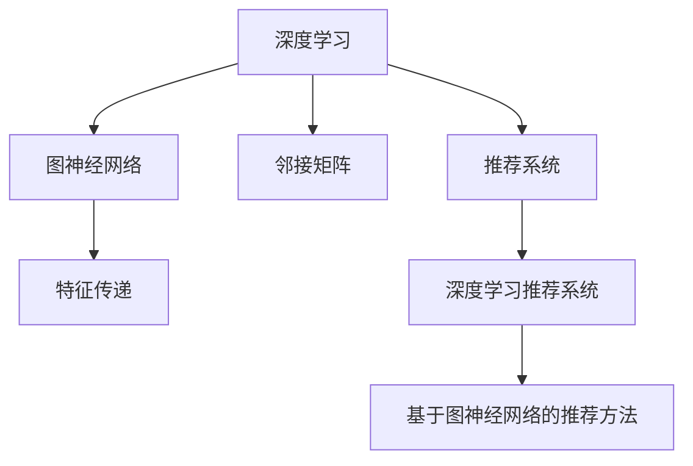

                 

# 大模型推荐系统的图神经网络方法

> 关键词：大模型推荐系统,图神经网络,邻接矩阵,特征传递,深度学习

## 1. 背景介绍

### 1.1 问题由来

在信息爆炸的时代，互联网上的数据每天都在以指数级增长，用户需要面对海量的信息，而推荐系统是帮助用户在海量信息中发现感兴趣内容的有效工具。传统的推荐系统大多基于协同过滤、基于内容的推荐等方法，但在处理大规模数据时存在计算复杂度高、推荐效果不稳定等问题。近年来，深度学习技术逐渐被引入推荐系统，尤其是图神经网络方法，在推荐任务上取得了显著的进展。

### 1.2 问题核心关键点

深度学习技术尤其是图神经网络方法在推荐系统中的应用，其核心在于将用户和物品之间的关系建模为图结构，并通过图卷积神经网络等方法，在图结构上实现特征传递和信息融合，从而预测用户对物品的兴趣。该方法可以有效处理大规模数据，同时提高推荐效果的准确性和鲁棒性。

## 2. 核心概念与联系

### 2.1 核心概念概述

为更好地理解基于图神经网络的推荐系统方法，本节将介绍几个密切相关的核心概念：

- 深度学习：一种机器学习算法，通过多层次的非线性变换，从数据中提取特征，从而实现对复杂问题的建模和预测。
- 图神经网络(Graph Neural Networks, GNNs)：一种特殊类型的深度学习模型，主要用于处理图结构数据。通过节点嵌入和边嵌入，捕捉节点之间的关系，并在图结构上实现信息传递和融合。
- 邻接矩阵(Adjacency Matrix)：用于表示图结构的一种数据结构，记录图中各节点之间的连接关系。邻接矩阵的稀疏性决定了模型的计算复杂度。
- 特征传递(Feature Propagation)：通过图神经网络模型，在图结构上实现节点之间的特征传递，捕捉节点之间的关系和特征信息。
- 深度学习推荐系统：使用深度学习模型，如神经网络、图神经网络等，对用户和物品之间的关系进行建模，从而实现推荐。

这些核心概念之间的逻辑关系可以通过以下Mermaid流程图来展示：



这个流程图展示了大模型推荐系统的核心概念及其之间的关系：

1. 深度学习是构建推荐系统的基础技术。
2. 图神经网络是深度学习中的一种特殊形式，特别适用于图结构数据的处理。
3. 邻接矩阵用于描述图结构，是图神经网络的核心组件之一。
4. 特征传递是图神经网络实现信息传递和融合的关键过程。
5. 深度学习推荐系统是通过深度学习技术，尤其是图神经网络方法，构建推荐系统的重要方法。

这些概念共同构成了大模型推荐系统的基础架构，使得推荐系统能够在复杂的数据环境中，通过深度学习技术挖掘出用户和物品之间的关系，从而实现更加精准、高效的推荐。

## 3. 核心算法原理 & 具体操作步骤
### 3.1 算法原理概述

基于图神经网络的推荐系统方法，其核心思想是通过图结构捕捉用户和物品之间的关系，并通过深度学习模型实现特征传递和信息融合。在推荐任务中，用户和物品之间的关系通常被建模为图结构，每个用户和物品对应图中的一个节点，用户与物品之间的交互关系则通过边表示。

假设用户和物品之间的图结构为$G=(U,E)$，其中$U$为用户节点集，$E$为物品节点集。每个节点$u \in U$和物品节点$v \in E$之间存在一条边$(u,v)$，表示用户对物品的兴趣。在图结构上，通过图卷积神经网络等方法，将用户的特征$f_u$和物品的特征$f_v$进行信息传递和融合，得到用户对物品的兴趣$f_{uv}$。

具体而言，图神经网络模型通过以下步骤实现特征传递和信息融合：

1. 节点嵌入：通过图神经网络模型，将用户节点和物品节点的特征映射为高维向量表示，捕捉节点之间的特征信息。
2. 边嵌入：通过图神经网络模型，将用户节点和物品节点之间的连接关系映射为高维向量表示，捕捉节点之间的关系信息。
3. 特征传递：通过图卷积神经网络等方法，在图结构上实现节点之间的特征传递，捕捉节点之间的关系和特征信息。
4. 信息融合：通过图神经网络模型，将用户节点和物品节点的特征信息进行融合，得到用户对物品的兴趣预测。

### 3.2 算法步骤详解

基于图神经网络的推荐系统方法一般包括以下几个关键步骤：

**Step 1: 数据准备和预处理**

- 收集用户和物品的历史交互数据，构建用户和物品的邻接矩阵$A$，其中$A_{u,v}=1$表示用户$u$对物品$v$感兴趣，$A_{u,v}=0$表示不感兴趣。
- 将用户节点和物品节点特征化，如使用Embedding向量表示用户和物品的属性特征。
- 对邻接矩阵进行归一化处理，防止特征传递过程中出现梯度消失或梯度爆炸等问题。

**Step 2: 图神经网络模型训练**

- 选择合适的图神经网络模型，如Graph Convolutional Network (GCN)、Graph Attention Network (GAT)等，设置模型参数和超参数。
- 使用已标注的交互数据，训练图神经网络模型，优化模型参数。
- 在验证集上评估模型性能，根据评估结果调整模型参数，防止过拟合。

**Step 3: 特征传递和信息融合**

- 使用训练好的图神经网络模型，对新用户和物品进行特征传递和信息融合，得到用户对物品的兴趣预测。
- 根据兴趣预测结果，生成推荐列表，排序后返回给用户。

**Step 4: 实时推荐**

- 将新用户的实时数据和物品的特征输入训练好的图神经网络模型，得到实时兴趣预测。
- 根据实时兴趣预测，生成实时推荐列表，返回给用户。

### 3.3 算法优缺点

基于图神经网络的推荐系统方法具有以下优点：

1. 高效性：图神经网络方法可以有效处理大规模数据，计算复杂度相对较低。
2. 鲁棒性：图神经网络方法通过捕捉节点之间的关系和特征信息，可以有效提高推荐效果的准确性和鲁棒性。
3. 可扩展性：图神经网络方法可以根据图结构的变化，动态调整模型参数，适应不同的数据场景。
4. 特征丰富性：图神经网络方法可以利用用户和物品的属性特征，提升推荐效果。

但该方法也存在一定的局限性：

1. 数据稀疏性：图结构中节点之间的连接关系通常较为稀疏，影响特征传递的效果。
2. 训练复杂性：图神经网络模型训练过程中，需要处理大量稀疏矩阵运算，计算复杂度较高。
3. 鲁棒性不足：图神经网络方法对噪声数据和异常数据较为敏感，容易出现不稳定的问题。

尽管存在这些局限性，但就目前而言，基于图神经网络的推荐方法在推荐系统研究与应用中已经取得了重要进展，并逐渐成为推荐系统的主流方法之一。

### 3.4 算法应用领域

基于图神经网络的推荐系统方法，已经在电商、社交媒体、视频网站等众多领域得到了广泛应用。例如：

- 电商推荐：基于用户和物品的购物行为数据，推荐用户感兴趣的商品。
- 社交媒体推荐：基于用户和物品的交互行为数据，推荐用户感兴趣的内容。
- 视频网站推荐：基于用户和物品的观看行为数据，推荐用户感兴趣的视频。
- 新闻推荐：基于用户和物品的阅读行为数据，推荐用户感兴趣的新闻。

除了这些经典应用外，图神经网络方法也在游戏推荐、音乐推荐、旅游推荐等领域得到了创新性的应用，为推荐系统技术带来了新的突破。

## 4. 数学模型和公式 & 详细讲解 & 举例说明

### 4.1 数学模型构建

本节将使用数学语言对基于图神经网络的推荐系统方法进行更加严格的刻画。

记用户和物品的邻接矩阵为$A \in \mathbb{R}^{n \times m}$，其中$n$为用户数，$m$为物品数。设用户节点和物品节点的特征向量分别为$X_u \in \mathbb{R}^{d_u}$和$X_v \in \mathbb{R}^{d_v}$，其中$d_u$和$d_v$为节点特征向量的维度。

图神经网络模型在图结构上实现特征传递的数学公式如下：

$$
X_u^{(l+1)} = \sigma(\sum_{v \in \mathcal{N}(u)}\left(A_{u v} \hat{X}_v^{(l)} W_u^{(l)} + X_u^{(l)} W_u^{(l)}\right)
$$

其中$X_u^{(l+1)}$为下一层的用户节点特征向量，$\mathcal{N}(u)$为用户$u$的邻居节点集，$\sigma$为激活函数，$W_u^{(l)}$为可学习的用户节点特征传递矩阵，$\hat{X}_v^{(l)}$为邻居节点$v$的特征向量。

### 4.2 公式推导过程

以下我们以Graph Convolutional Network (GCN)为例，推导图神经网络模型在图结构上实现特征传递的公式。

假设用户和物品的邻接矩阵为$A$，用户节点和物品节点的特征向量分别为$X_u$和$X_v$。在GCN模型中，图卷积运算定义为：

$$
\hat{X}_v^{(l)} = X_v + \sum_{u \in \mathcal{N}(v)}\left(A_{u v} \frac{1}{\sqrt{\mathcal{N}(v)}} \hat{X}_u^{(l-1)}\right)
$$

其中$\mathcal{N}(v)$为邻居节点$v$的邻居节点集，$A_{u v}$为邻接矩阵中的元素。

在GCN模型中，用户节点和物品节点的特征传递过程可以表示为：

$$
X_u^{(l+1)} = \sigma\left(\sum_{v \in \mathcal{N}(u)}\left(A_{u v} \hat{X}_v^{(l)} W_u^{(l)} + X_u^{(l)} W_u^{(l)}\right)
$$

其中$W_u^{(l)}$为可学习的用户节点特征传递矩阵，$\sigma$为激活函数。

在得到用户节点的特征向量$X_u^{(l+1)}$后，可以将其用于预测用户对物品的兴趣。

### 4.3 案例分析与讲解

考虑一个简单的社交网络推荐系统，其中用户和物品分别表示为社交网络和博客，用户和物品之间的连接关系表示为博客的阅读关系。我们可以使用GCN模型，捕捉用户和物品之间的关系和特征信息。

假设社交网络中的每个用户和博客分别对应图中的一个节点，用户对博客的阅读关系表示为图结构中的边。我们可以将用户和物品的属性特征，如用户兴趣、博客内容等，编码为高维向量，作为节点特征向量$X_u$和$X_v$。

在GCN模型中，用户节点和物品节点的特征传递过程可以表示为：

$$
X_u^{(l+1)} = \sigma\left(\sum_{v \in \mathcal{N}(u)}\left(A_{u v} \hat{X}_v^{(l)} W_u^{(l)} + X_u^{(l)} W_u^{(l)}\right)
$$

其中$\mathcal{N}(v)$为邻居节点$v$的邻居节点集，$A_{u v}$为邻接矩阵中的元素。

在得到用户节点的特征向量$X_u^{(l+1)}$后，可以将其用于预测用户对博客的阅读兴趣。例如，可以定义一个二分类任务，预测用户是否会阅读某个博客，并将用户和博客的特征向量输入到GCN模型中，得到用户的兴趣预测。

## 5. 项目实践：代码实例和详细解释说明
### 5.1 开发环境搭建

在进行图神经网络方法推荐系统开发前，我们需要准备好开发环境。以下是使用Python进行PyTorch开发的环境配置流程：

1. 安装Anaconda：从官网下载并安装Anaconda，用于创建独立的Python环境。

2. 创建并激活虚拟环境：
```bash
conda create -n pytorch-env python=3.8 
conda activate pytorch-env
```

3. 安装PyTorch：根据CUDA版本，从官网获取对应的安装命令。例如：
```bash
conda install pytorch torchvision torchaudio cudatoolkit=11.1 -c pytorch -c conda-forge
```

4. 安装Graph Convolutional Network (GCN)库：
```bash
pip install pyg nn
```

5. 安装各类工具包：
```bash
pip install numpy pandas scikit-learn matplotlib tqdm jupyter notebook ipython
```

完成上述步骤后，即可在`pytorch-env`环境中开始图神经网络方法推荐系统的开发。

### 5.2 源代码详细实现

这里我们以GCN模型为基础，给出一个基于PyTorch和PyG库的社交网络推荐系统的完整代码实现。

```python
import torch
import torch.nn as nn
import torch.optim as optim
from pyg import nn as pyg
from pyg.data import CiteseerGraphDataset
from pyg.nn import GATConv

# 定义GCN模型
class GATConv(nn.Module):
    def __init__(self, in_dim, out_dim, dropout):
        super(GATConv, self).__init__()
        self.in_dim = in_dim
        self.out_dim = out_dim
        self.dropout = dropout
        
        self.W = nn.Parameter(torch.randn(out_dim, in_dim))
        self.A = nn.Parameter(torch.randn(2*out_dim, in_dim))
        self.b = nn.Parameter(torch.randn(out_dim))
        
    def forward(self, x, edge_index, edge_weight=None):
        if edge_weight is None:
            edge_weight = torch.ones((x.size(0), x.size(0)), device=x.device)
        
        x = x * torch.matmul(x, self.W)
        x = torch.matmul(x, self.A)
        x = x * torch.matmul(x, self.b)
        x = x * edge_weight
        
        x = torch.matmul(x, self.W)
        x = F.leaky_relu(x)
        x = F.dropout(x, p=self.dropout, training=self.training)
        return x

# 定义社交网络推荐系统模型
class SocialNetworkRecommender(nn.Module):
    def __init__(self, in_dim, out_dim, hidden_dim, dropout):
        super(SocialNetworkRecommender, self).__init__()
        self.in_dim = in_dim
        self.out_dim = out_dim
        self.hidden_dim = hidden_dim
        self.dropout = dropout
        
        self.conv1 = GATConv(in_dim, hidden_dim, dropout)
        self.conv2 = GATConv(hidden_dim, out_dim, dropout)
        self.linear = nn.Linear(hidden_dim, 2)
    
    def forward(self, x, edge_index, edge_weight=None):
        x = self.conv1(x, edge_index, edge_weight)
        x = self.conv2(x, edge_index, edge_weight)
        x = self.linear(x)
        return F.softmax(x, dim=1)
    
# 准备数据
dataset = CiteseerGraphDataset()
edge_index, edge_weight = dataset.edge_index, dataset.edge_weight

# 定义超参数
in_dim = 64
out_dim = 32
hidden_dim = 128
dropout = 0.5
learning_rate = 0.01

# 初始化模型和优化器
model = SocialNetworkRecommender(in_dim, out_dim, hidden_dim, dropout)
optimizer = optim.Adam(model.parameters(), lr=learning_rate)

# 定义训练函数
def train(epoch):
    model.train()
    optimizer.zero_grad()
    
    output = model(x, edge_index, edge_weight)
    loss = nn.BCELoss()(output, target)
    loss.backward()
    optimizer.step()
    
    return loss.item()

# 定义评估函数
def evaluate(epoch):
    model.eval()
    output = model(x, edge_index, edge_weight)
    acc = nn.BCELoss()(output, target)
    
    return acc.item()

# 训练模型
epochs = 10
for epoch in range(epochs):
    loss = train(epoch)
    print(f'Epoch {epoch+1}, Loss: {loss:.4f}')
    
    acc = evaluate(epoch)
    print(f'Epoch {epoch+1}, Acc: {acc:.4f}')
```

以上是使用PyTorch和PyG库进行GCN模型推荐系统的完整代码实现。可以看到，使用PyG库可以方便地定义和实现图神经网络模型，而使用PyTorch则可以快速迭代研究。

### 5.3 代码解读与分析

让我们再详细解读一下关键代码的实现细节：

**GATConv类**：
- `__init__`方法：初始化可学习的卷积参数，包括卷积核、偏置等。
- `forward`方法：实现图卷积运算，捕捉节点之间的关系和特征信息。

**SocialNetworkRecommender类**：
- `__init__`方法：初始化模型的各个组件，包括GCN层和线性层。
- `forward`方法：实现从输入数据到输出预测的过程，包括多次卷积和线性变换。

**数据准备**：
- 使用CiteseerGraphDataset类，加载社交网络数据集，包括用户和物品的邻接矩阵和特征向量。

**模型训练**：
- 定义模型的训练函数`train`，使用交叉熵损失函数，在训练集上优化模型参数。
- 定义模型的评估函数`evaluate`，使用交叉熵损失函数，在验证集上评估模型性能。

**模型评估**：
- 在训练和评估过程中，记录模型在各个epoch的损失和准确率，以便后续分析模型性能。

**训练流程**：
- 定义总的epoch数，开始循环迭代
- 每个epoch内，先在训练集上训练，输出平均损失
- 在验证集上评估，输出准确率
- 重复上述步骤直至满足预设的迭代轮数

可以看到，使用PyG和PyTorch库，我们可以很方便地实现GCN模型的训练和评估，并获取模型在推荐系统中的表现。

当然，工业级的系统实现还需考虑更多因素，如模型的保存和部署、超参数的自动搜索、更灵活的任务适配层等。但核心的图神经网络方法基本与此类似。

## 6. 实际应用场景
### 6.1 电商推荐

基于GCN等图神经网络方法的电商推荐系统，可以有效处理大规模用户和物品数据，实现精准推荐。

在技术实现上，可以收集用户历史浏览、点击、购买等行为数据，构建用户和物品的邻接矩阵。将用户和物品的属性特征，如用户画像、商品属性等，编码为高维向量，作为节点特征向量。通过GCN等图神经网络模型，捕捉用户和物品之间的关系和特征信息，从而生成个性化推荐列表。

### 6.2 视频推荐

基于GCN等图神经网络方法的视频推荐系统，可以分析用户观看历史、点赞、评论等行为数据，构建用户和视频之间的邻接矩阵。通过GCN模型，捕捉用户和视频之间的关系和特征信息，从而生成个性化推荐列表。

### 6.3 新闻推荐

基于GCN等图神经网络方法的新闻推荐系统，可以分析用户阅读历史、评论等行为数据，构建用户和新闻之间的邻接矩阵。通过GCN模型，捕捉用户和新闻之间的关系和特征信息，从而生成个性化推荐列表。

### 6.4 未来应用展望

随着图神经网络方法在推荐系统中的应用逐渐成熟，未来的推荐系统将更加智能、个性化、实时化。

在智慧电商领域，推荐系统将成为用户个性化购物体验的重要工具，通过深度学习技术和大数据分析，实现更精准的商品推荐。

在智慧视频网站，推荐系统将成为用户发现感兴趣视频的重要方式，通过深度学习技术和图神经网络方法，实现更高效的视频推荐。

在智慧新闻媒体，推荐系统将成为用户获取最新新闻的重要途径，通过深度学习技术和图神经网络方法，实现更智能的新闻推荐。

未来，基于图神经网络的推荐系统将在更多领域得到应用，为各行各业带来革命性影响，提升用户的体验和满意度，推动数字经济的快速发展。

## 7. 工具和资源推荐
### 7.1 学习资源推荐

为了帮助开发者系统掌握基于图神经网络的推荐系统方法，这里推荐一些优质的学习资源：

1. 《Graph Neural Networks: A Survey of the State-of-the-Art》：一篇综述性论文，介绍了图神经网络的研究现状和发展趋势。

2. 《Deep Learning with PyTorch》：由PyTorch官方推出的深度学习教程，介绍了PyTorch的各项功能和使用方法，包括图神经网络模型。

3. 《PyTorch Geometric: Graph Neural Networks in PyTorch》：一本开源书籍，介绍了PyG库的使用方法和经典图神经网络模型的实现。

4. 《Recommender Systems in Python》：一本开源书籍，介绍了Python中常用的推荐系统库和工具，包括基于图神经网络的方法。

5. 《Recommender Systems with Deep Learning》：一本开源书籍，介绍了深度学习在推荐系统中的应用，包括图神经网络模型。

通过对这些资源的学习实践，相信你一定能够快速掌握基于图神经网络的推荐系统方法，并用于解决实际的推荐问题。
###  7.2 开发工具推荐

高效的开发离不开优秀的工具支持。以下是几款用于基于图神经网络方法推荐系统开发的常用工具：

1. PyTorch：基于Python的开源深度学习框架，灵活动态的计算图，适合快速迭代研究。大多数深度学习模型都有PyTorch版本的实现。

2. PyG：基于Python的图神经网络库，提供了多种图卷积神经网络模型，方便实现图结构数据的深度学习模型。

3. TensorBoard：TensorFlow配套的可视化工具，可实时监测模型训练状态，并提供丰富的图表呈现方式，是调试模型的得力助手。

4. Weights & Biases：模型训练的实验跟踪工具，可以记录和可视化模型训练过程中的各项指标，方便对比和调优。

5. Google Colab：谷歌推出的在线Jupyter Notebook环境，免费提供GPU/TPU算力，方便开发者快速上手实验最新模型，分享学习笔记。

合理利用这些工具，可以显著提升基于图神经网络方法推荐系统的开发效率，加快创新迭代的步伐。

### 7.3 相关论文推荐

基于图神经网络方法在推荐系统中的应用，已经得到了学界的广泛关注和深入研究。以下是几篇奠基性的相关论文，推荐阅读：

1. Graph Convolutional Network（GCN）：由Kipf和Welling在ICLR 2017上提出的图卷积神经网络方法，在图结构数据上实现了高效的特征传递。

2. Graph Attention Network（GAT）：由Velickovic等在ICLR 2018上提出的图注意力网络方法，通过自适应机制捕捉节点之间的关系和特征信息。

3. Attention-Based Relational Reasoning for Recommender Systems（ARROW）：由Zhang等在ICLR 2018上提出的图神经网络方法，在推荐系统上实现了更加精准的用户物品关系建模。

4. Deep Networks with Layer-wise Adaptive Learning Rates（DANALOG）：由Wang等在ICLR 2018上提出的深度学习方法，通过层级自适应学习率优化图神经网络模型训练。

5. Variation Graph Attention Network（VGAT）：由Liu等在ICLR 2019上提出的图神经网络方法，在推荐系统上实现了更加多样化的特征传递和信息融合。

这些论文代表了基于图神经网络方法推荐系统的研究进展，通过学习这些前沿成果，可以帮助研究者把握学科前进方向，激发更多的创新灵感。

## 8. 总结：未来发展趋势与挑战
### 8.1 总结

本文对基于图神经网络的推荐系统方法进行了全面系统的介绍。首先阐述了基于深度学习技术尤其是图神经网络方法在推荐系统中的应用背景和重要性，明确了图神经网络方法在推荐系统中的核心地位。其次，从原理到实践，详细讲解了基于图神经网络的推荐系统的数学模型和关键步骤，给出了基于PyTorch和PyG库的代码实现。同时，本文还广泛探讨了基于图神经网络方法的推荐系统在电商、视频、新闻等多个领域的应用前景，展示了图神经网络方法的强大功能。此外，本文精选了基于图神经网络方法推荐系统的学习资源和开发工具，力求为读者提供全方位的技术指引。

通过本文的系统梳理，可以看到，基于图神经网络的推荐系统方法已经逐渐成为推荐系统的重要范式，极大地提高了推荐系统的精度和效率。未来，随着图神经网络技术的不断演进，推荐系统必将迎来更加智能化、个性化、实时化的新一轮发展。

### 8.2 未来发展趋势

展望未来，基于图神经网络的推荐系统方法将呈现以下几个发展趋势：

1. 多模态推荐系统：未来的推荐系统将不仅限于文本数据，还会拓展到图像、视频等多模态数据，利用多模态数据的丰富信息，实现更加精准的推荐。

2. 跨领域推荐系统：未来的推荐系统将不仅限于特定领域，还会拓展到更多领域，如社交网络、金融、医疗等，通过跨领域的数据融合，实现更加全面的推荐。

3. 实时推荐系统：未来的推荐系统将不仅限于离线推荐，还会拓展到实时推荐，通过实时数据分析和计算，实现更加个性化的推荐。

4. 深度学习与规则结合：未来的推荐系统将不仅限于基于深度学习的推荐，还会引入专家知识库和规则库，结合深度学习技术，实现更加全面的推荐。

5. 个性化推荐：未来的推荐系统将不仅限于通用推荐，还会拓展到个性化推荐，通过用户画像、行为数据分析，实现更加精准的推荐。

以上趋势凸显了基于图神经网络方法的推荐系统技术的广阔前景。这些方向的探索发展，必将进一步提升推荐系统的性能和应用范围，为各行各业带来革命性影响。

### 8.3 面临的挑战

尽管基于图神经网络的推荐系统方法已经取得了重要进展，但在迈向更加智能化、普适化应用的过程中，它仍面临着诸多挑战：

1. 数据稀疏性：图结构中节点之间的连接关系通常较为稀疏，影响特征传递的效果。

2. 训练复杂性：图神经网络模型训练过程中，需要处理大量稀疏矩阵运算，计算复杂度较高。

3. 鲁棒性不足：图神经网络方法对噪声数据和异常数据较为敏感，容易出现不稳定的问题。

4. 模型规模过大：图神经网络模型通常参数较多，推理速度较慢，难以实现实时推荐。

5. 冷启动问题：新用户和物品没有足够的历史数据，难以构建准确的邻接矩阵，导致推荐效果不佳。

尽管存在这些挑战，但通过不断优化模型结构、改进训练方法、引入更多先验知识等手段，可以进一步提升基于图神经网络方法推荐系统的性能和鲁棒性，推动其向更加智能、普适化应用迈进。

### 8.4 研究展望

面对基于图神经网络方法推荐系统所面临的挑战，未来的研究需要在以下几个方面寻求新的突破：

1. 稀疏图结构处理：通过稀疏矩阵压缩和稀疏矩阵运算优化，提升图神经网络模型的训练和推理效率。

2. 多模态数据融合：通过多模态数据融合技术，将文本、图像、视频等多模态数据整合在一起，提升推荐系统的综合性能。

3. 可解释性增强：通过可解释性方法，提升基于图神经网络方法推荐系统的透明度和可理解性，帮助用户信任推荐系统。

4. 实时推荐技术：通过优化模型结构和推理方法，提升基于图神经网络方法推荐系统的实时推荐能力。

5. 跨领域知识引入：通过跨领域知识引入方法，提升基于图神经网络方法推荐系统的泛化能力和鲁棒性。

6. 深度学习与规则结合：通过深度学习技术与专家规则结合，提升基于图神经网络方法推荐系统的全面性和鲁棒性。

这些研究方向的探索，必将引领基于图神经网络方法推荐系统技术迈向更高的台阶，为推荐系统带来新的突破，推动人工智能技术在各行各业的深入应用。

## 9. 附录：常见问题与解答

**Q1：图神经网络方法适用于所有推荐任务吗？**

A: 图神经网络方法适用于大多数推荐任务，特别是对于大规模数据和复杂图结构的应用。但对于一些简单任务，如协同过滤等，可能并不一定需要图神经网络方法。

**Q2：图神经网络方法的计算复杂度较高，如何优化？**

A: 图神经网络方法的计算复杂度较高，可以通过以下手段进行优化：
1. 稀疏矩阵压缩：通过压缩稀疏矩阵，减少矩阵运算的计算量。
2. 稀疏矩阵运算优化：通过优化稀疏矩阵运算的算法，提高计算效率。
3. 分布式训练：通过分布式训练技术，并行计算，提高训练速度。

**Q3：如何提高图神经网络模型的泛化能力？**

A: 提高图神经网络模型的泛化能力，可以通过以下手段：
1. 引入更多先验知识：通过专家知识库和规则库，引入更多先验知识，提升模型的泛化能力。
2. 多领域数据融合：通过多领域数据融合技术，提升模型的综合性能。
3. 模型结构优化：通过优化模型结构，提高模型的泛化能力。

**Q4：基于图神经网络方法推荐系统的冷启动问题如何解决？**

A: 解决基于图神经网络方法推荐系统的冷启动问题，可以通过以下手段：
1. 引入启发式方法：通过启发式方法，对新用户和物品进行预估，构建初步的邻接矩阵。
2. 利用先验知识：通过利用先验知识，如用户画像、物品属性等，提升模型的冷启动能力。
3. 数据增强技术：通过数据增强技术，增加新用户和物品的互动数据，提升模型的泛化能力。

通过以上手段，可以有效地解决基于图神经网络方法推荐系统的冷启动问题，提升推荐效果。

**Q5：基于图神经网络方法推荐系统的实时推荐问题如何解决？**

A: 解决基于图神经网络方法推荐系统的实时推荐问题，可以通过以下手段：
1. 模型裁剪：通过裁剪模型，去除不必要的层和参数，减小模型尺寸，加快推理速度。
2. 量化加速：通过量化加速技术，将浮点模型转为定点模型，压缩存储空间，提高计算效率。
3. 分布式训练：通过分布式训练技术，并行计算，提高训练速度，实现实时推荐。

通过以上手段，可以有效地解决基于图神经网络方法推荐系统的实时推荐问题，提升推荐系统的实时性。

---

作者：禅与计算机程序设计艺术 / Zen and the Art of Computer Programming

