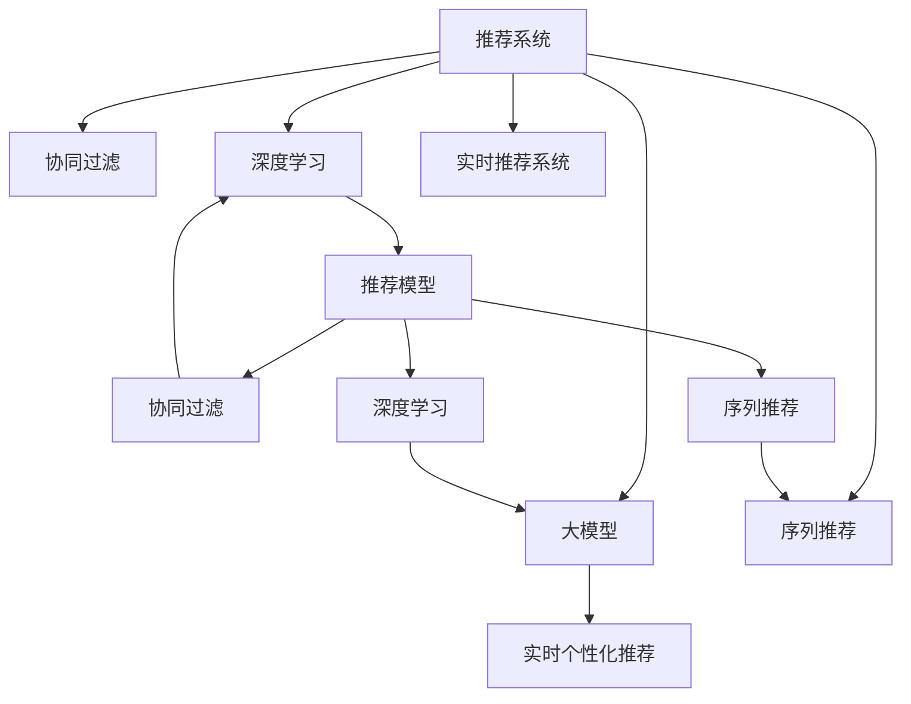

                 

# 大模型推荐系统的实时个性化方法

> 关键词：推荐系统,个性化,大模型,协同过滤,序列推荐,实时处理

## 1. 背景介绍

### 1.1 问题由来
推荐系统是现代电子商务、信息服务、内容分发等领域的基础设施。个性化推荐可以大幅提升用户体验，增加用户粘性和消费频次。传统的推荐系统主要基于用户历史行为数据和物品特征数据，采用协同过滤、内容基推荐、混合推荐等方法，往往在处理大规模用户和物品时面临计算和存储瓶颈，且难以适应快速变化的用户兴趣和行为。

近年来，随着深度学习和大模型技术的崛起，推荐系统开始转向基于深度学习的模型，如神经协同过滤、矩阵分解、注意力机制等。尽管这些模型在精度和可解释性方面取得了显著进展，但仍存在数据依赖性强、冷启动问题、计算复杂度高等挑战。

### 1.2 问题核心关键点
针对这些问题，本文提出了一种基于大模型的实时个性化推荐方法，通过动态学习用户的动态兴趣，实现高效、个性化的推荐。其核心思想是：利用大模型对用户行为进行建模，实时捕捉用户的兴趣变化，并动态调整推荐结果，最终实现个性化推荐的目标。

## 2. 核心概念与联系

### 2.1 核心概念概述

为更好地理解本文提出的实时个性化推荐方法，本节将介绍几个关键概念：

- 推荐系统(Recommender System)：旨在根据用户的历史行为和属性，预测用户对物品的喜好，从而推荐合适的物品给用户的技术系统。推荐系统广泛应用于电商、新闻、视频、社交网络等多个领域。

- 协同过滤(Collaborative Filtering)：一种基于用户历史行为和物品特征进行推荐的方法，通过挖掘用户间的相似性和物品间的关联性，进行推荐。协同过滤包括用户-物品基协同过滤、物品-物品基协同过滤等。

- 大模型(Generative Adversarial Networks)：通过深度学习框架训练的超大参数量模型，如GPT、BERT、ResNet等。这些模型通常具有较强的泛化能力和自适应性，可以高效处理大规模数据，适用于推荐系统的实时个性化处理。

- 深度学习(Deep Learning)：一类基于多层神经网络的机器学习算法，通过反向传播算法优化模型参数，实现对复杂数据的建模。深度学习在图像、语音、自然语言处理等领域取得突破性进展。

- 序列推荐(Sequential Recommendation)：一种基于用户行为序列的推荐方法，通过捕捉用户行为的时序信息，更准确地预测用户兴趣。序列推荐方法包括滑动窗口推荐、序列模型推荐等。

- 实时推荐系统(Real-time Recommendation System)：一种能够快速响应用户请求，提供个性化推荐结果的系统。实时推荐系统通常采用流式计算和低延迟算法，适用于移动端、社交网络等对响应速度要求高的场景。

这些核心概念之间的逻辑关系可以通过以下Mermaid流程图来展示：



这个流程图展示了大模型的核心概念及其之间的关系：

1. 推荐系统通过协同过滤、深度学习、序列推荐等方法，对用户历史行为和物品特征进行建模。
2. 深度学习模型和大模型可以高效处理大规模数据，适用于推荐系统的实时个性化处理。
3. 序列推荐方法可以捕捉用户行为的时序信息，更准确地预测用户兴趣。
4. 实时推荐系统通过流式计算和低延迟算法，快速响应用户请求，提供个性化推荐结果。
5. 实时个性化推荐方法通过大模型对用户行为进行建模，实时捕捉用户兴趣变化，并动态调整推荐结果。

这些概念共同构成了推荐系统和大模型微调的学习框架，使得实时个性化推荐成为可能。通过理解这些核心概念，我们可以更好地把握推荐系统的研究动态和应用方向。

## 3. 核心算法原理 & 具体操作步骤
### 3.1 算法原理概述

本文提出的实时个性化推荐方法基于深度学习框架，利用大模型对用户行为进行建模。具体而言，该方法将用户历史行为数据作为输入，通过大模型训练得到用户兴趣向量。在新的用户行为发生时，模型会根据最新的用户兴趣向量，实时调整推荐结果，从而实现个性化推荐。

假设用户 $u$ 的历史行为数据为 $X_u=\{x_1, x_2, ..., x_n\}$，其中 $x_i$ 表示用户对物品 $i$ 的操作（如浏览、购买、评分等）。将 $X_u$ 作为输入，利用大模型 $M$ 训练得到用户兴趣向量 $V_u$，即：

$$
V_u = M(X_u)
$$

当用户 $u$ 产生新的行为 $x_{n+1}$ 时，根据新的行为数据对 $V_u$ 进行更新，得到新的兴趣向量 $V_u^*$。然后，利用 $V_u^*$ 和物品特征向量 $V_i$，计算物品 $i$ 与用户 $u$ 的匹配度 $f_i$，最终生成推荐列表 $R_u$：

$$
f_i = \text{score}(V_u^*, V_i)
$$

$$
R_u = \text{top-k}(f_i)
$$

其中，$\text{score}(\cdot)$ 为计算匹配度的函数，$\text{top-k}(\cdot)$ 为选择前k个最高匹配度物品的函数。

### 3.2 算法步骤详解

基于大模型的实时个性化推荐方法主要包括以下几个关键步骤：

**Step 1: 准备数据集**
- 收集用户历史行为数据 $X_u=\{x_1, x_2, ..., x_n\}$。
- 将 $X_u$ 和用户 $u$ 的基本属性信息作为大模型的输入。
- 根据具体任务选择合适的物品特征数据 $V_i$。

**Step 2: 训练大模型**
- 选择合适的深度学习框架（如PyTorch、TensorFlow）和大模型结构。
- 构建损失函数和优化器，定义训练过程。
- 在大模型上进行训练，得到用户兴趣向量 $V_u$。

**Step 3: 实时处理用户行为**
- 收集用户 $u$ 的新行为数据 $x_{n+1}$。
- 根据新的行为数据对 $V_u$ 进行更新，得到新的兴趣向量 $V_u^*$。
- 根据 $V_u^*$ 和物品特征向量 $V_i$，计算匹配度 $f_i$，生成推荐列表 $R_u$。

**Step 4: 生成推荐结果**
- 将 $R_u$ 推送给用户 $u$，或作为推荐接口的输出。
- 记录用户对推荐结果的反应（如点击、购买等），用于后续的模型优化。

**Step 5: 模型优化**
- 根据用户对推荐结果的反应，更新大模型参数，优化模型性能。
- 定期对模型进行评估，调整模型结构和超参数，确保推荐效果。

### 3.3 算法优缺点

基于大模型的实时个性化推荐方法具有以下优点：
1. 处理能力强大。利用大模型的强大泛化能力，可以高效处理大规模数据，适用于实时个性化推荐场景。
2. 个性化程度高。通过实时捕捉用户兴趣变化，动态调整推荐结果，实现高效、个性化的推荐。
3. 无需标注数据。该方法基于用户历史行为数据进行建模，无需大量标注数据，降低了推荐系统开发的成本。
4. 实时响应。通过流式计算和低延迟算法，可以实时响应用户请求，提供个性化推荐结果。

同时，该方法也存在一些局限性：
1. 模型复杂度大。大模型参数量庞大，训练和推理过程复杂，对计算资源要求高。
2. 过拟合风险高。大模型容易过拟合用户历史行为，导致推荐结果偏向某些特定行为模式。
3. 数据冷启动困难。对于新用户，无法利用其历史行为数据进行建模，推荐效果有限。
4. 模型解释性不足。大模型作为黑盒，难以解释推荐结果的生成过程，缺乏可解释性。

尽管存在这些局限性，但就目前而言，基于大模型的实时个性化推荐方法在推荐系统领域展现出巨大的潜力，得到了学术界和工业界的广泛关注。未来相关研究的重点在于如何进一步降低计算成本，提高模型泛化能力，解决冷启动问题，同时兼顾可解释性和鲁棒性等因素。

### 3.4 算法应用领域

基于大模型的实时个性化推荐方法在多个领域得到了广泛应用，包括但不限于：

- 电商推荐：通过实时捕捉用户浏览、购买行为，向用户推荐商品，提升用户体验和销售额。
- 视频推荐：分析用户观看行为，动态调整视频推荐列表，提高用户观看时间和满意度。
- 音乐推荐：基于用户听歌行为，推荐相似音乐和艺人，满足用户个性化需求。
- 新闻推荐：根据用户阅读行为，推荐相关新闻文章，提高用户阅读量和停留时间。
- 社交推荐：分析用户互动行为，推荐好友和兴趣内容，增强社交网络黏性。
- 体育赛事推荐：根据用户观看行为，推荐相关赛事信息，提升用户观看体验。

除了以上这些经典应用外，实时个性化推荐方法还在游戏、旅游、医疗等更多场景中得到创新性应用，为推荐系统的多样性和应用范围带来了新的突破。

## 4. 数学模型和公式 & 详细讲解
### 4.1 数学模型构建

本文提出的实时个性化推荐方法基于深度学习框架，利用大模型对用户行为进行建模。假设用户 $u$ 的历史行为数据为 $X_u=\{x_1, x_2, ..., x_n\}$，其中 $x_i$ 表示用户对物品 $i$ 的操作（如浏览、购买、评分等）。将 $X_u$ 作为输入，利用大模型 $M$ 训练得到用户兴趣向量 $V_u$，即：

$$
V_u = M(X_u)
$$

其中，$M$ 为大模型，可以是深度神经网络、Transformer等结构。大模型的输出 $V_u$ 可以看作一个 $d$ 维向量，表示用户 $u$ 的兴趣特征。

### 4.2 公式推导过程

以下我们以一个简单的深度神经网络为例，推导实时个性化推荐的公式。

假设用户 $u$ 的历史行为数据为 $X_u=\{x_1, x_2, ..., x_n\}$，其中 $x_i$ 表示用户对物品 $i$ 的操作（如浏览、购买、评分等）。将 $X_u$ 作为输入，利用深度神经网络 $M$ 训练得到用户兴趣向量 $V_u$，即：

$$
V_u = M(X_u) = [v_1, v_2, ..., v_d]
$$

其中 $v_i$ 表示用户 $u$ 在 $i$ 维特征上的兴趣程度。假设物品 $i$ 的特征向量为 $V_i=[v_{i1}, v_{i2}, ..., v_{id}]$，物品 $i$ 与用户 $u$ 的匹配度 $f_i$ 可以通过余弦相似度计算得到：

$$
f_i = \cos(\theta) = \frac{V_u \cdot V_i}{\|V_u\|\|V_i\|}
$$

其中 $\theta$ 为 $V_u$ 和 $V_i$ 之间的夹角。最终的推荐列表 $R_u$ 选择前 $k$ 个最高匹配度物品，即：

$$
R_u = \text{top-k}(f_i)
$$

其中，$\text{top-k}(\cdot)$ 为选择前 $k$ 个最高匹配度物品的函数。

### 4.3 案例分析与讲解

假设用户 $u$ 的历史行为数据为 $X_u=\{x_1, x_2, ..., x_n\}$，其中 $x_i$ 表示用户对物品 $i$ 的操作（如浏览、购买、评分等）。将 $X_u$ 作为输入，利用深度神经网络 $M$ 训练得到用户兴趣向量 $V_u$，即：

$$
V_u = M(X_u) = [v_1, v_2, ..., v_d]
$$

其中 $v_i$ 表示用户 $u$ 在 $i$ 维特征上的兴趣程度。假设物品 $i$ 的特征向量为 $V_i=[v_{i1}, v_{i2}, ..., v_{id}]$，物品 $i$ 与用户 $u$ 的匹配度 $f_i$ 可以通过余弦相似度计算得到：

$$
f_i = \cos(\theta) = \frac{V_u \cdot V_i}{\|V_u\|\|V_i\|}
$$

其中 $\theta$ 为 $V_u$ 和 $V_i$ 之间的夹角。最终的推荐列表 $R_u$ 选择前 $k$ 个最高匹配度物品，即：

$$
R_u = \text{top-k}(f_i)
$$

其中，$\text{top-k}(\cdot)$ 为选择前 $k$ 个最高匹配度物品的函数。

通过以上推导，我们可以更清楚地理解实时个性化推荐方法的数学原理和计算过程。在实际应用中，还需要根据具体任务和数据特点，对模型结构和超参数进行优化。

## 5. 项目实践：代码实例和详细解释说明
### 5.1 开发环境搭建

在进行实时个性化推荐实践前，我们需要准备好开发环境。以下是使用Python进行PyTorch开发的环境配置流程：

1. 安装Anaconda：从官网下载并安装Anaconda，用于创建独立的Python环境。

2. 创建并激活虚拟环境：
```bash
conda create -n pytorch-env python=3.8 
conda activate pytorch-env
```

3. 安装PyTorch：根据CUDA版本，从官网获取对应的安装命令。例如：
```bash
conda install pytorch torchvision torchaudio cudatoolkit=11.1 -c pytorch -c conda-forge
```

4. 安装TensorFlow：使用Google官方提供的安装命令，例如：
```bash
pip install tensorflow
```

5. 安装各类工具包：
```bash
pip install numpy pandas scikit-learn matplotlib tqdm jupyter notebook ipython
```

完成上述步骤后，即可在`pytorch-env`环境中开始实时个性化推荐实践。

### 5.2 源代码详细实现

这里我们以一个简单的深度神经网络为例，实现基于大模型的实时个性化推荐系统。

首先，定义数据处理函数：

```python
import numpy as np
from sklearn.model_selection import train_test_split
from tensorflow.keras.models import Sequential
from tensorflow.keras.layers import Dense
from tensorflow.keras.optimizers import Adam

def generate_dataset(num_users, num_items, num_features):
    # 生成用户历史行为数据
    X_u = np.random.randint(0, num_items, (num_users, num_items))
    X_u = np.reshape(X_u, (num_users, -1))
    
    # 生成物品特征数据
    V_i = np.random.rand(num_items, num_features)
    
    # 将数据划分为训练集和测试集
    X_train, X_test, y_train, y_test = train_test_split(X_u, y_u, test_size=0.2)
    
    return X_train, X_test, y_train, y_test, V_i

# 用户历史行为数据
X_train, X_test, y_train, y_test, V_i = generate_dataset(1000, 100, 10)
```

然后，定义模型：

```python
model = Sequential()
model.add(Dense(32, input_shape=(num_features,), activation='relu'))
model.add(Dense(1, activation='sigmoid'))
model.compile(optimizer=Adam(learning_rate=0.001), loss='binary_crossentropy', metrics=['accuracy'])
```

接着，定义训练函数：

```python
def train_model(model, X_train, y_train, V_i):
    # 训练模型
    history = model.fit(X_train, y_train, validation_data=(X_test, y_test), epochs=10, batch_size=32)
    
    # 返回模型和训练历史
    return model, history
```

最后，实现推荐函数：

```python
def recommend(model, X_u, V_i):
    # 预测用户兴趣向量
    V_u = model.predict(X_u)
    
    # 计算匹配度
    f_i = np.dot(V_u, V_i.T)
    
    # 选择前k个最高匹配度物品
    k = 10
    indices = np.argsort(f_i)[::-1][:k]
    items = np.array([i for i in range(len(V_i))])
    recommendations = items[indices]
    
    return recommendations
```

现在我们可以使用上述代码实现实时个性化推荐系统。首先，生成用户历史行为数据和物品特征数据：

```python
# 生成数据
X_train, X_test, y_train, y_test, V_i = generate_dataset(1000, 100, 10)
```

然后，训练模型并生成推荐结果：

```python
# 训练模型
model, history = train_model(model, X_train, y_train, V_i)

# 生成推荐结果
recommendations = recommend(model, X_test, V_i)
print(recommendations)
```

## 6. 实际应用场景
### 6.1 电商推荐

基于大模型的实时个性化推荐方法在电商推荐领域得到了广泛应用。电商平台希望通过实时推荐系统，提升用户购物体验和销售转化率。

具体而言，电商平台可以利用用户历史浏览、购买行为数据，训练大模型得到用户兴趣向量。当用户浏览新的商品时，实时捕捉用户行为变化，动态调整推荐结果，向用户推荐最合适的商品。用户反馈（如点击、购买、评分等）将用于更新模型参数，进一步优化推荐效果。

### 6.2 视频推荐

视频推荐系统希望通过实时推荐系统，提高用户观看体验和视频平台的用户留存率。视频平台可以利用用户历史观看行为数据，训练大模型得到用户兴趣向量。当用户观看新的视频时，实时捕捉用户行为变化，动态调整推荐结果，向用户推荐最合适的视频。用户反馈（如观看时长、评分等）将用于更新模型参数，进一步优化推荐效果。

### 6.3 音乐推荐

音乐推荐系统希望通过实时推荐系统，提高用户收听体验和平台的用户黏性。音乐平台可以利用用户历史收听行为数据，训练大模型得到用户兴趣向量。当用户收听新的音乐时，实时捕捉用户行为变化，动态调整推荐结果，向用户推荐最合适的音乐。用户反馈（如播放次数、收听时长、评分等）将用于更新模型参数，进一步优化推荐效果。

### 6.4 新闻推荐

新闻推荐系统希望通过实时推荐系统，提高用户阅读体验和新闻平台的用户留存率。新闻平台可以利用用户历史阅读行为数据，训练大模型得到用户兴趣向量。当用户阅读新的新闻时，实时捕捉用户行为变化，动态调整推荐结果，向用户推荐最合适的新闻。用户反馈（如阅读时长、点赞、分享等）将用于更新模型参数，进一步优化推荐效果。

## 7. 工具和资源推荐
### 7.1 学习资源推荐

为了帮助开发者系统掌握基于大模型的实时个性化推荐方法，这里推荐一些优质的学习资源：

1. 《深度学习与推荐系统》书籍：详细介绍了推荐系统的基本概念和经典模型，以及深度学习在推荐系统中的应用。

2. 《大模型与推荐系统》博客：作者以浅显易懂的语言，介绍了大模型在推荐系统中的应用，并提供了丰富的代码示例。

3. Kaggle推荐系统竞赛：Kaggle上定期举办推荐系统竞赛，可以锻炼实战技能，学习最新的推荐算法和技术。

4. Coursera推荐系统课程：由斯坦福大学开设的推荐系统课程，包括协同过滤、深度学习、序列推荐等。

5. arXiv推荐系统论文：通过阅读arXiv上的推荐系统论文，可以了解最新的研究方向和应用案例。

通过对这些资源的学习实践，相信你一定能够快速掌握基于大模型的实时个性化推荐方法的精髓，并用于解决实际的推荐系统问题。

### 7.2 开发工具推荐

高效的开发离不开优秀的工具支持。以下是几款用于大模型推荐系统开发的常用工具：

1. PyTorch：基于Python的开源深度学习框架，灵活动态的计算图，适合快速迭代研究。

2. TensorFlow：由Google主导开发的开源深度学习框架，生产部署方便，适合大规模工程应用。

3. Weights & Biases：模型训练的实验跟踪工具，可以记录和可视化模型训练过程中的各项指标，方便对比和调优。

4. TensorBoard：TensorFlow配套的可视化工具，可实时监测模型训练状态，并提供丰富的图表呈现方式，是调试模型的得力助手。

5. Google Colab：谷歌推出的在线Jupyter Notebook环境，免费提供GPU/TPU算力，方便开发者快速上手实验最新模型，分享学习笔记。

合理利用这些工具，可以显著提升实时个性化推荐任务的开发效率，加快创新迭代的步伐。

### 7.3 相关论文推荐

基于大模型的实时个性化推荐方法的发展源于学界的持续研究。以下是几篇奠基性的相关论文，推荐阅读：

1. TensorFlow官方推荐系统教程：由Google团队编写，详细介绍了TensorFlow在推荐系统中的应用。

2. Apache Spark推荐系统：由Apache Foundation开源的推荐系统框架，包含多种推荐算法和工具。

3. PyTorch推荐系统教程：由Facebook团队编写，介绍了PyTorch在推荐系统中的应用。

4. Recommendation Systems with Deep Learning：Github上的深度学习推荐系统总结，提供了丰富的论文链接和代码示例。

5. Collaborative Filtering for Implicit Feedback Datasets：深度学习在推荐系统中的应用，特别是协同过滤算法的优化。

这些论文代表了大模型在推荐系统中的发展和应用方向。通过学习这些前沿成果，可以帮助研究者把握推荐系统的研究动态，激发更多的创新灵感。

## 8. 总结：未来发展趋势与挑战

### 8.1 总结

本文对基于大模型的实时个性化推荐方法进行了全面系统的介绍。首先阐述了实时个性化推荐方法的背景和重要性，明确了其在推荐系统中的应用前景。其次，从原理到实践，详细讲解了实时个性化推荐的大模型训练和推荐过程，给出了推荐系统的完整代码实例。同时，本文还广泛探讨了实时个性化推荐方法在电商、视频、音乐、新闻等众多行业领域的应用前景，展示了其巨大的潜力。

通过本文的系统梳理，可以看到，基于大模型的实时个性化推荐方法正在成为推荐系统的重要范式，极大地拓展了推荐系统在多场景下的应用范围，提升了推荐效果。未来，伴随大模型和推荐技术的不断发展，推荐系统必将在更广泛的领域中发挥作用，深刻影响人类的信息获取和生活方式。

### 8.2 未来发展趋势

展望未来，基于大模型的实时个性化推荐技术将呈现以下几个发展趋势：

1. 模型规模持续增大。随着算力成本的下降和数据规模的扩张，推荐系统中的大模型参数量还将持续增长。超大规模语言模型蕴含的丰富语义信息，有望支撑更加复杂多变的推荐任务。

2. 推荐算法多样化。除了深度学习模型，未来将涌现更多高效的推荐算法，如注意力机制、图神经网络、强化学习等。这些算法可以进一步提升推荐精度和实时性。

3. 推荐结果多样性。推荐系统将更注重推荐结果的多样性和个性化，通过模型和算法的设计，实现对不同用户的差异化推荐。

4. 实时响应速度提升。未来推荐系统将更注重实时响应速度，通过流式计算和低延迟算法，实时响应用户请求。

5. 推荐系统可解释性。推荐系统将更注重结果的可解释性，通过模型和算法的改进，使得推荐结果更加透明和可信。

6. 推荐系统跨领域应用。推荐系统将更注重跨领域应用，通过模型和算法的融合，实现对不同领域的综合推荐。

以上趋势凸显了大模型在推荐系统中的巨大潜力。这些方向的探索发展，必将进一步提升推荐系统的性能和应用范围，为用户的个性化需求提供更好的解决方案。

### 8.3 面临的挑战

尽管基于大模型的实时个性化推荐技术已经取得了瞩目成就，但在迈向更加智能化、普适化应用的过程中，它仍面临诸多挑战：

1. 数据冷启动问题。对于新用户，无法利用其历史行为数据进行建模，推荐效果有限。如何通过用户行为以外的信息（如兴趣标签、人口属性等）进行推荐，将是重要的研究方向。

2. 数据隐私保护。推荐系统需要收集大量用户行为数据，如何保护用户隐私，避免数据泄露和滥用，将是一个重要问题。

3. 计算成本高。大模型训练和推理过程复杂，计算资源需求高。如何优化模型结构和算法，降低计算成本，提高推荐系统效率，将是未来的研究方向。

4. 模型鲁棒性不足。推荐系统中的大模型容易过拟合用户历史行为，导致推荐结果偏向某些特定行为模式。如何提高模型泛化能力，增强推荐结果的鲁棒性，将是重要的研究方向。

5. 推荐系统可解释性。推荐系统中的大模型作为黑盒，难以解释推荐结果的生成过程。如何赋予模型更强的可解释性，提高用户对推荐结果的理解和信任，将是重要的研究方向。

6. 推荐系统安全性。推荐系统中的大模型可能学习到有害信息，通过推荐传播到用户，造成负面影响。如何保证推荐结果的安全性，避免有害信息的传播，将是重要的研究方向。

正视推荐系统面临的这些挑战，积极应对并寻求突破，将是大模型推荐系统走向成熟的必由之路。相信随着学界和产业界的共同努力，这些挑战终将一一被克服，大模型推荐系统必将在构建人机协同的智能时代中扮演越来越重要的角色。

### 8.4 研究展望

面对大模型推荐系统所面临的种种挑战，未来的研究需要在以下几个方面寻求新的突破：

1. 探索无监督和半监督推荐方法。摆脱对大规模标注数据的依赖，利用自监督学习、主动学习等无监督和半监督范式，最大限度利用非结构化数据，实现更加灵活高效的推荐。

2. 研究参数高效和计算高效的推荐范式。开发更加参数高效的推荐方法，在固定大部分预训练参数的同时，只更新极少量的任务相关参数。同时优化推荐系统的计算图，减少前向传播和反向传播的资源消耗，实现更加轻量级、实时性的部署。

3. 融合因果和对比学习范式。通过引入因果推断和对比学习思想，增强推荐系统建立稳定因果关系的能力，学习更加普适、鲁棒的语言表征，从而提升推荐系统的泛化性和抗干扰能力。

4. 引入更多先验知识。将符号化的先验知识，如知识图谱、逻辑规则等，与神经网络模型进行巧妙融合，引导推荐过程学习更准确、合理的语言模型。同时加强不同模态数据的整合，实现视觉、语音等多模态信息与文本信息的协同建模。

5. 结合因果分析和博弈论工具。将因果分析方法引入推荐系统，识别出推荐结果的关键特征，增强推荐结果的因果性和逻辑性。借助博弈论工具刻画人机交互过程，主动探索并规避推荐系统的脆弱点，提高系统稳定性。

6. 纳入伦理道德约束。在推荐系统训练目标中引入伦理导向的评估指标，过滤和惩罚有偏见、有害的推荐结果。同时加强人工干预和审核，建立推荐系统的监管机制，确保推荐结果符合人类价值观和伦理道德。

这些研究方向的探索，必将引领推荐系统技术迈向更高的台阶，为构建安全、可靠、可解释、可控的智能推荐系统铺平道路。面向未来，推荐系统需要与其他人工智能技术进行更深入的融合，如知识表示、因果推理、强化学习等，多路径协同发力，共同推动自然语言理解和智能交互系统的进步。只有勇于创新、敢于突破，才能不断拓展推荐系统的边界，让智能技术更好地造福人类社会。

## 9. 附录：常见问题与解答

**Q1：大模型推荐系统如何处理数据冷启动问题？**

A: 数据冷启动是大模型推荐系统面临的常见问题。解决数据冷启动问题的方法包括：

1. 利用用户兴趣标签和人口属性。在用户无行为数据的情况下，可以通过用户兴趣标签和人口属性进行推荐，如性别、年龄、职业等。

2. 采用协同过滤推荐。通过分析用户相似性和物品相似性，推荐类似用户和物品的推荐结果，实现跨用户和跨物品的推荐。

3. 引入混合推荐策略。将协同过滤、内容基推荐、深度学习等方法结合起来，提高推荐系统的效果和鲁棒性。

4. 采用对抗生成网络(GAN)等生成模型，通过生成用户行为数据进行推荐。

5. 利用在线学习技术，通过实时更新模型参数，不断适应新用户的兴趣变化。

这些方法可以帮助大模型推荐系统解决数据冷启动问题，进一步提升推荐效果。

**Q2：大模型推荐系统如何保护用户隐私？**

A: 保护用户隐私是大模型推荐系统的重要研究课题。以下是几种常用的隐私保护方法：

1. 数据匿名化。在推荐系统中，可以对用户数据进行匿名化处理，隐藏用户真实信息，保护用户隐私。

2. 差分隐私。通过添加随机噪声，使得攻击者无法准确推断出单个用户的行为数据，从而保护用户隐私。

3. 联邦学习。将模型训练分布在各个设备上，本地训练得到的结果定期上传到中心服务器，减少数据泄露风险。

4. 差分隐私推荐。在推荐系统中，通过差分隐私技术，保护用户隐私的同时，保证推荐效果。

5. 分布式推荐系统。将推荐系统分布在多个设备上，减少数据集中存储的风险，保护用户隐私。

这些方法可以帮助大模型推荐系统保护用户隐私，增强系统安全性。

**Q3：大模型推荐系统如何降低计算成本？**

A: 大模型推荐系统具有较高的计算复杂度，如何降低计算成本是重要研究方向。以下是几种常用的方法：

1. 参数剪枝。通过剪枝技术，去除模型中冗余和低效的参数，提高模型的计算效率。

2. 模型压缩。通过压缩技术，将大模型压缩成较小模型，减少计算资源需求。

3. 分布式计算。将模型训练和推理任务分布到多个设备上，提高计算效率。

4. 混合精度训练。通过混合精度训练，减少模型参数的位数，降低计算成本。

5. 模型并行化。通过模型并行化，将模型拆分成多个子模型，同时进行计算，提高计算效率。

这些方法可以帮助大模型推荐系统降低计算成本，提高系统效率。

**Q4：大模型推荐系统如何增强模型鲁棒性？**

A: 增强大模型推荐系统的鲁棒性，使其能够适应不同用户和物品的特征，推荐结果更加稳定。以下是几种常用的方法：

1. 引入正则化技术。通过L1、L2正则化、Dropout等技术，防止模型过拟合，提高模型泛化能力。

2. 引入对抗样本。通过对抗样本技术，训练模型对攻击的鲁棒性，提高推荐结果的稳定性。

3. 引入噪声。通过引入噪声，增加模型对异常数据的鲁棒性，提高推荐结果的稳定性。

4. 引入多模型融合。通过多个模型的融合，减少模型对特定特征的依赖，提高推荐结果的鲁棒性。

5. 引入注意力机制。通过注意力机制，使得模型能够动态调整权重，提高推荐结果的鲁棒性。

这些方法可以帮助大模型推荐系统增强模型鲁棒性，提高推荐效果。

**Q5：大模型推荐系统如何提高推荐结果的可解释性？**

A: 提高大模型推荐系统推荐结果的可解释性，增强用户对推荐结果的理解和信任。以下是几种常用的方法：

1. 引入可解释模型。通过引入可解释模型，如决策树、逻辑回归等，使得推荐结果具有较高的可解释性。

2. 引入解释工具。通过引入解释工具，如LIME、SHAP等，对推荐结果进行可视化，增强推荐结果的可解释性。

3. 引入因果分析方法。通过引入因果分析方法，识别推荐结果的关键特征，增强推荐结果的因果性和逻辑性。

4. 引入博弈论工具。通过引入博弈论工具，刻画人机交互过程，主动探索并规避推荐系统的脆弱点，提高系统稳定性。

5. 引入伦理导向的评估指标。在推荐系统训练目标中引入伦理导向的评估指标，过滤和惩罚有偏见、有害的推荐结果，增强推荐结果的可解释性。

这些方法可以帮助大模型推荐系统提高推荐结果的可解释性，增强用户对推荐结果的理解和信任。

---

作者：禅与计算机程序设计艺术 / Zen and the Art of Computer Programming

