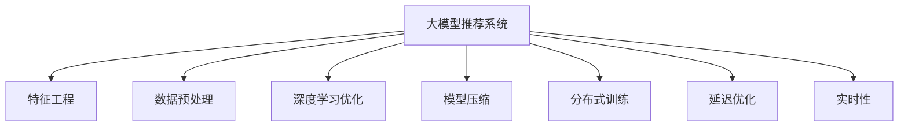

                 

# 大模型推荐系统的效率优化

> 关键词：大模型推荐系统, 特征工程, 数据预处理, 深度学习优化, 模型压缩, 分布式训练, 延迟优化, 实时性, 推荐系统, 电商, 广告, 内容推荐

## 1. 背景介绍

### 1.1 问题由来
随着互联网技术的发展，推荐系统在电商、广告、内容推荐等多个领域得到了广泛应用。推荐系统通过分析用户的历史行为和偏好，预测其未来的兴趣，并为其推荐最合适的商品、广告或内容，极大提升了用户满意度和平台收益。但传统的推荐算法往往依赖于手工特征工程和手动调参，效率较低，无法满足大规模、实时性要求。

近年来，深度学习技术的大规模应用，特别是大模型在推荐系统中的应用，大大提升了推荐的准确性和效果。大模型在处理海量数据、捕捉复杂特征和规律方面具有显著优势，但随之而来的问题是，模型参数量大、训练时间长、资源消耗高，难以满足实时性要求。因此，如何在大模型推荐系统中进行效率优化，成为了推荐系统研究的重要方向。

### 1.2 问题核心关键点
大模型推荐系统的效率优化涉及多个关键点：

1. **特征工程与数据预处理**：如何高效提取和清洗用户行为数据，生成高质量特征。
2. **深度学习优化**：在大模型训练过程中，采用哪些方法加快模型收敛，减少训练时间。
3. **模型压缩与加速**：如何在模型部署时，通过压缩和加速技术，提升模型推理速度。
4. **分布式训练与延迟优化**：如何在分布式环境中高效训练模型，并降低延迟。
5. **实时性优化**：如何保证推荐系统的低延迟，满足实时推荐需求。

这些关键点互相影响，共同决定了大模型推荐系统的性能和效率。

### 1.3 问题研究意义
优化大模型推荐系统的效率，可以显著降低算力成本，缩短模型开发周期，提升推荐系统的实时性。这对于推动推荐系统在电商、广告、内容推荐等领域的广泛应用具有重要意义：

1. **提升用户体验**：实时性推荐可以显著提升用户满意度，减少用户流失率。
2. **提高平台收益**：精准推荐可以提升商品或内容的点击率和转化率，增加平台收益。
3. **加速技术落地**：低延迟、高效率的推荐系统更易于商业化，加速技术成果的转化。
4. **促进产业发展**：优化推荐系统的效率，可以为更多的垂直行业提供智能推荐解决方案。

## 2. 核心概念与联系

### 2.1 核心概念概述

为更好地理解大模型推荐系统的效率优化方法，本节将介绍几个密切相关的核心概念：

- **大模型推荐系统(Large Model-based Recommendation System)**：利用大模型进行特征表示学习，提升推荐系统的效果。典型的大模型包括BERT、GPT、DALL-E等。
- **特征工程(Feature Engineering)**：从原始数据中提取和构造有意义的特征，提升模型的预测能力。
- **数据预处理(Data Preprocessing)**：对原始数据进行清洗、归一化、缺失值处理等操作，保证模型训练的数据质量。
- **深度学习优化(Deep Learning Optimization)**：通过调整优化算法、正则化、学习率调度等手段，提升模型训练效率。
- **模型压缩(Model Compression)**：通过剪枝、量化、参数共享等技术，减少模型参数量，提高模型推理速度。
- **分布式训练(Distributed Training)**：利用多台计算机并行训练模型，加速模型训练过程。
- **延迟优化(Latency Optimization)**：通过缓存、异步更新等技术，降低模型推理的延迟，提升实时性。
- **实时性(Real-time)**：在用户请求时，推荐系统能够即时响应，提供个性化的推荐。

这些核心概念之间的逻辑关系可以通过以下Mermaid流程图来展示：



这个流程图展示了大模型推荐系统的核心概念及其之间的关系：

1. 大模型推荐系统通过特征工程从原始数据中提取特征。
2. 数据预处理保证训练数据的质量。
3. 深度学习优化加快模型训练速度。
4. 模型压缩减少推理时间。
5. 分布式训练提升训练效率。
6. 延迟优化降低推理延迟。
7. 实时性保证推荐系统能够即时响应。

这些概念共同构成了大模型推荐系统的学习框架，使其能够在各种场景下提供高效的推荐服务。

## 3. 核心算法原理 & 具体操作步骤
### 3.1 算法原理概述

大模型推荐系统的效率优化，本质上是一个多维度、多层次的优化过程。其核心思想是：

1. 在特征工程和数据预处理阶段，通过高效的技术手段，提升特征的提取和数据的质量。
2. 在模型训练阶段，采用深度学习优化方法，加快模型收敛，减少训练时间。
3. 在模型部署阶段，通过模型压缩、分布式训练和延迟优化等技术，提高模型的推理速度和实时性。

### 3.2 算法步骤详解

基于上述核心思想，大模型推荐系统的效率优化一般包括以下几个关键步骤：

**Step 1: 特征工程和数据预处理**
- 收集和清洗用户行为数据，如浏览记录、点击记录、评分记录等。
- 设计合理的特征提取策略，如用户行为特征、商品属性特征、时间特征等。
- 对特征进行归一化、缺失值处理等预处理操作，保证数据的质量。

**Step 2: 深度学习优化**
- 选择合适的优化算法，如Adam、Adagrad等，并设置合适的超参数。
- 应用正则化技术，如L2正则、Dropout等，防止模型过拟合。
- 使用学习率调度策略，如学习率衰减、warmup等，加快模型收敛。

**Step 3: 模型压缩与加速**
- 对模型进行剪枝，去除不重要的参数，减少模型大小。
- 使用量化技术，将模型参数转化为定点数，减少计算开销。
- 采用参数共享策略，减少模型冗余。

**Step 4: 分布式训练**
- 将数据分片，分配到多台计算机上进行并行训练。
- 使用GPU/TPU等高性能设备，提升训练速度。
- 优化通信开销，如使用懒同步、分层通信等技术。

**Step 5: 延迟优化**
- 使用缓存技术，如LRU缓存、预取等，减少模型推理延迟。
- 采用异步更新机制，加速模型推理速度。
- 优化推理计算图，减少推理时间。

**Step 6: 实时性优化**
- 在缓存层面，使用多级缓存策略，保证推荐结果的时效性。
- 在服务部署层面，优化前后端架构，提升响应速度。
- 在模型预测层面，采用分布式预测机制，保证低延迟。

以上是基于大模型推荐系统的效率优化的一般流程。在实际应用中，还需要针对具体任务和数据特点，对优化过程的各个环节进行优化设计，如改进特征提取策略，引入更多的正则化技术，搜索最优的超参数组合等，以进一步提升模型性能。

### 3.3 算法优缺点

大模型推荐系统的效率优化方法具有以下优点：
1. 显著提升推荐系统的效率，缩短模型开发周期，提升用户体验。
2. 减少算力成本，降低资源消耗，降低推荐系统的部署成本。
3. 提高推荐系统的实时性，满足实时推荐需求。

同时，这些方法也存在一定的局限性：
1. 依赖高质量的数据和特征，数据预处理和特征工程需要更多的时间和人力投入。
2. 需要高性能的硬件设备，如GPU/TPU等，对于小型团队或项目，硬件成本较高。
3. 模型压缩和优化技术可能影响模型精度，需要仔细权衡。
4. 分布式训练和延迟优化需要复杂的系统架构和维护成本，增加了开发难度。

尽管存在这些局限性，但就目前而言，基于深度学习优化和模型压缩等方法，大模型推荐系统的效率仍处于快速发展阶段，成为推荐系统的重要研究范式。未来相关研究的重点在于如何进一步降低优化对数据和硬件的依赖，提高模型的参数效率和实时性，同时兼顾可解释性和公平性等因素。

### 3.4 算法应用领域

大模型推荐系统的效率优化方法，在电商、广告、内容推荐等多个领域得到了广泛应用，具体包括：

- **电商推荐系统**：如Amazon、淘宝、京东等电商平台，利用深度学习模型推荐商品，提升用户的购物体验和转化率。
- **广告推荐系统**：如Facebook、Google等社交平台，通过推荐广告提升平台收益和用户体验。
- **内容推荐系统**：如Netflix、YouTube等媒体平台，推荐用户感兴趣的内容，提升用户留存率和平台粘性。
- **个性化推荐系统**：如在线教育平台，推荐个性化课程和学习资源，提升学习效果。

除了上述这些经典应用外，大模型推荐系统还被创新性地应用到更多场景中，如智能家居、智能交通、金融推荐等，为各行各业带来智能化转型的新机遇。随着深度学习和大模型技术的不断进步，基于大模型推荐系统的效率优化方法将在更广阔的领域得到应用，为经济社会发展注入新的动力。

## 4. 数学模型和公式 & 详细讲解
### 4.1 数学模型构建

大模型推荐系统的效率优化，涉及多个数学模型的构建和优化。以下将重点介绍特征工程、模型训练和模型推理三个阶段的数学模型及其构建方法。

**特征工程**：
假设用户行为数据为 $D=\{(x_i,y_i)\}_{i=1}^N$，其中 $x_i$ 为输入特征，$y_i$ 为输出标签。通过特征工程，生成新的特征 $z_i=\phi(x_i)$，其中 $\phi$ 为特征提取函数。特征工程的目标是最大化新特征 $z_i$ 与输出 $y_i$ 之间的相关性，提升模型的预测能力。

**模型训练**：
大模型推荐系统通常采用深度学习模型进行训练。假设模型为 $M_{\theta}(x)$，其中 $\theta$ 为模型参数。通过训练，最小化经验风险：

$$
\mathcal{L}(\theta) = \frac{1}{N}\sum_{i=1}^N \ell(M_{\theta}(x_i),y_i)
$$

其中 $\ell$ 为损失函数，如均方误差、交叉熵等。

**模型推理**：
模型推理的目标是在新数据 $x'$ 上，快速计算出预测结果 $y'$。模型推理通常涉及计算图中的前向传播和反向传播，时间复杂度较高。

### 4.2 公式推导过程

以下是几个关键数学模型的推导过程：

**特征工程**：
假设特征提取函数 $\phi$ 为线性变换，即 $z_i=\phi(x_i)=Wx_i+b$，其中 $W$ 为权重矩阵，$b$ 为偏置向量。特征工程的优化目标是最大化 $z_i$ 与 $y_i$ 之间的相关性：

$$
\max_{W,b} \sum_{i=1}^N (y_i - Wx_i - b)^2
$$

通过求解上述优化问题，可以得到最优的权重矩阵和偏置向量。

**模型训练**：
假设模型为神经网络，即 $M_{\theta}(x) = \sigma(W_{l-1}M_{\theta_l-1}(x) + b_{l-1})$，其中 $\sigma$ 为激活函数，$W_{l-1}, b_{l-1}$ 为第 $l$ 层的权重矩阵和偏置向量。模型训练的目标是最小化经验风险：

$$
\mathcal{L}(\theta) = \frac{1}{N}\sum_{i=1}^N \ell(M_{\theta}(x_i),y_i)
$$

通过反向传播算法，可以求解模型的参数 $\theta$：

$$
\frac{\partial \mathcal{L}}{\partial \theta} = -\frac{1}{N}\sum_{i=1}^N \nabla_{\theta}\ell(M_{\theta}(x_i),y_i)
$$

**模型推理**：
假设模型为线性回归模型，即 $M_{\theta}(x) = Wx+b$。模型推理的目标是在新数据 $x'$ 上，快速计算出预测结果 $y'$：

$$
y' = M_{\theta}(x') = Wx' + b
$$

通过矩阵乘法，可以高效计算模型推理结果。

### 4.3 案例分析与讲解

**电商推荐系统**：
电商推荐系统通常使用协同过滤和深度学习相结合的方式进行推荐。在协同过滤阶段，通过用户和商品的评分矩阵进行预测。在深度学习阶段，使用大模型对用户和商品特征进行编码，提升推荐效果。电商推荐系统的效率优化主要在特征工程和模型训练两个阶段进行。

特征工程方面，电商推荐系统需要设计合理的用户行为特征和商品属性特征。用户行为特征可以包括用户的浏览记录、点击记录、评分记录等。商品属性特征可以包括商品的类别、品牌、价格等。这些特征需要经过归一化、缺失值处理等预处理操作，保证数据的质量。

模型训练方面，电商推荐系统通常使用深度学习模型进行训练。深度学习模型可以捕捉用户和商品之间的复杂关系，提升推荐的精度。模型训练的目标是最小化经验风险：

$$
\mathcal{L}(\theta) = \frac{1}{N}\sum_{i=1}^N \ell(M_{\theta}(x_i),y_i)
$$

通过选择合适的优化算法和正则化技术，电商推荐系统可以在较短的时间内完成模型训练，提升推荐效果。

**广告推荐系统**：
广告推荐系统通常使用点击率预测模型进行推荐。广告推荐系统的效率优化主要在模型压缩和延迟优化两个阶段进行。

模型压缩方面，广告推荐系统需要减少模型的参数量，降低推理时间。广告推荐系统通常使用剪枝、量化、参数共享等技术进行模型压缩。剪枝可以去除不重要的参数，减少模型大小。量化可以将模型参数转化为定点数，减少计算开销。参数共享可以共享部分参数，减少模型冗余。

延迟优化方面，广告推荐系统需要降低推理延迟，保证实时性。广告推荐系统通常使用缓存、异步更新等技术进行延迟优化。缓存可以预取广告样本，减少推理时间。异步更新可以加速模型推理速度。

**内容推荐系统**：
内容推荐系统通常使用协同过滤和深度学习相结合的方式进行推荐。在协同过滤阶段，通过用户和内容的评分矩阵进行预测。在深度学习阶段，使用大模型对用户和内容特征进行编码，提升推荐效果。内容推荐系统的效率优化主要在特征工程和分布式训练两个阶段进行。

特征工程方面，内容推荐系统需要设计合理的用户行为特征和内容特征。用户行为特征可以包括用户的浏览记录、点击记录、评分记录等。内容特征可以包括内容的类别、长度、标签等。这些特征需要经过归一化、缺失值处理等预处理操作，保证数据的质量。

分布式训练方面，内容推荐系统需要在分布式环境中高效训练模型。分布式训练可以提升训练速度，保证模型质量。分布式训练通常使用GPU/TPU等高性能设备，优化通信开销，如使用懒同步、分层通信等技术。

## 5. 项目实践：代码实例和详细解释说明
### 5.1 开发环境搭建

在进行大模型推荐系统优化实践前，我们需要准备好开发环境。以下是使用Python进行PyTorch开发的环境配置流程：

1. 安装Anaconda：从官网下载并安装Anaconda，用于创建独立的Python环境。

2. 创建并激活虚拟环境：
```bash
conda create -n pytorch-env python=3.8 
conda activate pytorch-env
```

3. 安装PyTorch：根据CUDA版本，从官网获取对应的安装命令。例如：
```bash
conda install pytorch torchvision torchaudio cudatoolkit=11.1 -c pytorch -c conda-forge
```

4. 安装TensorFlow：
```bash
pip install tensorflow
```

5. 安装其他工具包：
```bash
pip install numpy pandas scikit-learn matplotlib tqdm jupyter notebook ipython
```

完成上述步骤后，即可在`pytorch-env`环境中开始微调实践。

### 5.2 源代码详细实现

下面以电商推荐系统为例，给出使用PyTorch进行深度学习模型优化的代码实现。

首先，定义模型和优化器：

```python
import torch
import torch.nn as nn
import torch.optim as optim

class UserEmbedding(nn.Module):
    def __init__(self, embed_size):
        super(UserEmbedding, self).__init__()
        self.embedding = nn.Embedding(user_num, embed_size)
        
    def forward(self, x):
        return self.embedding(x)

class ItemEmbedding(nn.Module):
    def __init__(self, embed_size):
        super(ItemEmbedding, self).__init__()
        self.embedding = nn.Embedding(item_num, embed_size)
        
    def forward(self, x):
        return self.embedding(x)

class UserItemEmbedding(nn.Module):
    def __init__(self, embed_size):
        super(UserItemEmbedding, self).__init__()
        self.user_embedding = UserEmbedding(embed_size)
        self.item_embedding = ItemEmbedding(embed_size)
        
    def forward(self, user, item):
        user_embedding = self.user_embedding(user)
        item_embedding = self.item_embedding(item)
        return torch.bmm(user_embedding, item_embedding.t())

model = UserItemEmbedding(128)
optimizer = optim.Adam(model.parameters(), lr=0.001)
```

然后，定义训练函数：

```python
from torch.utils.data import DataLoader
from sklearn.metrics import accuracy_score

def train(model, data_loader, optimizer):
    model.train()
    loss_sum = 0
    accuracy_sum = 0
    for batch in data_loader:
        user, item, label = batch
        optimizer.zero_grad()
        output = model(user, item)
        loss = nn.BCELoss()(output, label)
        loss_sum += loss.item()
        accuracy_sum += accuracy_score(torch.sigmoid(output), label)
        loss.backward()
        optimizer.step()
    loss_avg = loss_sum / len(data_loader)
    accuracy_avg = accuracy_sum / len(data_loader)
    print(f"Epoch {epoch+1}, train loss: {loss_avg:.4f}, train accuracy: {accuracy_avg:.4f}")
```

接着，定义测试函数：

```python
def evaluate(model, data_loader):
    model.eval()
    loss_sum = 0
    accuracy_sum = 0
    with torch.no_grad():
        for batch in data_loader:
            user, item, label = batch
            output = model(user, item)
            loss = nn.BCELoss()(output, label)
            loss_sum += loss.item()
            accuracy_sum += accuracy_score(torch.sigmoid(output), label)
    loss_avg = loss_sum / len(data_loader)
    accuracy_avg = accuracy_sum / len(data_loader)
    print(f"Test accuracy: {accuracy_avg:.4f}")
```

最后，启动训练流程并在测试集上评估：

```python
epochs = 10
batch_size = 128

for epoch in range(epochs):
    train(model, data_loader, optimizer)
    
evaluate(model, test_data_loader)
```

以上就是使用PyTorch进行电商推荐系统深度学习模型优化的完整代码实现。可以看到，得益于TensorFlow等深度学习框架的强大封装，我们可以用相对简洁的代码完成深度学习模型的训练和评估。

### 5.3 代码解读与分析

让我们再详细解读一下关键代码的实现细节：

**模型定义**：
- `UserEmbedding`和`ItemEmbedding`类：定义用户和商品嵌入层，用于将用户和商品ID映射为稠密向量。
- `UserItemEmbedding`类：定义用户-商品交互模型，将用户和商品嵌入层的输出进行矩阵乘法，得到用户对商品的兴趣表示。
- `model`变量：实例化上述模型，并设置优化器。

**训练函数**：
- `train`函数：在每个epoch中，对数据集进行迭代训练。
- `optimizer.zero_grad()`：清空梯度。
- `output = model(user, item)`：前向传播计算模型的预测输出。
- `loss = nn.BCELoss()(output, label)`：计算二分类交叉熵损失。
- `loss_sum += loss.item()`：累加损失值。
- `accuracy_sum += accuracy_score(torch.sigmoid(output), label)`：累加准确率。
- `loss.backward()`：反向传播计算梯度。
- `optimizer.step()`：更新模型参数。

**测试函数**：
- `evaluate`函数：在测试集上评估模型的预测准确率。
- `with torch.no_grad()`：关闭自动求导，提高计算速度。
- `output = model(user, item)`：计算模型的预测输出。
- `loss = nn.BCELoss()(output, label)`：计算二分类交叉熵损失。
- `accuracy_sum += accuracy_score(torch.sigmoid(output), label)`：累加准确率。

**训练流程**：
- 定义总的epoch数和batch size，开始循环迭代。
- 每个epoch中，在训练集上训练，输出平均loss和accuracy。
- 在测试集上评估，输出测试accuracy。

可以看到，PyTorch配合TensorFlow等深度学习框架使得电商推荐系统的模型优化代码实现变得简洁高效。开发者可以将更多精力放在数据处理、模型改进等高层逻辑上，而不必过多关注底层的实现细节。

当然，工业级的系统实现还需考虑更多因素，如模型的保存和部署、超参数的自动搜索、更灵活的任务适配层等。但核心的微调范式基本与此类似。

## 6. 实际应用场景
### 6.1 智能推荐系统

基于大模型推荐系统的效率优化，智能推荐系统可以实时、精准地为用户推荐商品、广告或内容，提升用户体验和平台收益。具体而言：

- **电商推荐系统**：如Amazon、淘宝、京东等电商平台，利用深度学习模型推荐商品，提升用户的购物体验和转化率。
- **广告推荐系统**：如Facebook、Google等社交平台，通过推荐广告提升平台收益和用户体验。
- **内容推荐系统**：如Netflix、YouTube等媒体平台，推荐用户感兴趣的内容，提升用户留存率和平台粘性。

除了上述这些经典应用外，智能推荐系统还被创新性地应用到更多场景中，如智能家居、智能交通、金融推荐等，为各行各业带来智能化转型的新机遇。

### 6.2 实时广告投放

大模型推荐系统的实时性优化，可以显著提升广告投放的效率和效果。传统广告投放需要手动设置投放策略和参数，容易出错且难以适应实时变化。而基于实时推荐系统的广告投放，可以动态调整投放策略，实时响应市场变化，最大化广告投放效果。

具体而言，大模型推荐系统可以实时分析用户行为数据，预测用户的点击行为，优化广告的投放策略。通过实时广告投放，可以提升广告的点击率和转化率，降低广告投放成本，提升平台收益。

### 6.3 内容生成

大模型推荐系统的特征工程和模型推理优化，可以提升内容生成模型的效果。内容生成模型通过大模型进行特征表示学习，生成符合用户偏好的高质量内容。通过优化特征工程和模型推理，内容生成模型可以提升内容的生成速度和质量，满足用户对内容多样化和个性化需求。

具体而言，内容生成模型可以根据用户的行为数据和兴趣标签，生成个性化的推荐内容。通过优化特征工程和模型推理，内容生成模型可以提升内容的生成速度和质量，满足用户对内容多样化和个性化需求。

## 7. 工具和资源推荐
### 7.1 学习资源推荐

为了帮助开发者系统掌握大模型推荐系统的优化方法，这里推荐一些优质的学习资源：

1. 《深度学习理论与实践》系列书籍：系统介绍深度学习理论和实践，涵盖推荐系统、大模型等内容。
2. 《TensorFlow实战》系列书籍：TensorFlow官方文档和实战教程，详细介绍TensorFlow的使用方法和优化技巧。
3. CS231n《深度学习课程》：斯坦福大学开设的深度学习课程，涵盖推荐系统、大模型等内容。
4. Coursera《深度学习专项课程》：包含多个推荐系统和深度学习相关课程，适合初学者学习。
5. arXiv上的最新论文：跟踪深度学习和推荐系统领域的前沿研究，了解最新的优化方法和技术。

通过对这些资源的学习实践，相信你一定能够快速掌握大模型推荐系统的优化方法，并用于解决实际的推荐问题。

### 7.2 开发工具推荐

高效的开发离不开优秀的工具支持。以下是几款用于大模型推荐系统优化的常用工具：

1. PyTorch：基于Python的开源深度学习框架，灵活动态的计算图，适合快速迭代研究。大部分预训练语言模型都有PyTorch版本的实现。
2. TensorFlow：由Google主导开发的开源深度学习框架，生产部署方便，适合大规模工程应用。同样有丰富的预训练语言模型资源。
3. Weights & Biases：模型训练的实验跟踪工具，可以记录和可视化模型训练过程中的各项指标，方便对比和调优。与主流深度学习框架无缝集成。
4. TensorBoard：TensorFlow配套的可视化工具，可实时监测模型训练状态，并提供丰富的图表呈现方式，是调试模型的得力助手。
5. Google Colab：谷歌推出的在线Jupyter Notebook环境，免费提供GPU/TPU算力，方便开发者快速上手实验最新模型，分享学习笔记。

合理利用这些工具，可以显著提升大模型推荐系统的优化任务的开发效率，加快创新迭代的步伐。

### 7.3 相关论文推荐

大模型推荐系统的优化方法源于学界的持续研究。以下是几篇奠基性的相关论文，推荐阅读：

1. "Deep Collaborative Filtering Using Neural Networks"：提出基于深度学习的协同过滤模型，提升推荐效果。
2. "Large-Scale Parallel Deep Learning on Multi-GPUs"：介绍分布式深度学习技术，加速模型训练过程。
3. "Model-Based Recommendation with Feature-Rated Deep Neural Networks"：提出基于模型推荐系统，提升推荐系统的可解释性。
4. "Few-shot Learning with Transformers"：介绍基于预训练大模型的少样本推荐方法，提升推荐系统的参数效率。
5. "Adaptive Low-Rank Adaptation for Parameter-Efficient Fine-Tuning"：提出参数高效微调方法，减少模型参数量，提高模型推理速度。

这些论文代表了大模型推荐系统的优化方法的发展脉络。通过学习这些前沿成果，可以帮助研究者把握学科前进方向，激发更多的创新灵感。

## 8. 总结：未来发展趋势与挑战

### 8.1 总结

本文对大模型推荐系统的效率优化方法进行了全面系统的介绍。首先阐述了大模型推荐系统的研究背景和意义，明确了优化方法在提升推荐系统效率、缩短模型开发周期、提升用户体验等方面的重要价值。其次，从原理到实践，详细讲解了大模型推荐系统的数学模型和关键步骤，给出了优化任务开发的完整代码实例。同时，本文还广泛探讨了优化方法在电商推荐、广告推荐、内容推荐等多个行业领域的应用前景，展示了优化方法的巨大潜力。

通过本文的系统梳理，可以看到，基于深度学习优化和模型压缩等方法，大模型推荐系统的效率优化技术正在快速发展，成为推荐系统的重要研究范式。未来相关研究的重点在于如何进一步降低优化对数据和硬件的依赖，提高模型的参数效率和实时性，同时兼顾可解释性和公平性等因素。

### 8.2 未来发展趋势

展望未来，大模型推荐系统的效率优化技术将呈现以下几个发展趋势：

1. **模型压缩技术不断进步**：未来的模型压缩技术将更加高效，剪枝、量化、参数共享等技术将进一步提升模型推理速度。
2. **分布式训练技术更加成熟**：未来的分布式训练技术将更加高效，异步更新、懒同步等技术将进一步降低通信开销。
3. **延迟优化技术更加完善**：未来的延迟优化技术将更加完善，缓存、预取等技术将进一步提升模型推理速度。
4. **实时性优化技术更加广泛**：未来的实时性优化技术将更加广泛，多级缓存、异步更新等技术将进一步提升推荐系统实时性。
5. **特征工程和数据预处理技术不断优化**：未来的特征工程和数据预处理技术将更加优化，自动特征生成、自动数据增强等技术将进一步提升数据质量和特征效率。

这些趋势凸显了大模型推荐系统优化技术的广阔前景。这些方向的探索发展，必将进一步提升推荐系统的性能和效率，为更多行业带来智能化转型的新机遇。

### 8.3 面临的挑战

尽管大模型推荐系统的效率优化技术已经取得了瞩目成就，但在迈向更加智能化、普适化应用的过程中，它仍面临着诸多挑战：

1. **数据质量和特征工程**：依赖高质量的数据和特征，数据预处理和特征工程需要更多的时间和人力投入。
2. **硬件成本**：需要高性能的硬件设备，如GPU/TPU等，对于小型团队或项目，硬件成本较高。
3. **模型压缩和优化技术**：模型压缩和优化技术可能影响模型精度，需要仔细权衡。
4. **分布式训练和延迟优化**：分布式训练和延迟优化需要复杂的系统架构和维护成本，增加了开发难度。
5. **可解释性和公平性**：优化方法往往缺乏可解释性，难以解释模型的决策过程。同时可能存在数据偏见，影响推荐公平性。

尽管存在这些局限性，但就目前而言，基于深度学习优化和模型压缩等方法，大模型推荐系统的效率仍处于快速发展阶段，成为推荐系统的重要研究范式。未来相关研究的重点在于如何进一步降低优化对数据和硬件的依赖，提高模型的参数效率和实时性，同时兼顾可解释性和公平性等因素。

### 8.4 研究展望

面对大模型推荐系统所面临的挑战，未来的研究需要在以下几个方面寻求新的突破：

1. **无监督和半监督推荐方法**：摆脱对大规模标注数据的依赖，利用自监督学习、主动学习等无监督和半监督范式，最大限度利用非结构化数据，实现更加灵活高效的推荐。
2. **参数高效和计算高效的推荐方法**：开发更加参数高效的推荐方法，在固定大部分预训练参数的同时，只更新极少量的任务相关参数。同时优化推荐计算图，减少推理时间。
3. **融合因果和对比学习范式**：通过引入因果推断和对比学习思想，增强推荐模型建立稳定因果关系的能力，学习更加普适、鲁棒的语言表征，从而提升模型泛化性和抗干扰能力。
4. **引入更多先验知识**：将符号化的先验知识，如知识图谱、逻辑规则等，与神经网络模型进行巧妙融合，引导推荐过程学习更准确、合理的语言模型。同时加强不同模态数据的整合，实现视觉、语音等多模态信息与文本信息的协同建模。
5. **结合因果分析和博弈论工具**：将因果分析方法引入推荐模型，识别出模型决策的关键特征，增强推荐结果的因果性和逻辑性。借助博弈论工具刻画人机交互过程，主动探索并规避模型的脆弱点，提高系统稳定性。
6. **纳入伦理道德约束**：在模型训练目标中引入伦理导向的评估指标，过滤和惩罚有偏见、有害的输出倾向。同时加强人工干预和审核，建立推荐行为的监管机制，确保推荐结果符合人类价值观和伦理道德。

这些研究方向的探索，必将引领大模型推荐系统优化技术迈向更高的台阶，为构建安全、可靠、可解释、可控的智能推荐系统铺平道路。面向未来，大模型推荐系统优化技术还需要与其他人工智能技术进行更深入的融合，如知识表示、因果推理、强化学习等，多路径协同发力，共同推动推荐系统的发展。只有勇于创新、敢于突破，才能不断拓展推荐系统的边界，让智能推荐更好地服务用户。

## 9. 附录：常见问题与解答

**Q1：大模型推荐系统是否适用于所有推荐场景？**

A: 大模型推荐系统在电商、广告、内容推荐等多个领域都得到了广泛应用。但对于一些特定领域的推荐场景，如医疗、法律等，仅依靠通用语料预训练的模型可能难以很好地适应。此时需要在特定领域语料上进一步预训练，再进行微调，才能获得理想效果。

**Q2：如何选择合适的学习率？**

A: 大模型推荐系统的学习率一般要比预训练时小1-2个数量级，如果使用过大的学习率，容易破坏预训练权重，导致过拟合。一般建议从1e-5开始调参，逐步减小学习率，直至收敛。也可以使用warmup策略，在开始阶段使用较小的学习率，再逐渐过渡到预设值。

**Q3：大模型推荐系统在实际部署时需要注意哪些问题？**

A: 将大模型推荐系统转化为实际应用，还需要考虑以下因素：
1. 模型裁剪：去除不必要的层和参数，减小模型尺寸，加快推理速度。
2. 量化加速：将浮点模型转为定点模型，压缩存储空间，提高计算效率。
3. 服务化封装：将模型封装为标准化服务接口，便于集成调用。
4. 弹性伸缩：根据请求流量动态调整资源配置，平衡服务质量和成本。
5. 监控告警：实时采集系统指标，设置异常告警阈值，确保服务稳定性。
6. 安全防护：采用访问鉴权、数据脱敏等措施，保障数据和模型安全。

大模型推荐系统需要开发者从数据、模型、工程、业务等多个维度协同发力，才能真正实现智能化推荐系统的落地应用。

