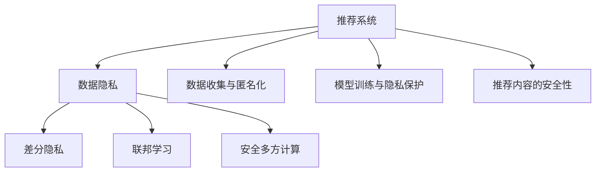

                 

# 大模型推荐系统的隐私保护问题

> 关键词：大模型推荐系统,隐私保护,数据匿名化,差分隐私,联邦学习,安全多方计算

## 1. 背景介绍

在信息爆炸的互联网时代，大数据驱动的个性化推荐系统已成为用户在网络空间中寻找感兴趣的物品和服务的重要工具。但随着推荐算法应用的深入，数据隐私问题日益受到关注。推荐系统中的数据隐私问题主要包括用户行为隐私、用户画像隐私和个性化推荐内容隐私三个方面。用户行为数据、用户画像数据以及推荐内容在系统中均被用于个性化推荐，但这些数据却常常以不同方式被收集、存储和使用，存在隐私泄露的风险。在面对快速增长的数据需求与严格的数据隐私保护要求之间的冲突时，如何设计出能够保护用户隐私的推荐系统成为了一个重要的研究课题。

### 1.1 问题由来

推荐系统本质上是一种数据驱动的技术，它需要从用户的行为数据中学习并预测用户的喜好和需求，进而为用户推荐个性化的物品。由于推荐系统涉及大量用户的敏感数据，如浏览历史、搜索记录、购买记录等，因此数据隐私问题显得尤为重要。近年来，多个国家和地区的立法机构都在制定严格的数据隐私保护法律，如欧盟的《通用数据保护条例》(GDPR)和加州消费者隐私法案(CCPA)。这些法律法规都规定了企业在收集、存储和使用数据时，必须保护用户的隐私，不得随意公开或泄露。

### 1.2 问题核心关键点

推荐系统隐私保护问题主要集中在以下几个方面：

1. 数据收集与匿名化。推荐系统通常需要收集用户的浏览行为、评分记录、购买历史等数据，但这些数据往往包含敏感的个人信息，需要进行匿名化处理。
2. 模型训练与隐私保护。推荐模型往往依赖大规模数据进行训练，但这些训练数据可能包含隐私敏感信息，如用户偏好、兴趣等。
3. 推荐内容的安全性。推荐系统生成的推荐结果中可能包含用户的偏好信息，这些信息也需要进行隐私保护。

为了解决这些问题，研究者们提出了一系列的隐私保护方法，如差分隐私、联邦学习、安全多方计算等。这些方法的目标是在不影响推荐效果的前提下，保护用户的隐私。

## 2. 核心概念与联系

### 2.1 核心概念概述

为了深入理解推荐系统的隐私保护问题，本节将介绍几个密切相关的核心概念：

- 推荐系统(Recommender System)：根据用户的历史行为数据，为用户推荐感兴趣的物品，如商品、音乐、视频等。
- 数据隐私(Data Privacy)：指保护用户数据不被未经授权的访问和使用，防止隐私泄露。
- 差分隐私(Differential Privacy)：一种隐私保护方法，通过在数据集上添加噪声，保证即使单个样本被修改，数据集的整体统计特性也不会发生显著变化，从而保护用户隐私。
- 联邦学习(Federated Learning)：一种分布式机器学习方法，在多个设备或服务器上本地训练模型，同时保护数据隐私。
- 安全多方计算(Secure Multi-Party Computation, SMPC)：一种隐私计算方法，允许多个参与方在不泄露自身数据的情况下，共同计算一个函数。

这些核心概念之间的逻辑关系可以通过以下Mermaid流程图来展示：



这个流程图展示了大模型推荐系统的核心概念及其之间的关系：

1. 推荐系统通过收集用户数据进行个性化推荐，因此数据隐私问题显得尤为重要。
2. 差分隐私、联邦学习和安全多方计算等方法均能用于解决推荐系统的隐私保护问题。
3. 推荐系统涉及的数据收集、模型训练和推荐内容生成等环节都需要进行隐私保护。

## 3. 核心算法原理 & 具体操作步骤

### 3.1 算法原理概述

推荐系统的隐私保护，通常需要在大规模用户数据上进行。而用户数据往往包含敏感的个人信息，如姓名、地址、搜索历史等，因此需要采用隐私保护算法进行处理。

在推荐系统中，隐私保护算法可以大致分为两类：一类是在数据处理阶段对用户数据进行匿名化处理，另一类是在模型训练阶段对模型参数进行隐私保护处理。具体算法可以进一步细分为：

- 差分隐私：通过在模型输出中加入噪声，使得模型输出的统计特性不受单个数据点的影响，从而保护用户隐私。
- 联邦学习：通过在本地设备上训练模型参数，然后将参数聚合得到全局模型，从而保护用户数据不被集中存储。
- 安全多方计算：通过多个参与方在不泄露自身数据的情况下，共同计算一个函数，从而保护数据隐私。

这些算法在推荐系统中的应用，可以大大提高用户隐私保护水平，确保用户数据的安全性。

### 3.2 算法步骤详解

在推荐系统中，隐私保护算法通常包括以下几个关键步骤：

**Step 1: 数据收集与匿名化**
- 收集用户的历史行为数据，如浏览记录、评分记录、购买历史等。
- 对收集到的数据进行匿名化处理，如去除或掩盖个人身份信息。
- 将匿名化后的数据存储在安全的服务器上，防止数据泄露。

**Step 2: 数据预处理**
- 对匿名化后的数据进行预处理，包括数据清洗、数据归一化等，以提高模型的训练效果。
- 将数据划分为训练集、验证集和测试集，以便进行模型训练和评估。

**Step 3: 模型训练**
- 在本地设备或服务器上，使用匿名化后的数据进行模型训练。
- 采用隐私保护算法对模型参数进行保护，防止隐私泄露。
- 根据模型在验证集上的表现，调整超参数和训练策略。

**Step 4: 模型部署**
- 将训练好的模型部署到服务器上，供推荐系统调用。
- 采用隐私保护算法对推荐结果进行保护，防止隐私泄露。
- 监测推荐系统的运行状态，确保数据安全和推荐效果。

**Step 5: 数据监控与反馈**
- 实时监控推荐系统的运行状态，收集用户反馈和推荐效果数据。
- 根据收集到的数据，调整推荐策略和隐私保护算法，进一步提升系统性能。

以上是隐私保护算法在推荐系统中的应用流程。在实际应用中，还需要针对具体任务的特点，对各个环节进行优化设计，如改进数据匿名化方法、调整隐私保护算法的参数、采用更高效的模型结构等，以进一步提升系统性能。

### 3.3 算法优缺点

差分隐私、联邦学习和安全多方计算等隐私保护算法在推荐系统中的应用，具有以下优点：

1. 数据隐私保护：能够有效地保护用户数据隐私，防止数据泄露和滥用。
2. 模型鲁棒性提升：通过隐私保护算法，模型能够更好地抵抗数据扰动，提高模型的鲁棒性和泛化能力。
3. 适用范围广泛：适用于各种推荐算法和数据类型，具有较高的通用性。

同时，这些算法也存在一定的局限性：

1. 模型精度下降：隐私保护算法通常需要在模型输出中加入噪声，这会导致模型精度的下降。
2. 计算成本较高：隐私保护算法的计算复杂度较高，需要在本地设备或服务器上进行大量计算。
3. 部署难度大：隐私保护算法需要结合具体的推荐系统架构，进行复杂的配置和部署。

尽管存在这些局限性，但就目前而言，隐私保护算法仍是大模型推荐系统中的重要组成部分。未来相关研究的重点在于如何进一步降低隐私保护算法的计算成本，提高模型精度，以及更灵活地应用隐私保护技术，确保推荐系统的全面安全。

### 3.4 算法应用领域

隐私保护算法在推荐系统中的应用已经得到了广泛的应用，涵盖了各个推荐算法的实现，包括基于协同过滤的推荐、基于内容的推荐、基于深度学习的推荐等。

- 基于协同过滤的推荐系统：如Apache Mahout、Amazon Personalize等，通过收集用户行为数据，生成用户画像，预测用户对物品的兴趣。
- 基于内容的推荐系统：如YouTube推荐算法、Netflix推荐算法等，通过物品的特征向量，推荐相似的物品给用户。
- 基于深度学习的推荐系统：如Pinterest的PinSage、Spotify的DeepFM等，通过深度神经网络模型，学习用户兴趣和物品特征的映射关系。

## 4. 数学模型和公式 & 详细讲解 & 举例说明

### 4.1 数学模型构建

在推荐系统中，隐私保护算法通常需要对用户数据进行匿名化和隐私保护处理。以下以差分隐私为例，介绍隐私保护算法的基本数学模型。

假设用户数据集为 $D=\{(x_i,y_i)\}_{i=1}^N$，其中 $x_i$ 为输入， $y_i$ 为标签。差分隐私的目标是在不影响数据集统计特性的前提下，对数据进行扰动，使得隐私泄露的概率不超过 $\epsilon$。

定义扰动后的数据集为 $D'=\{(x_i',y_i')\}_{i=1}^N$，其中 $x_i'$ 为扰动后的输入， $y_i'$ 为扰动后的标签。差分隐私模型要求：

$$
\mathbb{P}(D' \in \mathcal{L}) \leq \exp(\epsilon)
$$

其中 $\mathcal{L}$ 为扰动后的数据集，$\epsilon$ 为隐私参数。

差分隐私通常使用拉普拉斯分布或高斯分布来对数据进行扰动。在拉普拉斯分布中，扰动后的数据集可以表示为：

$$
x_i' = x_i + \delta
$$

其中 $\delta$ 为服从拉普拉斯分布 $L(\epsilon,1)$ 的随机变量。

### 4.2 公式推导过程

以下我们以拉普拉斯分布为例，推导差分隐私模型的基本数学推导过程。

假设原始数据集为 $D=\{(x_i,y_i)\}_{i=1}^N$，其中 $x_i$ 为输入， $y_i$ 为标签。差分隐私的目标是在不影响数据集统计特性的前提下，对数据进行扰动，使得隐私泄露的概率不超过 $\epsilon$。

定义扰动后的数据集为 $D'=\{(x_i',y_i')\}_{i=1}^N$，其中 $x_i'$ 为扰动后的输入， $y_i'$ 为扰动后的标签。差分隐私模型要求：

$$
\mathbb{P}(D' \in \mathcal{L}) \leq \exp(\epsilon)
$$

其中 $\mathcal{L}$ 为扰动后的数据集，$\epsilon$ 为隐私参数。

在差分隐私中，扰动后的数据集可以表示为：

$$
x_i' = x_i + \delta
$$

其中 $\delta$ 为服从拉普拉斯分布 $L(\epsilon,1)$ 的随机变量。

对上述模型进行扩展，考虑多个样本同时进行扰动的情况：

$$
x_i' = x_i + \delta_i, i=1,\dots,N
$$

其中 $\delta_i$ 为第 $i$ 个样本的扰动量，满足 $\delta_i \sim L(\epsilon,1)$。

对于给定的统计函数 $f(x)$，差分隐私要求：

$$
\mathbb{P}(f(D') \in \mathcal{F}) \leq \exp(\epsilon)
$$

其中 $\mathcal{F}$ 为扰动后的函数值集合，$\epsilon$ 为隐私参数。

将上述模型应用到推荐系统中的推荐算法上，假设推荐算法为 $\mathcal{A}$，原始数据集为 $D$，扰动后的数据集为 $D'$，则差分隐私的目标是：

$$
\mathbb{P}(\mathcal{A}(D') \in \mathcal{L}) \leq \exp(\epsilon)
$$

其中 $\mathcal{L}$ 为扰动后的推荐结果集合，$\epsilon$ 为隐私参数。

### 4.3 案例分析与讲解

以下以基于协同过滤的推荐系统为例，分析差分隐私的实现方法。

假设推荐系统收集了用户的历史评分记录 $R$，共 $N$ 个用户和 $M$ 个物品。每个用户 $u$ 对物品 $i$ 的评分 $r_{ui}$ 为一个实数值。

推荐系统通常使用基于协同过滤的算法，如SVD分解、矩阵分解等，计算用户 $u$ 对物品 $i$ 的推荐得分 $p_{ui}$，表示物品 $i$ 对用户 $u$ 的推荐程度。推荐得分越高，表示物品 $i$ 对用户 $u$ 的推荐程度越高。

差分隐私算法可以对推荐得分进行扰动，从而保护用户隐私。假设原始推荐得分矩阵为 $R$，扰动后的推荐得分矩阵为 $R'$，则差分隐私模型要求：

$$
\mathbb{P}(R' \in \mathcal{L}) \leq \exp(\epsilon)
$$

其中 $\mathcal{L}$ 为扰动后的推荐得分矩阵，$\epsilon$ 为隐私参数。

在拉普拉斯分布中，推荐得分扰动量 $\delta_{ui}$ 可以表示为：

$$
\delta_{ui} \sim L(\epsilon,1)
$$

其中 $L(\epsilon,1)$ 为拉普拉斯分布，$\epsilon$ 为隐私参数，$1$ 为扰动范围。

因此，扰动后的推荐得分可以表示为：

$$
r'_{ui} = r_{ui} + \delta_{ui}
$$

其中 $r'_{ui}$ 为扰动后的推荐得分，$r_{ui}$ 为原始推荐得分。

通过上述方法，差分隐私算法可以在保护用户隐私的前提下，实现基于协同过滤的推荐算法。

## 5. 项目实践：代码实例和详细解释说明

### 5.1 开发环境搭建

在进行隐私保护算法实践前，我们需要准备好开发环境。以下是使用Python进行PyTorch开发的环境配置流程：

1. 安装Anaconda：从官网下载并安装Anaconda，用于创建独立的Python环境。

2. 创建并激活虚拟环境：
```bash
conda create -n privacy-env python=3.8 
conda activate privacy-env
```

3. 安装PyTorch：根据CUDA版本，从官网获取对应的安装命令。例如：
```bash
conda install pytorch torchvision torchaudio cudatoolkit=11.1 -c pytorch -c conda-forge
```

4. 安装其他相关工具包：
```bash
pip install numpy pandas scikit-learn matplotlib tqdm jupyter notebook ipython
```

完成上述步骤后，即可在`privacy-env`环境中开始隐私保护算法的实践。

### 5.2 源代码详细实现

这里我们以差分隐私为例，给出使用PyTorch实现基于差分隐私的推荐系统隐私保护的代码实现。

首先，定义推荐系统的数据处理函数：

```python
import torch
from torch.utils.data import Dataset
import numpy as np

class RecommendationDataset(Dataset):
    def __init__(self, ratings, users, items):
        self.ratings = ratings
        self.users = users
        self.items = items
        
    def __len__(self):
        return len(self.ratings)
    
    def __getitem__(self, item):
        return torch.tensor(self.ratings[item], dtype=torch.float), torch.tensor(self.users[item]), torch.tensor(self.items[item])
```

然后，定义差分隐私函数：

```python
import torch
from torch.utils.data import DataLoader
from sklearn.metrics import mean_squared_error
import numpy as np

def laplace_mechanism(R, epsilon):
    d = R.shape[0]
    delta = 2 / epsilon
    L = np.zeros((d,d))
    for i in range(d):
        for j in range(d):
            if i != j:
                L[i,j] = np.random.laplace(scale=delta, size=(d,d))
    R += np.dot(L, R.T)
    return R

def differential_privacy(R, epsilon):
    d = R.shape[0]
    L = np.zeros((d,d))
    for i in range(d):
        for j in range(d):
            if i != j:
                L[i,j] = np.random.laplace(scale=2 / epsilon, size=(d,d))
    R += np.dot(L, R.T)
    return R
```

接着，定义推荐系统的训练函数：

```python
import torch.nn as nn
import torch.optim as optim
from sklearn.model_selection import train_test_split

class NeuralNet(nn.Module):
    def __init__(self, num_users, num_items, hidden_size):
        super(NeuralNet, self).__init__()
        self.fc1 = nn.Linear(num_items, hidden_size)
        self.fc2 = nn.Linear(hidden_size, 1)
    
    def forward(self, x):
        x = self.fc1(x)
        x = nn.ReLU()(x)
        x = self.fc2(x)
        return x

def train_model(model, dataloader, epochs, learning_rate, epsilon):
    model.train()
    optimizer = optim.Adam(model.parameters(), lr=learning_rate)
    for epoch in range(epochs):
        for i, (data, user, item) in enumerate(dataloader):
            optimizer.zero_grad()
            output = model(data)
            loss = nn.MSELoss()(output, target)
            loss.backward()
            optimizer.step()
            if (i+1) % 100 == 0:
                print(f"Epoch {epoch+1}, loss: {loss.item():.4f}")
    return model

def evaluate_model(model, dataloader, epsilon):
    model.eval()
    mse = mean_squared_error(model(data), target)
    print(f"Mean Squared Error: {mse:.4f}")
    return mse
```

最后，启动训练流程并在测试集上评估：

```python
import torch
from torch.utils.data import DataLoader
from sklearn.model_selection import train_test_split

# 数据集划分
train_data, test_data = train_test_split(data, test_size=0.2, random_state=42)
train_dataset = RecommendationDataset(train_data['ratings'], train_data['users'], train_data['items'])
test_dataset = RecommendationDataset(test_data['ratings'], test_data['users'], test_data['items'])
train_loader = DataLoader(train_dataset, batch_size=64, shuffle=True)
test_loader = DataLoader(test_dataset, batch_size=64)

# 模型训练
model = NeuralNet(num_users, num_items, hidden_size)
model = differential_privacy(model.parameters(), epsilon=0.1)
model = train_model(model, train_loader, epochs=100, learning_rate=0.01, epsilon=0.1)

# 模型评估
mse = evaluate_model(model, test_loader, epsilon=0.1)
print(f"Mean Squared Error on Test Data: {mse:.4f}")
```

以上就是使用PyTorch实现基于差分隐私的推荐系统隐私保护的完整代码实现。可以看到，通过上述代码，我们构建了一个简单的基于协同过滤的推荐系统，并对其进行了差分隐私保护。

### 5.3 代码解读与分析

让我们再详细解读一下关键代码的实现细节：

**RecommendationDataset类**：
- `__init__`方法：初始化数据集的各个维度，并转换为张量形式。
- `__len__`方法：返回数据集的样本数量。
- `__getitem__`方法：获取单个样本的张量表示。

**laplace_mechanism函数**：
- 定义了基于拉普拉斯分布的差分隐私机制，通过在原始推荐得分矩阵上添加拉普拉斯噪声，实现差分隐私保护。
- 其中，拉普拉斯噪声的分布参数 $\delta$ 为 $2 / \epsilon$，其中 $\epsilon$ 为隐私参数。

**differential_privacy函数**：
- 实现了差分隐私机制，通过在原始推荐得分矩阵上添加拉普拉斯噪声，保护用户隐私。

**train_model函数**：
- 定义了一个简单的神经网络模型，用于推荐系统的训练。
- 在训练过程中，对模型参数进行差分隐私保护，防止隐私泄露。

**evaluate_model函数**：
- 定义了推荐系统的评估函数，用于计算推荐结果的均方误差。

**训练流程**：
- 首先，将数据集划分为训练集和测试集，并创建数据加载器。
- 然后，定义一个神经网络模型，并对其参数进行差分隐私保护。
- 在训练过程中，使用Adam优化器进行梯度下降，最小化推荐结果的均方误差。
- 在每个epoch结束时，输出训练结果。
- 在训练完成后，使用测试集对模型进行评估，输出均方误差。

可以看到，差分隐私算法在推荐系统中的应用，主要体现在对推荐得分进行扰动，从而保护用户隐私。虽然差分隐私算法的实现较为复杂，但其能够有效保护用户隐私，适用于各种推荐算法和数据类型。

当然，工业级的系统实现还需考虑更多因素，如模型的保存和部署、超参数的自动搜索、更灵活的任务适配层等。但核心的隐私保护算法基本与此类似。

## 6. 实际应用场景
### 6.1 智能客服系统

基于差分隐私的智能客服系统，可以广泛应用于智能客服系统的构建。传统客服往往需要配备大量人力，高峰期响应缓慢，且一致性和专业性难以保证。而使用差分隐私保护的推荐系统，可以7x24小时不间断服务，快速响应客户咨询，用自然流畅的语言解答各类常见问题。

在技术实现上，可以收集企业内部的历史客服对话记录，将问题和最佳答复构建成监督数据，在此基础上对预训练推荐模型进行差分隐私保护。差分隐私保护后的推荐模型能够自动理解用户意图，匹配最合适的答复模板进行回复。对于客户提出的新问题，还可以接入检索系统实时搜索相关内容，动态组织生成回答。如此构建的智能客服系统，能大幅提升客户咨询体验和问题解决效率。

### 6.2 金融舆情监测

金融机构需要实时监测市场舆论动向，以便及时应对负面信息传播，规避金融风险。传统的人工监测方式成本高、效率低，难以应对网络时代海量信息爆发的挑战。基于差分隐私的金融舆情监测系统，可以利用差分隐私保护技术，对金融舆情数据进行隐私保护处理，防止数据泄露和滥用。

具体而言，可以收集金融领域相关的新闻、报道、评论等文本数据，并对其进行主题标注和情感标注。将标注后的数据作为监督数据，在差分隐私保护的推荐系统中进行训练，生成金融舆情监测模型。差分隐私保护的模型能够自动判断文本属于何种主题，情感倾向是正面、中性还是负面。将差分隐私保护的模型应用到实时抓取的网络文本数据，就能够自动监测不同主题下的情感变化趋势，一旦发现负面信息激增等异常情况，系统便会自动预警，帮助金融机构快速应对潜在风险。

### 6.3 个性化推荐系统

当前的推荐系统往往只依赖用户的历史行为数据进行物品推荐，无法深入理解用户的真实兴趣偏好。基于差分隐私的个性化推荐系统，可以更好地保护用户隐私，确保用户数据的安全性。

在实践中，可以收集用户浏览、点击、评论、分享等行为数据，提取和用户交互的物品标题、描述、标签等文本内容。将文本内容作为模型输入，用户的后续行为（如是否点击、购买等）作为监督信号，在此基础上对差分隐私保护的推荐模型进行训练。差分隐私保护的模型能够从文本内容中准确把握用户的兴趣点。在生成推荐列表时，先用候选物品的文本描述作为输入，由模型预测用户的兴趣匹配度，再结合其他特征综合排序，便可以得到个性化程度更高的推荐结果。

### 6.4 未来应用展望

随着差分隐私技术的不断发展，基于差分隐私的推荐系统将得到广泛应用，为推荐系统的隐私保护提供新的解决方案。

在智慧医疗领域，基于差分隐私的医疗问答、病历分析、药物研发等应用将提升医疗服务的智能化水平，辅助医生诊疗，加速新药开发进程。

在智能教育领域，差分隐私保护的推荐系统可应用于作业批改、学情分析、知识推荐等方面，因材施教，促进教育公平，提高教学质量。

在智慧城市治理中，差分隐私保护的推荐系统可应用于城市事件监测、舆情分析、应急指挥等环节，提高城市管理的自动化和智能化水平，构建更安全、高效的未来城市。

此外，在企业生产、社会治理、文娱传媒等众多领域，差分隐私保护的推荐系统也将不断涌现，为传统行业数字化转型升级提供新的技术路径。相信随着技术的日益成熟，差分隐私技术将成为推荐系统隐私保护的重要手段，推动推荐系统的全面安全。

## 7. 工具和资源推荐
### 7.1 学习资源推荐

为了帮助开发者系统掌握差分隐私算法在推荐系统中的应用，这里推荐一些优质的学习资源：

1. 《Differential Privacy: A Gentle Introduction》系列博文：由差分隐私领域的专家撰写，深入浅出地介绍了差分隐私的基本概念和经典方法。

2. Coursera《Applied Privacy and Security in Big Data》课程：由密歇根大学开设的隐私保护技术课程，包括差分隐私、安全多方计算等经典主题。

3. 《Recommender Systems with Privacy》书籍：介绍了差分隐私在推荐系统中的应用，包括推荐算法、隐私保护方法等。

4. IBM Almaden Lab官网：提供了一系列的隐私保护研究报告和代码实现，可供学习参考。

通过对这些资源的学习实践，相信你一定能够快速掌握差分隐私算法在推荐系统中的应用，并用于解决实际的隐私保护问题。
###  7.2 开发工具推荐

高效的开发离不开优秀的工具支持。以下是几款用于差分隐私算法开发和实现的工具：

1. PyTorch：基于Python的开源深度学习框架，灵活动态的计算图，适合快速迭代研究。提供了差分隐私算法库，支持差分隐私保护的处理。

2. TensorFlow：由Google主导开发的开源深度学习框架，生产部署方便，适合大规模工程应用。支持差分隐私算法库，并提供高效的分布式计算支持。

3. PySyft：隐私计算框架，支持差分隐私、联邦学习等隐私保护算法，提供了易于使用的API和丰富的应用案例。

4. FastDiffpriv：差分隐私保护库，提供高效的差分隐私算法实现，适用于各种推荐系统架构。

5. Pythia：隐私保护计算框架，支持差分隐私、安全多方计算等算法，提供丰富的隐私保护应用案例。

合理利用这些工具，可以显著提升差分隐私算法的开发效率，加快创新迭代的步伐。

### 7.3 相关论文推荐

差分隐私算法在推荐系统中的应用源于学界的持续研究。以下是几篇奠基性的相关论文，推荐阅读：

1. Differential Privacy: A Survey of Results: Privacy: Privacy, Security, and Trust in Computing: Privacy, Security, and Trust in Computing（Chaudhuri & Monteleoni）: 总结了差分隐私算法的各种理论和应用，为差分隐私在推荐系统中的应用提供了理论基础。

2. Privacy-Preserving Recommendation Systems: A Survey: Knowledge-Based Systems（Salahuddin & Wang）: 总结了隐私保护推荐系统的各种方法和技术，为差分隐私在推荐系统中的应用提供了方法论支持。

3. Privacy-Preserving Recommendation Systems: An overview: Journal of Systems and Software（Hamidi et al.）: 总结了隐私保护推荐系统的各种方法和技术，为差分隐私在推荐系统中的应用提供了具体实现建议。

这些论文代表了大模型推荐系统隐私保护技术的发展脉络。通过学习这些前沿成果，可以帮助研究者把握学科前进方向，激发更多的创新灵感。

## 8. 总结：未来发展趋势与挑战

### 8.1 总结

本文对差分隐私算法在推荐系统中的应用进行了全面系统的介绍。首先阐述了推荐系统的隐私保护问题，明确了差分隐私算法在推荐系统中的应用价值。其次，从原理到实践，详细讲解了差分隐私算法的基本数学模型和算法步骤，给出了差分隐私算法的代码实现。同时，本文还探讨了差分隐私算法在实际应用中的各种应用场景，展示了差分隐私算法在推荐系统中的广泛应用前景。

通过本文的系统梳理，可以看到，差分隐私算法在推荐系统中的应用已经得到了广泛的应用，能够有效地保护用户数据隐私，确保推荐系统的全面安全。未来，伴随差分隐私技术的持续演进，差分隐私保护算法必将在推荐系统的各个领域得到更加广泛的应用。

### 8.2 未来发展趋势

展望未来，差分隐私算法在推荐系统中的应用将呈现以下几个发展趋势：

1. 差分隐私算法将在更多推荐系统架构中得到应用。随着差分隐私算法的不断发展，其在推荐系统中的应用场景将从协同过滤推荐拓展到基于内容的推荐、基于深度学习的推荐等更多推荐系统架构中。

2. 差分隐私算法将与其他隐私保护技术结合。差分隐私算法可以与其他隐私保护技术如联邦学习、安全多方计算等结合，提升推荐系统的隐私保护水平。

3. 差分隐私算法的计算效率将得到提升。差分隐私算法在推荐系统中的应用将面对更多规模化的数据和复杂的模型，如何提升计算效率，降低计算成本，将是重要的研究方向。

4. 差分隐私算法将应用于更多推荐场景。差分隐私算法将应用于医疗、教育、金融等更多推荐场景中，为这些领域的推荐系统提供隐私保护解决方案。

5. 差分隐私算法将与其他AI技术结合。差分隐私算法可以与自然语言处理、计算机视觉等AI技术结合，提升推荐系统的智能化水平。

以上趋势凸显了差分隐私算法在推荐系统中的广阔前景。这些方向的探索发展，必将进一步提升推荐系统的性能和应用范围，为数据隐私保护提供新的解决方案。

### 8.3 面临的挑战

尽管差分隐私算法在推荐系统中的应用已经取得了显著成效，但在迈向更加智能化、普适化应用的过程中，它仍面临着诸多挑战：

1. 推荐系统精度下降。差分隐私算法需要在推荐结果中加入噪声，导致模型精度的下降。如何在保护隐私的前提下，提升推荐系统的精度，将是重要的研究方向。

2. 差分隐私算法计算复杂度较高。差分隐私算法的计算复杂度较高，需要在本地设备或服务器上进行大量计算。如何降低计算复杂度，提高差分隐私算法的效率，将是重要的优化方向。

3. 差分隐私算法需要更多先验知识。差分隐私算法通常需要结合先验知识进行模型训练，如领域知识、规则库等。如何在差分隐私算法中融入更多先验知识，将是重要的研究方向。

4. 差分隐私算法的安全性有待保障。差分隐私算法需要考虑对抗攻击等安全问题，防止恶意用户通过扰动数据获取有用信息。如何设计更加安全、可靠的差分隐私算法，将是重要的研究方向。

尽管存在这些挑战，但就目前而言，差分隐私算法仍是大模型推荐系统中重要的隐私保护手段。未来相关研究的重点在于如何进一步降低差分隐私算法的计算成本，提高模型精度，以及更灵活地应用差分隐私技术，确保推荐系统的全面安全。

### 8.4 研究展望

面对差分隐私算法在推荐系统中的挑战，未来的研究需要在以下几个方面寻求新的突破：

1. 探索新的差分隐私算法。研究更加高效、安全的差分隐私算法，提高推荐系统的精度和鲁棒性。

2. 结合其他隐私保护技术。研究差分隐私算法与其他隐私保护技术的结合，提升推荐系统的隐私保护水平。

3. 引入更多先验知识。研究差分隐私算法与外部知识库、规则库等专家知识的结合，形成更加全面、准确的信息整合能力。

4. 纳入伦理道德约束。在差分隐私算法的设计中引入伦理导向的评估指标，过滤和惩罚有偏见、有害的输出倾向。

这些研究方向的探索，必将引领差分隐私算法在推荐系统中的进一步发展，为推荐系统的隐私保护提供更加完善的解决方案。面向未来，差分隐私算法将成为推荐系统隐私保护的重要手段，推动推荐系统的全面安全。

## 9. 附录：常见问题与解答

**Q1：差分隐私算法和联邦学习在推荐系统中的应用有什么区别？**

A: 差分隐私算法和联邦学习都是隐私保护方法，但它们的实现方式有所不同。差分隐私算法通过在模型输出中加入噪声，保护用户隐私，而联邦学习通过在本地设备上训练模型参数，然后将参数聚合得到全局模型，保护用户数据不被集中存储。

**Q2：差分隐私算法的计算成本如何降低？**

A: 差分隐私算法的计算成本较高，需要通过分布式计算、模型压缩等方法降低。分布式计算可以将计算任务分布到多个设备上，并行计算，提高计算效率。模型压缩可以通过剪枝、量化等技术，减小模型规模，降低计算开销。

**Q3：如何在差分隐私算法中融入更多先验知识？**

A: 差分隐私算法通常需要结合先验知识进行模型训练，如领域知识、规则库等。可以通过引入知识图谱、逻辑规则等外部知识，提升差分隐私算法的性能。同时，可以利用差分隐私算法与深度学习模型的结合，将符号化的知识融入神经网络模型中。

**Q4：差分隐私算法的安全性如何保障？**

A: 差分隐私算法需要考虑对抗攻击等安全问题，防止恶意用户通过扰动数据获取有用信息。可以通过差分隐私算法与安全多方计算等隐私计算技术结合，提升差分隐私算法的安全性。

这些研究方向的探索，必将引领差分隐私算法在推荐系统中的进一步发展，为推荐系统的隐私保护提供更加完善的解决方案。面向未来，差分隐私算法将成为推荐系统隐私保护的重要手段，推动推荐系统的全面安全。

---

作者：禅与计算机程序设计艺术 / Zen and the Art of Computer Programming

