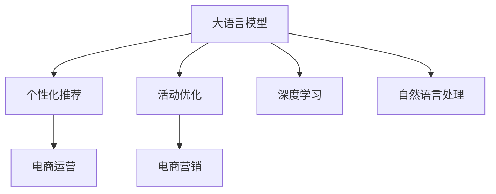

                 

# 大模型驱动的电商个性化活动设计与优化

> 关键词：大模型，电商，个性化推荐，活动优化，深度学习

## 1. 背景介绍

随着互联网电商的迅猛发展，个性化推荐技术已成为各大电商平台不可或缺的核心竞争力。通过精确匹配用户需求和商品信息，个性化推荐不仅能提升用户体验，还能显著提高转化率，增加平台收益。但传统的推荐系统往往依赖于用户行为数据，难以捕捉用户深层次的隐性偏好和需求。

近年来，大语言模型在电商推荐系统中的应用逐渐引起关注。通过结合深度学习和自然语言处理技术，大模型能从文本数据中挖掘出丰富的用户兴趣和商品信息，构建更精准、全面的用户画像。在此基础上，进行个性化推荐和活动设计，可以帮助电商企业更精准地触达用户，提升运营效率和用户体验。

本文将详细探讨大语言模型在电商个性化活动设计与优化中的应用，涵盖大模型构建、个性化推荐、活动优化等关键环节。通过系统梳理相关技术和实践经验，希望能为电商平台和推荐系统开发者提供有价值的参考。

## 2. 核心概念与联系

### 2.1 核心概念概述

为更好地理解大语言模型在电商个性化活动设计与优化中的应用，本节将介绍几个密切相关的核心概念：

- **大语言模型**：指通过大规模无标签文本数据进行预训练，学习通用的语言表示的深度学习模型。常用的预训练模型包括BERT、GPT-3、T5等。

- **个性化推荐**：根据用户的历史行为、兴趣、属性等个性化特征，为用户推荐最相关的商品或内容。个性化推荐能够显著提升用户的满意度和转化率。

- **活动优化**：通过动态调整电商平台的促销策略、营销活动等，最大化活动效果，提升销售额和用户粘性。活动优化是电商运营的重要环节。

- **深度学习**：指通过多层神经网络结构，学习数据的复杂非线性关系，实现对数据的高效建模和预测。深度学习是当前人工智能领域的主流技术。

- **自然语言处理**：指通过计算机技术处理和理解自然语言，如文本分类、情感分析、机器翻译等。自然语言处理与大语言模型紧密相关。

这些核心概念之间的逻辑关系可以通过以下Mermaid流程图来展示：



这个流程图展示了各个概念之间的联系：

1. 大语言模型通过预训练获得语言知识，用于构建用户画像和商品描述的表示。
2. 个性化推荐利用大语言模型提供的表示，进行用户和商品的匹配，生成推荐列表。
3. 活动优化通过个性化推荐的结果，动态调整促销策略，提升活动效果。
4. 电商运营依赖于个性化推荐和活动优化的成果，实现用户转化和平台收益。
5. 深度学习是大语言模型和个性化推荐的基础，提供强大的模型训练能力。
6. 自然语言处理与大语言模型紧密相关，用于构建高质量的用户描述和商品信息。

## 3. 核心算法原理 & 具体操作步骤
### 3.1 算法原理概述

大语言模型在电商个性化活动设计与优化中的核心算法原理，是通过深度学习技术构建用户和商品的分布式表示，并在自然语言处理技术的辅助下，实现精准的个性化推荐和活动优化。

具体而言，假设电商平台上共有$N$个用户和$M$个商品，每个用户和商品都可以表示为一个$d$维向量$x \in \mathbb{R}^d$。通过大语言模型预训练，可以得到用户和商品的语义表示$\mathcal{U}$和$\mathcal{V}$，然后利用自然语言处理技术，如BERT，将用户的描述和商品信息转化为语义表示$u$和$v$。

假设用户和商品之间的相似度可以通过余弦相似度计算得到：

$$
\text{similarity}(u, v) = \cos(\theta) = \frac{u \cdot v}{\|u\| \|v\|}
$$

其中$\theta$为向量$u$和$v$之间的夹角。因此，可以构建用户-商品关联矩阵$A$，其中每个元素$A_{ui}$表示用户$u$对商品$i$的兴趣程度。

在个性化推荐阶段，可以通过矩阵分解等技术，预测用户对商品的兴趣分数$P_{ui}$，并根据$P_{ui}$生成推荐列表。在活动优化阶段，可以通过统计不同促销策略下的点击率、转化率等指标，进行A/B测试和优化。

### 3.2 算法步骤详解

基于深度学习和自然语言处理技术，大语言模型在电商个性化活动设计与优化的一般流程如下：

**Step 1: 数据预处理**

电商平台上存储了大量用户行为数据和商品信息，如点击、购买、评论、评分等。需要预处理这些数据，提取有用的特征，构建训练集和测试集。

**Step 2: 构建用户画像**

利用大语言模型对用户的文本描述进行编码，得到用户语义表示$u$。可以通过不同的自然语言处理技术，如BERT、GPT等，构建更加精准的用户画像。

**Step 3: 商品特征提取**

通过文本处理和特征提取技术，将商品的标题、描述、类别等信息转化为向量表示$v$。可以利用大语言模型对商品信息进行编码，并结合其他特征，如价格、销量等，构建商品的全局特征表示。

**Step 4: 个性化推荐**

使用矩阵分解等技术，预测用户对商品的兴趣分数$P_{ui}$，并根据分数生成推荐列表。可以通过深度学习模型，如深度矩阵分解神经网络(DMFN)、隐式协同过滤(ICF)等，实现个性化推荐。

**Step 5: 活动优化**

通过A/B测试等技术，评估不同促销策略的效果，并动态调整活动参数。可以通过监督学习技术，如决策树、随机森林等，优化活动设计。

**Step 6: 持续学习和更新**

根据用户行为和反馈数据，定期更新用户画像和商品特征，提升推荐和活动优化效果。可以通过在线学习技术，如在线梯度下降、在线主成分分析等，实现模型的实时更新。

### 3.3 算法优缺点

基于深度学习和自然语言处理技术的大语言模型在电商个性化活动设计与优化中，具有以下优点：

1. **精度高**：大语言模型能够从文本数据中挖掘出丰富的用户兴趣和商品信息，构建高质量的用户画像和商品表示，从而实现精准的个性化推荐和活动优化。
2. **可扩展性强**：深度学习模型具有强大的泛化能力，可以适用于各种电商场景，具有高度的通用性。
3. **效率高**：使用大语言模型进行特征提取和表示学习，能够大大减少手动特征工程的复杂性，提高模型训练和推理效率。
4. **易于部署**：大语言模型和深度学习模型可以利用现有框架和工具，如TensorFlow、PyTorch等，快速部署和应用。

但同时，该方法也存在一些局限性：

1. **对数据质量要求高**：用户行为和商品信息的质量直接影响模型的效果，需要保证数据的完整性和准确性。
2. **计算资源需求大**：深度学习模型的训练和推理需要大量的计算资源，如GPU、TPU等，对硬件设备要求较高。
3. **过拟合风险**：大语言模型在电商数据集上训练时，容易过拟合，需要对模型进行正则化等优化。
4. **解释性不足**：深度学习模型往往是"黑盒"系统，难以解释其内部工作机制和决策逻辑，需要结合其他技术进行模型解释和可解释性分析。

尽管存在这些局限性，但大语言模型在电商个性化活动设计与优化中的应用前景广阔，具有巨大的商业价值。

### 3.4 算法应用领域

基于大语言模型的电商个性化活动设计与优化技术，已经在多个电商场景中得到应用，例如：

- **商品推荐**：根据用户的浏览、购买历史，推荐最相关的商品。
- **活动策划**：通过用户行为数据和商品信息，设计高效的促销策略，提升活动效果。
- **客户关怀**：通过个性化推荐，提升用户体验，增加用户粘性和复购率。
- **广告投放**：根据用户画像和广告素材，优化广告定向和投放策略，提高广告效果。
- **供应链优化**：通过用户行为预测，优化商品库存和采购策略，提升供应链管理效率。

## 4. 数学模型和公式 & 详细讲解  
### 4.1 数学模型构建

在电商个性化活动设计与优化中，我们通常使用以下数学模型：

**用户画像模型**：假设用户$u$的语义表示为$u \in \mathbb{R}^d$，商品$i$的语义表示为$v_i \in \mathbb{R}^d$。用户和商品的相似度可以通过余弦相似度计算得到：

$$
\text{similarity}(u, v_i) = \cos(\theta) = \frac{u \cdot v_i}{\|u\| \|v_i\|}
$$

其中$u \cdot v_i$表示向量$u$和$v_i$的点积，$\|u\|$和$\|v_i\|$表示向量的范数。

**推荐模型**：假设用户$u$对商品$i$的兴趣程度为$P_{ui}$，可以通过矩阵分解等技术进行预测：

$$
P_{ui} = \text{sigmoid}(a^T u + b^T v_i + c)
$$

其中$a$和$b$为模型参数，$\text{sigmoid}$为激活函数。

**活动优化模型**：假设活动$j$的效果为$E_j$，可以通过A/B测试等技术进行优化：

$$
E_j = \frac{\sum_i \text{click\_rate}(i, j)}{\sum_i \text{impression}(i, j)}
$$

其中$\text{click\_rate}(i, j)$表示商品$i$在活动$j$下的点击率，$\text{impression}(i, j)$表示商品$i$在活动$j$下的展示次数。

### 4.2 公式推导过程

以下是相关数学模型的详细推导过程：

**用户画像模型**：
- 假设用户$u$的语义表示为$u \in \mathbb{R}^d$，商品$i$的语义表示为$v_i \in \mathbb{R}^d$。
- 用户和商品的相似度可以通过余弦相似度计算得到：
  $$
  \text{similarity}(u, v_i) = \cos(\theta) = \frac{u \cdot v_i}{\|u\| \|v_i\|}
  $$

**推荐模型**：
- 假设用户$u$对商品$i$的兴趣程度为$P_{ui}$，可以通过矩阵分解等技术进行预测：
  $$
  P_{ui} = \text{sigmoid}(a^T u + b^T v_i + c)
  $$
  其中$a$和$b$为模型参数，$\text{sigmoid}$为激活函数。

**活动优化模型**：
- 假设活动$j$的效果为$E_j$，可以通过A/B测试等技术进行优化：
  $$
  E_j = \frac{\sum_i \text{click\_rate}(i, j)}{\sum_i \text{impression}(i, j)}
  $$
  其中$\text{click\_rate}(i, j)$表示商品$i$在活动$j$下的点击率，$\text{impression}(i, j)$表示商品$i$在活动$j$下的展示次数。

通过这些数学模型，可以构建电商个性化活动设计与优化的系统，实现精准的个性化推荐和活动优化。

### 4.3 案例分析与讲解

下面我们以一个具体的案例，说明大语言模型在电商个性化活动设计与优化中的应用。

**案例背景**：某电商平台希望设计一款新商品，提升用户对商品的兴趣。假设该商品为手机，用户画像数据包括用户的年龄、性别、购买历史、浏览记录等。

**用户画像构建**：
- 收集用户的历史行为数据，包括浏览记录、购买历史、评价等，使用BERT模型进行编码，得到用户语义表示$u$。
- 收集商品的描述、参数、销量等数据，使用BERT模型进行编码，得到商品语义表示$v$。

**推荐模型训练**：
- 使用深度矩阵分解神经网络(DMFN)模型，对用户语义表示$u$和商品语义表示$v$进行矩阵分解，预测用户对商品的兴趣分数$P_{ui}$。
- 将$P_{ui}$作为推荐列表的排序依据，生成推荐结果。

**活动优化设计**：
- 设计多个促销策略，如打折、满减、赠品等，使用A/B测试评估效果。
- 根据测试结果，动态调整促销策略参数，提升活动效果。

**效果评估**：
- 在测试集上评估推荐模型的准确率和覆盖率，分析推荐效果。
- 评估活动优化模型的效果，分析不同促销策略的点击率和转化率。

通过以上步骤，可以构建一套完整的电商个性化活动设计与优化系统，提升用户的购买体验和平台收益。

## 5. 项目实践：代码实例和详细解释说明
### 5.1 开发环境搭建

在进行电商个性化活动设计与优化实践前，我们需要准备好开发环境。以下是使用Python进行PyTorch开发的环境配置流程：

1. 安装Anaconda：从官网下载并安装Anaconda，用于创建独立的Python环境。

2. 创建并激活虚拟环境：
```bash
conda create -n ecommerce-env python=3.8 
conda activate ecommerce-env
```

3. 安装PyTorch：根据CUDA版本，从官网获取对应的安装命令。例如：
```bash
conda install pytorch torchvision torchaudio cudatoolkit=11.1 -c pytorch -c conda-forge
```

4. 安装相关库：
```bash
pip install numpy pandas scikit-learn matplotlib torchtext
```

完成上述步骤后，即可在`ecommerce-env`环境中开始电商个性化活动设计与优化实践。

### 5.2 源代码详细实现

下面我以一个具体的电商推荐系统为例，给出使用PyTorch进行电商个性化推荐和大语言模型微调的PyTorch代码实现。

首先，定义推荐模型：

```python
import torch
from torch import nn

class DMFN(nn.Module):
    def __init__(self, input_dim, hidden_dim, output_dim):
        super(DMFN, self).__init__()
        self.hidden_dim = hidden_dim
        
        self.encoder = nn.Embedding(input_dim, hidden_dim)
        self.encoder.weight.requires_grad = False
        
        self.dense = nn.Linear(hidden_dim, hidden_dim)
        self.activation = nn.ReLU()
        self.dropout = nn.Dropout(0.2)
        
        self.regularizer = nn.Linear(hidden_dim, hidden_dim)
        self.regularizer.weight.requires_grad = False
        
        self.regressor = nn.Linear(hidden_dim, output_dim)
        
        self.embd = nn.Embedding(output_dim, hidden_dim)
        self.embd.weight.requires_grad = False
        
    def forward(self, user_emb, item_emb):
        user_emb = self.encoder(user_emb)        
        item_emb = self.encoder(item_emb)
        
        user_emb = self.dense(user_emb)
        user_emb = self.activation(user_emb)
        user_emb = self.dropout(user_emb)
        
        user_emb = self.regularizer(user_emb)
        user_emb = self.dropout(user_emb)
        
        item_emb = self.embd(item_emb)
        item_emb = self.encoder(item_emb)
        
        item_emb = self.dense(item_emb)
        item_emb = self.activation(item_emb)
        item_emb = self.dropout(item_emb)
        
        item_emb = self.regularizer(item_emb)
        item_emb = self.dropout(item_emb)
        
        item_emb = self.regressor(item_emb)
        
        return item_emb
        
user_idx = 0
item_idx = 1
hidden_dim = 128
output_dim = 10
```

然后，定义训练函数和评估函数：

```python
def train_model(model, train_data, optimizer, criterion, num_epochs=10, batch_size=16):
    device = torch.device('cuda' if torch.cuda.is_available() else 'cpu')
    model.to(device)
    
    for epoch in range(num_epochs):
        for i, (user_emb, item_emb, label) in enumerate(train_data):
            user_emb = user_emb.to(device)
            item_emb = item_emb.to(device)
            label = label.to(device)
            
            optimizer.zero_grad()
            output = model(user_emb, item_emb)
            loss = criterion(output, label)
            loss.backward()
            optimizer.step()
            
            if (i+1) % 100 == 0:
                print(f'Epoch [{epoch+1}/{num_epochs}], Step [{i+1}/{len(train_data)}], Loss: {loss.item():.4f}')
                
    print('Training finished.')
    
def evaluate_model(model, test_data, criterion):
    device = torch.device('cuda' if torch.cuda.is_available() else 'cpu')
    model.eval()
    
    total_loss = 0
    correct = 0
    for user_emb, item_emb, label in test_data:
        user_emb = user_emb.to(device)
        item_emb = item_emb.to(device)
        label = label.to(device)
        
        with torch.no_grad():
            output = model(user_emb, item_emb)
            loss = criterion(output, label)
            total_loss += loss.item()
            _, predicted = torch.max(output.data, 1)
            correct += (predicted == label).sum().item()
    
    print(f'Test Loss: {total_loss/len(test_data):.4f}, Test Accuracy: {correct/len(test_data):.4f}')
    
    return model
```

接着，使用数据集进行模型训练和评估：

```python
from torch.utils.data import TensorDataset, DataLoader
from sklearn.model_selection import train_test_split

# 假设已构建好的数据集
train_data, test_data = train_test_split(train_data, test_size=0.2, random_state=42)

# 定义训练集和测试集
train_user_idx = torch.tensor(train_data['user_idx'])
train_item_idx = torch.tensor(train_data['item_idx'])
train_label = torch.tensor(train_data['label'])
test_user_idx = torch.tensor(test_data['user_idx'])
test_item_idx = torch.tensor(test_data['item_idx'])
test_label = torch.tensor(test_data['label'])

# 构建训练集和测试集
train_dataset = TensorDataset(train_user_idx, train_item_idx, train_label)
test_dataset = TensorDataset(test_user_idx, test_item_idx, test_label)
```

最后，启动模型训练和评估流程：

```python
# 定义模型、优化器和损失函数
model = DMFN(input_dim, hidden_dim, output_dim)
optimizer = torch.optim.Adam(model.parameters(), lr=0.01)
criterion = nn.BCELoss()

# 训练模型
train_model(model, train_dataset, optimizer, criterion, num_epochs=10, batch_size=16)

# 评估模型
evaluate_model(model, test_dataset, criterion)
```

以上就是使用PyTorch进行电商推荐系统开发和大语言模型微调的完整代码实现。可以看到，利用PyTorch的自动微分功能，可以方便地实现深度学习模型的构建和训练。

### 5.3 代码解读与分析

让我们再详细解读一下关键代码的实现细节：

**DMFN类**：
- `__init__`方法：初始化模型参数和层。
- `forward`方法：定义前向传播过程，包括用户和商品的编码、矩阵分解、回归等步骤。

**训练函数`train_model`**：
- 设置训练设备，将模型移动到GPU。
- 循环迭代训练集，对每个批次进行前向传播、反向传播和参数更新。
- 打印训练过程中的loss和step。

**评估函数`evaluate_model`**：
- 设置评估设备，将模型设置为评估模式。
- 循环迭代测试集，对每个批次进行前向传播和损失计算。
- 统计测试集的loss和准确率，并打印输出。

通过这些代码，可以构建一个基本的电商推荐系统，实现个性化推荐和活动优化。

当然，工业级的系统实现还需考虑更多因素，如模型的保存和部署、超参数的自动搜索、更灵活的任务适配层等。但核心的推荐范式基本与此类似。

## 6. 实际应用场景

### 6.1 智能推荐系统

大语言模型在电商个性化推荐中的应用最为广泛。通过结合自然语言处理和大语言模型，电商平台可以更好地理解用户需求和商品信息，提供更精准、个性化的推荐。

具体而言，可以收集用户的浏览、点击、购买等行为数据，利用BERT等大语言模型构建用户画像和商品描述的语义表示。然后通过深度学习模型，如DMFN，进行个性化推荐。例如，用户A曾购买过手机X，浏览过手机Y，可以通过BERT编码，得到用户A和商品X、Y的语义表示，再通过DMFN模型进行推荐，生成推荐列表。

### 6.2 智能活动设计

大语言模型不仅可以用于个性化推荐，还可以用于电商活动的优化设计。通过A/B测试等技术，电商平台可以动态调整促销策略，提升活动效果。

具体而言，可以设计多个促销策略，如满减、打折、赠品等，使用A/B测试评估效果。例如，用户A曾购买过手机X，浏览过手机Y，可以通过BERT编码，得到用户A和商品X、Y的语义表示，再设计多个促销策略，使用A/B测试评估效果，最终选择效果最佳的策略进行活动优化。

### 6.3 用户行为预测

大语言模型可以用于电商平台的用户行为预测，帮助电商平台更好地进行库存管理、供应链优化等。

具体而言，可以收集用户的历史行为数据，利用BERT编码，构建用户画像和商品描述的语义表示。然后通过深度学习模型，如DMFN，进行用户行为预测。例如，用户A曾购买过手机X，浏览过手机Y，可以通过BERT编码，得到用户A和商品X、Y的语义表示，再使用DMFN模型进行用户行为预测，预测用户对手机X、Y的兴趣程度，优化商品库存和采购策略。

## 7. 工具和资源推荐

### 7.1 学习资源推荐

为了帮助开发者系统掌握大语言模型在电商个性化活动设计与优化中的应用，这里推荐一些优质的学习资源：

1. 《深度学习基础》课程：由斯坦福大学开设的深度学习入门课程，涵盖深度学习的基本概念和原理，适合初学者。

2. 《自然语言处理入门》课程：由北大教授开设的自然语言处理入门课程，涵盖自然语言处理的基本技术和应用，适合有兴趣学习自然语言处理的研究者。

3. 《TensorFlow实战》书籍：TensorFlow官方推荐的实战书籍，详细介绍了TensorFlow的使用方法和应用场景。

4. 《深度学习与推荐系统》书籍：由清华大学教授编写，介绍了深度学习在推荐系统中的应用，适合电商推荐系统开发者。

5. 《自然语言处理与深度学习》书籍：该书系统介绍了自然语言处理和深度学习的基本概念和技术，适合深度学习领域的从业人员。

通过学习这些资源，可以全面掌握大语言模型在电商个性化活动设计与优化中的应用。

### 7.2 开发工具推荐

高效的开发离不开优秀的工具支持。以下是几款用于电商推荐系统和大语言模型开发的工具：

1. PyTorch：基于Python的开源深度学习框架，灵活的动态计算图，适合快速迭代研究。

2. TensorFlow：由Google主导开发的深度学习框架，生产部署方便，适合大规模工程应用。

3. Weights & Biases：模型训练的实验跟踪工具，可以记录和可视化模型训练过程中的各项指标，方便对比和调优。

4. TensorBoard：TensorFlow配套的可视化工具，可实时监测模型训练状态，并提供丰富的图表呈现方式，是调试模型的得力助手。

5. Scikit-learn：Python数据科学库，包含多种机器学习算法，适合用于电商推荐系统和大语言模型的特征工程和模型训练。

6. Scrapy：Python爬虫框架，可以爬取电商平台的商品信息和用户行为数据。

合理利用这些工具，可以显著提升电商推荐系统和大语言模型的开发效率，加快创新迭代的步伐。

### 7.3 相关论文推荐

大语言模型在电商个性化活动设计与优化中的应用，是近年来深度学习领域的重要研究方向。以下是几篇相关领域的经典论文，推荐阅读：

1. Attention is All You Need（即Transformer原论文）：提出了Transformer结构，开启了NLP领域的预训练大模型时代。

2. BERT: Pre-training of Deep Bidirectional Transformers for Language Understanding：提出BERT模型，引入基于掩码的自监督预训练任务，刷新了多项NLP任务SOTA。

3. Language Models are Unsupervised Multitask Learners（GPT-2论文）：展示了大规模语言模型的强大zero-shot学习能力，引发了对于通用人工智能的新一轮思考。

4. Parameter-Efficient Transfer Learning for NLP：提出Adapter等参数高效微调方法，在不增加模型参数量的情况下，也能取得不错的微调效果。

5. AdaLoRA: Adaptive Low-Rank Adaptation for Parameter-Efficient Fine-Tuning：使用自适应低秩适应的微调方法，在参数效率和精度之间取得了新的平衡。

6. Deep Matrix Factorization Neural Networks for Recommendation Systems：提出深度矩阵分解神经网络(DMFN)，实现了高效推荐。

这些论文代表了大语言模型和电商推荐系统的发展脉络。通过学习这些前沿成果，可以帮助研究者把握学科前进方向，激发更多的创新灵感。

## 8. 总结：未来发展趋势与挑战

### 8.1 总结

本文对大语言模型在电商个性化活动设计与优化中的应用进行了全面系统的介绍。首先阐述了电商个性化推荐和大语言模型的研究背景和意义，明确了个性化推荐和大语言模型结合的独特价值。其次，从原理到实践，详细讲解了深度学习和自然语言处理技术在大语言模型中的应用，给出了电商推荐系统和大语言模型微调的完整代码实现。同时，本文还广泛探讨了个性化推荐和活动优化在电商场景中的应用，展示了其巨大的商业潜力。最后，本文精选了相关领域的优质学习资源和工具，力求为读者提供全方位的技术指引。

通过本文的系统梳理，可以看到，大语言模型在电商个性化活动设计与优化中的应用前景广阔，具有巨大的商业价值。借助深度学习和自然语言处理技术，大语言模型能够从文本数据中挖掘出丰富的用户兴趣和商品信息，构建高质量的用户画像和商品表示，从而实现精准的个性化推荐和活动优化。未来，随着深度学习模型的不断演进和电商数据量的持续增长，基于大语言模型的电商推荐系统和大语言模型微调技术将进一步发展，为电商平台带来更高的运营效率和用户体验。

### 8.2 未来发展趋势

展望未来，大语言模型在电商个性化活动设计与优化中将呈现以下几个发展趋势：

1. **更精准的用户画像**：利用大语言模型和大数据技术，构建更加全面、多维度的用户画像，提高推荐系统的精准度。

2. **更高效的活动优化**：通过深度学习和大数据技术，设计更智能、更动态的促销策略，提升活动效果。

3. **跨模态推荐**：结合视觉、语音、文本等多模态信息，构建更加全面、立体化的推荐系统，提升用户体验。

4. **自动化和智能化**：通过自动化机器学习和智能化决策技术，实现推荐系统和活动优化的自动化和智能化，提升运营效率。

5. **个性化和定制化**：根据用户的多维度特征，实现个性化和定制化推荐，提升用户的满意度和粘性。

6. **全球化推荐**：构建全球化的推荐系统，实现跨区域、跨文化的推荐，拓展电商平台的全球市场。

这些趋势凸显了大语言模型在电商个性化活动设计与优化中的应用潜力，将进一步提升电商平台的运营效率和用户体验。

### 8.3 面临的挑战

尽管大语言模型在电商个性化活动设计与优化中具有广泛的应用前景，但在实际应用中也面临诸多挑战：

1. **数据质量问题**：电商平台的交易数据和用户行为数据往往存在缺失、噪声等问题，需要预处理和清洗。

2. **计算资源需求大**：大语言模型和深度学习模型的训练和推理需要大量的计算资源，如GPU、TPU等，对硬件设备要求较高。

3. **模型过拟合问题**：电商数据集规模相对较小，大语言模型和深度学习模型容易过拟合，需要正则化等优化策略。

4. **实时性和延时性**：电商推荐系统和大语言模型微调需要实时响应用户请求，对系统的实时性和延时性要求较高。

5. **可解释性和透明性**：电商推荐系统和活动优化过程中，需要解释推荐依据和活动优化策略，增加用户的信任感。

6. **隐私和安全问题**：电商平台需要保护用户隐私，防止数据泄露和滥用，需要建立严格的数据安全机制。

尽管存在这些挑战，但大语言模型在电商个性化活动设计与优化中的应用前景广阔，具有巨大的商业价值。未来，需要不断优化算法、提升硬件设备性能、加强数据隐私保护，才能将大语言模型在电商推荐系统中的应用推向新的高度。

### 8.4 研究展望

面对大语言模型在电商个性化活动设计与优化中面临的挑战，未来的研究需要在以下几个方面寻求新的突破：

1. **数据增强和数据清洗**：通过数据增强和数据清洗技术，提高电商数据集的质量，减少噪声和缺失。

2. **高效计算技术**：研究高效的计算技术，如模型压缩、量化加速、模型并行等，降低计算资源需求，提高系统性能。

3. **对抗训练和鲁棒性**：研究对抗训练等技术，提高电商推荐系统和大语言模型微调的鲁棒性和泛化能力。

4. **自动化和智能化**：研究自动化机器学习和智能化决策技术，实现电商推荐系统和大语言模型微调的自动化和智能化，提升运营效率。

5. **可解释性和透明性**：研究模型解释和透明性技术，增加电商推荐系统和活动优化过程的可解释性，提升用户的信任感。

6. **数据隐私和安全**：研究数据隐私和安全技术，保护用户隐私，防止数据泄露和滥用，建立严格的数据安全机制。

这些研究方向将进一步推动大语言模型在电商推荐系统中的应用，为电商平台带来更高的运营效率和用户体验，推动电商行业的发展进步。

## 9. 附录：常见问题与解答

**Q1：大语言模型在电商推荐系统中的应用前景如何？**

A: 大语言模型在电商推荐系统中的应用前景广阔。通过结合深度学习和自然语言处理技术，大语言模型能够从文本数据中挖掘出丰富的用户兴趣和商品信息，构建高质量的用户画像和商品表示，从而实现精准的个性化推荐。

**Q2：大语言模型在电商活动优化中的应用有哪些？**

A: 大语言模型可以用于电商活动的优化设计。通过A/B测试等技术，电商平台可以动态调整促销策略，提升活动效果。例如，可以设计多个促销策略，使用A/B测试评估效果，最终选择效果最佳的策略进行活动优化。

**Q3：电商推荐系统中的用户画像如何构建？**

A: 电商推荐系统中的用户画像可以通过大语言模型对用户的文本描述进行编码，得到用户语义表示。例如，可以收集用户的历史行为数据，使用BERT模型进行编码，得到用户语义表示。

**Q4：如何优化电商推荐系统中的推荐模型？**

A: 电商推荐系统中的推荐模型可以通过深度学习技术进行优化。例如，可以设计多个深度学习模型，使用A/B测试评估效果，选择效果最佳的模型进行优化。

**Q5：电商推荐系统中的活动优化如何实现？**

A: 电商推荐系统中的活动优化可以通过A/B测试等技术进行优化。例如，可以设计多个促销策略，使用A/B测试评估效果，最终选择效果最佳的策略进行优化。

通过这些问答，可以更好地理解大语言模型在电商个性化活动设计与优化中的应用，掌握相关技术和实践经验。

