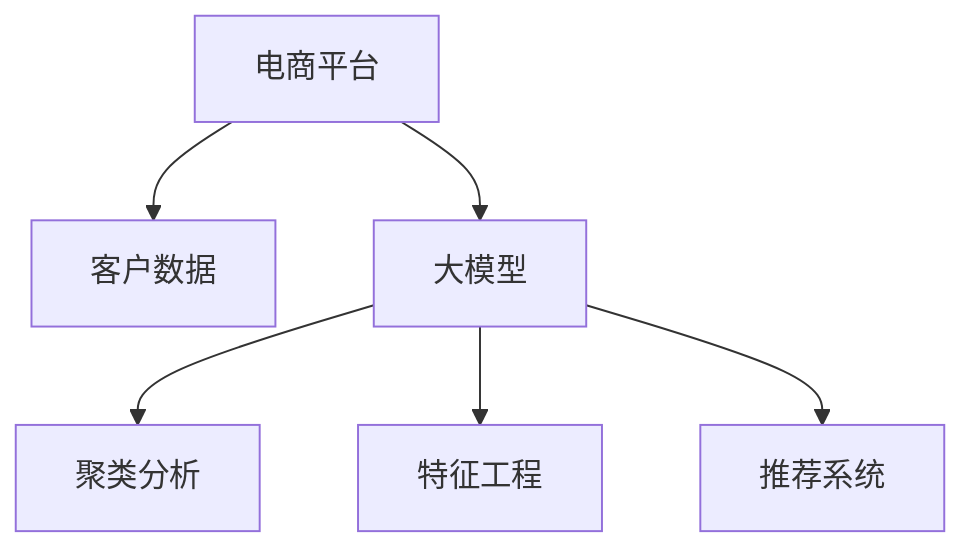

                 

# 大模型驱动的电商平台智能客户细分

> 关键词：电商平台,客户细分,大模型,深度学习,聚类,特征工程,推荐系统,个性化

## 1. 背景介绍

在当今数字化转型的大背景下，电商平台正面临着越来越激烈的竞争。如何通过智能技术，洞察客户需求，提升客户体验，实现个性化推荐和服务，是电商平台能否脱颖而出的关键。电商平台客户细分，即对客户进行聚类分析，将客户按照不同特征分组，以便制定差异化策略，是电商智能化发展的基石。

在传统的客户细分方法中，主要依赖人工经验、调查问卷等手段，耗时长、成本高，且容易受到主观因素影响。而利用深度学习大模型，可以对大规模客户数据进行高效处理和分析，实现更加科学、精准的客户细分。本文将介绍如何通过大模型驱动，实现电商平台的智能客户细分。

## 2. 核心概念与联系

### 2.1 核心概念概述

为更好地理解基于大模型的客户细分方法，本节将介绍几个密切相关的核心概念：

- 电商平台(E-commerce Platform)：以网络为媒介，实现商品展示、销售、配送等全流程的在线交易平台。

- 客户细分(Customer Segmentation)：将客户按照特定属性（如年龄、性别、消费行为等）进行分组，以便制定差异化营销策略。

- 大模型(Large Model)：以深度神经网络为代表的庞大参数模型，如BERT、GPT、Transformer等，通过大规模数据训练，具备强大的数据处理和分析能力。

- 聚类(Clustering)：无监督学习方法，用于将相似客户聚集为一组，形成客户群体。

- 特征工程(Feature Engineering)：提取和构造有效特征，以提高模型的训练效果和泛化能力。

- 推荐系统(Recommendation System)：利用用户历史行为数据，为用户提供个性化的商品推荐。

这些核心概念之间的逻辑关系可以通过以下Mermaid流程图来展示：



这个流程图展示了大模型在电商平台客户细分中的核心作用：

1. 客户数据收集：电商平台收集客户的基本信息、行为数据等。
2. 特征工程：从原始数据中提取和构造有效特征。
3. 聚类分析：利用大模型进行无监督聚类，形成不同的客户群体。
4. 个性化推荐：根据聚类结果，设计推荐系统，对不同群体进行个性化推荐。

## 3. 核心算法原理 & 具体操作步骤
### 3.1 算法原理概述

基于大模型的客户细分，实质上是一个多步骤的深度学习过程。其核心思想是通过深度学习模型，对客户数据进行特征提取和聚类分析，从而形成不同的客户群体。具体来说，主要包括特征提取、聚类分析和推荐系统三个步骤。

### 3.2 算法步骤详解

**Step 1: 数据收集与预处理**

在客户细分之前，首先需要收集客户的全量数据，并对其进行清洗和预处理。数据收集的来源包括：

- 客户基本信息：如年龄、性别、职业等。
- 行为数据：如浏览记录、购买历史、评分等。
- 社交网络数据：如社交媒体互动、评论等。

数据预处理的主要目标是：

- 数据清洗：去除重复、噪声、异常数据。
- 数据标准化：将不同来源的数据转换为统一格式。
- 数据平衡：对于不平衡的数据集，进行过采样或欠采样，以保证各群体的代表性。

**Step 2: 特征提取**

在数据预处理的基础上，对客户数据进行特征提取。特征提取的目的是将原始数据转化为对模型有意义的数值型特征，提高模型的训练效果。常见的特征提取方法包括：

- 工程特征：如用户的购买金额、浏览次数、评分等。
- 统计特征：如用户活跃天数、访问时长等。
- 离散特征：如用户年龄、职业、地区等。
- 文本特征：如用户评论、商品描述等。

特征提取的难点在于：

- 特征选择：从众多特征中选择最具代表性的特征。
- 特征构造：构造新的特征，以捕捉数据中的潜在模式。

**Step 3: 聚类分析**

聚类分析的目标是将客户分成若干个群体，每个群体内的客户在某种程度上是相似的，不同群体之间则存在明显差异。常见的聚类算法包括K-Means、层次聚类、DBSCAN等。基于大模型的聚类方法通常使用自编码器或变分自编码器，具体流程如下：

1. 将客户数据输入大模型，提取高层次的特征表示。
2. 使用自编码器或变分自编码器，对特征表示进行降维。
3. 使用K-Means或层次聚类等算法，将降维后的数据分成若干个聚类。
4. 对每个聚类进行描述和可视化，形成不同的客户群体。

**Step 4: 个性化推荐**

在客户聚类的基础上，可以构建个性化推荐系统，对不同客户群体进行有针对性的商品推荐。常见的推荐算法包括协同过滤、基于内容的推荐、混合推荐等。基于大模型的推荐方法通常使用深度学习模型，具体流程如下：

1. 将客户聚类结果作为输入，训练推荐模型。
2. 使用特征工程方法，构造用户和商品的特征。
3. 使用深度学习模型，预测用户对商品的评分或概率。
4. 根据评分或概率，对不同客户群体进行个性化推荐。

### 3.3 算法优缺点

基于大模型的客户细分方法具有以下优点：

1. 高效性：大模型能够处理大规模客户数据，实现高效的数据分析和聚类。
2. 准确性：利用深度学习模型，能够捕捉数据的复杂关系和模式，提升聚类和推荐的效果。
3. 灵活性：可以通过特征工程，定制不同的特征表示，适应不同的客户细分需求。
4. 可扩展性：支持多模态数据融合，如文本、图像、时间序列等，扩展客户分类的维度。

同时，该方法也存在一定的局限性：

1. 数据依赖性强：客户数据的质量和完整性直接影响聚类和推荐的效果。
2. 计算资源需求高：大模型的训练和推理需要高计算资源，可能带来高成本。
3. 模型复杂度高：深度学习模型的结构和参数复杂，需要丰富的训练经验和调参技巧。
4. 解释性不足：大模型通常被视为"黑盒"，难以解释其决策过程。

尽管存在这些局限性，但就目前而言，基于大模型的客户细分方法仍然是电商智能化的重要工具。未来相关研究的重点在于如何进一步降低计算成本，提升模型的解释性和鲁棒性。

### 3.4 算法应用领域

基于大模型的客户细分方法，在电商平台中有着广泛的应用，具体包括：

- 客户画像构建：通过对客户数据进行聚类分析，形成客户画像，为个性化营销提供依据。
- 精准广告投放：基于客户聚类结果，设计针对不同群体的广告策略，提升广告效果。
- 库存优化：通过聚类分析，识别出热门商品和长尾商品，优化库存配置。
- 客户流失预测：利用客户数据进行聚类分析，预测潜在流失客户，提前采取干预措施。
- 个性化推荐：根据客户聚类结果，设计推荐系统，提升用户满意度。

除了上述这些应用场景，基于大模型的客户细分技术还可以拓展到更多领域，如银行贷款评估、保险风险控制、电信用户分析等，帮助企业全面提升客户服务质量和业务效率。

## 4. 数学模型和公式 & 详细讲解  
### 4.1 数学模型构建

本节将使用数学语言对基于大模型的客户细分过程进行更加严格的刻画。

记客户数据集为 $D=\{(x_i, y_i)\}_{i=1}^N$，其中 $x_i$ 为输入特征，$y_i$ 为标签（如聚类标签或推荐标签）。假设大模型为 $M_{\theta}(x)$，其中 $\theta$ 为模型参数。

定义聚类损失函数为 $L_{\text{cluster}}(\theta) = \sum_{i=1}^N \ell_{\text{cluster}}(y_i, M_{\theta}(x_i))$，其中 $\ell_{\text{cluster}}$ 为聚类损失函数。在实际应用中，通常使用KL散度、余弦相似度等作为聚类损失函数。

定义推荐损失函数为 $L_{\text{recommend}}(\theta) = \sum_{i=1}^N \ell_{\text{recommend}}(y_i, M_{\theta}(x_i))$，其中 $\ell_{\text{recommend}}$ 为推荐损失函数。常用的推荐损失函数包括均方误差、交叉熵等。

聚类和推荐的总损失函数为 $L_{\text{total}}(\theta) = L_{\text{cluster}}(\theta) + \lambda L_{\text{recommend}}(\theta)$，其中 $\lambda$ 为聚类和推荐的权重系数。

在训练过程中，利用梯度下降等优化算法，最小化总损失函数 $L_{\text{total}}(\theta)$，使得聚类和推荐的效果同时提升。

### 4.2 公式推导过程

以下我们以K-Means聚类算法为例，推导聚类损失函数及其梯度的计算公式。

假设客户数据集 $D=\{x_1, x_2, ..., x_N\}$，其中每个样本 $x_i$ 的特征向量为 $x_i = (x_{i1}, x_{i2}, ..., x_{in})$。设 $k$ 个聚类中心分别为 $\mu_1, \mu_2, ..., \mu_k$，则聚类过程的目标是：

1. 将每个样本 $x_i$ 分配到最近的聚类中心 $\mu_j$。
2. 更新聚类中心 $\mu_j$，使得每个聚类的样本方差最小。

聚类损失函数定义为：

$$
L_{\text{cluster}}(\mu) = \sum_{i=1}^N \sum_{j=1}^k ||x_i - \mu_j||^2
$$

其中 $||\cdot||$ 为欧几里得距离。

对聚类中心 $\mu_j$ 的梯度为：

$$
\frac{\partial L_{\text{cluster}}(\mu)}{\partial \mu_j} = -\frac{2}{N} \sum_{i=1}^N (x_i - \mu_j)
$$

对样本 $x_i$ 的梯度为：

$$
\frac{\partial L_{\text{cluster}}(\mu)}{\partial x_i} = -2\sum_{j=1}^k \frac{x_i - \mu_j}{||x_i - \mu_j||^2}
$$

在实际应用中，通常采用变分自编码器等深度学习模型，进行特征提取和聚类。具体推导过程可以参考相关文献，这里不再赘述。

### 4.3 案例分析与讲解

以电商平台为例，分析基于大模型的客户细分方法在实际应用中的效果。

假设某电商平台有 $N$ 个客户，每个客户的历史行为数据包括浏览记录、购买历史、评分等。平台希望通过聚类分析，识别出不同的客户群体，并进行个性化推荐。

1. 数据收集与预处理：
   - 收集客户的浏览记录、购买历史、评分等数据。
   - 进行数据清洗，去除重复、噪声数据。
   - 进行数据标准化，统一特征格式。

2. 特征提取：
   - 提取客户的浏览次数、购买金额、评分等特征。
   - 使用深度学习模型，如BERT、GPT等，提取高层次特征表示。

3. 聚类分析：
   - 使用变分自编码器等深度学习模型，对特征表示进行降维。
   - 使用K-Means等聚类算法，将客户分成若干个群体。
   - 可视化聚类结果，分析各群体的特征和行为模式。

4. 个性化推荐：
   - 根据聚类结果，设计推荐模型，如协同过滤、基于内容的推荐等。
   - 利用用户和商品的特征，训练推荐模型。
   - 使用模型预测用户对商品的评分或概率，进行个性化推荐。

## 5. 项目实践：代码实例和详细解释说明
### 5.1 开发环境搭建

在进行客户细分项目实践前，我们需要准备好开发环境。以下是使用Python进行TensorFlow开发的环境配置流程：

1. 安装Anaconda：从官网下载并安装Anaconda，用于创建独立的Python环境。

2. 创建并激活虚拟环境：
```bash
conda create -n tensorflow-env python=3.8 
conda activate tensorflow-env
```

3. 安装TensorFlow：根据CUDA版本，从官网获取对应的安装命令。例如：
```bash
conda install tensorflow tensorflow-estimator tensorflow-hub -c conda-forge
```

4. 安装各类工具包：
```bash
pip install numpy pandas scikit-learn matplotlib tqdm jupyter notebook ipython
```

完成上述步骤后，即可在`tensorflow-env`环境中开始客户细分实践。

### 5.2 源代码详细实现

下面我以K-Means聚类为例，给出使用TensorFlow对电商平台客户数据进行聚类的Python代码实现。

首先，定义聚类函数：

```python
import tensorflow as tf
from sklearn.decomposition import PCA
from sklearn.cluster import KMeans

def kmeans_clustering(data, num_clusters):
    # 使用PCA降维
    pca = PCA(n_components=2)
    data_reduced = pca.fit_transform(data)
    
    # 使用K-Means聚类
    kmeans = KMeans(n_clusters=num_clusters)
    clusters = kmeans.fit_predict(data_reduced)
    
    return clusters
```

然后，加载和预处理数据：

```python
import pandas as pd

# 加载客户数据
data = pd.read_csv('customer_data.csv')

# 数据预处理
data = data.dropna()
data = data.drop_duplicates()

# 提取特征
features = data[['age', 'gender', 'buy_frequency', 'average_cost']]
```

接着，调用聚类函数：

```python
# 聚类
num_clusters = 5
clusters = kmeans_clustering(features, num_clusters)
```

最后，可视化聚类结果：

```python
import matplotlib.pyplot as plt

# 可视化聚类结果
plt.scatter(data['age'], data['buy_frequency'], c=clusters)
plt.xlabel('Age')
plt.ylabel('Buy Frequency')
plt.show()
```

以上就是使用TensorFlow对电商平台客户数据进行聚类的完整代码实现。可以看到，TensorFlow配合Scikit-learn等工具，可以很方便地实现聚类算法，并对聚类结果进行可视化分析。

### 5.3 代码解读与分析

让我们再详细解读一下关键代码的实现细节：

**kmeans_clustering函数**：
- `pca`：使用PCA对数据进行降维，将高维数据映射到二维空间。
- `kmeans`：使用K-Means算法进行聚类，将二维空间中的点分配到最近的聚类中心。
- `clusters`：返回聚类结果，每个样本分配到一个聚类中心。

**加载和预处理数据**：
- `pd.read_csv`：加载客户数据。
- `dropna`：去除缺失数据。
- `drop_duplicates`：去除重复数据。
- `features`：提取客户的基本信息和行为数据，作为聚类输入。

**聚类函数调用**：
- `num_clusters`：聚类数量，影响聚类的结果和分布。
- `clusters`：返回聚类结果，后续用于个性化推荐。

**可视化聚类结果**：
- `plt.scatter`：绘制聚类结果的散点图，直观展示聚类结果。
- `plt.xlabel`、`plt.ylabel`：添加坐标轴标签。

可以看到，TensorFlow等工具可以方便地实现基于大模型的客户细分，并提供了丰富的可视化功能，有助于开发者更好地理解和分析聚类结果。

当然，实际系统实现还需要考虑更多因素，如模型的保存和部署、超参数的自动搜索、更灵活的任务适配层等。但核心的聚类过程基本与此类似。

## 6. 实际应用场景
### 6.1 智能广告投放

基于大模型的客户细分方法，可以广泛应用于智能广告投放。传统的广告投放往往缺乏对客户行为的深入理解，效果有限。而利用客户聚类结果，可以设计更有针对性的广告策略，提升广告效果和ROI。

具体而言，可以将客户分为高价值、中价值、低价值三类。针对高价值客户，可以设计个性化广告，提升转化率；针对中价值客户，可以设计大众化广告，提高品牌曝光；针对低价值客户，可以设计精准退订策略，减少无效点击。

### 6.2 库存优化

库存优化是电商平台面临的重要挑战之一。传统的方法往往依赖人工经验，难以应对快速变化的库存需求。而通过客户细分，可以识别出热门商品和长尾商品，优化库存配置，避免缺货和积压。

具体而言，可以通过聚类分析，识别出不同客户群体的消费偏好。根据不同群体的需求，优化商品备货和供应链管理，提升库存周转率。

### 6.3 客户流失预测

客户流失是电商平台的重大痛点之一。通过客户细分，可以识别出潜在流失客户，提前采取干预措施，降低流失率。

具体而言，可以分析不同客户群体的流失行为模式，设计针对性的留存策略。例如，针对高流失率群体，可以设计个性化优惠活动，提升客户忠诚度。

### 6.4 个性化推荐

个性化推荐是电商平台的核心功能之一。通过客户细分，可以设计有针对性的推荐策略，提升用户满意度。

具体而言，可以根据不同客户群体的需求，推荐不同的商品。例如，针对年轻用户，可以推荐潮流新品；针对中年用户，可以推荐经典商品。

### 6.5 未来应用展望

随着大模型和微调方法的不断发展，基于客户分细的个性化推荐和广告投放将更加精准、高效。未来的客户细分技术将呈现以下几个发展趋势：

1. 数据来源多样化：除客户基本信息和行为数据外，还将引入社交网络数据、语音数据等，扩展客户分类的维度。
2. 聚类算法多样化：除了K-Means、层次聚类等传统算法外，还将引入基于深度学习的聚类算法，如密度聚类、层次聚类等。
3. 多模态数据融合：将文本、图像、时间序列等多模态数据进行融合，提升聚类和推荐的精度。
4. 模型可解释性增强：引入因果分析和博弈论等工具，增强模型的解释性和可控性。
5. 动态聚类与持续学习：通过持续学习算法，模型能够动态更新聚类结果，适应数据分布的变化。

这些趋势表明，基于大模型的客户细分技术将逐步走向智能化、普适化，为电商平台带来更深层次的个性化服务和运营优化。

## 7. 工具和资源推荐
### 7.1 学习资源推荐

为了帮助开发者系统掌握基于大模型的客户细分技术，这里推荐一些优质的学习资源：

1. 《深度学习入门：基于Python的理论与实现》系列博文：由深度学习专家撰写，深入浅出地介绍了深度学习的基本原理和实际应用。

2. 斯坦福大学《深度学习》课程：由吴恩达教授开设的深度学习经典课程，讲解深度学习的核心算法和思想。

3. 《TensorFlow实战Google深度学习框架》书籍：介绍TensorFlow的核心原理和应用场景，适合深度学习初学者。

4. Scikit-learn官方文档：Scikit-learn库的详细文档，介绍了丰富的机器学习算法和工具。

5. TensorFlow官方文档：TensorFlow的官方文档，提供了详细的API参考和示例代码。

通过这些资源的学习实践，相信你一定能够快速掌握基于大模型的客户细分技术，并用于解决实际的电商客户细分问题。

### 7.2 开发工具推荐

高效的开发离不开优秀的工具支持。以下是几款用于大模型客户细分开发的常用工具：

1. TensorFlow：由Google主导开发的开源深度学习框架，生产部署方便，适合大规模工程应用。

2. Scikit-learn：基于Python的机器学习库，提供丰富的数据处理和算法实现。

3. Keras：高层次深度学习库，提供了简洁易用的API接口。

4. TensorBoard：TensorFlow配套的可视化工具，可实时监测模型训练状态，并提供丰富的图表呈现方式。

5. Jupyter Notebook：交互式编程环境，方便进行数据探索和模型调试。

合理利用这些工具，可以显著提升客户细分任务的开发效率，加快创新迭代的步伐。

### 7.3 相关论文推荐

大模型和客户细分技术的发展源于学界的持续研究。以下是几篇奠基性的相关论文，推荐阅读：

1. "A Neural Probabilistic Language Model"：提出了神经网络语言模型，为深度学习大模型奠定了基础。

2. "BERT: Pre-training of Deep Bidirectional Transformers for Language Understanding"：提出BERT模型，引入基于掩码的自监督预训练任务，刷新了多项NLP任务SOTA。

3. "Towards Explainable Deep Learning: Understanding what models learn"：研究深度学习模型的可解释性，为模型分析提供了新思路。

4. "Customer Segmentation in E-commerce: A Survey"：总结了电子商务客户分段的经典方法和最新进展，适合技术从业者参考。

这些论文代表了大模型和客户细分技术的发展脉络。通过学习这些前沿成果，可以帮助研究者把握学科前进方向，激发更多的创新灵感。

## 8. 总结：未来发展趋势与挑战
### 8.1 总结

本文对基于大模型的电商平台智能客户细分方法进行了全面系统的介绍。首先阐述了客户细分在电商智能化中的重要意义，明确了基于大模型的客户细分方法的优势。其次，从原理到实践，详细讲解了客户分细的数学原理和关键步骤，给出了客户细分任务开发的完整代码实例。同时，本文还广泛探讨了客户细分技术在智能广告投放、库存优化、客户流失预测、个性化推荐等多个电商应用场景中的应用前景，展示了客户细分技术的巨大潜力。此外，本文精选了客户细分技术的各类学习资源，力求为读者提供全方位的技术指引。

通过本文的系统梳理，可以看到，基于大模型的客户细分技术正在成为电商智能化的重要工具，极大地拓展了客户分类的维度和方法，为电商智能化提供了坚实的数据基础和模型支撑。未来，伴随大模型和微调方法的持续演进，基于客户分细的电商智能化将进一步深入，带来更多业务价值和用户体验的提升。

### 8.2 未来发展趋势

展望未来，基于大模型的客户细分技术将呈现以下几个发展趋势：

1. 数据来源多样化：除客户基本信息和行为数据外，还将引入社交网络数据、语音数据等，扩展客户分类的维度。
2. 聚类算法多样化：除了K-Means、层次聚类等传统算法外，还将引入基于深度学习的聚类算法，如密度聚类、层次聚类等。
3. 多模态数据融合：将文本、图像、时间序列等多模态数据进行融合，提升聚类和推荐的精度。
4. 模型可解释性增强：引入因果分析和博弈论等工具，增强模型的解释性和可控性。
5. 动态聚类与持续学习：通过持续学习算法，模型能够动态更新聚类结果，适应数据分布的变化。

这些趋势表明，基于大模型的客户细分技术将逐步走向智能化、普适化，为电商平台带来更深层次的个性化服务和运营优化。

### 8.3 面临的挑战

尽管基于大模型的客户细分技术已经取得了瞩目成就，但在迈向更加智能化、普适化应用的过程中，它仍面临着诸多挑战：

1. 数据隐私和安全：客户数据包含大量隐私信息，如何保护客户隐私、确保数据安全，是客户细分技术面临的首要挑战。
2. 计算资源需求高：大模型的训练和推理需要高计算资源，可能带来高成本。
3. 模型复杂度高：深度学习模型的结构和参数复杂，需要丰富的训练经验和调参技巧。
4. 模型鲁棒性不足：当前模型面对噪声数据和异常数据时，泛化性能往往大打折扣。
5. 模型可解释性不足：大模型通常被视为"黑盒"，难以解释其决策过程。

尽管存在这些挑战，但通过不断的技术创新和实践积累，相信这些挑战终将逐一被克服，基于大模型的客户细分技术必将在电商智能化中发挥更大的作用。

### 8.4 研究展望

面对基于大模型的客户细分技术所面临的挑战，未来的研究需要在以下几个方面寻求新的突破：

1. 数据隐私保护：引入联邦学习等技术，在保障数据隐私的前提下，进行客户细分和模型训练。
2. 计算效率提升：引入模型压缩、模型剪枝等技术，降低模型复杂度，提高计算效率。
3. 模型可解释性增强：引入因果分析和博弈论等工具，增强模型的解释性和可控性。
4. 模型鲁棒性提升：引入对抗训练等技术，提高模型对噪声和异常数据的鲁棒性。
5. 动态聚类与持续学习：引入动态聚类算法，提高模型的实时响应能力。

这些研究方向将引领基于大模型的客户细分技术迈向更高的台阶，为电商平台带来更高效、更智能的客户细分方案，实现更精细化的运营管理。总之，基于大模型的客户细分技术需要在数据、模型、算法等多个维度进行全面优化，方能真正实现电商智能化。

## 9. 附录：常见问题与解答

**Q1：客户数据如何采集？**

A: 客户数据可以通过多种方式采集，包括：
1. 用户注册信息：收集用户填写的基本信息，如姓名、电话、地址等。
2. 浏览记录：记录用户的浏览行为，如浏览路径、停留时间等。
3. 购买记录：记录用户的购买行为，如购买金额、购买时间等。
4. 评分记录：记录用户对商品的评分和评论。
5. 社交网络数据：收集用户在不同社交平台上的互动信息。

**Q2：客户数据如何进行清洗和预处理？**

A: 数据清洗和预处理的目标是去除噪声、填补缺失、平衡数据。具体来说，可以通过以下步骤进行：
1. 去除重复数据：去除重复的用户记录，保持数据唯一性。
2. 处理缺失值：填补缺失值，可以采用均值、中位数、插值等方法。
3. 平衡数据：对于不平衡的数据集，可以使用过采样或欠采样，保证各群体的代表性。

**Q3：聚类算法如何选择？**

A: 聚类算法的选择取决于具体任务和数据特点。常见聚类算法包括K-Means、层次聚类、DBSCAN等。对于文本数据，可以使用变分自编码器、GAN等深度学习模型进行特征提取和聚类。

**Q4：模型如何评估？**

A: 模型评估通常采用精度、召回率、F1值等指标。对于聚类模型，可以使用轮廓系数、Calinski-Harabasz指数等指标进行评估。对于推荐模型，可以使用点击率、转化率等指标进行评估。

**Q5：如何避免数据泄露？**

A: 数据泄露是客户细分中的常见问题，需要通过以下措施进行防范：
1. 数据分割：将数据分为训练集和测试集，避免模型在测试集上出现过拟合。
2. 数据加密：对敏感数据进行加密处理，保护数据隐私。
3. 模型脱敏：对模型输出进行脱敏处理，避免模型输出包含敏感信息。

这些措施可以最大限度地保护客户隐私，确保数据安全。

