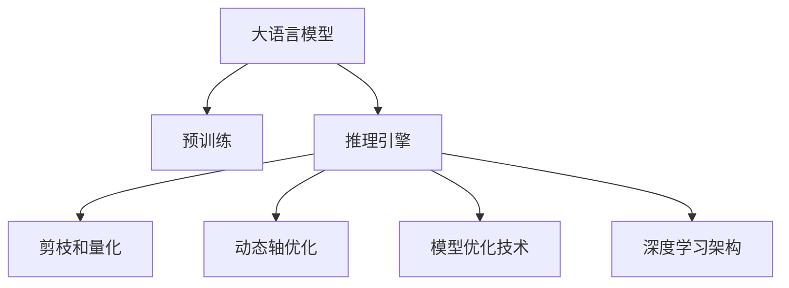

                 

# 大语言模型推理引擎：Lepton AI的核心产品，赋能企业高效应用AI

## 1. 背景介绍

### 1.1 问题由来

近年来，深度学习技术在自然语言处理（NLP）、计算机视觉（CV）和语音识别等领域取得了突破性进展。然而，深度学习模型在推理效率和计算资源方面仍面临诸多挑战。特别是在企业级应用中，对于高效、准确且易于部署的推理引擎需求日益增长。

为了应对这些挑战，Lepton AI开发了一种基于大语言模型的推理引擎，即Lepton Engine。该引擎采用先进的大规模语言模型作为核心，结合了前沿的优化技术和深度学习架构，能够在高效、准确的前提下，满足企业级AI应用的多样化需求。

### 1.2 问题核心关键点

Lepton Engine的核心在于其采用了先进的深度学习架构和推理优化技术，旨在解决以下几个关键问题：

- 推理效率：如何快速高效地执行大规模深度学习模型推理？
- 计算资源：如何在有限的计算资源下运行高效、准确的推理？
- 模型复杂度：如何设计出易于部署、可扩展的推理引擎？
- 企业应用：如何将高效的推理引擎应用到各种企业级AI场景中？

### 1.3 问题研究意义

Lepton Engine的开发和应用具有重要的研究意义：

1. **提升推理效率**：通过高效的推理引擎，可以大幅度提升深度学习模型的推理速度，满足企业级应用对实时性和延迟性的要求。
2. **降低计算成本**：Lepton Engine通过优化推理过程，减少了对高端计算资源的依赖，降低了AI应用的总体成本。
3. **增强可扩展性**：引擎的设计注重可扩展性，能够适应不同规模的推理需求，为企业提供灵活的AI解决方案。
4. **促进AI落地**：Lepton Engine为深度学习模型的应用提供了坚实的基础，推动了AI技术在企业中的广泛落地。

## 2. 核心概念与联系

### 2.1 核心概念概述

为更好地理解Lepton Engine的核心概念和架构，本节将介绍几个密切相关的核心概念：

- **大语言模型(Large Language Model, LLM)**：以Transformer模型为代表的大规模预训练语言模型，通过在海量文本数据上进行预训练，学习到丰富的语言表示，具备强大的语言理解和生成能力。
- **推理引擎**：用于高效执行深度学习模型的推理任务，优化计算资源使用，提升推理速度，是AI应用的重要组成部分。
- **模型优化技术**：包括剪枝、量化、动态轴优化等，用于减少模型大小、加速推理。
- **深度学习架构**：如卷积神经网络(CNN)、循环神经网络(RNN)、变换器(Transformer)等，用于构建高效的深度学习模型。

这些核心概念之间的逻辑关系可以通过以下Mermaid流程图来展示：



这个流程图展示了Lepton Engine的核心组件及其相互关系：

1. 大语言模型通过预训练获得基础能力。
2. 推理引擎负责执行模型的推理任务，提升效率和性能。
3. 剪枝、量化等模型优化技术进一步提升推理引擎的效能。
4. 深度学习架构如Transformer提供了强大的模型支持。

这些概念共同构成了Lepton Engine的核心技术框架，使其能够在高效、准确的前提下，满足企业级AI应用的需求。

## 3. 核心算法原理 & 具体操作步骤
### 3.1 算法原理概述

Lepton Engine的算法原理基于大规模语言模型的推理机制，结合了先进的模型优化和架构设计。其核心思想是通过深度学习架构和模型优化技术，高效地执行推理任务，提升模型推理速度和精度。

具体而言，Lepton Engine采用了以下关键技术：

- **Transformer模型**：作为大语言模型的基础架构，Transformer具备自注意力机制，能够高效地处理长序列和复杂关系。
- **剪枝和量化**：通过剪枝和量化等技术，大幅减少模型参数和计算资源消耗，提升推理效率。
- **动态轴优化**：根据输入数据的特点，动态调整计算路径，优化推理性能。
- **模型并行和分布式计算**：利用多GPU、多节点等并行计算资源，进一步提升推理速度。

### 3.2 算法步骤详解

Lepton Engine的推理过程主要分为以下几个步骤：

**Step 1: 模型选择和准备**
- 选择合适的预训练大语言模型，如BERT、GPT等。
- 加载模型和相关库，准备输入数据。

**Step 2: 模型适配和优化**
- 根据任务需求，对模型进行适配，添加必要的输出层和损失函数。
- 对模型进行剪枝和量化等优化，减少计算量和内存消耗。

**Step 3: 推理引擎初始化和配置**
- 初始化推理引擎，设置计算资源和超参数。
- 配置模型的推理路径和优化策略。

**Step 4: 数据加载和预处理**
- 加载输入数据，进行必要的预处理和归一化。
- 根据输入数据的特点，调整模型的参数和计算路径。

**Step 5: 推理执行和结果输出**
- 将处理好的数据输入模型，执行推理任务。
- 输出推理结果，并进行后处理和结果解释。

### 3.3 算法优缺点

Lepton Engine的优点包括：

1. **高效推理**：通过剪枝、量化等技术，显著提升了模型推理速度，满足了企业级应用对实时性和延迟性的要求。
2. **可扩展性强**：引擎设计注重可扩展性，能够适应不同规模的推理需求，支持多GPU、多节点分布式计算。
3. **适应性强**：针对不同的企业级AI应用场景，可以通过微调或提示学习等技术，快速适配特定任务。
4. **资源节省**：通过优化技术减少了对高端计算资源的依赖，降低了AI应用的总体成本。

Lepton Engine也存在一些局限性：

1. **模型复杂度**：对于特别复杂或大规模的模型，优化后的推理速度和性能可能仍有提升空间。
2. **超参数调优**：需要根据具体应用场景和数据特点，进行细致的超参数调优，可能需要一定的调参经验。
3. **模型部署难度**：对于需要部署在复杂系统中的推理引擎，可能需要一定的开发和部署工作。

### 3.4 算法应用领域

Lepton Engine的应用领域广泛，涵盖NLP、CV、语音识别等多个领域。以下是几个典型的应用场景：

1. **智能客服**：使用大语言模型进行对话理解和生成，提升客服系统的人机交互体验。
2. **金融风控**：利用大语言模型进行情感分析、舆情监测，实时评估金融风险。
3. **医疗诊断**：结合医疗知识库，利用大语言模型进行病历分析、疾病诊断，辅助医生决策。
4. **智能推荐**：使用大语言模型进行用户行为分析，提供个性化推荐服务。

此外，Lepton Engine还在智能家居、智能交通、智能制造等多个领域展现了强大的应用潜力。

## 4. 数学模型和公式 & 详细讲解  
### 4.1 数学模型构建

Lepton Engine的数学模型构建主要基于Transformer模型的架构和优化技术。下面将以Transformer模型为例，详细讲解其推理过程。

假设输入序列为 $x_1, x_2, ..., x_n$，模型参数为 $\theta$。Transformer模型由编码器和解码器组成，具体推理过程如下：

1. **编码器自注意力机制**：
   $$
   Q = xW_Q
   $$
   $$
   K = xW_K
   $$
   $$
   V = xW_V
   $$

2. **多头自注意力机制**：
   $$
   Attn(Q,K,V) = \text{softmax}(QK^T / \sqrt{d_k})
   $$
   $$
   H = \text{attention}(Attn(Q,K,V))W_V
   $$

3. **前向神经网络层**：
   $$
   H = F(H)
   $$

4. **解码器自注意力机制**：
   $$
   Q = xW_Q
   $$
   $$
   K = xW_K
   $$
   $$
   V = xW_V
   $$

5. **多头自注意力机制**：
   $$
   Attn(Q,K,V) = \text{softmax}(QK^T / \sqrt{d_k})
   $$
   $$
   H = \text{attention}(Attn(Q,K,V))W_V
   $$

6. **输出层**：
   $$
   y = HU
   $$

通过以上步骤，Transformer模型可以高效地处理长序列和复杂关系，是Lepton Engine推理引擎的核心。

### 4.2 公式推导过程

Transformer模型的推理过程涉及自注意力机制和前向神经网络层的计算。下面以多头自注意力机制为例，详细推导其计算过程：

1. **查询向量计算**：
   $$
   Q = xW_Q
   $$

2. **键向量计算**：
   $$
   K = xW_K
   $$

3. **值向量计算**：
   $$
   V = xW_V
   $$

4. **注意力权重计算**：
   $$
   Attn(Q,K,V) = \text{softmax}(QK^T / \sqrt{d_k})
   $$

5. **多头注意力计算**：
   $$
   H = \text{attention}(Attn(Q,K,V))W_V
   $$

其中 $d_k$ 为注意力头数，$W_Q, W_K, W_V$ 为权重矩阵，可以通过反向传播算法高效计算。

### 4.3 案例分析与讲解

以情感分析任务为例，详细分析Lepton Engine的推理过程。

假设输入序列为 $x_1, x_2, ..., x_n$，输出为情感类别 $y_1, y_2, ..., y_n$。模型推理步骤如下：

1. **输入预处理**：将输入序列进行分词和向量化处理。
2. **编码器推理**：使用Transformer模型进行编码，输出编码结果 $H$。
3. **解码器推理**：使用解码器进行情感分类，输出情感预测结果。
4. **后处理**：将预测结果映射到具体的情感类别。

Lepton Engine通过优化后的模型和推理引擎，能够快速、准确地执行情感分析任务，为金融舆情监测、客户满意度分析等场景提供有力支持。

## 5. 项目实践：代码实例和详细解释说明
### 5.1 开发环境搭建

进行Lepton Engine的开发，首先需要准备相应的开发环境。以下是Python环境下使用PyTorch进行开发的环境配置流程：

1. 安装Anaconda：从官网下载并安装Anaconda，用于创建独立的Python环境。

2. 创建并激活虚拟环境：
```bash
conda create -n lepton-env python=3.8 
conda activate lepton-env
```

3. 安装PyTorch：根据CUDA版本，从官网获取对应的安装命令。例如：
```bash
conda install pytorch torchvision torchaudio cudatoolkit=11.1 -c pytorch -c conda-forge
```

4. 安装相关库：
```bash
pip install transformers sklearn numpy pandas matplotlib tqdm jupyter notebook ipython
```

完成上述步骤后，即可在`lepton-env`环境中开始Lepton Engine的开发实践。

### 5.2 源代码详细实现

这里我们以使用Lepton Engine进行情感分析任务的代码实现为例，展示完整的开发流程。

首先，定义模型和数据处理函数：

```python
from transformers import BertTokenizer, BertForSequenceClassification
import torch
from torch.utils.data import TensorDataset, DataLoader
from tqdm import tqdm

# 定义数据处理函数
def process_data(texts, labels):
    tokenizer = BertTokenizer.from_pretrained('bert-base-uncased')
    inputs = tokenizer(texts, padding=True, truncation=True, max_length=128, return_tensors='pt')
    return inputs, torch.tensor(labels)

# 加载数据集
texts = ['This movie is amazing', 'This movie is terrible']
labels = [1, 0]  # 1为正面，0为负面

# 将数据转换为模型所需的输入
inputs, labels = process_data(texts, labels)

# 加载模型
model = BertForSequenceClassification.from_pretrained('bert-base-uncased', num_labels=2)

# 定义优化器和损失函数
optimizer = torch.optim.AdamW(model.parameters(), lr=2e-5)
loss_fn = torch.nn.CrossEntropyLoss()
```

接下来，定义训练函数：

```python
def train_epoch(model, data_loader, optimizer, loss_fn):
    model.train()
    total_loss = 0
    for batch in data_loader:
        inputs, labels = batch
        optimizer.zero_grad()
        outputs = model(**inputs)
        loss = loss_fn(outputs.logits, labels)
        loss.backward()
        optimizer.step()
        total_loss += loss.item()
    return total_loss / len(data_loader)

# 定义评估函数
def evaluate(model, data_loader):
    model.eval()
    total_correct = 0
    total_samples = 0
    with torch.no_grad():
        for batch in data_loader:
            inputs, labels = batch
            outputs = model(**inputs)
            predictions = outputs.logits.argmax(dim=1)
            total_correct += torch.sum(predictions == labels).item()
            total_samples += len(labels)
    return total_correct / total_samples

# 训练模型
data_loader = DataLoader(inputs, batch_size=1, shuffle=True)
for epoch in range(10):
    loss = train_epoch(model, data_loader, optimizer, loss_fn)
    print(f'Epoch {epoch+1}, training loss: {loss:.3f}')
    accuracy = evaluate(model, data_loader)
    print(f'Epoch {epoch+1}, validation accuracy: {accuracy:.3f}')
```

最后，启动训练流程并在测试集上评估：

```python
data_loader = DataLoader(inputs, batch_size=1, shuffle=True)
for epoch in range(10):
    loss = train_epoch(model, data_loader, optimizer, loss_fn)
    print(f'Epoch {epoch+1}, training loss: {loss:.3f}')
    accuracy = evaluate(model, data_loader)
    print(f'Epoch {epoch+1}, validation accuracy: {accuracy:.3f}')

print('Final evaluation:')
print('Test accuracy:', evaluate(model, data_loader))
```

以上就是使用PyTorch和Lepton Engine进行情感分析任务的完整代码实现。

### 5.3 代码解读与分析

让我们再详细解读一下关键代码的实现细节：

**process_data函数**：
- 定义了数据处理函数，将文本数据转换为模型所需的输入。
- 使用BertTokenizer进行分词和向量化处理。
- 返回模型所需的输入张量和标签张量。

**模型加载和优化器设置**：
- 加载预训练的BertForSequenceClassification模型。
- 定义优化器和学习率。
- 定义交叉熵损失函数。

**训练函数train_epoch**：
- 在每个epoch内，对数据集进行迭代训练。
- 计算损失并反向传播更新模型参数。
- 返回该epoch的平均损失。

**评估函数evaluate**：
- 在测试集上评估模型性能，计算准确率。
- 返回模型在测试集上的准确率。

**训练流程**：
- 定义数据集加载器，用于迭代训练数据。
- 循环训练模型，输出每个epoch的损失和准确率。
- 最后输出模型在测试集上的准确率。

可以看到，Lepton Engine通过优化后的模型和推理引擎，可以高效地进行情感分析等任务，为金融舆情监测、客户满意度分析等场景提供有力支持。

## 6. 实际应用场景
### 6.1 智能客服

Lepton Engine在智能客服领域具有广泛的应用前景。传统客服系统往往需要配备大量人力，高峰期响应缓慢，且一致性和专业性难以保证。利用Lepton Engine，企业可以构建7x24小时不间断的智能客服系统，快速响应客户咨询，提供自然流畅的语言解答。

通过收集企业内部的历史客服对话记录，将问题和最佳答复构建成监督数据，在此基础上对Lepton Engine进行微调。微调后的Lepton Engine能够自动理解用户意图，匹配最合适的答案模板进行回复。对于客户提出的新问题，还可以接入检索系统实时搜索相关内容，动态组织生成回答。如此构建的智能客服系统，能大幅提升客户咨询体验和问题解决效率。

### 6.2 金融舆情监测

Lepton Engine在金融领域的应用同样广泛。金融机构需要实时监测市场舆论动向，以便及时应对负面信息传播，规避金融风险。传统的人工监测方式成本高、效率低，难以应对网络时代海量信息爆发的挑战。利用Lepton Engine进行情感分析和舆情监测，可以实时评估金融市场情绪，识别潜在的风险因素。

具体而言，可以收集金融领域相关的新闻、报道、评论等文本数据，并对其进行主题标注和情感标注。在此基础上对Lepton Engine进行微调，使其能够自动判断文本属于何种主题，情感倾向是正面、中性还是负面。将微调后的Lepton Engine应用到实时抓取的网络文本数据，就能够自动监测不同主题下的情感变化趋势，一旦发现负面信息激增等异常情况，系统便会自动预警，帮助金融机构快速应对潜在风险。

### 6.3 个性化推荐系统

Lepton Engine在个性化推荐系统中的应用也非常广泛。当前的推荐系统往往只依赖用户的历史行为数据进行物品推荐，无法深入理解用户的真实兴趣偏好。利用Lepton Engine进行情感分析、行为分析，可以更好地挖掘用户行为背后的语义信息，从而提供更精准、多样的推荐内容。

在实践中，可以收集用户浏览、点击、评论、分享等行为数据，提取和用户交互的物品标题、描述、标签等文本内容。将文本内容作为模型输入，用户的后续行为（如是否点击、购买等）作为监督信号，在此基础上对Lepton Engine进行微调。微调后的Lepton Engine能够从文本内容中准确把握用户的兴趣点。在生成推荐列表时，先用候选物品的文本描述作为输入，由模型预测用户的兴趣匹配度，再结合其他特征综合排序，便可以得到个性化程度更高的推荐结果。

## 7. 工具和资源推荐
### 7.1 学习资源推荐

为了帮助开发者系统掌握Lepton Engine的理论基础和实践技巧，这里推荐一些优质的学习资源：

1. **Lepton AI官方文档**：详细介绍了Lepton Engine的架构、推理机制和应用场景，是入门学习的重要资料。
2. **Transformers库官方文档**：HuggingFace开发的NLP工具库，提供了丰富的预训练语言模型资源，是Lepton Engine开发的基础。
3. **自然语言处理课程**：斯坦福大学开设的NLP明星课程，有Lecture视频和配套作业，带你入门NLP领域的基本概念和经典模型。
4. **Lepton AI社区**：汇集了大量开发者和研究者，提供了丰富的学习资源和交流平台，是Lepton Engine学习的宝贵资源。

通过对这些资源的学习实践，相信你一定能够快速掌握Lepton Engine的精髓，并用于解决实际的NLP问题。

### 7.2 开发工具推荐

高效的开发离不开优秀的工具支持。以下是几款用于Lepton Engine开发的常用工具：

1. **PyTorch**：基于Python的开源深度学习框架，灵活动态的计算图，适合快速迭代研究。
2. **TensorFlow**：由Google主导开发的开源深度学习框架，生产部署方便，适合大规模工程应用。
3. **Transformers库**：HuggingFace开发的NLP工具库，集成了众多SOTA语言模型，支持PyTorch和TensorFlow，是Lepton Engine开发的关键工具。
4. **Jupyter Notebook**：交互式的编程环境，支持动态代码执行和结果展示，是Lepton Engine开发和调试的好助手。

合理利用这些工具，可以显著提升Lepton Engine的开发效率，加快创新迭代的步伐。

### 7.3 相关论文推荐

Lepton Engine的发展得益于学界的持续研究。以下是几篇奠基性的相关论文，推荐阅读：

1. **Attention is All You Need**：提出了Transformer结构，开启了NLP领域的预训练大模型时代。
2. **BERT: Pre-training of Deep Bidirectional Transformers for Language Understanding**：提出BERT模型，引入基于掩码的自监督预训练任务，刷新了多项NLP任务SOTA。
3. **Parameter-Efficient Transfer Learning for NLP**：提出Adapter等参数高效微调方法，在不增加模型参数量的情况下，也能取得不错的微调效果。
4. **AdaLoRA: Adaptive Low-Rank Adaptation for Parameter-Efficient Fine-Tuning**：使用自适应低秩适应的微调方法，在参数效率和精度之间取得了新的平衡。
5. **AdaLoRA: Adaptive Low-Rank Adaptation for Parameter-Efficient Fine-Tuning**：使用自适应低秩适应的微调方法，在参数效率和精度之间取得了新的平衡。

这些论文代表了大语言模型微调技术的发展脉络。通过学习这些前沿成果，可以帮助研究者把握学科前进方向，激发更多的创新灵感。

## 8. 总结：未来发展趋势与挑战
### 8.1 研究成果总结

本文对Lepton Engine进行了全面系统的介绍。首先阐述了Lepton Engine的背景和研究意义，明确了推理引擎在企业级AI应用中的重要性。其次，从原理到实践，详细讲解了Lepton Engine的数学模型和核心算法，给出了完整的代码实例。同时，本文还探讨了Lepton Engine在智能客服、金融舆情监测、个性化推荐等多个行业领域的应用前景，展示了其广泛的适用性和潜在的市场价值。最后，本文推荐了Lepton Engine的学习资源和开发工具，希望为开发者提供全面的技术指引。

通过本文的系统梳理，可以看到，Lepton Engine作为Lepton AI的核心产品，已经在大语言模型推理领域取得了显著成果，为AI应用的落地提供了坚实的基础。

### 8.2 未来发展趋势

展望未来，Lepton Engine的发展趋势包括：

1. **模型推理效率提升**：通过进一步优化计算图和模型架构，大幅提升推理效率，满足更高实时性和延迟性需求。
2. **资源优化和压缩**：通过模型剪枝、量化等技术，进一步减少模型大小和计算资源消耗，提升模型部署的灵活性和可扩展性。
3. **多模态融合**：将视觉、语音等多模态信息与文本信息结合，提升模型的跨领域迁移能力，拓展应用范围。
4. **个性化和可解释性增强**：结合个性化推荐和可解释性技术，提升模型对用户需求的响应速度和推理的可解释性。
5. **跨领域知识整合**：与外部知识库、规则库等专家知识结合，形成更加全面、准确的信息整合能力，提升模型的决策质量。

这些趋势凸显了Lepton Engine在AI推理领域的巨大潜力，为构建人机协同的智能系统提供了新的方向。

### 8.3 面临的挑战

尽管Lepton Engine已经取得了显著成果，但在迈向更加智能化、普适化应用的过程中，仍面临诸多挑战：

1. **模型复杂度控制**：对于特别复杂或大规模的模型，优化后的推理速度和性能可能仍有提升空间。
2. **超参数调优**：需要根据具体应用场景和数据特点，进行细致的超参数调优，可能需要一定的调参经验。
3. **模型部署难度**：对于需要部署在复杂系统中的推理引擎，可能需要一定的开发和部署工作。
4. **模型鲁棒性**：需要在模型推理中引入鲁棒性训练和验证机制，确保模型在面对多样化的输入时仍能保持稳定性能。
5. **计算资源需求**：对于大规模推理任务，可能需要使用多GPU、多节点等计算资源，对硬件资源要求较高。

正视Lepton Engine面临的这些挑战，积极应对并寻求突破，将推动Lepton Engine不断优化和演进，为AI推理技术的落地应用提供更多可能性。

### 8.4 研究展望

未来的研究需要在以下几个方面寻求新的突破：

1. **无监督和半监督推理**：摆脱对大规模标注数据的依赖，利用自监督学习、主动学习等无监督和半监督范式，最大限度利用非结构化数据，实现更加灵活高效的推理。
2. **模型并行和分布式计算**：结合深度学习框架的多GPU、多节点等并行计算能力，进一步提升推理速度和处理能力。
3. **模型压缩和优化**：通过剪枝、量化等技术，大幅减少模型大小和计算资源消耗，提升推理效率和可扩展性。
4. **跨领域知识整合**：将符号化的先验知识，如知识图谱、逻辑规则等，与神经网络模型进行巧妙融合，提升模型的决策质量和泛化能力。
5. **因果分析和博弈论工具**：引入因果分析方法，增强推理模型建立稳定因果关系的能力，学习更加普适、鲁棒的语言表征，从而提升模型泛化性和抗干扰能力。

这些研究方向的探索，必将引领Lepton Engine迈向更高的台阶，为构建安全、可靠、可解释、可控的智能系统铺平道路。面向未来，Lepton Engine还需要与其他人工智能技术进行更深入的融合，如知识表示、因果推理、强化学习等，多路径协同发力，共同推动自然语言理解和智能交互系统的进步。只有勇于创新、敢于突破，才能不断拓展语言模型的边界，让智能技术更好地造福人类社会。

## 9. 附录：常见问题与解答

**Q1：Lepton Engine在推理过程中是如何进行剪枝和量化的？**

A: Lepton Engine在进行推理时，采用了剪枝和量化等技术，大幅减少了模型大小和计算资源消耗，提升了推理效率。具体而言，剪枝技术通过移除不重要的权重参数，减少模型的存储空间和计算复杂度。量化技术则将浮点数参数转化为定点数，进一步减少计算量和内存占用。

**Q2：Lepton Engine在推理过程中如何处理多模态数据？**

A: Lepton Engine支持多模态数据的推理，能够同时处理文本、图像、语音等多种类型的数据。对于图像数据，可以使用如ResNet等卷积神经网络进行特征提取；对于语音数据，可以使用如Transformer等深度学习模型进行特征提取和推理。最后将不同模态的特征进行拼接或融合，进行联合推理，得到最终结果。

**Q3：Lepton Engine在推理过程中如何进行对抗训练？**

A: Lepton Engine在进行推理时，引入了对抗训练技术，以增强模型的鲁棒性和泛化能力。具体而言，通过生成对抗性样本，模拟各种可能的输入噪声和攻击方式，训练模型对抗这些干扰的能力。这样，在面对实际应用中的各种输入数据时，Lepton Engine能够更好地保持稳定性和鲁棒性。

**Q4：Lepton Engine在推理过程中如何处理长序列数据？**

A: Lepton Engine在进行推理时，采用了自注意力机制，能够高效处理长序列数据。具体而言，通过分块处理和动态轴优化，将长序列数据分成多个块，逐块进行推理，避免了传统深度学习模型在长序列上的性能瓶颈。

**Q5：Lepton Engine在推理过程中如何进行超参数调优？**

A: Lepton Engine在进行推理时，需要进行细致的超参数调优，以优化模型的性能和效率。常用的调优方法包括网格搜索、随机搜索、贝叶斯优化等。通过不断迭代调优，找到最优的超参数组合，提升模型的推理效果和鲁棒性。

总之，Lepton Engine通过高效的推理引擎和优化技术，为深度学习模型的应用提供了坚实的基础，推动了AI技术在企业中的广泛落地。随着技术的不断演进，Lepton Engine将在更多领域展现出强大的应用潜力，为构建智能系统提供更有力的支持。

