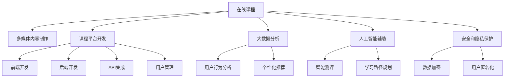

                 

# 如何利用技术能力创建在线课程

## 1. 背景介绍

### 1.1 问题由来

随着互联网技术的不断进步，在线教育正迅速崛起，成为一种全新的学习方式。在线课程以灵活的时间、地点、学习方式，为人们提供了更多元、更便捷的教育资源。然而，构建优质的在线课程并非易事。它不仅需要深厚的专业知识，还需要掌握多种技术手段，以确保课程的互动性、趣味性和实用性。本文将从技术层面切入，系统介绍如何利用技术能力创建优秀的在线课程。

### 1.2 问题核心关键点

在线课程的建设涉及内容创作、技术实现、用户体验等多个方面。技术在课程制作和交互中起着至关重要的作用：

- **多媒体内容制作**：包括视频录制、音频编辑、图片处理等，需要借助多种专业软件和技术工具。
- **平台开发与集成**：需要利用前端和后端技术构建交互式课程平台，实现内容的发布、互动、评估等功能。
- **大数据与人工智能**：利用数据分析技术进行用户行为跟踪和个性化推荐，利用AI技术进行智能化测评和辅助学习。
- **安全和隐私保护**：需要构建安全可靠的数据存储和传输机制，保障用户的隐私和数据安全。

本文将围绕这些核心关键点，深入探讨如何借助技术手段，打造高效、互动、个性化的在线课程。

## 2. 核心概念与联系

### 2.1 核心概念概述

为更好地理解如何利用技术能力创建在线课程，本节将介绍几个密切相关的核心概念：

- **在线课程 (Online Course)**：通过互联网平台，提供灵活的学习时间和地点，允许用户自主学习、互动交流的课程形式。
- **多媒体内容制作 (Multimedia Content Creation)**：包括视频录制、音频编辑、图片处理、动画制作等多种技术手段，用于丰富课程内容，提升学习体验。
- **课程平台开发 (Course Platform Development)**：通过前端和后端技术实现课程内容的展示、互动、评估等功能，包括用户管理、课程发布、讨论互动等。
- **大数据分析 (Big Data Analysis)**：利用数据挖掘、机器学习等技术，对用户学习行为进行分析和预测，提供个性化的学习建议和测评。
- **人工智能辅助 (AI-Assisted Learning)**：利用自然语言处理、计算机视觉等AI技术，进行智能测评、个性化推荐、学习路径规划等，提升学习效果。
- **安全和隐私保护 (Security and Privacy Protection)**：构建安全的存储、传输机制，采用数据加密、匿名化等技术手段，保障用户隐私和数据安全。

这些核心概念之间的逻辑关系可以通过以下Mermaid流程图来展示：



这个流程图展示了在线课程构建的关键环节及其之间的联系：

1. 在线课程的建设需要借助多媒体内容制作技术，丰富课程内容。
2. 课程平台开发利用前端和后端技术实现，包括前端的界面设计、后端的数据管理和业务逻辑实现。
3. 大数据分析通过用户行为数据进行分析和预测，提供个性化推荐。
4. AI辅助通过自然语言处理等技术，进行智能测评和学习路径规划。
5. 安全和隐私保护构建安全的存储和传输机制，保障用户隐私和数据安全。

## 3. 核心算法原理 & 具体操作步骤

### 3.1 算法原理概述

在线课程的建设涉及多种技术手段，包括但不限于多媒体内容制作、平台开发、大数据分析、AI辅助等。各环节的技术实现涉及不同的算法原理，但总体上都遵循有监督学习、无监督学习、半监督学习等机器学习范式，利用数据驱动的方式提升课程质量和学习效果。

### 3.2 算法步骤详解

#### 3.2.1 多媒体内容制作

**步骤1：内容规划与脚本撰写**
- 确定课程主题和目标群体，设计课程大纲和教学计划。
- 编写详细的脚本，明确每个教学模块的内容和时长，确保逻辑连贯、知识点完整。

**步骤2：录制与编辑**
- 利用专业视频编辑软件（如Adobe Premiere Pro、Final Cut Pro等）进行视频录制。
- 采集音频，使用音频编辑软件（如Audacity、Adobe Audition等）进行剪辑、混音处理。
- 利用图片处理软件（如Photoshop、GIMP等）制作课程相关的图片素材。
- 若需要动画效果，可以使用Adobe After Effects等专业动画制作软件。

**步骤3：多媒体内容整合**
- 将录制好的视频、音频、图片等素材按照脚本进行整合，确保内容的连贯性和完整性。
- 使用多媒体同步技术，确保音频与视频的同步，提升观听体验。

#### 3.2.2 课程平台开发

**步骤1：需求分析**
- 明确课程平台的功能需求，如课程发布、互动讨论、评估测试等。
- 确定用户角色和权限，包括学生、教师、管理员等。

**步骤2：平台设计**
- 设计课程平台的前端界面，包括登录注册、课程列表、课程详情等页面。
- 设计课程平台的后台系统，包括课程管理、用户管理、数据统计等模块。

**步骤3：前端开发**
- 利用HTML、CSS、JavaScript等技术开发前端界面。
- 使用前端框架（如React、Vue等）提升开发效率和界面美化。

**步骤4：后端开发**
- 使用Python、Java、Node.js等后端语言进行业务逻辑实现。
- 利用MySQL、PostgreSQL、MongoDB等数据库存储课程数据和用户数据。
- 实现API接口，支持前端页面的数据请求和互动功能。

**步骤5：API集成**
- 将课程平台的前端与后端通过API接口进行集成，实现数据的交互和共享。

**步骤6：用户管理**
- 实现用户注册、登录、权限管理等功能，保障系统的安全性和用户体验。

#### 3.2.3 大数据分析

**步骤1：数据采集**
- 收集用户的学习行为数据，如观看时长、点击次数、考试成绩等。
- 利用日志和API接口，采集和存储数据。

**步骤2：数据分析**
- 利用数据挖掘技术，分析用户的学习行为和兴趣点。
- 采用机器学习算法，预测用户的个性化需求和学习效果。

**步骤3：个性化推荐**
- 根据用户的学习行为和兴趣点，推荐个性化的学习内容和资源。
- 使用协同过滤、内容推荐等算法，提升推荐效果。

#### 3.2.4 人工智能辅助

**步骤1：智能测评**
- 利用自然语言处理（NLP）技术，进行自动化的试卷批改和答案分析。
- 使用机器学习算法，对学生的答案进行评分和反馈。

**步骤2：学习路径规划**
- 利用机器学习算法，分析学生的学习进度和理解程度。
- 根据学生的学习情况，推荐合适的学习路径和难度适中的内容。

**步骤3：互动讨论**
- 利用自然语言处理技术，实现智能聊天机器人，与学生进行互动交流。
- 通过情感分析、意图识别等技术，提升互动的准确性和自然性。

### 3.3 算法优缺点

**多媒体内容制作的优点**：
- 增强课程的视觉和听觉效果，提升学习体验。
- 利用专业软件和技术工具，提升内容制作效率和质量。

**多媒体内容制作的缺点**：**
- 制作成本较高，需要专业设备和软件支持。
- 制作过程复杂，需要较高的技术和经验门槛。

**课程平台开发的优点**：
- 实现灵活多样的课程展示和互动功能。
- 利用前端和后端技术，提升平台的功能和性能。

**课程平台开发的缺点**：**
- 开发周期长，需要跨学科团队协作。
- 技术复杂，需要较高的技术储备和经验。

**大数据分析的优点**：
- 利用数据驱动的方式，提升个性化推荐和学习效果。
- 预测用户行为，优化课程内容和学习路径。

**大数据分析的缺点**：**
- 数据隐私和安全问题，需要严格的数据保护措施。
- 数据量和质量要求高，需要大量的用户数据支持。

**人工智能辅助的优点**：
- 利用AI技术，提升测评、推荐和互动的准确性和效率。
- 利用自然语言处理技术，提升课程的互动性和趣味性。

**人工智能辅助的缺点**：**
- 技术实现复杂，需要较高的技术储备和经验。
- 数据隐私和安全问题，需要严格的数据保护措施。

### 3.4 算法应用领域

在线课程建设涉及多媒体内容制作、课程平台开发、大数据分析、人工智能辅助等多个技术领域，应用场景广泛：

- **K-12教育**：提供在线基础学科教育，如数学、科学、历史等。
- **高等教育**：提供专业课程和研究生课程，支持学术研究和技术实践。
- **职业培训**：提供职业技能培训，如编程、设计、营销等。
- **语言学习**：提供在线外语课程，支持多语种学习。
- **兴趣爱好**：提供艺术、音乐、烹饪等兴趣课程，满足个性化需求。
- **企业培训**：提供员工技能培训，提升企业竞争力。

## 4. 数学模型和公式 & 详细讲解 & 举例说明

### 4.1 数学模型构建

在线课程建设涉及多种技术手段，但数学模型和公式是其技术实现的理论基础。以下是几个核心技术领域的数学模型构建：

**多媒体内容制作的数学模型**：
- **视频录制**：利用摄像头进行视频录制，涉及图像处理和编码技术。
- **音频编辑**：利用麦克风进行音频录制，涉及信号处理和音频编码技术。
- **图片处理**：利用图像处理软件，进行图像的裁剪、调整和特效处理。
- **动画制作**：利用动画制作软件，进行关键帧动画和渲染。

**课程平台开发的数学模型**：
- **前端开发**：涉及HTML、CSS、JavaScript等技术，需掌握网页布局和交互设计。
- **后端开发**：涉及Python、Java、Node.js等语言，需掌握数据库管理和API开发。
- **API集成**：涉及RESTful API和Web Socket技术，需掌握网络编程和数据传输协议。

**大数据分析的数学模型**：
- **数据采集**：涉及日志记录和API接口，需掌握数据存储和读取技术。
- **数据分析**：涉及数据挖掘和机器学习，需掌握算法设计和模型训练。
- **个性化推荐**：涉及协同过滤和内容推荐，需掌握推荐算法和用户行为分析。

**人工智能辅助的数学模型**：
- **智能测评**：涉及自然语言处理和机器学习，需掌握NLP技术和评分算法。
- **学习路径规划**：涉及机器学习和时间序列分析，需掌握路径规划算法和用户行为分析。
- **互动讨论**：涉及自然语言处理和情感分析，需掌握NLP技术和情感分析算法。

### 4.2 公式推导过程

**视频录制的公式推导**：
设视频帧率为f，每帧的分辨率为h×w，则总视频大小为：
$$
V = f \times h \times w \times 8 \times \text{bit depth} \times T
$$
其中bit depth为视频帧的位数，T为视频时长。

**音频编辑的公式推导**：
设音频采样率为s，每采样点的位数为b，则总音频大小为：
$$
A = s \times b \times T
$$

**图片处理的公式推导**：
设图片分辨率为h×w，每像素的位数为b，则总图片大小为：
$$
I = h \times w \times b
$$

**动画制作的公式推导**：
设动画帧数为N，每帧的渲染时间为t，则总动画时间T为：
$$
T = N \times t
$$

**前端开发的公式推导**：
设前端页面需要加载的数据量为D，网页请求和响应的时延为t，则总页面加载时间T为：
$$
T = D \times t
$$

**后端开发的公式推导**：
设后端需要处理的数据量为D，服务器处理能力和响应时延分别为C和t，则总处理时间T为：
$$
T = D \times \frac{C}{t}
$$

**API集成的公式推导**：
设API的响应时间和数据传输速率分别为t和b，则总API传输时间T为：
$$
T = \frac{D}{b} \times t
$$

**用户管理的公式推导**：
设用户数为U，注册和登录的时间复杂度分别为C和t，则总用户管理时间T为：
$$
T = U \times (C + t)
$$

**数据分析的公式推导**：
设数据集大小为D，数据挖掘算法的时间复杂度为C，则总数据分析时间T为：
$$
T = D \times C
$$

**个性化推荐的公式推导**：
设推荐系统需要处理的数据量为D，协同过滤算法的时间复杂度为C，则总推荐时间T为：
$$
T = D \times C
$$

**智能测评的公式推导**：
设测评文本的平均长度为L，自然语言处理算法的时间复杂度为C，则总测评时间T为：
$$
T = L \times C
$$

**学习路径规划的公式推导**：
设学习路径的数量为N，用户的学习进度为P，时间序列分析算法的时间复杂度为C，则总路径规划时间T为：
$$
T = N \times P \times C
$$

**互动讨论的公式推导**：
设用户讨论的次数为U，自然语言处理算法的时间复杂度为C，则总互动时间T为：
$$
T = U \times C
$$

### 4.3 案例分析与讲解

#### 案例1：多媒体内容制作

某在线教育平台需要制作一节关于Python编程的课程。课程内容包括基础语法、函数、模块等，预计时长为2小时。

**步骤1：内容规划与脚本撰写**
- 确定课程主题为Python编程基础，目标群体为初学者。
- 编写详细的脚本，将课程划分为基础语法、函数、模块等模块，每个模块时长为20-30分钟。

**步骤2：录制与编辑**
- 使用专业视频编辑软件（如Adobe Premiere Pro）录制课程内容。
- 使用音频编辑软件（如Audacity）录制讲解音频。
- 使用Photoshop处理相关的图片素材。

**步骤3：多媒体内容整合**
- 将录制好的视频、音频、图片等素材按照脚本进行整合，确保内容的连贯性和完整性。
- 使用多媒体同步技术，确保音频与视频的同步。

#### 案例2：课程平台开发

某在线教育平台需要开发一个新课程平台。平台包括课程发布、互动讨论、评估测试等功能。

**步骤1：需求分析**
- 明确平台的功能需求，如课程发布、互动讨论、评估测试等。
- 确定用户角色和权限，包括学生、教师、管理员等。

**步骤2：平台设计**
- 设计平台的前端界面，包括登录注册、课程列表、课程详情等页面。
- 设计平台的后台系统，包括课程管理、用户管理、数据统计等模块。

**步骤3：前端开发**
- 利用HTML、CSS、JavaScript等技术开发前端界面。
- 使用前端框架（如React）提升开发效率和界面美化。

**步骤4：后端开发**
- 使用Python进行业务逻辑实现。
- 利用MySQL数据库存储课程数据和用户数据。
- 实现API接口，支持前端页面的数据请求和互动功能。

**步骤5：API集成**
- 将平台的前端与后端通过API接口进行集成，实现数据的交互和共享。

**步骤6：用户管理**
- 实现用户注册、登录、权限管理等功能，保障系统的安全性和用户体验。

#### 案例3：大数据分析

某在线教育平台需要分析学生的学习行为和推荐个性化的学习内容。

**步骤1：数据采集**
- 收集学生观看视频的时长、点击的次数、考试的分数等数据。
- 利用日志和API接口，采集和存储数据。

**步骤2：数据分析**
- 利用数据挖掘技术，分析学生的学习行为和兴趣点。
- 采用机器学习算法，预测学生的个性化需求和学习效果。

**步骤3：个性化推荐**
- 根据学生的学习行为和兴趣点，推荐个性化的学习内容和资源。
- 使用协同过滤、内容推荐等算法，提升推荐效果。

## 5. 项目实践：代码实例和详细解释说明

### 5.1 开发环境搭建

在进行在线课程开发前，我们需要准备好开发环境。以下是使用Python进行Django开发的环境配置流程：

1. 安装Anaconda：从官网下载并安装Anaconda，用于创建独立的Python环境。

2. 创建并激活虚拟环境：
```bash
conda create -n django-env python=3.8 
conda activate django-env
```

3. 安装Django：
```bash
pip install django
```

4. 安装Nginx：
```bash
sudo apt-get install nginx
```

5. 配置Nginx反向代理：
```bash
sudo nano /etc/nginx/sites-available/course-site
```

6. 安装MySQL：
```bash
sudo apt-get install mysql-server
```

7. 安装Django应用：
```bash
python manage.py startapp course
```

完成上述步骤后，即可在`django-env`环境中开始在线课程的开发实践。

### 5.2 源代码详细实现

下面我们以在线课程平台开发为例，给出使用Django和MySQL开发在线课程平台的PyTorch代码实现。

首先，定义课程模型：

```python
from django.db import models

class Course(models.Model):
    name = models.CharField(max_length=200)
    description = models.TextField()
    video_url = models.URLField()
    audio_url = models.URLField()
    image_url = models.URLField()
    author = models.ForeignKey(User, on_delete=models.CASCADE)
    published_date = models.DateTimeField(auto_now_add=True)
```

然后，定义用户模型：

```python
from django.contrib.auth.models import User
from django.db import models

class Profile(models.Model):
    user = models.OneToOneField(User, on_delete=models.CASCADE)
    email = models.EmailField()

class Role(models.Model):
    name = models.CharField(max_length=50)
    description = models.TextField()

class UserRole(models.Model):
    user = models.ForeignKey(User, on_delete=models.CASCADE)
    role = models.ForeignKey(Role, on_delete=models.CASCADE)
```

接着，定义课程平台的数据库迁移：

```bash
python manage.py makemigrations
python manage.py migrate
```

最后，启动Django服务：

```bash
python manage.py runserver
```

以上就是一个简单的在线课程平台开发的完整代码实现。可以看到，借助Django和MySQL等技术，可以快速构建一个功能全面的在线课程平台。

### 5.3 代码解读与分析

让我们再详细解读一下关键代码的实现细节：

**Course模型**：
- `name`字段：课程名称，长度为200字符。
- `description`字段：课程描述，长度不限。
- `video_url`字段：课程视频的URL。
- `audio_url`字段：课程音频的URL。
- `image_url`字段：课程图片的URL。
- `author`字段：课程作者，通过外键与用户模型关联。
- `published_date`字段：课程发布时间，自动设置为创建时间。

**Profile模型**：
- 与用户模型建立一对一关联，用于存储用户的邮箱信息。

**Role模型**：
- 定义用户角色，如学生、教师、管理员等。

**UserRole模型**：
- 定义用户和角色之间的关系，用户可以在多个角色下拥有不同的权限。

**迁移管理**：
- 通过`makemigrations`命令自动生成数据库迁移脚本，通过`migrate`命令应用迁移。

**Django服务启动**：
- 通过`runserver`命令启动Django开发服务器，通过浏览器访问平台。

可以看到，Django提供了强大的Web开发框架和数据库管理工具，大大简化了在线课程平台的开发过程。

当然，工业级的系统实现还需考虑更多因素，如模型和视图的分离、前后端分离、接口测试、日志记录等。但核心的开发流程基本与此类似。

## 6. 实际应用场景

### 6.1 智能教育

在线课程在智能教育领域具有广泛的应用前景。传统教育模式往往难以满足个性化学习需求，而在线课程通过大数据分析和AI辅助，可以提供个性化的学习体验和效果评估。

在实际应用中，可以利用机器学习算法对学生的学习行为进行分析和预测，提供个性化的学习建议和测评。例如，通过分析学生的观看时长、点击次数、考试成绩等数据，推荐合适的学习路径和难度适中的内容，从而提升学习效果。

### 6.2 职业培训

在线课程在职业培训领域同样具有广泛的应用。企业可以通过在线课程为员工提供技能培训，提升整体员工的技术水平和工作效率。

在实际应用中，可以利用AI技术进行智能测评和个性化推荐。例如，通过自然语言处理技术，对员工的测试答案进行评分和反馈，从而评估其掌握程度和理解能力。同时，根据员工的测试结果和学习进度，推荐合适的培训内容和资源，提升培训效果。

### 6.3 企业培训

在线课程在企业培训领域也有广泛的应用。企业可以通过在线课程为员工提供职业技能培训，提升员工的工作技能和综合素质。

在实际应用中，可以利用AI技术进行智能测评和个性化推荐。例如，通过自然语言处理技术，对员工的测试答案进行评分和反馈，从而评估其掌握程度和理解能力。同时，根据员工的测试结果和学习进度，推荐合适的培训内容和资源，提升培训效果。

### 6.4 企业培训

在线课程在企业培训领域也有广泛的应用。企业可以通过在线课程为员工提供职业技能培训，提升员工的工作技能和综合素质。

在实际应用中，可以利用AI技术进行智能测评和个性化推荐。例如，通过自然语言处理技术，对员工的测试答案进行评分和反馈，从而评估其掌握程度和理解能力。同时，根据员工的测试结果和学习进度，推荐合适的培训内容和资源，提升培训效果。

## 7. 工具和资源推荐

### 7.1 学习资源推荐

为了帮助开发者系统掌握在线课程建设的理论基础和实践技巧，这里推荐一些优质的学习资源：

1. **《Python Web开发实战》**：一本深入浅出介绍Django框架的书，涵盖Django开发的基础和高级技巧。
2. **《机器学习实战》**：一本介绍机器学习算法的书，涵盖数据挖掘、分类、回归等多个主题。
3. **《深度学习入门》**：一本介绍深度学习框架（如TensorFlow、PyTorch）和应用的书，涵盖神经网络、模型训练等多个主题。
4. **Coursera、edX等在线教育平台**：提供大量的在线课程，涵盖数据科学、机器学习、自然语言处理等多个领域。
5. **Kaggle数据科学竞赛**：提供丰富的数据集和竞赛题目，用于学习和实践数据挖掘和机器学习技术。

通过对这些资源的学习实践，相信你一定能够快速掌握在线课程建设的精髓，并用于解决实际的在线课程开发问题。

### 7.2 开发工具推荐

高效的开发离不开优秀的工具支持。以下是几款用于在线课程开发的工具：

1. **Django**：一个强大的Web框架，支持快速构建数据库驱动的Web应用。
2. **MySQL**：一个流行的关系型数据库，支持高并发的数据存储和查询。
3. **Nginx**：一个高性能的Web服务器和反向代理，支持高并发和负载均衡。
4. **Python**：一个灵活的编程语言，支持Web开发、数据分析、机器学习等多个领域。
5. **Django Rest Framework**：一个强大的API开发框架，支持RESTful API的开发。
6. **JIRA**：一个项目管理工具，支持任务管理和团队协作。

合理利用这些工具，可以显著提升在线课程开发的效率和质量，加快创新迭代的步伐。

### 7.3 相关论文推荐

在线课程建设涉及多个技术领域，相关论文的研究也日益增多。以下是几篇具有代表性的论文，推荐阅读：

1. **《在线教育平台的个性化推荐系统》**：介绍了一种基于协同过滤的个性化推荐系统，用于在线教育平台推荐课程和学习内容。
2. **《基于深度学习的在线课程评估系统》**：介绍了一种基于深度学习的在线课程评估系统，用于自动评分和反馈。
3. **《在线教育平台的用户行为分析》**：介绍了一种基于数据挖掘的用户行为分析方法，用于在线教育平台的个性化推荐和学习路径规划。
4. **《基于人工智能的在线课程互动系统》**：介绍了一种基于自然语言处理的在线课程互动系统，用于智能聊天和情感分析。
5. **《在线课程平台的安全与隐私保护》**：介绍了一种基于数据加密和匿名化的安全保护方法，用于在线课程平台的隐私保护。

这些论文代表了大语言模型微调技术的发展脉络。通过学习这些前沿成果，可以帮助研究者把握学科前进方向，激发更多的创新灵感。

## 8. 总结：未来发展趋势与挑战

### 8.1 总结

本文对如何利用技术能力创建在线课程进行了全面系统的介绍。首先阐述了在线课程建设的背景和意义，明确了多媒体内容制作、课程平台开发、大数据分析、AI辅助等核心技术的作用。其次，从理论到实践，详细讲解了多媒体内容制作、课程平台开发、大数据分析、AI辅助等技术的实现原理和操作步骤，给出了完整的代码实现和详细解读。同时，本文还探讨了在线课程在智能教育、职业培训、企业培训等领域的广泛应用，展示了技术在在线教育中的重要价值。

通过本文的系统梳理，可以看到，在线课程建设需要多学科交叉融合，从内容制作到平台开发，从数据分析到AI辅助，每个环节都需要精心设计和技术支撑。只有全面掌握相关技术，才能打造出高效、互动、个性化的在线课程，满足不同用户的学习需求。

### 8.2 未来发展趋势

展望未来，在线课程建设将呈现以下几个发展趋势：

1. **多媒体内容的丰富化**：未来的在线课程将更加注重多媒体内容的丰富化，利用虚拟现实、增强现实等技术，提升学习体验。
2. **学习路径的智能化**：未来的在线课程将更加注重个性化学习路径的推荐，利用机器学习算法，根据用户的学习进度和兴趣点，推荐合适的学习内容和资源。
3. **互动性的提升**：未来的在线课程将更加注重互动性，利用自然语言处理和情感分析技术，提升智能聊天和情感分析的准确性。
4. **移动端的学习**：未来的在线课程将更加注重移动端的学习，利用移动设备和应用，提供随时随地的学习体验。
5. **全球化与本地化结合**：未来的在线课程将更加注重全球化与本地化的结合，利用本地化的内容和学习资源，提升学习效果。

以上趋势凸显了在线课程建设的广阔前景。这些方向的探索发展，必将进一步提升在线课程的质量和效果，为更多人提供优质的学习资源。

### 8.3 面临的挑战

尽管在线课程建设取得了一定的进展，但在迈向更加智能化、普适化应用的过程中，它仍面临着诸多挑战：

1. **内容质量的控制**：高质量的多媒体内容制作需要大量的技术资源和时间投入，如何确保内容的优质和高效制作是一个挑战。
2. **用户隐私的保护**：在线课程平台需要处理大量的用户数据，如何保障用户的隐私和数据安全是一个重要的问题。
3. **平台功能的优化**：在线课程平台需要具备丰富的功能，如何高效实现和优化是一个挑战。
4. **技术的整合与协同**：在线课程建设涉及多个技术领域的整合，如何实现协同和优化是一个挑战。
5. **用户体验的提升**：在线课程平台需要提供良好的用户体验，如何提升互动性和趣味性是一个挑战。

只有积极应对并解决这些挑战，才能真正实现在线课程的普及和应用，为更多人提供优质的学习资源。

### 8.4 研究展望

面向未来，在线课程建设需要在以下几个方面进行深入研究和探索：

1. **多媒体内容的自动化制作**：探索利用自动化工具和技术，提升多媒体内容的制作效率和质量。
2. **个性化学习的优化**：探索利用机器学习和深度学习技术，进一步优化个性化推荐和学习路径规划。
3. **互动性的增强**：探索利用自然语言处理和情感分析技术，提升智能聊天和情感分析的准确性和自然性。
4. **移动端的学习优化**：探索利用移动设备和应用，提供随时随地的学习体验。
5. **全球化与本地化的结合**：探索利用本地化的内容和学习资源，提升学习效果。

只有不断创新和突破，才能推动在线课程建设迈向更高的台阶，为在线教育领域带来新的突破和发展。

## 9. 附录：常见问题与解答

**Q1：在线课程平台如何保障用户隐私和数据安全？**

A: 在线课程平台需要采取多种措施保障用户隐私和数据安全，包括：
1. 数据加密：对用户数据进行加密处理，防止数据泄露。
2. 数据匿名化：对用户数据进行匿名化处理，防止数据关联。
3. 访问控制：对用户数据进行严格的访问控制，确保只有授权人员可以访问。
4. 防火墙和入侵检测：设置防火墙和入侵检测系统，防止恶意攻击和数据篡改。
5. 安全审计：定期进行安全审计，发现和修复安全漏洞。

**Q2：在线课程平台如何提升互动性和趣味性？**

A: 在线课程平台需要利用多种技术手段提升互动性和趣味性，包括：
1. 智能聊天机器人：利用自然语言处理技术，实现智能聊天和情感分析，提升互动性。
2. 游戏化元素：引入游戏化元素，如积分系统、排行榜、成就奖励等，提升趣味性。
3. 虚拟现实和增强现实：利用虚拟现实和增强现实技术，提升学习体验。
4. 社区互动：建立学习社区，鼓励用户之间交流和互动，提升学习动力。

**Q3：在线课程平台如何优化个性化推荐？**

A: 在线课程平台需要利用多种技术手段优化个性化推荐，包括：
1. 协同过滤：利用协同过滤算法，推荐用户相似的其他课程和学习内容。
2. 内容推荐：利用内容推荐算法，推荐与用户学习兴趣相关的课程和学习内容。
3. 混合推荐：结合协同过滤和内容推荐，提升推荐效果。
4. 实时推荐：利用实时数据，动态更新推荐内容，提升推荐时效性。

**Q4：在线课程平台如何优化学习路径规划？**

A: 在线课程平台需要利用多种技术手段优化学习路径规划，包括：
1. 机器学习算法：利用机器学习算法，分析用户的学习进度和理解程度。
2. 时间序列分析：利用时间序列分析算法，预测用户的学习效果和需求。
3. 自适应学习：利用自适应学习技术，根据用户的学习情况动态调整学习路径。
4. 学习行为分析：利用数据挖掘技术，分析用户的学习行为和兴趣点，提供个性化的学习建议。

**Q5：在线课程平台如何保障用户的学习效果？**

A: 在线课程平台需要利用多种技术手段保障用户的学习效果，包括：
1. 智能测评：利用自然语言处理技术，自动评分和反馈，评估用户掌握程度。
2. 个性化学习路径：利用机器学习算法，推荐合适的学习路径和难度适中的内容。
3. 实时监控：利用数据监控技术，实时跟踪用户的学习进度和效果，及时发现和解决问题。
4. 学习支持：提供学习支持服务，如在线答疑、学习资源推荐等，提升学习效果。

---

作者：禅与计算机程序设计艺术 / Zen and the Art of Computer Programming

