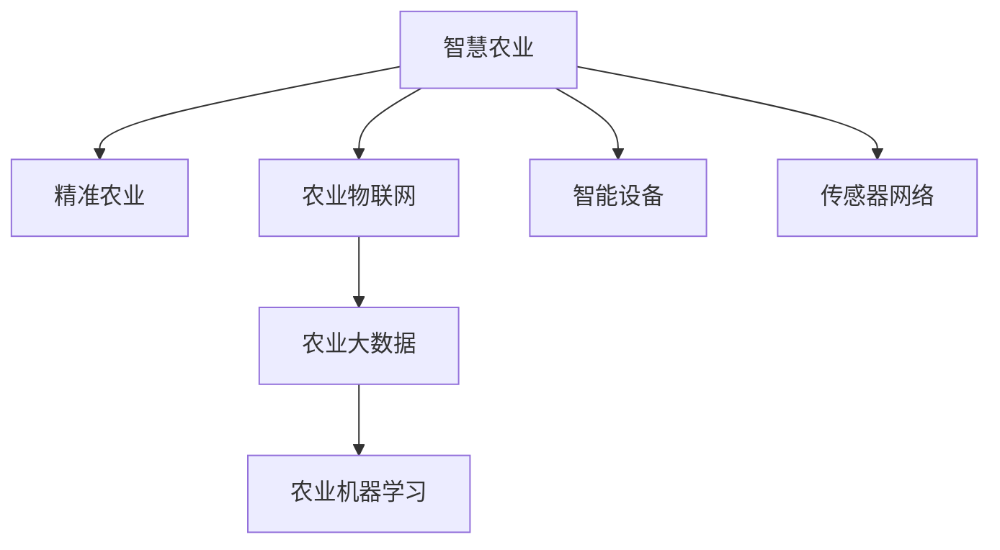
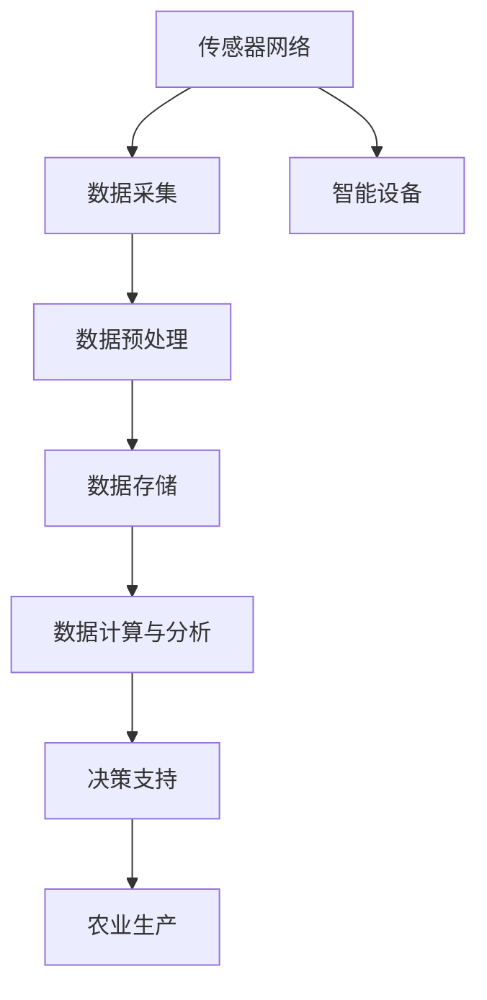

                 

# 如何利用技术能力进行农业科技创新

> 关键词：智慧农业,农业大数据,精准农业,农业物联网,机器学习,智能设备,传感器网络

## 1. 背景介绍

### 1.1 问题由来
农业作为人类文明的基础产业，在保障粮食安全、推动经济发展和维护生态平衡方面发挥着重要作用。然而，传统农业模式面临资源利用效率低、生产成本高、应对自然灾害和市场风险能力弱等诸多挑战。

近年来，随着信息技术的迅猛发展，特别是物联网、大数据、人工智能等技术的不断突破，农业科技也迎来了前所未有的机遇。智慧农业、精准农业、农业物联网等新技术正在改变传统农业的生产、管理和流通模式，助力农业产业的高质量发展。

本文将系统介绍如何利用技术能力，特别是信息技术，进行农业科技创新，推动农业现代化进程。通过梳理当前农业科技的热点方向，探讨相关技术实现原理，并给出具体的项目实践，帮助读者更好地理解如何从技术层面推动农业变革。

### 1.2 问题核心关键点
实现农业科技创新的关键在于：
1. **集成多源数据**：构建综合性的农业数据平台，集成气象、土壤、作物生长、机具运行等多维度的数据，为精准农业提供数据支撑。
2. **自动化与智能化**：利用无人机、机器人、传感器等自动化设备，实现农业生产的机械化和智能化，提高生产效率。
3. **数据驱动决策**：借助机器学习、深度学习等算法，分析农业大数据，提供智能化的农业生产和管理决策。
4. **人机交互与协作**：通过智能设备与人的无缝对接，提升农业生产管理的便捷性和用户体验。
5. **持续优化与升级**：基于实时数据反馈，不断迭代优化农业生产模式，提升农业科技的适应性和灵活性。

## 2. 核心概念与联系

### 2.1 核心概念概述

为更好地理解如何利用技术能力进行农业科技创新，本节将介绍几个关键概念及其联系：

- **智慧农业**：基于现代信息技术，结合农业生产的实时数据，实现智能化的农业生产、管理和服务的全过程，提升农业生产的智能化水平。
- **精准农业**：利用先进技术手段，实现对农作物的精准管理，包括精准施肥、精准灌溉、精准播种等，提高农业生产的效率和质量。
- **农业物联网**：通过传感器、无线通信、云计算等技术，实现农业生产过程的智能化监测、控制和分析，提高资源利用效率。
- **农业大数据**：由农业生产全过程中产生的大量结构化和非结构化数据构成的数据集，用于农业生产管理决策支持。
- **农业机器学习**：通过机器学习算法，从农业大数据中提取知识，进行农业生产预测和决策，提高农业生产管理的智能化水平。
- **智能设备**：包括无人机、机器人、智能传感器等，通过物联网技术实现农业生产过程的智能化监测和控制。
- **传感器网络**：由多个传感器节点构成的网络，用于实时采集农业生产环境的多种数据，如土壤湿度、温度、光照等。

这些概念之间存在紧密的联系，共同构成了智慧农业的生态系统：



### 2.2 核心概念原理和架构的 Mermaid 流程图

接下来，我们使用Mermaid图表展示这些概念的联系和数据流向：



该图表展示了从传感器网络数据采集到决策支持的整个过程，以及数据流向。其中，传感器网络采集的实时数据经过预处理后存储在数据仓库中，通过计算与分析生成决策支持信息，并反馈至农业生产过程，形成闭环控制。

## 3. 核心算法原理 & 具体操作步骤
### 3.1 算法原理概述

农业科技创新的核心在于将现代信息技术与农业生产过程相结合，实现农业生产的智能化和精准化。其中，机器学习算法在数据驱动的农业决策中起着至关重要的作用。

机器学习算法通过分析历史数据和实时数据，构建农业生产的预测模型，帮助农民做出更科学的生产决策。常见的机器学习算法包括回归分析、分类、聚类等。

以精准施肥为例，机器学习算法可以分析土壤的氮磷钾含量、作物生长周期、气象条件等数据，预测最佳施肥时机和用量，实现精准施肥，减少资源浪费和环境污染。

### 3.2 算法步骤详解

基于机器学习的农业科技创新一般包括以下几个关键步骤：

**Step 1: 数据收集与预处理**
- 收集农作物的生长周期、土壤质量、气象条件、作物生长状态等多维度的数据。
- 对收集到的数据进行清洗、归一化等预处理，以提高数据质量，为后续分析提供基础。

**Step 2: 模型训练**
- 根据收集到的数据，选择合适的机器学习算法，构建预测模型。
- 使用训练数据对模型进行训练，并通过交叉验证等方法评估模型性能。

**Step 3: 模型评估与优化**
- 使用测试数据对模型进行评估，调整模型参数以提高预测精度。
- 引入正则化等技术，防止模型过拟合。

**Step 4: 模型应用与反馈**
- 将训练好的模型应用于农业生产过程中，提供预测和决策支持。
- 根据实际生产效果和实时数据反馈，不断迭代优化模型，提高预测精度和适应性。

**Step 5: 持续监测与更新**
- 定期更新模型，加入新的数据，确保模型始终处于最佳状态。
- 对模型进行持续监测，及时发现和修正问题，保证模型稳定运行。

### 3.3 算法优缺点

基于机器学习的农业科技创新具有以下优点：
1. **高效准确**：通过分析大量历史和实时数据，机器学习算法能够提供高效、准确的预测和决策支持。
2. **数据驱动**：基于数据的智能化决策，能够显著提高农业生产的管理效率和资源利用率。
3. **灵活适应**：模型能够根据实际情况进行迭代优化，适应不同农业生产环境。

同时，也存在一些缺点：
1. **数据依赖**：机器学习模型的效果很大程度上依赖于数据质量，需要高质量的数据进行训练。
2. **模型复杂性**：构建高质量的机器学习模型需要复杂的算法和大量的数据，对技术要求较高。
3. **技术门槛**：对农业生产者和技术人员的技术水平要求较高，推广难度较大。
4. **隐私安全**：农业数据涉及隐私问题，需要采取有效措施保护数据安全。

### 3.4 算法应用领域

基于机器学习的农业科技创新技术，已经在多个领域得到应用，具体包括：

1. **精准农业**：利用机器学习算法对土壤、气象、作物生长数据进行分析，实现精准施肥、精准灌溉、精准播种等。
2. **病虫害防治**：通过分析病虫害的历史数据和实时监测数据，构建预测模型，实现病虫害的早期预警和精准防治。
3. **产量预测**：利用机器学习算法对农作物的生长数据进行建模，预测作物产量，为农业生产决策提供支持。
4. **智慧农机**：通过机器学习算法对农机的运行数据进行分析，优化农机作业路径和操作，提高农机作业效率。
5. **智能温室**：利用机器学习算法对温室内的环境数据进行监测和控制，优化温室环境，提高作物产量和品质。

## 4. 数学模型和公式 & 详细讲解 & 举例说明

### 4.1 数学模型构建

本节将使用数学语言对基于机器学习的农业科技创新过程进行更加严格的刻画。

记农业生产过程中的关键变量为 $X = (x_1, x_2, \ldots, x_n)$，其中 $x_i$ 表示第 $i$ 个特征变量。假设机器学习模型为 $M(X) = f(w; X)$，其中 $w$ 为模型参数，$f$ 为模型函数。

定义模型的预测函数为 $Y = M(X)$，目标函数为 $L(Y, Y^*)$，其中 $Y^*$ 为真实标签。在农业生产中，常用的目标函数包括均方误差、交叉熵等。

### 4.2 公式推导过程

以预测作物产量的回归模型为例，假设 $Y$ 为作物产量，$X$ 为生长周期、土壤养分、气象条件等特征，则回归模型的目标是最小化预测值与真实值之间的差距，即：

$$
\min_{w} \sum_{i=1}^{N} (Y_i - M(X_i))^2
$$

其中 $N$ 为样本数量，$M(X)$ 为回归模型。

使用最小二乘法求解回归模型，则模型参数 $w$ 的求解公式为：

$$
w = (X^TX)^{-1}X^TY
$$

其中 $X^TX$ 为 $X$ 的转置矩阵与 $X$ 的乘积，$(X^TX)^{-1}$ 为 $X^TX$ 的逆矩阵。

在实际应用中，需要根据具体问题选择合适的模型函数 $f$，并进行适当的正则化处理，避免模型过拟合。

### 4.3 案例分析与讲解

以精准施肥为例，假设 $X$ 包括土壤氮磷钾含量、气象条件、作物生长周期等特征，目标函数为 $L(Y, Y^*) = (Y - Y^*)^2$。

使用上述回归模型，可以预测不同土壤条件下最佳的施肥时机和用量。具体步骤如下：

1. 收集历史施肥数据、气象数据、作物生长数据等，构建数据集。
2. 对数据进行预处理，包括缺失值填充、数据标准化等。
3. 使用训练数据对模型进行训练，求解模型参数 $w$。
4. 使用测试数据评估模型性能，调整模型参数。
5. 将训练好的模型应用于实际施肥过程中，根据土壤和气象条件预测最佳施肥量。

## 5. 项目实践：代码实例和详细解释说明
### 5.1 开发环境搭建

在进行农业科技创新项目实践前，我们需要准备好开发环境。以下是使用Python进行项目开发的常见环境配置流程：

1. 安装Anaconda：从官网下载并安装Anaconda，用于创建独立的Python环境。

2. 创建并激活虚拟环境：
```bash
conda create -n agri-env python=3.8 
conda activate agri-env
```

3. 安装必要的Python库：
```bash
pip install numpy pandas scikit-learn scikit-learn
```

4. 安装机器学习框架：
```bash
pip install tensorflow keras
```

5. 安装农业领域特定库：
```bash
pip install agricsklearn
```

完成上述步骤后，即可在`agri-env`环境中开始项目实践。

### 5.2 源代码详细实现

下面我们以精准施肥模型为例，给出使用TensorFlow进行机器学习模型开发的Python代码实现。

首先，定义精准施肥模型的输入和输出：

```python
from tensorflow.keras.models import Sequential
from tensorflow.keras.layers import Dense

input_dim = 10 # 输入特征维度
output_dim = 1 # 输出特征维度

model = Sequential()
model.add(Dense(10, input_dim=input_dim, activation='relu'))
model.add(Dense(output_dim, activation='sigmoid'))
model.compile(optimizer='adam', loss='mse', metrics=['mae'])
```

然后，加载并预处理数据集：

```python
import pandas as pd
from sklearn.model_selection import train_test_split
from sklearn.preprocessing import StandardScaler

data = pd.read_csv('fertilizer_data.csv')
X = data.iloc[:, :-1].values
y = data.iloc[:, -1].values

# 标准化处理
scaler = StandardScaler()
X = scaler.fit_transform(X)

# 划分训练集和测试集
X_train, X_test, y_train, y_test = train_test_split(X, y, test_size=0.2, random_state=42)
```

接着，训练模型并进行预测：

```python
# 训练模型
model.fit(X_train, y_train, epochs=100, batch_size=32, verbose=1)

# 预测新数据
y_pred = model.predict(X_test)
```

最后，评估模型性能：

```python
import numpy as np

# 计算均方误差
mse = np.mean((y_test - y_pred)**2)
print('Mean Squared Error:', mse)
```

### 5.3 代码解读与分析

让我们再详细解读一下关键代码的实现细节：

**输入和输出定义**：
- 使用TensorFlow的Sequential模型定义精准施肥模型，包括两个全连接层。
- 输入层接收10维的特征向量，输出层为1维，用于预测最佳的施肥量。

**数据加载与预处理**：
- 从CSV文件中读取数据，并使用pandas库进行数据加载。
- 对数据进行标准化处理，提高模型的预测精度。
- 使用train_test_split函数划分训练集和测试集，用于模型训练和评估。

**模型训练与预测**：
- 使用model.fit函数进行模型训练，指定优化器、损失函数和评估指标。
- 在训练完成后，使用model.predict函数对测试集进行预测，生成施肥量。

**模型性能评估**：
- 使用numpy库计算均方误差，评估模型预测的准确性。

可以看到，TensorFlow提供了简单易用的API，使得机器学习模型的开发和训练变得高效便捷。通过简单的几行代码，便可以构建并训练一个精准施肥模型，实现对农业生产过程的智能化管理。

## 6. 实际应用场景

### 6.1 智慧农业系统

智慧农业系统通过集成物联网技术、大数据分析和机器学习算法，实现农业生产的智能化和精准化。

**系统架构**：
1. **传感器网络**：部署在田间地头的传感器，实时采集土壤湿度、温度、光照、作物生长状态等数据。
2. **数据采集与传输**：通过物联网协议，将传感器数据传输至云端。
3. **数据存储与计算**：使用大数据技术存储和计算采集数据，提取有价值的信息。
4. **智能决策**：利用机器学习算法，分析历史和实时数据，提供智能化的生产建议。
5. **人机交互**：通过用户界面，农民可以方便地查看和接收智能决策。

**应用场景**：
- 智能灌溉：根据土壤湿度和气象条件，智能调整灌溉量和频次，避免水资源浪费。
- 智能施肥：通过精准施肥模型，预测最佳施肥时机和用量，实现精准施肥。
- 病虫害预警：利用图像识别技术，实时监控和预警病虫害。

### 6.2 精准农业管理平台

精准农业管理平台通过集成多种传感器和智能设备，实现对农业生产的全面监测和控制。

**系统架构**：
1. **传感器与设备**：部署在田间的各种传感器和设备，采集数据。
2. **数据采集与传输**：通过物联网协议，将数据传输至云端。
3. **数据存储与计算**：使用大数据技术存储和计算数据，提取有价值的信息。
4. **智能决策**：利用机器学习算法，分析数据，提供生产建议。
5. **人机交互**：通过用户界面，农民可以方便地查看和接收生产建议。

**应用场景**：
- 精准施肥：根据土壤和作物生长数据，预测最佳施肥时机和用量。
- 精准灌溉：根据土壤湿度和气象条件，智能调整灌溉量和频次。
- 病虫害预警：利用图像识别技术，实时监控和预警病虫害。

### 6.3 智能温室控制系统

智能温室控制系统通过集成传感器、控制系统和智能算法，实现对温室环境的智能化控制。

**系统架构**：
1. **传感器网络**：部署在温室内的各种传感器，实时采集温度、湿度、光照等数据。
2. **控制设备**：通过物联网协议，控制温室内的各种设备。
3. **数据采集与传输**：将传感器数据传输至云端。
4. **数据存储与计算**：使用大数据技术存储和计算数据，提取有价值的信息。
5. **智能决策**：利用机器学习算法，分析数据，提供环境控制建议。
6. **人机交互**：通过用户界面，农民可以方便地查看和接收环境控制建议。

**应用场景**：
- 环境控制：根据作物生长周期和环境数据，自动调整温室内的温度、湿度、光照等条件。
- 病虫害防治：利用图像识别技术，实时监控和预警病虫害。
- 产量预测：分析作物生长数据，预测作物产量。

### 6.4 未来应用展望

随着农业科技的不断进步，基于信息技术进行农业创新的前景广阔。以下是一些未来可能的发展方向：

1. **智能农机**：通过物联网技术，实现农机的远程控制和精准作业。
2. **农业无人机**：利用无人机进行农田巡查、喷洒农药等作业，提高作业效率。
3. **农业区块链**：通过区块链技术，保障农业数据的安全性和透明性，提升农业生产的信任度。
4. **农业物联网生态系统**：构建由传感器、智能设备、云计算平台等组成的生态系统，实现农业生产的全过程智能化管理。
5. **农业大数据平台**：通过集成多种数据源，构建农业大数据平台，提供全面的农业生产支持。
6. **智能农业AI助手**：开发智能AI助手，通过自然语言处理技术，提供农业生产管理和决策支持。

未来，农业科技将继续与信息技术深度融合，推动农业生产方式的全面变革，实现农业的可持续发展。

## 7. 工具和资源推荐
### 7.1 学习资源推荐

为了帮助开发者系统掌握农业科技创新的理论和实践，这里推荐一些优质的学习资源：

1. 《智慧农业技术与应用》书籍：全面介绍了智慧农业的核心技术及其在农业生产中的应用。
2. 《农业物联网技术与应用》课程：斯坦福大学开设的农业物联网课程，涵盖传感器、通信、数据处理等关键技术。
3. 《农业机器学习》书籍：介绍了机器学习在农业生产中的各种应用，包括数据预处理、模型构建、评估等。
4. Coursera平台《Agriculture and Life Sustainability》课程：涵盖农业科技、可持续性发展等方面的内容，适合农业科技爱好者学习。
5. 《农业大数据技术与应用》书籍：介绍了农业大数据的核心概念和技术实现，为农业科技的智能化发展提供支持。

通过这些资源的学习，可以全面了解农业科技创新的理论和实践，为项目开发和研究提供有力支持。

### 7.2 开发工具推荐

高效的开发离不开优秀的工具支持。以下是几款用于农业科技创新开发的常用工具：

1. TensorFlow：由Google主导开发的深度学习框架，支持多种机器学习算法，适用于农业数据的大规模分析和预测。
2. PyTorch：由Facebook开发的深度学习框架，支持动态计算图，适合农业数据的多样化和复杂化需求。
3. OpenCV：开源计算机视觉库，支持图像识别和处理，适用于农业图像数据的分析和应用。
4. Esri平台：提供地理信息系统（GIS）解决方案，支持农业数据的可视化分析和空间分析。
5. Jupyter Notebook：免费的交互式编程环境，支持Python、R等多种语言，适合农业数据的前后端开发和协作。

合理利用这些工具，可以显著提升农业科技创新项目的开发效率，加快创新迭代的步伐。

### 7.3 相关论文推荐

农业科技创新领域的论文研究众多，以下是几篇具有代表性的论文，推荐阅读：

1. "A Survey on Machine Learning Approaches in Agriculture"：综述了机器学习在农业生产中的应用，包括作物生长预测、病虫害防治、智能灌溉等。
2. "Precision Agriculture: A Review of Technological Advances"：回顾了精准农业技术的发展历程和应用前景，分析了各类技术在农业生产中的应用。
3. "Iot for Agriculture: Data Collection, Integration, and Visualization"：介绍了物联网在农业生产中的应用，包括传感器部署、数据采集和可视化等。
4. "A Real-time Water Management System for Irrigation"：介绍了一个实时水管理系统的设计与实现，通过物联网技术实现精准灌溉。
5. "Application of AI in Precision Agriculture: A Review"：综述了人工智能在精准农业中的应用，包括图像识别、语音识别、自然语言处理等。

这些论文代表了农业科技创新领域的前沿研究，通过阅读这些文献，可以全面了解农业科技创新的最新进展和应用案例。

## 8. 总结：未来发展趋势与挑战

### 8.1 总结

本文对如何利用技术能力进行农业科技创新进行了系统介绍。首先阐述了农业科技创新的重要性，明确了信息技术的核心作用。其次，从原理到实践，详细讲解了基于机器学习的农业科技创新方法，包括数据收集、模型训练、模型评估等关键步骤，并给出了具体的项目实践，帮助读者更好地理解技术实现的细节。同时，本文还广泛探讨了智慧农业、精准农业、智能温室等实际应用场景，展示了技术创新的巨大潜力。最后，本文精选了农业科技创新领域的各类学习资源和开发工具，力求为读者提供全方位的技术指引。

通过本文的系统梳理，可以看到，利用信息技术进行农业科技创新已经从理论走向实践，推动了农业生产方式的全面变革。未来，随着农业科技的不断进步，信息技术将在农业生产中发挥越来越重要的作用，为农业的可持续发展注入新的动力。

### 8.2 未来发展趋势

展望未来，农业科技创新的趋势包括：

1. **数据驱动**：大数据技术将成为农业生产的重要支撑，通过分析大量农业数据，提供智能化的决策支持。
2. **智能化**：物联网、人工智能等技术将进一步推动农业生产的智能化水平，提高生产效率和管理水平。
3. **自动化**：无人机、机器人、智能传感器等自动化设备将广泛应用于农业生产，实现全过程自动化。
4. **多样化**：农业科技创新将从单一的应用场景，向多领域、多层次的融合发展，实现农业生产的多样化和个性化。
5. **可持续化**：农业科技创新将关注环境保护和资源利用，推动农业生产的绿色、可持续性发展。

这些趋势凸显了农业科技创新的广阔前景，为实现农业现代化提供了强大的技术支撑。

### 8.3 面临的挑战

尽管农业科技创新技术已经取得了显著进展，但在实现大规模应用的过程中，仍面临诸多挑战：

1. **技术壁垒**：农业科技创新对技术和专业知识要求较高，技术推广难度较大。
2. **成本问题**：高成本的传感器和智能设备，对农业生产者的经济负担较大。
3. **数据隐私**：农业数据涉及隐私问题，需要采取有效措施保护数据安全。
4. **标准化**：农业数据的标准化和规范性问题尚未完全解决，影响数据的共享和互操作性。
5. **政策支持**：缺乏政府政策的支持和引导，影响农业科技创新的推广和应用。

这些挑战需要在技术、经济、政策等各个层面进行多方协同努力，才能更好地推动农业科技创新的发展。

### 8.4 研究展望

面对农业科技创新的诸多挑战，未来的研究需要在以下几个方面寻求新的突破：

1. **技术普及**：开发更加易用、低成本的农业科技创新技术，降低技术推广的门槛。
2. **数据共享**：建立农业数据共享平台，提高数据的互操作性和利用效率。
3. **数据隐私**：制定和实施农业数据隐私保护政策，保障数据安全。
4. **政策引导**：政府应出台相关政策，鼓励和支持农业科技创新的发展。
5. **标准化**：制定农业数据标准化规范，提高数据的质量和可用性。
6. **跨领域合作**：加强农业科技与信息技术、环境科学等多个领域的交叉合作，推动农业科技的全面发展。

通过这些研究方向的探索，相信农业科技创新技术将不断突破技术瓶颈，实现农业生产的全面智能化和精准化，为农业的可持续发展提供坚实的技术基础。

## 9. 附录：常见问题与解答

**Q1：农业科技创新中，数据采集和处理的技术难点有哪些？**

A: 农业数据采集和处理的技术难点主要包括以下几个方面：

1. **数据获取难度**：农业数据采集需要部署大量的传感器和智能设备，成本较高。
2. **数据种类繁多**：农业数据包括气象数据、土壤数据、作物生长数据等多种类型，处理复杂。
3. **数据质量参差不齐**：农业数据存在缺失、噪声等问题，需要进行预处理和清洗。
4. **数据传输延迟**：农业数据采集设备通常分布在田间地头，数据传输存在延迟和网络不稳定等问题。

为解决这些问题，需要采用多种技术手段，如数据融合、异常检测、数据压缩等，提高数据采集和处理的效率和准确性。

**Q2：农业科技创新中，如何选择机器学习算法？**

A: 农业科技创新中，选择机器学习算法需要考虑多个因素，包括数据类型、问题复杂度、模型效率等。

1. **数据类型**：对于结构化数据，可以使用回归、分类等传统算法；对于图像数据，可以使用卷积神经网络（CNN）；对于文本数据，可以使用自然语言处理（NLP）技术。
2. **问题复杂度**：对于简单的预测问题，可以使用线性回归、决策树等算法；对于复杂的预测问题，可以使用深度学习算法，如卷积神经网络、循环神经网络等。
3. **模型效率**：对于计算资源有限的场景，可以选择参数较少、效率较高的算法，如线性回归、支持向量机等。

需要根据具体问题和数据特点，选择适合的机器学习算法，并不断优化算法参数，提高预测精度。

**Q3：农业科技创新中，如何提高模型的泛化能力？**

A: 提高模型的泛化能力是农业科技创新中的关键任务。以下是一些提高模型泛化能力的方法：

1. **数据增强**：通过对训练数据进行扩充，增加数据的多样性，提高模型的泛化能力。
2. **正则化**：使用L1、L2正则化等技术，防止模型过拟合。
3. **集成学习**：通过多个模型的集成，提高模型的泛化能力。
4. **迁移学习**：在已有模型的基础上，进行微调或迁移学习，提高模型的泛化能力。
5. **交叉验证**：使用交叉验证技术，评估模型的泛化能力，并进行参数调整。

通过这些方法，可以提高模型的泛化能力，更好地适应农业生产中的复杂多变情况。

**Q4：农业科技创新中，如何确保数据的安全性和隐私保护？**

A: 数据安全和隐私保护是农业科技创新的重要问题。以下是一些保障数据安全和隐私保护的方法：

1. **数据加密**：对农业数据进行加密处理，防止数据泄露。
2. **数据匿名化**：通过数据匿名化技术，去除敏感信息，保护用户隐私。
3. **访问控制**：对数据进行严格的访问控制，确保只有授权人员可以访问数据。
4. **安全传输**：采用安全传输协议，如SSL/TLS，保护数据传输过程中的安全。
5. **合规性**：遵循相关的数据隐私保护法规，如GDPR等，确保数据处理合规。

通过这些方法，可以有效保障农业数据的安全性和隐私保护，提升用户对农业科技创新的信任度。

---

作者：禅与计算机程序设计艺术 / Zen and the Art of Computer Programming

