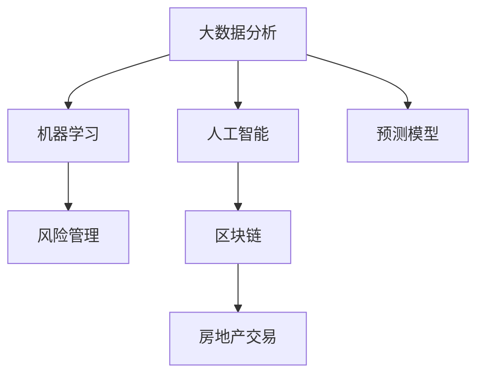

                 

# 如何利用技术能力进行房地产投资

## 1. 背景介绍

随着数字化转型和人工智能的不断发展，房地产投资领域也在逐渐拥抱技术，寻求通过数据分析和智能算法优化投资决策，实现更高的回报率。传统的房地产投资依赖于对市场趋势、政策调控和地理位置的综合判断，而现代技术，特别是大数据和机器学习，为投资决策带来了新的视角和工具。

### 1.1 问题由来

房地产市场的波动性和不确定性使其成为高风险投资领域。技术手段，如数据挖掘、预测模型和智能算法，可以帮助投资者更好地理解市场，降低风险并提高投资效率。例如，通过大数据分析，可以发现区域内的人口流动、经济增长和就业趋势，从而识别潜在的投资机会。同时，机器学习模型可以对历史数据进行学习，预测未来的市场走势和价格变化，为投资者提供决策支持。

### 1.2 问题核心关键点

本文聚焦于利用技术能力进行房地产投资的核心关键点，包括：

- 大数据分析在房地产投资中的应用
- 机器学习模型在预测市场走势中的作用
- 人工智能技术在风险管理中的应用
- 区块链技术在房地产交易中的潜力

## 2. 核心概念与联系

### 2.1 核心概念概述

为更好地理解如何利用技术能力进行房地产投资，本节将介绍几个关键概念及其联系：

- **大数据分析**：通过收集、存储和分析大量数据，发现数据中的模式、趋势和关联，为投资决策提供支持。
- **机器学习**：通过数据训练模型，让机器从数据中学习规律，用于预测、分类和聚类等任务。
- **人工智能**：涵盖从数据处理到决策分析的整个流程，包括深度学习、自然语言处理等技术。
- **区块链**：通过分布式账本技术，提供安全、透明和不可篡改的交易记录，适用于房地产交易的自动化和去中心化。
- **预测模型**：利用历史数据训练的模型，用于预测房地产市场的价格变化和走势。
- **风险管理**：通过分析市场波动、政策变化等因素，制定风险控制策略，减少投资损失。

这些概念之间的联系可以通过以下Mermaid流程图来展示：



这个流程图展示了各个概念之间的相互作用关系：

1. 大数据分析提供了数据基础。
2. 机器学习模型在此基础上进行训练和预测。
3. 人工智能涵盖从数据处理到决策分析的整个过程。
4. 预测模型帮助投资者预测市场走势。
5. 区块链技术提供安全的交易记录，适用于房地产交易。
6. 风险管理则帮助投资者规避风险，控制投资损失。

## 3. 核心算法原理 & 具体操作步骤
### 3.1 算法原理概述

利用技术能力进行房地产投资的核心算法原理，主要包括以下几个方面：

- **数据预处理与特征工程**：收集和清洗房地产市场数据，提取有意义的特征，如地理位置、建筑类型、历史价格等。
- **模型训练与评估**：利用历史数据训练机器学习模型，如回归模型、分类模型等，评估模型的性能和泛化能力。
- **风险评估与控制**：分析市场数据和政策变化，识别潜在的风险因素，制定风险管理策略。
- **交易自动化与智能合约**：利用区块链技术实现房地产交易的自动化，通过智能合约确保交易的透明和安全性。

### 3.2 算法步骤详解

以下详细介绍利用技术能力进行房地产投资的核心算法步骤：

**Step 1: 数据收集与预处理**

1. **数据源选择**：选择合适的数据源，包括房地产市场的历史价格、销售记录、租赁信息、经济指标等。
2. **数据清洗与归一化**：去除噪声和异常值，归一化数据，确保数据的一致性和可比性。
3. **特征提取**：从数据中提取有意义的特征，如地理位置、建筑类型、面积、年龄、周边设施等。

**Step 2: 模型训练与评估**

1. **模型选择**：根据投资目标选择合适的预测模型，如线性回归、支持向量机、随机森林等。
2. **数据划分**：将数据划分为训练集、验证集和测试集，确保模型的泛化能力。
3. **模型训练**：利用训练集数据训练模型，调整参数，提高模型性能。
4. **模型评估**：在验证集上评估模型性能，调整模型参数，避免过拟合。

**Step 3: 风险评估与控制**

1. **风险因素分析**：分析市场数据和政策变化，识别潜在的风险因素，如利率变化、政策调控、人口流动等。
2. **风险评估**：通过模型预测风险因素对市场的影响，评估投资风险。
3. **风险控制**：根据风险评估结果，制定风险管理策略，如多样化投资、设置止损点等。

**Step 4: 交易自动化与智能合约**

1. **智能合约设计**：设计智能合约，确保交易的透明、安全、高效。
2. **区块链部署**：将智能合约部署到区块链上，实现去中心化交易。
3. **自动化执行**：设置触发条件，当满足特定条件时，自动执行交易。

### 3.3 算法优缺点

利用技术能力进行房地产投资的主要优点包括：

- **高效性**：通过数据驱动和模型预测，提高投资决策的效率和准确性。
- **客观性**：利用数据和模型进行决策，减少主观判断带来的偏差。
- **灵活性**：可以灵活调整模型参数和策略，适应市场的变化。

同时，也存在一些缺点：

- **数据依赖**：依赖于数据的完整性和质量，数据不充分或数据偏差可能导致误判。
- **模型复杂性**：复杂的模型可能难以解释和调试，增加理解和维护的成本。
- **技术门槛**：需要一定的技术背景和能力，非专业人士难以有效应用。

### 3.4 算法应用领域

利用技术能力进行房地产投资的方法，在以下几个领域有广泛应用：

- **房地产市场分析**：利用大数据分析，预测房地产市场的走势和价格变化。
- **投资组合优化**：利用机器学习模型，优化投资组合的分散性和回报率。
- **风险管理**：通过风险评估模型，识别和管理投资风险。
- **智能合约与去中心化交易**：利用区块链技术，实现房地产交易的自动化和去中心化。

## 4. 数学模型和公式 & 详细讲解 & 举例说明
### 4.1 数学模型构建

本节将使用数学语言对利用技术能力进行房地产投资的核心算法进行更加严格的刻画。

记房地产市场价格为 $P_t$，影响因素为 $X$，市场趋势为 $T$，政策因素为 $P$。假设市场趋势和政策因素对价格的影响可以表示为线性模型：

$$
P_t = \alpha_0 + \alpha_1X_1 + \alpha_2X_2 + \cdots + \alpha_nX_n + \beta T + \gamma P + \epsilon_t
$$

其中 $\epsilon_t$ 为随机误差项。

### 4.2 公式推导过程

以线性回归模型为例，进行公式推导：

1. **最小二乘估计**：最小化残差平方和，求解参数 $\alpha_0, \alpha_1, \cdots, \alpha_n, \beta, \gamma$。
2. **模型评估**：利用验证集计算模型的均方误差、决定系数等指标，评估模型性能。
3. **预测与风险评估**：利用测试集数据进行预测，结合风险评估模型，识别潜在的风险因素。

### 4.3 案例分析与讲解

以房价预测为例，展示利用技术能力进行房地产投资的核心算法步骤：

**Step 1: 数据收集与预处理**

收集历史房价数据和相关特征数据，如地理位置、建筑类型、面积等，进行清洗和归一化。

**Step 2: 模型训练与评估**

1. **数据划分**：将数据划分为训练集和测试集。
2. **模型选择**：选择线性回归模型。
3. **模型训练**：利用训练集数据训练模型，调整参数。
4. **模型评估**：在验证集上评估模型性能，调整参数。

**Step 3: 风险评估与控制**

分析市场数据和政策变化，识别潜在的风险因素，如利率变化、政策调控等，结合模型预测，评估投资风险。

**Step 4: 交易自动化与智能合约**

设计智能合约，确保交易的透明、安全、高效，将智能合约部署到区块链上，实现去中心化交易。

## 5. 项目实践：代码实例和详细解释说明
### 5.1 开发环境搭建

在进行房地产投资技术实践前，我们需要准备好开发环境。以下是使用Python进行机器学习和数据处理的开发环境配置流程：

1. 安装Python：选择最新版本的Python，如Python 3.8以上。
2. 安装必要的库：安装NumPy、Pandas、Scikit-Learn、TensorFlow等库，用于数据处理和模型训练。
3. 配置开发环境：使用Jupyter Notebook或PyCharm等开发工具，方便代码编写和调试。

完成上述步骤后，即可在开发环境中进行房地产投资技术的实践。

### 5.2 源代码详细实现

下面以房价预测为例，给出利用机器学习模型进行房地产投资的项目实现代码。

```python
import pandas as pd
import numpy as np
from sklearn.model_selection import train_test_split
from sklearn.linear_model import LinearRegression
from sklearn.metrics import mean_squared_error, r2_score
import matplotlib.pyplot as plt

# 读取数据
data = pd.read_csv('house_prices.csv')

# 数据预处理
X = data[['location', 'type', 'size', 'age', 'amenities']]
y = data['price']

# 数据标准化
from sklearn.preprocessing import StandardScaler
scaler = StandardScaler()
X = scaler.fit_transform(X)

# 模型训练
X_train, X_test, y_train, y_test = train_test_split(X, y, test_size=0.2, random_state=42)
model = LinearRegression()
model.fit(X_train, y_train)

# 模型评估
y_pred = model.predict(X_test)
mse = mean_squared_error(y_test, y_pred)
r2 = r2_score(y_test, y_pred)

# 输出结果
print(f'Mean Squared Error: {mse:.2f}')
print(f'R-squared: {r2:.2f}')

# 可视化结果
plt.scatter(y_test, y_pred)
plt.plot([y_test.min(), y_test.max()], [y_test.min(), y_test.max()], 'r--')
plt.xlabel('True Prices')
plt.ylabel('Predicted Prices')
plt.show()
```

### 5.3 代码解读与分析

让我们再详细解读一下关键代码的实现细节：

**数据预处理**

- `pd.read_csv`：读取CSV格式的数据文件。
- `X = data[['location', 'type', 'size', 'age', 'amenities']]`：选择需要的特征列。
- `y = data['price']`：选择目标变量列。
- `StandardScaler`：对特征数据进行标准化处理，确保数据的一致性和可比性。

**模型训练**

- `train_test_split`：将数据划分为训练集和测试集。
- `LinearRegression`：选择线性回归模型。
- `model.fit`：训练模型。

**模型评估**

- `mean_squared_error`：计算均方误差。
- `r2_score`：计算决定系数，评估模型性能。

**可视化结果**

- `plt.scatter`：绘制散点图，展示真实值和预测值的关系。
- `plt.plot`：绘制回归线，展示预测值的线性关系。

## 6. 实际应用场景
### 6.1 智能投资顾问

智能投资顾问（Robo-Advisor）是一种利用技术进行房地产投资的典型应用。通过收集用户的投资偏好、风险承受能力和市场数据，智能投资顾问可以自动化地推荐投资组合，优化投资策略，提升回报率。

在技术实现上，智能投资顾问系统通常包括以下几个模块：

- **用户画像构建**：收集用户信息，建立用户画像，包括投资目标、风险偏好等。
- **市场数据收集**：实时收集市场数据，如房价走势、经济指标等。
- **投资组合生成**：利用机器学习模型生成投资组合，结合风险评估结果，优化投资策略。
- **交易执行与监控**：通过智能合约，实现交易自动化，实时监控投资组合表现，及时调整策略。

### 6.2 实时市场分析

实时市场分析系统可以帮助投资者及时了解市场动态，做出更明智的投资决策。通过收集和分析大量的市场数据，系统可以预测价格趋势，识别投资机会。

在技术实现上，实时市场分析系统通常包括以下几个模块：

- **数据采集**：从多个数据源采集市场数据，如房地产交易平台、经济报告等。
- **数据清洗**：对采集的数据进行清洗和预处理，确保数据质量和一致性。
- **模型训练**：利用历史数据训练预测模型，如随机森林、支持向量机等。
- **预测与推荐**：利用训练好的模型进行价格预测，推荐投资机会。

### 6.3 风险管理与控制系统

房地产投资面临诸多风险，如市场波动、政策变化等。风险管理与控制系统可以帮助投资者识别和管理风险，降低投资损失。

在技术实现上，风险管理与控制系统通常包括以下几个模块：

- **风险识别**：通过分析市场数据和政策变化，识别潜在的风险因素。
- **风险评估**：利用风险评估模型，评估风险对投资的影响。
- **风险控制**：制定风险管理策略，如多样化投资、设置止损点等。
- **实时监控**：通过实时监控系统，及时发现并应对风险。

### 6.4 未来应用展望

随着技术的不断进步，房地产投资将迎来更多创新应用：

- **智能合约与去中心化交易**：利用区块链技术，实现房地产交易的自动化和去中心化。
- **AI投资顾问与自动交易**：利用AI技术，实现智能投资顾问和自动交易系统，提高投资效率和回报率。
- **实时市场分析与预测**：利用大数据和机器学习，实时分析市场数据，预测价格趋势，识别投资机会。
- **风险管理与控制系统**：利用AI和区块链技术，实现更高效、更安全、更智能的风险管理与控制系统。

## 7. 工具和资源推荐
### 7.1 学习资源推荐

为了帮助开发者系统掌握利用技术能力进行房地产投资的理论基础和实践技巧，这里推荐一些优质的学习资源：

1. **机器学习与深度学习课程**：如Coursera的《机器学习》课程、Udacity的《深度学习》课程，帮助学习者掌握核心算法和理论。
2. **房地产投资数据集**：如Kaggle的《房地产市场数据集》，提供丰富的市场数据，供学习和实践使用。
3. **智能投资顾问项目实战**：如Kaggle的《智能投资顾问项目》，提供详细的项目设计和实践指南。
4. **区块链技术教程**：如Blockchain.com的《区块链技术入门教程》，帮助学习者了解区块链的基本原理和应用场景。

通过对这些资源的学习实践，相信你一定能够快速掌握利用技术能力进行房地产投资的关键技术和方法，并用于解决实际的投资问题。

### 7.2 开发工具推荐

高效的开发离不开优秀的工具支持。以下是几款用于房地产投资技术开发的常用工具：

1. **Python**：强大的编程语言，支持机器学习和数据处理，是房地产投资技术开发的理想选择。
2. **Jupyter Notebook**：交互式的开发环境，支持代码编写、数据可视化，适合进行数据驱动的开发。
3. **TensorFlow**：由Google主导的开源深度学习框架，支持复杂模型的训练和部署。
4. **Scikit-Learn**：简单易用的机器学习库，支持常见的数据处理和模型训练任务。
5. **Keras**：高级神经网络库，易于上手，适合快速原型设计和实验。

合理利用这些工具，可以显著提升房地产投资技术的开发效率，加快创新迭代的步伐。

### 7.3 相关论文推荐

房地产投资技术的快速发展得益于学界的持续研究。以下是几篇奠基性的相关论文，推荐阅读：

1. **A Survey of Machine Learning Techniques for Real Estate Valuation**：总结了机器学习在房地产估值中的应用，提供了详细的算法和模型分析。
2. **Blockchain-Based Smart Contracts for Real Estate Transactions**：探讨了区块链技术在房地产交易中的应用，分析了智能合约的设计和实现。
3. **Risk Management in Real Estate Investments Using AI**：介绍了AI在房地产投资风险管理中的应用，提供了实用的风险评估方法和策略。

这些论文代表了房地产投资技术的最新进展，通过学习这些前沿成果，可以帮助研究者把握学科前进方向，激发更多的创新灵感。

## 8. 总结：未来发展趋势与挑战
### 8.1 总结

本文对利用技术能力进行房地产投资进行了全面系统的介绍。首先阐述了利用技术能力进行房地产投资的背景和意义，明确了投资决策中技术的应用价值。其次，从原理到实践，详细讲解了房地产投资的核心算法原理和具体操作步骤，给出了技术实践的完整代码实例。同时，本文还探讨了房地产投资技术在多个领域的应用前景，展示了技术应用的多样性和潜力。

通过本文的系统梳理，可以看到，利用技术能力进行房地产投资，正在逐步成为一种主流趋势，为投资者提供更加精准、高效、安全的投资决策支持。未来，随着技术的不断进步，房地产投资将迎来更多创新应用，为投资者带来更高的回报率和更低的风险。

### 8.2 未来发展趋势

展望未来，房地产投资技术的发展趋势主要体现在以下几个方面：

1. **智能化与自动化**：利用AI和大数据，实现投资顾问和自动交易系统的智能化和自动化，提升投资效率。
2. **去中心化与区块链**：利用区块链技术，实现房地产交易的去中心化，提高交易的透明性和安全性。
3. **实时化与动态化**：利用实时数据和动态模型，实时监控市场变化，动态调整投资策略。
4. **多元化与跨界融合**：与其他技术如物联网、5G等结合，实现更全面、更智能的投资体系。

### 8.3 面临的挑战

尽管房地产投资技术已经取得了显著进展，但在迈向更加智能化、普适化应用的过程中，仍面临诸多挑战：

1. **数据隐私与安全**：房地产投资涉及大量敏感数据，数据隐私和安全问题不容忽视。
2. **技术复杂性**：技术实现复杂，需要跨学科知识，对技术门槛要求较高。
3. **市场波动与政策变化**：市场和政策的不确定性，对技术模型的鲁棒性和适应性提出了更高的要求。
4. **投资风险与回报平衡**：如何在提升回报率的同时，有效控制投资风险，是技术应用需要解决的重要问题。

### 8.4 研究展望

面对房地产投资技术面临的挑战，未来的研究需要在以下几个方面寻求新的突破：

1. **数据隐私保护**：研究如何保护数据隐私，确保数据的合法使用和保护。
2. **模型可解释性**：研究如何提高模型的可解释性，增强投资决策的可理解性和透明度。
3. **跨领域融合**：研究如何与其他技术如物联网、区块链等结合，实现更全面、更智能的投资体系。
4. **智能合约设计**：研究如何设计更高效、更安全的智能合约，确保房地产交易的透明性和安全性。

这些研究方向的探索，必将引领房地产投资技术迈向更高的台阶，为投资者提供更加安全、可靠、智能的投资决策支持。面向未来，房地产投资技术还需要与其他技术进行更深入的融合，共同推动房地产市场的数字化转型。总之，利用技术能力进行房地产投资，需要从数据、模型、工具等多个维度进行全面优化，方能真正实现技术应用的落地和价值。

## 9. 附录：常见问题与解答

**Q1: 利用技术能力进行房地产投资是否适用于所有类型的投资决策？**

A: 技术能力可以应用于多种类型的投资决策，但不同类型的投资决策可能需要不同的技术方法和工具。例如，股票投资可以使用技术分析，而房地产投资更适合使用大数据分析和机器学习模型。

**Q2: 利用技术能力进行房地产投资是否需要较高的技术门槛？**

A: 技术门槛确实存在，需要具备一定的数据分析和编程能力。但随着技术的普及和工具的易用性提高，越来越多的投资者可以享受到技术带来的好处。

**Q3: 利用技术能力进行房地产投资是否需要大量的数据？**

A: 是的，技术分析需要大量的数据作为基础，以确保模型的准确性和泛化能力。但数据采集和处理技术的进步，使得获取和处理大规模数据变得更加便捷。

**Q4: 利用技术能力进行房地产投资是否需要频繁地更新模型？**

A: 是的，房地产市场和政策环境的变化，要求投资者需要定期更新模型，以保持投资决策的实时性和有效性。

**Q5: 利用技术能力进行房地产投资是否需要考虑伦理和法律问题？**

A: 是的，房地产投资涉及大量敏感数据，需要遵循数据隐私保护和法律法规，确保技术应用的合法性和合规性。

---

作者：禅与计算机程序设计艺术 / Zen and the Art of Computer Programming

