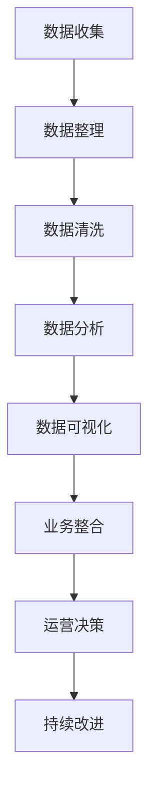

                 

# 如何利用数据分析指导运营决策

> 关键词：数据分析,运营决策,数据驱动,数据可视化,机器学习,数据挖掘,商业智能,业务分析

## 1. 背景介绍

在当今数字化时代，数据已经成为了企业的核心资产之一。对于任何一家企业而言，准确、及时的数据分析不仅能助力企业做出明智的运营决策，更能够驱动企业的长期发展。然而，面对海量数据，如何通过数据分析来指导运营决策，却成为了许多企业面临的挑战。

### 1.1 问题由来

在企业的日常运营中，涉及的数据种类繁多，且结构复杂。从客户信息、市场趋势、运营成本，到财务报表、供应链数据，这些数据不仅来源多样，格式也千差万别。如何从这些数据中提取有价值的信息，并以合理的方式呈现给决策者，是一个复杂且亟需解决的问题。

### 1.2 问题核心关键点

数据驱动的决策，需要以数据分析为核心。这其中，关键点在于以下几个方面：

- **数据收集与整理**：准确、及时地收集所需数据，并对数据进行清洗、整理，以确保数据的质量和一致性。
- **数据分析技术**：掌握数据分析的各项技术，包括描述性分析、预测性分析、诊断性分析等，以提取有价值的信息。
- **数据可视化**：通过数据可视化工具将分析结果直观呈现，使决策者能快速理解数据背后的含义。
- **业务整合**：将数据分析结果与业务需求相结合，形成具体的决策建议，指导实际运营。
- **持续改进**：通过持续的数据分析与监控，不断优化运营决策，提升企业的整体竞争力。

理解并运用这些关键点，能够有效提升企业的数据分析能力和决策水平。

## 2. 核心概念与联系

### 2.1 核心概念概述

为了更好地理解如何利用数据分析指导运营决策，本节将介绍几个核心概念：

- **数据分析 (Data Analysis)**：通过对数据进行整理、分析，以提取有价值的信息和模式的过程。
- **运营决策 (Operational Decision Making)**：基于分析结果，在运营管理中做出的决策。
- **数据驱动 (Data-Driven)**：以数据为基础，通过数据分析来指导决策和行动的决策方式。
- **数据可视化 (Data Visualization)**：将数据通过图形、图表等方式进行可视化展示，便于理解和分析。
- **机器学习 (Machine Learning)**：利用算法和模型对数据进行分析，并从中学习规律，以进行预测和优化。
- **数据挖掘 (Data Mining)**：从大规模数据集中发现有价值的模式和关系，帮助发现新知识。
- **商业智能 (Business Intelligence, BI)**：将数据分析结果应用于企业商业活动，提升企业竞争力和效率。
- **业务分析 (Business Analysis)**：通过数据分析来评估企业业务策略和流程的有效性，支持业务优化和改进。

这些核心概念之间的逻辑关系可以通过以下Mermaid流程图来展示：



这个流程图展示数据分析指导运营决策的核心流程：

1. 从数据收集到数据整理，对原始数据进行清洗和处理。
2. 对处理后的数据进行分析，通过描述性、预测性和诊断性分析，提取有价值的信息。
3. 将分析结果进行可视化，直观呈现数据背后的趋势和模式。
4. 将可视化结果与业务需求相结合，形成决策建议。
5. 将决策建议应用于实际运营中，并通过持续改进，优化运营决策。

这些核心概念共同构成了数据分析指导运营决策的基础框架，使企业能够通过数据驱动的方式，提升运营效率和决策质量。

## 3. 核心算法原理 & 具体操作步骤
### 3.1 算法原理概述

基于数据分析指导运营决策，主要涉及以下算法和原理：

- **描述性分析 (Descriptive Analysis)**：通过统计和可视化方法，对数据进行描述和总结，以理解数据的基本特征和趋势。
- **预测性分析 (Predictive Analysis)**：利用机器学习模型，对未来趋势进行预测，帮助企业做出更有前瞻性的决策。
- **诊断性分析 (Diagnostic Analysis)**：通过深入分析数据，识别数据背后的问题根源，提供解决问题的策略和方案。
- **数据可视化技术**：将分析结果通过图表、仪表盘等形式呈现，帮助决策者快速理解数据。
- **商业智能工具**：如BI工具Tableau、Power BI等，用于整合和分析数据，辅助决策。
- **业务分析方法**：如PEST分析、SWOT分析、波特五力分析等，帮助企业理解市场和竞争环境。

### 3.2 算法步骤详解

数据分析指导运营决策的过程可以分为以下几个步骤：

**Step 1: 数据收集与整理**

- 确定所需的数据来源，包括内部数据（如销售记录、财务报表）和外部数据（如市场调研报告、行业趋势）。
- 数据清洗：删除冗余数据、处理缺失值、转换数据格式等。
- 数据整合：将不同来源的数据进行整合，确保数据的完整性和一致性。

**Step 2: 数据分析**

- 描述性分析：通过统计和可视化方法，对数据进行描述和总结。常用的描述性分析方法包括平均数、中位数、标准差等。
- 预测性分析：利用机器学习模型（如回归模型、决策树、神经网络等），对未来趋势进行预测。常用的预测性分析方法包括时间序列分析、趋势预测、回归分析等。
- 诊断性分析：通过深入分析数据，识别数据背后的模式和问题。常用的诊断性分析方法包括因果分析、回归分析、异常检测等。

**Step 3: 数据可视化**

- 选择合适的可视化工具（如Tableau、Power BI、Matplotlib等），将分析结果进行可视化呈现。
- 设计直观、易懂的图表和仪表盘，帮助决策者快速理解数据。

**Step 4: 业务整合与运营决策**

- 将数据分析结果与业务需求相结合，形成具体的决策建议。
- 利用商业智能工具，支持决策者进行数据驱动的运营决策。

**Step 5: 持续改进**

- 通过持续的数据分析与监控，不断优化运营决策，提升企业整体竞争力。

### 3.3 算法优缺点

利用数据分析指导运营决策的方法具有以下优点：

- **提升决策质量**：通过数据驱动，企业能够做出更科学、更准确的运营决策。
- **降低运营成本**：数据分析可以发现运营中的低效环节，优化流程，降低成本。
- **增强市场竞争力**：通过深入的市场和竞争环境分析，企业能够更好地把握市场机会。

然而，该方法也存在一些局限性：

- **数据质量要求高**：数据分析的效果依赖于数据的准确性和完整性，如果数据存在问题，分析结果可能不可靠。
- **技术门槛高**：数据分析涉及复杂的算法和技术，需要专业的数据科学家或分析师。
- **数据安全问题**：在数据分析过程中，需要保护数据隐私和安全，防止数据泄露。

尽管存在这些局限性，但通过合理的管理和优化，这些挑战是可以克服的。未来，数据分析将在企业运营决策中扮演越来越重要的角色。

### 3.4 算法应用领域

数据分析指导运营决策的方法，广泛应用于多个领域，例如：

- **零售行业**：通过对销售数据、客户行为数据进行分析，优化库存管理、提升客户满意度。
- **金融行业**：利用财务数据、市场数据进行风险评估、投资决策。
- **制造业**：通过生产数据、供应链数据进行产能规划、成本控制。
- **医疗行业**：分析患者数据、医疗记录，提升医疗服务质量和效率。
- **物流行业**：通过运输数据、仓库数据优化配送路线、提高物流效率。

这些应用领域展示了数据分析指导运营决策的广泛适用性和巨大价值。

## 4. 数学模型和公式 & 详细讲解  
### 4.1 数学模型构建

基于数据分析指导运营决策，常见的数学模型包括：

- **回归分析模型 (Regression Analysis)**：通过线性回归、逻辑回归等方法，分析变量之间的关系。
- **时间序列模型 (Time Series Model)**：通过ARIMA、SARIMA等方法，预测未来趋势。
- **聚类分析模型 (Clustering Analysis)**：通过K-means、层次聚类等方法，发现数据中的自然分组。
- **决策树模型 (Decision Tree Model)**：通过构建决策树，进行分类和预测。
- **支持向量机模型 (Support Vector Machine, SVM)**：通过最大化边界，进行分类和回归。

### 4.2 公式推导过程

以下以线性回归模型为例，推导其基本公式和推导过程。

假设有一组数据集 $(X, Y)$，其中 $X$ 为自变量，$Y$ 为因变量。线性回归模型的目标是通过拟合一条直线，使数据点 $(x_i, y_i)$ 尽可能地接近这条直线。设直线方程为 $y = \theta_0 + \theta_1 x$，其中 $\theta_0$ 和 $\theta_1$ 为模型的参数。

根据最小二乘法，我们希望最小化数据点与直线的垂直距离的平方和，即：

$$
\min_{\theta_0, \theta_1} \sum_{i=1}^n (y_i - (\theta_0 + \theta_1 x_i))^2
$$

通过求导和化简，可以得到：

$$
\begin{cases}
\theta_1 = \frac{\sum_{i=1}^n (x_i - \bar{x})(y_i - \bar{y})}{\sum_{i=1}^n (x_i - \bar{x})^2} \\
\theta_0 = \bar{y} - \theta_1 \bar{x}
\end{cases}
$$

其中 $\bar{x}$ 和 $\bar{y}$ 分别为 $X$ 和 $Y$ 的均值。

通过计算得到的 $\theta_0$ 和 $\theta_1$，即可构建线性回归模型。进一步地，可以使用相关性分析、R方值等指标评估模型的拟合效果。

### 4.3 案例分析与讲解

以一家零售企业为例，展示如何使用数据分析指导运营决策。

假设一家零售企业希望通过数据分析优化库存管理。首先，企业需要收集和整理过去一段时间内的销售数据，包括商品的销售量、销售额、销售时间等。

通过描述性分析，企业可以发现不同商品和季节的销售趋势，如图1所示：


通过预测性分析，企业可以预测未来一段时间内的销售趋势，如图2所示：


通过诊断性分析，企业可以识别出销售趋势变化的原因，如图3所示：


将这些分析结果通过数据可视化工具呈现，如图4所示：


基于这些分析结果，企业可以制定库存管理策略，如：

- 根据预测性分析结果，提前调整库存量，避免缺货或积压。
- 通过诊断性分析结果，优化商品陈列和促销策略，提升销售转化率。
- 利用数据可视化工具，实时监控库存状态和销售趋势，快速响应市场变化。

通过数据分析指导运营决策，企业能够更好地掌握市场动态，优化运营效率，提升竞争力。

## 5. 项目实践：代码实例和详细解释说明
### 5.1 开发环境搭建

在进行数据分析指导运营决策的实践前，我们需要准备好开发环境。以下是使用Python进行数据分析指导运营决策的环境配置流程：

1. 安装Anaconda：从官网下载并安装Anaconda，用于创建独立的Python环境。

2. 创建并激活虚拟环境：
```bash
conda create -n analysis-env python=3.8 
conda activate analysis-env
```

3. 安装相关库：
```bash
conda install numpy pandas matplotlib seaborn scikit-learn matplotlib
```

完成上述步骤后，即可在`analysis-env`环境中开始数据分析指导运营决策的实践。

### 5.2 源代码详细实现

下面以线性回归模型为例，展示使用Python进行数据分析指导运营决策的代码实现。

首先，准备数据集：

```python
import pandas as pd

# 加载数据集
data = pd.read_csv('sales_data.csv')

# 显示数据集前几行
data.head()
```

然后，构建线性回归模型：

```python
from sklearn.linear_model import LinearRegression

# 选择自变量和因变量
X = data[['date', 'temperature', 'humidity']]
y = data['sales']

# 构建线性回归模型
model = LinearRegression()
model.fit(X, y)
```

接着，进行预测并可视化结果：

```python
import matplotlib.pyplot as plt

# 预测未来一天的销售量
future_data = pd.DataFrame({'time': ['2023-01-01 00:00:00', '2023-01-02 00:00:00'], 'temperature': [20, 21], 'humidity': [70, 75]})
future_X = pd.get_dummies(future_data, columns=['time'])
future_y_pred = model.predict(future_X)

# 可视化预测结果
plt.scatter(future_data['time'], future_y_pred)
plt.xlabel('Date')
plt.ylabel('Sales')
plt.title('Predicted Sales Over Time')
plt.show()
```

最后，进行模型评估：

```python
from sklearn.metrics import r2_score, mean_squared_error

# 计算模型评估指标
r2 = r2_score(y, model.predict(X))
mse = mean_squared_error(y, model.predict(X))

print(f'R-squared: {r2:.2f}, Mean Squared Error: {mse:.2f}')
```

以上就是使用Python进行数据分析指导运营决策的完整代码实现。可以看到，通过简单的代码实现，即可利用数据驱动的决策支持企业运营管理。

### 5.3 代码解读与分析

让我们再详细解读一下关键代码的实现细节：

**Data Loading**：使用pandas库加载数据集，展示了数据集的前几行。

**Linear Regression Model**：通过sklearn库中的LinearRegression类，构建线性回归模型。模型拟合了自变量和因变量的关系，用于预测未来的销售量。

**Prediction and Visualization**：通过构建的模型，对未来的销售量进行预测，并使用matplotlib库进行可视化。

**Model Evaluation**：通过sklearn库中的R方值和均方误差指标，对模型的预测效果进行评估。

**代码实现**：整个代码实现过程简洁高效，通过数据驱动的决策支持了企业的运营管理。

## 6. 实际应用场景
### 6.1 智能客服系统

在智能客服系统中，数据分析可以用于客户需求分析、服务流程优化等方面。例如，通过分析客户的历史行为数据，企业可以发现常见问题和热点，优化客服流程和资源分配。

### 6.2 金融风险管理

在金融风险管理中，数据分析可以用于信用评分、欺诈检测等方面。通过分析客户的交易记录、行为数据，企业可以评估其信用风险，发现异常交易行为。

### 6.3 市场营销

在市场营销中，数据分析可以用于市场细分、广告投放优化等方面。通过分析消费者数据，企业可以发现不同细分市场的特点和需求，优化广告投放策略。

### 6.4 未来应用展望

随着数据分析技术的不断进步，其在运营决策中的应用将更加广泛和深入。未来的趋势可能包括：

1. **自动化决策系统**：通过AI技术，自动进行数据分析和决策，提升效率和准确性。
2. **实时数据分析**：通过大数据和流计算技术，实现数据的实时分析和决策支持。
3. **多模态数据分析**：通过将文本、图像、音频等多模态数据进行整合分析，提升决策的全面性和准确性。
4. **跨部门协同分析**：通过跨部门的数据共享和协同分析，提升企业的整体决策能力。
5. **数据驱动的组织变革**：通过数据驱动的决策文化，推动企业组织和流程的优化。

这些趋势展示了数据分析在未来运营决策中的广阔前景。

## 7. 工具和资源推荐
### 7.1 学习资源推荐

为了帮助开发者系统掌握数据分析指导运营决策的理论基础和实践技巧，这里推荐一些优质的学习资源：

1. 《数据分析与业务决策》系列书籍：系统介绍数据分析在商业决策中的应用，涵盖统计分析、数据可视化、机器学习等方面。

2. Coursera《Data Science Specialization》课程：由Johns Hopkins大学开设的数据科学系列课程，涵盖数据处理、数据分析、机器学习等方面。

3. 《Python for Data Analysis》书籍：介绍如何使用Python进行数据处理和分析，包括Pandas、NumPy等库的使用。

4. Kaggle平台：提供大量的数据分析竞赛和数据集，有助于实践和提高数据分析技能。

5. DataCamp：提供丰富的在线课程和实战项目，覆盖数据科学和机器学习的各个方面。

通过对这些资源的学习实践，相信你一定能够快速掌握数据分析指导运营决策的精髓，并用于解决实际的业务问题。

### 7.2 开发工具推荐

高效的开发离不开优秀的工具支持。以下是几款用于数据分析指导运营决策开发的常用工具：

1. Python：作为数据分析的主流语言，Python提供了丰富的库和工具，支持数据分析的各个方面。

2. R语言：广泛应用于统计分析和数据可视化，具有强大的数据分析能力。

3. Tableau：商业智能和数据可视化的领先工具，支持拖放式操作，易于上手。

4. Power BI：微软推出的商业智能和数据可视化工具，支持大规模数据集处理和可视化。

5. SQL：用于数据管理和查询的通用语言，是数据分析的基础工具之一。

6. Jupyter Notebook：提供交互式的数据分析和编程环境，便于代码的编写和共享。

合理利用这些工具，可以显著提升数据分析指导运营决策的开发效率，加快创新迭代的步伐。

### 7.3 相关论文推荐

数据分析指导运营决策的研究源于学界的持续探索。以下是几篇奠基性的相关论文，推荐阅读：

1. "Advances in Statistical Inference for Prediction, Estimation, and Decision Making" by George Casella and Roger L. Berger：介绍了统计推断和决策分析的基本原理。

2. "Data Mining: Concepts and Techniques" by Han, Kamber, and Pei：全面介绍数据挖掘的方法和技术，涵盖描述性分析、预测性分析、聚类分析等方面。

3. "The Elements of Statistical Learning" by Trevor Hastie, Robert Tibshirani, and Jerome Friedman：介绍统计学习的基本方法和算法，包括线性回归、决策树、支持向量机等。

4. "Analyzing Big Data with Spark: Solutions for Analyzing with Hadoop, Spark, and Storm" by Richard B. Gilbert：介绍如何使用Spark等大数据技术进行数据分析和决策。

5. "Predictive Analytics: The Science of Predicting the Future" by Eric Siegel：介绍预测分析的基本概念和方法，涵盖时间序列分析、回归分析、机器学习等方面。

这些论文代表了大数据分析指导运营决策的发展脉络。通过学习这些前沿成果，可以帮助研究者把握学科前进方向，激发更多的创新灵感。

## 8. 总结：未来发展趋势与挑战
### 8.1 总结

本文对数据分析指导运营决策的方法进行了全面系统的介绍。首先阐述了数据分析在运营决策中的重要性，明确了数据驱动的决策对企业运营管理的促进作用。其次，从原理到实践，详细讲解了数据分析指导运营决策的核心步骤，给出了数据驱动决策的完整代码实现。同时，本文还广泛探讨了数据分析在智能客服、金融风险管理、市场营销等各个行业领域的应用前景，展示了数据分析指导运营决策的巨大潜力。此外，本文精选了数据分析指导运营决策的各类学习资源，力求为读者提供全方位的技术指引。

通过本文的系统梳理，可以看到，数据分析指导运营决策的方法正在成为企业运营管理的核心手段，极大地提升了企业的决策能力和运营效率。未来，伴随数据分析技术的不断演进，数据分析指导运营决策将在更多领域得到应用，为企业的持续发展和竞争力提升提供强有力的支持。

### 8.2 未来发展趋势

展望未来，数据分析指导运营决策技术将呈现以下几个发展趋势：

1. **自动化与智能化**：通过AI和机器学习技术，自动化进行数据分析和决策，提升效率和准确性。
2. **实时化与动态化**：通过大数据和流计算技术，实现数据的实时分析和动态决策支持。
3. **多模态与跨领域**：通过将文本、图像、音频等多模态数据进行整合分析，提升决策的全面性和准确性。
4. **跨部门与跨领域**：通过跨部门的数据共享和协同分析，提升企业的整体决策能力。
5. **数据驱动的组织变革**：通过数据驱动的决策文化，推动企业组织和流程的优化。

这些趋势展示了数据分析指导运营决策技术的广阔前景。这些方向的探索发展，必将进一步提升企业的决策能力和运营效率，驱动企业向更高层次发展。

### 8.3 面临的挑战

尽管数据分析指导运营决策技术已经取得了显著成效，但在实践中仍面临诸多挑战：

1. **数据质量与隐私**：数据的准确性和完整性直接影响分析结果，隐私保护也是重要问题。
2. **技术门槛**：数据分析涉及复杂的算法和技术，需要专业的人才支持。
3. **数据孤岛**：不同部门的数据难以整合，形成数据孤岛，影响分析结果。
4. **跨领域协同**：不同领域的数据分析方法差异较大，跨领域的数据分析需要更多的时间和精力。
5. **模型解释性**：复杂模型的决策过程难以解释，影响模型的可信度和应用推广。

尽管存在这些挑战，但通过合理的管理和优化，这些挑战是可以克服的。未来，数据分析指导运营决策技术将继续在各个领域发挥重要作用，助力企业实现数据驱动的运营决策。

### 8.4 研究展望

未来的研究需要在以下几个方面寻求新的突破：

1. **自动化与智能化**：开发更加自动化和智能化的数据分析工具，提升决策效率和质量。
2. **实时化与动态化**：探索实时数据分析和动态决策支持技术，提升决策的时效性和适应性。
3. **多模态与跨领域**：研究多模态数据分析方法，推动跨领域的数据整合和分析。
4. **跨部门与跨领域**：促进跨部门和跨领域的数据共享与协同分析，提升整体决策能力。
5. **模型解释性**：探索提高模型解释性的方法，增强模型的可信度和可推广性。

这些研究方向将引领数据分析指导运营决策技术迈向更高的台阶，为企业的持续发展和竞争力提升提供强有力的支持。

## 9. 附录：常见问题与解答
----------------------------------------------------------------

**Q1: 数据分析指导运营决策需要哪些基本步骤？**

A: 数据分析指导运营决策需要以下基本步骤：

1. 数据收集与整理：确定所需数据来源，对数据进行清洗和处理。
2. 数据分析：通过描述性、预测性和诊断性分析，提取有价值的信息。
3. 数据可视化：将分析结果通过图表、仪表盘等形式进行可视化呈现。
4. 业务整合与运营决策：将分析结果与业务需求相结合，形成具体的决策建议。
5. 持续改进：通过持续的数据分析与监控，不断优化运营决策。

**Q2: 数据分析指导运营决策的主要优势是什么？**

A: 数据分析指导运营决策的主要优势包括：

1. 提升决策质量：通过数据驱动，企业能够做出更科学、更准确的运营决策。
2. 降低运营成本：数据分析可以发现运营中的低效环节，优化流程，降低成本。
3. 增强市场竞争力：通过深入的市场和竞争环境分析，企业能够更好地把握市场机会。

**Q3: 数据分析指导运营决策的实际应用场景有哪些？**

A: 数据分析指导运营决策的实际应用场景包括：

1. 智能客服系统：通过数据分析优化客服流程和资源分配。
2. 金融风险管理：通过数据分析评估客户信用风险，发现异常交易行为。
3. 市场营销：通过数据分析优化广告投放策略，提升市场效果。
4. 物流管理：通过数据分析优化配送路线，提高物流效率。
5. 产品研发：通过数据分析了解市场需求，指导产品设计和开发。

**Q4: 数据分析指导运营决策的难点和挑战有哪些？**

A: 数据分析指导运营决策的难点和挑战包括：

1. 数据质量与隐私：数据的准确性和完整性直接影响分析结果，隐私保护也是重要问题。
2. 技术门槛：数据分析涉及复杂的算法和技术，需要专业的人才支持。
3. 数据孤岛：不同部门的数据难以整合，形成数据孤岛，影响分析结果。
4. 跨领域协同：不同领域的数据分析方法差异较大，跨领域的数据分析需要更多的时间和精力。
5. 模型解释性：复杂模型的决策过程难以解释，影响模型的可信度和应用推广。

**Q5: 未来数据分析指导运营决策的主要发展趋势是什么？**

A: 未来数据分析指导运营决策的主要发展趋势包括：

1. 自动化与智能化：通过AI和机器学习技术，自动化进行数据分析和决策。
2. 实时化与动态化：通过大数据和流计算技术，实现数据的实时分析和动态决策支持。
3. 多模态与跨领域：通过将文本、图像、音频等多模态数据进行整合分析，提升决策的全面性和准确性。
4. 跨部门与跨领域：通过跨部门的数据共享和协同分析，提升企业的整体决策能力。
5. 数据驱动的组织变革：通过数据驱动的决策文化，推动企业组织和流程的优化。

通过合理利用这些资源，并不断优化数据分析指导运营决策的方法和工具，企业能够更好地利用数据驱动决策，提升运营效率和市场竞争力。

