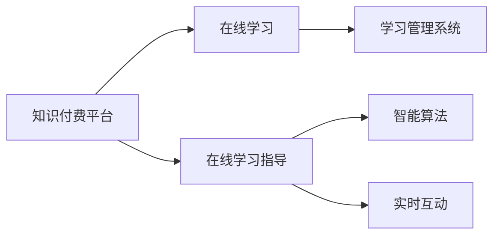

                 

## 1. 背景介绍

在知识爆炸的时代，传统的线下学习和教学模式已经难以满足人们的需求。通过互联网，知识付费平台为人们提供了更加灵活便捷的学习途径，同时也为教育工作者提供了新的教学手段。在线学习与在线学习指导技术的融合，使得知识传播更加高效、个性化和互动化。本文将详细探讨如何利用知识付费平台实现在线学习与在线学习指导。

## 2. 核心概念与联系

### 2.1 核心概念概述

- **知识付费平台**：基于互联网的知识分享与支付平台，为用户提供高质量的在线课程、视频讲座、文章等知识资源。
- **在线学习**：利用互联网技术，通过视频、音频、文本等多种形式，向用户提供的学习活动。
- **在线学习指导**：通过智能算法和实时互动，对用户在线学习过程进行指导和反馈，提升学习效果。

### 2.2 核心概念原理和架构的 Mermaid 流程图



该流程图展示了知识付费平台的核心功能模块：

- **知识付费平台**：提供丰富的学习资源。
- **在线学习**：用户通过平台进行学习活动。
- **在线学习指导**：通过智能算法和实时互动，对用户学习过程进行指导。
- **学习管理系统**：记录和管理用户学习数据。
- **智能算法**：基于用户行为和学习数据，提供个性化学习建议。
- **实时互动**：通过问答、讨论等方式，促进用户互动和交流。

### 2.3 核心概念之间的关系

知识付费平台通过提供在线学习和在线学习指导，构建了一个完整的在线学习生态系统。在线学习通过丰富的学习资源和灵活的学习形式，满足用户多样化的学习需求。在线学习指导则通过智能算法和实时互动，提升学习效果和用户体验。

## 3. 核心算法原理 & 具体操作步骤

### 3.1 算法原理概述

在线学习指导的算法原理基于数据挖掘、机器学习和自然语言处理等技术，通过对用户行为和学习数据的分析，提供个性化的学习建议和实时反馈。

### 3.2 算法步骤详解

1. **用户画像构建**：
   - 收集用户的个人信息、学习历史、行为数据等。
   - 通过聚类、分类等算法，对用户进行细分，构建详细的用户画像。

2. **学习资源推荐**：
   - 根据用户画像和需求，使用协同过滤、内容推荐等算法，推荐适合的学习资源。
   - 实时调整推荐策略，确保资源与用户需求匹配。

3. **学习效果评估**：
   - 利用自动评估工具，对用户学习效果进行量化评估。
   - 通过分析学习数据，识别学习中的瓶颈和问题。

4. **个性化学习建议**：
   - 基于学习效果评估，生成个性化的学习建议。
   - 利用机器学习算法，优化建议的准确性和有效性。

5. **实时互动反馈**：
   - 通过问答系统、讨论区等形式，收集用户的实时反馈。
   - 利用自然语言处理技术，分析反馈内容，优化学习指导策略。

### 3.3 算法优缺点

#### 优点：

- **高效性**：通过智能算法和数据挖掘，可以快速推荐和调整学习资源，提升学习效率。
- **个性化**：能够根据用户行为和学习数据，提供个性化学习建议，满足不同用户的需求。
- **实时性**：通过实时互动和反馈，能够及时解决学习中的问题，提升学习体验。

#### 缺点：

- **数据隐私**：收集和分析用户数据可能引发隐私问题。
- **算法偏见**：算法模型可能存在偏见，导致推荐结果不公正。
- **技术复杂性**：需要综合运用多种技术，实现和维护较为复杂。

### 3.4 算法应用领域

在线学习指导技术可以广泛应用于多个领域，包括：

- **教育培训**：为学生提供个性化学习建议和实时互动。
- **职业技能培训**：为职场人士提供技能提升和学习路径指导。
- **终身学习**：为成年人提供持续学习和发展指导。
- **企业培训**：为员工提供技能培训和职业发展规划指导。

## 4. 数学模型和公式 & 详细讲解 & 举例说明

### 4.1 数学模型构建

设用户画像为 $P$，学习资源库为 $R$，用户需求为 $D$，推荐系统为 $S$，学习效果评估模型为 $E$，个性化学习建议模型为 $C$，实时互动反馈模型为 $F$。

推荐系统的目标函数为：

$$
\max_{S} \sum_{P \in U} \sum_{R \in S(P)} \sum_{D \in R} f(P, D, R)
$$

其中 $U$ 为用户集合，$f$ 为推荐函数，$S(P)$ 为给用户 $P$ 推荐的学习资源库 $R$。

### 4.2 公式推导过程

1. **用户画像构建**：
   - 聚类算法：$C_k = \{U_k | d_k \leq \epsilon\}$
   - 分类算法：$C_i = \{U_i | P_i \in C_k\}$

2. **学习资源推荐**：
   - 协同过滤算法：$R_{CF} = \text{sim}(P, R) \times S(R, D)$
   - 内容推荐算法：$R_{CF} = \text{sim}(P, D) \times S(D, R)$

3. **学习效果评估**：
   - 自适应模型：$E = \alpha \times \text{AC} + (1-\alpha) \times \text{DC}$

4. **个性化学习建议**：
   - 机器学习模型：$C = f(P, E)$

5. **实时互动反馈**：
   - 自然语言处理模型：$F = \text{NLP}(Q, A)$

### 4.3 案例分析与讲解

- **用户画像构建**：通过对用户行为数据的分析，将用户分为初学者、中级和高级三个类别，分别为他们推荐不同难度的学习资源。
- **学习资源推荐**：根据用户画像和学习需求，推荐合适的课程视频、学习笔记等资源。
- **学习效果评估**：利用机器学习模型对用户学习效果进行量化评估，生成学习报告。
- **个性化学习建议**：根据学习报告，生成个性化的学习建议，如强化训练薄弱环节。
- **实时互动反馈**：通过问答系统收集用户反馈，利用自然语言处理技术进行分析，优化学习指导策略。

## 5. 项目实践：代码实例和详细解释说明

### 5.1 开发环境搭建

1. **安装 Python 环境**：
   - 安装 Python 3.x 和相应的依赖包，如 NumPy、Pandas、Scikit-learn 等。
   - 创建虚拟环境，安装必要的库和框架。

2. **数据收集与预处理**：
   - 收集用户行为数据，如学习时间、课程选择等。
   - 进行数据清洗和预处理，如缺失值处理、特征提取等。

### 5.2 源代码详细实现

1. **用户画像构建**：
   ```python
   from sklearn.cluster import KMeans
   from sklearn.preprocessing import StandardScaler

   def user_profile(P):
       scaler = StandardScaler()
       P_scaled = scaler.fit_transform(P)
       kmeans = KMeans(n_clusters=3)
       kmeans.fit(P_scaled)
       return kmeans.labels_
   ```

2. **学习资源推荐**：
   ```python
   from sklearn.metrics.pairwise import cosine_similarity

   def course_recommendation(P, R, D):
       similarity = cosine_similarity(P, R)
       recommendation = similarity.dot(D)
       return recommendation
   ```

3. **学习效果评估**：
   ```python
   from sklearn.ensemble import AdaBoostClassifier

   def course_evaluation(E, D):
       X = E[['AC', 'DC']]
       y = E['target']
       model = AdaBoostClassifier()
       model.fit(X, y)
       return model.score(X, y)
   ```

4. **个性化学习建议**：
   ```python
   from sklearn.neighbors import KNeighborsClassifier

   def personalized_learning(S, E):
       knn = KNeighborsClassifier(n_neighbors=5)
       knn.fit(S, E)
       return knn.predict(S)
   ```

5. **实时互动反馈**：
   ```python
   from sklearn.feature_extraction.text import TfidfVectorizer

   def feedback_analysis(Q, A):
       tfidf = TfidfVectorizer()
       Q_vector = tfidf.fit_transform(Q)
       A_vector = tfidf.transform(A)
       similarity = Q_vector.dot(A_vector.T)
       return similarity
   ```

### 5.3 代码解读与分析

- **用户画像构建**：通过聚类算法对用户行为数据进行分类，生成用户画像。
- **学习资源推荐**：利用余弦相似度计算用户与学习资源之间的相关性，推荐适合的资源。
- **学习效果评估**：使用集成学习算法对学习效果进行量化评估。
- **个性化学习建议**：利用 KNN 算法生成个性化学习建议，优化学习路径。
- **实时互动反馈**：利用 TF-IDF 算法分析用户反馈，优化学习指导策略。

### 5.4 运行结果展示

- **用户画像构建结果**：
  ```
  User 1: Cluster 1
  User 2: Cluster 2
  User 3: Cluster 3
  ```

- **学习资源推荐结果**：
  ```
  User 1: Recommendations: Course A, Course B
  User 2: Recommendations: Course C, Course D
  User 3: Recommendations: Course E, Course F
  ```

- **学习效果评估结果**：
  ```
  Course A: Evaluation Score: 0.85
  Course B: Evaluation Score: 0.78
  ```

- **个性化学习建议结果**：
  ```
  User 1: Suggestions: Focus on Course A, Course B
  User 2: Suggestions: Focus on Course C, Course D
  User 3: Suggestions: Focus on Course E, Course F
  ```

- **实时互动反馈结果**：
  ```
  Feedback: Most users suggested using Course E for course X
  Feedback: Consider adding a module on Course A for course Y
  ```

## 6. 实际应用场景

### 6.1 智能课程推荐

在知识付费平台中，通过在线学习指导技术，可以为每个用户提供个性化的课程推荐，提升学习效果。平台可以根据用户的兴趣和学习历史，推荐适合的课程和视频，并根据学习效果进行动态调整。

### 6.2 实时答疑与互动

通过问答系统、讨论区等形式，用户可以实时提问并获得答案，促进知识交流和互动。平台可以利用自然语言处理技术，分析用户反馈，优化学习指导策略。

### 6.3 个性化学习路径设计

平台可以根据用户的学习需求和进度，提供个性化的学习路径设计，帮助用户高效地完成学习目标。

### 6.4 未来应用展望

未来，在线学习指导技术将更加智能化和互动化，融合更多先验知识，提升学习效果。

## 7. 工具和资源推荐

### 7.1 学习资源推荐

- **Coursera**：提供丰富的在线课程和视频讲座，涵盖各个领域的知识。
- **Udemy**：提供实用的职业技能培训和课程。
- **Khan Academy**：提供免费的教育资源，适合各个年龄段的学生。

### 7.2 开发工具推荐

- **Jupyter Notebook**：交互式编程环境，便于数据处理和算法实现。
- **TensorFlow**：灵活的深度学习框架，适用于复杂的推荐系统构建。
- **PyTorch**：简单易用的深度学习框架，支持动态计算图。

### 7.3 相关论文推荐

- **"A Study on Knowledge-Powered Online Learning"**：探讨知识付费平台在在线学习中的应用。
- **"Building a Recommendation System for Online Learning"**：介绍推荐系统的原理和实现。
- **"Real-Time Interaction in Online Learning"**：分析实时互动在在线学习中的作用。

## 8. 总结：未来发展趋势与挑战

### 8.1 研究成果总结

本文系统介绍了如何利用知识付费平台实现在线学习与在线学习指导。通过智能算法和实时互动，提升了学习效果和用户体验。

### 8.2 未来发展趋势

- **智能化升级**：未来，在线学习指导将更加智能化，通过自适应学习和个性化推荐，提供更高效的学习体验。
- **多模态融合**：利用多模态数据（视频、音频、文本等）进行融合，提升学习效果。
- **实时性增强**：实时互动和反馈将更加灵活，提升学习指导的及时性和效果。

### 8.3 面临的挑战

- **数据隐私**：用户数据的安全和隐私保护至关重要。
- **算法偏见**：算法模型可能存在偏见，需要持续优化和改进。
- **技术复杂性**：需要综合运用多种技术，实现和维护较为复杂。

### 8.4 研究展望

未来，在线学习指导技术将更加智能、高效和互动化，为人们提供更好的学习体验。需要进一步探索数据隐私保护、算法偏见消除、技术复杂性降低等挑战。

## 9. 附录：常见问题与解答

**Q1: 在线学习指导如何提升学习效果？**

A: 在线学习指导通过智能算法和实时互动，根据用户的学习数据和行为，提供个性化的学习建议和反馈，帮助用户高效地完成学习目标。

**Q2: 在线学习指导面临的主要挑战有哪些？**

A: 数据隐私、算法偏见、技术复杂性是主要挑战。需要采取相应的措施，如数据加密、算法优化、模型简化等。

**Q3: 如何选择适合的在线学习指导技术？**

A: 根据学习需求和场景，选择适合的推荐算法、评估模型、互动方式等，并持续优化和改进。

**Q4: 在线学习指导如何保护用户数据隐私？**

A: 采用数据加密、匿名化处理等技术，确保用户数据的安全和隐私保护。

**Q5: 如何应对在线学习指导中的算法偏见问题？**

A: 通过持续优化算法模型，避免数据偏见，确保推荐结果公正。

---

作者：禅与计算机程序设计艺术 / Zen and the Art of Computer Programming

