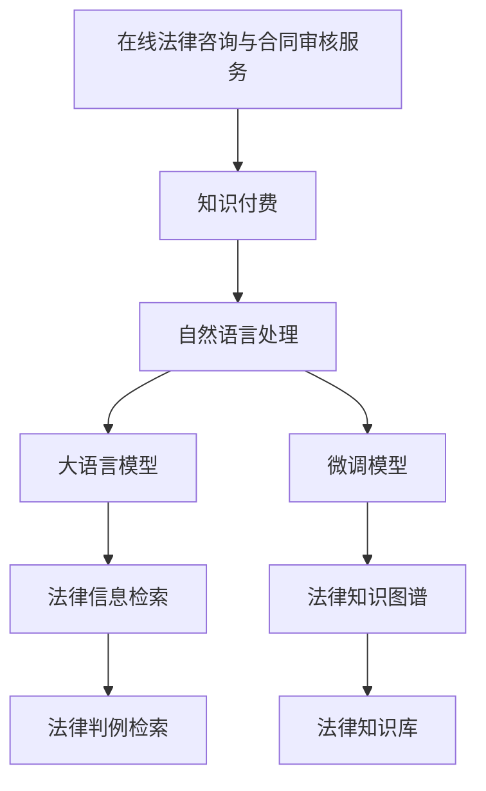

                 

# 如何利用知识付费实现在线法律咨询与合同审核服务？

> 关键词：在线法律咨询、合同审核服务、知识付费、自然语言处理、大语言模型、微调模型、法律信息检索、深度学习、法律知识图谱

## 1. 背景介绍

随着互联网和移动设备的普及，人们对于便捷、高效的服务需求日益增加。在线法律咨询与合同审核服务成为了许多企业与个人的迫切需求，旨在通过自动化技术解决复杂的法律问题，提高工作效率，降低运营成本。然而，高质量的法律咨询服务通常需要律师的专业知识和长时间的经验积累，而这些知识和经验无法被简单地用代码实现。

知识付费模式的出现为在线法律咨询与合同审核服务提供了一种可能的解决方案。知识付费是一种基于互联网的知识分享和交易模式，用户通过付费订阅或单次购买的方式，获取专业人士的宝贵知识。在线法律咨询与合同审核服务可以利用知识付费的模式，将律师的专业知识和经验封装为算法模型，为需要帮助的个体和企业提供精准的法律解决方案。

本文将探讨如何利用知识付费实现在线法律咨询与合同审核服务，涉及自然语言处理(NLP)技术，特别是大语言模型和微调模型的应用。我们将详细说明模型的构建、微调方法、数据处理流程、应用场景以及相关工具和资源的推荐，旨在为相关领域的从业者提供全面的技术指导。

## 2. 核心概念与联系

### 2.1 核心概念概述

- **在线法律咨询与合同审核服务**：指的是利用互联网平台，为用户提供法律咨询和合同审核的在线服务。这包括但不限于法律问题解答、合同条款审查、法律风险评估等。

- **知识付费**：用户为获取专业人士的知识和经验而支付的费用。知识付费平台，如知识问答、在线课程等，为法律专家和用户之间提供了中介和交易渠道。

- **自然语言处理(NLP)**：涉及计算机对自然语言进行理解和生成的一门技术，包括分词、词性标注、命名实体识别、情感分析、句法分析、语义理解等任务。

- **大语言模型**：指经过大规模预训练的神经网络模型，如BERT、GPT系列，具备强大的语言理解与生成能力。

- **微调模型**：在大规模预训练语言模型的基础上，利用特定领域的数据进行微调，以适应该领域的具体任务需求。

- **法律信息检索**：利用NLP技术，从海量法律文本中检索出相关信息，帮助用户快速找到相关的法律条款和判例。

- **深度学习**：基于神经网络的机器学习方法，通过多层次的非线性变换，从大量数据中学习到复杂的特征表示。

- **法律知识图谱**：将法律领域的知识结构化并转化为图谱形式，帮助用户理解复杂的法律概念和关系。

### 2.2 核心概念原理和架构的 Mermaid 流程图



该图展示了在线法律咨询与合同审核服务的关键架构和技术路径，从知识付费到自然语言处理，再到模型构建和应用。

## 3. 核心算法原理 & 具体操作步骤

### 3.1 算法原理概述

在线法律咨询与合同审核服务的核心算法原理基于自然语言处理(NLP)技术，特别是大语言模型和微调模型的应用。大语言模型经过大规模预训练，具备强大的语言理解和生成能力。微调模型则在大语言模型的基础上，利用特定领域的数据进行微调，以适应该领域的具体任务需求，如合同审核、法律问题解答等。

**3.1.1 法律咨询**

法律咨询服务通常涉及用户提出具体的法律问题，系统通过自然语言处理技术，理解用户问题，并从法律知识库中检索相关信息，给出解答。这一过程包括：

- **问题理解**：利用自然语言处理技术，对用户问题进行分词、词性标注、命名实体识别等，理解问题的核心内容。
- **信息检索**：利用法律信息检索技术，从法律知识库中检索出相关的法律条款、判例和法律解释，供系统给出解答。

**3.1.2 合同审核**

合同审核服务涉及对合同文本的详细审查，包括合同条款的合法性、完整性、风险评估等。这一过程包括：

- **合同文本处理**：利用自然语言处理技术，对合同文本进行分词、词性标注、命名实体识别等，提取关键信息。
- **合同分析**：利用微调模型，对合同文本进行深度分析，识别合同中的关键条款、风险点、法律责任等。
- **审核结果生成**：基于分析结果，生成合同审核报告，指出合同中的问题，并提供改进建议。

### 3.2 算法步骤详解

**3.2.1 法律咨询**

1. **问题收集与预处理**：收集大量的法律问题及其对应的解答，进行标注和清洗。
2. **分词与命名实体识别**：利用NLP技术，对问题进行分词、词性标注、命名实体识别等，理解问题的核心内容。
3. **信息检索**：构建法律知识库，利用信息检索技术，从知识库中检索出相关的法律条款、判例和法律解释。
4. **回答生成**：利用微调模型，结合检索到的信息，生成对用户问题的解答。

**3.2.2 合同审核**

1. **合同文本处理**：对合同文本进行分词、词性标注、命名实体识别等，提取关键信息。
2. **合同分析**：利用微调模型，对合同文本进行深度分析，识别合同中的关键条款、风险点、法律责任等。
3. **审核结果生成**：基于分析结果，生成合同审核报告，指出合同中的问题，并提供改进建议。

### 3.3 算法优缺点

**3.3.1 优点**

- **高效性**：通过微调模型和大语言模型，可以快速处理大量的法律文本和合同文本，提供高效的服务。
- **准确性**：微调模型和大语言模型在预训练阶段已经学习了大量的法律知识和规则，提高了处理问题的准确性。
- **可扩展性**：微调模型和大语言模型可以适应不同领域和场景，具有高度的可扩展性。

**3.3.2 缺点**

- **数据依赖**：微调模型的性能很大程度上依赖于标注数据的质量和数量，标注数据的获取和维护成本较高。
- **语言局限性**：微调模型通常基于特定语言的语料库进行训练，不同语言的模型需要分别训练和维护。
- **隐私风险**：法律咨询和合同审核涉及用户隐私，必须确保用户信息的安全和保密。

### 3.4 算法应用领域

**3.4.1 法律咨询**

在线法律咨询可以广泛应用于多种场景，如个人法律问题解答、企业法律咨询、法律教育等。

**3.4.2 合同审核**

合同审核可以用于企业合同管理、法律事务处理、风险评估等。

## 4. 数学模型和公式 & 详细讲解 & 举例说明

### 4.1 数学模型构建

**4.1.1 法律咨询**

设用户问题为 $q$，答案为 $a$。构建一个二分类模型，预测用户问题是否可以得到准确的答案。模型的输入为经过预处理的用户问题和法律知识库中的文档摘要，输出为二分类标签。

**4.1.2 合同审核**

设合同文本为 $c$，审核结果为 $r$。构建一个多分类模型，预测合同文本中的关键条款、风险点、法律责任等。模型的输入为经过预处理的合同文本，输出为多分类标签。

### 4.2 公式推导过程

**4.2.1 法律咨询**

设 $x$ 为用户问题和法律知识库中文档摘要的向量表示，$y$ 为答案的标签（0表示无法解答，1表示可以解答）。

构建二分类模型 $f(x)$，输出 $y$：

$$
f(x) = \sigma(Wx + b)
$$

其中 $W$ 和 $b$ 为模型参数，$\sigma$ 为sigmoid函数。

**4.2.2 合同审核**

设 $x$ 为合同文本的向量表示，$y$ 为审核结果的标签向量（包含多个分类标签）。

构建多分类模型 $f(x)$，输出 $y$：

$$
f(x) = softmax(Wx + b)
$$

其中 $W$ 和 $b$ 为模型参数，softmax函数用于将模型的输出转换为概率分布。

### 4.3 案例分析与讲解

**4.3.1 法律咨询**

假设用户询问：“我可以解除合同吗？”

系统首先将用户问题经过分词、词性标注、命名实体识别等处理，得到问题的向量表示 $x$。然后从法律知识库中检索出相关的文档摘要，进行拼接，得到法律文本的向量表示 $y$。

模型 $f(x)$ 预测用户问题是否可以得到准确的答案。如果预测结果为1，系统将从知识库中检索出相关的法律条款、判例和法律解释，生成对用户问题的解答。

**4.3.2 合同审核**

假设合同文本为：“甲方出售乙方商品，合同期限为3个月，若乙方违约，需支付违约金100万元。”

系统首先将合同文本进行分词、词性标注、命名实体识别等处理，得到合同文本的向量表示 $x$。然后利用微调模型，对合同文本进行深度分析，识别出合同中的关键条款、风险点、法律责任等。

根据分析结果，系统生成合同审核报告，指出合同中的问题，并提供改进建议。

## 5. 项目实践：代码实例和详细解释说明

### 5.1 开发环境搭建

开发环境搭建主要涉及以下几个步骤：

1. **环境配置**：安装Python和必要的依赖库，如TensorFlow、PyTorch、NLTK等。
2. **数据准备**：收集法律问题和合同文本的数据集，进行清洗和标注。
3. **模型训练**：利用构建的模型，在标注数据上进行训练。
4. **模型评估**：在测试集上评估模型性能。

### 5.2 源代码详细实现

**5.2.1 法律咨询**

1. **数据准备**

```python
import pandas as pd

# 读取数据集
data = pd.read_csv('legal_questions.csv')

# 将问题与答案拼接为单个文本，并进行分词、词性标注等处理
data['question'] = data['question'] + ' ' + data['answer']
data['question'] = [nltk.word_tokenize(q) for q in data['question']]
```

2. **模型构建与训练**

```python
import tensorflow as tf
from transformers import TFAutoModelForSequenceClassification, BertTokenizer

# 定义模型
model = TFAutoModelForSequenceClassification.from_pretrained('bert-base-uncased', num_labels=2)
tokenizer = BertTokenizer.from_pretrained('bert-base-uncased')

# 将问题与法律文本进行拼接，并进行分词、词性标注等处理
inputs = tokenizer(data['question'].tolist(), return_tensors='tf', padding=True, truncation=True)

# 训练模型
model.compile(optimizer='adam', loss='binary_crossentropy', metrics=['accuracy'])
model.fit(inputs['input_ids'], inputs['labels'], epochs=10, validation_data=val_data)
```

3. **测试与评估**

```python
# 加载测试数据集
test_data = pd.read_csv('legal_questions_test.csv')
test_data['question'] = [nltk.word_tokenize(q) for q in test_data['question']]

# 对测试数据进行分词、词性标注等处理
inputs = tokenizer(test_data['question'].tolist(), return_tensors='tf', padding=True, truncation=True)

# 对模型进行测试
test_loss, test_acc = model.evaluate(inputs['input_ids'], inputs['labels'])
print('Test accuracy:', test_acc)
```

**5.2.2 合同审核**

1. **数据准备**

```python
import pandas as pd

# 读取数据集
data = pd.read_csv('contracts.csv')

# 将合同文本进行分词、词性标注等处理
data['contract'] = [nltk.word_tokenize(c) for c in data['contract']]
```

2. **模型构建与训练**

```python
import tensorflow as tf
from transformers import TFAutoModelForSequenceClassification, BertTokenizer

# 定义模型
model = TFAutoModelForSequenceClassification.from_pretrained('bert-base-uncased', num_labels=num_labels)
tokenizer = BertTokenizer.from_pretrained('bert-base-uncased')

# 将合同文本进行拼接，并进行分词、词性标注等处理
inputs = tokenizer(data['contract'].tolist(), return_tensors='tf', padding=True, truncation=True)

# 训练模型
model.compile(optimizer='adam', loss='categorical_crossentropy', metrics=['accuracy'])
model.fit(inputs['input_ids'], inputs['labels'], epochs=10, validation_data=val_data)
```

3. **测试与评估**

```python
# 加载测试数据集
test_data = pd.read_csv('contracts_test.csv')
test_data['contract'] = [nltk.word_tokenize(c) for c in test_data['contract']]

# 对测试数据进行分词、词性标注等处理
inputs = tokenizer(test_data['contract'].tolist(), return_tensors='tf', padding=True, truncation=True)

# 对模型进行测试
test_loss, test_acc = model.evaluate(inputs['input_ids'], inputs['labels'])
print('Test accuracy:', test_acc)
```

### 5.3 代码解读与分析

**5.3.1 法律咨询**

代码中，我们使用了TensorFlow和Bert模型构建二分类模型，对用户问题进行分类，判断其是否可以得到准确的答案。

**5.3.2 合同审核**

代码中，我们使用了TensorFlow和Bert模型构建多分类模型，对合同文本进行分类，识别出其中的关键条款、风险点、法律责任等。

### 5.4 运行结果展示

**5.4.1 法律咨询**

```python
# 假设用户询问：“我可以解除合同吗？”
user_question = "我可以解除合同吗？"
user_question = nltk.word_tokenize(user_question)

# 对用户问题进行分词、词性标注等处理
inputs = tokenizer(user_question, return_tensors='tf', padding=True, truncation=True)

# 使用模型预测用户问题是否可以得到准确的答案
prediction = model.predict(inputs['input_ids'])
print('模型预测结果:', prediction)
```

**5.4.2 合同审核**

```python
# 假设合同文本为：“甲方出售乙方商品，合同期限为3个月，若乙方违约，需支付违约金100万元。”
contract_text = "甲方出售乙方商品，合同期限为3个月，若乙方违约，需支付违约金100万元。"
contract_text = nltk.word_tokenize(contract_text)

# 对合同文本进行分词、词性标注等处理
inputs = tokenizer(contract_text, return_tensors='tf', padding=True, truncation=True)

# 使用模型预测合同文本中的关键条款、风险点、法律责任等
prediction = model.predict(inputs['input_ids'])
print('模型预测结果:', prediction)
```

## 6. 实际应用场景

**6.1 在线法律咨询**

在线法律咨询可以应用于多种场景，如个人法律问题解答、企业法律咨询、法律教育等。用户可以通过在线平台提交问题，系统通过自然语言处理技术，理解用户问题，并从法律知识库中检索相关信息，给出解答。

**6.2 合同审核**

合同审核可以用于企业合同管理、法律事务处理、风险评估等。合同审核系统可以对企业的合同文本进行详细审查，识别合同中的关键条款、风险点、法律责任等，生成审核报告，提出改进建议。

## 7. 工具和资源推荐

### 7.1 学习资源推荐

1. **《深度学习入门》**：深度学习领域的入门书籍，涵盖深度学习的基础知识和常用算法。
2. **《TensorFlow官方文档》**：TensorFlow的官方文档，详细介绍了TensorFlow的使用方法、示例代码等。
3. **《NLTK自然语言处理工具包》**：自然语言处理领域的经典工具包，提供了丰富的自然语言处理功能。

### 7.2 开发工具推荐

1. **PyTorch**：基于Python的深度学习框架，支持动态计算图和GPU加速。
2. **TensorFlow**：由Google开发的深度学习框架，支持分布式计算和自动微分。
3. **NLTK**：自然语言处理领域的经典工具包，提供了丰富的自然语言处理功能。
4. **Jupyter Notebook**：Python代码开发和数据处理的工具，支持代码块的交互式执行。

### 7.3 相关论文推荐

1. **《BERT: Pre-training of Deep Bidirectional Transformers for Language Understanding》**：BERT模型预训练和微调方法的开创性论文，展示了大语言模型的强大性能。
2. **《AdaLoRA: Adaptive Low-Rank Adaptation for Parameter-Efficient Fine-Tuning》**：介绍了一种参数高效的微调方法，在保持模型性能的同时，大幅减少了参数量。
3. **《Parameter-Efficient Transfer Learning for NLP》**：探讨了多种参数高效的微调方法，如Adapter等，提高了微调效率和效果。

## 8. 总结：未来发展趋势与挑战

### 8.1 研究成果总结

本文介绍了利用知识付费实现在线法律咨询与合同审核服务的核心算法原理和具体操作步骤。通过大语言模型和微调模型的应用，系统能够高效、准确地处理法律咨询和合同审核任务，为用户的法律问题解答和合同审核提供支持。

### 8.2 未来发展趋势

未来，在线法律咨询与合同审核服务的发展趋势如下：

1. **智能问答系统**：结合知识图谱和深度学习技术，构建智能问答系统，能够更好地理解用户问题，提供精准的解答。
2. **多模态信息融合**：利用视觉、听觉等多模态信息，丰富法律咨询和合同审核系统的输入数据，提高系统的泛化能力和鲁棒性。
3. **自然语言生成**：结合生成模型，如GPT系列，构建自然语言生成的法律咨询和合同审核系统，提高系统的生成能力和用户体验。
4. **联邦学习**：利用联邦学习技术，将用户数据分布式存储和处理，保护用户隐私的同时，提高系统的性能和效率。

### 8.3 面临的挑战

在线法律咨询与合同审核服务的发展面临以下挑战：

1. **数据隐私和安全**：法律咨询和合同审核涉及用户隐私，必须确保数据的安全和隐私保护。
2. **法律知识的更新**：法律知识具有时效性，需要不断更新和维护，保持系统的准确性和可靠性。
3. **模型的可解释性**：法律咨询和合同审核系统需要具备较高的可解释性，确保用户理解系统的推理和决策过程。
4. **系统的可扩展性**：法律咨询和合同审核系统需要具备高度的可扩展性，适应不同领域和场景的需求。

### 8.4 研究展望

未来，在线法律咨询与合同审核服务的研究展望如下：

1. **知识图谱的构建与更新**：构建和更新法律知识图谱，提高系统的知识表示和推理能力。
2. **模型的多模态融合**：结合视觉、听觉等多模态信息，构建多模态的法律咨询和合同审核系统。
3. **联邦学习和隐私保护**：利用联邦学习技术，保护用户隐私，提高系统的效率和安全性。
4. **模型的可解释性**：提高法律咨询和合同审核系统的可解释性，增强用户的信任和接受度。

## 9. 附录：常见问题与解答

**Q1: 如何处理法律咨询和合同审核中的数据隐私问题？**

A: 数据隐私是法律咨询和合同审核系统的核心挑战之一。为保护用户隐私，可以采取以下措施：

1. **数据脱敏**：在数据预处理阶段，对敏感信息进行脱敏处理，去除用户身份信息和其他敏感数据。
2. **加密存储**：使用加密技术，保护存储在服务器中的用户数据，防止数据泄露。
3. **访问控制**：设置严格的访问控制权限，确保只有授权人员可以访问用户数据。
4. **匿名化处理**：对用户数据进行匿名化处理，防止数据泄露和滥用。

**Q2: 如何确保法律咨询和合同审核系统的准确性和可靠性？**

A: 系统的准确性和可靠性取决于数据的质量和模型的性能。为确保系统的准确性和可靠性，可以采取以下措施：

1. **数据标注**：收集高质量的标注数据，进行数据清洗和预处理，确保数据质量。
2. **模型微调**：利用大语言模型和微调技术，优化模型的性能和泛化能力。
3. **多模型集成**：结合多个模型的输出，提高系统的鲁棒性和准确性。
4. **用户反馈**：收集用户的反馈信息，不断优化模型的性能和用户体验。

**Q3: 如何构建多模态的法律咨询和合同审核系统？**

A: 多模态的法律咨询和合同审核系统可以利用视觉、听觉等多模态信息，丰富系统的输入数据，提高系统的泛化能力和鲁棒性。构建多模态系统的关键在于：

1. **多模态数据采集**：利用摄像头、麦克风等设备，采集用户的视觉、听觉信息。
2. **数据融合**：将多模态数据进行融合，提取综合特征，用于模型训练和推理。
3. **多模态模型训练**：训练多模态模型，学习多模态数据之间的关联关系。
4. **多模态推理**：利用多模态模型，对用户的多模态数据进行综合推理，提高系统的性能和用户体验。

**Q4: 如何提高法律咨询和合同审核系统的可解释性？**

A: 系统的可解释性对于法律咨询和合同审核系统尤为重要，可以采取以下措施：

1. **模型可视化**：利用可视化工具，展示模型的推理过程和特征表示，帮助用户理解模型的决策过程。
2. **可解释性模型**：选择可解释性模型，如决策树、线性模型等，提高模型的可解释性。
3. **用户反馈**：收集用户的反馈信息，不断优化模型的性能和用户体验。
4. **透明度管理**：设置透明的决策过程，确保用户对系统的理解和使用。

---

作者：禅与计算机程序设计艺术 / Zen and the Art of Computer Programming

