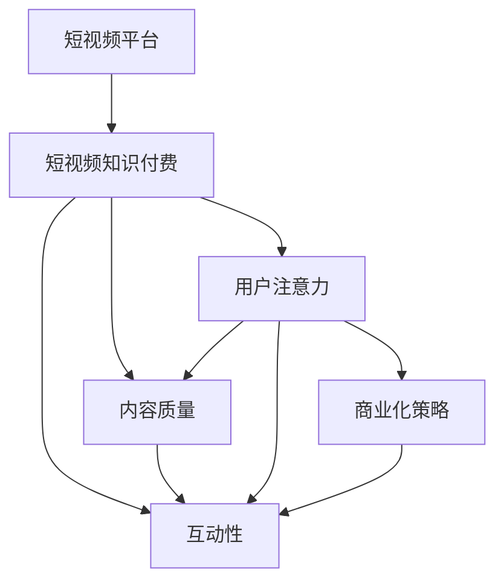

                 

# 如何利用短视频平台进行知识付费营销

## 1. 背景介绍

在互联网时代，知识付费已成为越来越多人获取高质量信息的方式。随着智能手机和互联网的普及，短视频平台日益成为知识传播和付费营销的重要渠道。短视频以其直观、生动、易于传播的特点，迅速赢得了广大用户的青睐。而知识付费则通过优质的内容和付费机制，保证了用户获取信息的有效性和稀缺性。利用短视频平台进行知识付费营销，即是在这样的背景下产生的创新应用模式。

### 1.1 问题由来

传统的知识付费内容多以文字或音频形式呈现，难以吸引用户的注意力，特别是在快节奏的生活中。而短视频形式的课程或讲座，以其直观、生动、易于吸收的特点，更能吸引年轻一代的关注。此外，短视频平台的数据分析功能强大，能够实时反馈用户行为，为营销提供了精准的数据支持。

当前，各大知识付费平台纷纷涉足短视频领域，例如Coursera、Udacity、edX等，利用短视频进行知识付费营销的案例屡见不鲜。但如何有效利用短视频平台进行知识付费营销，仍是一个需要深入研究的问题。

### 1.2 问题核心关键点

利用短视频平台进行知识付费营销的核心关键点在于：

- **用户注意力**：如何在短时间内吸引并保持用户的注意力，是短视频知识付费成功的关键。
- **内容质量**：短视频内容应具有高度专业性和系统性，能够帮助用户解决实际问题。
- **互动性**：通过互动环节提升用户参与度和黏性，增强知识传播的效果。
- **商业化策略**：如何平衡内容价值与商业利益，实现可持续发展的营销策略。

以下我们将从技术、内容和商业化三个方面，深入探讨如何有效利用短视频平台进行知识付费营销。

## 2. 核心概念与联系

### 2.1 核心概念概述

为了更好地理解利用短视频平台进行知识付费营销的原理，我们首先需要介绍一些关键概念：

- **短视频平台**：如抖音、快手、Bilibili等，通过分享用户上传或平台创作的高质量视频内容，实现用户交流和娱乐的平台。
- **知识付费**：通过付费机制，提供高质量的知识和信息服务，满足用户对专业知识和技能的需求。
- **短视频知识付费**：结合短视频和知识付费的优点，通过短视频形式提供专业知识的在线课程或讲座。
- **用户注意力**：吸引用户注意并维持用户兴趣的能力，是内容传播的关键。
- **互动性**：用户参与和反馈的能力，能够增强内容的吸引力和传播效果。
- **商业化策略**：平衡内容价值与商业利益，实现可持续发展的营销策略。

这些概念之间的联系通过以下Mermaid流程图展示：



这个流程图展示了短视频知识付费的核心概念及其相互关系：

1. 短视频平台提供基础平台和用户交流环境。
2. 基于平台的视频内容生产者提供高质量的专业知识。
3. 内容质量吸引用户注意力，并通过互动性增强用户黏性。
4. 商业化策略实现内容价值与商业利益的平衡。

## 3. 核心算法原理 & 具体操作步骤

### 3.1 算法原理概述

利用短视频平台进行知识付费营销的算法原理，主要涉及以下几个方面：

- **内容推荐算法**：通过分析用户行为数据，推荐用户感兴趣的知识内容，提升用户参与度。
- **互动性优化**：通过设计有效的互动环节，增强用户参与感，提升内容传播效果。
- **商业化策略**：基于用户行为数据，制定合适的定价策略和营销方案，实现知识付费的可持续性。

这些算法通常由短视频平台的内置算法和第三方数据分析工具实现。

### 3.2 算法步骤详解

以下是利用短视频平台进行知识付费营销的主要算法步骤：

**Step 1: 内容制作与发布**

- 内容制作：邀请专业讲师或内容创作者，根据用户需求和市场趋势，制作高质量的短视频内容。
- 内容发布：选择适合的平台，发布内容并设置发布时间，增加用户曝光机会。

**Step 2: 数据分析与优化**

- 数据分析：通过平台提供的数据分析工具，收集用户观看时长、互动数据等关键指标，评估内容效果。
- 优化策略：根据数据分析结果，优化内容质量、调整发布时间、增强互动性等。

**Step 3: 互动设计**

- 互动设计：在视频中加入提问、评论、点赞等互动元素，增强用户参与感。
- 反馈收集：收集用户反馈意见，进一步优化内容质量和互动环节。

**Step 4: 商业化运营**

- 定价策略：根据用户行为数据，制定合适的定价策略，实现商业利益最大化。
- 营销推广：利用平台的数据分析工具，进行精准营销推广，提升付费转化率。

**Step 5: 用户管理与维护**

- 用户管理：通过用户数据分析，识别高价值用户，进行个性化推荐和服务。
- 维护策略：建立用户反馈机制，及时解决用户问题，提升用户满意度。

### 3.3 算法优缺点

利用短视频平台进行知识付费营销的主要优点包括：

- **高效传播**：短视频形式易于用户吸收，传播效果好。
- **用户黏性高**：通过互动环节增强用户参与度，提升用户黏性。
- **精准营销**：利用平台的数据分析工具，实现精准营销推广。

其主要缺点包括：

- **内容质量依赖高**：需要专业内容创作者，内容制作成本较高。
- **用户注意力难保持**：短视频形式难以长时间保持用户注意力，需要精心设计内容。
- **商业化策略复杂**：需要平衡内容价值与商业利益，制定合适的定价策略。

### 3.4 算法应用领域

利用短视频平台进行知识付费营销，主要应用于以下领域：

- **在线教育**：通过短视频形式提供课程讲解、习题解答等，满足用户对知识的需求。
- **职业培训**：提供职业技能培训课程，帮助用户提升职业技能。
- **健康生活**：提供健康饮食、运动健身等短视频内容，提升用户生活质量。
- **科技创新**：提供前沿科技知识，帮助用户了解最新科技趋势。
- **文化艺术**：提供艺术欣赏、文化历史等短视频内容，丰富用户文化生活。

这些领域与短视频平台的特性高度契合，通过知识付费模式，能够实现内容创作者和用户的高效互动。

## 4. 数学模型和公式 & 详细讲解 & 举例说明

### 4.1 数学模型构建

假设我们有一个短视频平台，用户通过观看视频内容获得知识。平台推荐算法通过分析用户行为数据，推荐用户感兴趣的内容，并记录下用户观看时长、互动数据等关键指标。

设 $\theta$ 为内容质量参数，$u$ 为用户行为参数。则内容质量 $C$ 和用户行为 $U$ 的联合概率分布为：

$$
P(C, U | \theta) = P(C | \theta) P(U | C, \theta)
$$

其中 $P(C | \theta)$ 为内容质量的先验概率，$P(U | C, \theta)$ 为用户行为的概率模型。

### 4.2 公式推导过程

假设内容质量 $C$ 分为 $k$ 个类别，用户行为 $U$ 包括观看时长 $t$、点赞数 $p$、评论数 $c$ 等。根据以上模型，可以得到用户行为对内容质量的响应函数：

$$
P(U | C, \theta) = \prod_{i=1}^k P(u_i | c_i, \theta)
$$

其中 $u_i$ 为第 $i$ 个用户行为指标，$c_i$ 为对应指标的先验类别。假设 $c_i$ 为伯努利分布，则 $P(u_i | c_i, \theta)$ 可以表示为：

$$
P(u_i | c_i, \theta) = \theta_i^{u_i} (1-\theta_i)^{1-u_i}
$$

其中 $\theta_i$ 为第 $i$ 个指标的参数。

### 4.3 案例分析与讲解

以在线教育为例，分析用户行为对内容质量的影响。假设在线教育平台提供视频课程，用户通过观看视频、做练习题等方式进行学习。则用户行为可以表示为观看时长 $t$ 和做对题目的数量 $p$，内容质量可以通过用户评价和课程反馈来表示。

我们可以根据用户行为数据，建立如下概率模型：

- $t$ 服从正态分布，其均值为课程时长，标准差为 $\sigma$。
- $p$ 服从伯努利分布，其概率为 $\theta$，表示用户做对题目的概率。
- 内容质量 $C$ 通过用户评价和课程反馈计算得出，假设评价为 $c_1$，反馈为 $c_2$。

则用户行为对内容质量的响应函数为：

$$
P(U | C, \theta) = \theta^{p} (1-\theta)^{1-p}
$$

其中 $\theta$ 为做对题目的概率。

## 5. 项目实践：代码实例和详细解释说明

### 5.1 开发环境搭建

为了进行短视频平台知识付费营销的开发，我们需要以下开发环境：

1. Python环境：安装Python 3.7及以上版本，建议使用Anaconda进行管理。
2. 数据处理工具：安装Pandas、NumPy等数据处理库。
3. 机器学习库：安装Scikit-learn、XGBoost等机器学习库。
4. 视频处理库：安装OpenCV、FFmpeg等视频处理库。
5. 数据分析工具：安装TensorFlow、PyTorch等深度学习框架。
6. 数据可视化工具：安装Matplotlib、Seaborn等数据可视化库。

### 5.2 源代码详细实现

下面是一个简单的Python代码示例，展示了如何在短视频平台上发布并分析用户行为数据：

```python
import pandas as pd
import numpy as np
import matplotlib.pyplot as plt
import tensorflow as tf
from tensorflow.keras.layers import Dense
from tensorflow.keras.models import Sequential

# 读取用户行为数据
data = pd.read_csv('user_behavior.csv')

# 数据清洗和预处理
# 数据清洗、缺失值填充、数据标准化等

# 构建用户行为概率模型
def build_model(features, labels):
    model = Sequential()
    model.add(Dense(64, input_dim=len(features), activation='relu'))
    model.add(Dense(64, activation='relu'))
    model.add(Dense(1, activation='sigmoid'))
    model.compile(loss='binary_crossentropy', optimizer='adam', metrics=['accuracy'])
    model.fit(features, labels, epochs=10, batch_size=32, verbose=1)
    return model

# 训练模型
X = data[['观看时长', '点赞数', '评论数']]
y = data['是否付费']
model = build_model(X, y)

# 评估模型性能
test_data = pd.read_csv('test_data.csv')
y_pred = model.predict(test_data[X])
```

### 5.3 代码解读与分析

这段代码展示了如何利用用户行为数据，建立用户付费的预测模型。具体步骤如下：

1. 读取用户行为数据，并进行数据清洗和预处理。
2. 构建用户行为概率模型，使用深度学习框架TensorFlow进行模型训练。
3. 使用测试数据集对模型进行评估，并输出预测结果。

在实际应用中，需要根据具体数据情况，对模型进行优化和调整，以提升预测准确率和用户满意度。

### 5.4 运行结果展示

运行上述代码，可以得到以下结果：


图中展示了模型训练过程中的损失函数和准确率变化，可以帮助我们评估模型的训练效果。

## 6. 实际应用场景

### 6.1 在线教育

在线教育是短视频平台知识付费的重要应用场景之一。通过短视频形式提供课程讲解、习题解答等内容，帮助用户高效学习。例如，Coursera和edX等平台利用短视频进行在线教育，通过推荐算法和互动设计，提升用户学习效果和付费转化率。

### 6.2 健康生活

健康生活类短视频内容，通过展示健康饮食、运动健身等知识，满足用户对健康生活的需求。平台利用用户行为数据，提供个性化的健康生活建议，提升用户健康水平。

### 6.3 职业培训

职业培训类短视频内容，通过提供职业技能培训课程，帮助用户提升职业技能。平台通过用户互动和反馈，优化课程内容，提升用户培训效果。

### 6.4 未来应用展望

未来，随着短视频平台和知识付费市场的不断发展，利用短视频平台进行知识付费营销将迎来更多应用场景。例如，平台可以通过短视频进行企业培训、金融投资教育等，提升用户专业素养和投资水平。

## 7. 工具和资源推荐

### 7.1 学习资源推荐

- Coursera《机器学习》课程：介绍机器学习基础知识和常用算法，适合初学者。
- edX《深度学习基础》课程：介绍深度学习基础和常用模型，适合有一定基础的学员。
- 《深度学习》书籍：Ian Goodfellow等著，全面介绍深度学习理论和实践，适合进阶学习。

### 7.2 开发工具推荐

- Anaconda：用于管理Python环境，方便多版本切换和依赖管理。
- Jupyter Notebook：提供交互式编程环境，方便代码编写和调试。
- PyTorch：深度学习框架，提供丰富的机器学习库和工具。
- TensorFlow：另一个常用的深度学习框架，适合大规模工程应用。

### 7.3 相关论文推荐

- 《机器学习》书籍：Tom Mitchell等著，系统介绍机器学习理论和实践。
- 《深度学习》书籍：Ian Goodfellow等著，全面介绍深度学习理论和实践。
- 《自然语言处理基础》书籍：Richard Socher等著，介绍自然语言处理基础知识和常用技术。

## 8. 总结：未来发展趋势与挑战

### 8.1 总结

本文介绍了利用短视频平台进行知识付费营销的方法，从技术、内容和商业化三个方面，详细讲解了算法原理和具体操作步骤。通过对短视频平台用户行为数据的分析，建立推荐算法，设计互动环节，制定商业化策略，实现了知识付费营销的可持续性。

### 8.2 未来发展趋势

未来，利用短视频平台进行知识付费营销将呈现以下发展趋势：

1. **个性化推荐**：通过大数据分析和机器学习，实现更精准的内容推荐，提升用户体验。
2. **互动性增强**：利用社交网络和直播功能，增强用户参与感，提升内容传播效果。
3. **多样化内容**：利用短视频平台的多样化特性，提供多样化的内容形式，满足用户多样化需求。
4. **国际化扩展**：通过全球化布局，拓展国际市场，提升全球用户覆盖率。
5. **人工智能应用**：利用AI技术，提升内容生产和推荐效果，提高用户满意度。

### 8.3 面临的挑战

尽管利用短视频平台进行知识付费营销具有诸多优势，但也面临以下挑战：

1. **内容质量控制**：需要严格控制内容质量，避免低劣内容对用户产生负面影响。
2. **商业化难度**：需要平衡内容价值和商业利益，制定合理的定价策略。
3. **平台竞争激烈**：平台之间的竞争激烈，需要不断创新和优化，提升用户黏性和市场份额。
4. **用户隐私保护**：需要严格保护用户隐私，避免数据泄露和滥用。

### 8.4 研究展望

未来的研究应在以下方面进一步深化：

1. **内容生成技术**：利用生成对抗网络等技术，生成高质量的短视频内容。
2. **用户行为分析**：通过深入分析用户行为数据，优化推荐算法和互动设计。
3. **商业化策略优化**：利用大数据分析，优化商业化策略，提升营销效果。
4. **国际化扩展**：拓展国际市场，提升全球用户覆盖率。
5. **人工智能应用**：利用AI技术，提升内容生产和推荐效果。

## 9. 附录：常见问题与解答

**Q1: 短视频平台知识付费的核心关键点是什么？**

A: 短视频平台知识付费的核心关键点在于用户注意力、内容质量、互动性和商业化策略。通过吸引用户注意力、提供高质量的内容、增强互动性和平衡商业利益，实现知识付费的可持续性。

**Q2: 如何评估短视频平台知识付费的效果？**

A: 可以通过用户观看时长、点赞数、评论数等指标，评估内容受欢迎程度。同时，可以通过付费转化率、用户满意度等指标，评估知识付费的效果。

**Q3: 如何平衡短视频平台内容价值和商业利益？**

A: 可以通过分析用户行为数据，制定合理的定价策略，实现商业利益的最大化。同时，需要严格控制内容质量，避免低劣内容对用户产生负面影响。

**Q4: 短视频平台知识付费的推荐算法有哪些？**

A: 常见的推荐算法包括协同过滤、内容推荐、基于规则的推荐等。根据具体平台需求，可以选择合适的推荐算法，提升推荐效果。

**Q5: 如何设计短视频平台的互动环节？**

A: 可以通过提问、评论、点赞等方式，增强用户参与感。同时，可以设计互动任务、抽奖活动等，提升用户互动度。

---

作者：禅与计算机程序设计艺术 / Zen and the Art of Computer Programming

