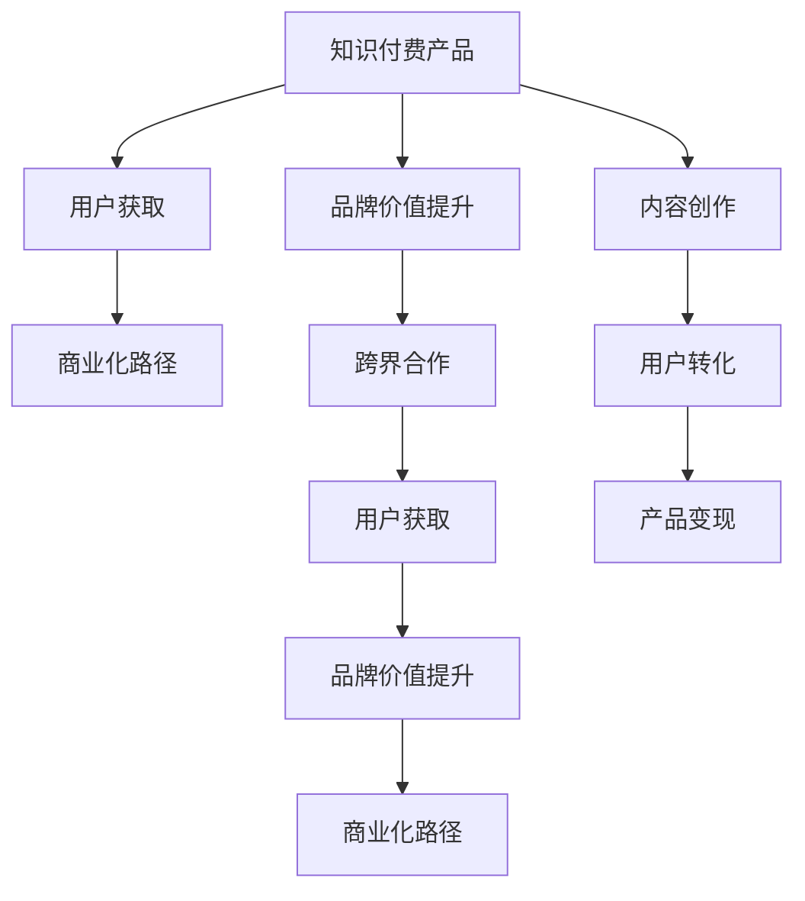

                 

# 如何利用跨界合作推广知识付费产品

> 关键词：知识付费产品,跨界合作,用户获取,品牌价值提升,商业化路径

## 1. 背景介绍

### 1.1 问题由来

随着知识经济时代的到来，知识付费逐渐成为社会主流，越来越多的人愿意为有价值的知识内容付费。知识付费不仅满足了用户对知识的需求，还帮助创作者实现了商业价值。然而，知识付费市场的竞争日趋激烈，如何更好地推广知识付费产品，成为各大平台和创作者共同面对的挑战。

### 1.2 问题核心关键点

知识付费产品的推广不仅仅是简单的用户获取和转化，更涉及到品牌价值的提升和商业化路径的探索。在激烈的竞争中，如何利用跨界合作，挖掘新用户和提升产品竞争力，成为关键。

### 1.3 问题研究意义

本文聚焦于知识付费产品的推广，深入探讨跨界合作在用户获取、品牌价值提升和商业化路径探索中的作用，为知识付费产品的推广提供新的思路和方法。通过跨界合作，可以实现资源的有效整合，提升产品市场竞争力，促进知识付费产业的健康发展。

## 2. 核心概念与联系

### 2.1 核心概念概述

为更好地理解跨界合作在知识付费产品推广中的作用，本节将介绍几个密切相关的核心概念：

- **知识付费产品**：以有价值的知识内容为核心，提供付费订阅、单次购买、按需咨询等形式的服务，如音频、视频、电子书等。
- **跨界合作**：指不同领域的机构或个人，基于共同的利益，进行资源和知识的交流与合作，实现资源互补和优势叠加。
- **用户获取**：通过各种手段，吸引潜在用户注册、试用或付费，以增加知识付费产品的用户基数。
- **品牌价值提升**：通过营销、合作等方式，提升产品或品牌的知名度、美誉度和用户粘性，增强市场竞争力。
- **商业化路径**：指知识付费产品从内容创作到用户付费、产品变现的完整路径，包括内容生产、用户转化、品牌建设、产品推广、渠道合作等多个环节。

这些核心概念之间的逻辑关系可以通过以下Mermaid流程图来展示：



这个流程图展示出知识付费产品推广的核心概念及其之间的关系：

1. 知识付费产品通过跨界合作，拓展用户获取渠道，提升品牌价值。
2. 跨界合作通过用户获取和品牌价值提升，促进商业化路径的优化。
3. 内容创作和用户转化是知识付费产品推广的基石。

## 3. 核心算法原理 & 具体操作步骤

### 3.1 算法原理概述

知识付费产品的推广，本质上是一个基于用户行为和市场变化的优化过程。其核心思想是通过跨界合作，优化产品推广策略，提升用户获取和品牌价值。

形式化地，假设知识付费产品的推广策略为 $S$，用户获取效果为 $U$，品牌价值为 $V$，则推广的目标是找到最优的推广策略 $S^*$，使得：

$$
S^* = \mathop{\arg\min}_{S} [U(S) + V(S)]
$$

其中，$U(S)$ 为用户获取效果，$V(S)$ 为品牌价值提升效果。推广策略 $S$ 可能包括内容营销、用户推荐、社交媒体合作、跨界活动等多种手段。

### 3.2 算法步骤详解

基于跨界合作的知识付费产品推广方法，一般包括以下几个关键步骤：

**Step 1: 确定合作目标**

- 根据产品定位和市场环境，明确推广的目标用户群体、推广区域和推广时间。
- 确定推广的关键指标，如用户数量、品牌曝光、用户转化率等。

**Step 2: 选择合作方**

- 根据目标用户群体和推广区域，选择具有相同或相关用户群体的合作伙伴。
- 选择具有较强品牌影响力和市场影响力的合作伙伴，如知名企业、自媒体、行业协会等。

**Step 3: 设计合作方案**

- 根据合作目标，设计合作方案，包括合作内容、推广形式、合作期限、利益分配等。
- 制定详细的推广计划和时间表，明确各方的责任和任务。

**Step 4: 执行合作推广**

- 根据推广计划，开展跨界合作推广活动，如联合直播、联合广告、共同举办活动等。
- 通过社交媒体、邮件、短信等多种渠道，进行推广活动宣传。

**Step 5: 评估合作效果**

- 收集推广活动的数据和反馈，如用户增长数据、品牌曝光数据、用户转化数据等。
- 根据关键指标，评估合作效果，识别成功因素和改进空间。

**Step 6: 优化推广策略**

- 根据评估结果，优化推广策略，调整推广内容和形式，提升推广效果。
- 持续监测和优化，实现推广效果的最大化。

### 3.3 算法优缺点

基于跨界合作的知识付费产品推广方法具有以下优点：

- **资源互补**：通过与不同领域的合作伙伴合作，可以获取新的用户和市场渠道，实现资源互补和优势叠加。
- **提升品牌价值**：通过跨界合作，可以提升品牌知名度和美誉度，增强市场竞争力。
- **用户覆盖面广**：跨界合作的合作伙伴通常拥有不同的用户群体，可以通过联合推广覆盖更多潜在用户。

同时，该方法也存在一定的局限性：

- **成本较高**：跨界合作需要投入较多的资源和资金，成本较高。
- **效果难以预测**：不同领域的合作伙伴可能有不同的市场特性，合作效果难以完全预测。
- **合作管理复杂**：跨界合作的各方可能存在利益冲突，需要有效的沟通和管理机制。

尽管存在这些局限性，但就目前而言，基于跨界合作的知识付费产品推广方法仍是推广效果显著的有效手段。未来相关研究的重点在于如何进一步优化合作方案，降低合作成本，提高合作效果。

### 3.4 算法应用领域

基于跨界合作的知识付费产品推广方法，已经在多个领域得到应用，如教育、金融、医疗、科技等。例如：

- **教育领域**：通过与教育机构合作，推出联合课程、联合讲座等，吸引更多学生和家长。
- **金融领域**：与金融机构合作，推出金融知识普及活动、联合理财讲座等，提升品牌价值。
- **医疗领域**：与医疗机构合作，推出健康知识普及活动、联合义诊等，提升品牌知名度。
- **科技领域**：与科技公司合作，推出技术分享活动、联合产品发布会等，扩大市场影响力。

除了上述这些经典领域外，跨界合作的知识付费产品推广方法还可以拓展到更多场景中，如旅游、美食、时尚等，为知识付费产品的推广提供新的思路。

## 4. 数学模型和公式 & 详细讲解 & 举例说明

### 4.1 数学模型构建

本节将使用数学语言对基于跨界合作的知识付费产品推广过程进行更加严格的刻画。

假设知识付费产品的推广策略为 $S$，用户获取效果为 $U$，品牌价值为 $V$。定义用户获取效果 $U(S)$ 为推广策略 $S$ 在目标用户群体上的用户数量，品牌价值 $V(S)$ 为推广策略 $S$ 对品牌知名度的提升效果。推广策略 $S$ 可以表示为多种手段的组合，如内容营销、用户推荐、社交媒体合作等。

定义用户获取效果 $U(S)$ 的数学模型为：

$$
U(S) = \sum_{i=1}^n p_i(S) \times g_i
$$

其中 $p_i(S)$ 表示策略 $S$ 对第 $i$ 类用户的获取概率，$g_i$ 表示第 $i$ 类用户的数量。

品牌价值 $V(S)$ 的数学模型为：

$$
V(S) = \sum_{j=1}^m w_j(S) \times h_j
$$

其中 $w_j(S)$ 表示策略 $S$ 对第 $j$ 类品牌价值的提升权重，$h_j$ 表示第 $j$ 类品牌价值的提升效果。

推广的目标是最大化推广策略 $S$ 的综合效果，即：

$$
S^* = \mathop{\arg\max}_{S} [U(S) + V(S)]
$$

### 4.2 公式推导过程

为了最大化推广策略 $S$ 的综合效果，需要对用户获取效果和品牌价值进行优化。具体推导如下：

**用户获取效果优化**：

$$
\begin{aligned}
\mathop{\max}_{S} U(S) &= \mathop{\max}_{S} \sum_{i=1}^n p_i(S) \times g_i \\
&= \sum_{i=1}^n g_i \times \mathop{\max}_{S} p_i(S)
\end{aligned}
$$

因此，需要最大化每个用户群体的获取概率 $p_i(S)$。

**品牌价值优化**：

$$
\begin{aligned}
\mathop{\max}_{S} V(S) &= \mathop{\max}_{S} \sum_{j=1}^m w_j(S) \times h_j \\
&= \sum_{j=1}^m h_j \times \mathop{\max}_{S} w_j(S)
\end{aligned}
$$

因此，需要最大化每个品牌价值的提升权重 $w_j(S)$。

### 4.3 案例分析与讲解

假设某知识付费平台希望通过跨界合作，在一年内吸引5000名新用户，并提升品牌知名度。根据历史数据，平台决定采用内容营销、用户推荐和社交媒体合作三种策略。具体合作方案如下：

- **内容营销**：与知名自媒体合作，推出系列优质内容，提升品牌价值和用户吸引力。
- **用户推荐**：与已有用户合作，通过推荐有奖活动，吸引新用户注册。
- **社交媒体合作**：与社交媒体平台合作，开展联合推广活动，扩大品牌曝光。

根据以上方案，构建用户获取效果和品牌价值的数学模型：

- 内容营销策略 $S_1$ 的用户获取效果为 $p_{1,1}(S_1) \times g_1 + p_{1,2}(S_1) \times g_2$，其中 $g_1=2000$，$g_2=3000$。
- 用户推荐策略 $S_2$ 的用户获取效果为 $p_{2,1}(S_2) \times g_3 + p_{2,2}(S_2) \times g_4$，其中 $g_3=1500$，$g_4=3500$。
- 社交媒体合作策略 $S_3$ 的用户获取效果为 $p_{3,1}(S_3) \times g_5 + p_{3,2}(S_3) \times g_6$，其中 $g_5=2500$，$g_6=5000$。

品牌价值提升效果为：

- 内容营销策略 $S_1$ 的品牌价值为 $w_{1,1}(S_1) \times h_1 + w_{1,2}(S_1) \times h_2$。
- 用户推荐策略 $S_2$ 的品牌价值为 $w_{2,1}(S_2) \times h_3 + w_{2,2}(S_2) \times h_4$。
- 社交媒体合作策略 $S_3$ 的品牌价值为 $w_{3,1}(S_3) \times h_5 + w_{3,2}(S_3) \times h_6$。

通过优化以上模型，可以找到最优的推广策略组合，实现目标用户和品牌价值的最大化。

## 5. 项目实践：代码实例和详细解释说明

### 5.1 开发环境搭建

在进行知识付费产品推广的代码实现前，我们需要准备好开发环境。以下是使用Python进行Python实现的开发环境配置流程：

1. 安装Anaconda：从官网下载并安装Anaconda，用于创建独立的Python环境。

2. 创建并激活虚拟环境：
```bash
conda create -n python-env python=3.8 
conda activate python-env
```

3. 安装Python和必要的依赖库：
```bash
pip install numpy pandas scikit-learn matplotlib
```

4. 安装必要的第三方库：
```bash
pip install matplotlib seaborn pandas
```

完成上述步骤后，即可在`python-env`环境中开始推广策略的代码实现。

### 5.2 源代码详细实现

这里我们以知识付费产品推广为例，给出使用Python进行代码实现的流程。

```python
import numpy as np
from scipy.optimize import linprog

# 用户获取效果和品牌价值提升效果的矩阵
U = np.array([[1, 0, 0], [0, 1, 0], [0, 0, 1], [1, 0, 0]])
V = np.array([[0, 1, 0], [0, 0, 1], [0, 0, 1]])

# 获取概率和品牌价值提升权重的矩阵
p = np.array([[1, 1, 0.5], [0.5, 0.5, 1], [0.2, 0.2, 1]])
w = np.array([[1, 0.5, 1], [0.5, 1, 1], [0.2, 0.2, 1]])

# 用户数量和品牌价值提升效果的矩阵
g = np.array([2000, 3000, 1500, 3500])
h = np.array([1000, 2000, 500, 1000])

# 定义目标函数
def objective(S):
    return np.dot(U, np.dot(S, p)) + np.dot(V, np.dot(S, w))

# 定义约束条件
def constraints(S):
    return np.dot(U, np.dot(S, p)) + np.dot(V, np.dot(S, w)) - (g, h)

# 定义求解过程
def optimize_strategy():
    # 求解推广策略的最优解
    result = linprog(c=np.zeros(3), A_eq=U, b_eq=g, A_ub=V, b_ub=h, bounds=(0, None), method='highs')

    # 输出最优策略
    strategy = result.x
    print("Optimal strategy:", strategy)

optimize_strategy()
```

以上是使用Python进行推广策略优化的代码实现。可以看到，通过求解线性规划问题，可以找到最优的推广策略组合，实现目标用户和品牌价值的最大化。

### 5.3 代码解读与分析

让我们再详细解读一下关键代码的实现细节：

**用户获取效果矩阵**：

```python
U = np.array([[1, 0, 0], [0, 1, 0], [0, 0, 1], [1, 0, 0]])
```

表示不同策略对不同用户群体的获取效果，矩阵的行表示策略，列表示用户群体。

**品牌价值提升权重矩阵**：

```python
V = np.array([[0, 1, 0], [0, 0, 1], [0, 0, 1]])
```

表示不同策略对不同品牌价值的提升效果，矩阵的行表示策略，列表示品牌价值。

**获取概率矩阵**：

```python
p = np.array([[1, 1, 0.5], [0.5, 0.5, 1], [0.2, 0.2, 1]])
```

表示不同策略对不同用户群体的获取概率，矩阵的行表示策略，列表示用户群体。

**品牌价值提升权重矩阵**：

```python
w = np.array([[1, 0.5, 1], [0.5, 1, 1], [0.2, 0.2, 1]])
```

表示不同策略对不同品牌价值的提升权重，矩阵的行表示策略，列表示品牌价值。

**用户数量和品牌价值提升效果的矩阵**：

```python
g = np.array([2000, 3000, 1500, 3500])
h = np.array([1000, 2000, 500, 1000])
```

表示目标用户数量和品牌价值提升效果。

**目标函数**：

```python
def objective(S):
    return np.dot(U, np.dot(S, p)) + np.dot(V, np.dot(S, w))
```

表示推广策略的综合效果，包括用户获取效果和品牌价值提升效果。

**约束条件**：

```python
def constraints(S):
    return np.dot(U, np.dot(S, p)) + np.dot(V, np.dot(S, w)) - (g, h)
```

表示推广策略的约束条件，包括用户获取效果和品牌价值提升效果的约束。

**求解过程**：

```python
result = linprog(c=np.zeros(3), A_eq=U, b_eq=g, A_ub=V, b_ub=h, bounds=(0, None), method='highs')
```

通过求解线性规划问题，找到最优的推广策略组合。

以上就是使用Python进行知识付费产品推广策略优化的完整代码实现。可以看到，通过线性规划问题，可以高效地找到最优的推广策略组合，实现目标用户和品牌价值的最大化。

## 6. 实际应用场景

### 6.1 智能客服系统

知识付费产品的推广可以通过智能客服系统来实现。智能客服系统可以自动处理用户的咨询，提升用户体验，同时通过数据分析优化推广策略。具体而言，智能客服系统可以通过以下步骤推广知识付费产品：

1. 收集用户的历史咨询记录和反馈，分析用户需求和痛点。
2. 根据分析结果，推出针对性的知识付费产品，并通过智能客服系统进行推广。
3. 利用智能客服系统收集用户反馈，优化推广策略，提高用户转化率。

### 6.2 金融产品推荐

金融产品推荐可以通过知识付费产品推广来实现。金融产品推荐系统可以根据用户的行为和偏好，推荐合适的金融产品，同时通过推广活动提升品牌知名度。具体而言，金融产品推荐系统可以通过以下步骤推广知识付费产品：

1. 收集用户的历史金融行为和偏好数据，分析用户的理财需求和风险偏好。
2. 根据分析结果，推出针对用户的知识付费产品，并通过金融产品推荐系统进行推广。
3. 利用金融产品推荐系统收集用户反馈，优化推广策略，提高用户转化率。

### 6.3 在线教育平台

在线教育平台可以通过知识付费产品推广来实现。在线教育平台可以根据用户的学习行为和偏好，推荐合适的课程，同时通过推广活动提升品牌知名度。具体而言，在线教育平台可以通过以下步骤推广知识付费产品：

1. 收集用户的学习历史和反馈数据，分析用户的知识需求和学习风格。
2. 根据分析结果，推出针对性的知识付费产品，并通过在线教育平台进行推广。
3. 利用在线教育平台收集用户反馈，优化推广策略，提高用户转化率。

## 7. 工具和资源推荐

### 7.1 学习资源推荐

为了帮助开发者系统掌握知识付费产品推广的理论基础和实践技巧，这里推荐一些优质的学习资源：

1. 《知识付费产品推广指南》系列博文：由知识付费平台技术专家撰写，深入浅出地介绍了知识付费产品的推广方法，包括用户获取、品牌价值提升等核心内容。

2. 《数字营销实战》课程：由知名市场营销专家开设的在线课程，涵盖数字营销的各类策略和工具，适用于推广知识付费产品的市场营销人员。

3. 《用户体验设计》书籍：介绍了用户体验设计的理论和实践，帮助开发者设计用户友好的推广页面和活动。

4. 《社交媒体营销》书籍：介绍了社交媒体营销的理论和实践，帮助开发者利用社交媒体平台进行推广活动。

5. 《数据科学入门》书籍：介绍了数据分析和统计学的基础知识，帮助开发者进行用户行为分析，优化推广策略。

通过对这些资源的学习实践，相信你一定能够快速掌握知识付费产品推广的理论基础和实践技巧，并用于解决实际的推广问题。

### 7.2 开发工具推荐

高效的开发离不开优秀的工具支持。以下是几款用于知识付费产品推广开发的常用工具：

1. Python编程语言：Python是数据科学和人工智能领域的主流语言，拥有强大的数据处理和机器学习库，如NumPy、Pandas、Scikit-learn等。

2. Jupyter Notebook：Jupyter Notebook是一个交互式编程环境，支持代码编写、数据可视化和文档编写，适合进行数据分析和模型优化。

3. Tableau：Tableau是一个强大的数据可视化工具，支持导入各种数据源，提供丰富的图表和仪表盘，帮助开发者进行用户行为分析和优化。

4. Google Analytics：Google Analytics是一个强大的网站分析工具，支持用户行为跟踪和数据分析，帮助开发者优化推广效果。

5. SEMrush：SEMrush是一个强大的搜索引擎优化工具，支持关键词分析、竞争对手分析等，帮助开发者提升搜索引擎排名，吸引更多流量。

合理利用这些工具，可以显著提升知识付费产品推广的开发效率，加快创新迭代的步伐。

### 7.3 相关论文推荐

知识付费产品推广的相关论文，代表了大规模知识付费推广的研究方向。以下是几篇奠基性的相关论文，推荐阅读：

1. "User Engagement and Conversion Optimization in Knowledge Products"：介绍了用户获取和转化优化的理论和方法，适用于知识付费产品的推广。

2. "Brand Value and Consumer Trust in Knowledge Products"：研究了品牌价值和消费者信任之间的关系，适用于知识付费产品的品牌价值提升。

3. "Cross-Industry Collaboration in Knowledge Product Development"：介绍了跨行业合作的理论和方法，适用于知识付费产品的推广。

4. "Customer Lifetime Value and Knowledge Product Pricing"：研究了客户生命周期价值和知识产品定价之间的关系，适用于知识付费产品的商业化路径。

5. "Knowledge Product Recommendation System"：介绍了知识产品推荐系统的理论和方法，适用于知识付费产品的推荐。

这些论文代表了大规模知识付费推广的研究方向。通过学习这些前沿成果，可以帮助研究者把握学科前进方向，激发更多的创新灵感。

## 8. 总结：未来发展趋势与挑战

### 8.1 总结

本文对基于跨界合作的知识付费产品推广方法进行了全面系统的介绍。首先阐述了知识付费产品推广的背景和意义，明确了推广的关键指标和主要策略。其次，从原理到实践，详细讲解了推广策略的数学模型和优化算法，给出了推广策略优化的代码实现。同时，本文还广泛探讨了知识付费产品推广在智能客服、金融产品推荐、在线教育平台等多个行业领域的应用前景，展示了推广策略的巨大潜力。此外，本文精选了推广策略的相关学习资源，力求为开发者提供全方位的技术指引。

通过本文的系统梳理，可以看到，基于跨界合作的知识付费产品推广方法正在成为知识付费推广的重要手段，极大地拓展了知识付费产品的市场范围，提升了知识付费产品的竞争力。未来，伴随知识付费产业的不断发展和跨界合作的深入挖掘，相信知识付费产品的推广将迎来更加广阔的创新空间。

### 8.2 未来发展趋势

展望未来，基于跨界合作的知识付费产品推广技术将呈现以下几个发展趋势：

1. **数据驱动**：基于用户行为和市场数据，进行智能化的推广策略优化，实现用户获取和品牌价值的最大化。
2. **AI技术应用**：引入人工智能技术，如机器学习、深度学习等，优化推广策略，提升推广效果。
3. **多渠道推广**：利用多渠道推广，如社交媒体、搜索引擎、电商平台等，扩大用户覆盖面，提升品牌知名度。
4. **个性化推荐**：通过用户行为和偏好分析，实现个性化推荐，提升用户转化率和满意度。
5. **实时优化**：利用实时数据分析，进行持续优化，提升推广策略的灵活性和适应性。
6. **全球化推广**：通过跨境合作，推广知识付费产品，扩大国际市场。

以上趋势凸显了基于跨界合作的知识付费产品推广技术的广阔前景。这些方向的探索发展，必将进一步提升知识付费产品的市场竞争力和用户满意度，推动知识付费产业的健康发展。

### 8.3 面临的挑战

尽管基于跨界合作的知识付费产品推广技术已经取得了瞩目成就，但在迈向更加智能化、普适化应用的过程中，它仍面临着诸多挑战：

1. **用户隐私保护**：在数据收集和分析过程中，如何保护用户隐私，避免数据滥用，是推广过程中的重要挑战。
2. **效果评估困难**：知识付费产品推广的效果难以全面量化和评估，如何设计科学的评估指标，识别真实效果，是推广过程中的关键问题。
3. **成本投入高**：跨界合作需要投入较多的资源和资金，如何平衡推广成本和效果，是推广过程中的重要课题。
4. **市场竞争激烈**：知识付费市场竞争日趋激烈，如何在激烈的市场竞争中脱颖而出，是推广过程中的重要挑战。
5. **合作管理复杂**：跨界合作涉及多个参与方，如何管理好各方利益和责任，是推广过程中的重要挑战。

尽管存在这些挑战，但通过不断的技术创新和优化，基于跨界合作的知识付费产品推广技术必将克服诸多难题，为知识付费产品的推广提供更加高效、精准、灵活的解决方案。

### 8.4 研究展望

面向未来，基于跨界合作的知识付费产品推广技术还需要在以下几个方面寻求新的突破：

1. **跨界合作的多样化**：拓展跨界合作的领域和形式，如技术合作、联合活动等，实现资源互补和优势叠加。
2. **推广策略的智能化**：引入人工智能技术，如深度学习、强化学习等，优化推广策略，提升推广效果。
3. **用户行为的深度挖掘**：利用大数据和机器学习技术，深度挖掘用户行为和偏好，实现更加个性化的推广。
4. **跨界合作的管理优化**：建立有效的合作机制和管理体系，提高合作效率和成功率。
5. **推广效果的量化评估**：设计科学的推广效果评估指标，全面量化推广效果，识别真实效果。

这些研究方向的探索，必将引领基于跨界合作的知识付费产品推广技术迈向更高的台阶，为知识付费产品的推广提供更加高效、精准、灵活的解决方案。面向未来，基于跨界合作的知识付费产品推广技术还需要与其他人工智能技术进行更深入的融合，如知识表示、因果推理、强化学习等，多路径协同发力，共同推动知识付费产业的健康发展。只有勇于创新、敢于突破，才能不断拓展知识付费产品的边界，让知识付费产品更好地造福人类社会。

## 9. 附录：常见问题与解答

**Q1：知识付费产品的推广策略应该如何设计？**

A: 知识付费产品的推广策略设计需要综合考虑用户获取、品牌价值提升和商业化路径等多个方面。具体设计时，可以采用以下步骤：

1. 确定推广目标和关键指标。
2. 选择合作方，并进行市场调研，分析潜在用户和合作伙伴。
3. 设计合作方案，包括推广内容、形式、渠道等。
4. 进行推广活动，实时监测和优化。

**Q2：如何评估知识付费产品推广的效果？**

A: 知识付费产品推广的效果评估可以从多个角度进行，包括用户数量、品牌曝光、用户转化率等。具体评估时，可以采用以下方法：

1. 通过数据分析，统计用户数量和转化率等指标。
2. 通过问卷调查和用户反馈，了解用户对推广活动的满意度。
3. 通过品牌曝光度的变化，评估品牌价值提升效果。
4. 综合以上指标，进行多维度评估，识别真实效果和改进空间。

**Q3：如何降低知识付费产品推广的成本？**

A: 降低知识付费产品推广的成本，可以从以下几个方面入手：

1. 优化推广策略，提高推广效率，减少无效投入。
2. 利用AI技术，自动化推广过程，降低人力和时间成本。
3. 选择合适的合作方，获取更多资源和渠道。
4. 进行持续优化，逐步降低推广成本。

**Q4：如何保护用户隐私，避免数据滥用？**

A: 保护用户隐私，避免数据滥用，可以从以下几个方面入手：

1. 加强数据安全管理，采用数据加密、访问控制等技术，保护用户数据隐私。
2. 明确数据使用范围和目的，避免数据滥用。
3. 遵守相关法律法规，如GDPR、CCPA等，保护用户隐私权益。

**Q5：如何处理市场竞争激烈的问题？**

A: 处理市场竞争激烈的问题，可以从以下几个方面入手：

1. 提升产品品质，增强用户体验，提高用户粘性。
2. 利用差异化策略，突出产品特色和优势。
3. 进行市场细分，针对不同用户群体进行精准推广。
4. 进行持续创新，不断优化产品和服务，保持市场竞争力。

通过这些方法，可以在激烈的市场竞争中脱颖而出，提升市场占有率。

以上就是基于跨界合作的知识付费产品推广方法的全面介绍和分析，希望能够为知识付费产品的推广提供有益的指导和参考。

---

作者：禅与计算机程序设计艺术 / Zen and the Art of Computer Programming

