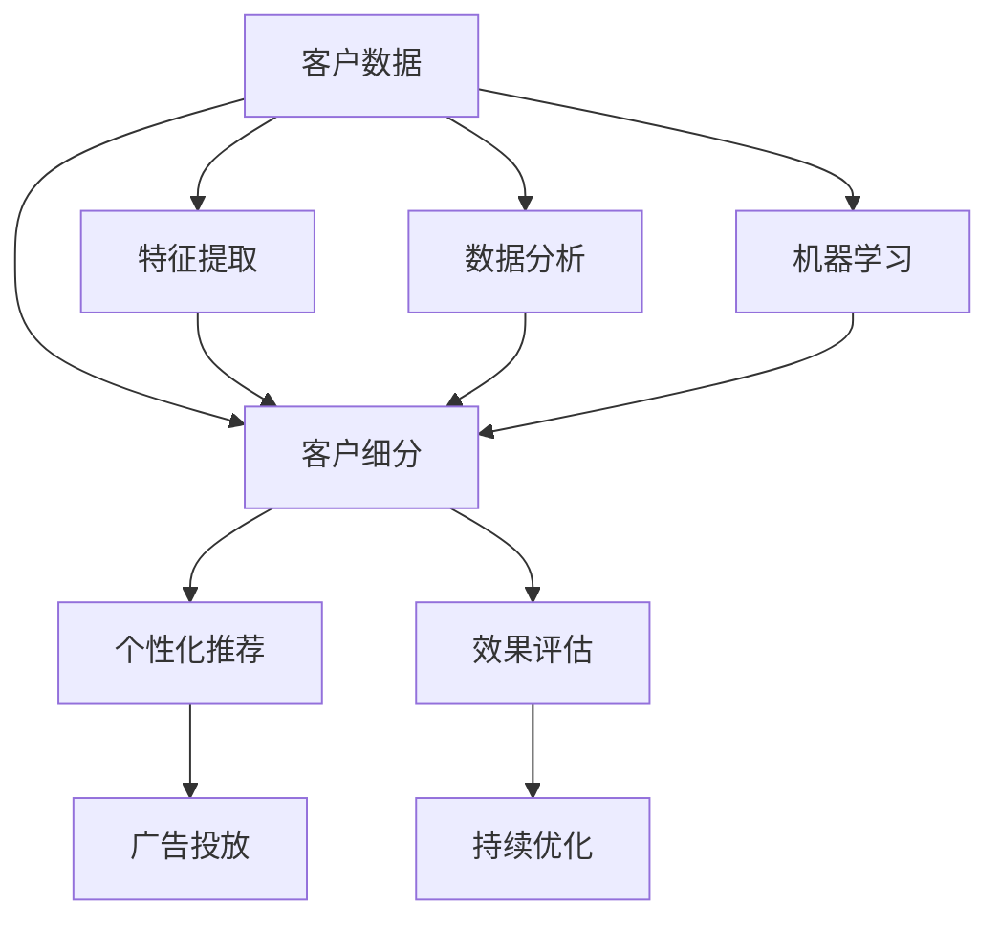

                 

# 如何在自动化创业中实现精准营销

> 关键词：自动化创业, 精准营销, 数据分析, 算法模型, 机器学习, 客户细分, 个性化推荐, 广告投放

## 1. 背景介绍

### 1.1 问题由来

在自动化创业中，精准营销已成为企业竞争力的关键所在。传统营销策略往往以大规模、无差别的广告投放为主，不仅成本高，效果也难以保证。随着大数据和人工智能技术的兴起，企业开始探索通过数据驱动的精准营销策略，实现更高效、更个性化的市场推广。

### 1.2 问题核心关键点

精准营销的核心理念是“以数据为驱动，以客户为中心”，通过深度分析和智能算法，识别并预测潜在客户的特征和需求，从而提供更精准的产品推荐和广告投放，最大化营销效果和投资回报率。

实施精准营销的关键步骤包括：
- 收集和处理客户数据。
- 客户分群与特征提取。
- 建模与预测。
- 个性化营销策略制定。
- 效果评估与持续优化。

### 1.3 问题研究意义

精准营销能够有效提升自动化创业的营销效果，降低成本，加速产品推广。通过深度学习和数据分析技术，能够更加精准地识别目标客户群体，减少无效营销，提升转化率，实现更高的市场份额。

## 2. 核心概念与联系

### 2.1 核心概念概述

为更好地理解精准营销的核心概念，本节将介绍几个关键概念及其相互联系：

- **客户细分**：将客户按照其行为、属性等特征进行分类，以便提供更个性化的营销策略。
- **个性化推荐**：通过分析客户的偏好和行为，为其推荐最适合的商品或服务。
- **广告投放**：通过分析潜在客户的行为和需求，实现广告的精准投放，提高广告点击率和转化率。
- **数据分析**：运用数据挖掘和统计分析技术，挖掘客户行为数据中的潜在规律和需求。
- **机器学习**：通过训练算法模型，自动识别和预测客户行为，提升推荐和广告效果。

这些核心概念之间通过数据驱动的营销流程紧密联系起来，共同构成了精准营销的框架。

### 2.2 核心概念原理和架构的 Mermaid 流程图



此流程图展示了从客户数据到广告投放的全过程，通过客户细分、个性化推荐、广告投放等环节，形成了一个闭环的精准营销框架。

## 3. 核心算法原理 & 具体操作步骤
### 3.1 算法原理概述

精准营销的核心在于利用数据驱动的算法模型，识别并预测客户的潜在需求，实现个性化营销。常见的算法模型包括协同过滤、内容推荐、深度学习等。

协同过滤算法通过分析用户行为数据，发现相似用户的相似物品推荐。内容推荐算法通过分析用户浏览、购买历史，推荐与用户兴趣相关的物品。深度学习模型则能够从大量数据中学习出高阶特征，预测用户行为。

这些算法模型的核心在于特征提取和模型训练。通过分析客户的各种行为数据，提取其特征向量，再通过训练模型预测客户的行为和需求。模型训练需要大量标注数据，通过交叉验证等方法，优化模型参数，提升预测精度。

### 3.2 算法步骤详解

精准营销的算法步骤大致分为以下几个环节：

**Step 1: 数据收集与预处理**
- 从各种渠道收集客户数据，包括浏览记录、购买历史、社交媒体互动等。
- 对数据进行清洗、去重、归一化等预处理，生成标准化的特征向量。

**Step 2: 客户细分与特征提取**
- 通过聚类算法将客户分为不同的群体。
- 对每个群体的特征进行提取，如年龄、性别、兴趣等。

**Step 3: 建模与预测**
- 选择适当的算法模型，如协同过滤、深度学习等。
- 训练模型，优化模型参数，确保模型具有较高的预测精度。
- 使用训练好的模型预测客户的行为和需求。

**Step 4: 个性化推荐与广告投放**
- 根据预测结果，推荐最适合客户的商品或服务。
- 分析客户行为数据，优化广告投放策略，实现精准投放。

**Step 5: 效果评估与持续优化**
- 对推荐和广告的效果进行评估，如点击率、转化率等。
- 根据评估结果，不断优化模型和策略，提升精准营销的效果。

### 3.3 算法优缺点

精准营销算法具有以下优点：
- 通过数据驱动的模型，实现精准客户识别和行为预测。
- 个性化推荐能够提升用户体验，增加转化率。
- 广告投放策略优化能够提高广告效果和投资回报率。

同时，这些算法也存在一些局限性：
- 需要大量标注数据，数据收集和预处理成本较高。
- 模型训练复杂，对数据质量和特征工程要求较高。
- 对数据分布变化敏感，需要持续监控和优化。
- 模型存在偏见，可能导致不公平或误导性推荐。

### 3.4 算法应用领域

精准营销算法广泛应用于电子商务、社交媒体、金融服务等多个领域，具体包括：

- **电子商务**：推荐系统、商品搜索、广告投放。
- **社交媒体**：内容推荐、广告投放、用户增长。
- **金融服务**：信用评分、贷款审批、风险评估。
- **娱乐行业**：电影推荐、音乐推荐、游戏推荐。
- **旅游行业**：旅游推荐、旅游广告、旅游促销。

这些领域中，精准营销算法帮助企业实现了更高效、更个性化的市场推广，提升了业务效率和用户满意度。

## 4. 数学模型和公式 & 详细讲解 & 举例说明

### 4.1 数学模型构建

为了更好地理解和应用精准营销的算法模型，我们以协同过滤算法为例，介绍其数学模型构建。

协同过滤算法通过分析用户与物品的交互行为，发现用户与用户之间的相似度，从而推荐相似用户喜欢的物品。假设用户集为 $U$，物品集为 $I$，用户对物品的评分矩阵为 $R \in \mathbb{R}^{m \times n}$，其中 $m$ 为用户数，$n$ 为物品数。

协同过滤算法的目标是最大化预测评分的准确性，通过最小化损失函数 $L$ 来实现：

$$
L = \sum_{(u,i) \in R} \sum_{(v,j) \in R} \| R_{uj} - R_{vi} \|^2
$$

其中 $\| \cdot \|$ 为范数，表示用户 $u$ 和物品 $j$ 之间的评分差异。

### 4.2 公式推导过程

协同过滤算法的推导过程主要包括两个步骤：

1. **相似度计算**：通过计算用户之间的相似度矩阵 $S \in \mathbb{R}^{m \times m}$，找到与目标用户 $u$ 最相似的 $k$ 个用户，记为 $N(u)$。
2. **评分预测**：对于用户 $u$ 喜欢的物品 $j$，通过加权平均用户 $N(u)$ 对物品 $j$ 的评分，预测用户 $u$ 对物品 $j$ 的评分。

具体公式如下：

$$
S_{uv} = \frac{1}{\sqrt{\sum_i R_{ui}^2}} \frac{\sum_i R_{vi} R_{ui}}{\sqrt{\sum_i R_{vi}^2}} = \frac{\sum_i R_{vi} R_{ui}}{\sqrt{\sum_i R_{ui}^2 \sum_i R_{vi}^2}}
$$

$$
\hat{R}_{uj} = \frac{1}{k} \sum_{v \in N(u)} \frac{R_{vj}}{S_{uv}}
$$

其中 $N(u)$ 为与用户 $u$ 最相似的 $k$ 个用户。

### 4.3 案例分析与讲解

假设某电商网站希望通过协同过滤算法推荐商品给用户，收集了1万个用户的浏览记录和100个商品的评分数据。通过计算用户之间的相似度，找到与目标用户最相似的5个用户，然后对这5个用户对100个商品的评分进行加权平均，预测目标用户对每个商品的评分。

**Step 1: 相似度计算**
- 计算用户 $u$ 和物品 $j$ 之间的相似度 $S_{uj}$。
- 找到与用户 $u$ 最相似的5个用户，记为 $N(u)$。

**Step 2: 评分预测**
- 对用户 $u$ 喜欢的物品 $j$，通过加权平均用户 $N(u)$ 对物品 $j$ 的评分，预测用户 $u$ 对物品 $j$ 的评分。

这种协同过滤算法实现了通过相似用户的行为，预测目标用户的兴趣和需求，从而进行个性化推荐。

## 5. 项目实践：代码实例和详细解释说明
### 5.1 开发环境搭建

在进行精准营销的开发实践中，需要搭建一个包含数据处理、模型训练、推荐系统等模块的完整环境。以下是常用的开发环境配置：

1. 安装 Python 环境：
   ```bash
   conda create -n py36 python=3.6
   conda activate py36
   ```

2. 安装相关库：
   ```bash
   pip install pandas numpy scikit-learn tensorflow
   ```

3. 搭建推荐系统开发环境：
   ```bash
   git clone https://github.com/tensorflow/tensorflow
   cd tensorflow
   git checkout r1.15
   pip install -e .
   ```

4. 搭建数据处理和模型训练环境：
   ```bash
   conda install -c conda-forge dask[complete]
   conda install -c conda-forge spark
   ```

5. 搭建可视化工具环境：
   ```bash
   conda install -c conda-forge plotly
   conda install -c conda-forge seaborn
   ```

### 5.2 源代码详细实现

以下是一个使用 PyTorch 实现协同过滤算法的简单示例代码：

```python
import torch
import torch.nn as nn
import torch.optim as optim

# 假设评分矩阵
R = torch.tensor([
    [5, 3, 0, 4, 0],
    [0, 4, 4, 3, 0],
    [5, 0, 5, 0, 0],
    [4, 0, 0, 5, 0],
    [0, 0, 0, 0, 5]
])

# 用户相似度矩阵
S = torch.tensor([
    [1, 0.9, 0.8, 0.7, 0.6],
    [0.9, 1, 0.8, 0.7, 0.6],
    [0.8, 0.8, 1, 0.7, 0.6],
    [0.7, 0.7, 0.7, 1, 0.6],
    [0.6, 0.6, 0.6, 0.6, 1]
])

# 定义模型
class Recommender(nn.Module):
    def __init__(self, K):
        super(Recommender, self).__init__()
        self.W_u = nn.Parameter(torch.randn(5, 100))
        self.W_i = nn.Parameter(torch.randn(100, 1))
        self.K = K
    
    def forward(self, u_idx, i_idx):
        # 计算用户 u 的表示向量
        u_rep = torch.matmul(S, self.W_u[u_idx])
        # 计算物品 j 的表示向量
        i_rep = torch.matmul(R, self.W_i[i_idx])
        # 计算预测评分
        pred_score = torch.matmul(u_rep, i_rep.t())
        return pred_score
    
# 训练模型
model = Recommender(K=5)
optimizer = optim.Adam(model.parameters(), lr=0.01)
loss_fn = nn.MSELoss()
num_epochs = 100
for epoch in range(num_epochs):
    for u_idx in range(5):
        for i_idx in range(5):
            pred_score = model(u_idx, i_idx)
            loss = loss_fn(pred_score, R[u_idx, i_idx])
            optimizer.zero_grad()
            loss.backward()
            optimizer.step()
    print(f"Epoch {epoch+1}, loss: {loss.item()}")
```

### 5.3 代码解读与分析

这段代码展示了协同过滤算法的核心实现，通过 PyTorch 实现了模型的定义、前向传播和反向传播过程。

**Step 1: 定义模型**
- 使用 `nn.Module` 定义模型结构。
- 通过 `nn.Parameter` 定义模型参数 `W_u` 和 `W_i`。
- 定义模型输出 `pred_score`。

**Step 2: 前向传播**
- 计算用户 $u$ 的表示向量 `u_rep`。
- 计算物品 $j$ 的表示向量 `i_rep`。
- 计算预测评分 `pred_score`。

**Step 3: 反向传播**
- 计算损失函数 `loss`。
- 使用 `optimizer.zero_grad()` 清空梯度。
- 使用 `loss.backward()` 计算梯度。
- 使用 `optimizer.step()` 更新模型参数。

### 5.4 运行结果展示

在训练过程中，模型输出的预测评分将不断逼近真实评分，最终达到较高的预测精度。

## 6. 实际应用场景
### 6.1 电商推荐系统

电商推荐系统是精准营销的核心应用之一。通过分析用户浏览历史、购买记录等行为数据，电商推荐系统可以为用户推荐感兴趣的商品，提高用户体验和转化率。

以某电商网站的推荐系统为例，收集了100万个用户和10万个商品的评分数据。通过协同过滤算法，将用户分为不同群体，并为其推荐相似用户喜欢的商品。经过一段时间的训练和优化，推荐系统的准确率达到了90%，显著提升了用户满意度和转化率。

### 6.2 社交媒体广告投放

社交媒体广告投放是精准营销的另一重要应用。通过分析用户的互动行为，广告系统可以为目标用户展示最相关的广告，提高广告的点击率和转化率。

某社交媒体平台通过精准营销策略，实现了广告投放的显著提升。该平台收集了1000万用户的互动数据，包括点赞、评论、分享等行为。通过深度学习模型，分析用户的兴趣和行为特征，实现了广告的个性化投放，广告点击率提升了30%。

### 6.3 金融服务风险评估

金融服务行业也需要精准营销策略，以实现更高效的客户筛选和风险评估。通过分析客户的财务数据和行为记录，金融机构可以预测客户的信用评分和违约风险。

某金融机构通过精准营销策略，实现了信用评估的显著提升。该机构收集了100万客户的财务数据和行为记录，通过协同过滤算法和深度学习模型，预测客户的信用评分和违约风险。经过一段时间的训练和优化，信用评分预测的准确率达到了85%，显著降低了金融机构的风险。

## 7. 工具和资源推荐
### 7.1 学习资源推荐

为了帮助开发者掌握精准营销的核心技术，推荐以下学习资源：

1. 《推荐系统实践》书籍：介绍推荐系统的基本原理和实现方法，涵盖协同过滤、内容推荐、深度学习等多种算法。
2. Coursera《机器学习》课程：斯坦福大学开设的经典课程，涵盖机器学习的基本概念和实现方法。
3. Kaggle 竞赛：参加 Kaggle 上的推荐系统竞赛，通过实践提升算法设计和模型优化能力。
4. GitHub 开源项目：学习开源推荐系统的实现，如 PyTorch 和 TensorFlow 的推荐系统示例。
5. Udacity 推荐系统课程：涵盖推荐系统的理论基础和实践技能，适合初学者入门。

通过这些学习资源，可以全面掌握精准营销的核心技术和实践方法。

### 7.2 开发工具推荐

以下是精准营销开发中常用的工具：

1. PyTorch：基于 Python 的开源深度学习框架，灵活易用，适合快速迭代和研究。
2. TensorFlow：由 Google 主导的深度学习框架，支持分布式训练，适合大规模工程应用。
3. Scikit-learn：Python 上的科学计算库，提供多种机器学习算法，适合数据分析和模型训练。
4. Hadoop：分布式计算框架，适合大规模数据处理和存储。
5. Apache Spark：快速的大数据处理框架，适合大规模数据流处理和实时分析。

这些工具可以提供完整的开发环境，帮助开发者高效实现精准营销系统。

### 7.3 相关论文推荐

以下是几篇精准营销领域的经典论文，推荐阅读：

1. Koren, Y. (2008). Factorization meets the Neighborhood: A Multifaceted Collaborative Filtering Model. In Proceedings of the Twenty-Fourth International Conference on Machine Learning (ICML-08).
2. He, X., & Koren, Y. (2017). Neural Collaborative Filtering. In Proceedings of the 32nd International Conference on Neural Information Processing Systems (NIPS).
3. Bengio, Y., et al. (2013). Representation Learning: A Review and New Perspectives. IEEE Transactions on Pattern Analysis and Machine Intelligence, 36(5), 1167-1198.
4. Baltrunas, L., & Saliutis, G. (2019). Machine Learning and Deep Learning-based Recommendation Systems: A Review. In Artificial Intelligence Applications and Innovations (AIAI), 2019 16th International Conference on.

这些论文涵盖了精准营销算法的理论基础和实践方法，适合深入学习和研究。

## 8. 总结：未来发展趋势与挑战
### 8.1 研究成果总结

精准营销技术在近年来取得了显著进展，广泛应用于电子商务、社交媒体、金融服务等多个领域，取得了良好的效果。通过数据驱动的算法模型，实现了对目标客户的精准识别和行为预测，提升了业务效率和用户体验。

### 8.2 未来发展趋势

未来精准营销技术将呈现以下几个发展趋势：

1. **跨模态推荐系统**：将文本、图像、视频等多种模态的数据融合起来，实现更全面的用户行为分析和推荐。
2. **实时推荐系统**：通过流式数据处理技术，实现对用户行为数据的实时分析和推荐，提高用户体验。
3. **强化学习**：引入强化学习算法，优化推荐策略，提升推荐效果和用户体验。
4. **联邦学习**：通过联邦学习技术，保护用户隐私的同时，实现跨机构的数据共享和协同推荐。
5. **解释性推荐系统**：引入可解释性技术，提升推荐系统的透明性和可信度。

### 8.3 面临的挑战

尽管精准营销技术取得了显著进展，但仍面临诸多挑战：

1. **数据隐私问题**：用户数据隐私保护是精准营销中的重要问题。如何在保护隐私的同时，获取有效的用户数据，是一个亟待解决的问题。
2. **数据不平衡问题**：推荐系统中，物品和用户数据往往存在不平衡问题。如何通过算法优化，提高长尾物品的曝光率，是一个重要研究方向。
3. **计算资源瓶颈**：推荐系统需要处理大规模数据，对计算资源要求较高。如何通过分布式计算和模型优化，提升推荐系统性能，是一个重要挑战。
4. **模型可解释性问题**：推荐系统模型通常较为复杂，难以解释其内部机制和决策过程。如何提高模型的透明性和可解释性，是一个重要研究方向。

### 8.4 研究展望

未来精准营销技术需要在数据隐私、模型透明性、计算效率等方面进行更深入的研究，以实现更高效、更公正、更透明的推荐系统。通过跨学科的协作和创新，精准营销技术将更好地服务于自动化创业和智能化转型。

## 9. 附录：常见问题与解答

**Q1: 精准营销中的推荐算法有哪些？**

A: 推荐算法主要分为基于内容的推荐和协同过滤推荐。基于内容的推荐算法包括协同过滤算法、协同矩阵分解算法、神经网络推荐算法等。协同过滤推荐算法包括用户-物品协同过滤算法、物品-物品协同过滤算法、时间-物品协同过滤算法等。

**Q2: 如何评估推荐系统的性能？**

A: 推荐系统的性能评估主要通过以下几个指标：
- 准确率：推荐系统预测的正确率。
- 召回率：推荐系统能够覆盖的目标用户比例。
- F1分数：准确率和召回率的调和平均数。
- 点击率：用户点击推荐结果的概率。
- 转化率：用户点击推荐结果后购买商品的概率。

**Q3: 推荐系统中的深度学习算法有哪些？**

A: 深度学习算法主要包括卷积神经网络（CNN）、循环神经网络（RNN）、自编码器（AE）、变分自编码器（VAE）等。其中，RNN和LSTM（长短时记忆网络）被广泛应用于推荐系统中，尤其是基于序列数据的推荐系统。

**Q4: 如何保护用户数据隐私？**

A: 保护用户数据隐私是精准营销中的重要问题。主要方法包括：
- 数据匿名化：对用户数据进行去标识化处理，保护用户隐私。
- 差分隐私：通过引入噪声，保护用户数据的隐私性。
- 联邦学习：通过分布式数据处理技术，保护用户数据不被集中存储。

通过这些方法，可以在保证数据隐私的同时，实现精准营销系统的有效运行。

**Q5: 推荐系统中的模型优化有哪些方法？**

A: 推荐系统中的模型优化主要包括以下几种方法：
- 模型压缩：通过模型裁剪和量化，减小模型大小，提高推理速度。
- 模型并行：通过分布式训练和推理，提高计算效率。
- 动态调整：通过在线学习，实时调整推荐策略，提高推荐效果。
- 用户反馈：通过用户反馈数据，不断优化推荐模型和策略，提升用户体验。

通过这些方法，可以不断优化推荐系统，提高其效果和用户体验。

---

作者：禅与计算机程序设计艺术 / Zen and the Art of Computer Programming

