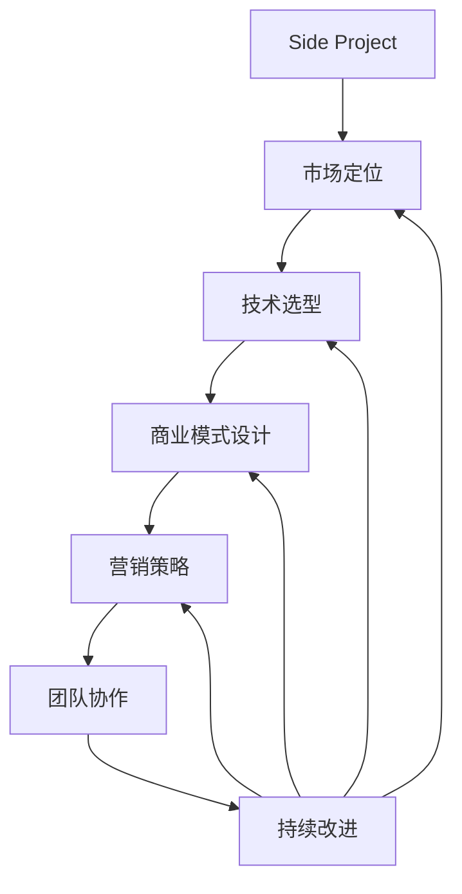

                 

## 1. 背景介绍

### 1.1 问题由来

对于许多开发者来说，一个有趣的Side Project可能会在其职业生涯中扮演重要角色。这些项目不仅提供了个人成就感和对技术的深入理解，还常常是探索新想法、验证创意的平台。然而，如何将这些Side Project转化为可持续的主要收入来源，是许多开发者面临的挑战。本文旨在探讨如何将Side Project成功转型，并从中获得稳定收入。

### 1.2 问题核心关键点

成功的Side Project转型涉及多个关键点，包括但不限于：

- **市场定位**：明确目标用户群体和市场需求。
- **技术选型**：选择合适的技术栈和工具。
- **商业模式**：设计合理的盈利模式和商业模式。
- **营销策略**：有效的市场推广和品牌建设。
- **团队协作**：组建高效、灵活的开发团队。
- **持续改进**：定期评估和优化产品。

本文将从这些关键点出发，提供系统的指导和实际案例分析，帮助开发者将Side Project成功转型为主要收入来源。

## 2. 核心概念与联系

### 2.1 核心概念概述

为了更好地理解Side Project转型的过程，我们首先需要明确几个关键概念：

- **Side Project**：通常指开发者在业余时间开发的项目，旨在探索新想法、学习新技术或出于个人兴趣。
- **商业化**：将项目从个人兴趣或爱好转变为盈利性业务的过程。
- **持续运营**：确保项目长期稳定运营，不断迭代和优化。
- **市场细分**：根据市场需求，将目标用户细分为更具体的群体，以便提供更精准的解决方案。

这些概念之间存在密切联系，共同构成了一个从兴趣驱动的Side Project到可持续商业模式的过程。

### 2.2 核心概念原理和架构的 Mermaid 流程图



该图展示了Side Project转型的主要流程和关键环节。

## 3. 核心算法原理 & 具体操作步骤

### 3.1 算法原理概述

Side Project转型主要遵循以下步骤：

1. **市场调研**：了解目标市场和用户需求。
2. **商业策划**：基于市场调研结果，设计商业模式。
3. **产品规划**：明确产品功能和技术栈。
4. **原型开发**：构建最小可行产品(MVP)。
5. **用户反馈**：收集用户反馈并迭代改进。
6. **市场推广**：通过营销策略扩大用户基础。
7. **商业模式验证**：验证盈利模式，实现商业化。

### 3.2 算法步骤详解

#### 3.2.1 市场调研

- **目标用户分析**：使用问卷调查、用户访谈等方式，收集潜在用户的需求和痛点。
- **竞争对手分析**：分析竞争对手的产品、市场策略和用户反馈，找出差距和机会。
- **市场需求预测**：通过市场数据和趋势分析，预测目标市场的大小和增长潜力。

#### 3.2.2 商业策划

- **商业模式设计**：确定盈利模式，如广告、订阅、SaaS等，并评估其可行性。
- **市场定位**：确定产品定位和目标市场细分，确保产品满足特定需求。
- **定价策略**：根据产品价值和市场需求，制定合理的定价策略。

#### 3.2.3 产品规划

- **功能需求定义**：基于用户需求和市场定位，定义产品的核心功能和附加功能。
- **技术选型**：选择适合的技术栈和开发工具，确保产品的可扩展性和可维护性。
- **原型设计**：设计MVP，明确最小功能集，快速验证产品概念。

#### 3.2.4 原型开发

- **需求分析**：与产品经理、用户体验设计师合作，明确需求和设计细节。
- **开发实现**：使用敏捷开发方法，快速迭代原型。
- **用户测试**：邀请目标用户测试原型，收集反馈并改进产品。

#### 3.2.5 用户反馈

- **用户反馈收集**：通过问卷调查、用户访谈等方式，收集用户对产品的反馈。
- **问题分析**：分析用户反馈，找出共性问题和改进点。
- **产品迭代**：根据反馈进行产品迭代和优化，确保产品符合用户需求。

#### 3.2.6 市场推广

- **营销渠道选择**：根据目标用户群体，选择合适的营销渠道，如社交媒体、搜索引擎、内容营销等。
- **品牌建设**：通过品牌定位、价值主张等方式，提升品牌知名度和美誉度。
- **用户获取**：通过付费广告、内容推广等方式，吸引潜在用户。

#### 3.2.7 商业模式验证

- **收入验证**：通过实际销售和用户反馈，验证商业模式是否可行。
- **成本控制**：优化运营成本，确保盈利。
- **持续改进**：根据市场反馈，不断优化产品和服务。

### 3.3 算法优缺点

#### 3.3.1 优点

- **利用现有技术**：开发者可以利用已有技能和资源，快速推进项目。
- **降低风险**：MVP策略可以帮助开发者验证市场和产品概念，降低失败风险。
- **灵活调整**：敏捷开发方法允许快速迭代和调整产品策略。

#### 3.3.2 缺点

- **资源限制**：Side Project转型初期可能面临资源限制，需要额外投资。
- **市场竞争**：进入成熟市场可能面临激烈竞争，需要具备竞争优势。
- **团队管理**：需要组建和管理团队，管理复杂度增加。

### 3.4 算法应用领域

Side Project转型不仅适用于初创企业，也适用于大公司内部的创新项目。其主要应用领域包括：

- **初创企业**：从小型Side Project起步，逐步扩展业务。
- **大公司内部**：支持公司内部创新，探索新市场和业务方向。
- **自由职业者**：通过个人项目探索市场需求，建立可持续收入来源。

## 4. 数学模型和公式 & 详细讲解 & 举例说明

### 4.1 数学模型构建

Side Project转型的数学模型可以抽象为：

$$
\text{Revenue} = \text{MVP Revenue} + \text{User Growth Rate} \times \text{User Lifetime Value}
$$

其中：

- **MVP Revenue**：最小可行产品带来的初始收入。
- **User Growth Rate**：用户增长的速率。
- **User Lifetime Value**：每个用户的生命周期价值。

### 4.2 公式推导过程

假设MVP初期用户数为 $U_0$，每月增长率为 $r$，每个用户的月收入为 $I$，用户生命周期为 $T$ 个月。则MVP的年收入为：

$$
\text{MVP Revenue} = U_0 \times I \times T
$$

用户增长率 $r$ 和用户生命周期 $T$ 的乘积表示用户总数 $U$，即：

$$
U = U_0 \times (1+r)^t
$$

其中 $t$ 为时间（月）。每个用户生命周期内的总收入为：

$$
\text{User Lifetime Value} = I \times T
$$

将上述公式代入总收益公式中，得：

$$
\text{Revenue} = U_0 \times I \times T + U \times (I \times T) \times r
$$

简化得：

$$
\text{Revenue} = U_0 \times I \times T \times (1 + r)
$$

### 4.3 案例分析与讲解

以一个Side Project转型为SaaS产品的案例为例：

假设产品初期用户数为100，每月增长率为20%，每个用户每月收入为5元，用户生命周期为24个月。则MVP年收入为：

$$
\text{MVP Revenue} = 100 \times 5 \times 24 = 12000
$$

用户总数为：

$$
U = 100 \times (1+0.2)^6 = 286
$$

总收入为：

$$
\text{Revenue} = 12000 + 286 \times 5 \times 24 \times 0.2 = 27392
$$

这个案例展示了通过用户增长和用户生命周期价值的优化，可以实现显著的收入增长。

## 5. 项目实践：代码实例和详细解释说明

### 5.1 开发环境搭建

为了搭建Side Project转型的开发环境，需要准备以下工具和资源：

- **开发环境**：Python 3.x、Docker、Kubernetes 等。
- **数据库**：MySQL、PostgreSQL、MongoDB 等。
- **云服务**：AWS、Google Cloud、Azure 等。
- **开发工具**：Git、JIRA、Jenkins 等。

### 5.2 源代码详细实现

以下是一个典型的Side Project转型的源代码实现框架：

```python
# 导入必要的库
import os
import sys
from flask import Flask, request, jsonify

# 初始化Flask应用
app = Flask(__name__)

# 定义路由
@app.route('/')
def index():
    return "Hello, World!"

# 运行应用
if __name__ == '__main__':
    app.run(host='0.0.0.0', port=5000)
```

这个简单的示例展示了如何使用Flask框架构建一个基础Web应用。开发者可以根据项目需求，逐步扩展功能，如用户认证、API接口、数据库集成等。

### 5.3 代码解读与分析

- **Flask框架**：Flask是一个轻量级的Web框架，适合快速开发和部署。
- **路由定义**：使用@app.route装饰器定义路由，Flask会根据URL路径和HTTP方法，自动匹配对应的函数。
- **API接口**：通过请求和响应，开发者可以实现各种业务逻辑。
- **数据库集成**：可以使用SQLAlchemy等ORM工具，简化数据库操作。

### 5.4 运行结果展示

通过运行上述代码，开发者可以在本地或云服务器上搭建一个简单的Web应用。使用浏览器访问http://localhost:5000，可以看到“Hello, World!”的提示信息。

## 6. 实际应用场景

### 6.1 智能客服系统

Side Project转型可以应用于智能客服系统，通过收集用户咨询记录，开发智能问答系统，提升客户服务质量。例如，一个开发者利用业余时间开发了一个自然语言处理模型，用于客户查询的自动化答复。通过进一步优化和商业化，该模型可以转化为智能客服系统，为企业提供高效、个性化的客户服务。

### 6.2 金融分析工具

Side Project转型还可以应用于金融分析工具，通过构建股票分析、风险评估等应用，帮助投资者做出更明智的决策。例如，一个开发者在业余时间开发了一个基于机器学习的股票分析模型，用于预测股票走势。通过市场调研和商业策划，该模型可以转型为金融分析工具，提供实时、精准的股市分析服务。

### 6.3 健康管理应用

Side Project转型同样可以应用于健康管理应用，通过构建健康数据收集、分析和建议系统，提升用户的健康水平和生活质量。例如，一个开发者在业余时间开发了一个基于物联网的健康监测应用，用于收集用户的健康数据并分析健康趋势。通过进一步优化和商业化，该应用可以转型为健康管理平台，为用户提供个性化的健康建议和服务。

### 6.4 未来应用展望

Side Project转型在多个领域都有广阔的应用前景。未来，随着技术的进步和市场需求的变化，将有更多的创新应用出现。

## 7. 工具和资源推荐

### 7.1 学习资源推荐

为了帮助开发者掌握Side Project转型的方法和技巧，推荐以下学习资源：

- **Flask官方文档**：Flask官网提供的官方文档，包含详细的教程、API文档和最佳实践。
- **Django实战教程**：Django是一个功能强大的Web框架，适合快速开发和生产部署。
- **Kubernetes入门指南**：Kubernetes是容器编排技术的代表，适合部署和管理大规模分布式系统。
- **Git基础教程**：Git是一个版本控制系统，适合团队协作和代码管理。
- **JIRA使用手册**：JIRA是一个项目管理工具，适合跟踪和协调开发任务。
- **Jenkins教程**：Jenkins是一个自动化构建工具，适合CI/CD流程自动化。

### 7.2 开发工具推荐

为了加速Side Project转型的开发和部署，推荐以下开发工具：

- **VS Code**：一个轻量级、功能强大的IDE，适合Python开发。
- **PyCharm**：一个功能丰富的IDE，适合Python和Django开发。
- **Docker**：一个容器化平台，适合部署和管理应用。
- **Kubernetes**：一个容器编排平台，适合管理大规模分布式系统。
- **Git**：一个版本控制系统，适合团队协作和代码管理。
- **JIRA**：一个项目管理工具，适合跟踪和协调开发任务。
- **Jenkins**：一个自动化构建工具，适合CI/CD流程自动化。

### 7.3 相关论文推荐

为了深入理解Side Project转型的理论和实践，推荐以下相关论文：

- **《从个人项目到商业化应用：一个实践指南》**：详细介绍了从个人项目到商业化应用的全流程和方法。
- **《基于用户反馈的产品迭代模型》**：研究了用户反馈在产品迭代中的应用，提出了有效的用户反馈收集和处理机制。
- **《Side Project到商业化的成功案例研究》**：分析了多个Side Project成功转型的案例，总结了成功经验。

## 8. 总结：未来发展趋势与挑战

### 8.1 研究成果总结

本文系统介绍了Side Project转型的全流程和方法，包括市场调研、商业策划、产品规划、原型开发、用户反馈、市场推广和商业模式验证等环节。通过案例分析和实操代码，展示了Side Project转型为可持续收入来源的具体方法和步骤。

### 8.2 未来发展趋势

Side Project转型未来可能呈现以下趋势：

- **云计算和云服务**：云计算和云服务成为主流，开发者可以利用云平台提供的资源和工具，快速部署和扩展应用。
- **AI和大数据**：AI和大数据技术的应用将更加广泛，推动产品智能化和个性化。
- **区块链和去中心化**：区块链和去中心化技术的应用将拓展新的商业模式和市场机会。
- **开源社区**：开源社区的持续发展将带来更多创新的工具和平台，加速产品开发和迭代。

### 8.3 面临的挑战

Side Project转型仍面临以下挑战：

- **资源限制**：初期可能需要额外投资，特别是技术栈和团队建设方面。
- **市场竞争**：进入成熟市场需要具备竞争优势，否则难以获得市场份额。
- **用户获取**：新产品的用户获取需要有效的营销策略和渠道。
- **技术迭代**：需要不断学习和更新技术，保持产品竞争力。

### 8.4 研究展望

未来，Side Project转型需要进一步探索以下方向：

- **自动化和智能化**：引入自动化工具和智能化技术，提高开发效率和产品质量。
- **数据驱动决策**：利用数据和AI技术，优化产品策略和用户反馈。
- **跨界融合**：结合不同领域的技术和应用，拓展产品应用场景。

## 9. 附录：常见问题与解答

**Q1：Side Project转型过程中，如何避免决策失误？**

A: 决策失误是Side Project转型的常见问题。为避免决策失误，需要：
- **市场调研**：充分了解市场需求和用户需求，确保产品方向正确。
- **风险评估**：评估项目的风险和可行性，制定详细的风险应对策略。
- **团队讨论**：与团队成员共同讨论决策，听取不同的意见和建议。
- **小步快跑**：通过MVP策略，逐步验证产品概念和市场需求，及时调整方向。

**Q2：Side Project转型过程中，如何高效管理团队？**

A: 高效管理团队是Side Project转型的关键。为高效管理团队，需要：
- **明确目标**：确保团队成员对项目目标和角色有清晰的认识。
- **分配任务**：根据团队成员的技能和兴趣，合理分配任务。
- **沟通协调**：建立有效的沟通机制，确保团队信息透明和同步。
- **定期评估**：定期评估团队成员的工作表现，及时发现和解决问题。

**Q3：Side Project转型过程中，如何选择技术栈？**

A: 选择技术栈是Side Project转型的重要环节。为选择适合的技术栈，需要：
- **技术成熟度**：选择成熟稳定的技术栈，确保项目可靠性和可扩展性。
- **社区支持**：选择有活跃社区和支持的技术栈，便于获取资源和帮助。
- **性能需求**：根据项目需求，选择高性能的技术栈，确保系统效率。
- **学习成本**：选择易于学习和使用的技术栈，减少团队技术门槛。

**Q4：Side Project转型过程中，如何处理用户反馈？**

A: 处理用户反馈是Side Project转型的关键环节。为处理用户反馈，需要：
- **反馈收集**：通过问卷调查、用户访谈等方式，收集用户反馈。
- **问题分析**：分析用户反馈，找出共性问题和改进点。
- **产品迭代**：根据反馈进行产品迭代和优化，确保产品符合用户需求。
- **用户沟通**：通过社区和社交媒体，与用户保持沟通，收集更多反馈。

**Q5：Side Project转型过程中，如何设计商业模式？**

A: 设计商业模式是Side Project转型的重要环节。为设计商业模式，需要：
- **市场分析**：分析市场需求和用户行为，找出盈利机会。
- **成本评估**：评估产品开发和运营成本，确保盈利性。
- **收入模型**：选择合适的收入模型，如广告、订阅、SaaS等。
- **竞争分析**：分析竞争对手的商业模式，找出差异和优势。

**Q6：Side Project转型过程中，如何验证商业模式？**

A: 验证商业模式是Side Project转型的关键环节。为验证商业模式，需要：
- **市场测试**：通过小规模测试，验证产品市场反应和收入预期。
- **数据监测**：实时监测用户行为和收入数据，评估商业模式效果。
- **反馈分析**：分析用户反馈和市场反应，找出改进方向。
- **调整优化**：根据反馈和数据，不断调整和优化商业模式。

---

作者：禅与计算机程序设计艺术 / Zen and the Art of Computer Programming

