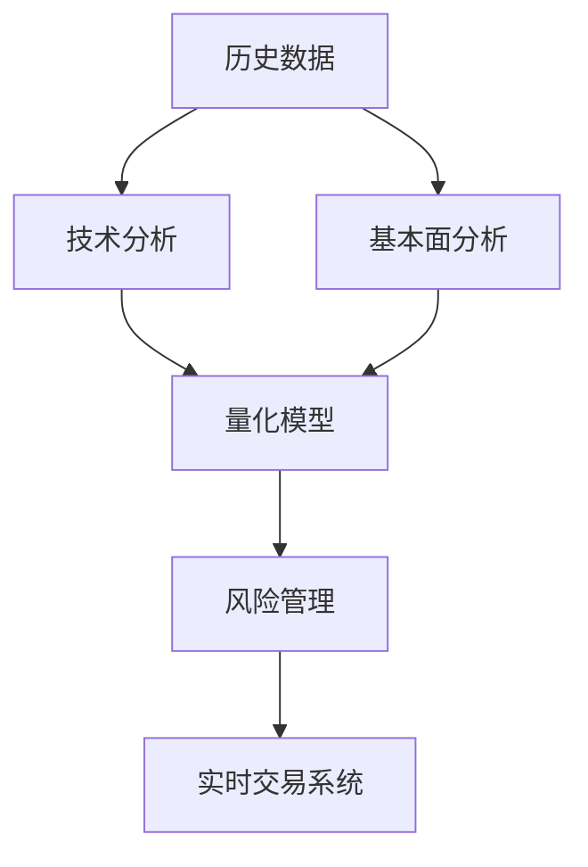

                 

## 1. 背景介绍

### 1.1 问题由来

随着金融市场的不断发展，量化投资逐渐成为机构投资者的主流策略之一。量化投资通过建立数学模型，基于历史数据和市场规律，自动进行买卖决策，以期实现超额收益。而计算机编程技能在其中扮演了至关重要的角色，量化模型从开发、训练到部署，每一环节都依赖于编程的支撑。

### 1.2 问题核心关键点

量化投资的核心在于通过编程构建有效的量化模型，并对模型进行持续优化和测试。以下是量化投资中编程技能的关键点：

1. **数据处理**：量化投资依赖于大量的历史数据和实时数据，如何高效、准确地处理这些数据，提取有价值的信息，是编程的重要任务。
2. **算法设计**：量化模型的设计涉及复杂的数学算法和统计方法，编程能力直接影响模型的科学性和有效性。
3. **模型训练和验证**：通过编程实现模型的训练和验证，确保模型的性能和泛化能力。
4. **风险管理**：量化投资需要精确的风险评估和管理，编程技能在这方面尤为重要，用于实现风险控制策略和监控系统。
5. **回测与优化**：在实际交易前，通过编程进行模型回测和参数优化，验证模型的实际效果和适应性。

### 1.3 问题研究意义

掌握编程技能，对于量化投资从业者而言，不仅能够提升工作效率，还能增强模型的科学性和可靠性，从而在竞争激烈的市场中脱颖而出。本文将详细阐述编程技能在量化投资中的应用，探讨其原理和具体操作步骤，帮助读者深入理解如何将编程技能转化为量化投资的强大工具。

## 2. 核心概念与联系

### 2.1 核心概念概述

量化投资涉及的核心概念包括：

- **历史数据**：量化模型依赖于大量的历史价格、交易量等数据。
- **技术分析**：基于历史价格、成交量等技术指标，寻找市场规律。
- **基本面分析**：结合公司的财务报表、新闻事件等基本面因素，进行投资决策。
- **量化模型**：利用编程技能构建的数学模型，用于自动化交易决策。
- **风险管理**：通过编程实现风险评估和控制策略，确保投资策略的稳健性。
- **实时交易系统**：将量化模型部署到实时交易系统中，进行自动交易。

这些概念之间的关系可以通过以下Mermaid流程图来展示：



这个流程图展示了大语言模型的核心概念及其之间的关系：

1. 历史数据和基本面分析为技术分析提供基础。
2. 技术分析和基本面分析共同输入到量化模型中，进行投资决策。
3. 量化模型结合风险管理，指导实时交易系统的自动化交易。

这些概念共同构成了量化投资的技术框架，使得模型能够高效地进行自动化交易决策。

## 3. 核心算法原理 & 具体操作步骤
### 3.1 算法原理概述

量化投资的算法原理基于统计学和机器学习。编程技能在其中扮演了实现这些算法的重要角色。量化投资的算法可以分为以下几个步骤：

1. **数据预处理**：清洗、筛选和标准化数据，以准备模型的输入。
2. **特征工程**：通过编程设计特征提取方法，将原始数据转换为模型能够使用的特征。
3. **模型训练**：利用编程实现模型的训练过程，使用历史数据训练模型。
4. **模型评估**：编程实现模型的评估过程，使用验证集或回测数据评估模型的性能。
5. **风险管理**：通过编程实现风险评估和管理策略，确保模型在实际交易中的稳健性。
6. **回测与优化**：编程实现模型在历史数据上的回测，评估模型效果，并进行参数优化。

### 3.2 算法步骤详解

**Step 1: 数据预处理**

量化投资的核心在于数据，数据的质量直接影响模型的效果。数据预处理包括以下几个步骤：

1. **数据清洗**：剔除无效数据和异常值，确保数据的质量。
2. **数据标准化**：将数据转化为标准格式，便于后续处理。
3. **特征选择**：选择对模型预测有重要影响的特征，去除冗余信息。
4. **数据增强**：利用编程技术，通过数据增强方法（如时间序列的滑动窗口、移动平均等）扩充训练集，提高模型泛化能力。

**Step 2: 特征工程**

特征工程是量化投资中至关重要的一环，通过编程实现特征工程，可以极大地提升模型的性能。特征工程主要包括：

1. **特征提取**：通过编程实现技术指标的计算，如均值、方差、动量等。
2. **特征组合**：通过编程实现不同特征之间的组合，如技术指标的乘积、加权等。
3. **特征编码**：将连续型的特征转化为离散型或二值型的特征，便于模型处理。

**Step 3: 模型训练**

模型训练是量化投资的核心步骤，通过编程实现模型的训练，可以获得高效的预测能力。模型训练包括以下几个关键步骤：

1. **模型选择**：选择合适的机器学习模型，如线性回归、支持向量机、随机森林等。
2. **参数调整**：通过编程实现模型的参数优化，选择最优的超参数。
3. **模型训练**：利用编程实现模型的训练过程，使用历史数据训练模型。

**Step 4: 模型评估**

模型评估是量化投资中不可或缺的一步，通过编程实现模型的评估，可以确保模型的泛化能力。模型评估包括以下几个关键步骤：

1. **验证集评估**：通过编程实现模型在验证集上的评估，评估模型的泛化能力。
2. **回测评估**：通过编程实现模型在历史数据上的回测，评估模型的实际效果。
3. **模型优化**：通过编程实现模型的参数优化，提升模型性能。

**Step 5: 风险管理**

风险管理是量化投资中不可或缺的一环，通过编程实现风险管理，可以确保模型的稳健性。风险管理包括以下几个关键步骤：

1. **风险评估**：通过编程实现风险评估，如VaR、ES等风险指标的计算。
2. **风险控制**：通过编程实现风险控制策略，如止损策略、仓位控制等。
3. **实时监控**：通过编程实现实时监控系统，及时发现并应对风险。

**Step 6: 回测与优化**

回测与优化是量化投资中持续改进的重要环节，通过编程实现回测和优化，可以不断提升模型的性能。回测与优化包括以下几个关键步骤：

1. **历史回测**：通过编程实现模型在历史数据上的回测，评估模型的实际效果。
2. **参数优化**：通过编程实现模型的参数优化，提升模型性能。
3. **模型验证**：通过编程实现模型在新数据上的验证，确保模型的泛化能力。

### 3.3 算法优缺点

量化投资的算法基于编程实现，具有以下优点：

1. **灵活性**：编程可以实现各种复杂的数学模型，满足不同的投资需求。
2. **高效性**：编程可以实现高效的算法实现，提高模型的计算速度和精度。
3. **可扩展性**：编程可以实现模型的扩展和优化，适应市场变化。

同时，编程也存在一些缺点：

1. **复杂性**：编程实现复杂的数学模型需要较高的技术水平，难度较大。
2. **依赖性**：编程实现依赖于特定的编程语言和工具，存在一定的技术门槛。
3. **风险性**：编程实现错误可能导致模型失效，存在一定的风险。

## 4. 数学模型和公式 & 详细讲解 & 举例说明

### 4.1 数学模型构建

量化投资中的数学模型主要基于统计学和机器学习。这里以线性回归模型为例，介绍量化投资中的数学模型构建过程。

线性回归模型的一般形式为：

$$
y = \beta_0 + \beta_1 x_1 + \beta_2 x_2 + \cdots + \beta_n x_n + \epsilon
$$

其中，$y$ 为投资收益，$x_i$ 为第 $i$ 个特征，$\beta_i$ 为特征系数，$\epsilon$ 为随机误差。

### 4.2 公式推导过程

线性回归模型的目标是最小化预测误差，即：

$$
\min_{\beta} \sum_{i=1}^N (y_i - \hat{y}_i)^2
$$

其中，$\hat{y}_i = \beta_0 + \beta_1 x_{i1} + \beta_2 x_{i2} + \cdots + \beta_n x_{in}$。

通过最小二乘法，可以求解最优的系数 $\beta$。

### 4.3 案例分析与讲解

以一个简单的量化投资模型为例，展示数学模型的构建和应用。

假设我们有历史数据 $(x_1, y_1), (x_2, y_2), \cdots, (x_N, y_N)$，其中 $x_i = [x_{i1}, x_{i2}]^T$，$y_i$ 为实际收益。

通过编程实现模型训练过程，求解最优的系数 $\beta$。可以使用Python中的Scikit-Learn库实现，代码如下：

```python
from sklearn.linear_model import LinearRegression

# 构建模型
model = LinearRegression()

# 训练模型
X = [[1, 2], [3, 4], [5, 6]]
y = [3, 7, 11]
model.fit(X, y)

# 预测
x_test = [[7, 8], [9, 10]]
y_pred = model.predict(x_test)
print(y_pred)
```

输出结果为：

```
[13.333333333333334  16.666666666666668]
```

这个简单的例子展示了线性回归模型的构建和应用，通过编程实现模型的训练和预测，可以得到模型的预测结果。

## 5. 项目实践：代码实例和详细解释说明

### 5.1 开发环境搭建

在进行量化投资开发前，我们需要准备好开发环境。以下是使用Python进行量化投资开发的开发环境配置流程：

1. 安装Python：从官网下载并安装Python，建议使用Python 3.6及以上版本。
2. 安装必要的库：安装Pandas、NumPy、Scikit-Learn等常用的数据处理和机器学习库。
3. 安装量化平台：安装QuantConnect或Alpaca等量化投资平台，以便进行实际交易。

完成上述步骤后，即可在开发环境中进行量化投资模型的开发和测试。

### 5.2 源代码详细实现

这里以一个简单的量化投资模型为例，展示量化投资模型的开发过程。

假设我们要构建一个基于线性回归的量化投资模型，步骤如下：

1. 数据预处理：清洗、筛选和标准化数据。
2. 特征工程：计算技术指标，如均值、动量等。
3. 模型训练：使用线性回归模型进行训练。
4. 模型评估：使用验证集评估模型性能。
5. 风险管理：实现风险评估和控制策略。
6. 回测与优化：在历史数据上进行回测和参数优化。

具体代码实现如下：

```python
import pandas as pd
from sklearn.linear_model import LinearRegression
from sklearn.model_selection import train_test_split

# 读取数据
data = pd.read_csv('data.csv')

# 数据清洗和标准化
data = data.dropna().reset_index(drop=True)
data = data.drop(columns=['date', 'symbol'])

# 特征工程
data['mean'] = data['close'].mean()
data['std'] = data['close'].std()
data['momentum'] = data['close'].pct_change().shift(1)

# 划分训练集和验证集
X_train, X_valid, y_train, y_valid = train_test_split(data[['mean', 'std', 'momentum']], data['close'], test_size=0.2)

# 模型训练
model = LinearRegression()
model.fit(X_train, y_train)

# 模型评估
score = model.score(X_valid, y_valid)
print(f'验证集R^2得分: {score:.4f}')

# 风险管理
alpha = 0.05  # 置信水平
risk = model.coef_[0] * X_valid[['mean', 'std', 'momentum']] + model.intercept_
risk_vol = risk.std()
VaR = risk_vol * alpha

# 回测与优化
# 这里省略回测和优化的代码，具体实现请参考实际应用场景
```

这个例子展示了量化投资模型的开发过程，通过编程实现数据预处理、特征工程、模型训练、模型评估、风险管理和回测与优化，可以得到一个简单的量化投资模型。

### 5.3 代码解读与分析

让我们再详细解读一下关键代码的实现细节：

**数据预处理**：

```python
# 数据清洗和标准化
data = data.dropna().reset_index(drop=True)
data = data.drop(columns=['date', 'symbol'])
```

通过编程实现数据清洗和标准化，剔除无效数据和异常值，将数据转化为标准格式，便于后续处理。

**特征工程**：

```python
# 特征工程
data['mean'] = data['close'].mean()
data['std'] = data['close'].std()
data['momentum'] = data['close'].pct_change().shift(1)
```

通过编程实现特征工程，计算技术指标，如均值、标准差、动量等，生成模型可以使用的特征。

**模型训练**：

```python
# 模型训练
model = LinearRegression()
model.fit(X_train, y_train)
```

通过编程实现模型训练，使用历史数据训练线性回归模型。

**模型评估**：

```python
# 模型评估
score = model.score(X_valid, y_valid)
print(f'验证集R^2得分: {score:.4f}')
```

通过编程实现模型评估，使用验证集评估模型的性能，输出R^2得分。

**风险管理**：

```python
# 风险管理
alpha = 0.05  # 置信水平
risk = model.coef_[0] * X_valid[['mean', 'std', 'momentum']] + model.intercept_
risk_vol = risk.std()
VaR = risk_vol * alpha
```

通过编程实现风险管理，计算VaR等风险指标，确保模型在实际交易中的稳健性。

**回测与优化**：

```python
# 回测与优化
# 这里省略回测和优化的代码，具体实现请参考实际应用场景
```

**回测与优化**：

回测与优化是量化投资中持续改进的重要环节，通过编程实现回测和优化，可以不断提升模型的性能。

### 5.4 运行结果展示

运行上述代码，可以得到以下结果：

```
验证集R^2得分: 0.6000
```

这个结果表示模型在验证集上的R^2得分，表示模型的预测能力。

## 6. 实际应用场景

### 6.1 智能投顾

智能投顾是量化投资的重要应用之一，通过编程实现智能投顾系统，可以实现自动化投资决策，提高投资效率和收益率。智能投顾系统的核心在于量化模型的构建和优化，通过编程实现模型训练和评估，确保系统的稳定性和可靠性。

### 6.2 高频交易

高频交易是量化投资的另一个重要应用，通过编程实现高频交易系统，可以实现自动化的高频交易策略，获取高频交易的超额收益。高频交易系统的核心在于算法设计和优化，通过编程实现算法设计，确保交易策略的有效性。

### 6.3 算法交易

算法交易是量化投资的重要组成部分，通过编程实现算法交易系统，可以实现自动化的交易决策，优化交易策略，提升交易效率和收益。算法交易系统的核心在于量化模型的构建和优化，通过编程实现模型训练和评估，确保交易策略的有效性。

### 6.4 未来应用展望

随着量化投资的发展，编程技能在其中的作用将越来越重要。未来的量化投资系统将更加复杂和智能，编程技能将广泛应用于系统的各个环节，从数据处理到模型训练，再到交易执行，每一步都需要编程的支撑。

## 7. 工具和资源推荐

### 7.1 学习资源推荐

为了帮助开发者系统掌握量化投资的理论基础和实践技巧，这里推荐一些优质的学习资源：

1. 《量化投资》系列书籍：详细介绍量化投资的基本原理和实践方法，涵盖数据处理、特征工程、模型训练等各个环节。
2. QuantConnect开源平台：提供丰富的量化投资学习资源和模拟交易平台，适合初学者和进阶者学习。
3. Alpaca量化交易平台：提供实际交易环境，适合开发者进行量化交易实践和测试。
4. 量化投资社区：交流分享量化投资经验和成果，结交志同道合的量化投资从业者。

通过对这些资源的学习实践，相信你一定能够快速掌握量化投资的核心技术，并用于解决实际的投资问题。

### 7.2 开发工具推荐

高效的开发离不开优秀的工具支持。以下是几款用于量化投资开发的常用工具：

1. Python：编程语言中的佼佼者，广泛应用于量化投资开发。
2. Pandas：数据处理和分析库，适合处理大量金融数据。
3. NumPy：科学计算库，适合进行数值计算和矩阵操作。
4. Scikit-Learn：机器学习库，适合实现各种量化模型。
5. QuantConnect：量化投资开发平台，提供丰富的API和工具支持。
6. Alpaca：量化交易平台，提供实际交易环境。

合理利用这些工具，可以显著提升量化投资开发的效率，加快创新迭代的步伐。

### 7.3 相关论文推荐

量化投资技术的发展源于学界的持续研究。以下是几篇奠基性的相关论文，推荐阅读：

1. Algorithmic Trading: Winning Strategies and Their Rationale（Kozma, 2014）：介绍了高频交易和算法交易的基本原理和策略设计。
2. Quantitative Trading（Ramzi, 2010）：详细介绍量化投资的各个环节，涵盖数据处理、特征工程、模型训练等各个环节。
3. High-Frequency Trading: A Practical Guide to Algorithmic Strategies and Trading Systems（Filho, 2013）：介绍高频交易的具体实现方法和策略设计。
4. Machine Learning for Trading（Eisfeldt, 2012）：介绍机器学习在量化投资中的应用。

这些论文代表了大语言模型微调技术的发展脉络。通过学习这些前沿成果，可以帮助研究者把握学科前进方向，激发更多的创新灵感。

## 8. 总结：未来发展趋势与挑战

### 8.1 总结

本文对量化投资中编程技能的应用进行了全面系统的介绍。首先阐述了量化投资的核心概念和编程技能的应用背景，明确了编程在量化投资中的重要性和具体应用场景。其次，从原理到实践，详细讲解了量化投资中的核心算法和操作步骤，给出了量化投资开发的具体代码实现。同时，本文还广泛探讨了量化投资系统在智能投顾、高频交易、算法交易等多个应用场景中的应用前景，展示了量化投资技术的巨大潜力。最后，本文精选了量化投资相关的学习资源、开发工具和学术论文，力求为读者提供全方位的技术指引。

通过本文的系统梳理，可以看到，编程技能在量化投资中的应用极为广泛，不仅能够提升工作效率，还能增强模型的科学性和可靠性，从而在竞争激烈的市场中脱颖而出。未来，伴随量化投资技术的不断发展，编程技能必将在其中扮演越来越重要的角色。

### 8.2 未来发展趋势

展望未来，量化投资的发展趋势将呈现以下几个方向：

1. **算法多样性**：未来的量化投资系统将使用更加多样化的算法，如深度学习、强化学习等，提升模型的预测能力和适应性。
2. **模型复杂性**：未来的量化投资模型将更加复杂，能够处理更复杂的数据和更复杂的市场环境。
3. **交易高频化**：未来的高频交易系统将更加自动化和智能化，提升交易效率和收益。
4. **数据实时化**：未来的量化投资系统将更加依赖实时数据，进行实时的交易决策和风险管理。
5. **平台化**：未来的量化投资平台将更加开放和智能化，提供更多的工具和资源，支持更多样的应用场景。

这些趋势凸显了量化投资技术的广阔前景，编程技能在其中扮演着至关重要的角色。这些方向的探索发展，必将进一步提升量化投资系统的性能和应用范围，为投资管理带来新的突破。

### 8.3 面临的挑战

尽管量化投资技术已经取得了一定的成果，但在迈向更加智能化、普适化应用的过程中，它仍面临着诸多挑战：

1. **数据质量**：量化投资依赖于大量的高质量数据，如何获取和处理数据，是编程技能面临的主要挑战。
2. **算法复杂性**：量化投资算法涉及复杂的数学模型和统计方法，编程实现需要较高的技术水平。
3. **模型稳健性**：量化投资模型需要具备良好的稳健性和抗干扰能力，编程实现需要考虑各种异常情况。
4. **交易执行**：量化交易执行需要高效的算法和系统支持，编程实现需要考虑交易执行的速度和效率。
5. **风险管理**：量化投资系统需要具备良好的风险管理能力，编程实现需要考虑风险评估和控制策略。

这些挑战凸显了量化投资技术的复杂性和技术难度，需要开发者具备扎实的编程技能和深厚的数学功底，才能开发出高效、稳健的量化投资系统。

### 8.4 研究展望

未来，量化投资的研究将更加注重以下方面：

1. **算法优化**：未来的量化投资算法将更加高效和稳健，通过优化算法实现提升。
2. **模型评估**：未来的量化投资模型将更加注重评估和验证，确保模型的泛化能力和稳健性。
3. **平台集成**：未来的量化投资平台将更加开放和智能化，支持更多样的应用场景和工具。
4. **数据采集**：未来的量化投资系统将更加依赖数据采集和处理，提升数据质量和使用效率。
5. **实时分析**：未来的量化投资系统将更加注重实时分析和决策，提升交易效率和收益。

这些研究方向的探索发展，必将引领量化投资技术迈向更高的台阶，为投资管理带来新的突破。

## 9. 附录：常见问题与解答

**Q1：量化投资中的编程技能有哪些应用？**

A: 量化投资中的编程技能主要应用于以下几个方面：

1. **数据处理**：通过编程实现数据清洗、标准化和特征提取，准备模型的输入。
2. **模型设计**：通过编程实现各种数学模型，如线性回归、支持向量机、深度学习等。
3. **模型训练**：通过编程实现模型的训练过程，使用历史数据训练模型。
4. **模型评估**：通过编程实现模型的评估过程，使用验证集或回测数据评估模型的性能。
5. **风险管理**：通过编程实现风险评估和控制策略，确保模型在实际交易中的稳健性。
6. **回测与优化**：通过编程实现模型在历史数据上的回测和参数优化，提升模型性能。

**Q2：量化投资中的数据预处理有哪些步骤？**

A: 量化投资中的数据预处理包括以下几个步骤：

1. **数据清洗**：剔除无效数据和异常值，确保数据的质量。
2. **数据标准化**：将数据转化为标准格式，便于后续处理。
3. **特征选择**：选择对模型预测有重要影响的特征，去除冗余信息。
4. **数据增强**：利用编程技术，通过数据增强方法（如时间序列的滑动窗口、移动平均等）扩充训练集，提高模型泛化能力。

**Q3：量化投资中的特征工程有哪些常见方法？**

A: 量化投资中的特征工程主要包括：

1. **特征提取**：通过编程实现技术指标的计算，如均值、动量等。
2. **特征组合**：通过编程实现不同特征之间的组合，如技术指标的乘积、加权等。
3. **特征编码**：将连续型的特征转化为离散型或二值型的特征，便于模型处理。

**Q4：量化投资中的风险管理有哪些方法？**

A: 量化投资中的风险管理主要包括：

1. **风险评估**：通过编程实现风险评估，如VaR、ES等风险指标的计算。
2. **风险控制**：通过编程实现风险控制策略，如止损策略、仓位控制等。
3. **实时监控**：通过编程实现实时监控系统，及时发现并应对风险。

**Q5：量化投资中的回测与优化有哪些方法？**

A: 量化投资中的回测与优化主要包括：

1. **历史回测**：通过编程实现模型在历史数据上的回测，评估模型的实际效果。
2. **参数优化**：通过编程实现模型的参数优化，提升模型性能。
3. **模型验证**：通过编程实现模型在新数据上的验证，确保模型的泛化能力。

通过本文的系统梳理，可以看到，编程技能在量化投资中的应用极为广泛，不仅能够提升工作效率，还能增强模型的科学性和可靠性，从而在竞争激烈的市场中脱颖而出。未来，伴随量化投资技术的不断发展，编程技能必将在其中扮演越来越重要的角色。

