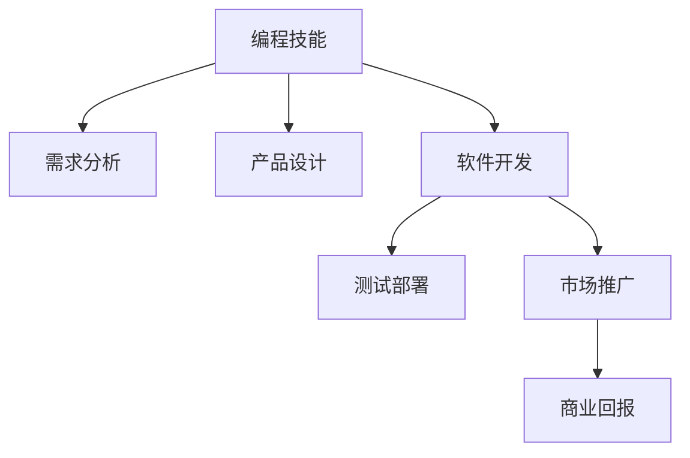

                 

# 如何将编程技能转化为知识产品

## 1. 背景介绍

在技术日新月异的今天，编程技能已经成为了跨行业、跨领域的基础能力。从软件开发到数据分析，从人工智能到金融科技，编程无处不在。然而，真正能够将编程技能转化为实际价值的产品或服务，却依然是少数。本文旨在探讨如何将编程技能转化为知识产品，帮助更多技术开发者实现从技术到产品的突破。

## 2. 核心概念与联系

### 2.1 核心概念概述

在深入探讨如何将编程技能转化为知识产品之前，我们首先需要明确几个核心概念：

- **编程技能**：指掌握编程语言、算法、数据结构等编程知识，能够编写出功能完备、性能优良的代码。
- **知识产品**：指基于编程技能开发出来的具有实际价值的软件、工具、应用等，能够为用户带来解决方案和便捷。
- **产品化**：将编程技能转化为可用的产品或服务的过程，包括需求分析、设计、开发、测试、上线等各个环节。
- **市场化**：将产品推向市场，通过销售、推广等手段获得商业回报的过程。

这些概念之间的联系紧密，编程技能是知识产品的基础，产品化是将基础技能转化为实际应用的过程，市场化则是将应用推广到更广领域的策略。

### 2.2 核心概念原理和架构的 Mermaid 流程图



这个流程图展示了编程技能转化为知识产品的主要步骤：首先从编程技能出发，通过需求分析明确目标用户需求，接着进行产品设计和软件开发，再经过测试和部署，最终通过市场推广获取商业回报。

## 3. 核心算法原理 & 具体操作步骤

### 3.1 算法原理概述

将编程技能转化为知识产品，本质上是一个从技术到市场的过程。这个过程可以分为技术实现和市场运营两个阶段，分别对应着计算机科学和经济学的内容。

在技术实现阶段，主要关注如何将编程技能转化为软件、工具或应用等产品。这一阶段的核心算法包括：

- **软件架构设计**：选择适合的技术栈，设计合理的软件架构，保证系统的可扩展性和稳定性。
- **用户体验设计**：通过用户研究、原型设计等方法，确保产品的易用性和用户体验。
- **敏捷开发**：采用迭代开发和持续交付的方法，快速响应市场和用户需求的变化。

在市场运营阶段，主要关注如何将产品推向市场，获取商业回报。这一阶段的核心算法包括：

- **市场营销**：通过市场调研、产品定位、广告宣传等手段，提高产品的市场认知度和用户渗透率。
- **客户关系管理**：通过客户服务、用户反馈、数据分析等方法，建立良好的客户关系，提高用户满意度和忠诚度。
- **销售策略**：选择合适的销售渠道和定价策略，最大化商业回报。

### 3.2 算法步骤详解

#### 3.2.1 技术实现阶段

1. **需求分析**：
   - 通过市场调研、用户访谈、竞品分析等方式，明确目标用户的需求和痛点。
   - 使用用户故事、用例图、需求文档等工具记录需求。

2. **产品设计**：
   - 进行用户研究和竞品分析，确定产品功能和界面设计。
   - 使用原型设计工具（如Sketch、Figma等）创建产品原型，并通过用户测试反馈优化设计。

3. **软件开发**：
   - 选择适合的技术栈（如前后端分离、微服务架构等），设计软件架构。
   - 编写代码，进行单元测试、集成测试等，确保软件质量。
   - 采用敏捷开发方法（如Scrum、Kanban等），快速迭代开发，提高开发效率。

4. **测试部署**：
   - 进行功能测试、性能测试、安全测试等，确保产品无重大漏洞。
   - 发布产品，进行版本控制和版本管理。
   - 采用DevOps工具链（如Jenkins、GitLab CI/CD等），实现持续集成和持续交付。

#### 3.2.2 市场运营阶段

1. **市场营销**：
   - 进行市场调研，确定目标市场和用户群体。
   - 制定市场推广策略，选择合适的渠道（如社交媒体、SEO、广告等）。
   - 开展营销活动，如内容营销、事件营销、社交媒体营销等。

2. **客户关系管理**：
   - 建立客户服务体系，提供技术支持和售后服务。
   - 收集用户反馈，进行数据分析，了解用户需求和满意度。
   - 使用CRM工具（如Salesforce、Zoho CRM等）管理客户关系。

3. **销售策略**：
   - 选择合适的销售渠道（如在线销售、线下代理等）。
   - 制定定价策略，确定产品价格和促销策略。
   - 建立销售团队，进行销售培训和业绩管理。

### 3.3 算法优缺点

将编程技能转化为知识产品的算法，具有以下优点：

- **灵活性**：可以根据用户需求快速迭代开发，提高产品适应性。
- **可扩展性**：采用模块化设计和微服务架构，方便扩展和升级。
- **敏捷性**：采用敏捷开发方法，快速响应市场需求变化。

同时，也存在一些缺点：

- **技术门槛高**：需要掌握多方面的知识，包括需求分析、产品设计、软件开发、测试部署等。
- **市场风险大**：产品市场需求和用户反馈存在不确定性，可能导致失败。
- **资源投入大**：需要投入大量的人力、物力和财力，成本较高。

### 3.4 算法应用领域

将编程技能转化为知识产品的算法，可以应用于多种领域：

- **软件开发**：开发各种类型的软件，如企业管理系统、电商平台、移动应用等。
- **数据分析**：开发数据处理工具和分析系统，如BI工具、数据可视化工具等。
- **人工智能**：开发AI应用，如智能推荐系统、语音识别系统等。
- **互联网应用**：开发网站、博客、论坛等互联网应用，提供信息服务和社区互动。
- **物联网**：开发物联网应用，实现设备互联和智能化控制。

## 4. 数学模型和公式 & 详细讲解 & 举例说明

### 4.1 数学模型构建

将编程技能转化为知识产品的过程，可以通过数学模型进行建模和分析。

假设目标市场的需求为 $D$，产品的市场渗透率为 $p$，产品的成本为 $C$，产品的售价为 $P$，市场规模为 $M$，产品的运营成本为 $O$。则产品的商业回报 $R$ 可以通过以下公式计算：

$$
R = p \times M \times P - C \times (p \times M + O)
$$

其中，$p \times M$ 为产品的市场销售量，$C \times (p \times M + O)$ 为产品的总成本，$R$ 为商业回报。

### 4.2 公式推导过程

- **需求分析**：通过市场调研和用户访谈，确定目标市场的需求 $D$。
- **产品设计**：进行产品设计和原型测试，确定产品的市场渗透率 $p$。
- **软件开发**：编写代码并进行测试，确定产品的成本 $C$ 和售价 $P$。
- **测试部署**：进行功能测试和性能测试，确定产品的运营成本 $O$。
- **市场运营**：通过市场营销和客户关系管理，提高产品的市场渗透率 $p$ 和市场销售量 $p \times M$。
- **商业回报**：通过销售和运营，计算商业回报 $R$。

### 4.3 案例分析与讲解

以开发一个企业管理系统为例，进行详细讲解。

1. **需求分析**：
   - 通过市场调研和用户访谈，确定目标市场为企业管理软件市场，需求为提高企业管理的效率和准确性。
   - 用户故事：用户希望能够快速录入和查询企业数据，进行财务管理、人力资源管理和项目管理等。

2. **产品设计**：
   - 进行用户研究和竞品分析，确定产品功能和界面设计。
   - 使用原型设计工具创建产品原型，并通过用户测试反馈优化设计。

3. **软件开发**：
   - 选择适合的技术栈（如React、Spring Boot等），设计软件架构。
   - 编写代码，进行单元测试、集成测试等，确保软件质量。
   - 采用敏捷开发方法，快速迭代开发，提高开发效率。

4. **测试部署**：
   - 进行功能测试、性能测试、安全测试等，确保产品无重大漏洞。
   - 发布产品，进行版本控制和版本管理。
   - 采用DevOps工具链，实现持续集成和持续交付。

5. **市场营销**：
   - 进行市场调研，确定目标市场和用户群体。
   - 制定市场推广策略，选择合适的渠道（如企业官网、行业展会等）。
   - 开展营销活动，如内容营销、事件营销、社交媒体营销等。

6. **客户关系管理**：
   - 建立客户服务体系，提供技术支持和售后服务。
   - 收集用户反馈，进行数据分析，了解用户需求和满意度。
   - 使用CRM工具管理客户关系。

7. **销售策略**：
   - 选择合适的销售渠道（如在线销售、线下代理等）。
   - 制定定价策略，确定产品价格和促销策略。
   - 建立销售团队，进行销售培训和业绩管理。

## 5. 项目实践：代码实例和详细解释说明

### 5.1 开发环境搭建

在进行项目实践前，我们需要准备好开发环境。以下是使用Python进行Flask开发的环境配置流程：

1. 安装Anaconda：从官网下载并安装Anaconda，用于创建独立的Python环境。

2. 创建并激活虚拟环境：
```bash
conda create -n flask-env python=3.8 
conda activate flask-env
```

3. 安装Flask：
```bash
pip install flask
```

4. 安装相关库：
```bash
pip install requests beautifulsoup4
```

5. 安装数据库：
```bash
pip install mysql-connector-python
```

完成上述步骤后，即可在`flask-env`环境中开始项目开发。

### 5.2 源代码详细实现

以下是使用Flask开发一个简单的企业管理系统：

```python
from flask import Flask, render_template, request
import mysql.connector

app = Flask(__name__)

@app.route('/')
def index():
    return render_template('index.html')

@app.route('/login', methods=['POST'])
def login():
    username = request.form['username']
    password = request.form['password']
    
    # 连接数据库
    db = mysql.connector.connect(
        host='localhost',
        user='root',
        password='password',
        database='enterprise'
    )
    cursor = db.cursor()
    
    # 查询用户信息
    query = "SELECT * FROM users WHERE username=%s AND password=%s"
    cursor.execute(query, (username, password))
    user = cursor.fetchone()
    
    # 返回用户信息
    if user:
        return render_template('home.html', user=user)
    else:
        return render_template('login.html', error='Invalid username or password')

@app.route('/logout')
def logout():
    return render_template('login.html')

if __name__ == '__main__':
    app.run(debug=True)
```

在这个示例中，我们使用Flask框架开发了一个简单的企业管理系统。用户登录时，系统查询数据库中的用户信息，验证用户名和密码是否正确，并返回相应的页面。

### 5.3 代码解读与分析

让我们再详细解读一下关键代码的实现细节：

**Flask框架**：
- `Flask`：轻量级Web框架，支持动态路由、模板渲染等特性。
- `render_template`：渲染HTML模板。
- `request`：处理HTTP请求，获取请求参数。

**MySQL数据库**：
- `mysql.connector`：MySQL数据库连接库，支持连接和操作MySQL数据库。
- `cursor`：数据库游标，用于执行SQL查询和更新操作。

**用户登录验证**：
- `username` 和 `password` 分别从登录表单中获取用户名和密码。
- 通过 `cursor.execute` 执行SQL查询，获取用户信息。
- 根据用户信息是否匹配，返回相应的页面。

这个示例展示了使用Flask开发一个简单企业管理系统的基本流程。通过使用Flask框架，可以简化Web开发过程，提高开发效率。

## 6. 实际应用场景

### 6.1 智能客服系统

基于Flask的企业管理系统，可以用于构建智能客服系统。传统客服往往需要配备大量人力，高峰期响应缓慢，且一致性和专业性难以保证。使用Flask开发的智能客服系统，可以7x24小时不间断服务，快速响应客户咨询，用自然流畅的语言解答各类常见问题。

在技术实现上，可以开发一个客户交互界面，集成自然语言处理（NLP）技术，自动理解客户意图，匹配最合适的回答。对于客户提出的新问题，还可以接入检索系统实时搜索相关内容，动态组织生成回答。如此构建的智能客服系统，能大幅提升客户咨询体验和问题解决效率。

### 6.2 金融舆情监测

金融机构需要实时监测市场舆论动向，以便及时应对负面信息传播，规避金融风险。传统的人工监测方式成本高、效率低，难以应对网络时代海量信息爆发的挑战。使用Flask开发的舆情监测系统，可以实时抓取网络文本数据，自动监测不同主题下的情感变化趋势，一旦发现负面信息激增等异常情况，系统便会自动预警，帮助金融机构快速应对潜在风险。

在技术实现上，可以集成Python的NLP库（如NLTK、SpaCy等），对抓取到的文本进行情感分析和主题分类，识别负面信息和异常情况，实现实时监测和预警。

### 6.3 个性化推荐系统

当前的推荐系统往往只依赖用户的历史行为数据进行物品推荐，无法深入理解用户的真实兴趣偏好。使用Flask开发的个性化推荐系统，可以更好地挖掘用户行为背后的语义信息，从而提供更精准、多样的推荐内容。

在技术实现上，可以收集用户浏览、点击、评论、分享等行为数据，提取和用户交互的物品标题、描述、标签等文本内容。将文本内容作为模型输入，用户的后续行为（如是否点击、购买等）作为监督信号，在此基础上微调预训练语言模型。微调后的模型能够从文本内容中准确把握用户的兴趣点。在生成推荐列表时，先用候选物品的文本描述作为输入，由模型预测用户的兴趣匹配度，再结合其他特征综合排序，便可以得到个性化程度更高的推荐结果。

## 7. 工具和资源推荐

### 7.1 学习资源推荐

为了帮助开发者系统掌握Flask的技术基础和实践技巧，这里推荐一些优质的学习资源：

1. 《Flask Web开发实战》系列博文：由Flask官方团队撰写，深入浅出地介绍了Flask框架的使用方法和最佳实践。

2. Flask官方文档：Flask框架的官方文档，提供了完整的API参考和样例代码，是上手实践的必备资料。

3. Flask Cookbook：Flask社区编写的Flask实战教程，涵盖各种Flask应用场景，适合快速学习Flask开发。

4. Flask Mega-Tutorial：Flask社区编写的Flask教程，从零开始介绍Flask的各个模块和功能，适合新手入门。

5. Flask by Example：Flask社区编写的Flask实战教程，通过多个示例项目，展示Flask的实际应用。

通过对这些资源的学习实践，相信你一定能够快速掌握Flask框架的使用方法和技巧，并用于开发实际应用。

### 7.2 开发工具推荐

高效的开发离不开优秀的工具支持。以下是几款用于Flask开发常用的工具：

1. PyCharm：功能强大的Python IDE，支持Flask框架的开发和调试。

2. VSCode：轻量级、高扩展的代码编辑器，支持Flask框架的开发和调试。

3. PyDev：Python IDE，支持Flask框架的开发和调试。

4. Flask Admin：Flask框架的扩展库，提供Web管理界面，方便进行数据管理和用户管理。

5. Flask-WTF：Flask框架的扩展库，提供表单验证功能，方便进行用户输入的校验。

6. Flask-SocketIO：Flask框架的扩展库，支持WebSocket协议，实现实时通信和数据推送。

合理利用这些工具，可以显著提升Flask框架的开发效率，加快创新迭代的步伐。

### 7.3 相关论文推荐

Flask框架作为Web开发的重要工具，其研究和应用也在不断演进。以下是几篇奠基性的相关论文，推荐阅读：

1. The Flask Web Server Gateway Interface（Flask规范）：定义了Flask框架的接口规范，是Flask框架的开发基础。

2. Flask by Example: A Short Book：通过多个示例项目，展示了Flask框架的实际应用，适合快速学习Flask开发。

3. Real-time Web Applications with Flask and SocketIO：介绍如何使用Flask和SocketIO开发实时Web应用，适合对实时通信有兴趣的开发者。

4. Flask-SQLAlchemy: A Flask Extension for SQLAlchemy：介绍如何使用Flask和SQLAlchemy进行数据库开发，适合对数据库操作有兴趣的开发者。

5. Flask-RESTful: Build REST APIs in Flask with Ease：介绍如何使用Flask和RESTful构建RESTful API，适合对API开发有兴趣的开发者。

这些论文代表了Flask框架的发展脉络。通过学习这些前沿成果，可以帮助研究者把握Flask框架的前进方向，激发更多的创新灵感。

## 8. 总结：未来发展趋势与挑战

### 8.1 总结

本文对将编程技能转化为知识产品的方法进行了全面系统的介绍。首先阐述了将编程技能转化为知识产品的意义和过程，明确了需求分析、产品设计、软件开发、测试部署等各个环节的关键步骤。其次，从Flask框架的使用方法到实际应用场景，给出了详尽的代码实例和分析，帮助开发者理解和应用Flask框架。最后，本文还推荐了Flask框架的学习资源和开发工具，以及相关领域的最新研究论文，为Flask框架的学习和应用提供了全方位的支持。

通过本文的系统梳理，可以看到，将编程技能转化为知识产品是一个复杂但有意义的过程。Flask框架作为Web开发的重要工具，通过结合实际需求和最新技术，可以开发出满足用户需求的智能应用。未来，伴随着技术的不断进步和市场的不断发展，Flask框架必将在更多领域得到应用，推动Web开发技术的进步和普及。

### 8.2 未来发展趋势

展望未来，Flask框架的发展趋势如下：

1. **技术栈扩展**：Flask框架将进一步扩展其技术栈，支持更多编程语言和框架，提高跨语言和跨框架的开发能力。

2. **生态系统丰富**：Flask社区将不断丰富其生态系统，引入更多扩展库和工具，提高Flask框架的实用性和可扩展性。

3. **服务化集成**：Flask框架将进一步集成云服务、DevOps工具，实现自动化部署、监控和管理，提高开发效率和系统可靠性。

4. **跨平台支持**：Flask框架将支持更多平台（如Windows、macOS、Linux等），提供跨平台的应用开发能力。

5. **国际化支持**：Flask框架将支持更多语言和地区，提供国际化应用开发能力，满足全球化需求。

6. **低代码开发**：Flask框架将引入低代码开发工具，简化Web应用开发过程，降低开发门槛。

7. **微服务架构**：Flask框架将支持微服务架构，提高系统的可扩展性和可维护性。

### 8.3 面临的挑战

尽管Flask框架已经取得了一定的成就，但在迈向更广泛应用的过程中，仍面临一些挑战：

1. **性能瓶颈**：Flask框架的性能瓶颈在于其单线程处理方式，在高并发情况下可能无法满足需求。如何优化Flask框架的性能，提高其并发处理能力，是一个重要研究方向。

2. **安全性问题**：Flask框架的安全性问题在于其灵活性和可扩展性可能导致安全漏洞。如何提高Flask框架的安全性，减少安全漏洞的风险，是一个重要研究方向。

3. **社区支持**：Flask框架的社区支持和维护机制需要进一步加强，确保社区活跃和资源丰富。

4. **文档更新**：Flask框架的文档需要持续更新，保持与最新的Flask版本和扩展库的兼容性和兼容性。

### 8.4 研究展望

未来，Flask框架的研究和应用将在以下几个方向进行探索：

1. **异步处理**：引入异步处理机制，提高Flask框架的并发处理能力，减少响应时间。

2. **安全增强**：引入安全增强机制，减少Flask框架的安全漏洞风险，提高系统的安全性。

3. **扩展库丰富**：引入更多扩展库和工具，丰富Flask框架的生态系统，提高其实用性和可扩展性。

4. **低代码开发**：引入低代码开发工具，简化Web应用开发过程，降低开发门槛。

5. **微服务架构**：支持微服务架构，提高系统的可扩展性和可维护性。

6. **云服务集成**：进一步集成云服务、DevOps工具，实现自动化部署、监控和管理，提高开发效率和系统可靠性。

7. **跨平台支持**：支持更多平台，提供跨平台的应用开发能力。

8. **国际化支持**：支持更多语言和地区，提供国际化应用开发能力，满足全球化需求。

通过这些研究方向的探索，Flask框架必将在未来得到更广泛的应用和更深入的发展，为Web开发技术带来新的突破和创新。

## 9. 附录：常见问题与解答

**Q1：Flask框架的性能瓶颈在哪里？**

A: Flask框架的性能瓶颈主要在于其单线程处理方式。在多线程或多进程环境下，Flask框架的并发处理能力有限，无法满足高并发需求。为了解决这一问题，可以采用异步处理机制，如使用Gunicorn、Tornado等异步服务器，提高Flask框架的并发处理能力。

**Q2：如何提高Flask框架的安全性？**

A: 提高Flask框架的安全性，可以采取以下措施：

1. 使用HTTPS协议，防止中间人攻击。

2. 限制访问权限，使用Flask-Login、Flask-Principal等扩展库进行用户认证和授权。

3. 避免SQL注入攻击，使用Flask-SQLAlchemy、Flask-WTF等扩展库进行数据验证和转义。

4. 避免XSS攻击，使用Flask-Babel、Flask-Jinja2等扩展库进行模板渲染和转义。

5. 定期更新Flask框架和扩展库，修补安全漏洞。

6. 进行安全测试和漏洞扫描，及时发现和修复安全漏洞。

**Q3：Flask框架的扩展库有哪些？**

A: Flask框架的扩展库非常丰富，以下是一些常用的扩展库：

1. Flask-WTF：提供表单验证功能，支持CSRF、XSS等安全特性。

2. Flask-SQLAlchemy：提供数据库操作支持，支持MySQL、PostgreSQL、SQLite等数据库。

3. Flask-RESTful：提供RESTful API支持，支持HTTP请求和响应处理。

4. Flask-Admin：提供Web管理界面，支持数据管理和用户管理。

5. Flask-Login：提供用户认证功能，支持用户登录和会话管理。

6. Flask-Principal：提供用户授权功能，支持角色和权限管理。

7. Flask-SocketIO：提供WebSocket支持，支持实时通信和数据推送。

8. Flask-Session：提供会话管理功能，支持Cookie和DB存储。

9. Flask-Caching：提供缓存支持，支持Redis、Memcached等缓存系统。

10. Flask-Uploads：提供文件上传功能，支持本地和云存储。

合理利用这些扩展库，可以极大地提升Flask框架的开发效率和功能丰富性。

**Q4：Flask框架和Django框架的优缺点是什么？**

A: Flask框架和Django框架各有优缺点，具体如下：

1. Flask框架的优点：
   - 轻量级：Flask框架体积小，启动速度快。
   - 灵活性：Flask框架的扩展性高，可以根据需求灵活扩展。
   - 易学易用：Flask框架的学习曲线较平缓，易于上手。

2. Flask框架的缺点：
   - 性能瓶颈：Flask框架的单线程处理方式可能无法满足高并发需求。
   - 缺乏自动管理：Flask框架缺少自动管理功能，需要手动管理数据库、缓存等资源。
   - 社区支持：Flask框架的社区支持相对较少，可能需要依赖第三方库。

3. Django框架的优点：
   - 全功能：Django框架集成了大量的功能，如ORM、表单验证、缓存、认证等。
   - 自动管理：Django框架提供自动管理功能，减少手动管理的工作量。
   - 社区支持：Django框架的社区支持丰富，有大量的扩展库和工具。

4. Django框架的缺点：
   - 复杂度：Django框架的功能丰富，可能导致代码复杂度较高。
   - 学习曲线：Django框架的学习曲线较陡峭，需要一定的编程基础。
   - 性能问题：Django框架的性能问题在于其内置的ORM和自动管理功能，可能导致性能瓶颈。

综上所述，Flask框架适合小型项目和快速迭代，Django框架适合大型项目和功能丰富的应用。开发者应根据具体需求选择适合的框架。

---

作者：禅与计算机程序设计艺术 / Zen and the Art of Computer Programming

