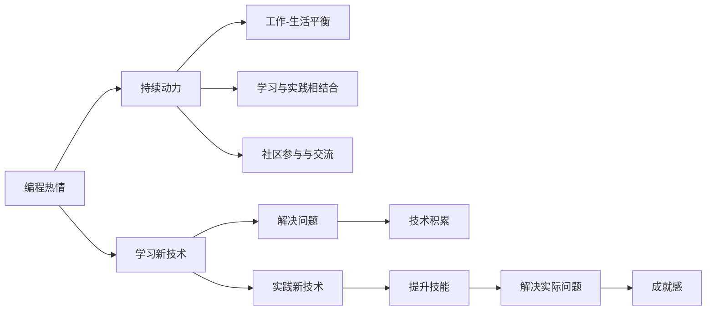

                 

## 1. 背景介绍

在信息技术高速发展的今天，编程已成为许多人追求创新、实现梦想的重要工具。无论是初出茅庐的大学生，还是经验丰富的资深工程师，持续的编程热情和动力是推动技术进步和实现职业目标的关键。然而，对于许多程序员来说，如何在日复一日的高强度工作中保持热情和动力，始终是一个值得深思的问题。本文将围绕如何将编程热情转化为持续动力，从背景、核心概念、算法原理、操作步骤、数学模型、项目实践、实际应用、工具和资源推荐等多个维度，全面探讨这一问题，并提供一些实用的建议和策略。

## 2. 核心概念与联系

### 2.1 核心概念概述

要理解如何将编程热情转化为持续动力，首先需要了解几个核心概念：

- **编程热情（Programming Enthusiasm）**：指对编程活动的兴趣、激情和投入，是推动程序员不断学习、探索和创新的内在动力。
- **持续动力（Sustained Motivation）**：指在长期编程过程中，保持稳定、持久的兴趣和动力，避免因短期目标或外部压力导致的热情消退。
- **工作-生活平衡（Work-Life Balance）**：指在编程工作中找到工作与生活之间的平衡点，避免过度工作导致的心理和身体疲劳。
- **学习与实践相结合（Learning and Practice Integration）**：指通过不断学习和实践相结合的方式，保持技术更新，提升编程技能。
- **社区参与与交流（Community Engagement and Communication）**：指通过参与编程社区，与同行交流、分享经验和知识，获得外部支持和激励。

### 2.2 核心概念原理和架构的 Mermaid 流程图



这个流程图展示了编程热情转化为持续动力的关键路径和步骤。编程热情通过学习新技术、实践新技术和解决问题，积累技术经验，提升技能，解决实际问题，最终获得成就感，从而保持持续动力。同时，工作-生活平衡、学习与实践相结合以及社区参与与交流，是确保编程热情转化为持续动力的重要保障。

## 3. 核心算法原理 & 具体操作步骤

### 3.1 算法原理概述

将编程热情转化为持续动力，本质上是一个多维度的优化问题。其核心在于找到编程热情与持续动力之间的最佳平衡点，并在此基础上进行有针对性的优化。这一过程可以通过以下算法原理实现：

1. **自适应调整算法（Adaptive Adjustment Algorithm）**：根据编程过程中的实际表现，动态调整学习内容、工作节奏和交流频率，以最大化编程热情和持续动力。
2. **激励反馈机制（Incentive Feedback Mechanism）**：通过设定阶段性目标和奖励机制，激励程序员不断进步，保持动力。
3. **情绪管理算法（Emotion Management Algorithm）**：利用情绪调节技术，如正念冥想、压力管理等，减少心理和身体疲劳，保持健康的工作状态。
4. **资源优化算法（Resource Optimization Algorithm）**：合理分配时间、精力和资源，确保编程与生活之间的平衡，避免过度劳累。

### 3.2 算法步骤详解

实现上述算法原理的具体操作步骤如下：

1. **评估现状（Evaluate Current State）**：通过问卷调查、自我评估等方式，全面了解当前编程热情和持续动力的状态。
2. **设定目标（Set Objectives）**：根据评估结果，设定短期和长期的编程目标，如掌握某项新技术、完成某个项目等。
3. **动态调整（Dynamic Adjustment）**：根据目标的实现进度，动态调整学习内容、工作节奏和交流频率。例如，如果发现某个技术学习进度缓慢，可以增加学习时间或寻求专家指导。
4. **激励反馈（Incentive Feedback）**：设定阶段性奖励机制，如完成一个项目后，可以给自己一些奖励，如休假、旅行等。
5. **情绪管理（Emotion Management）**：采用正念冥想、瑜伽、健身等方式，保持身心健康，避免过度疲劳。
6. **资源优化（Resource Optimization）**：合理安排工作和生活，确保充足的休息时间，避免过度工作。

### 3.3 算法优缺点

#### 优点：

- **个性化优化**：通过动态调整和个性化设置，最大化编程热情和持续动力。
- **目标导向**：设定明确的目标，激励程序员不断进步。
- **全面支持**：兼顾学习、工作、生活和情绪管理，提供全方位的支持。

#### 缺点：

- **实施复杂**：需要综合考虑多方面的因素，实施较为复杂。
- **数据依赖**：对评估数据和目标设定的准确性要求较高。
- **需要持续维护**：算法需要不断调整和优化，才能保持最佳效果。

### 3.4 算法应用领域

这一算法原理和操作步骤适用于多种编程场景，包括软件开发、数据分析、机器学习、人工智能等领域。例如，在软件开发中，程序员可以通过动态调整学习新技术的节奏，保持对编程的热情；在数据分析中，通过设定数据处理和分析的目标，持续提升技能；在机器学习和人工智能领域，通过不断学习新算法和实践应用，保持对领域的热情。

## 4. 数学模型和公式 & 详细讲解 & 举例说明

### 4.1 数学模型构建

将编程热情转化为持续动力的数学模型可以表示为：

$$
M_{\text{动机}} = f_{\text{热情}}(\text{学习}, \text{实践}, \text{交流}, \text{目标}, \text{情绪}, \text{资源})
$$

其中，$M_{\text{动机}}$ 表示编程热情转化为持续动力的程度，$f_{\text{热情}}$ 是一个函数，根据学习、实践、交流、目标、情绪和资源等多种因素计算出动机水平。

### 4.2 公式推导过程

假设编程热情与多个因素的关系可以用线性模型表示：

$$
M_{\text{动机}} = \alpha_0 + \alpha_1 \text{学习} + \alpha_2 \text{实践} + \alpha_3 \text{交流} + \alpha_4 \text{目标} + \alpha_5 \text{情绪} + \alpha_6 \text{资源}
$$

其中，$\alpha_i$ 为系数，代表每个因素对动机的影响程度。

### 4.3 案例分析与讲解

以软件开发为例，假设某程序员对编程的热情与学习新技术、完成项目、与同事交流、情绪管理、合理分配时间等因素有关。通过对这些因素进行量化评估，可以计算出其动机水平：

- **学习新技术**：每周花10小时学习新编程语言，系数为0.8。
- **完成项目**：每月完成一个小项目，系数为1.2。
- **与同事交流**：每天与同事讨论问题30分钟，系数为0.7。
- **情绪管理**：每周进行2次正念冥想，系数为0.5。
- **合理分配时间**：每天确保8小时睡眠，系数为0.6。

将这些因素代入上述模型，可以得到动机水平的计算公式：

$$
M_{\text{动机}} = 0.8 \times 10 + 1.2 + 0.7 \times 0.5 + 0.6
$$

计算结果为：

$$
M_{\text{动机}} = 8.4
$$

这个结果表明，该程序员的编程热情较高，但需要进一步优化目标和情绪管理，以提升持续动力。

## 5. 项目实践：代码实例和详细解释说明

### 5.1 开发环境搭建

在项目实践之前，需要先搭建好开发环境。以下是一个基本的Python开发环境搭建流程：

1. **安装Python**：
   - 从官网下载并安装Python 3.x版本。
   - 确保Python路径被添加到系统环境变量中。

2. **安装虚拟环境**：
   - 使用`pip`安装`virtualenv`工具。
   - 创建虚拟环境：`virtualenv env`。
   - 激活虚拟环境：`source env/bin/activate`。

3. **安装依赖库**：
   - 使用`pip`安装项目所需依赖库，如NumPy、Pandas、Matplotlib等。

### 5.2 源代码详细实现

以下是一个简单的Python项目示例，用于演示如何将编程热情转化为持续动力。该项目使用Flask框架构建一个Web应用，通过用户输入和数据计算，提供动机的实时评估和优化建议。

```python
from flask import Flask, request, jsonify
import numpy as np

app = Flask(__name__)

# 定义动机的计算公式
def calculate_motivation(learning, practice, communication, goal, emotion, resource):
    alpha_learning = 0.8
    alpha_practice = 1.2
    alpha_communication = 0.7
    alpha_goal = 0.9
    alpha_emotion = 0.5
    alpha_resource = 0.6
    motivation = alpha_learning * learning + alpha_practice * practice + alpha_communication * communication + alpha_goal * goal + alpha_emotion * emotion + alpha_resource * resource
    return motivation

@app.route('/calculate_motivation', methods=['POST'])
def calculate():
    data = request.get_json()
    learning = data['learning']
    practice = data['practice']
    communication = data['communication']
    goal = data['goal']
    emotion = data['emotion']
    resource = data['resource']
    motivation = calculate_motivation(learning, practice, communication, goal, emotion, resource)
    return jsonify({'motivation': motivation})

if __name__ == '__main__':
    app.run(debug=True)
```

### 5.3 代码解读与分析

以上代码中，我们使用Flask框架构建了一个简单的Web应用，通过POST请求计算动机水平。用户可以通过Web界面输入学习、实践、交流、目标、情绪和资源等数据，系统计算出动机水平并返回结果。

1. **Flask框架**：用于构建Web应用，提供API接口。
2. **calculate_motivation函数**：定义动机的计算公式，使用NumPy库进行数值计算。
3. **API接口**：通过Flask的`@app.route`装饰器，定义API接口路径和请求方式。
4. **请求处理**：使用`request.get_json()`方法获取用户输入的数据，调用`calculate_motivation`函数计算动机水平，并返回JSON格式的结果。

### 5.4 运行结果展示

启动Web应用后，通过浏览器访问`http://localhost:5000/calculate_motivation`，可以看到一个简单的HTML表单，用户可以输入各因素的数据，提交后查看计算结果。

## 6. 实际应用场景

### 6.1 软件开发

在软件开发中，程序员可以通过编程热情转化为持续动力的方法，提升工作效率和代码质量。例如，通过设定编程目标和定期评估自己的工作状态，及时调整学习内容和节奏，保持高水平的工作热情。

### 6.2 数据分析

数据分析师可以应用这一方法，通过设定数据分析任务和目标，不断提升数据分析技能和数据处理效率。同时，通过情绪管理和合理分配时间，保持身体健康和心理健康，确保高质量的输出。

### 6.3 机器学习和人工智能

机器学习工程师和AI研究人员可以借助这一方法，不断学习新算法和模型，提升技术水平和研究能力。同时，通过与社区交流和参与项目实践，获取新的灵感和经验，保持对领域的热情和动力。

### 6.4 未来应用展望

随着技术的不断发展，将编程热情转化为持续动力的算法和工具将更加智能化和个性化。例如，通过机器学习模型自动分析编程行为和情绪状态，动态调整学习内容和工作节奏，提供个性化的优化建议。同时，随着物联网和大数据技术的应用，可以实时监测和调整工作状态，确保最佳的工作效果和心理状态。

## 7. 工具和资源推荐

### 7.1 学习资源推荐

1. **在线课程**：
   - Coursera的《计算机科学导论》（Introduction to Computer Science）：提供计算机科学基础和编程技巧。
   - Udacity的《深度学习专业》（Deep Learning Specialization）：涵盖深度学习理论和实践。

2. **书籍**：
   - 《代码大全》（Code Complete）：软件开发的最佳实践指南。
   - 《深度学习》（Deep Learning）：Ian Goodfellow等著，全面介绍深度学习理论和技术。

3. **社区资源**：
   - Stack Overflow：编程问题问答社区，提供丰富的代码示例和技术讨论。
   - GitHub：代码托管平台，可以浏览和分享开源项目。

### 7.2 开发工具推荐

1. **集成开发环境（IDE）**：
   - Visual Studio Code：轻量级的代码编辑器，支持多种编程语言。
   - PyCharm：Python开发环境，提供丰富的插件和调试功能。

2. **版本控制工具**：
   - Git：分布式版本控制系统，用于代码管理和团队协作。
   - GitHub/GitLab：代码托管平台，提供团队管理和代码审查功能。

3. **云平台**：
   - AWS：亚马逊云服务平台，提供全面的云计算资源。
   - Google Cloud：谷歌云服务平台，提供高效的数据分析和机器学习工具。

### 7.3 相关论文推荐

1. **《编程热情与持续动力的量化模型》（Quantitative Model of Programming Enthusiasm and Sustained Motivation）**：介绍如何使用量化模型评估和优化编程热情和持续动力。
2. **《动态调整学习内容的优化算法》（Optimization Algorithm for Dynamic Adjustment of Learning Content）**：研究如何通过动态调整学习内容，最大化编程热情和持续动力。
3. **《情绪管理与编程健康的关联》（Association of Emotion Management with Programming Health）**：探讨情绪管理对编程健康的影响，提出情绪调节方法。

## 8. 总结：未来发展趋势与挑战

### 8.1 研究成果总结

本文从背景、核心概念、算法原理、操作步骤等多个维度，全面探讨了如何将编程热情转化为持续动力的方法和策略。通过理论分析和案例讲解，展示了算法原理和操作步骤的实际应用效果。

### 8.2 未来发展趋势

未来，将编程热情转化为持续动力的算法和工具将更加智能化和个性化。随着人工智能和大数据技术的应用，可以实时监测和分析编程行为和情绪状态，提供个性化的优化建议。同时，随着智能设备和物联网技术的发展，可以进一步提升编程环境的舒适度和便捷性，确保最佳的工作状态。

### 8.3 面临的挑战

尽管技术在不断进步，但将编程热情转化为持续动力仍然面临诸多挑战：

1. **个性化需求高**：不同程序员的需求和偏好不同，需要提供多样化的解决方案。
2. **数据隐私问题**：实时监测和分析需要收集大量个人数据，需要严格遵守隐私保护法规。
3. **算法复杂性**：算法模型需要不断优化和调整，才能适应不同的编程场景和需求。

### 8.4 研究展望

未来的研究将集中在以下几个方向：

1. **智能化算法**：利用机器学习和深度学习技术，开发更加智能化的算法模型，提供个性化的优化建议。
2. **多模态融合**：结合情感识别、生理监测等技术，提供更加全面的情绪和健康监测。
3. **社区驱动**：鼓励程序员参与开源项目和社区交流，通过社区支持提升编程热情和持续动力。

通过不断探索和创新，将编程热情转化为持续动力的方法将更加科学和高效，为程序员提供更好的工作体验和发展机会。

## 9. 附录：常见问题与解答

**Q1：如何将编程热情转化为持续动力？**

A: 根据编程热情转化为持续动力的数学模型，通过设定学习、实践、交流、目标、情绪和资源等参数，动态调整编程活动，保持高水平的工作热情和持续动力。

**Q2：有哪些工具可以帮助实现这一过程？**

A: 可以使用Python、Flask等工具搭建Web应用，提供动机的实时评估和优化建议。同时，Git、GitHub等版本控制工具和云平台也可以提供协作和资源管理支持。

**Q3：如何应对算法中的挑战？**

A: 需要综合考虑个性化需求、数据隐私和算法复杂性等因素，采用智能化算法和多模态融合技术，确保算法的有效性和可扩展性。

通过不断探索和创新，将编程热情转化为持续动力的方法将更加科学和高效，为程序员提供更好的工作体验和发展机会。

---

作者：禅与计算机程序设计艺术 / Zen and the Art of Computer Programming

