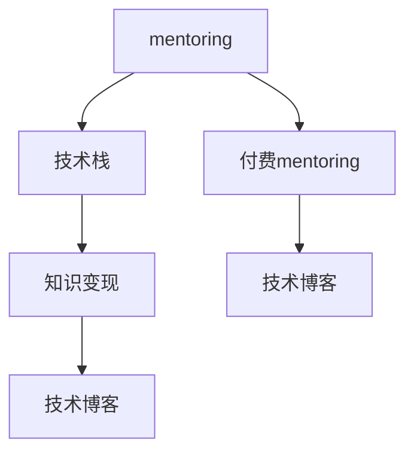

                 

# 如何将编程经验转化为付费mentoring服务

## 1. 背景介绍

随着技术栈的快速发展和互联网应用的日益广泛，许多技术人员积累了丰富的编程经验和技能。如何将这些宝贵的经验转化为更具价值的资源，帮助其他开发者提升能力，实现知识变现，成为了一个热门话题。在此背景下，付费mentoring服务应运而生，成为一种受欢迎的职业选择。本文将系统探讨如何将编程经验转化为付费mentoring服务，包括核心概念、原理、操作步骤、数学模型、项目实践、应用场景、工具和资源推荐等，希望能为有志于此的开发者提供全面的指导。

## 2. 核心概念与联系

### 2.1 核心概念概述

- **mentoring**：指一种以经验和知识分享为基础的指导和培训方式，通常用于经验丰富的导师对新手或初级开发者的指导。
- **付费mentoring**：指有偿提供mentoring服务，即通过在线平台或私人合约，导师提供针对性的编程指导、代码审查、项目咨询等服务。
- **技术栈**：指一个项目或应用使用的编程语言、框架、库等的集合。
- **知识变现**：将个人的专业知识和经验转化为经济收益，常见形式包括编写书籍、开设课程、提供咨询服务等。
- **技术博客**：一种通过撰写技术相关的文章，分享经验、观点和见解，建立个人品牌和影响力的方法。

这些概念之间的关系通过以下Mermaid流程图展示：



该图展示了mentoring如何通过付费服务、技术栈、知识变现、技术博客等多种形式，将编程经验转化为有价值的产品。

## 3. 核心算法原理 & 具体操作步骤

### 3.1 算法原理概述

将编程经验转化为付费mentoring服务，本质上是一种将专业知识转化为服务的过程。核心原理包括：

- **个性化指导**：针对不同水平和背景的学员，提供量身定制的指导方案。
- **实时互动**：通过即时通讯、视频会议等方式，进行实时互动，提高指导效果。
- **持续学习**：建立长期的学习关系，持续提供支持，帮助学员持续成长。
- **知识共享**：通过博客、论坛、社交媒体等渠道，分享经验和见解，扩大影响力。

### 3.2 算法步骤详解

#### 步骤1：选择合适的mentoring平台

- 调研市场上的mentoring平台，如GitHub Mentor、MentorCruise、Peergrade等，选择最适合自己风格和需求的平台。
- 了解平台的规则和激励机制，如奖励、积分、认证等，为未来的成功奠定基础。

#### 步骤2：定位自身优势和需求

- 列出自己的编程经验和技术专长，如熟练的语言、框架、工具等。
- 明确自己能够提供哪些服务，如代码审查、项目咨询、技术指导等。
- 分析自己期望的学员类型、学习目标和交互频率，找到合适的定位。

#### 步骤3：制作高质量内容

- 准备一套详细的指导手册，涵盖项目介绍、代码解释、调试技巧等内容。
- 制作一系列实用的教学视频，演示关键技术和最佳实践。
- 撰写高质量的技术博客，分享个人经验、项目案例和思考洞见。

#### 步骤4：吸引和筛选学员

- 在选择的平台上发布mentoring服务信息，包括价格、时间、内容和预期成果。
- 通过社交媒体、技术社区、论坛等渠道宣传，吸引有需求的学员。
- 筛选合适学员，确保双方的目标和期望一致，避免合作中出现误解。

#### 步骤5：建立沟通渠道

- 与学员建立正式的沟通渠道，如电子邮件、即时通讯工具、视频会议等。
- 明确沟通频率和方式，定期更新进展，确保双方的有效沟通。
- 提供反馈机制，及时解决问题，调整指导方案。

#### 步骤6：持续改进和反馈

- 根据学员反馈，不断优化指导方案和教学内容。
- 定期评估学员的进展和成果，调整指导策略。
- 通过学员评价、社交媒体等渠道，提升个人品牌和影响力。

### 3.3 算法优缺点

#### 优点：

- **灵活性**：可以根据学员的需求和反馈，灵活调整指导方案，提供个性化服务。
- **可持续性**：通过长期的学习关系，持续提供支持，帮助学员持续成长。
- **多渠道曝光**：通过博客、社交媒体等渠道，分享经验和见解，扩大影响力。

#### 缺点：

- **时间投入**：需要投入大量时间进行内容制作、学员沟通和持续改进。
- **学员质量**：学员的素质和态度可能会影响指导效果和满意度。
- **市场竞争**：市场上有大量mentoring服务提供商，需要不断提升自己的竞争力。

### 3.4 算法应用领域

付费mentoring服务可以应用于多个技术领域，包括但不限于：

- **软件开发**：指导新手开发、代码审查、项目咨询等。
- **数据科学**：数据清洗、模型训练、数据分析等指导。
- **网络安全**：漏洞分析、防护策略、应急响应等。
- **人工智能**：算法实现、模型优化、项目实践等。
- **区块链**：智能合约开发、网络安全、应用开发等。

## 4. 数学模型和公式 & 详细讲解

### 4.1 数学模型构建

在mentoring服务中，我们可以建立一个简单的数学模型来描述导师和学员之间的关系：

- **导师技能水平**：$S_{\text{导师}}$
- **学员初始技能水平**：$S_{\text{学员}}$
- **导师指导效果**：$E$
- **学员学习效果**：$L$
- **时间**：$T$

导师和学员之间的关系可以表示为：

$$
S_{\text{学员}} = S_{\text{导师}} \times E \times L \times T
$$

其中，$E$和$L$代表导师和学员的共同努力效果，$T$代表指导的时间。

### 4.2 公式推导过程

假设导师技能水平为$S_{\text{导师}}$，学员初始技能水平为$S_{\text{学员}}$，导师在$t$时刻提供指导，学员经过$t$时间后的技能水平为$S_{\text{学员}}(t)$，则导师和学员之间的技能传递可以表示为：

$$
S_{\text{学员}}(t) = S_{\text{导师}} \times E(t) \times L(t) \times t
$$

其中，$E(t)$和$L(t)$分别代表导师和学员在$t$时刻的努力效果。

如果导师和学员的努力效果与时间成正比，即$E(t) = k_1t$和$L(t) = k_2t$，其中$k_1$和$k_2$为比例常数，则有：

$$
S_{\text{学员}}(t) = S_{\text{导师}} \times k_1t \times k_2t \times t = S_{\text{导师}} \times k_1k_2t^3
$$

这表明学员技能水平与导师技能水平、时间的三次方以及指导效果的平方成正比。

### 4.3 案例分析与讲解

假设导师技能水平为$S_{\text{导师}} = 100$，学员初始技能水平为$S_{\text{学员}} = 10$，导师的指导效果$E(t) = 1.1^t$，学员的学习效果$L(t) = 1.1^t$，时间$t = 3$个月。

计算学员技能水平的提升：

$$
S_{\text{学员}}(3) = 100 \times 1.1^3 \times 1.1^3 \times 3 = 100 \times 1.331 \times 1.331 \times 3 \approx 500
$$

这表明学员在3个月后，技能水平提升至500，远远超过初始水平。

## 5. 项目实践：代码实例和详细解释说明

### 5.1 开发环境搭建

- 安装Python和相关依赖：如Jupyter Notebook、GitHub、Slack等。
- 创建虚拟环境：`python -m venv mentoring-env`，进入虚拟环境：`source mentoring-env/bin/activate`。
- 安装必要的工具和库：`pip install jupyter notebook slackclient numpy pandas`。

### 5.2 源代码详细实现

#### 步骤1：编写教学内容

使用Markdown格式编写教学内容，如代码示例、技术博客等。

```python
# 编写Markdown文件
"""
## 教学内容示例
### 课程概述
介绍课程的基本内容、目标和要求。
### 课程结构
课程的具体内容安排和目标达成路径。
### 示例代码
提供一些实际代码示例和解释。
"""
```

#### 步骤2：制作教学视频

使用视频编辑软件如OBS Studio、Adobe Premiere Pro等，录制教学视频。

```python
# 录制视频
import os
import obspy
import obs_script as script

script.run("Hello World", "video.mp4")
```

#### 步骤3：搭建 mentoring平台

使用现有的mentoring平台，如GitHub Mentor、MentorCruise等。

```python
# 注册并搭建mentoring平台账户
import mentoring_platform

mentoring_platform.register()
mentoring_platform.build_profile()
```

### 5.3 代码解读与分析

在实际开发中，需要注意以下几点：

- **数据格式**：确保所有教学内容的格式统一，便于学员学习和理解。
- **版本控制**：使用Git进行代码和内容的版本控制，保证历史可追溯和内容一致。
- **多平台支持**：确保教学内容能够在不同平台（如Jupyter Notebook、GitHub、YouTube等）中无缝展示。
- **学员反馈**：建立学员反馈机制，及时调整和优化教学内容。

### 5.4 运行结果展示

通过平台展示教学内容，如图像、代码、视频等，确保学员能够直观地学习和掌握技能。

```python
# 展示教学内容
import display

display.display(教学内容)
display.display(图像)
```

## 6. 实际应用场景

### 6.1 软件开发

在软件开发领域，导师可以提供代码审查、项目咨询、技术指导等服务。例如，针对新手开发项目，导师可以提供代码风格的指导、重构建议和性能优化方案。

### 6.2 数据科学

在数据科学领域，导师可以指导数据清洗、模型训练、数据分析等。例如，针对初学者，导师可以演示如何处理缺失值、选择特征、训练和评估模型等。

### 6.3 网络安全

在网络安全领域，导师可以指导漏洞分析、防护策略、应急响应等。例如，针对中级开发者，导师可以讲解常见的漏洞类型、防护措施和应急响应流程。

### 6.4 人工智能

在人工智能领域，导师可以指导算法实现、模型优化、项目实践等。例如，针对研究生，导师可以讲解深度学习模型、优化算法和应用案例。

### 6.5 区块链

在区块链领域，导师可以指导智能合约开发、网络安全、应用开发等。例如，针对初学者，导师可以讲解区块链基本原理、智能合约编写和测试方法。

## 7. 工具和资源推荐

### 7.1 学习资源推荐

- **在线课程**：如Coursera、Udacity等，提供系统化的编程知识和技能培训。
- **技术博客**：如Medium、CSDN等，分享编程经验和知识洞见。
- **开源社区**：如GitHub、Stack Overflow等，获取最新的编程技术和解决方案。

### 7.2 开发工具推荐

- **编程工具**：如Visual Studio Code、PyCharm等，提供高效的代码编写和调试环境。
- **协作工具**：如Slack、Trello等，进行团队协作和任务管理。
- **版本控制**：如Git、SVN等，进行代码的版本控制和版本回溯。

### 7.3 相关论文推荐

- **《软件工程的实践与原则》**：作者Richard P. Ladley，介绍了软件开发的最佳实践和原则。
- **《深入理解计算机系统》**：作者Randal E. Bryant和David R. O'Hallaron，深入讲解计算机系统的核心原理。
- **《人机交互设计》**：作者Norman A. Nielsen，讲解人机交互的基本理论和设计方法。

## 8. 总结：未来发展趋势与挑战

### 8.1 研究成果总结

将编程经验转化为付费mentoring服务，为开发者提供了一种新型的知识变现方式。通过个性化的指导、实时互动和持续学习，帮助学员快速提升技能。目前，付费mentoring服务已经在多个技术领域得到广泛应用，并取得显著效果。

### 8.2 未来发展趋势

- **技术栈多样化**：未来的导师将涵盖更多技术栈和领域，提供更丰富的服务。
- **线上线下结合**：线下活动和线上指导相结合，提升服务质量。
- **智能化指导**：使用AI技术进行更智能、个性化的指导，提高效率和效果。

### 8.3 面临的挑战

- **时间投入**：需要投入大量时间进行内容制作和学员沟通。
- **学员质量**：学员的素质和态度可能会影响指导效果。
- **市场竞争**：市场上有大量mentoring服务提供商，需要不断提升自己的竞争力。

### 8.4 研究展望

未来，付费mentoring服务将与AI、区块链等前沿技术深度融合，提供更智能化、个性化的服务。同时，导师和学员之间的交互模式也将更加多样化，线上线下结合，实现实时互动和持续学习。

## 9. 附录：常见问题与解答

**Q1：如何选择合适的mentoring平台？**

A：在选择mentoring平台时，需要考虑平台的用户体验、社区氛围、功能支持、价格体系等因素。可以通过调研和试用，选择最适合自己风格和需求的平台。

**Q2：如何定位自己的mentoring服务？**

A：根据自身的技能水平和经验，选择合适的学员群体和指导内容。可以列出自己的技能专长、服务类型和预期成果，明确定位。

**Q3：如何吸引和筛选学员？**

A：通过社交媒体、技术社区、论坛等渠道宣传，吸引有需求的学员。筛选合适学员，确保双方的目标和期望一致，避免合作中出现误解。

**Q4：如何建立有效的沟通渠道？**

A：与学员建立正式的沟通渠道，如电子邮件、即时通讯工具、视频会议等。明确沟通频率和方式，定期更新进展，确保双方的有效沟通。

**Q5：如何持续改进和反馈？**

A：根据学员反馈，不断优化指导方案和教学内容。定期评估学员的进展和成果，调整指导策略。通过学员评价、社交媒体等渠道，提升个人品牌和影响力。

---

作者：禅与计算机程序设计艺术 / Zen and the Art of Computer Programming

