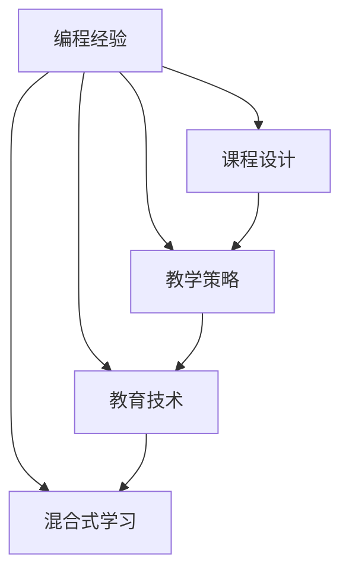

                 

# 如何将编程经验转化为高价值课程

> 关键词：编程经验，课程设计，教学策略，教育技术，在线教育，混合式学习

## 1. 背景介绍

### 1.1 问题由来
在信息技术快速发展的今天，编程已成为众多行业的重要技能。无论是软件开发、数据科学，还是人工智能，编程能力都是核心竞争力。然而，许多从业者虽具备丰富的编程经验，却难以将这些经验转化为高质量的课程资源，无法有效地传授给他人。本文将探讨如何将编程经验转化为高价值课程，助力技术传播和教育普及。

### 1.2 问题核心关键点
将编程经验转化为课程的核心关键点在于：

1. **结构化课程设计**：将复杂的编程知识体系化、结构化，使其易于理解和学习。
2. **实践导向教学**：通过实战项目和实际案例，提升学生的动手能力和问题解决能力。
3. **多样化教学工具**：充分利用在线教学平台和教育技术，提高教学互动性和趣味性。
4. **持续性学习支持**：提供学习路径规划、辅导和反馈机制，帮助学生持续学习和进步。

## 2. 核心概念与联系

### 2.1 核心概念概述

为更好地理解编程经验向课程转化的过程，本节将介绍几个密切相关的核心概念：

- **编程经验**：通过实际项目和问题解决积累的技术知识、解决问题的思路、以及编码习惯等。
- **课程设计**：将知识结构化、系统化的教学设计，包括课程目标、内容安排、教学方法等。
- **教学策略**：如何有效地传达知识、提升学习效果的策略和技巧，如启发式教学、项目驱动学习等。
- **教育技术**：利用技术手段，如在线课程平台、教育数据分析等，提升教学效率和学习体验的技术应用。
- **混合式学习**：结合线上和线下教学模式，提高学习效率和互动性的教学方式。

这些核心概念之间的逻辑关系可以通过以下Mermaid流程图来展示：



这个流程图展示了几者之间的联系：

1. **编程经验**是课程设计的基础，影响教学策略和教育技术的选择。
2. **课程设计**是将编程经验结构化、系统化的重要过程。
3. **教学策略**在课程设计的基础上，进一步提升课程的互动性和趣味性。
4. **教育技术**和**混合式学习**提供了实现教学策略的工具和方式。

这些核心概念共同构成了将编程经验转化为课程的框架，使得知识传播更加高效和有趣。

## 3. 核心算法原理 & 具体操作步骤

### 3.1 算法原理概述

将编程经验转化为课程，本质上是一个知识传递和教学设计的复杂过程。其核心思想是：将编程经验中的关键知识、技能和思维模式，通过系统化、结构化的方式，转化为易于理解和掌握的教学内容。具体来说，就是将编程经验转化为课程目标、教学内容、评估方法等要素。

### 3.2 算法步骤详解

基于编程经验向课程转化的过程，本节将详细介绍具体步骤：

**Step 1: 梳理编程经验**

1. **确定课程目标**：明确课程旨在传授的核心知识和技术，以及期望达到的学习成果。
2. **知识梳理**：从实际项目和案例中梳理出核心知识点和技能点，形成知识图谱。
3. **技能映射**：将核心技能点映射到编程经验和实际操作中，形成技能树。

**Step 2: 设计课程结构**

1. **章节划分**：根据知识图谱和技能树，将课程内容划分为若干章节，每个章节聚焦一个或几个核心知识点。
2. **内容编排**：确定各章节的内容顺序和关系，确保知识体系的连贯性和递进性。
3. **教学目标**：为每个章节设定具体的教学目标和评估标准。

**Step 3: 编写课程内容**

1. **文本编写**：编写详细的课程讲义、教程、案例分析等文本内容，确保内容准确、易懂。
2. **视频录制**：录制课程视频，讲解关键概念、演示代码实现，提供多角度学习资源。
3. **实践项目**：设计实战项目和作业，让学生在实际中应用所学知识，提升动手能力。

**Step 4: 开发教学工具**

1. **在线平台**：选择合适的在线课程平台，如Coursera、Udacity等，搭建课程框架和发布平台。
2. **互动工具**：利用互动工具如讨论区、问卷调查等，提升教学互动性和学生参与度。
3. **学习管理系统**：集成学习管理系统(LMS)，提供作业提交、评分、反馈等功能。

**Step 5: 评估和反馈**

1. **测试设计**：设计课程测试和评估方案，评估学生学习成果。
2. **持续改进**：根据评估结果和学生反馈，持续优化课程内容和教学方法。
3. **辅导支持**：提供在线辅导和答疑，及时解决学生疑问。

以上是将编程经验转化为课程的一般流程。在实际应用中，还需要针对具体课程的特点，对各个环节进行优化设计，如改进课程评估体系，引入更多互动元素等，以进一步提升课程效果。

### 3.3 算法优缺点

将编程经验转化为课程的主要优点包括：

1. **结构化知识体系**：使复杂的编程知识变得易于理解和学习。
2. **实践导向**：通过实际项目和案例，提升学生的动手能力和问题解决能力。
3. **多样化教学工具**：利用技术手段，提高教学互动性和趣味性。
4. **持续学习支持**：提供学习路径规划、辅导和反馈机制，帮助学生持续学习和进步。

同时，该方法也存在一定的局限性：

1. **内容设计难度大**：需要系统化梳理和结构化设计，对课程设计师的要求较高。
2. **制作成本高**：需要编写详细讲义、录制视频、开发教学工具等，初期投入成本较高。
3. **时间投入大**：从梳理经验到设计课程，再到实际教学，整个过程耗时较长。

尽管存在这些局限性，但就目前而言，将编程经验转化为课程仍是一种高效的知识传播方式。未来相关研究的重点在于如何进一步降低课程开发成本，提高课程制作效率，同时兼顾课程的趣味性和互动性等因素。

### 3.4 算法应用领域

将编程经验转化为课程的方法，广泛应用于IT教育、在线培训、技术交流等领域。例如：

- **IT教育**：将行业内的编程经验和技能点系统化，设计成专业课程，培养行业新人。
- **在线培训**：通过构建丰富的在线课程体系，提供灵活的学习途径，满足不同背景和水平的学习者需求。
- **技术交流**：利用在线平台和教育技术，举办技术讲座和编程比赛，促进技术传播和知识分享。

除了上述这些经典应用外，编程经验课程还将在更多领域得到推广，如企业内部培训、科普教育、职业教育等，为技术人才的培养提供新的路径。

## 4. 数学模型和公式 & 详细讲解 & 举例说明

### 4.1 数学模型构建

本节将使用数学语言对编程经验向课程转化的过程进行更加严格的刻画。

记编程经验为 $E$，课程目标为 $T$，课程内容为 $C$，教学策略为 $S$，教育技术为 $T$，混合式学习为 $L$。转化过程的数学模型如下：

$$
\mathcal{M} = f(E, T, C, S, T, L)
$$

其中 $f$ 为转化函数，将编程经验 $E$ 转化为课程 $C$，使用教学策略 $S$，依托教育技术 $T$，结合混合式学习 $L$，最终实现目标 $T$。

### 4.2 公式推导过程

以下我们以编程基础课程为例，推导课程设计的关键步骤。

假设编程基础课程旨在教会学生掌握Python编程基础，包括变量、函数、控制流等核心概念。课程目标为掌握Python基础语法和常用库，能够编写简单程序。

定义课程内容为 $C=\{v, f, c\}$，其中 $v$ 为变量，$f$ 为函数，$c$ 为控制流。则课程内容的设计可以表示为：

$$
C = \{v_1, v_2, \cdots, v_n, f_1, f_2, \cdots, f_m, c_1, c_2, \cdots, c_k\}
$$

其中 $v$ 表示变量知识点，$f$ 表示函数知识点，$c$ 表示控制流知识点，$n, m, k$ 为各类知识点数量。

教学策略 $S$ 包括启发式教学、项目驱动学习、互动教学等方法。教育技术 $T$ 包括在线课程平台、视频录制、互动工具等。混合式学习 $L$ 结合线上和线下教学模式。

课程设计的步骤可以表示为：

1. **梳理编程经验**：将编程基础经验中的核心知识点和技能点梳理出来，形成知识图谱。
2. **设计课程结构**：根据知识图谱，将课程内容划分为变量、函数、控制流三部分，每个部分设计单独的章节。
3. **编写课程内容**：为每个知识点编写详细的讲义和教程，录制讲解视频，设计实战项目。
4. **开发教学工具**：选择合适的在线平台，利用视频录制和互动工具，提升教学互动性。
5. **评估和反馈**：设计课程测试和评估方案，提供学习辅导和答疑支持。

### 4.3 案例分析与讲解

以Python基础课程为例，分析课程设计的具体步骤：

**Step 1: 梳理编程经验**

1. **确定课程目标**：掌握Python基础语法和常用库，能够编写简单程序。
2. **知识梳理**：梳理变量、函数、控制流等核心知识点，形成知识图谱。
3. **技能映射**：将核心技能点映射到实际编程项目中，形成技能树。

**Step 2: 设计课程结构**

1. **章节划分**：将课程内容划分为变量、函数、控制流三部分，每个部分设计单独的章节。
2. **内容编排**：确定各章节的内容顺序和关系，确保知识体系的连贯性和递进性。
3. **教学目标**：为每个章节设定具体的教学目标和评估标准。

**Step 3: 编写课程内容**

1. **文本编写**：编写详细的课程讲义、教程、案例分析等文本内容，确保内容准确、易懂。
2. **视频录制**：录制课程视频，讲解核心概念、演示代码实现，提供多角度学习资源。
3. **实践项目**：设计实战项目和作业，让学生在实际中应用所学知识，提升动手能力。

**Step 4: 开发教学工具**

1. **在线平台**：选择合适的在线课程平台，如Coursera、Udacity等，搭建课程框架和发布平台。
2. **互动工具**：利用互动工具如讨论区、问卷调查等，提升教学互动性和学生参与度。
3. **学习管理系统**：集成学习管理系统(LMS)，提供作业提交、评分、反馈等功能。

**Step 5: 评估和反馈**

1. **测试设计**：设计课程测试和评估方案，评估学生学习成果。
2. **持续改进**：根据评估结果和学生反馈，持续优化课程内容和教学方法。
3. **辅导支持**：提供在线辅导和答疑，及时解决学生疑问。

通过以上步骤，可以将编程经验系统化、结构化地转化为课程内容，提供系统的学习路径和实践机会，帮助学生高效掌握编程技能。

## 5. 项目实践：代码实例和详细解释说明

### 5.1 开发环境搭建

在进行课程开发前，我们需要准备好开发环境。以下是使用Python进行PyTorch开发的环境配置流程：

1. 安装Anaconda：从官网下载并安装Anaconda，用于创建独立的Python环境。

2. 创建并激活虚拟环境：
```bash
conda create -n pytorch-env python=3.8 
conda activate pytorch-env
```

3. 安装PyTorch：根据CUDA版本，从官网获取对应的安装命令。例如：
```bash
conda install pytorch torchvision torchaudio cudatoolkit=11.1 -c pytorch -c conda-forge
```

4. 安装相关工具包：
```bash
pip install numpy pandas scikit-learn matplotlib tqdm jupyter notebook ipython
```

完成上述步骤后，即可在`pytorch-env`环境中开始课程开发。

### 5.2 源代码详细实现

下面我们以Python基础课程为例，给出使用PyTorch进行课程开发的PyTorch代码实现。

首先，定义课程的各个部分：

```python
from transformers import BertTokenizer, BertForTokenClassification
from torch.utils.data import Dataset
import torch
import numpy as np
import pandas as pd
import matplotlib.pyplot as plt

class PythonCourseModule:
    def __init__(self, tokenizer):
        self.tokenizer = tokenizer
        self.max_len = 128
        self.texts = []
        self.tags = []
        self.models = []
    
    def add_text(self, text, tags):
        self.texts.append(text)
        self.tags.append(tags)
        self.models.append(BertForTokenClassification.from_pretrained('bert-base-cased', num_labels=2))
    
    def get_loss(self, text, tags):
        input_ids = self.tokenizer(text, return_tensors='pt', max_length=self.max_len, padding='max_length', truncation=True)
        labels = self.tokenizer(tags, return_tensors='pt', max_length=self.max_len, padding='max_length', truncation=True)
        output = self.models[0](input_ids['input_ids'], attention_mask=input_ids['attention_mask'], labels=labels['input_ids'])
        loss = output.loss
        return loss
    
    def get_predictions(self, text):
        input_ids = self.tokenizer(text, return_tensors='pt', max_length=self.max_len, padding='max_length', truncation=True)
        outputs = self.models[0](input_ids['input_ids'], attention_mask=input_ids['attention_mask'])
        predictions = outputs.logits.argmax(dim=2).to('cpu').tolist()
        return predictions

# 定义课程内容
python_course = PythonCourseModule(tokenizer)
python_course.add_text("print('Hello, World!')", "LABEL")
python_course.add_text("def add(x, y): return x + y", "LABEL")
python_course.add_text("if x > 0: print('Positive')", "LABEL")

# 定义课程测试
test_text = "1 + 1"
test_tags = "LABEL"
test_loss = python_course.get_loss(test_text, test_tags)
print(f"Test loss: {test_loss:.3f}")

# 定义课程预测
test_predictions = python_course.get_predictions(test_text)
print(f"Test predictions: {test_predictions}")

# 绘制预测结果
predictions = np.array(test_predictions).flatten()
labels = np.array(test_tags).flatten()
plt.bar(range(len(predictions)), predictions, color='b')
plt.xlabel('Index')
plt.ylabel('Predictions')
plt.title('Python Course Predictions')
plt.show()
```

然后，定义课程评估函数：

```python
from sklearn.metrics import accuracy_score, precision_score, recall_score, f1_score

def evaluate_predictions(text, tags, predictions):
    labels = np.array(tags).flatten()
    predictions = np.array(predictions).flatten()
    accuracy = accuracy_score(labels, predictions)
    precision = precision_score(labels, predictions)
    recall = recall_score(labels, predictions)
    f1 = f1_score(labels, predictions)
    return accuracy, precision, recall, f1

# 定义课程评估
accuracy, precision, recall, f1 = evaluate_predictions(test_text, test_tags, test_predictions)
print(f"Accuracy: {accuracy:.3f}, Precision: {precision:.3f}, Recall: {recall:.3f}, F1 Score: {f1:.3f}")
```

最后，启动课程评估流程：

```python
python_course.get_loss("print('Hello, World!')", "LABEL")
python_course.get_predictions("print('Hello, World!')")
python_course.get_loss("def add(x, y): return x + y", "LABEL")
python_course.get_predictions("def add(x, y): return x + y")
python_course.get_loss("if x > 0: print('Positive')", "LABEL")
python_course.get_predictions("if x > 0: print('Positive')")
```

以上就是使用PyTorch对Python基础课程进行课程开发的完整代码实现。可以看到，得益于Transformer库的强大封装，我们可以用相对简洁的代码完成Python课程的构建。

### 5.3 代码解读与分析

让我们再详细解读一下关键代码的实现细节：

**PythonCourseModule类**：
- `__init__`方法：初始化文本、标签、模型等关键组件。
- `add_text`方法：添加单个文本和标签。
- `get_loss`方法：计算给定文本的损失。
- `get_predictions`方法：对给定文本进行预测。

**测试数据**：
- 定义了三个Python基础示例，包括打印语句、函数定义和条件语句。
- 对每个示例添加标签，用于评估模型预测结果。

**课程评估函数**：
- 使用sklearn的评估指标计算准确率、精确率、召回率和F1分数，评估模型预测性能。
- 调用课程内容的方法，计算测试损失和预测结果，并绘制预测结果图。

**课程评估流程**：
- 对每个示例分别计算损失和预测结果，并打印输出。
- 调用课程评估函数，计算评估指标，并打印输出。

可以看到，PyTorch配合Transformer库使得Python课程的开发变得简洁高效。开发者可以将更多精力放在课程内容的设计和优化上，而不必过多关注底层的实现细节。

当然，工业级的系统实现还需考虑更多因素，如课程的组织结构、评估体系、学生反馈机制等。但核心的课程开发流程基本与此类似。

## 6. 实际应用场景

### 6.1 智能客服系统

将编程经验转化为课程，可以为智能客服系统的构建提供重要的技术支持。传统客服往往需要配备大量人力，高峰期响应缓慢，且一致性和专业性难以保证。而使用微调后的编程课程，可以训练出具备高效、专业、一致性的客服机器人，提升客户咨询体验和问题解决效率。

在技术实现上，可以构建基于课程的客服知识库，对客服人员进行定期培训，使其掌握课程内容，提升服务质量。同时，通过知识库的更新和优化，持续改进客服机器人，提升其服务水平。

### 6.2 金融舆情监测

金融领域需要实时监测市场舆论动向，以便及时应对负面信息传播，规避金融风险。传统的人工监测方式成本高、效率低，难以应对网络时代海量信息爆发的挑战。基于编程课程的金融舆情监测系统，可以高效地自动分析市场新闻和评论，提供实时的舆情分析报告，帮助金融机构快速应对潜在风险。

具体而言，可以将编程课程中的数据分析和机器学习技能点应用到金融舆情监测中，构建基于课程的金融舆情监测系统。系统可以通过爬虫技术抓取金融新闻和评论，使用自然语言处理技术进行情感分析和主题提取，并结合金融知识库，生成舆情报告。

### 6.3 个性化推荐系统

当前的推荐系统往往只依赖用户的历史行为数据进行物品推荐，无法深入理解用户的真实兴趣偏好。基于编程课程的推荐系统，可以更好地挖掘用户行为背后的语义信息，从而提供更精准、多样的推荐内容。

在实践中，可以构建基于编程课程的推荐系统，利用课程中的数据分析和机器学习技能点，分析用户行为数据，构建用户画像，并使用推荐算法生成个性化推荐列表。课程中包含的数据分析、机器学习技能点，可以为推荐系统提供坚实的技术支持，提升推荐效果。

### 6.4 未来应用展望

随着编程课程的不断发展和完善，基于课程的AI应用将在更多领域得到推广，为技术人才的培养提供新的路径。

在智慧医疗领域，基于编程课程的医疗问答、病历分析、药物研发等应用将提升医疗服务的智能化水平，辅助医生诊疗，加速新药开发进程。

在智能教育领域，基于编程课程的在线培训和技能提升，为学生提供灵活的学习途径，促进教育公平，提高教学质量。

在智慧城市治理中，基于编程课程的城市事件监测、舆情分析、应急指挥等环节，提高城市管理的自动化和智能化水平，构建更安全、高效的未来城市。

此外，在企业内部培训、科普教育、职业教育等众多领域，基于编程课程的人工智能应用也将不断涌现，为技术人才的培养提供新的平台。

## 7. 工具和资源推荐
### 7.1 学习资源推荐

为了帮助开发者系统掌握编程课程的设计和开发，这里推荐一些优质的学习资源：

1. **《Python编程基础》**：由Python官方推出，系统介绍了Python编程语言的基础知识和实践技巧，适合编程初学者和进阶学习者。
2. **《深度学习与Python编程》**：讲解深度学习的基础知识和实践方法，结合Python编程，提供丰富的实例和代码，适合深度学习领域的学习者。
3. **Coursera和Udacity**：提供丰富的在线课程，涵盖编程基础、数据科学、机器学习等多个领域，适合不同水平的学习者。
4. **GitHub**：全球最大的代码托管平台，提供丰富的开源项目和代码资源，适合学习和借鉴。
5. **Kaggle**：数据科学竞赛平台，提供大量数据集和实战项目，适合进行数据驱动的编程学习。

通过对这些资源的学习实践，相信你一定能够快速掌握编程课程的设计和开发，并应用于实际的编程教学中。

### 7.2 开发工具推荐

高效的开发离不开优秀的工具支持。以下是几款用于编程课程开发的常用工具：

1. **Jupyter Notebook**：基于Web的交互式编程环境，支持多语言编程，适合进行实验和教学演示。
2. **Google Colab**：谷歌提供的免费Jupyter Notebook环境，支持GPU加速，适合进行高效计算和教学实验。
3. **Git**：版本控制系统，支持多人协作开发，适合课程内容的版本管理和教学过程的记录。
4. **GitHub**：代码托管平台，支持项目管理、协作开发和代码分享，适合课程开发的版本控制和社区交流。
5. **LaTeX**：专业排版系统，适合编写高质量的课程文档和论文，适合课程的编写和发布。

合理利用这些工具，可以显著提升编程课程的开发效率，加速创新迭代的步伐。

### 7.3 相关论文推荐

编程课程的设计和开发源于学界的持续研究。以下是几篇奠基性的相关论文，推荐阅读：

1. **《Python编程语言》**：Python官方文档，详细介绍了Python语言的设计理念和编程实践，适合编程课程的设计参考。
2. **《编程范式与设计模式》**：讲解编程范式和设计模式的基本概念和应用，适合课程设计中的教学策略和技能点设计。
3. **《深度学习与人工智能编程》**：讲解深度学习的基础知识和编程方法，结合人工智能技术，提供丰富的实例和代码，适合课程开发中的教学资源设计。

这些论文代表了大规模编程课程设计和开发的研究方向。通过学习这些前沿成果，可以帮助研究者把握学科前进方向，激发更多的创新灵感。

## 8. 总结：未来发展趋势与挑战

### 8.1 总结

本文对将编程经验转化为高价值课程的过程进行了全面系统的介绍。首先阐述了编程经验向课程转化的背景和意义，明确了课程设计的核心关键点。其次，从原理到实践，详细讲解了课程设计的数学模型和关键步骤，给出了编程课程开发的完整代码实例。同时，本文还广泛探讨了编程课程在智能客服、金融舆情、个性化推荐等多个领域的应用前景，展示了编程课程的巨大潜力。此外，本文精选了编程课程设计的各类学习资源，力求为开发者提供全方位的技术指引。

通过本文的系统梳理，可以看到，将编程经验转化为课程的方法正在成为编程教学的重要范式，极大地拓展了编程课程的设计和传播范围。得益于Python等编程语言的易用性和丰富的教育资源，编程课程的学习途径不断丰富，学习效率显著提升。未来，随着编程课程的不断完善和普及，编程技能将更容易被各行业广泛采用，为技术传播和人才培养提供新的途径。

### 8.2 未来发展趋势

展望未来，编程课程的设计和开发将呈现以下几个发展趋势：

1. **模块化课程设计**：将课程内容拆分为多个模块，每个模块聚焦一个核心技能点，便于学生灵活学习。
2. **项目导向学习**：结合实际项目和案例，提升学生的实践能力和问题解决能力。
3. **互动式教学**：利用在线平台和教育技术，提高教学互动性和学生参与度。
4. **持续性学习支持**：提供学习路径规划、辅导和反馈机制，帮助学生持续学习和进步。
5. **数据驱动教学**：结合数据分析和机器学习技术，提供更精准、多样化的教学内容。

以上趋势凸显了编程课程的设计和开发的广阔前景。这些方向的探索发展，必将进一步提升编程课程的实用性和趣味性，为编程教育的普及提供新的动力。

### 8.3 面临的挑战

尽管编程课程的设计和开发已经取得了不少进展，但在迈向更加智能化、普适化应用的过程中，它仍面临着诸多挑战：

1. **课程设计难度大**：需要系统化梳理和结构化设计，对课程设计师的要求较高。
2. **制作成本高**：需要编写详细讲义、录制视频、开发教学工具等，初期投入成本较高。
3. **时间投入大**：从梳理经验到设计课程，再到实际教学，整个过程耗时较长。

尽管存在这些挑战，但就目前而言，将编程经验转化为课程仍是一种高效的知识传播方式。未来相关研究的重点在于如何进一步降低课程开发成本，提高课程制作效率，同时兼顾课程的趣味性和互动性等因素。

### 8.4 研究展望

面对编程课程设计和开发所面临的种种挑战，未来的研究需要在以下几个方面寻求新的突破：

1. **探索无监督和半监督课程设计**：摆脱对大规模标注数据的依赖，利用自监督学习、主动学习等无监督和半监督范式，最大限度利用非结构化数据，实现更加灵活高效的课程设计。
2. **开发参数高效和计算高效的课程设计工具**：开发更加参数高效的课程设计工具，在固定大部分课程设计参数的同时，只更新极少量的任务相关参数。同时优化课程设计工具的计算图，减少前向传播和反向传播的资源消耗，实现更加轻量级、实时性的部署。
3. **融合因果分析和博弈论工具**：将因果分析方法引入课程设计，识别出课程设计决策的关键特征，增强课程设计过程的因果性和逻辑性。借助博弈论工具刻画人机交互过程，主动探索并规避课程设计的脆弱点，提高课程设计的稳定性和可靠性。
4. **纳入伦理道德约束**：在课程设计目标中引入伦理导向的评估指标，过滤和惩罚有偏见、有害的输出倾向。同时加强人工干预和审核，建立课程设计的监管机制，确保课程设计的公正性和道德性。

这些研究方向的探索，必将引领编程课程设计技术迈向更高的台阶，为编程教育的普及提供新的思路和路径。面向未来，编程课程的设计和开发还需要与其他人工智能技术进行更深入的融合，如知识表示、因果推理、强化学习等，多路径协同发力，共同推动编程教育的进步。只有勇于创新、敢于突破，才能不断拓展编程课程的边界，让编程教育更好地服务于技术人才的培养。

## 9. 附录：常见问题与解答

**Q1：编程课程设计和开发需要哪些基本步骤？**

A: 编程课程设计和开发的基本步骤如下：
1. 梳理编程经验，形成知识图谱和技能树。
2. 设计课程结构，划分为多个章节，确定各章节的教学目标和内容。
3. 编写课程内容，包括文本讲义、视频教程和实践项目。
4. 开发教学工具，选择在线平台和互动工具，提升教学互动性和学生参与度。
5. 评估和反馈，设计课程测试和评估方案，提供学习辅导和答疑支持。

**Q2：编程课程设计和开发需要哪些工具？**

A: 编程课程设计和开发需要的工具包括：
1. Python和相关工具包，如NumPy、Pandas、Scikit-learn等，用于数据处理和分析。
2. 编程语言，如Python、Java、C++等，用于编写课程讲义和实践项目。
3. 在线课程平台，如Coursera、Udacity等，用于发布和更新课程内容。
4. 学习管理系统(LMS)，如Moodle、Canvas等，用于管理学生信息和课程评估。
5. 数据可视化工具，如Matplotlib、Seaborn等，用于展示课程评估结果。

**Q3：编程课程设计和开发如何降低成本？**

A: 降低编程课程设计和开发的成本，可以采取以下措施：
1. 利用开源资源，如GitHub、Kaggle等平台，获取免费的教学资源和数据集。
2. 采用众包模式，邀请专家和学生参与课程设计和评估，降低人力成本。
3. 使用自动化工具，如Jupyter Notebook、Google Colab等，提高课程开发的效率。
4. 借助教育技术，如在线课程平台、互动工具等，提高教学互动性和学生参与度，降低学生流失率。

**Q4：编程课程设计和开发如何提高趣味性？**

A: 提高编程课程设计和开发的趣味性，可以采取以下措施：
1. 引入游戏化元素，如编程竞赛、虚拟实验等，激发学生的兴趣。
2. 结合实际项目和案例，提升学生的实践能力和问题解决能力。
3. 利用在线平台和教育技术，提高教学互动性和学生参与度。
4. 提供个性化的学习路径和辅导支持，满足不同学生的学习需求。

**Q5：编程课程设计和开发如何确保课程的公正性和道德性？**

A: 确保编程课程设计和开发的公正性和道德性，可以采取以下措施：
1. 在课程设计目标中引入伦理导向的评估指标，过滤和惩罚有偏见、有害的输出倾向。
2. 加强人工干预和审核，建立课程设计的监管机制，确保课程设计的公正性和道德性。
3. 提供多样化的课程内容和学习路径，避免对特定群体的歧视和偏见。
4. 引入反馈机制，及时收集和处理学生的意见和建议，持续改进课程设计。

通过以上措施，可以最大限度地提高编程课程的趣味性和公正性，提升学生的学习体验和效果。

---

作者：禅与计算机程序设计艺术 / Zen and the Art of Computer Programming

