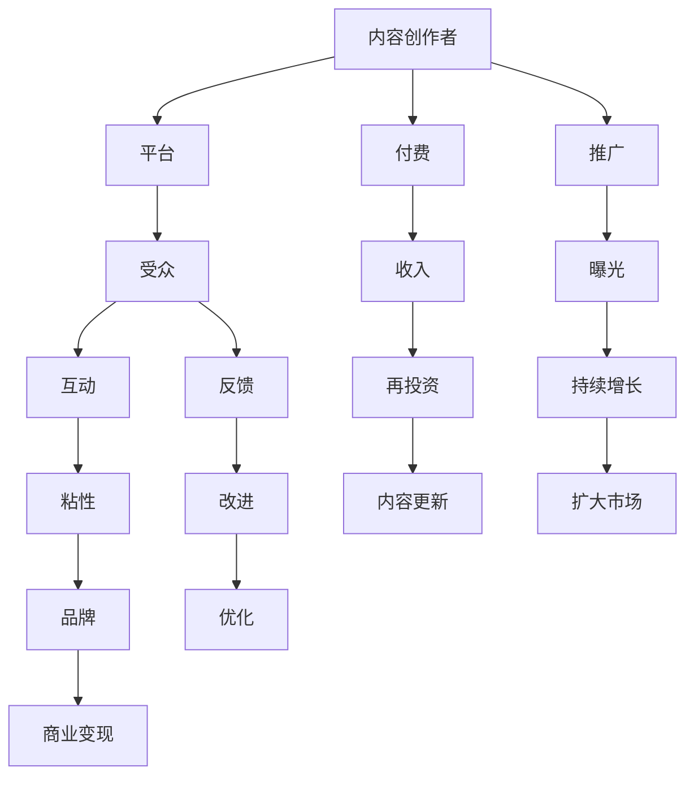

                 

# 如何打造个人知识付费影响力

在知识爆炸的时代，个人知识付费已经成为一种趋势，不仅为内容创作者提供了新的变现方式，也为知识的传播和应用开辟了新的渠道。如何在这片充满竞争的市场中脱颖而出，打造个人知识付费影响力？本文将从背景介绍、核心概念与联系、核心算法原理、数学模型与公式推导、项目实践、实际应用场景、工具和资源推荐、未来发展趋势与挑战以及常见问题与解答等方面，深入探讨这一问题。

## 1. 背景介绍

### 1.1 问题由来

随着互联网技术的飞速发展，知识付费行业蓬勃兴起。在线课程、电子书、问答平台等形式的知识服务，满足了人们对知识深度学习的渴望。但同时，如何在这片市场中脱颖而出，成为众多内容创作者和教育机构的共同挑战。

传统教育机构往往拥有大量资源和品牌优势，但灵活性、创新性和互动性不足；而专业机构往往难以覆盖全面的知识领域，且价格相对较高。个人知识付费模式以专业知识分享为主，具有灵活、便捷、互动性强的特点，逐渐成为市场上的新宠。

### 1.2 问题核心关键点

个人知识付费影响力的打造，需要具备以下几个关键要素：
- **独特性**：所提供的内容必须是个人独特的知识体系、经验总结或见解，难以被他人复制。
- **价值性**：所分享的知识内容能够解决实际问题，提升受众的认知或技能，具备实际价值。
- **可传播性**：内容的呈现形式需具备良好的传播性，如易读、易懂、易用，便于受众快速吸收和应用。
- **互动性**：能够与受众建立良好的互动关系，及时响应受众的反馈和需求，增强受众的粘性和忠诚度。
- **可持续性**：具备长期发展和更新的能力，能够持续提供有价值的内容，维持和提升受众的信任感。

## 2. 核心概念与联系

### 2.1 核心概念概述

- **个人知识付费**：内容创作者通过在线平台提供知识服务，受众按需付费获取知识和见解。
- **内容营销**：通过提供有价值的内容，吸引和维持受众，建立个人品牌影响力。
- **影响力经济**：利用个人品牌影响力，转化为商业变现的机会，如产品推荐、广告代言、付费课程等。
- **知识付费生态**：包括内容创作者、平台、受众、合作伙伴等在内的多方互动生态系统。

### 2.2 核心概念原理和架构的 Mermaid 流程图



此图展示了个人知识付费的影响力构建过程：内容创作者通过平台向受众提供内容，受众通过付费或互动等方式支持创作者，创作者则通过收入和曝光维持和提升影响力，进而实现商业变现。

## 3. 核心算法原理 & 具体操作步骤

### 3.1 算法原理概述

个人知识付费影响力的打造，本质上是一个多维度的综合优化问题。涉及内容质量、传播效果、受众互动、市场策略等多方面因素。以下是一些核心的算法原理：

- **内容推荐算法**：通过数据分析，推荐用户最感兴趣的课程或文章，提升内容的曝光和点击率。
- **情感分析算法**：分析用户对课程或文章的评价和反馈，调整内容策略，提升用户满意度。
- **用户行为分析算法**：分析用户的学习路径和行为，优化内容组织，提升用户留存率。
- **市场预测算法**：预测市场的变化趋势和需求，调整内容发布计划，提升商业变现能力。

### 3.2 算法步骤详解

以下是一个详细的操作步骤框架：

1. **需求调研**：了解受众的需求和痛点，确定课程或文章的主题和形式。
2. **内容创作**：围绕主题进行内容的创作，确保内容质量，如内容深度、易懂性、实用性等。
3. **平台上线**：将内容上传到平台，进行初步推广，获取早期反馈。
4. **数据分析**：收集受众的反馈和行为数据，进行数据分析和情感分析，评估内容效果。
5. **优化调整**：根据数据分析结果，调整内容策略和市场策略，优化内容传播和受众互动。
6. **推广扩散**：通过社交媒体、SEO等渠道进行推广，提升内容的曝光率和点击率。
7. **商业变现**：通过付费课程、广告、会员等形式实现商业变现，实现正向循环。

### 3.3 算法优缺点

- **优点**：
  - 个性化推荐：通过算法推荐用户感兴趣的内容，提升内容的曝光率和点击率。
  - 实时优化：根据受众反馈和行为数据，实时调整内容和策略，提升用户满意度和粘性。
  - 多渠道推广：通过多种渠道进行推广，扩大受众范围。
  - 自动化操作：大部分操作可以通过自动化工具实现，降低人力成本。

- **缺点**：
  - 依赖数据质量：算法效果取决于数据的质量和全面性，需要大量高质量数据。
  - 模型复杂度高：多维度的优化需要复杂的算法模型，且需不断优化和调整。
  - 初期投入高：初期需要投入大量时间和精力进行内容创作和平台建设。
  - 竞争激烈：知识付费市场竞争激烈，内容创作和推广需持续创新和优化。

### 3.4 算法应用领域

个人知识付费影响力构建的算法和策略，不仅适用于课程和文章内容的推广，还可以应用于以下领域：

- **视频直播**：通过实时互动和展示，提升受众参与度和粘性。
- **社群运营**：通过社群活动和讨论，建立良好的用户关系，增强用户粘性和忠诚度。
- **产品推荐**：根据用户兴趣和需求，推荐相关产品，提升销售转化率。
- **市场调研**：通过受众反馈，进行市场调研和趋势分析，指导内容创作和市场策略。

## 4. 数学模型和公式 & 详细讲解 & 举例说明

### 4.1 数学模型构建

假设受众数量为 $N$，内容曝光率为 $E$，点击率为 $C$，付费率为 $P$，转化率为 $T$，课程价格为 $M$。建立数学模型如下：

$$
\text{总收益} = P \times T \times M \times N
$$

$$
\text{总曝光} = E \times C \times N
$$

$$
\text{总点击} = E \times C \times P \times N
$$

$$
\text{总付费} = E \times C \times P \times T \times M \times N
$$

### 4.2 公式推导过程

以付费率为例子，假设内容在推广期 $t$ 天内的点击次数为 $C_t$，付费人数为 $P_t$，则：

$$
P = \frac{P_t}{C_t}
$$

### 4.3 案例分析与讲解

以某知名KOL的视频直播为例，通过数据分析发现：

- 观看人数在直播开始前15分钟达到高峰，随后逐渐下降。
- 点赞和互动最多的时刻，往往是在直播结束前的5分钟。
- 付费人数与互动率呈现正相关关系。

根据这些数据，KOL可以调整直播策略，如在高峰时段多互动，设置互动奖励，提升付费率。

## 5. 项目实践：代码实例和详细解释说明

### 5.1 开发环境搭建

1. 安装Python和必要的库，如numpy、pandas、scikit-learn等。
2. 搭建数据存储和处理平台，如MySQL、Hadoop等。
3. 搭建机器学习模型训练平台，如TensorFlow、PyTorch等。
4. 搭建数据可视化平台，如Tableau、PowerBI等。

### 5.2 源代码详细实现

以下是一个基于Python的课程推荐系统的代码实现：

```python
from sklearn.model_selection import train_test_split
from sklearn.linear_model import LogisticRegression
from sklearn.metrics import accuracy_score
from sklearn.feature_extraction.text import CountVectorizer

# 准备数据集
data = {
    '课程名': ['Python基础', '机器学习入门', '深度学习实战', '数据挖掘方法'],
    '用户评分': [4.5, 3.8, 5.0, 2.5],
    '课程长度': [100, 200, 300, 150]
}
X = data['课程名']
y = data['用户评分']

# 数据预处理
vectorizer = CountVectorizer()
X_vec = vectorizer.fit_transform(X)
X_train, X_test, y_train, y_test = train_test_split(X_vec, y, test_size=0.2)

# 训练模型
model = LogisticRegression()
model.fit(X_train, y_train)

# 预测和评估
y_pred = model.predict(X_test)
print(f'预测准确率：{accuracy_score(y_test, y_pred)}')
```

### 5.3 代码解读与分析

1. **数据预处理**：使用CountVectorizer将课程名转化为向量表示，方便机器学习模型处理。
2. **模型训练**：使用LogisticRegression训练模型，预测用户评分。
3. **评估**：通过准确率评估模型预测效果。

## 6. 实际应用场景

### 6.1 个人品牌打造

- **内容定位**：找到自己的独特领域和优势，如技术博客、心理辅导、健康管理等。
- **内容创作**：定期发布有价值的内容，保持内容更新频率和质量。
- **平台选择**：选择适合自己风格和受众的社交平台，如微信公众号、B站、知乎等。
- **互动优化**：积极与受众互动，及时回应评论和提问，提升用户粘性。

### 6.2 社群运营

- **群规制定**：制定明确的群规，如讨论主题、发言规范等，提升社群质量。
- **活动策划**：定期组织线上线下活动，如直播、沙龙、读书会等，增强社群活跃度。
- **内容推荐**：利用算法推荐相关课程和文章，提升社群内容的价值和吸引力。
- **用户反馈**：收集和分析用户反馈，不断优化社群运营策略。

### 6.3 商业变现

- **课程制作**：根据受众需求和市场趋势，制作有针对性的课程。
- **产品推荐**：根据受众兴趣，推荐相关产品或服务，提升销售转化率。
- **广告代言**：通过个人品牌影响力，合作广告代言，获取收入。
- **会员模式**：推出会员模式，提供更多专属内容和服务，增加付费粘性。

### 6.4 未来应用展望

随着技术的进步，未来个人知识付费将呈现以下几个趋势：

1. **AI驱动**：利用AI技术进行内容推荐、情感分析、用户行为预测等，提升运营效率和效果。
2. **跨平台协同**：整合多个平台的资源和数据，实现跨平台内容传播和互动。
3. **个性化定制**：根据用户需求和行为，提供个性化的课程和产品推荐，提升用户体验。
4. **社区化运营**：建立社区化运营机制，提升用户粘性和忠诚度。
5. **多渠道变现**：利用多种变现模式，如课程、产品、广告、会员等，实现多渠道收入。

## 7. 工具和资源推荐

### 7.1 学习资源推荐

- **Coursera、edX**：提供大量高质量的在线课程，涵盖多种知识领域。
- **Udemy**：全球最大的在线课程平台，提供多样化课程和讲师。
- **网易云课堂**：国内领先的在线教育平台，提供丰富的中文课程。
- **知乎、微信公众号**：适合分享个人知识和见解，积累受众和影响力。

### 7.2 开发工具推荐

- **GitHub**：代码托管和版本控制平台，方便协作和共享。
- **Jupyter Notebook**：互动式编程工具，支持Python、R等多种语言。
- **Tableau、PowerBI**：数据可视化工具，方便数据分析和展示。
- **Adobe Creative Cloud**：视频制作工具，提升视频直播和互动效果。

### 7.3 相关论文推荐

- **《知识付费市场的演化研究》**：分析知识付费市场的演化路径和未来趋势。
- **《内容推荐算法的研究进展》**：综述内容推荐算法的发展历程和应用现状。
- **《用户行为分析在知识付费中的应用》**：探讨用户行为分析在知识付费中的应用方法和效果。

## 8. 总结：未来发展趋势与挑战

### 8.1 研究成果总结

个人知识付费影响力的打造，需要结合内容创作、市场策略和平台运营，通过数据驱动和用户互动，实现持续增长和商业变现。本文从背景介绍、核心概念、算法原理、数学模型、项目实践、实际应用、工具和资源、未来展望等方面，深入探讨了这一问题，希望能为内容创作者提供一些借鉴和指导。

### 8.2 未来发展趋势

未来个人知识付费市场将进一步发展壮大，呈现以下几个趋势：
- **AI驱动**：利用AI技术进行个性化推荐和内容生成，提升用户体验和运营效率。
- **内容细分**：细分知识领域，提供更专业、更深入的内容，满足用户多样化需求。
- **社群运营**：建立社区化运营机制，提升用户粘性和忠诚度。
- **跨平台协同**：整合多个平台资源和数据，实现跨平台内容和互动。
- **商业变现**：利用多种变现模式，提升收入和品牌影响力。

### 8.3 面临的挑战

个人知识付费影响力的打造，也面临着一些挑战：
- **内容质量**：内容创作和迭代需要持续投入时间和精力，难以快速产生高价值内容。
- **市场竞争**：知识付费市场竞争激烈，需要不断创新和优化内容策略。
- **用户需求**：用户需求多样，需要灵活调整内容形式和推广策略。
- **技术支持**：需要具备一定的技术能力，才能利用数据和算法提升运营效果。
- **商业变现**：实现商业变现需要一定的市场运作经验和资源。

### 8.4 研究展望

未来个人知识付费影响力的打造，需要在以下几个方面进行研究：
- **内容创新**：探索新的内容形式和表现手法，提升内容的吸引力和传播效果。
- **算法优化**：优化推荐算法和情感分析算法，提升用户体验和运营效率。
- **技术融合**：将AI技术、区块链技术等新兴技术融合到知识付费中，提升安全性和智能化水平。
- **市场细分**：细分知识付费市场，针对不同受众提供定制化内容和服务。

## 9. 附录：常见问题与解答

**Q1：个人知识付费影响力打造的难点在哪里？**

A: 个人知识付费影响力的打造难点主要在于：
- **内容质量**：高质量、有价值的内容创作需要投入大量时间和精力，难以快速产出。
- **市场竞争**：知识付费市场竞争激烈，需要持续创新和优化内容策略。
- **技术门槛**：利用数据和算法提升运营效果，需要具备一定的技术能力。
- **商业变现**：实现商业变现需要一定的市场运作经验和资源。

**Q2：如何选择适合自己风格的社交平台？**

A: 选择适合自己风格的社交平台，需要考虑以下几个方面：
- **受众定位**：明确自己的目标受众，选择受众活跃的平台。
- **内容形式**：根据自己擅长的内容形式，选择适合的社交平台。
- **互动需求**：考虑自己是否需要与受众进行互动，选择互动性强的平台。
- **平台资源**：评估平台提供的资源和支持，如流量、推广工具、技术支持等。

**Q3：如何提升课程的付费率？**

A: 提升课程付费率可以从以下几个方面入手：
- **内容质量**：提升课程内容的质量和实用性，满足用户需求。
- **宣传推广**：通过社交媒体、SEO等渠道进行推广，提升课程曝光率。
- **互动体验**：提供良好的互动体验，如及时反馈、社群交流等，增强用户粘性。
- **价格策略**：合理定价，确保课程价值的最大化。

**Q4：如何在知识付费生态中建立影响力？**

A: 在知识付费生态中建立影响力，可以从以下几个方面入手：
- **内容定位**：找到自己的独特领域和优势，提供有价值的内容。
- **用户互动**：积极与用户互动，回应评论和提问，提升用户粘性。
- **商业变现**：利用个人品牌影响力，通过课程、产品、广告等形式实现商业变现。
- **社群运营**：建立社区化运营机制，提升用户忠诚度和参与度。

---

作者：禅与计算机程序设计艺术 / Zen and the Art of Computer Programming

