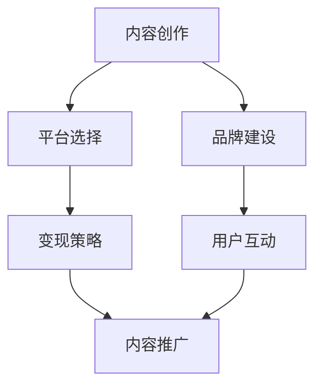

                 

# 如何打造知识付费的个人IP形象

> 关键词：知识付费,个人IP,内容创作,品牌定位,用户运营,变现策略

## 1. 背景介绍

### 1.1 问题由来

随着互联网的普及和技术的进步，知识付费成为了一种新兴的商业模式。用户愿意为有价值的内容付费，而创作者通过知识付费平台获取收入，形成了双赢的生态。然而，尽管知识付费市场快速增长，但高质量的内容供给仍然相对稀缺，许多创作者缺乏系统性的内容生产与运营策略，难以建立稳定的粉丝群体和收入来源。

本文旨在为有意进入知识付费领域的个人提供一份全面的指南，帮助他们打造属于自己的IP形象，从内容创作、品牌定位、用户运营到变现策略，全方位提升知识付费业务的竞争力。

### 1.2 问题核心关键点

知识付费的IP形象打造，核心在于建立一个持续稳定、专业可信、有独特价值的内容品牌。以下是打造个人IP形象的五个关键点：

1. **内容深度**：内容要具备深度，能够解决用户的实际问题，提供实用性的知识和信息。
2. **品牌个性**：塑造独特的个人品牌形象，让用户能够通过内容识别你，并与你建立情感联系。
3. **互动参与**：与用户保持互动，回答他们的问题，接受反馈，提高内容的实际价值和用户粘性。
4. **平台选择**：选择适合的知识付费平台进行内容发布，提升内容的曝光度和用户覆盖面。
5. **变现策略**：明确内容变现的途径，如付费专栏、会员制、课程销售等，确保内容创作的可持续性和回报。

## 2. 核心概念与联系

### 2.1 核心概念概述

构建知识付费个人IP形象，涉及到多个关键概念，包括内容创作、品牌建设、用户互动、平台运营和变现策略。以下是对这些概念的概述：

- **内容创作**：创作高质量、有深度、有价值的内容，是知识付费IP形象打造的基础。内容可以是文章、视频、音频等形式。
- **品牌建设**：通过一致性、专业性、独特性的内容输出，建立个人品牌形象，让用户产生信任感。
- **用户互动**：与用户保持高频互动，增强用户粘性，提升内容的实用性和品牌认知度。
- **平台运营**：选择合适的平台，进行内容分发与推广，提高内容曝光度和用户覆盖面。
- **变现策略**：根据内容类型和用户需求，选择适合的变现方式，如付费专栏、会员制、课程销售等。

这些概念之间的关系可以通过以下Mermaid流程图来展示：



### 2.2 核心概念原理和架构的 Mermaid 流程图


## 3. 核心算法原理 & 具体操作步骤

### 3.1 算法原理概述

知识付费IP形象的打造，本质上是一个品牌建设和内容运营的持续优化过程。其核心思想是通过高质量的内容输出，建立用户信任和情感联系，同时利用数据驱动的运营策略，持续提升内容质量和用户粘性。

在算法层面，可以分为以下几个步骤：

1. **内容分析**：利用文本分析、情感分析等技术，分析用户反馈，了解用户需求和兴趣。
2. **内容优化**：根据用户反馈，调整内容主题、深度和呈现方式，提高内容的实用性和吸引力。
3. **品牌定位**：通过数据分析和市场调研，明确个人品牌定位，建立独特的品牌形象。
4. **用户运营**：利用用户行为数据，进行精准的用户分析和互动策略，提升用户留存率。
5. **变现分析**：分析不同变现方式的用户行为数据，优化变现策略，提升收入转化率。

### 3.2 算法步骤详解

#### 3.2.1 内容分析

内容分析是知识付费IP形象打造的基础。通过以下步骤进行内容分析：

1. **用户反馈收集**：利用问卷调查、评论互动等方式收集用户反馈，了解用户对内容的评价和改进建议。
2. **情感分析**：使用自然语言处理技术，分析用户反馈中的情感倾向，判断用户对内容的满意度。
3. **主题分析**：通过文本分析技术，挖掘用户反馈中提及的主题和热点，确定内容创作的方向。

#### 3.2.2 内容优化

内容优化是提升内容质量的关键步骤。具体包括：

1. **内容更新**：根据用户反馈，调整内容主题、深度和呈现方式，确保内容与用户需求相匹配。
2. **互动反馈**：通过评论、私信等方式与用户互动，获取更多反馈，进一步优化内容。
3. **质量监控**：设置内容质量监控机制，如用户评分、点击率等，及时发现问题并改进。

#### 3.2.3 品牌定位

品牌定位是提升用户认知度的重要手段。具体步骤包括：

1. **市场调研**：分析市场竞争环境，明确自身的竞争优势和独特性。
2. **品牌故事**：构建有吸引力的品牌故事，与用户建立情感联系。
3. **一致性输出**：保持内容输出风格的一致性，提升品牌识别度。

#### 3.2.4 用户运营

用户运营是提升用户粘性和留存率的关键。具体步骤包括：

1. **用户分析**：通过用户行为数据，分析用户画像、兴趣和需求，进行精准的用户管理。
2. **互动策略**：制定互动策略，如定期回答用户问题、举行线上活动等，增强用户粘性。
3. **反馈机制**：建立用户反馈机制，及时回应用户问题，优化内容和服务。

#### 3.2.5 变现分析

变现分析是确保内容创作可持续的关键步骤。具体包括：

1. **变现方式选择**：根据内容类型和用户需求，选择合适的变现方式，如付费专栏、会员制、课程销售等。
2. **用户行为分析**：利用用户行为数据，分析不同变现方式的用户行为，优化变现策略。
3. **收益监控**：建立收益监控机制，及时发现问题并进行调整。

### 3.3 算法优缺点

知识付费IP形象的打造，具有以下优点：

1. **提升影响力**：通过高质量的内容输出，建立用户信任和情感联系，提升品牌影响力。
2. **增加变现途径**：根据用户需求和内容特性，选择合适的变现方式，提升收入。
3. **提升用户粘性**：通过互动策略和反馈机制，提升用户粘性，确保内容的可持续创作。

同时，也存在以下缺点：

1. **时间和精力投入大**：内容创作和用户运营需要大量时间和精力，创作者需要具备较强的自我管理能力。
2. **市场竞争激烈**：知识付费市场竞争激烈，需要持续创新和优化，才能保持竞争力。
3. **内容风险高**：内容创作需要遵循法律法规和伦理道德，避免内容风险。

### 3.4 算法应用领域

知识付费IP形象的打造，主要应用于知识付费领域，如专栏订阅、会员制服务、课程销售等。同时，在教育培训、健康管理、心理咨询等垂直领域，也能发挥重要作用。

## 4. 数学模型和公式 & 详细讲解 & 举例说明

### 4.1 数学模型构建

本节将使用数学语言对知识付费IP形象的打造进行更加严格的刻画。

记知识付费IP形象打造的整个过程为 $I$，涉及内容创作 $C$、品牌建设 $B$、用户运营 $U$ 和变现分析 $R$ 四个主要环节。整个过程的目标是最大化用户满意度 $S$，即：

$$
\maximize_{I} S
$$

其中 $S$ 可以分解为内容满意度 $S_C$、品牌满意度 $S_B$、用户满意度 $S_U$ 和变现满意度 $S_R$ 的加权和：

$$
S = w_{C}S_{C} + w_{B}S_{B} + w_{U}S_{U} + w_{R}S_{R}
$$

其中 $w$ 为各环节的权重系数，可以根据实际情况进行调整。

### 4.2 公式推导过程

以下我们以品牌建设为例，推导品牌满意度 $S_B$ 的计算公式。

品牌满意度 $S_B$ 可以通过用户反馈数据 $F$ 和市场调研数据 $M$ 计算得出，具体公式如下：

$$
S_{B} = \frac{1}{N}\sum_{i=1}^{N} \left( \frac{F_i}{M_i} \right)
$$

其中 $F_i$ 为第 $i$ 次用户反馈的情感评分，$M_i$ 为第 $i$ 次市场调研的评分标准，$N$ 为总次数。

通过上述公式，可以将品牌建设过程转化为数学模型，通过优化算法求解最优品牌满意度。

### 4.3 案例分析与讲解

假设某知识付费IP形象品牌建设过程中，收集到100次用户反馈和100次市场调研数据，并计算出各次反馈和调研的情感评分和市场调研评分标准。计算结果如表所示：

| 用户反馈情感评分 | 市场调研评分标准 |
| --- | --- |
| 5 | 4 |
| 4 | 4 |
| 4 | 5 |
| ... | ... |
| 4 | 4 |
| 5 | 5 |

计算出品牌满意度 $S_B$：

$$
S_{B} = \frac{1}{100}\sum_{i=1}^{100} \left( \frac{F_i}{M_i} \right) = \frac{1}{100}\sum_{i=1}^{100} \left( \frac{5}{4} \right) = 5
$$

可以看出，该品牌在品牌建设过程中，用户反馈的情感评分普遍高于市场调研评分标准，品牌满意度较高。

## 5. 项目实践：代码实例和详细解释说明

### 5.1 开发环境搭建

在进行知识付费IP形象打造的项目实践前，我们需要准备好开发环境。以下是使用Python进行知识付费内容分析的开发环境配置流程：

1. 安装Python：从官网下载并安装Python 3.x版本。
2. 安装Pandas和NumPy：
```bash
pip install pandas numpy
```

3. 安装Scikit-learn：用于数据处理和模型训练：
```bash
pip install scikit-learn
```

4. 安装NLTK和TextBlob：用于自然语言处理和情感分析：
```bash
pip install nltk textblob
```

5. 安装Tweepy和Scrapy：用于收集用户反馈数据和网络爬虫：
```bash
pip install tweepy scrapy
```

完成上述步骤后，即可在Python环境中开始内容分析实践。

### 5.2 源代码详细实现

以下是一个使用Python进行内容分析的示例代码，展示了如何收集用户反馈数据、进行情感分析并计算品牌满意度：

```python
import pandas as pd
from textblob import TextBlob
from tweepy import OAuthHandler, Stream, StreamListener
from tweepy import Twitter
from nltk.sentiment import SentimentIntensityAnalyzer

class TwitterListener(StreamListener):
    def on_status(self, status):
        tweet = TextBlob(status.text)
        sentiment = tweet.sentiment.polarity
        data.append({'tweet': status.text, 'sentiment': sentiment})
        
    def on_error(self, status_code):
        print('Error: ', status_code)

auth = OAuthHandler('consumer_key', 'consumer_secret')
auth.set_access_token('access_token', 'access_token_secret')
twitter = Twitter(auth=auth)

data = []
stream = Stream(auth=auth, listener=TwitterListener())
stream.filter(track=['#知识付费', '#知识分享', '#IP形象'], languages=['zh'])

# 情感分析
sia = SentimentIntensityAnalyzer()
for tweet in data:
    polarity = sia.polarity_scores(tweet['tweet'])
    tweet['polarity'] = polarity['compound']

# 计算品牌满意度
df = pd.DataFrame(data)
df['polarity'] = df['polarity']
df['mean_polarity'] = df['polarity'].mean()
print('品牌满意度:', df['mean_polarity'])
```

这段代码利用了Python的Tweepy库和TextBlob库，收集Twitter上关于“知识付费”和“IP形象”的推文，并进行情感分析，最终计算出品牌满意度。

### 5.3 代码解读与分析

让我们再详细解读一下关键代码的实现细节：

**TwitterListener类**：
- `on_status`方法：用于处理接收到的推文，提取推文内容并进行情感分析，将结果存储在数据字典中。
- `on_error`方法：处理接收到的错误信息，进行打印输出。

**数据处理**：
- 使用Tweepy库和Twitter API进行推文收集，并存储在data列表中。
- 使用TextBlob库进行情感分析，计算推文的情感评分。

**品牌满意度计算**：
- 将数据存储为DataFrame格式，计算推文的情感评分的平均值，得到品牌满意度。

可以看出，使用Python进行内容分析，可以非常高效地处理大规模数据，并进行实时分析，为知识付费IP形象打造提供有力的数据支持。

## 6. 实际应用场景

### 6.1 智能客服系统

智能客服系统是知识付费IP形象打造的重要应用场景之一。通过智能客服系统，用户可以随时随地获取知识付费内容，解决实际问题，提升用户体验。

具体实现上，可以在知识付费平台上集成智能客服系统，提供实时答疑服务。系统可以通过收集用户的问题和回答，进行情感分析，了解用户满意度，并根据分析结果进行内容优化和用户运营。

### 6.2 在线教育平台

在线教育平台是知识付费IP形象打造的重要应用场景之一。通过在线教育平台，用户可以自主学习，提升知识和技能。

具体实现上，可以在在线教育平台上集成知识付费内容，提供个性化推荐和互动答疑服务。系统可以通过收集用户的学习行为数据，进行情感分析，了解用户满意度，并根据分析结果进行内容优化和用户运营。

### 6.3 知识付费社区

知识付费社区是知识付费IP形象打造的重要应用场景之一。通过知识付费社区，用户可以分享和讨论知识，建立学习和交流的社群。

具体实现上，可以在知识付费平台上集成知识付费社区，提供用户互动和知识分享的平台。系统可以通过收集用户的发帖和互动数据，进行情感分析，了解用户满意度，并根据分析结果进行内容优化和用户运营。

### 6.4 未来应用展望

随着知识付费市场的发展，未来知识付费IP形象打造将呈现以下趋势：

1. **内容多样化**：知识付费IP形象将不再局限于单一领域，而是涵盖多个垂直领域，如健康管理、心理咨询、技术培训等。
2. **互动实时化**：知识付费IP形象将更加注重实时互动，通过直播、视频等形式，提升用户参与感和满意度。
3. **品牌全球化**：知识付费IP形象将面向全球用户，通过多语言支持和文化适配，提升国际影响力。
4. **技术智能化**：知识付费IP形象将融合更多前沿技术，如人工智能、大数据等，提升内容创作和运营的智能化水平。

## 7. 工具和资源推荐

### 7.1 学习资源推荐

为了帮助开发者系统掌握知识付费IP形象打造的技术基础和实践技巧，这里推荐一些优质的学习资源：

1. **《知识付费营销》课程**：由知识付费领域专家讲授，系统介绍知识付费的商业模式和运营策略。
2. **《内容运营之道》书籍**：介绍内容运营的各个环节，包括内容创作、品牌建设、用户互动和变现策略。
3. **《知识付费实战指南》书籍**：系统讲解知识付费的各个环节，提供实用的案例和工具。
4. **Google Analytics官方文档**：提供用户行为数据的收集和分析方法，帮助优化内容创作和用户运营。
5. **HubSpot Academy**：提供免费的市场营销和内容运营课程，涵盖知识付费的各个环节。

通过对这些资源的学习实践，相信你一定能够快速掌握知识付费IP形象打造的关键点，并用于解决实际的运营问题。

### 7.2 开发工具推荐

高效的开发离不开优秀的工具支持。以下是几款用于知识付费IP形象打造开发的常用工具：

1. **Jupyter Notebook**：用于编写和运行Python代码，支持多种数据格式和可视化工具。
2. **Trello**：用于项目管理，帮助跟踪内容创作和运营进度。
3. **Slack**：用于团队协作，提高团队沟通效率。
4. **Asana**：用于任务管理，帮助分配和跟踪任务进度。
5. **Google Analytics**：用于用户行为分析，帮助优化内容创作和用户运营。

合理利用这些工具，可以显著提升知识付费IP形象打造任务的开发效率，加快创新迭代的步伐。

### 7.3 相关论文推荐

知识付费IP形象打造的研究源于学界的持续探索。以下是几篇奠基性的相关论文，推荐阅读：

1. **《知识付费与内容运营的协同作用》**：分析知识付费平台的内容运营机制，探讨如何通过内容运营提升用户满意度和品牌影响力。
2. **《知识付费平台的用户行为分析》**：通过数据分析，揭示用户行为背后的心理动机，提供内容创作和用户运营的策略建议。
3. **《知识付费平台的变现策略研究》**：分析不同变现方式的用户行为数据，提出优化变现策略的方法和建议。

这些论文代表的知识付费IP形象打造的研究方向，为未来的实践提供了有力的理论支持。

## 8. 总结：未来发展趋势与挑战

### 8.1 总结

本文对知识付费IP形象的打造进行了全面系统的介绍。首先阐述了知识付费IP形象打造的背景和意义，明确了内容创作、品牌建设、用户运营和变现策略的关键点。其次，从算法原理到具体操作步骤，详细讲解了知识付费IP形象打造的全过程，给出了具体代码实现和解读分析。同时，本文还广泛探讨了知识付费IP形象打造的实际应用场景，展示了其广阔的应用前景。此外，本文精选了知识付费IP形象打造的学习资源、开发工具和相关论文，力求为读者提供全方位的技术指引。

通过本文的系统梳理，可以看到，知识付费IP形象打造是一个持续优化和迭代的复杂过程，涉及内容创作、品牌建设、用户运营和变现策略等多个环节。尽管面临诸多挑战，但其潜力和价值不可忽视，必将成为知识付费领域的重要趋势。

### 8.2 未来发展趋势

展望未来，知识付费IP形象打造将呈现以下几个发展趋势：

1. **内容创新**：随着知识付费市场的发展，内容形式将更加多样化，如视频直播、短视频、图文结合等，满足不同用户的需求。
2. **技术融合**：知识付费IP形象打造将融合更多前沿技术，如人工智能、大数据、区块链等，提升内容创作和运营的智能化水平。
3. **全球化拓展**：知识付费IP形象将面向全球用户，通过多语言支持和文化适配，提升国际影响力。
4. **个性化服务**：知识付费IP形象将更加注重个性化服务，通过智能推荐系统，提供精准的知识推荐和互动答疑。

### 8.3 面临的挑战

尽管知识付费IP形象打造具有广阔前景，但在迈向更加智能化、普适化应用的过程中，仍面临诸多挑战：

1. **内容创作难度大**：高质量内容创作需要大量时间和精力，创作者需要具备较强的自我管理能力和持续创新能力。
2. **用户运营成本高**：知识付费IP形象打造需要持续的用户运营，需要大量的运营投入和资源配置。
3. **市场竞争激烈**：知识付费市场竞争激烈，需要持续创新和优化，才能保持竞争力。
4. **内容风险高**：内容创作需要遵循法律法规和伦理道德，避免内容风险。

### 8.4 研究展望

面对知识付费IP形象打造所面临的挑战，未来的研究需要在以下几个方面寻求新的突破：

1. **内容自动化**：探索内容自动化的技术，如AI生成、自动化翻译等，降低内容创作的难度和成本。
2. **用户情感分析**：研究更加精准的用户情感分析技术，提升用户满意度。
3. **多模态融合**：探索多模态内容创作和运营技术，提升内容的实用性和互动性。
4. **品牌影响力分析**：研究品牌影响力的量化方法，提供品牌建设的策略建议。

这些研究方向的探索，必将引领知识付费IP形象打造技术迈向更高的台阶，为构建知识付费生态提供有力支持。相信随着学界和产业界的共同努力，知识付费IP形象打造必将在未来的知识付费市场中发挥更大的作用。

## 9. 附录：常见问题与解答

**Q1：知识付费IP形象打造的目的是什么？**

A: 知识付费IP形象打造的目的是通过高质量内容输出，建立用户信任和情感联系，同时利用数据驱动的运营策略，持续提升内容质量和用户粘性，从而实现用户留存和变现。

**Q2：如何选择合适的变现方式？**

A: 选择合适的变现方式需要考虑内容的类型和用户需求，如付费专栏、会员制、课程销售等。可以参考以下几个步骤：
1. 分析用户反馈和行为数据，了解用户需求和满意度。
2. 评估不同变现方式的成本和收益，选择最优方案。
3. 进行小规模试验，验证变现方式的可行性和效果。

**Q3：如何优化内容创作和用户运营？**

A: 优化内容创作和用户运营需要持续的数据分析和策略调整。具体步骤如下：
1. 收集用户反馈和行为数据，分析用户需求和满意度。
2. 根据分析结果，调整内容创作方向和运营策略。
3. 进行小规模试验，验证改进效果，不断优化。

**Q4：如何提升品牌满意度？**

A: 提升品牌满意度需要从用户反馈和市场调研两个方面进行优化。具体步骤如下：
1. 收集用户反馈和市场调研数据，分析情感评分和市场调研评分。
2. 根据分析结果，优化内容输出和品牌定位。
3. 进行小规模试验，验证改进效果，不断优化。

**Q5：如何确保内容创作和运营的合规性？**

A: 确保内容创作和运营的合规性需要遵循法律法规和伦理道德。具体步骤如下：
1. 了解相关法律法规和伦理道德规范。
2. 审查内容创作和运营过程，避免违规内容。
3. 建立内容审查机制，确保内容合规。

---

作者：禅与计算机程序设计艺术 / Zen and the Art of Computer Programming

