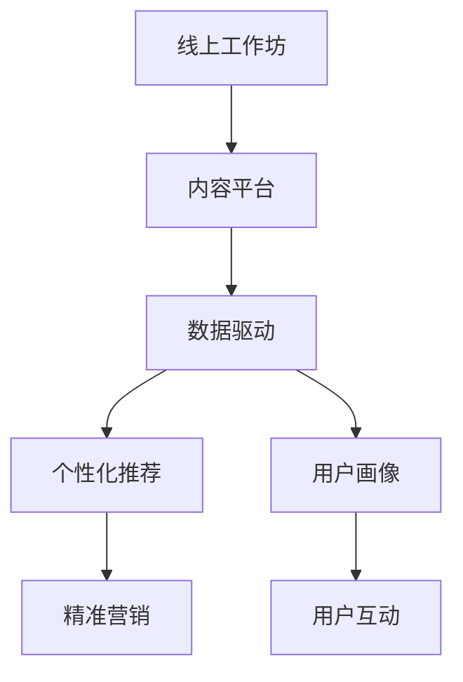

                 

# 如何打造知识付费的线上工作坊

> 关键词：知识付费, 线上工作坊, 数据驱动, 内容生产, 平台构建, 用户交互, 营销策略

## 1. 背景介绍

### 1.1 问题由来

在当今数字化时代，知识付费正成为一种新的消费趋势。无论是为了提升个人技能，还是为了获得职业发展的新机遇，越来越多的人愿意为获取知识投入时间和金钱。线上工作坊作为知识付费的重要形式之一，以其互动性强、信息量大、操作灵活的特点，迅速受到欢迎。但是，打造一个成功的线上工作坊，不仅需要高质量的内容，还需要科学、高效的管理和运营策略。

### 1.2 问题核心关键点

打造知识付费的线上工作坊涉及多个关键点：
- 内容质量：决定工作坊价值的核心，需要高质量、实用性强的课程内容。
- 平台搭建：工作坊的载体，需要稳定、易用的技术平台支持。
- 用户互动：提升用户体验的关键，需加强用户与讲师的互动。
- 营销策略：吸引用户报名的重要手段，需精准定位目标群体。
- 数据驱动：优化工作坊运营的重要依据，需实时监控用户行为和反馈。

### 1.3 问题研究意义

在线上工作坊的打造和运营过程中，通过科学的数据分析和管理策略，可以不断优化工作坊内容和运营流程，提升用户体验和满意度，扩大用户覆盖面。对于教育机构、企业培训、个人成长等领域，线上工作坊能带来巨大的商业和社会价值。

## 2. 核心概念与联系

### 2.1 核心概念概述

为更好地理解线上工作坊的打造过程，本节将介绍几个核心概念：

- 线上工作坊：通过在线平台提供的课程和互动环节，实现知识传播和技能提升的教育形式。
- 内容平台：提供课程和资源展示、用户互动、数据分析等功能，是线上工作坊的基础。
- 数据驱动：通过大数据和人工智能技术，实时分析用户行为，优化工作坊运营，提升用户体验。
- 个性化推荐：根据用户偏好和行为数据，推荐适合其学习需求的课程和互动环节。
- 用户画像：通过数据分析构建的虚拟用户模型，用于个性化推荐和精准营销。

这些概念之间的逻辑关系可以通过以下Mermaid流程图来展示：



这个流程图展示了一个线上工作坊的核心概念及其之间的关系：

1. 线上工作坊通过内容平台提供课程和互动。
2. 数据驱动提供实时分析，优化平台和课程。
3. 个性化推荐增强用户粘性，提升学习效果。
4. 用户画像用于精准营销和个性化服务。
5. 用户互动是工作坊的核心体验环节。

这些概念共同构成了线上工作坊的运营框架，使其能够提供高品质的知识和互动体验。

## 3. 核心算法原理 & 具体操作步骤
### 3.1 算法原理概述

线上工作坊的打造和运营，涉及多个算法的应用，包括但不限于：

- 推荐系统：通过分析用户行为数据，为用户推荐相关课程和互动内容。
- 自然语言处理(NLP)：分析用户反馈，进行情感分析、文本分类等。
- 预测分析：基于历史数据，预测用户行为和课程需求。
- 优化算法：优化课程内容、价格策略、营销方案等。

这些算法共同作用，保障了线上工作坊的顺利运营。

### 3.2 算法步骤详解

打造线上工作坊的主要步骤包括：

**Step 1: 确定课程主题和目标受众**
- 基于市场需求和用户画像，确定课程主题和目标受众。
- 调研目标受众的需求和痛点，制定课程大纲。

**Step 2: 构建课程内容和互动环节**
- 邀请行业专家和学者，设计高质量的课程内容。
- 增加互动环节，如问答、讨论、小组任务等，提升用户体验。

**Step 3: 搭建内容平台**
- 选择合适的技术栈，搭建稳定、易用的内容平台。
- 提供视频、文档、互动工具等，满足用户学习需求。

**Step 4: 实施数据驱动策略**
- 实时监控用户行为数据，包括观看时长、互动频率、课程评分等。
- 利用机器学习算法，分析用户数据，优化课程内容和互动设计。

**Step 5: 推广和营销**
- 制定精准的营销策略，吸引目标用户报名。
- 利用社交媒体、邮件营销、口碑传播等手段，扩大工作坊知名度。

**Step 6: 运营和维护**
- 根据用户反馈，持续优化课程内容和平台功能。
- 定期更新课程内容，保持工作坊的新鲜感和吸引力。

### 3.3 算法优缺点

线上工作坊的算法驱动策略具有以下优点：
- 提升用户体验：通过个性化推荐和实时反馈，增强用户粘性和满意度。
- 优化课程设计：基于用户行为数据，优化课程内容和互动环节。
- 提高运营效率：实时监控和分析用户数据，快速响应需求变化。

同时，该策略也存在一定的局限性：
- 数据隐私问题：需要收集和分析用户数据，涉及隐私保护和数据安全。
- 计算成本：大量数据处理和分析需要较高的计算资源。
- 算法复杂性：需要多算法协同工作，涉及算法调优和维护。

尽管如此，数据驱动和算法驱动仍是线上工作坊运营的核心，未来相关的研究将会进一步提升工作坊的效果和效率。

### 3.4 算法应用领域

数据驱动和算法驱动的线上工作坊技术，广泛应用于多个领域，如：

- 企业培训：为员工提供技能提升课程，增强企业竞争力。
- 教育机构：为学生提供多样化学习路径，提升学习效果。
- 个人成长：提供个性化学习和职业规划指导，帮助用户实现自我价值。
- 技术交流：为开发者提供技术分享和协作平台，促进技术创新。
- 生活应用：为普通用户提供实用知识和技能，提升生活品质。

这些领域都为线上工作坊提供了广阔的应用场景，展示了其强大的市场潜力和社会价值。

## 4. 数学模型和公式 & 详细讲解 & 举例说明
### 4.1 数学模型构建

本文以推荐系统为例，详细讲解基于协同过滤和内容的推荐模型构建过程。

设用户集为 $U=\{u_1,u_2,\dots,u_n\}$，物品集为 $I=\{i_1,i_2,\dots,i_m\}$。用户对物品的评分矩阵为 $R \in \mathbb{R}^{n \times m}$，其中 $R_{ui} = r$ 表示用户 $u$ 对物品 $i$ 的评分。

推荐系统的目标是为用户 $u$ 推荐物品 $i$，使得预测评分 $\hat{r}_{ui}$ 最大化，即：

$$
\max_{i \in I} \hat{r}_{ui}
$$

其中 $\hat{r}_{ui}$ 为预测评分，可以通过协同过滤和内容推荐等方法得到。

### 4.2 公式推导过程

以协同过滤为例，假设用户 $u$ 和物品 $i$ 的相似度为 $s_{ui}$，则预测评分 $\hat{r}_{ui}$ 可以表示为：

$$
\hat{r}_{ui} = \alpha r_{ui} + (1-\alpha) \sum_{j \in N_i} s_{uj}r_{ji}
$$

其中 $\alpha \in [0,1]$ 为相似度权重，$N_i$ 为物品 $i$ 的邻居集。

协同过滤的优化目标为最大化预测评分，即：

$$
\max_{i \in I} \hat{r}_{ui} = \max_{i \in I} \left[\alpha r_{ui} + (1-\alpha) \sum_{j \in N_i} s_{uj}r_{ji}\right]
$$

通过梯度下降等优化算法，不断调整参数 $\alpha$ 和相似度 $s_{ui}$，最小化预测误差，得到最优推荐结果。

### 4.3 案例分析与讲解

假设某在线教育平台需要为课程 $i$ 推荐用户 $u$，已知用户 $u$ 对物品 $j$ 的评分 $R_{uj}$ 和物品 $j$ 对物品 $i$ 的评分 $R_{ji}$。假设用户 $u$ 和物品 $i$ 的相似度为 $s_{ui}$，则预测评分 $\hat{r}_{ui}$ 可以通过如下公式计算：

$$
\hat{r}_{ui} = \alpha r_{ui} + (1-\alpha) \sum_{j \in N_i} s_{uj}r_{ji}
$$

其中 $N_i$ 为物品 $i$ 的邻居集，$N_i = \{j | r_{ji} > 0\}$。

## 5. 项目实践：代码实例和详细解释说明
### 5.1 开发环境搭建

在进行线上工作坊平台开发前，我们需要准备好开发环境。以下是使用Python进行Django开发的环境配置流程：

1. 安装Anaconda：从官网下载并安装Anaconda，用于创建独立的Python环境。

2. 创建并激活虚拟环境：
```bash
conda create -n course-env python=3.8 
conda activate course-env
```

3. 安装Django：
```bash
pip install django
```

4. 安装其他依赖库：
```bash
pip install numpy pandas scikit-learn matplotlib django-rest-framework requests
```

完成上述步骤后，即可在`course-env`环境中开始线上工作坊平台的开发。

### 5.2 源代码详细实现

以下是基于Django框架搭建的线上工作坊平台的基本代码实现：

```python
# settings.py
# 配置Django环境变量和数据库连接信息
INSTALLED_APPS = [
    'django.contrib.admin',
    'django.contrib.auth',
    'django.contrib.contenttypes',
    'django.contrib.sessions',
    'django.contrib.messages',
    'django.contrib.staticfiles',
    'course',
    'oauth2_provider',
]

# 配置Django的REST框架
REST_FRAMEWORK = {
    'DEFAULT_PERMISSION_CLASSES': [
        'rest_framework.permissions.IsAuthenticated',
    ],
    'DEFAULT_PAGINATION_CLASS': 'rest_framework.pagination.PageNumberPagination',
}

# course应用中的models.py
from django.db import models

class Course(models.Model):
    name = models.CharField(max_length=100)
    description = models.TextField()
    price = models.DecimalField(max_digits=10, decimal_places=2)
    instructor = models.ForeignKey('User', on_delete=models.CASCADE)
    start_date = models.DateField()
    end_date = models.DateField()

# course应用中的views.py
from rest_framework import generics
from .serializers import CourseSerializer
from .models import Course

class CourseView(generics.ListCreateAPIView):
    queryset = Course.objects.all()
    serializer_class = CourseSerializer

class User(models.Model):
    email = models.EmailField(unique=True)
    password = models.CharField(max_length=100)

# course应用中的serializers.py
from rest_framework import serializers
from .models import Course

class CourseSerializer(serializers.ModelSerializer):
    class Meta:
        model = Course
        fields = '__all__'

# Django的urls.py
from django.urls import path
from course.views import CourseView

urlpatterns = [
    path('courses/', CourseView.as_view(), name='course_list'),
    path('users/', User.as_view(), name='user_list'),
]
```

### 5.3 代码解读与分析

让我们再详细解读一下关键代码的实现细节：

**models.py**：
- `Course` 模型定义了线上工作坊的基本信息，包括名称、描述、价格、讲师、起止日期等。
- `User` 模型定义了用户的基本信息，包括邮箱和密码。

**views.py**：
- `CourseView` 继承 `generics.ListCreateAPIView`，实现了对 `Course` 模型的 CRUD 操作。
- 通过 `rest_framework` 的视图和序列化器，用户可以通过 API 接口创建、修改和查询工作坊信息。

**serializers.py**：
- `CourseSerializer` 继承 `serializers.ModelSerializer`，定义了 `Course` 模型的序列化和反序列化逻辑。

**urls.py**：
- 定义了 `CourseView` 和 `User` 的API URL路径，方便用户通过浏览器访问。

## 6. 实际应用场景
### 6.1 企业培训

企业培训场景下，线上工作坊可以帮助企业提升员工技能，增强竞争力。通过在线平台，企业可以定期组织内部培训课程，如编程技能、项目管理、财务分析等，帮助员工快速掌握新知识，提高工作效率。

**实际应用**：某跨国公司使用线上工作坊平台，为全球员工提供编程和项目管理课程。平台通过数据分析，推荐员工感兴趣的课程，并提供实时互动环节，提升员工的学习效果。

### 6.2 教育机构

教育机构可以利用线上工作坊为学生提供多样化学习路径，提升教学质量。线上工作坊可以覆盖多种学科，如数学、物理、计算机科学等，提供丰富的互动内容和实时反馈。

**实际应用**：某国际教育机构使用线上工作坊平台，为全球学生提供计算机编程课程。平台通过个性化推荐和实时互动，提升学生的学习兴趣和效果。

### 6.3 个人成长

个人成长领域，线上工作坊可以帮助用户实现自我价值，提升职业技能。平台提供多种课程，如写作、摄影、心理学等，帮助用户全面发展，实现职业和生活的双赢。

**实际应用**：某职业发展平台使用线上工作坊平台，为职场人士提供写作和心理学课程。平台通过数据分析，推荐适合用户的学习路径，并提供实时互动环节，提升用户的学习效果。

### 6.4 未来应用展望

随着技术的不断进步，线上工作坊将迎来更多创新应用：

1. 虚拟现实(VR)互动：通过VR技术，增强线上互动体验，提供沉浸式的学习环境。
2. 智能辅助教学：利用AI技术，提供个性化推荐和智能答疑，提升教学效果。
3. 动态课程更新：根据用户反馈和市场变化，动态更新课程内容，保持工作坊的新鲜度。
4. 多语言支持：支持多种语言和地区，扩大用户覆盖面，提升国际影响力。
5. 大数据分析：通过大数据分析，预测用户需求和市场趋势，优化工作坊运营。

未来，线上工作坊将更加智能化、个性化，为知识传播和技能提升带来更多可能性。

## 7. 工具和资源推荐
### 7.1 学习资源推荐

为了帮助开发者系统掌握线上工作坊的理论基础和实践技巧，这里推荐一些优质的学习资源：

1. 《Web开发实战》系列博文：由Django官方文档组撰写，深入浅出地介绍了Django框架的使用方法和最佳实践。
2. 《数据科学实战》课程：由Kaggle官方提供，涵盖数据分析、机器学习、数据可视化等内容，是学习线上工作坊数据驱动策略的重要参考。
3. 《自然语言处理与深度学习》书籍：涵盖NLP和深度学习的理论和实践，适合了解线上工作坊内容推荐和情感分析的实现方法。
4. GitHub上的Django项目：提供了大量实用的Django应用案例，是学习和实践线上工作坊平台的宝贵资源。
5. Coursera上的Python课程：由知名教授提供，涵盖Python基础和高级开发技术，是学习线上工作坊平台技术栈的重要途径。

通过对这些资源的学习实践，相信你一定能够快速掌握线上工作坊的精髓，并用于解决实际的NLP问题。

### 7.2 开发工具推荐

高效的开发离不开优秀的工具支持。以下是几款用于线上工作坊开发常用的工具：

1. Django：基于Python的Web框架，提供了丰富的MVC架构和ORM支持，适合快速开发复杂应用。
2. Git：版本控制系统，方便团队协作和代码管理。
3. VS Code：开源代码编辑器，支持多种语言和扩展，是编写线上工作坊平台代码的首选工具。
4. Docker：容器化技术，方便应用程序的部署和运维。
5. Jenkins：持续集成和持续部署工具，自动化测试和部署线上工作坊平台。
6. Sentry：监控和错误跟踪工具，保障线上工作坊平台的稳定运行。

合理利用这些工具，可以显著提升线上工作坊平台的开发效率，加快创新迭代的步伐。

### 7.3 相关论文推荐

线上工作坊的研究涉及多个领域，以下是几篇奠基性的相关论文，推荐阅读：

1. "Recommender Systems in E-Learning: A Survey"（教育领域推荐系统综述）：系统总结了在线学习平台推荐算法的研究进展，适合了解线上工作坊推荐系统构建。
2. "Natural Language Processing for E-Learning"（NLP在在线学习中的应用）：介绍了NLP技术在在线教育平台上的应用，适合了解线上工作坊情感分析和文本分类。
3. "Online Learning Platforms: A Survey"（在线学习平台综述）：全面介绍了在线教育平台的技术架构和应用场景，适合了解线上工作坊平台构建。
4. "Learning Analytics for E-Learning: A Review"（在线学习分析综述）：系统总结了在线学习分析的研究进展，适合了解线上工作坊平台的用户行为分析和个性化推荐。
5. "Human-AI Interaction in Online Learning"（人机交互在在线学习中的应用）：介绍了人机交互技术在在线教育平台上的应用，适合了解线上工作坊平台的用户互动设计。

这些论文代表了大规模在线学习平台的研究方向，通过学习这些前沿成果，可以帮助研究者把握学科前进方向，激发更多的创新灵感。

## 8. 总结：未来发展趋势与挑战
### 8.1 研究成果总结

本文对线上工作坊的打造和运营过程进行了全面系统的介绍。首先阐述了线上工作坊的背景和意义，明确了数据驱动和算法驱动在优化用户体验和提升运营效率方面的重要作用。其次，从原理到实践，详细讲解了线上工作坊的数学模型和算法步骤，给出了具体的代码实例和详细解释。同时，本文还广泛探讨了线上工作坊在企业培训、教育机构、个人成长等多个领域的应用前景，展示了其巨大的市场潜力和社会价值。

通过本文的系统梳理，可以看到，数据驱动和算法驱动的线上工作坊技术正在成为在线教育的重要支撑，极大地提升了学习体验和运营效率。未来，伴随技术的发展和应用场景的拓展，线上工作坊将带来更多的创新和变革，为教育和学习带来新的机遇和挑战。

### 8.2 未来发展趋势

展望未来，线上工作坊将呈现以下几个发展趋势：

1. 技术融合：与VR、AR等新兴技术融合，提供沉浸式学习体验。
2. 智能辅助：利用AI技术，提供个性化推荐和智能答疑，提升学习效果。
3. 动态更新：根据用户反馈和市场变化，动态调整课程内容和运营策略。
4. 多语言支持：支持多种语言和地区，扩大用户覆盖面。
5. 大数据分析：通过大数据分析，预测用户需求和市场趋势，优化运营策略。

这些趋势凸显了线上工作坊技术的发展方向，预示着未来更多的创新应用和市场机会。

### 8.3 面临的挑战

尽管线上工作坊技术已经取得了显著进展，但在迈向更加智能化、普适化应用的过程中，仍面临以下挑战：

1. 数据隐私：需要收集和分析用户数据，涉及隐私保护和数据安全。
2. 计算资源：大规模数据处理和分析需要较高的计算资源。
3. 算法复杂性：需要多算法协同工作，涉及算法调优和维护。
4. 用户粘性：如何提升用户粘性，增强平台的用户体验。
5. 课程更新：动态更新课程内容，保持工作坊的新鲜度。

这些挑战需要多方协同解决，才能确保线上工作坊技术的健康发展。

### 8.4 研究展望

未来，线上工作坊技术的研究方向将在以下几个方面展开：

1. 算法优化：开发更加高效和鲁棒的推荐算法，提升推荐效果和用户体验。
2. 跨领域应用：将线上工作坊技术应用于更多行业，探索新的应用场景和价值。
3. 模型优化：优化线上工作坊平台的模型架构，提升性能和稳定性。
4. 用户互动：增强用户互动环节，提升用户参与度和满意度。
5. 多模态融合：将视觉、听觉等多模态数据与文本数据结合，提供更加丰富的学习体验。

这些研究方向的探索，将推动线上工作坊技术向更广范围、更高质量、更智能的方向发展，为在线教育和技能提升带来更多创新和突破。

## 9. 附录：常见问题与解答

**Q1：如何提升线上工作坊的用户粘性？**

A: 提升用户粘性需要多方面的努力：
1. 个性化推荐：根据用户行为和偏好，推荐适合其学习的课程和互动环节。
2. 实时反馈：及时回应用户问题和反馈，增强用户互动。
3. 互动设计：设计互动环节，如问答、小组讨论等，提升用户参与度。
4. 学习路径规划：根据用户学习进度，推荐后续课程和内容。
5. 社区建设：建立学习社区，促进用户之间的交流和分享。

**Q2：线上工作坊的推荐系统如何构建？**

A: 推荐系统的构建涉及多个步骤：
1. 数据收集：收集用户评分、课程信息等数据。
2. 特征工程：提取用户和课程的特征，如评分、课程难度、用户兴趣等。
3. 模型训练：选择合适的推荐算法，如协同过滤、内容推荐、混合模型等，进行模型训练。
4. 模型评估：使用交叉验证、A/B测试等方法，评估模型效果。
5. 模型部署：将训练好的模型部署到线上，实现实时推荐。

**Q3：线上工作坊的营销策略有哪些？**

A: 线上工作坊的营销策略多种多样：
1. 社交媒体推广：利用微信、微博、抖音等社交媒体平台，推广课程信息。
2. 邮件营销：通过邮件发送课程信息和优惠活动，吸引用户报名。
3. 合作伙伴推广：与教育机构、企业等合作伙伴合作，共同推广课程。
4. 口碑传播：利用用户评价和推荐，增加课程的曝光率和用户粘性。
5. 免费试听：提供免费试听课程，吸引用户报名。

这些策略需要根据平台特点和目标用户，灵活选择和组合。

**Q4：线上工作坊的平台架构如何选择？**

A: 线上工作坊的平台架构选择需考虑多个因素：
1. 性能需求：根据课程类型和用户规模，选择高性能的服务器和数据库。
2. 安全性：确保用户数据和课程内容的安全性，采用加密和访问控制等措施。
3. 扩展性：考虑未来用户规模的增长，设计可扩展的架构。
4. 易用性：提供简单易用的用户界面，提升用户体验。
5. 可维护性：选择易维护的架构和组件，方便未来的运维和升级。

合理选择平台架构，可以确保线上工作坊的稳定运行和用户满意。

---

作者：禅与计算机程序设计艺术 / Zen and the Art of Computer Programming

