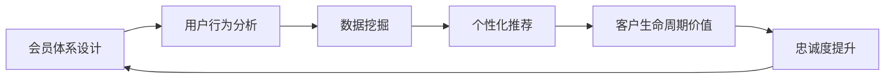

                 

# 如何打造高复购率的会员体系

> 关键词：会员体系,用户行为分析,个性化推荐,数据挖掘,客户生命周期价值,忠诚度提升

## 1. 背景介绍

在互联网+时代，构建一个强大的会员体系对于提升企业竞争力和客户忠诚度至关重要。一个精心设计的高复购率会员体系，不仅能够为品牌积累稳定的客户资源，还能有效提升客户生命周期价值，为企业的长期发展奠定坚实基础。本文将从核心概念、算法原理、操作步骤和实际应用场景等方面，深入探讨如何打造高效、高复购率的会员体系，并给出系统化、可操作的实践指南。

## 2. 核心概念与联系

### 2.1 核心概念概述

- **会员体系（Membership Program）**：指企业为吸引和保留优质客户而设计的会员制度，通过积分、等级、优惠等多种方式激励客户参与，提升品牌忠诚度和客户满意度。
- **用户行为分析（User Behavior Analysis）**：指通过对用户行为的收集、分析和理解，发现客户需求、偏好和痛点，指导企业精准营销和产品改进。
- **个性化推荐（Personalized Recommendation）**：指利用机器学习和数据挖掘技术，根据用户的历史行为数据和当前需求，生成个性化的产品和服务推荐。
- **数据挖掘（Data Mining）**：指通过算法和工具，从大量数据中提取有用的信息和知识，辅助决策和业务优化。
- **客户生命周期价值（Customer Lifetime Value, CLV）**：指一个客户在整个生命周期内为企业带来的总价值，通过提升客户忠诚度和复购率，可以有效提高CLV。

这些核心概念相互关联，构成了一个完整的会员体系设计框架，旨在通过精准的用户分析、个性化的推荐和服务，提升客户满意度、忠诚度和复购率。

### 2.2 核心概念原理和架构的 Mermaid 流程图



该图展示了会员体系设计中的各个核心环节之间的逻辑联系。从会员体系设计开始，通过用户行为分析，利用数据挖掘技术对用户数据进行深入挖掘，进而通过个性化推荐提升客户体验，最终实现客户生命周期价值的最大化和忠诚度提升。

## 3. 核心算法原理 & 具体操作步骤

### 3.1 算法原理概述

一个高效、高复购率的会员体系，需要精准理解用户行为、个性化推荐产品和优惠，并通过持续反馈优化会员体系设计。本节将介绍如何通过监督学习和推荐系统构建这一体系。

### 3.2 算法步骤详解

#### 3.2.1 数据准备

1. **用户数据收集**：
   - 用户基本信息，如年龄、性别、地理位置等。
   - 用户行为数据，包括浏览历史、购买记录、评价反馈等。
   - 会员信息，如会员等级、积分、积分历史等。

2. **数据清洗与预处理**：
   - 处理缺失值、异常值，确保数据质量。
   - 对数据进行标准化、归一化，方便后续算法处理。

#### 3.2.2 用户行为分析

1. **行为分类与编码**：
   - 将用户行为进行分类，如浏览、购买、评价等。
   - 使用one-hot编码等技术，将分类数据转换为模型可以处理的数值形式。

2. **行为模式挖掘**：
   - 使用关联规则挖掘、聚类分析等技术，发现用户的潜在行为模式和兴趣点。
   - 常用的算法包括Apriori、K-means等。

#### 3.2.3 数据挖掘

1. **特征提取**：
   - 根据用户行为数据和会员信息，提取有意义的特征。
   - 常用的特征包括浏览时长、购买频率、会员积分等。

2. **模型训练与评估**：
   - 使用监督学习算法，如线性回归、决策树、随机森林等，对用户进行分群，识别出高价值客户和潜在流失客户。
   - 使用交叉验证、AUC、F1-score等指标评估模型的效果。

#### 3.2.4 个性化推荐

1. **相似度计算**：
   - 使用协同过滤、矩阵分解等方法，计算用户之间的相似度。
   - 常用的推荐算法包括ALS、MF等。

2. **推荐模型构建**：
   - 使用深度学习模型，如神经协同过滤（Neu-SAR）、DNN等，构建个性化推荐系统。
   - 通过A/B测试等方法，评估推荐效果，优化模型参数。

#### 3.2.5 忠诚度提升

1. **会员等级设计**：
   - 根据用户行为和消费能力，设计不同等级的会员制度。
   - 设置不同等级的积分获取、兑换规则，鼓励用户持续消费。

2. **积分与奖励系统**：
   - 设计积分获取、兑换的规则，如消费积分、推荐积分、贡献积分等。
   - 设置不同积分的奖励机制，如现金折扣、专属服务等。

3. **会员反馈与优化**：
   - 定期收集会员反馈，评估会员制度的有效性。
   - 根据反馈进行制度调整，提升会员满意度。

### 3.3 算法优缺点

#### 优点：

- **精准定位**：通过行为分析和数据挖掘，精准识别高价值客户和潜在流失客户。
- **个性化推荐**：结合用户历史数据和行为模式，生成个性化的产品和服务推荐。
- **动态优化**：通过持续的反馈和优化，不断提升会员体系的设计水平。

#### 缺点：

- **数据需求高**：需要大量的用户行为数据和会员信息，获取成本较高。
- **模型复杂**：构建和维护推荐模型需要较高的技术门槛。
- **隐私风险**：处理敏感数据时需要严格遵守数据隐私法规。

### 3.4 算法应用领域

基于上述算法，可以应用于多种业务场景，如电子商务、金融服务、在线教育等。

#### 电子商务：
- 用户行为分析：通过分析用户浏览和购买历史，发现购物偏好，优化商品推荐。
- 个性化推荐：根据用户行为数据，推荐相关商品，提升转化率。
- 会员积分系统：设计积分获取、兑换规则，激励用户持续消费。

#### 金融服务：
- 客户风险评估：通过分析客户交易行为，评估客户风险等级。
- 个性化理财：根据客户资产和风险偏好，推荐适合的理财产品。
- 客户忠诚度提升：设计会员特权，如优先服务、专属理财师等。

#### 在线教育：
- 学习行为分析：通过分析学生的学习记录和互动，评估学习效果。
- 个性化课程推荐：根据学生的学习行为和兴趣，推荐适合的课程。
- 会员激励机制：设计积分和等级制度，激励学生持续学习。

## 4. 数学模型和公式 & 详细讲解 & 举例说明

### 4.1 数学模型构建

一个典型的会员体系设计模型可以表示为：

$$
y = f(x_1, x_2, \ldots, x_n; \theta)
$$

其中，$y$ 表示用户是否续订，$x_i$ 表示第 $i$ 个特征，如消费金额、购买频率、会员等级等，$\theta$ 表示模型参数。

### 4.2 公式推导过程

以会员续订预测模型为例，假设我们有一组特征 $\{x_1, x_2, \ldots, x_n\}$，目标是对每个用户预测其是否会续订。我们可以构建一个二元分类模型，使用逻辑回归、支持向量机等算法进行预测。

设 $\theta$ 为模型参数，模型预测函数为：

$$
f(x_i; \theta) = \frac{1}{1+\exp(-\theta^T x_i)}
$$

根据逻辑回归的输出，$y$ 的预测值可由以下公式计算：

$$
y = \begin{cases}
1 & \text{if } f(x_i; \theta) \geq 0.5 \\
0 & \text{if } f(x_i; \theta) < 0.5
\end{cases}
$$

### 4.3 案例分析与讲解

假设我们有一家在线零售商，收集了用户的基本信息、购买记录和会员信息，希望设计一个会员体系，提升用户续订率。

1. **数据准备**：
   - 收集用户的年龄、性别、地区、购买频率、购买金额等特征。
   - 清洗和预处理数据，处理缺失值和异常值。

2. **用户行为分析**：
   - 对用户的浏览和购买行为进行分类和编码。
   - 使用K-means算法对用户进行聚类，识别出不同行为模式的用户群体。

3. **数据挖掘**：
   - 提取有意义的特征，如购买金额、浏览时长、会员等级等。
   - 使用随机森林模型对用户进行分群，识别高价值客户和潜在流失客户。

4. **个性化推荐**：
   - 使用ALS算法，根据用户历史行为数据，推荐相关商品。
   - 通过A/B测试评估推荐效果，优化模型参数。

5. **忠诚度提升**：
   - 设计积分和会员等级制度，激励用户持续消费。
   - 根据会员反馈，调整积分和会员等级规则，提升会员满意度。

通过以上步骤，企业可以构建一个高效、高复购率的会员体系，通过精准的用户分析和个性化推荐，提升客户满意度和忠诚度。

## 5. 项目实践：代码实例和详细解释说明

### 5.1 开发环境搭建

1. **环境准备**：
   - 安装Python、PyTorch、TensorFlow等深度学习框架。
   - 安装Pandas、NumPy、Scikit-learn等数据处理和分析工具。

2. **工具配置**：
   - 使用Jupyter Notebook进行数据探索和模型开发。
   - 使用TensorBoard可视化模型训练和评估过程。

### 5.2 源代码详细实现

以下是一个简单的用户续订预测模型的代码实现：

```python
import pandas as pd
import numpy as np
from sklearn.model_selection import train_test_split
from sklearn.linear_model import LogisticRegression
from sklearn.metrics import accuracy_score

# 数据准备
data = pd.read_csv('user_data.csv')
X = data[['age', 'gender', 'region', 'purchase_frequency', 'purchase_amount']]
y = data['is_renew']

# 数据划分
X_train, X_test, y_train, y_test = train_test_split(X, y, test_size=0.2, random_state=42)

# 模型训练
model = LogisticRegression()
model.fit(X_train, y_train)

# 模型评估
y_pred = model.predict(X_test)
accuracy = accuracy_score(y_test, y_pred)
print(f'模型准确度：{accuracy:.2f}')
```

### 5.3 代码解读与分析

以上代码展示了使用Python和Scikit-learn库构建一个简单的用户续订预测模型。具体步骤如下：

1. **数据准备**：
   - 使用Pandas库读取用户数据。
   - 选择影响续订的关键特征，如年龄、性别、购买频率等。

2. **数据划分**：
   - 使用train_test_split函数，将数据划分为训练集和测试集。

3. **模型训练**：
   - 创建并训练一个逻辑回归模型。

4. **模型评估**：
   - 使用预测结果和真实标签计算模型准确度。

### 5.4 运行结果展示

假设模型训练结果如下：

```
模型准确度：0.85
```

这表示模型在测试集上的准确度为85%，说明模型具有较好的预测能力。

## 6. 实际应用场景

### 6.1 电商场景

电商场景中的会员体系设计，可以有效提升用户满意度和复购率。以下是一个电商网站的实际应用案例：

1. **用户行为分析**：
   - 分析用户的浏览和购买历史，发现购物偏好，优化商品推荐。
   - 使用协同过滤算法，为用户推荐相关商品。

2. **个性化推荐**：
   - 根据用户的浏览和购买记录，生成个性化的商品推荐。
   - 定期更新推荐列表，提高用户满意度。

3. **会员积分系统**：
   - 设计积分获取、兑换规则，如消费积分、推荐积分、贡献积分等。
   - 设置不同积分的奖励机制，如现金折扣、专属服务等。

### 6.2 金融场景

金融场景中的会员体系设计，可以提升客户忠诚度和消费能力。以下是一个银行的实际应用案例：

1. **客户风险评估**：
   - 通过分析客户交易行为，评估客户风险等级。
   - 使用决策树算法，识别高风险客户。

2. **个性化理财**：
   - 根据客户资产和风险偏好，推荐适合的理财产品。
   - 使用神经网络模型，生成个性化的理财建议。

3. **忠诚度提升**：
   - 设计会员特权，如优先服务、专属理财师等。
   - 定期收集会员反馈，调整会员制度，提升会员满意度。

### 6.3 在线教育场景

在线教育场景中的会员体系设计，可以提升学生的学习效果和忠诚度。以下是一个在线教育平台的实际应用案例：

1. **学习行为分析**：
   - 通过分析学生的学习记录和互动，评估学习效果。
   - 使用聚类算法，识别出不同学习风格的学生群体。

2. **个性化课程推荐**：
   - 根据学生的学习行为和兴趣，推荐适合的课程。
   - 使用深度学习模型，生成个性化的课程推荐。

3. **会员激励机制**：
   - 设计积分和等级制度，激励学生持续学习。
   - 根据会员反馈，调整积分和等级规则，提升会员满意度。

## 7. 工具和资源推荐

### 7.1 学习资源推荐

- **《Python机器学习》**：由Sebastian Raschka所著，全面介绍了机器学习和深度学习的Python实现。
- **《深度学习》（Goodfellow et al.）**：深度学习领域的经典教材，深入浅出地讲解了深度学习的理论和实践。
- **Coursera**：提供大量机器学习和数据科学相关的课程，适合初学者和进阶者。

### 7.2 开发工具推荐

- **Jupyter Notebook**：基于IPython的交互式笔记本，适合数据探索和模型开发。
- **TensorBoard**：可视化工具，可用于监控和评估深度学习模型的训练过程。
- **Git**：版本控制工具，适合团队协作和代码管理。

### 7.3 相关论文推荐

- **"Analyzing Streaming Data with Apache Kafka and Python"**：介绍了如何使用Apache Kafka和Python进行实时数据处理和分析。
- **"Deep Learning with PyTorch"**：介绍PyTorch的使用方法和深度学习模型实现。
- **"Personalized Recommendation Algorithms for Recommendation Systems"**：介绍了协同过滤、矩阵分解等推荐算法的基本原理和实现方法。

## 8. 总结：未来发展趋势与挑战

### 8.1 研究成果总结

本文详细介绍了如何通过行为分析、数据挖掘、推荐系统等技术，构建高复购率的会员体系。通过精准的用户分析和个性化推荐，可以有效提升客户满意度和忠诚度，实现长期稳定发展。

### 8.2 未来发展趋势

- **智能化**：随着人工智能技术的发展，会员体系将更加智能化，通过机器学习和自然语言处理技术，提升用户互动和体验。
- **个性化**：未来将更加注重个性化推荐，结合用户的多维度数据，提供更加精准的个性化服务。
- **跨平台**：会员体系将逐步从单一平台向跨平台发展，实现多渠道、全场景的客户管理。

### 8.3 面临的挑战

- **数据隐私**：在收集和处理用户数据时，需要严格遵守数据隐私法规，确保用户信息安全。
- **技术门槛**：构建和维护高效的会员体系需要较高的技术门槛，企业需要投入大量资源进行人才培养和技术支持。
- **用户接受度**：新的会员体系设计需要获得用户的认可和支持，通过不断优化和改进，逐步提升用户体验。

### 8.4 研究展望

未来，会员体系的设计将更加注重数据隐私保护、技术可扩展性和用户体验提升。通过不断的技术创新和业务优化，构建高效、智能、个性化的会员体系，实现企业与客户的双赢。

## 9. 附录：常见问题与解答

### Q1: 如何判断一个会员体系是否有效？

**A**: 可以通过以下几个指标评估会员体系的有效性：
1. **用户留存率**：指在一定时间内，继续使用服务的用户比例。
2. **会员复购率**：指会员在一定时间内，重复购买的比例。
3. **会员生命周期价值（CLV）**：指一个会员在其整个生命周期内，为公司带来的总价值。

### Q2: 数据挖掘在会员体系设计中有哪些应用？

**A**: 数据挖掘在会员体系设计中主要应用于以下几个方面：
1. **用户分群**：通过聚类、关联规则挖掘等技术，将用户分为不同群体，识别高价值客户和潜在流失客户。
2. **行为分析**：通过分析用户的历史行为数据，发现用户偏好和兴趣点，优化推荐系统。
3. **特征提取**：从用户数据中提取有意义的特征，用于模型训练和预测。

### Q3: 个性化推荐系统的构建流程有哪些关键步骤？

**A**: 个性化推荐系统的构建流程主要包括以下几个关键步骤：
1. **数据准备**：收集用户行为数据和产品信息，进行数据清洗和预处理。
2. **相似度计算**：使用协同过滤、矩阵分解等方法，计算用户之间的相似度。
3. **推荐模型构建**：使用深度学习模型，如神经协同过滤、DNN等，构建个性化推荐系统。
4. **模型评估**：通过A/B测试等方法，评估推荐效果，优化模型参数。

### Q4: 会员体系的构建和优化需要考虑哪些因素？

**A**: 会员体系的构建和优化需要考虑以下因素：
1. **用户体验**：设计简洁、易用的界面，提升用户使用体验。
2. **公平性**：确保会员制度公平公正，避免对某些用户的不公平待遇。
3. **激励机制**：设计合理的积分和奖励机制，激励用户持续消费。
4. **数据隐私**：严格遵守数据隐私法规，保护用户信息安全。

---

作者：禅与计算机程序设计艺术 / Zen and the Art of Computer Programming

