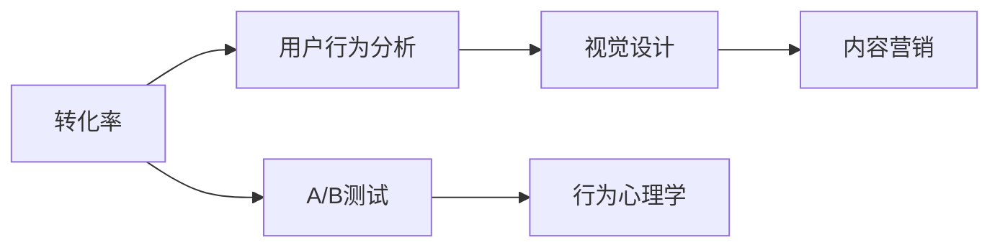

                 

# 如何打造高转化率的销售页面

## 1. 背景介绍

在当今数字化时代，销售页面已成为在线业务不可或缺的组成部分。无论是在电子商务网站、社交媒体还是移动应用上，一个精心设计的销售页面能够显著提升用户体验，促进转化率。然而，构建一个高效转化的销售页面并不容易，它需要深刻理解目标用户、明确的产品定位，并运用心理学、设计原则等跨学科知识。本文将深入探讨如何打造高转化率的销售页面，帮助读者掌握关键技术和策略。

## 2. 核心概念与联系

### 2.1 核心概念概述

- **转化率 (Conversion Rate)**：用户完成预期动作（如购买、注册等）的比率，是衡量销售页面效果的关键指标。
- **用户行为分析 (User Behavior Analysis)**：通过跟踪用户在页面上的行为，分析其购买意愿和转化障碍，优化页面设计。
- **A/B测试 (A/B Testing)**：同时展示两个或多个页面版本，通过对比其表现来确定最佳设计。
- **视觉设计 (Visual Design)**：通过色彩、排版、字体等元素，营造良好的视觉体验，提升用户对品牌的好感。
- **行为心理学 (Behavioral Psychology)**：运用心理学原理，引导用户做出预期行为。
- **内容营销 (Content Marketing)**：通过优质内容吸引用户注意力，建立信任，增加转化机会。

### 2.2 核心概念联系的 Mermaid 流程图



此图展示了转化率与相关核心概念的联系：用户行为分析、A/B测试、视觉设计和行为心理学都直接影响到最终的转化率，而内容营销则是提升转化率的有效手段。

## 3. 核心算法原理 & 具体操作步骤

### 3.1 算法原理概述

高转化率的销售页面设计原理可以归结为以下几点：

- **用户中心**：所有设计决策应以用户需求和行为为导向，确保页面易于使用、信息清晰、互动性强。
- **明确行动呼吁 (CTA)**：在关键位置明显地展示行动呼吁，如“立即购买”、“注册”等，引导用户进行下一步操作。
- **视觉一致性**：保持品牌视觉风格的一致性，使用户在浏览多个页面时感到熟悉和舒适。
- **简化流程**：通过减少页面步骤、自动化表单等方法，减少用户操作负担，提升转化率。

### 3.2 算法步骤详解

1. **需求分析**：明确目标用户群体的特点、需求和痛点，以确定页面设计的基本方向。
2. **信息架构 (IA)**：设计页面的信息架构，确保内容组织逻辑清晰、层次分明。
3. **原型设计**：使用工具如Sketch、Figma等创建页面原型，并进行初步的用户测试。
4. **视觉设计**：基于品牌风格和用户反馈，对原型进行视觉优化。
5. **CTA设计**：确保CTA明确、显著，并放在页面关键位置。
6. **A/B测试**：设计多个页面版本，通过A/B测试确定最佳设计方案。
7. **优化与迭代**：根据测试结果不断优化页面，直至达到预期效果。

### 3.3 算法优缺点

**优点**：

- **数据驱动**：通过用户行为数据和A/B测试结果，确保设计决策的科学性。
- **灵活性**：不同用户群体有不同的需求和偏好，灵活调整设计可以适应不同用户。
- **持续优化**：A/B测试和用户反馈能够帮助持续改进页面，提高转化率。

**缺点**：

- **设计成本高**：原型设计和A/B测试需要投入大量时间和资源。
- **迭代周期长**：每次优化都需要重新测试，周期较长。
- **依赖技术手段**：设计和测试过程需要依赖特定的工具和技术，对技术要求较高。

### 3.4 算法应用领域

此算法不仅适用于电子商务网站、在线广告等商业场景，也广泛应用于应用内购买、订阅服务、社交媒体推广等领域，旨在提升用户转化率和品牌忠诚度。

## 4. 数学模型和公式 & 详细讲解 & 举例说明

### 4.1 数学模型构建

为了量化转化率，我们可以构建如下数学模型：

$$
\text{Conversion Rate} = \frac{\text{Number of Conversions}}{\text{Number of Visits}}
$$

其中，“Conversion”表示完成预期动作的用户数，“Visit”表示访问销售页面的用户总数。

### 4.2 公式推导过程

通过A/B测试，我们可以得到不同设计版本的转化率，进而推导每个变量的影响程度。假设有两个版本A和B，其转化率分别为 $C_A$ 和 $C_B$，点击率分别为 $R_A$ 和 $R_B$，则：

$$
C_A = R_A \times C \\
C_B = R_B \times C
$$

其中，$C$ 为实际转化率，可以通过历史数据计算得到。通过比较 $C_A/C_B$ 和 $R_A/R_B$，可以分析不同设计元素对转化率的影响。

### 4.3 案例分析与讲解

假设某电子商务网站通过A/B测试发现，在CTA按钮颜色上改变后，其点击率和转化率均有所提升。通过计算得到：

$$
\frac{C_A}{C_B} = \frac{R_A}{R_B} \times \frac{C}{C_B}
$$

这表明CTA按钮颜色变化对点击率的影响更大，从而提升了整体转化率。

## 5. 项目实践：代码实例和详细解释说明

### 5.1 开发环境搭建

为了进行高效的销售页面设计，我们需要搭建一个多环境协作的开发环境。以下是一个基于Docker的开发环境搭建步骤：

1. 安装Docker和Docker Compose。
2. 创建项目目录，编写Dockerfile和docker-compose.yml文件。
3. 编写Nginx配置，确保所有服务可以通过单一域名访问。
4. 启动Docker容器，进行本地开发和测试。

### 5.2 源代码详细实现

以一个简单的电商网站为例，以下是一个基本的HTML页面代码：

```html
<!DOCTYPE html>
<html>
<head>
    <title>销售页面</title>
    <link rel="stylesheet" href="style.css">
</head>
<body>
    <header>
        <h1>欢迎访问我们的销售页面</h1>
        <nav>
            <ul>
                <li><a href="#">首页</a></li>
                <li><a href="#">产品列表</a></li>
                <li><a href="#">联系我们</a></li>
            </ul>
        </nav>
    </header>
    <main>
        <section>
            <h2>推荐产品</h2>
            <div class="product">
                
                <h3>产品名称</h3>
                <p>产品描述</p>
                <a href="#" class="buy-now">立即购买</a>
            </div>
        </section>
        <section>
            <h2>用户评价</h2>
            <ul>
                <li>用户1的评价</li>
                <li>用户2的评价</li>
            </ul>
        </section>
    </main>
    <footer>
        <p>版权所有 &copy; 2023</p>
    </footer>
</body>
</html>
```

### 5.3 代码解读与分析

- `header`和`footer`元素用于展示网站头部和底部信息，确保品牌一致性。
- `nav`元素提供导航链接，方便用户浏览不同页面。
- `main`元素包含主要内容，如推荐产品和用户评价。
- `section`元素用于组织页面内容，保持逻辑清晰。
- `product`类元素用于展示单个产品信息，CTA按钮放在关键位置。

### 5.4 运行结果展示

运行上述代码，我们可以在浏览器中看到完整的销售页面。CTA按钮“立即购买”明显、醒目，能够引导用户进行下一步操作。

## 6. 实际应用场景

### 6.1 电子商务网站

在电子商务网站中，销售页面设计对转化率的影响尤为显著。通过优化CTA按钮、简化购买流程、使用高质量的产品图片和详细描述，可以大幅提升用户转化率。

### 6.2 应用内购买

在应用内购买中，设计精简、互动性强的销售页面，结合个性化推荐和动态定价策略，能够有效提升用户购买率。

### 6.3 社交媒体广告

在社交媒体上，简洁明了、有吸引力的销售页面能够提高广告点击率和转化率，增加品牌曝光度和用户粘性。

### 6.4 未来应用展望

未来，随着AI和大数据分析技术的进步，销售页面设计将更加个性化、动态化。通过智能推荐系统、情感分析等技术，销售页面能够根据用户行为实时调整内容，提供更精准的用户体验。

## 7. 工具和资源推荐

### 7.1 学习资源推荐

- **《Web设计原理》**：一本系统介绍网页设计原则和技术的书籍，适合初学者和进阶开发者。
- **Coursera《UX Design Specialization》**：由加州大学圣地亚哥分校提供的用户体验设计课程，深入讲解用户体验设计原理和方法。
- **《转化率优化》**：一本专注于销售页面设计和优化策略的书籍，提供大量实用案例和工具。

### 7.2 开发工具推荐

- **Figma**：一个云端设计工具，支持多人协作，适合团队项目。
- **Sketch**：一款专业的矢量图形编辑工具，适合UI设计。
- **JIRA**：一款项目管理工具，用于跟踪项目进度和任务分配。

### 7.3 相关论文推荐

- **《A/B Testing in Retail: Learnings and Lessons》**：本篇论文详细介绍了在零售行业中应用A/B测试的经验和教训。
- **《The Impact of Color on E-commerce Website Conversion Rate》**：研究不同颜色对电商平台转化率的影响，提供具体的设计建议。
- **《Designing for Conversion: How to Create a Website That Inspires Action》**：一篇关于如何设计高转化率网站的实用指南。

## 8. 总结：未来发展趋势与挑战

### 8.1 研究成果总结

本文从理论到实践，深入探讨了如何打造高转化率的销售页面，通过核心概念、算法原理和具体操作步骤，提供了系统化的解决方案。未来，随着技术进步，销售页面设计将更加智能化、个性化。

### 8.2 未来发展趋势

- **智能化设计**：结合AI和大数据技术，实现个性化推荐和动态内容调整。
- **跨平台一致性**：确保不同设备和平台上的页面体验一致，提升用户满意度。
- **多渠道整合**：将销售页面设计与广告、社交媒体、SEO等渠道整合，提高品牌曝光度和转化率。

### 8.3 面临的挑战

- **设计复杂度增加**：随着功能需求增加，设计复杂度也随之提高，需要不断优化设计流程。
- **用户需求变化快**：用户需求和偏好不断变化，需要快速响应和调整设计。
- **技术和资源投入**：高转化率设计需要投入大量技术和资源，对于小型企业是一大挑战。

### 8.4 研究展望

未来研究应重点关注以下几点：

- **用户行为预测**：通过机器学习和大数据分析，预测用户行为，优化销售页面设计。
- **自适应设计**：开发自适应页面设计工具，根据用户行为和设备特性自动调整页面布局和内容。
- **多目标优化**：结合用户体验和业务目标，进行多目标优化，提升整体效果。

总之，高转化率销售页面设计是一个不断迭代和优化的过程。只有在深刻理解用户需求和行为的基础上，不断创新和调整，才能打造出高转化率的销售页面，提升品牌竞争力。

## 9. 附录：常见问题与解答

**Q1: 如何确定CTA按钮的最佳位置？**

A: CTA按钮的最佳位置应根据页面内容和用户行为分析确定。一般来说，CTA按钮应放在页面最显眼的位置，如页面顶部、底部或产品介绍页的最后。可以通过A/B测试确定最佳位置。

**Q2: 设计中应考虑哪些视觉元素？**

A: 视觉元素应保持品牌一致性，并根据用户行为进行分析。常用的视觉元素包括颜色、字体、排版、图片等。颜色和字体应选择与品牌调性相符的样式，排版应清晰易读，图片应具有高分辨率和高质量。

**Q3: 如何在设计中避免使用过多的文字？**

A: 通过简洁的标题、清晰的列表和图标，可以有效地减少文字内容。使用图像和视频等非文本元素，可以更好地传达信息。此外，使用动态效果，如鼠标悬停效果，可以提供更多信息，减少文字内容。

**Q4: 如何确保设计响应式？**

A: 通过响应式设计框架（如Bootstrap、Foundation等），确保页面在不同设备和屏幕尺寸上均能良好显示。使用媒体查询和弹性布局，可以适应不同的设备特性。

**Q5: 如何评估设计效果？**

A: 通过用户测试、A/B测试和网站分析工具（如Google Analytics），评估设计效果。收集用户行为数据，分析点击率、转化率等关键指标，不断优化设计。

---

作者：禅与计算机程序设计艺术 / Zen and the Art of Computer Programming

