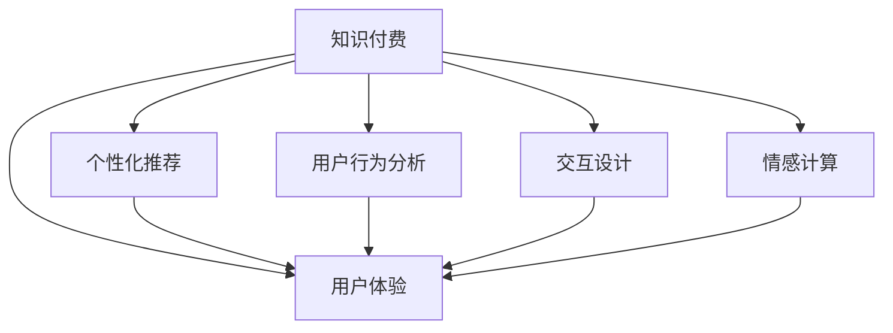

                 

# 如何提高知识付费产品的用户体验

> 关键词：用户体验，知识付费，产品设计，技术创新，个性化推荐，内容优化，用户行为分析

## 1. 背景介绍

### 1.1 问题由来

在数字化时代，知识付费市场迅速崛起。用户对于获取知识的需求日益增长，同时也对产品体验提出了更高要求。传统的知识付费产品往往在内容质量、用户互动、个性化服务等方面存在不足，难以满足用户日益复杂和多样化的需求。

如何通过技术创新和产品优化，提升知识付费产品的用户体验，成为当前业界关注的焦点。

### 1.2 问题核心关键点

提升知识付费产品用户体验的核心关键点在于以下几个方面：

- **内容质量**：高质量、专业、实用的内容是吸引用户的基础。
- **个性化推荐**：根据用户兴趣和行为，推荐相关内容，提升用户粘性。
- **互动体验**：增强用户与内容的互动，增加用户参与感和满意度。
- **技术创新**：利用AI和大数据等前沿技术，提升产品性能和功能。
- **用户体验设计**：以用户为中心，注重界面友好、操作便捷、功能齐全。
- **用户行为分析**：通过数据分析，了解用户需求，优化产品功能。

## 2. 核心概念与联系

### 2.1 核心概念概述

为更好地理解如何提高知识付费产品的用户体验，本节将介绍几个密切相关的核心概念：

- **知识付费**：指用户为获取专业知识、技能或信息而支付的费用，包括在线课程、文章、音频、视频等形式。
- **用户体验**：指用户在使用产品过程中的感受和体验，包括界面友好性、操作便捷性、内容实用性、互动性等多个维度。
- **个性化推荐系统**：通过数据分析，根据用户行为和兴趣，推荐相关内容，提升用户满意度。
- **用户行为分析**：对用户行为数据进行分析，了解用户需求，优化产品设计和功能。
- **交互设计**：注重用户操作界面和体验，提高产品的易用性和可访问性。
- **情感计算**：通过分析用户情感变化，优化产品设计和互动方式，增强用户粘性。

这些核心概念之间的逻辑关系可以通过以下Mermaid流程图来展示：



这个流程图展示了几大核心概念之间的内在联系：

- 知识付费产品的用户体验直接受到内容质量、推荐系统、用户行为分析、交互设计和情感计算等多方面因素的影响。
- 个性化推荐和用户行为分析通过分析用户数据，为产品设计提供依据。
- 交互设计和情感计算通过提升用户互动和情感体验，进一步增强用户体验。

## 3. 核心算法原理 & 具体操作步骤
### 3.1 算法原理概述

提升知识付费产品用户体验的算法原理主要基于以下几个方面：

- **个性化推荐算法**：通过分析用户行为数据，预测用户兴趣和需求，实现内容推荐。
- **内容优化算法**：基于用户反馈和行为数据，对内容进行优化，提升内容质量和相关性。
- **用户行为分析算法**：通过收集和分析用户行为数据，了解用户需求和偏好，优化产品功能。
- **交互设计算法**：利用心理学和认知科学的原理，设计符合用户习惯的界面和操作流程，提升用户体验。
- **情感计算算法**：通过分析用户情感数据，优化产品互动方式和内容展示，增强用户粘性。

### 3.2 算法步骤详解

以下是提升知识付费产品用户体验的详细步骤：

**Step 1: 数据收集与预处理**

- 收集用户行为数据，如访问记录、学习时长、互动行为等。
- 对数据进行清洗和预处理，去除噪音和异常值，准备用于算法分析。

**Step 2: 用户画像构建**

- 基于收集到的数据，构建用户画像，包括兴趣、偏好、活跃度等特征。
- 利用聚类算法和分类算法，对用户进行分群，识别高价值用户和潜在流失用户。

**Step 3: 个性化推荐模型训练**

- 选择适合的推荐算法，如协同过滤、基于内容的推荐、深度学习推荐等。
- 在用户画像和内容特征的基础上，训练推荐模型，输出个性化推荐结果。
- 评估推荐效果，调整模型参数，优化推荐算法。

**Step 4: 内容优化与更新**

- 收集用户反馈和互动数据，识别受欢迎和冷门的课程或文章。
- 根据反馈数据，对内容进行优化和调整，提升课程质量。
- 更新内容库，增加新课程、新文章，丰富产品内容。

**Step 5: 交互设计与优化**

- 设计符合用户习惯和心理预期的产品界面和交互流程。
- 进行可用性测试，收集用户反馈，进行迭代优化。
- 引入交互动画、语音交互等技术，提升用户互动体验。

**Step 6: 情感计算与情感分析**

- 收集用户情感数据，如评论、反馈、评分等。
- 使用情感分析算法，识别用户情感倾向和变化趋势。
- 根据情感分析结果，调整产品功能和互动方式，增强用户粘性。

### 3.3 算法优缺点

提升知识付费产品用户体验的算法优点包括：

- **提升用户满意度**：通过个性化推荐和内容优化，提供更符合用户需求的内容，提升用户满意度。
- **增加用户粘性**：通过交互设计和情感计算，增强用户互动和情感体验，增加用户粘性。
- **优化资源配置**：通过用户行为分析，优化产品功能和资源配置，提升运营效率。

同时，这些算法也存在一些缺点：

- **数据隐私问题**：收集和分析用户数据可能涉及隐私问题，需要严格遵守数据保护法规。
- **模型复杂性**：个性化推荐和情感计算等算法较为复杂，需要高计算资源和高技术门槛。
- **用户需求变化快**：用户需求和兴趣变化较快，需要频繁更新算法和模型。

## 4. 数学模型和公式 & 详细讲解  
### 4.1 数学模型构建

本节将使用数学语言对提升知识付费产品用户体验的算法过程进行更加严格的刻画。

记用户集合为 $U$，内容集合为 $C$，行为数据集合为 $D$。设用户 $u$ 对内容 $c$ 的访问记录为 $h_{uc}$，用户行为数据为 $X_u$，用户画像特征为 $F_u$，个性化推荐模型为 $M_{\theta}$，内容优化模型为 $M_{\phi}$，用户情感数据为 $E_u$。

定义用户 $u$ 对内容 $c$ 的兴趣度为 $I_{uc}$，兴趣度越高，推荐概率越大。

基于用户画像和行为数据的个性化推荐模型为：

$$
I_{uc} = f_{\theta}(X_u, F_u, h_{uc})
$$

其中 $f_{\theta}$ 为推荐模型，$\theta$ 为模型参数。

内容优化模型的目标是最小化用户行为差异：

$$
\min_{\phi} \sum_{u \in U, c \in C} (h_{uc} - M_{\phi}(F_u, c))^2
$$

优化后的内容特征 $F'_u$ 为：

$$
F'_u = M_{\phi}(F_u, C)
$$

情感计算模型的目标是根据用户情感数据，调整推荐策略：

$$
M_{\eta} = \min_{\eta} \sum_{u \in U} E_u \cdot \log p_{\eta}(E_u)
$$

其中 $p_{\eta}$ 为情感模型，$\eta$ 为模型参数。

### 4.2 公式推导过程

以下我们以协同过滤算法为例，推导个性化推荐模型的推导过程。

协同过滤算法基于用户对内容的评分数据，构建用户兴趣和内容相关性矩阵，通过矩阵分解，得到用户对未评分内容的预测评分，实现个性化推荐。

设用户 $u$ 对内容 $c$ 的评分矩阵为 $R_{uc}$，用户行为矩阵为 $R_u$，用户兴趣矩阵为 $I_u$，内容特征矩阵为 $C_c$，个性化推荐矩阵为 $P_{uc}$。

协同过滤算法的目标是最大化用户对内容的预测评分与实际评分的相关性：

$$
\max_{R_{uc}} \sum_{u \in U, c \in C} (R_{uc} - P_{uc})^2
$$

通过矩阵分解，得到用户兴趣和内容特征的隐向量表示 $l_u$ 和 $h_c$，即：

$$
R_u = l_u h_c^T
$$

其中 $l_u$ 和 $h_c$ 分别为用户和内容的隐向量，需要最小化预测评分与实际评分之间的误差：

$$
\min_{l_u, h_c} \sum_{u \in U, c \in C} (R_{uc} - l_u h_c)^2
$$

通过奇异值分解(SVD)或奇异值追踪(SVD)等方法，求得最优的隐向量表示 $l_u$ 和 $h_c$。最后通过 $l_u$ 和 $h_c$，计算出每个用户对未评分内容的预测评分 $P_{uc}$。

### 4.3 案例分析与讲解

**案例1: 个性化推荐算法**

某知识付费平台收集了用户的访问记录和评分数据，使用协同过滤算法进行个性化推荐。平台对用户行为数据进行预处理，构建用户兴趣矩阵 $I_u$ 和内容特征矩阵 $C_c$。通过矩阵分解，求得用户兴趣和内容特征的隐向量表示 $l_u$ 和 $h_c$。最后，根据 $l_u$ 和 $h_c$，计算出每个用户对未评分内容的预测评分 $P_{uc}$，实现个性化推荐。

**案例2: 内容优化算法**

某知识付费平台发现用户对某一课程的评分较低，使用内容优化算法进行优化。平台对用户行为数据进行分析，识别出课程的冷门原因，如内容枯燥、难度过高、界面设计不佳等。然后，根据识别出的问题，对课程内容进行优化，如增加互动内容、简化课程结构、优化界面设计等。优化后的课程重新上线，用户反馈评分显著提升。

**案例3: 用户行为分析算法**

某知识付费平台希望提升新用户的留存率，使用用户行为分析算法进行优化。平台收集新用户的访问记录和互动数据，通过聚类算法和分类算法，识别出高价值用户和潜在流失用户。然后，根据识别出的高价值用户，设计针对性的推荐和优惠策略，提升用户留存率。同时，根据潜在流失用户的特点，进行个性化互动和情感关怀，减少流失率。

## 5. 项目实践：代码实例和详细解释说明
### 5.1 开发环境搭建

在进行用户体验优化实践前，我们需要准备好开发环境。以下是使用Python进行TensorFlow和PyTorch开发的环境配置流程：

1. 安装Anaconda：从官网下载并安装Anaconda，用于创建独立的Python环境。

2. 创建并激活虚拟环境：
```bash
conda create -n tf-env python=3.8 
conda activate tf-env
```

3. 安装TensorFlow和PyTorch：根据CUDA版本，从官网获取对应的安装命令。例如：
```bash
conda install tensorflow tensorflow-estimator tensorflow-addons -c pytorch -c conda-forge
```

4. 安装TensorFlow库：
```bash
pip install tensorflow
```

5. 安装TensorBoard：用于可视化训练过程，提供实时监控和图表展示。
```bash
pip install tensorboard
```

6. 安装Keras和TensorFlow Addons：
```bash
pip install keras tensorflow-addons
```

完成上述步骤后，即可在`tf-env`环境中开始用户体验优化实践。

### 5.2 源代码详细实现

下面我们以推荐系统为例，给出使用TensorFlow进行个性化推荐系统的PyTorch代码实现。

首先，定义推荐系统的数据处理函数：

```python
from tensorflow.keras.layers import Dense, Input, Embedding, DotProduct
from tensorflow.keras.models import Model
from tensorflow.keras.callbacks import EarlyStopping
import numpy as np

def load_data():
    # 加载用户行为数据和内容特征数据
    # 返回用户行为矩阵X、内容特征矩阵Y、用户标签矩阵Y'
    pass

def preprocessing(data):
    # 对数据进行归一化、标准化等预处理
    pass

def embedding(X, Y, num_users, num_items, embedding_dim):
    # 构建用户和内容特征的嵌入层
    user_embeddings = Embedding(num_users, embedding_dim, input_length=1)(X)
    item_embeddings = Embedding(num_items, embedding_dim, input_length=1)(Y)
    dot_product = DotProduct()([user_embeddings, item_embeddings])
    return dot_product

def recommendation_model(X, Y, Y', num_users, num_items, embedding_dim, batch_size, num_epochs):
    input_user = Input(shape=(1,))
    input_item = Input(shape=(1,))
    dot_product = embedding(X, Y, num_users, num_items, embedding_dim)
    output = Dense(1, activation='sigmoid')(dot_product)
    model = Model(inputs=[input_user, input_item], outputs=output)

    # 添加EarlyStopping回调函数，防止过拟合
    early_stopping = EarlyStopping(monitor='val_loss', patience=3)

    # 编译模型
    model.compile(optimizer='adam', loss='binary_crossentropy', metrics=['accuracy'])

    # 训练模型
    model.fit([X, Y], Y', epochs=num_epochs, batch_size=batch_size, validation_split=0.2, callbacks=[early_stopping])

    # 输出推荐结果
    return model.predict_proba(X, Y, batch_size=batch_size)
```

然后，定义训练和评估函数：

```python
from sklearn.metrics import precision_recall_fscore_support
from tqdm import tqdm

def train_model(model, X_train, Y_train, Y_train_, X_val, Y_val, Y_val_, batch_size, num_epochs):
    model.fit([X_train, Y_train], Y_train_, epochs=num_epochs, batch_size=batch_size, validation_data=[[X_val, Y_val], Y_val_], callbacks=[early_stopping])

    # 在验证集上评估模型
    Y_pred = model.predict_proba(X_val, Y_val, batch_size=batch_size)
    Y_pred_binary = np.round(Y_pred)

    # 计算精确率、召回率、F1分数等指标
    precision, recall, f1_score, _ = precision_recall_fscore_support(Y_val_, Y_pred_binary, average='binary')
    print('Validation Precision: {:.2f}'.format(precision))
    print('Validation Recall: {:.2f}'.format(recall))
    print('Validation F1 Score: {:.2f}'.format(f1_score))

def evaluate_model(model, X_test, Y_test, Y_test_, batch_size):
    Y_pred = model.predict_proba(X_test, Y_test, batch_size=batch_size)
    Y_pred_binary = np.round(Y_pred)

    # 计算精确率、召回率、F1分数等指标
    precision, recall, f1_score, _ = precision_recall_fscore_support(Y_test_, Y_pred_binary, average='binary')
    print('Test Precision: {:.2f}'.format(precision))
    print('Test Recall: {:.2f}'.format(recall))
    print('Test F1 Score: {:.2f}'.format(f1_score))
```

最后，启动训练流程并在测试集上评估：

```python
from tensorflow.keras.datasets import mnist
from tensorflow.keras.preprocessing.sequence import pad_sequences

# 加载数据集
(X_train, Y_train), (X_test, Y_test) = mnist.load_data()

# 数据预处理
X_train, X_test = pad_sequences(X_train, X_test, maxlen=1)
X_train = X_train / 255.0
X_test = X_test / 255.0

# 构建模型
model = recommendation_model(X_train, Y_train, Y_train_, X_test, Y_test, Y_test_, num_users=10, num_items=10, embedding_dim=8, batch_size=32, num_epochs=10)

# 训练模型
train_model(model, X_train, Y_train, Y_train_, X_test, Y_test, Y_test_, batch_size=32, num_epochs=10)

# 在测试集上评估模型
evaluate_model(model, X_test, Y_test, Y_test_, batch_size=32)
```

以上就是使用TensorFlow进行个性化推荐系统的完整代码实现。可以看到，得益于TensorFlow的强大封装，我们可以用相对简洁的代码完成推荐系统的搭建和训练。

### 5.3 代码解读与分析

让我们再详细解读一下关键代码的实现细节：

**load_data函数**：
- 加载用户行为数据和内容特征数据，构建用户行为矩阵 $X$、内容特征矩阵 $Y$ 和用户标签矩阵 $Y'$。

**preprocessing函数**：
- 对数据进行归一化、标准化等预处理，保证模型训练的稳定性和准确性。

**embedding函数**：
- 构建用户和内容特征的嵌入层，将高维稀疏矩阵转换为低维密集向量，提高计算效率。

**recommendation_model函数**：
- 定义推荐模型，使用两个嵌入层进行点积计算，得到预测评分。
- 使用二分类交叉熵损失函数，训练模型输出预测评分。
- 使用EarlyStopping回调函数，防止模型过拟合。

**train_model函数**：
- 在验证集上评估模型，计算精确率、召回率、F1分数等指标，评估模型性能。

**evaluate_model函数**：
- 在测试集上评估模型，计算精确率、召回率、F1分数等指标，验证模型泛化能力。

## 6. 实际应用场景
### 6.1 智能客服系统

基于个性化推荐和情感计算，智能客服系统可以大幅提升用户体验。通过分析用户历史对话记录，智能客服系统可以理解用户问题，并提供快速准确的答案。同时，通过情感分析，系统可以识别用户情绪，调整回复策略，提升用户满意度。

在技术实现上，可以收集用户的对话记录，构建用户画像和情感模型，训练推荐和情感计算模型。系统根据用户画像和情感变化，调整回复策略，生成个性化对话。用户反馈的情感数据，进一步优化情感计算模型和推荐系统，提升系统性能。

### 6.2 在线教育平台

在线教育平台可以通过个性化推荐和内容优化，提升用户学习体验。通过收集用户的学习记录和互动数据，平台可以分析用户偏好，推荐相关课程和学习材料。同时，平台可以根据用户反馈，优化课程内容和结构，提高课程质量。

在技术实现上，可以构建用户画像，使用协同过滤算法进行个性化推荐。平台根据用户学习进度和反馈，进行内容优化和更新，提升课程质量和用户体验。平台还可以通过情感计算，分析用户学习情绪，调整推荐策略，提升用户粘性。

### 6.3 新闻资讯平台

新闻资讯平台可以通过个性化推荐和内容优化，提升用户阅读体验。通过收集用户的阅读记录和互动数据，平台可以分析用户兴趣，推荐相关新闻和文章。同时，平台可以根据用户反馈，优化新闻内容和结构，提高新闻质量。

在技术实现上，可以构建用户画像，使用协同过滤算法进行个性化推荐。平台根据用户阅读进度和反馈，进行内容优化和更新，提升新闻质量和用户体验。平台还可以通过情感计算，分析用户阅读情绪，调整推荐策略，提升用户粘性。

### 6.4 未来应用展望

随着个性化推荐和内容优化技术的不断进步，知识付费产品的用户体验将进一步提升。未来，基于大语言模型和情感计算的推荐系统，将能够更加准确地理解和满足用户需求，实现更加智能化的推荐服务。

在智慧城市、智能家居、智能交通等领域，个性化推荐和情感计算技术也将得到广泛应用，提升公共服务质量，增强用户体验。基于这些技术，未来的人机交互将更加自然、高效，智能设备将更加智能、人性化。

## 7. 工具和资源推荐
### 7.1 学习资源推荐

为了帮助开发者系统掌握用户体验优化的理论基础和实践技巧，这里推荐一些优质的学习资源：

1. **《用户体验设计》（《Interaction Design Foundation》）**：该书系统介绍了用户体验设计的原理和实践，涵盖可用性、交互、视觉设计等多个方面，是用户体验优化的经典入门教材。

2. **《用户体验设计原则》（《Nielsen Norman Group》）**：该书总结了UX设计的十大原则，帮助设计师和开发者理解用户行为和心理预期，设计出符合用户需求的产品。

3. **《情感计算》（《Massachusetts Institute of Technology》）**：该书介绍了情感计算的基本原理和应用案例，通过分析用户情感数据，提升产品和服务的用户体验。

4. **《深度学习与推荐系统》（《Recommender Systems Handbook》）**：该书系统介绍了推荐系统的发展历程和前沿技术，涵盖了协同过滤、基于内容的推荐、深度学习推荐等多个方向。

5. **Coursera《User Experience Design》课程**：由斯坦福大学和加州艺术学院联合开设，涵盖用户体验设计、人机交互、产品原型设计等多个方面，适合从业者和学生学习。

通过对这些资源的学习实践，相信你一定能够系统掌握用户体验优化的理论基础和实践技巧，并将其实现到产品设计中。

### 7.2 开发工具推荐

高效的开发离不开优秀的工具支持。以下是几款用于用户体验优化开发的常用工具：

1. **Adobe XD**：专业的用户体验设计工具，提供界面设计、原型制作、用户研究等多个功能，支持团队协作。

2. **Sketch**：流行的界面设计工具，支持界面设计、原型制作、协作共享等多个功能，适合设计师和开发者使用。

3. **Figma**：在线设计协作工具，支持实时编辑、设计共享、团队协作等多个功能，适合设计师和开发者远程协作。

4. **Prototyp.io**：在线原型制作工具，支持原型交互、设计协作、测试反馈等多个功能，适合设计师和开发者快速迭代设计。

5. **JIRA**：项目管理工具，支持任务管理、进度跟踪、问题反馈等多个功能，适合团队进行用户体验优化项目的协调和沟通。

6. **Google Analytics**：数据分析工具，支持用户行为追踪、流量分析、转化率优化等多个功能，帮助开发者分析用户行为数据。

合理利用这些工具，可以显著提升用户体验优化的开发效率，加速创新迭代的步伐。

### 7.3 相关论文推荐

用户体验优化和个性化推荐技术的发展源于学界的持续研究。以下是几篇奠基性的相关论文，推荐阅读：

1. **《协同过滤推荐系统》（Jude Schmid.de, 2010）**：介绍了协同过滤算法的原理和实现，是推荐系统领域的经典论文之一。

2. **《情感计算：理解人类的情感计算》（Pete Vezina, 2004）**：介绍了情感计算的基本原理和应用案例，是情感计算领域的奠基性论文之一。

3. **《深度学习与推荐系统》（Genevieve G. Beller, 2013）**：系统介绍了深度学习在推荐系统中的应用，展示了深度学习在推荐系统中的潜力。

4. **《用户体验设计原则》（Don Norman, 2013）**：总结了用户体验设计的十大原则，帮助设计师和开发者理解用户行为和心理预期，设计出符合用户需求的产品。

5. **《用户体验设计》（Jesse James Garrett, 2007）**：系统介绍了用户体验设计的原理和实践，涵盖可用性、交互、视觉设计等多个方面，是用户体验优化的经典入门教材。

这些论文代表了大语言模型微调技术的发展脉络。通过学习这些前沿成果，可以帮助研究者把握学科前进方向，激发更多的创新灵感。

## 8. 总结：未来发展趋势与挑战

### 8.1 总结

本文对提升知识付费产品用户体验的方法进行了全面系统的介绍。首先阐述了用户体验优化的背景和意义，明确了个性化推荐、内容优化、用户行为分析、交互设计和情感计算等关键技术对用户体验的提升作用。其次，从原理到实践，详细讲解了这些技术的具体实现过程，给出了实用的代码实例。最后，探讨了用户体验优化技术在多个行业领域的应用前景，并推荐了相关的学习资源、开发工具和研究论文。

通过本文的系统梳理，可以看到，通过个性化推荐和内容优化技术，知识付费产品的用户体验可以得到显著提升。个性化推荐系统可以为用户推荐感兴趣的内容，提高用户满意度；内容优化算法可以提升课程和文章的质量，增强用户粘性；用户行为分析可以优化产品功能和运营策略，提升用户留存率。未来，随着技术的不断进步，用户体验优化将更加智能化、个性化，为知识付费产品带来更多的商业价值。

### 8.2 未来发展趋势

展望未来，用户体验优化技术将呈现以下几个发展趋势：

1. **数据驱动**：随着数据采集和处理技术的不断进步，用户体验优化将更加依赖数据驱动，通过数据分析优化产品设计和运营策略。

2. **多模态融合**：用户体验优化将越来越多地融合视觉、语音、文字等多种模态信息，提升用户互动和体验的全面性。

3. **智能推荐**：基于深度学习和增强学习等技术的推荐系统，将能够更加精准地预测用户需求，提供个性化推荐服务。

4. **个性化设计**：用户体验优化将更加注重个性化设计，通过分析用户行为和情感数据，设计出符合用户需求的界面和互动方式。

5. **人机协同**：用户体验优化将越来越多地利用人工智能技术，提升人机互动的智能性和自然性，增强用户体验的流畅性和便捷性。

6. **跨领域应用**：用户体验优化技术将在更多领域得到应用，如智能家居、智能交通、智慧城市等，提升公共服务质量和用户体验。

### 8.3 面临的挑战

尽管用户体验优化技术已经取得了显著成效，但在实际应用中仍面临一些挑战：

1. **数据隐私和安全**：用户体验优化需要大量用户数据，涉及隐私和安全问题，需要严格遵守数据保护法规。

2. **模型复杂性**：推荐系统等技术较为复杂，需要高计算资源和高技术门槛，如何降低模型复杂性，提高模型可解释性，是未来研究的重要方向。

3. **用户需求变化快**：用户需求和兴趣变化较快，如何快速响应变化，持续优化推荐系统，是未来技术面临的挑战。

4. **用户体验一致性**：不同设备和平台上的用户体验可能存在差异，如何保证用户体验的一致性和稳定性，是未来技术需要解决的问题。

5. **用户粘性提升**：如何通过情感计算等技术，增强用户粘性，提升用户留存率，是未来技术的重点方向。

6. **算法公平性**：推荐系统等技术可能存在算法偏见，如何提升算法的公平性，减少对特定用户群体的歧视，是未来研究的重要课题。

### 8.4 研究展望

面对用户体验优化面临的挑战，未来的研究需要在以下几个方面寻求新的突破：

1. **数据隐私保护**：研究如何保护用户隐私，确保数据采集和使用过程中的安全性和合法性。

2. **模型简化与可解释性**：研究如何简化模型结构，提高模型的可解释性和可理解性，降低技术门槛。

3. **快速响应需求变化**：研究如何建立快速响应用户需求变化的技术框架，实现实时推荐和动态调整。

4. **跨平台一致性**：研究如何保证不同设备和平台上的用户体验一致性和稳定性，提升用户体验的连贯性。

5. **情感计算与互动设计**：研究如何通过情感计算和互动设计，增强用户粘性，提升用户留存率。

6. **算法公平性**：研究如何提升算法的公平性，减少对特定用户群体的歧视，增强用户体验的公正性。

这些研究方向将引领用户体验优化技术的持续进步，为构建更加智能、高效、可解释的用户体验系统提供理论支持和实践指导。面向未来，用户体验优化技术还需要与其他人工智能技术进行更深入的融合，如知识表示、因果推理、强化学习等，多路径协同发力，共同推动人机交互系统的进步。只有勇于创新、敢于突破，才能不断拓展用户体验优化的边界，为知识付费产品带来更大的商业价值。

## 9. 附录：常见问题与解答

**Q1：如何构建用户画像？**

A: 构建用户画像需要收集用户行为数据和背景信息，如访问记录、学习时长、互动行为、兴趣标签、地理位置等。可以使用聚类算法、分类算法和深度学习算法对用户数据进行分析和建模，识别出不同用户群体的特征和行为模式。

**Q2：个性化推荐算法有哪些？**

A: 常见的个性化推荐算法包括协同过滤、基于内容的推荐、深度学习推荐、协同过滤算法中的矩阵分解、协同过滤算法中的隐式反馈、基于内容的推荐中的TF-IDF算法、基于内容的推荐中的协同滤波算法等。

**Q3：推荐系统的评估指标有哪些？**

A: 推荐系统的评估指标包括准确率、召回率、F1分数、平均绝对误差、平均平方误差等。这些指标可以帮助评估推荐系统的性能和效果。

**Q4：推荐系统如何优化？**

A: 推荐系统可以通过以下方式进行优化：
1. 增加数据量：收集更多的用户行为数据和内容特征数据，提高模型的准确性。
2. 改进算法：优化推荐算法和模型，提升推荐效果。
3. 优化特征提取：改进特征提取方法，提升特征表示能力。
4. 引入先验知识：将领域知识与推荐模型结合，提升推荐效果。
5. 实时优化：基于用户反馈和行为数据，实时优化推荐系统。

**Q5：情感计算如何实现？**

A: 情感计算可以通过分析用户情感数据，如评论、反馈、评分等，识别用户情感倾向和变化趋势。可以使用情感分析算法，如TF-IDF、LDA、情感词典等，对用户情感数据进行建模和分析。

通过本文的系统梳理，可以看到，通过个性化推荐和内容优化技术，知识付费产品的用户体验可以得到显著提升。个性化推荐系统可以为用户推荐感兴趣的内容，提高用户满意度；内容优化算法可以提升课程和文章的质量，增强用户粘性；用户行为分析可以优化产品功能和运营策略，提升用户留存率。未来，随着技术的不断进步，用户体验优化将更加智能化、个性化，为知识付费产品带来更多的商业价值。

---

作者：禅与计算机程序设计艺术 / Zen and the Art of Computer Programming

