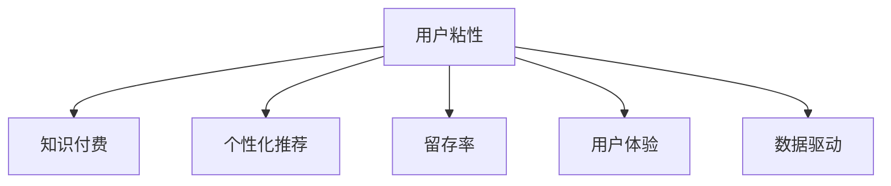

                 

# 如何提高知识付费产品的用户粘性

> 关键词：用户粘性,知识付费,数据驱动,个性化推荐,留存率优化,用户体验,行为分析

## 1. 背景介绍

### 1.1 问题由来
在知识付费时代，内容消费的竞争日益激烈。如何提高知识付费产品的用户粘性，提升用户留存率和续费率，成为各大平台亟需解决的问题。产品粘性不仅仅意味着增加订阅量，更体现在用户的高频互动、持久消费和口碑传播上。本文旨在从数据驱动的角度，探讨如何通过个性化推荐、内容迭代和用户行为分析，提升知识付费产品的用户粘性。

### 1.2 问题核心关键点
当前，知识付费产品面临着用户流失率高、用户粘性差等普遍问题。核心在于如何提升用户对内容的粘性和互动频率，实现用户的长期留存和复购。提高用户粘性的关键在于以下几个方面：
- 高质量内容的持续供给：让用户对平台产生依赖，主动寻求内容更新。
- 精准个性化推荐：通过用户画像和大数据分析，推送相关度高的内容。
- 提升用户体验：优化产品界面和交互流程，提高用户的使用便捷性和满意度。
- 科学运营管理：通过用户行为数据，实时调整产品策略，保持市场竞争力。

## 2. 核心概念与联系

### 2.1 核心概念概述

为更好地理解如何通过数据驱动提升知识付费产品的用户粘性，本节将介绍几个密切相关的核心概念：

- 用户粘性(User Engagement): 指用户在平台上持续、频繁地进行交互行为的程度。高粘性意味着用户对平台的长期依赖和忠诚度。
- 知识付费(Knowledge Pay): 指用户通过付费获取知识内容的消费模式。内容质量和推荐系统是决定用户粘性的关键因素。
- 个性化推荐(Personalization): 通过用户历史行为和属性信息，推荐相关内容，提升用户满意度。
- 留存率(Retention Rate): 指一定时间内，用户返回平台进行消费的比率。留存率的高低直接反映产品粘性。
- 用户体验(User Experience): 用户在使用产品时的体验感受，涉及界面设计、交互逻辑等多个方面。好的用户体验能提高用户粘性。
- 数据驱动(Data-Driven): 在决策过程中，以数据为基础进行分析和优化，提高运营效率。

这些核心概念之间的逻辑关系可以通过以下Mermaid流程图来展示：



这个流程图展示了几者之间的联系：

1. 用户粘性通过个性化推荐、留存率和用户体验三个方面进行驱动。
2. 数据驱动是支撑个性化推荐和用户体验优化的技术基础。

## 3. 核心算法原理 & 具体操作步骤
### 3.1 算法原理概述

提升知识付费产品的用户粘性，本质上是一个通过数据驱动进行产品优化的过程。其核心思想是：通过持续收集用户行为数据，结合用户画像和历史互动，进行个性化推荐和内容迭代，从而提高用户粘性。

形式化地，假设知识付费平台的用户数量为 $U$，内容数量为 $C$，用户与内容的交互次数为 $I$，用户留存率目标为 $R$。提升用户粘性的目标可以表示为：

$$
\max_{I,C} I \quad s.t. \quad R \geq target
$$

在实践中，我们通常使用基于梯度的优化算法（如SGD、Adam等）来近似求解上述最优化问题。设 $\eta$ 为学习率，$\lambda$ 为正则化系数，则推荐系统优化目标可以表示为：

$$
\min_{\theta} \mathcal{L}(R_{pred},R_{act})
$$

其中 $R_{pred}$ 为推荐模型预测的留存率，$R_{act}$ 为实际留存率，$\mathcal{L}$ 为自定义损失函数，用于衡量预测与实际的差异。

### 3.2 算法步骤详解

提升知识付费产品的用户粘性，主要包括以下几个关键步骤：

**Step 1: 数据收集和处理**
- 收集用户行为数据，包括但不限于浏览记录、点击行为、学习时长、付费行为等。
- 对数据进行清洗和预处理，去除异常值和噪声，生成用户行为数据集。

**Step 2: 用户画像建模**
- 利用机器学习模型（如K-means、LDA等）对用户行为数据进行聚类和建模，得到用户画像。
- 根据用户画像，生成多维度的用户特征向量，用于个性化推荐系统。

**Step 3: 内容推荐优化**
- 结合用户画像和内容特征，设计推荐算法（如协同过滤、基于深度学习的推荐系统等），计算每个内容与用户之间的相关度。
- 根据相关度排序，生成推荐列表。

**Step 4: 内容迭代与优化**
- 对高互动内容和付费内容进行重点优化，如增加图文并茂、视频讲解等形式。
- 根据用户反馈，定期更新和调整推荐内容和形式，提升用户满意度。

**Step 5: 用户行为分析**
- 定期对用户行为数据进行分析，评估推荐系统的效果和用户粘性。
- 利用A/B测试等手段，优化推荐策略和用户界面。

**Step 6: 反馈和迭代**
- 收集用户反馈意见，调整产品策略和推荐算法，持续优化用户体验。
- 利用用户行为数据，实时调整内容迭代和推荐策略。

### 3.3 算法优缺点

数据驱动的个性化推荐系统具有以下优点：
1. 精确高效：通过大规模数据分析，能够精确地推荐相关内容，提升用户满意度。
2. 个性化强：能够根据用户行为和属性信息，实现高度定制化的内容推荐。
3. 实时更新：能够根据用户行为数据实时调整推荐内容，保持内容的时效性。
4. 留存率高：通过个性化推荐和内容优化，提高用户留存率和续费率。

同时，该方法也存在一定的局限性：
1. 依赖数据质量：推荐系统的性能高度依赖于用户行为数据的质量，数据的缺失或不完整会影响推荐效果。
2. 隐私风险：用户行为数据涉及隐私，不当使用可能引发法律和伦理问题。
3. 冷启动问题：新用户缺乏历史行为数据，难以实现精准推荐。
4. 计算复杂：高维度数据和高频更新的推荐系统，对计算资源和存储需求较高。

尽管存在这些局限性，但就目前而言，数据驱动的个性化推荐方法仍然是提升知识付费产品用户粘性的重要手段。未来相关研究的重点在于如何进一步降低推荐系统的计算和存储成本，提升数据处理和隐私保护的效率。

### 3.4 算法应用领域

数据驱动的个性化推荐技术，在知识付费产品的推荐场景中得到了广泛的应用，覆盖了课程推荐、付费内容推荐、学习路径规划等多个方面。

- 课程推荐：根据用户历史学习记录和偏好，推荐相关课程。
- 付费内容推荐：推荐用户感兴趣的高质量付费内容。
- 学习路径规划：通过用户行为数据，推荐最优的学习路径和内容序列。

除了这些经典应用外，推荐技术也被创新性地应用到更多场景中，如智能笔记推荐、学习行为分析、个性化广告投放等，为知识付费产品带来全新的突破。

## 4. 数学模型和公式 & 详细讲解  
### 4.1 数学模型构建

本节将使用数学语言对知识付费产品的个性化推荐系统进行更加严格的刻画。

记用户数量为 $U=\{u_1,u_2,\cdots,u_N\}$，内容数量为 $C=\{c_1,c_2,\cdots,c_M\}$。设 $R_{act}(u,c)$ 表示用户 $u$ 在内容 $c$ 上的留存率，$I_{act}(u)$ 表示用户 $u$ 在平台上的总互动次数，$R_{pred}(u)$ 为推荐模型预测用户 $u$ 的留存率，$I_{pred}(u)$ 为推荐模型预测的用户总互动次数。

推荐模型的优化目标可以表示为：

$$
\min_{\theta} \sum_{u=1}^N \mathcal{L}(R_{pred}(u),R_{act}(u))
$$

其中 $\mathcal{L}$ 为自定义损失函数，通常使用均方误差或交叉熵损失。

### 4.2 公式推导过程

以协同过滤算法为例，推导推荐系统的目标函数及其梯度计算公式。

设 $I_{act}(u,c)$ 表示用户 $u$ 在内容 $c$ 上的互动次数，则推荐模型可以表示为：

$$
I_{pred}(u) = \sum_{c \in C} I_{act}(u,c) \times f(u,c)
$$

其中 $f(u,c)$ 为推荐模型对内容 $c$ 的评分函数。设 $R_{pred}(u)$ 为推荐模型预测的用户留存率，可以表示为：

$$
R_{pred}(u) = \frac{\sum_{c \in C} I_{pred}(u) \times R_{act}(u,c)}{\sum_{c \in C} I_{pred}(u)}
$$

推荐系统的损失函数可以表示为：

$$
\mathcal{L}(R_{pred}(u),R_{act}(u)) = \frac{1}{2N} \sum_{u=1}^N (R_{pred}(u)-R_{act}(u))^2
$$

将 $R_{pred}(u)$ 和 $R_{act}(u)$ 代入上式，得到：

$$
\mathcal{L}(\theta) = \frac{1}{2N} \sum_{u=1}^N \left( \frac{\sum_{c \in C} I_{act}(u,c) \times f(u,c) \times R_{act}(u,c)}{\sum_{c \in C} I_{act}(u,c) \times f(u,c)} - R_{act}(u) \right)^2
$$

对 $f(u,c)$ 进行求解，即得到协同过滤算法中的用户和内容的评分函数。

### 4.3 案例分析与讲解

以知识付费平台上的付费课程推荐为例，计算协同过滤算法中的评分函数：

设 $I_{act}(u,c)$ 表示用户 $u$ 在课程 $c$ 上的互动次数，包括浏览、点击、学习时长等行为。推荐模型需要计算每个用户 $u$ 在每门课程 $c$ 上的评分 $f(u,c)$，表示用户对课程的兴趣程度。

假设 $I_{act}(u,c)$ 与课程评分 $f(u,c)$ 呈正相关关系，可以简化为线性模型：

$$
f(u,c) = \beta_u + \gamma_c + \delta_{u,c}
$$

其中 $\beta_u$ 为用户 $u$ 的平均课程评分，$\gamma_c$ 为课程 $c$ 的平均评分，$\delta_{u,c}$ 为噪声项。

根据上式，推荐模型的评分函数可以表示为：

$$
f(u,c) = \frac{I_{act}(u,c) - \beta_u}{\gamma_c - \beta_u}
$$

在实际应用中，还需要进一步处理缺失数据、稀疏数据等问题，才能得到准确的用户和课程评分。

## 5. 项目实践：代码实例和详细解释说明
### 5.1 开发环境搭建

在进行个性化推荐系统的开发前，我们需要准备好开发环境。以下是使用Python进行推荐系统开发的典型环境配置流程：

1. 安装Anaconda：从官网下载并安装Anaconda，用于创建独立的Python环境。

2. 创建并激活虚拟环境：
```bash
conda create -n py36 python=3.6 
conda activate py36
```

3. 安装依赖库：
```bash
pip install numpy pandas scikit-learn scipy seaborn matplotlib
```

4. 安装推荐系统库：
```bash
pip install recpython
```

5. 安装TensorFlow或PyTorch：
```bash
pip install tensorflow==2.1
```

6. 安装推荐系统算法库：
```bash
pip install surprise
```

完成上述步骤后，即可在`py36`环境中开始推荐系统的开发。

### 5.2 源代码详细实现

这里我们以协同过滤算法为例，展示如何使用Python和Scikit-learn实现个性化推荐系统。

首先，导入必要的库和数据集：

```python
import numpy as np
from surprise import Dataset, Reader, KNNBasic
from surprise.model_selection import cross_validate

# 加载数据集
reader = Reader(rating_scale=(1, 5))
data = Dataset.load_from_file('ratings.csv', reader=reader)
```

然后，实现协同过滤算法：

```python
# 定义协同过滤算法模型
algo = KNNBasic(sim_options={'name': 'pearson_baseline', 'user_based': False})

# 定义交叉验证的参数
k = 5

# 进行交叉验证
cross_validate(algo, data, measures=['RMSE', 'MAE'], cv=k)
```

最后，运行代码并评估结果：

```python
# 训练模型
trainset = data.build_full_trainset()
algo.fit(trainset)

# 预测推荐结果
testset = data.test()
predictions = algo.test(testset)

# 评估模型效果
print("RMSE: ", cross_validate(algo, data, measures=['RMSE', 'MAE'], cv=k).mean())
print("MAE: ", cross_validate(algo, data, measures=['RMSE', 'MAE'], cv=k).mean())
```

以上就是使用Scikit-learn实现协同过滤算法的完整代码实现。可以看到，Scikit-learn提供了一系列简单易用的推荐系统算法和工具，能够快速实现推荐系统的开发。

### 5.3 代码解读与分析

让我们再详细解读一下关键代码的实现细节：

**代码解析**：
- 使用Surprise库定义协同过滤算法模型，并选择Pearson基线方法。
- 设定交叉验证的折数 `k`，进行模型评估。
- 使用 `fit` 方法训练模型，并用 `test` 方法预测测试集的结果。
- 使用 `cross_validate` 方法评估模型的平均均方误差和平均绝对误差。

**算法优缺点**：
- 优点：协同过滤算法简单易懂，易于实现和理解。适用于冷启动用户和新物品的情况。
- 缺点：需要大量用户行为数据，对数据的稀疏性敏感。难以处理动态变化的用户和物品特征。

## 6. 实际应用场景
### 6.1 内容推荐系统

知识付费平台上的内容推荐系统是提升用户粘性的核心手段。通过推荐系统，用户能够快速发现感兴趣的高质量课程和内容，提高平台的使用频率。

在技术实现上，可以基于用户历史浏览、点击、学习等行为数据，构建用户画像，并利用协同过滤、深度学习等算法，生成个性化推荐列表。推荐系统可以在用户登录时，实时推送相关课程和内容，提升用户的留存率和互动频率。

### 6.2 学习路径优化

对于专业课程，推荐系统可以基于用户的学习进度和反馈，生成最优的学习路径和内容序列。用户可以在推荐路径上学习，逐步掌握相关知识，从而提高学习效率和效果。

具体而言，推荐系统可以根据用户的学习进度和完成情况，动态调整推荐内容，保持学习路径的连续性和挑战性。同时，还可以根据用户反馈和评估结果，定期更新和优化推荐路径，提升用户体验。

### 6.3 智能笔记推荐

推荐系统可以根据用户的学习笔记和阅读记录，推荐相关的学习材料和内容。用户可以将笔记上传平台，与其他用户分享，并获取个性化推荐，提升学习效率和互动体验。

## 7. 工具和资源推荐
### 7.1 学习资源推荐

为了帮助开发者系统掌握推荐系统的理论基础和实践技巧，这里推荐一些优质的学习资源：

1. 《推荐系统实践》书籍：介绍推荐系统的基础理论、算法设计和工程实践，涵盖协同过滤、基于深度学习的推荐系统等。
2. Coursera《推荐系统》课程：斯坦福大学开设的推荐系统经典课程，涵盖推荐算法、评估指标和工程优化等内容。
3. Kaggle推荐系统竞赛：通过实战竞赛，练习推荐系统算法设计和优化技巧，提高实际应用能力。
4. Surprise库官方文档：Surprise库的官方文档，提供多种推荐算法和评估工具，是推荐系统开发的必备资料。
5. PyTorch推荐系统应用指南：PyTorch官方提供的推荐系统实战指南，涵盖模型构建和优化技巧。

通过对这些资源的学习实践，相信你一定能够快速掌握推荐系统的精髓，并用于解决实际的NLP问题。

### 7.2 开发工具推荐

高效的开发离不开优秀的工具支持。以下是几款用于推荐系统开发的常用工具：

1. PyTorch：基于Python的开源深度学习框架，灵活动态的计算图，适合快速迭代研究。推荐系统往往包含大量参数和复杂模型，使用PyTorch能够更好地处理数据和模型。
2. TensorFlow：由Google主导开发的开源深度学习框架，生产部署方便，适合大规模工程应用。TensorFlow提供丰富的工具和算法库，适合推荐系统的开发。
3. Scikit-learn：Python科学计算库，提供简单易用的推荐算法和工具，适合快速搭建推荐系统原型。
4. Surprise：Python推荐系统库，提供多种协同过滤和基于深度学习的推荐算法，是推荐系统开发的利器。
5. Hadoop/Spark：大数据计算框架，适合处理大规模推荐数据集，提高推荐系统的计算效率。

合理利用这些工具，可以显著提升推荐系统的开发效率，加快创新迭代的步伐。

### 7.3 相关论文推荐

推荐系统的发展源于学界的持续研究。以下是几篇奠基性的相关论文，推荐阅读：

1. "Collaborative Filtering for Implicit Feedback Datasets"（KDD'08）：介绍协同过滤算法，是推荐系统的经典基础。
2. "The Bell-Karabashev Principle in Recommendation Systems"（KDD'14）：提出基于深度学习的推荐系统框架，提升推荐精度和多样性。
3. "A hybrid approach for personalization in recommender systems"（RecSys'15）：综合多种推荐算法，提升推荐系统的综合性能。
4. "A Survey of Collaborative Filtering Techniques"（SIGIR'17）：全面综述协同过滤算法，涵盖各种推荐策略和评估方法。
5. "An Enhanced Approach to Personalized Recommender Systems"（KDD'18）：提出多模态推荐系统，融合文本、图像等多模态信息，提升推荐效果。

这些论文代表了大语言模型微调技术的发展脉络。通过学习这些前沿成果，可以帮助研究者把握学科前进方向，激发更多的创新灵感。

## 8. 总结：未来发展趋势与挑战
### 8.1 总结

本文对如何通过数据驱动提升知识付费产品的用户粘性进行了全面系统的介绍。首先阐述了用户粘性的背景和重要性，明确了个性化推荐、内容迭代和用户行为分析在提升用户粘性方面的关键作用。其次，从原理到实践，详细讲解了推荐系统的数学模型和算法步骤，给出了推荐系统开发和优化的完整代码实现。同时，本文还探讨了推荐系统在知识付费产品中的应用场景，展示了其带来的实际效果。

通过本文的系统梳理，可以看到，数据驱动的个性化推荐方法在提升知识付费产品用户粘性方面发挥了重要作用。通过不断收集用户行为数据，结合用户画像和历史互动，进行个性化推荐和内容迭代，显著提高了用户留存率和续费率，带来了显著的经济效益。未来，伴随推荐系统的持续演进，将会有更多的技术和算法应用于推荐系统，进一步提升用户体验和业务效果。

### 8.2 未来发展趋势

展望未来，推荐系统的发展将呈现以下几个趋势：

1. 深度学习应用广泛：未来推荐系统将更多采用深度学习模型，提升推荐精度和个性化程度。
2. 多模态融合：融合文本、图像、视频等多模态信息，提升推荐系统的综合性能。
3. 实时推荐：实现实时推荐和动态更新，提升用户体验和互动频率。
4. 联邦学习：在大数据场景下，通过联邦学习等技术，保护用户隐私，提升推荐系统的安全性。
5. 交互式推荐：通过用户交互数据，实现更加智能和个性化的推荐。
6. 跨域推荐：结合外部数据源，实现更广泛的推荐，提升推荐系统的覆盖率。

这些趋势凸显了推荐系统技术的广阔前景。随着技术的发展和应用的深化，推荐系统必将在知识付费产品中发挥更大的作用，为用户带来更好的体验和服务。

### 8.3 面临的挑战

尽管个性化推荐系统在提升知识付费产品用户粘性方面取得了显著成效，但在迈向更加智能化、普适化应用的过程中，仍面临诸多挑战：

1. 数据质量与隐私：推荐系统的性能高度依赖于用户行为数据的质量，数据缺失和不完整会影响推荐效果。同时，用户行为数据涉及隐私，不当使用可能引发法律和伦理问题。
2. 冷启动问题：新用户缺乏历史行为数据，难以实现精准推荐。
3. 动态变化：用户行为和物品特征在不断变化，推荐系统需要实时调整和更新。
4. 资源限制：推荐系统需要大量的计算资源和存储空间，难以在大规模数据上实现高效运行。
5. 多目标优化：推荐系统需要兼顾推荐精度、多样性和公平性，多目标优化问题需要进一步研究。

尽管存在这些挑战，但通过不断优化算法和改进技术，未来的推荐系统必将在知识付费产品中发挥更大的作用，为用户带来更好的体验和服务。

### 8.4 未来突破

面对推荐系统面临的挑战，未来的研究需要在以下几个方面寻求新的突破：

1. 优化推荐算法：开发更加高效和精准的推荐算法，提升推荐系统的计算效率和个性化程度。
2. 增强用户隐私保护：结合联邦学习和差分隐私等技术，保护用户隐私，提升推荐系统的安全性。
3. 提高动态适应性：实现实时推荐和动态更新，提升推荐系统的时效性和灵活性。
4. 引入更多用户反馈：通过用户交互数据，实现更加智能和个性化的推荐。
5. 融合多源数据：结合外部数据源，实现更广泛的推荐，提升推荐系统的覆盖率。
6. 实现多目标优化：通过多目标优化技术，兼顾推荐精度、多样性和公平性，提升推荐系统的综合性能。

这些研究方向的探索，必将引领推荐系统技术迈向更高的台阶，为知识付费产品带来更优质的用户体验和服务。总之，数据驱动的个性化推荐技术需要在多个方面进行深入探索，才能进一步提升知识付费产品的用户粘性。

## 9. 附录：常见问题与解答

**Q1: 个性化推荐系统如何处理冷启动用户？**

A: 冷启动用户缺乏历史行为数据，难以实现精准推荐。常用的方法包括：
1. 基于内容推荐：利用内容特征进行推荐，如课程推荐、书籍推荐等。
2. 基于协同过滤推荐：使用用户-物品评分矩阵进行相似度匹配，实现推荐。
3. 基于深度学习推荐：利用神经网络对用户和物品进行特征提取和匹配，实现推荐。
4. 引入先验知识：结合领域知识，如专家推荐、用户画像等，进行推荐。

**Q2: 推荐系统如何保证推荐的多样性？**

A: 推荐系统可以通过以下方法保证推荐的多样性：
1. 使用多样性损失函数：在推荐模型的损失函数中引入多样性损失，鼓励推荐多样化的内容。
2. 引入随机性：在推荐算法中加入随机性，实现多样化的推荐结果。
3. 考虑上下文信息：结合用户当前上下文信息，进行多样化的推荐。
4. 限制推荐数量：设定推荐数量上限，避免过度推荐同一类内容。

**Q3: 推荐系统如何进行实时推荐？**

A: 实现实时推荐，需要以下技术支持：
1. 快速计算：使用高效的推荐算法和数据结构，实现快速计算和推荐。
2. 实时数据流：使用实时数据流技术，获取用户最新的行为数据。
3. 缓存策略：使用缓存技术，提升推荐速度和稳定性。
4. 分布式系统：使用分布式计算系统，提升推荐系统的计算能力和扩展性。

**Q4: 推荐系统如何进行动态更新？**

A: 实现动态更新，需要以下技术支持：
1. 增量学习：使用增量学习算法，快速更新推荐模型，实现实时推荐。
2. 实时数据流：使用实时数据流技术，获取用户最新的行为数据。
3. 模型缓存：使用模型缓存技术，提升推荐速度和稳定性。
4. 分布式系统：使用分布式计算系统，提升推荐系统的计算能力和扩展性。

这些方法能够有效提升推荐系统的实时性和动态适应性，提升用户的使用体验和服务质量。总之，推荐系统需要在多个方面进行深入优化和改进，才能更好地满足知识付费产品用户粘性的需求。

---

作者：禅与计算机程序设计艺术 / Zen and the Art of Computer Programming

