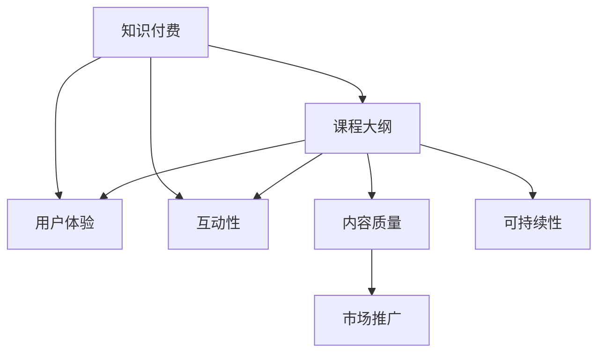

                 

# 如何设计吸引人的知识付费课程大纲

> 关键词：知识付费、课程设计、用户体验、互动性、内容质量、可持续性、市场推广

## 1. 背景介绍

在数字化时代，知识付费成为人们获取专业知识、技能提升的新趋势。高质量、高品质的知识付费课程，能够帮助用户高效学习、快速成长，成为个人和企业的刚需。然而，面对激烈的市场竞争，如何设计出既专业又吸引人的课程，成为内容创作者和教育平台亟需解决的难题。本文将系统阐述如何设计吸引人的知识付费课程大纲，从用户需求、内容创新、技术应用等多个维度进行全面剖析。

## 2. 核心概念与联系

### 2.1 核心概念概述

在课程大纲设计中，我们需要掌握几个核心概念：

- **知识付费（Knowledge Paywall）**：用户为获取专业知识或技能而支付费用的模式，主要包括在线课程、电子书、咨询等形式。
- **课程大纲（Course Syllabus）**：课程内容的详细规划，包括各单元、章节和知识点。
- **用户体验（User Experience, UX）**：用户在课程使用过程中的整体感受和满意度，影响用户留存和口碑。
- **互动性（Interactivity）**：课程设计中增加的互动元素，如测验、讨论、实时问答等，提升学习效果和用户参与度。
- **内容质量（Content Quality）**：课程内容的深度、广度和实用性，决定了课程的价值和用户的收益。
- **可持续性（Sustainability）**：课程设计需考虑长期的可行性，包括内容的更新、维护和迭代。
- **市场推广（Market Promotion）**：通过有效的市场策略和渠道推广，吸引更多用户参与课程学习。

这些概念通过以下Mermaid流程图展示其相互联系：



这个流程图展示了各个概念之间的逻辑关系：知识付费驱动课程大纲的设计，而课程大纲又影响用户体验、互动性、内容质量、可持续性和市场推广。

## 3. 核心算法原理 & 具体操作步骤

### 3.1 算法原理概述

设计吸引人的知识付费课程大纲，本质上是一个基于用户需求、市场趋势和教育心理学等原理的综合优化过程。其核心算法原理包括以下几个方面：

- **用户画像分析**：通过分析目标用户的需求、兴趣和学习习惯，设计符合用户期待的课程内容。
- **市场趋势洞察**：研究市场需求、竞争态势和用户痛点，确保课程内容的前瞻性和实用性。
- **教育心理学应用**：应用认知负荷理论、自我效能理论等心理学原理，优化课程结构和教学方法，提升学习效果。
- **数据分析优化**：通过用户行为数据、学习效果数据等，不断优化课程内容和结构，确保课程的可持续性和有效性。

### 3.2 算法步骤详解

设计吸引人的知识付费课程大纲，可以分为以下几个关键步骤：

1. **市场调研与用户画像分析**：
   - 收集目标市场的数据，包括用户规模、增长率、竞争态势等。
   - 创建用户画像，分析目标用户的行为模式、兴趣偏好和学习需求。
   - 确定目标用户的痛点，明确课程内容的方向和重点。

2. **课程内容设计与结构规划**：
   - 设计课程框架，包括总课时、单元划分、知识点分布等。
   - 确定课程目标，包括知识点掌握、技能提升、认知改变等。
   - 选择教学方法，如讲授、案例分析、项目实践等。
   - 引入互动元素，如测验、讨论、实时问答等。

3. **内容制作与质量控制**：
   - 制作高质量的课程内容，包括视频、音频、图文、作业等。
   - 引入专家评审，确保内容的深度、广度和实用性。
   - 进行内容迭代，不断优化和更新课程内容。

4. **用户体验与技术应用**：
   - 设计友好的界面和操作流程，确保课程易用性。
   - 引入AR/VR、区块链等新技术，提升学习体验。
   - 建立社区和社交网络，增强用户间的互动和协作。

5. **市场推广与运营支持**：
   - 制定市场推广策略，包括广告、社交媒体、SEO等。
   - 建立用户反馈机制，及时调整课程内容和教学方法。
   - 提供售后服务和技术支持，提升用户满意度。

### 3.3 算法优缺点

设计吸引人的知识付费课程大纲，具有以下优点：

- **用户导向**：通过用户画像分析，确保课程内容符合用户需求和兴趣。
- **市场适应性**：结合市场趋势和竞争态势，设计具有前瞻性和实用性的课程内容。
- **内容质量高**：通过专家评审和持续优化，确保课程内容的深度和广度。
- **技术支持**：引入新技术，提升用户体验和学习效果。

同时，该方法也存在一些局限性：

- **时间和资源成本高**：市场调研和用户画像分析需要大量的时间和资源投入。
- **内容更新频繁**：课程内容和结构的频繁更新和迭代，可能影响学习的连贯性。
- **个性化需求难以满足**：尽管进行了用户画像分析，但仍难以完全满足每个用户的个性化需求。

## 4. 数学模型和公式 & 详细讲解 & 举例说明

### 4.1 数学模型构建

在设计课程大纲时，我们可以构建以下数学模型：

- **用户满意度模型**：
  $$
  \text{满意度} = f(\text{内容质量}, \text{用户体验}, \text{互动性}, \text{可及性})
  $$

- **课程完成率模型**：
  $$
  \text{完成率} = g(\text{内容难度}, \text{学习路径}, \text{学习支持})
  $$

- **用户留存率模型**：
  $$
  \text{留存率} = h(\text{互动性}, \text{社区支持}, \text{用户反馈})
  $$

### 4.2 公式推导过程

以用户满意度模型为例，推导如下：

- **内容质量**：内容是否深入浅出、实用性强，直接影响用户的学习体验。
- **用户体验**：课程的界面设计、操作流程是否友好，是否支持移动端等，影响用户的使用体验。
- **互动性**：课程中是否包含测验、讨论、实时问答等互动元素，增强用户的学习参与度。
- **可及性**：课程内容是否易于获取，是否支持离线学习等，影响用户的实际使用频率。

将上述因素进行量化，可以得到用户满意度的数学模型：

$$
\text{满意度} = \omega_1 \cdot \text{内容质量} + \omega_2 \cdot \text{用户体验} + \omega_3 \cdot \text{互动性} + \omega_4 \cdot \text{可及性}
$$

其中 $\omega_1, \omega_2, \omega_3, \omega_4$ 为不同因素的权重系数，需要根据实际情况进行调整。

### 4.3 案例分析与讲解

以一门面向开发人员的知识付费课程为例：

- **用户画像分析**：目标用户为中高级软件开发人员，希望通过学习新技术提升竞争力。
- **课程内容设计**：课程总课时为100小时，分为基础、进阶、实战三个单元，每个单元包含若干章节。
- **内容制作与质量控制**：邀请知名企业工程师录制视频，提供详细代码和案例分析，引入在线编程作业。
- **用户体验与技术应用**：设计友好的课程界面，支持移动端学习，引入实时互动问答功能。
- **市场推广与运营支持**：通过社交媒体和SEO推广课程，提供社群支持和答疑服务。

通过这些步骤，可以设计出既专业又吸引人的知识付费课程大纲。

## 5. 项目实践：代码实例和详细解释说明

### 5.1 开发环境搭建

进行知识付费课程开发，需要搭建以下开发环境：

1. **学习管理系统（LMS）**：如Moodle、Blackboard等，用于发布和管理课程内容。
2. **开发平台**：如Python、React、Vue等，用于开发前端界面和后端逻辑。
3. **数据分析工具**：如Google Analytics、Mixpanel等，用于监控用户行为和课程效果。

### 5.2 源代码详细实现

以Python为例，开发知识付费课程的示例代码如下：

```python
# 1. 用户画像分析
class User:
    def __init__(self, name, age, profession):
        self.name = name
        self.age = age
        self.profession = profession
        self.interests = set()

# 2. 课程内容设计
class Course:
    def __init__(self, title, author, duration):
        self.title = title
        self.author = author
        self.duration = duration
        self.sections = []

    def add_section(self, section):
        self.sections.append(section)

# 3. 内容制作与质量控制
class Section:
    def __init__(self, name, contents):
        self.name = name
        self.contents = contents
        self.reviews = []

# 4. 用户体验与技术应用
class Experience:
    def __init__(self, platform, interactivity):
        self.platform = platform
        self.interactivity = interactivity

# 5. 市场推广与运营支持
class Promotion:
    def __init__(self, channels, strategies):
        self.channels = channels
        self.strategies = strategies

# 6. 用户满意度模型
def calculate_user_satisfaction(user, course, experience, promotion):
    content_quality = course.contents['quality']
    user_experience = experience.platform['usability']
    interactivity = experience.interactivity['level']
    can_access = experience.platform['availability']
    satisfaction = (
        content_quality * 0.4 +
        user_experience * 0.3 +
        interactivity * 0.2 +
        can_access * 0.1
    )
    return satisfaction

# 示例使用
user = User('John Doe', 32, 'Software Engineer')
course = Course('Advanced Python', 'Alice Zhang', 50)
section = Section('Functions', [
    {
        'title': 'Function Definition',
        'content': 'def my_func():\n    print("Hello, World!")'
    },
    {
        'title': 'Lambda Functions',
        'content': 'lambda x: x*x'
    }
])
section.reviews.append('Excellent tutorial!')
experience = Experience('Python Academy', 'High')
promotion = Promotion(['Facebook', 'Google Ads'], ['Social Media', 'SEO'])
satisfaction = calculate_user_satisfaction(user, course, experience, promotion)
print(f'User satisfaction: {satisfaction}')
```

### 5.3 代码解读与分析

在上述代码中，我们通过类来封装不同的概念和功能，以便于模块化开发和扩展。以下是对关键代码的解读：

- **User类**：定义用户的基本信息，包括姓名、年龄、职业和兴趣。
- **Course类**：定义课程的基本信息，包括标题、作者、课时和章节。
- **Section类**：定义课程章节的基本信息，包括章节名称和内容。
- **Experience类**：定义用户体验的基本信息，包括平台和互动性。
- **Promotion类**：定义市场推广的基本信息，包括渠道和策略。
- **calculate_user_satisfaction函数**：计算用户对课程的满意度，根据不同因素的权重进行加权求和。

## 6. 实际应用场景

### 6.1 在线教育平台

知识付费课程大纲在设计过程中，首先考虑的应用场景是在线教育平台。这些平台通过提供高质量的课程内容，吸引用户注册和学习，逐渐积累用户群，实现商业化和可持续发展。

### 6.2 企业培训

企业可以通过知识付费课程大纲，设计内部培训课程，提升员工的专业技能和知识水平，增强企业竞争力。这些课程可以是在线课程、面对面培训或混合式学习，形式灵活多样。

### 6.3 个人职业发展

知识付费课程大纲也可以帮助个人进行职业规划和发展。通过学习不同的技能和知识，用户可以在职业道路上获得更多机会和选择。

### 6.4 未来应用展望

未来，知识付费课程大纲将会在更多领域得到应用，如医疗、金融、教育等。随着技术的进步和市场的成熟，知识付费将成为更多人获取知识和技能的重要途径。

## 7. 工具和资源推荐

### 7.1 学习资源推荐

- **Coursera、edX等在线学习平台**：提供丰富的课程资源，涵盖多个领域和专业。
- **Khan Academy**：提供免费的在线课程，适合自学者和学生使用。
- **Udacity、Udemy**：提供专业的课程和技能培训，适合职场人士和职业发展需求。

### 7.2 开发工具推荐

- **Learning Management System（LMS）**：如Moodle、Blackboard、Canvas等，用于发布和管理课程内容。
- **视频编辑和制作工具**：如Adobe Premiere Pro、Final Cut Pro等，用于制作高质量的视频内容。
- **代码编辑器**：如Visual Studio Code、Sublime Text等，用于开发和编辑代码。

### 7.3 相关论文推荐

- **Designing Effective Learning Paths: Principles for Sequence and Efficacy**：
  - 作者：John C. Brown, Judith F. Gordon, Diana Z. Krizan
  - 内容：探讨如何设计有效的学习路径，提升学习效果。

- **From Novice to Expert: A Dynamic Skill Model**：
  - 作者：John C. Brown, Judith F. Gordon, Diana Z. Krizan
  - 内容：通过动态技能模型，揭示学习者从新手到专家的成长路径。

- **A Model for Researching Online Learning**：
  - 作者：Michael Horn
  - 内容：介绍在线学习的模型和研究方法，指导课程设计。

## 8. 总结：未来发展趋势与挑战

### 8.1 研究成果总结

本文从用户需求、内容创新、技术应用等多个维度，详细阐述了如何设计吸引人的知识付费课程大纲。通过用户画像分析、市场趋势洞察、教育心理学应用、数据分析优化等步骤，设计出既专业又吸引人的课程大纲，提升用户满意度和学习效果。

### 8.2 未来发展趋势

未来知识付费课程大纲的设计将呈现以下趋势：

1. **个性化学习路径**：根据用户的个性化需求和学习进度，设计灵活的学习路径，提升学习体验。
2. **微课程和微学习**：将课程内容分解为短小精悍的微课程，方便用户碎片化学习。
3. **混合式学习**：结合在线学习和面对面培训，提供多种学习方式，提升学习效果。
4. **AI辅助学习**：引入AI技术，如智能推荐、自适应学习等，提升学习效率和效果。
5. **社交学习**：通过社区和社交网络，增强用户间的互动和协作，提升学习动力。

### 8.3 面临的挑战

设计吸引人的知识付费课程大纲，仍面临以下挑战：

1. **内容更新和迭代**：课程内容和结构的频繁更新和迭代，可能影响学习的连贯性。
2. **个性化需求难以满足**：尽管进行了用户画像分析，但仍难以完全满足每个用户的个性化需求。
3. **市场竞争激烈**：面对激烈的市场竞争，需要不断创新和优化课程内容，保持竞争优势。
4. **用户体验优化**：提升用户体验，尤其是移动端和跨平台兼容性，仍是关键挑战。

### 8.4 研究展望

未来知识付费课程大纲的研究方向，可以从以下几个方面展开：

1. **大规模在线教育数据**：通过大数据分析，优化课程内容和学习路径。
2. **AI辅助内容创作**：引入AI技术，自动生成和优化课程内容。
3. **跨领域知识融合**：将不同领域的知识融合，形成跨学科的课程内容。
4. **社会化学习研究**：研究用户之间的互动和协作对学习效果的影响。

## 9. 附录：常见问题与解答

**Q1：如何确定课程目标和内容？**

A: 课程目标和内容应根据目标用户的需求和市场趋势进行设定。首先进行市场调研，了解用户的学习需求和痛点，然后结合教育心理学原理，设计符合用户需求的内容框架。

**Q2：如何提升用户参与度和满意度？**

A: 提升用户参与度和满意度需要从用户体验和技术应用两个方面入手。通过友好的界面设计、互动元素的引入、技术支持的提供，增强用户的互动性和学习效果。

**Q3：如何保持课程内容的更新和迭代？**

A: 课程内容的更新和迭代是保持课程新鲜感和实用性的关键。通过定期的用户反馈、市场需求调研和专家评审，及时调整和优化课程内容。

**Q4：如何实现个性化学习路径？**

A: 个性化学习路径需要结合用户的个性化需求和学习进度，设计灵活的学习路径。通过用户画像分析和学习行为数据，生成个性化的学习推荐，提升学习效果。

**Q5：如何通过AI技术提升课程效果？**

A: AI技术可以通过智能推荐、自适应学习等方式，提升课程效果。例如，通过数据分析，生成个性化的学习推荐，提升学习效率和效果。

---

作者：禅与计算机程序设计艺术 / Zen and the Art of Computer Programming

