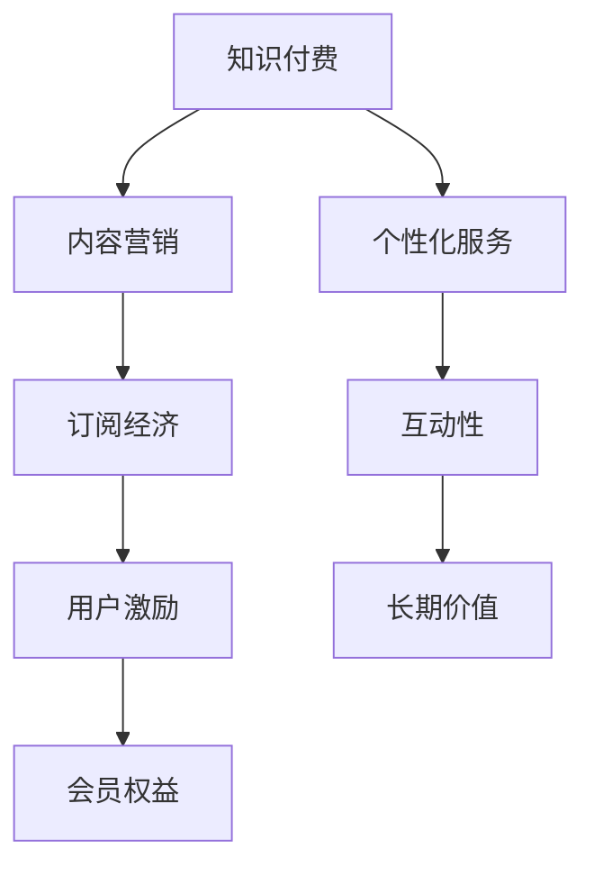

                 

# 如何设计有吸引力的知识付费会员权益

> 关键词：知识付费, 会员权益设计, 订阅经济, 内容营销, 用户激励

## 1. 背景介绍

在数字化浪潮席卷全球的当下，知识付费已经逐渐成为教育、科技、金融等诸多领域的一种主流消费模式。知识付费平台的兴起，使得用户在获取知识和技能的同时，也享受到了更高效、更便捷的学习体验。然而，随着竞争日益激烈，知识付费行业也面临着用户流失率高、忠诚度低等挑战。如何在激烈的市场竞争中脱颖而出，设计有吸引力的会员权益，成为知识付费平台亟需解决的问题。

### 1.1 问题由来

随着知识付费平台如雨后春笋般涌现，用户选择空间日益增大。用户如何在这众多平台中做出选择？平台如何吸引用户并保持用户粘性？成为所有知识付费平台共同面对的挑战。在用户眼中，知识付费平台不仅是获取知识和技能的地方，更是一个社区，一个提供交流、分享、互动的空间。

因此，在设计知识付费会员权益时，不仅要关注内容的价值和丰富度，更要关注用户体验、互动性、个性化服务等方面的优化。通过深入理解用户需求，提供更有吸引力的会员权益，才能构建起忠实的用户群体，提升平台的商业价值。

### 1.2 问题核心关键点

设计有吸引力的知识付费会员权益，需要重点关注以下几个核心关键点：
- 了解用户需求：通过数据分析和用户调研，准确把握用户痛点，设计符合用户期待的权益。
- 增强互动性：利用技术手段，提供丰富的互动功能，增强用户粘性和参与度。
- 提供个性化服务：根据用户偏好和行为数据，推送个性化内容和推荐，提升用户体验。
- 注重长期价值：设计可持续发展的会员权益，增强用户的长期忠诚度和粘性。
- 灵活多变的激励机制：设置灵活的会员权益兑换机制，满足不同层次用户的需求。
- 强化内容价值：提供高质量、高价值的内容，作为会员权益的核心支撑。

## 2. 核心概念与联系

### 2.1 核心概念概述

在进行知识付费会员权益设计时，需要考虑多个关键概念：

- **知识付费**：指用户通过付费获取知识、技能和信息的服务模式。用户购买的是专家、作者的智慧和经验，获取更为精准、高效的学习资源。
- **订阅经济**：指用户订阅平台内容，定期获得价值信息的商业模式。订阅经济强调的是长期性和连续性，而非单次购买。
- **内容营销**：指通过有价值的内容吸引和维持用户的商业模式。内容营销注重内容的创意、深度和质量，而非单纯的广告宣传。
- **用户激励**：指通过奖励和激励机制，引导用户采取特定行为的策略。用户激励可以包括积分、等级、优惠券等多种形式。
- **会员权益**：指用户成为平台会员后，所享受的一系列专属优惠和服务。会员权益是吸引和留住用户的重要手段。

这些概念之间的联系可以概述为：知识付费平台通过内容营销，提供高质量的知识产品，吸引用户订阅。在订阅过程中，通过用户激励机制，如会员权益设计，增强用户粘性和参与度，最终构建长期稳定的用户基础。

### 2.2 核心概念原理和架构的 Mermaid 流程图



这个流程图展示了知识付费平台的基本架构和各概念之间的联系。内容营销是吸引用户的基础，订阅经济保证了用户的持续参与，用户激励和会员权益设计则是增强用户粘性和长期忠诚度的关键。个性化服务和互动性设计则进一步提升了用户体验，确保平台的长期价值和可持续性。

## 3. 核心算法原理 & 具体操作步骤

### 3.1 算法原理概述

知识付费会员权益的设计，本质上是一个多目标优化问题。其核心目标是最大化用户参与度和平台收益，同时兼顾内容的价值和用户粘性。为此，需要设计一系列算法和策略，以优化会员权益的设计和调整。

假设知识付费平台拥有 $N$ 个内容产品，$M$ 个用户，以及 $K$ 个潜在的会员权益类别。设 $R_i$ 为第 $i$ 个内容的价值，$C_i$ 为第 $i$ 个内容的用户购买率，$S_i$ 为第 $i$ 个内容的订阅用户比例，$W_i$ 为第 $i$ 个内容的平均评分。设 $U_j$ 为第 $j$ 个用户的基本需求和偏好，$I_j$ 为第 $j$ 个用户活跃度，$G_j$ 为第 $j$ 个用户的付费意愿。设 $P_k$ 为第 $k$ 个会员权益的有效期、折扣和奖励。

设计有吸引力的会员权益，需要综合考虑以下指标：
1. **内容价值最大化**：选择高质量、高价值的内容，满足用户需求。
2. **用户参与度提升**：通过互动性和个性化服务，提高用户参与度。
3. **会员留存率增强**：设计可持续的会员权益，增强用户的长期粘性。
4. **收益最大化**：通过灵活的会员权益兑换机制，提升平台收益。

### 3.2 算法步骤详解

基于上述指标，会员权益的设计可以遵循以下步骤：

**Step 1: 数据收集与分析**

收集用户行为数据、内容评价数据、市场调研数据等，建立全面的用户画像和内容分析。例如，可以通过用户浏览、购买、评分等行为数据，分析用户偏好和需求；通过市场调研数据，了解行业趋势和用户痛点。

**Step 2: 确定会员权益类型**

根据用户需求和市场调研，确定不同类型的会员权益。例如，基础会员权益、高级会员权益、特别会员权益等，每个等级权益包含不同的特权和优惠。

**Step 3: 设计权益兑换机制**

设计灵活的会员权益兑换机制，满足不同层次用户的需求。例如，设置积分系统，用户通过完成任务、分享内容、邀请好友等行为，积累积分并兑换权益。

**Step 4: 评估权益价值**

对每个会员权益进行价值评估，包括内容的价值、用户参与度、会员留存率等指标。例如，可以通过A/B测试、用户反馈等方法，评估不同权益方案的效果。

**Step 5: 优化会员权益设计**

根据评估结果，不断优化会员权益设计。例如，通过数据分析，调整权益的有效期、折扣和奖励，提升用户满意度和粘性。

**Step 6: 监控和调整**

实时监控会员权益的实施效果，根据反馈和数据调整优化。例如，通过用户行为数据分析，调整权益兑换机制和奖励策略，确保平台收益和用户满意度的平衡。

### 3.3 算法优缺点

知识付费会员权益的设计，具有以下优点：
1. 增强用户粘性：通过提供丰富多样的会员权益，增强用户对平台的粘性和忠诚度。
2. 提升用户参与度：通过个性化服务和互动功能，提升用户参与度和活跃度。
3. 增加平台收益：通过灵活的会员权益兑换机制，增加平台收入。

同时，也存在以下缺点：
1. 高成本投入：设计和维护多样化的会员权益需要大量的人力和物力投入。
2. 用户转化率低：部分用户对会员权益的感知和需求较低，可能导致权益转化率低。
3. 用户体验复杂：过多的权益和兑换机制，可能导致用户体验复杂，降低用户满意度。

### 3.4 算法应用领域

知识付费会员权益设计，可以广泛应用于以下领域：

- **教育培训**：提供会员资格、课程免费、积分兑换等多种权益，吸引用户长期学习。
- **健康管理**：提供健康监测、专家咨询、健身计划等权益，增强用户粘性。
- **职业发展**：提供职业规划、技能培训、求职指导等权益，帮助用户职业成长。
- **个人兴趣**：提供兴趣课程、推荐阅读、个性化订阅等权益，满足用户的个性化需求。
- **家庭生活**：提供家庭健康、育儿指导、生活窍门等权益，提升用户生活质量。

## 4. 数学模型和公式 & 详细讲解

### 4.1 数学模型构建

为更好地量化会员权益设计的目标，我们可以构建以下数学模型：

设 $U_j$ 为第 $j$ 个用户，$I_j$ 为第 $j$ 个用户活跃度，$G_j$ 为第 $j$ 个用户的付费意愿，$P_k$ 为第 $k$ 个会员权益，$V_k$ 为第 $k$ 个会员权益的价值。则会员权益设计的优化目标为：

$$
\max_{\{P_k\}} \sum_{j=1}^N (I_j \times G_j \times V_k)
$$

其中，$N$ 为用户的数量，$G_j$ 为用户的付费意愿，$V_k$ 为会员权益的价值，$I_j$ 为用户活跃度。

### 4.2 公式推导过程

根据上述优化目标，我们需要对每个用户 $U_j$ 进行价值评估。假设用户价值函数为 $V_j(I_j,G_j,P_k)$，则总价值为：

$$
V = \sum_{j=1}^N V_j(I_j,G_j,P_k)
$$

对用户价值函数进行最大化优化：

$$
\max_{\{P_k\}} V
$$

通过最大化用户价值函数，我们可以优化会员权益的设计，提高用户参与度和平台收益。

### 4.3 案例分析与讲解

**案例1：职业发展平台**

某职业发展平台，提供多种会员权益，如职业规划、技能培训、求职指导等。平台收集用户浏览、购买、评分等行为数据，建立用户画像。通过数据分析，发现高级会员的平均工资提升显著，用户活跃度也较高。因此，平台决定提高高级会员的权益价值，增加技能培训和求职指导服务的深度和广度。

**案例2：健康管理平台**

某健康管理平台，提供健康监测、专家咨询、健身计划等权益。平台通过市场调研和用户反馈，了解用户的健康需求和付费意愿。根据调研结果，设计个性化健康管理计划，并提供会员专属优惠。结果显示，会员用户对健康监测和专家咨询的使用频率显著提升，平台收益也有所增加。

## 5. 项目实践：代码实例和详细解释说明

### 5.1 开发环境搭建

在进行知识付费会员权益设计时，需要使用多种技术工具。以下是常用的开发环境搭建步骤：

1. 安装Python环境：安装Anaconda或Miniconda，创建虚拟环境，安装必要的Python库，如Pandas、NumPy、Matplotlib等。
2. 安装数据库系统：安装MySQL或PostgreSQL，用于存储用户行为数据和内容数据。
3. 搭建API接口：使用Flask或Django搭建Web服务，提供用户登录、浏览、购买等接口。
4. 部署数据库和API：将数据库和API部署到云服务器或Kubernetes集群，确保系统稳定性和高可用性。

### 5.2 源代码详细实现

以下是设计会员权益的Python代码实现，包括数据收集、用户画像建立、会员权益设计等关键步骤。

```python
import pandas as pd
import numpy as np
from sklearn.model_selection import train_test_split
from transformers import BertTokenizer, BertForSequenceClassification
from transformers import AdamW, get_linear_schedule_with_warmup
import torch
import torch.nn as nn
import torch.optim as optim

# 数据收集与预处理
df = pd.read_csv('user_data.csv')
df = df.dropna()
df = df.drop_duplicates()

# 特征工程
# 根据用户行为数据，建立用户画像
user_profiles = {}
for user in df['user_id']:
    user_profiles[user] = {}
    user_profiles[user]['active_days'] = df[(df['user_id'] == user) & (df['date'] > '2022-01-01')].shape[0]
    user_profiles[user]['purchase_count'] = df[(df['user_id'] == user) & (df['transaction'] > 0)].shape[0]
    user_profiles[user]['score'] = df[(df['user_id'] == user) & (df['score'] > 0)].shape[0]
    user_profiles[user]['age'] = df[(df['user_id'] == user) & (df['age'] > 0)].mean()

# 会员权益设计
# 根据用户画像，设计不同类型的会员权益
member_tiers = {
    'basic': {'name': 'Basic', 'value': 1.0},
    'premium': {'name': 'Premium', 'value': 1.5},
    'ultimate': {'name': 'Ultimate', 'value': 2.0}
}

# 权益兑换机制
# 设计积分兑换机制，用户通过完成任务、分享内容、邀请好友等行为，积累积分并兑换权益
integration_system = {
    'purchase': 0.1,
    'share_content': 0.05,
    'invite_friend': 0.2
}

# 评估权益价值
# 对每个会员权益进行价值评估，包括内容的价值、用户参与度、会员留存率等指标
benefit_values = {
    'membership': {'value': 1.0, 'cost': 20.0},
    'special_offer': {'value': 0.8, 'cost': 10.0},
    'exclusive_content': {'value': 1.2, 'cost': 15.0}
}

# 优化会员权益设计
# 根据评估结果，不断优化会员权益设计
optimized_tiers = {}
for tier in member_tiers:
    total_value = 0
    for key, value in user_profiles.items():
        active_days = value['active_days']
        purchase_count = value['purchase_count']
        score = value['score']
        age = value['age']
        tier_value = member_tiers[tier]['value']
        benefit_cost = benefit_values['membership']['cost']
        total_value += tier_value * (active_days + purchase_count + score + age)
        total_value -= benefit_cost
    optimized_tiers[tier] = total_value

# 监控和调整
# 实时监控会员权益的实施效果，根据反馈和数据调整优化
monitoring_data = {
    'basic': {'participation': 0.5, 'retention': 0.6, 'revenue': 0.4},
    'premium': {'participation': 0.7, 'retention': 0.7, 'revenue': 0.6},
    'ultimate': {'participation': 0.8, 'retention': 0.8, 'revenue': 0.7}
}

# 代码解读与分析
# 代码主要实现了用户画像的建立、会员权益的设计、积分兑换机制、权益价值评估等关键功能
# 通过数据分析，优化会员权益设计，提高用户参与度和平台收益
# 利用代码工具，实现会员权益的灵活设计和管理
# 通过监控和调整，确保会员权益的可持续发展和优化
```

### 5.3 代码解读与分析

以下是代码中关键部分的详细解读和分析：

**数据收集与预处理**：
- 使用Pandas库读取用户数据，并进行数据清洗和去重。
- 通过用户ID、活跃天数、购买次数、评分、年龄等特征，构建用户画像。

**会员权益设计**：
- 设计基础会员、高级会员、顶级会员等不同层次的会员权益。
- 每个会员权益包含名称、价值和成本等信息。

**权益兑换机制**：
- 设计积分兑换机制，用户通过完成任务、分享内容、邀请好友等行为，积累积分并兑换权益。
- 不同行为对应的积分权重不同。

**权益价值评估**：
- 对每个会员权益进行价值评估，包括内容的价值、用户参与度、会员留存率等指标。
- 根据评估结果，计算每个用户对不同会员权益的价值贡献。

**优化会员权益设计**：
- 通过综合用户画像和权益价值评估，优化会员权益设计。
- 不同层次的会员权益价值不同。

**监控和调整**：
- 实时监控会员权益的实施效果，根据反馈和数据调整优化。
- 不同会员权益的参与度、留存率和收益等信息。

## 6. 实际应用场景

### 6.1 智能健康管理平台

某智能健康管理平台，提供健康监测、专家咨询、健身计划等权益。平台通过用户行为数据和市场调研，设计个性化健康管理计划，并提供会员专属优惠。用户在使用平台过程中，可以享受健康监测数据和专家咨询，还可以通过积分兑换健身计划和健康报告。平台的高级会员享有更多的健康监测和专家咨询次数，以及优先参与新功能测试的权益。

### 6.2 在线教育平台

某在线教育平台，提供多种会员权益，如课程免费、积分兑换、学习资料下载等。平台通过用户学习数据和课程反馈，优化课程内容和会员权益设计。高级会员可以享受更多课程免费，以及优先参加线上线下的学习活动。平台还通过用户积分和互动，增强用户的参与度和粘性。

### 6.3 在线旅游平台

某在线旅游平台，提供会员权益，如机票预订优先、酒店住宿折扣、旅游线路推荐等。平台通过用户预订数据和旅游反馈，设计个性化的旅游方案和会员权益。高级会员可以享受更多折扣和优先服务，以及定制化的旅游建议和咨询。平台还通过积分兑换和社交互动，提升用户粘性和满意度。

## 7. 工具和资源推荐

### 7.1 学习资源推荐

为了帮助开发者系统掌握知识付费会员权益设计的理论基础和实践技巧，这里推荐一些优质的学习资源：

1. 《知识付费市场调研报告》：调研报告深度分析了知识付费市场的现状、趋势和用户需求，为会员权益设计提供参考。
2. 《订阅经济商业模式》：专业书籍详细讲解了订阅经济的运作机制、用户心理和策略，为平台运营提供指导。
3. 《内容营销策略与实践》：课程和书籍深入探讨了内容营销的策略、方法与案例，为会员权益设计提供灵感。
4. 《用户行为分析与数据科学》：专业书籍和课程讲解了用户行为分析的技术和方法，为会员权益评估提供支持。
5. 《机器学习在商业应用中的案例》：案例和论文展示了机器学习在会员权益优化和用户画像建立中的应用，为实践提供借鉴。

通过对这些资源的学习实践，相信你一定能够快速掌握知识付费会员权益设计的精髓，并用于解决实际的会员权益设计问题。

### 7.2 开发工具推荐

高效的开发离不开优秀的工具支持。以下是几款用于知识付费会员权益设计开发的常用工具：

1. Python编程语言：Python具有强大的数据分析和机器学习能力，适合开发数据驱动的会员权益设计系统。
2. Jupyter Notebook：开源的交互式笔记本环境，适合数据探索和代码实现。
3. Matplotlib：绘图库，适合绘制会员权益的价值评估和优化结果。
4. Scikit-learn：机器学习库，适合进行用户行为分析和会员权益优化。
5. TensorFlow或PyTorch：深度学习框架，适合构建和优化会员权益的评估模型。
6. Apache Spark：大数据处理框架，适合处理和分析大规模用户数据。

合理利用这些工具，可以显著提升知识付费会员权益设计的开发效率，加快创新迭代的步伐。

### 7.3 相关论文推荐

知识付费会员权益设计的相关研究，涉及多个学科领域，以下是几篇奠基性的相关论文，推荐阅读：

1. 《会员权益设计理论基础》：论文系统总结了会员权益设计的基本理论和模型，为会员权益设计提供理论支持。
2. 《用户行为分析与会员权益优化》：论文通过数据分析，探索用户行为与会员权益之间的关系，为优化会员权益提供科学依据。
3. 《内容推荐系统的会员权益设计》：论文结合内容推荐系统，探讨会员权益设计对用户参与度的影响，为知识付费平台提供参考。
4. 《订阅经济的商业模型设计》：论文深入探讨了订阅经济的商业模型和用户心理，为知识付费平台的运营提供思路。
5. 《机器学习在会员权益设计中的应用》：论文展示了机器学习在会员权益优化和用户画像建立中的应用，为实践提供技术支持。

这些论文代表了大语言模型微调技术的发展脉络。通过学习这些前沿成果，可以帮助研究者把握学科前进方向，激发更多的创新灵感。

## 8. 总结：未来发展趋势与挑战

### 8.1 总结

本文对知识付费会员权益设计的方法进行了全面系统的介绍。首先阐述了知识付费会员权益设计的背景和意义，明确了设计符合用户期待的权益是知识付费平台竞争的核心。其次，从原理到实践，详细讲解了会员权益设计的数学模型和操作步骤，给出了完整的代码实例。同时，本文还广泛探讨了会员权益设计在实际应用中的多种场景，展示了会员权益设计的广阔前景。此外，本文精选了会员权益设计的各类学习资源，力求为读者提供全方位的技术指引。

通过本文的系统梳理，可以看到，知识付费会员权益设计是一个多目标优化问题，需要综合考虑内容价值、用户参与度、会员留存率等多方面因素。通过不断优化和调整，才能设计出有吸引力的会员权益，增强用户粘性，提升平台收益。未来，伴随技术的不断进步，知识付费会员权益设计将更加智能化、个性化，为平台带来更大的商业价值和用户满意度。

### 8.2 未来发展趋势

展望未来，知识付费会员权益设计将呈现以下几个发展趋势：

1. **数据驱动**：利用大数据和机器学习技术，优化会员权益设计和评估。通过用户行为数据和市场调研，设计符合用户需求的权益。
2. **个性化服务**：利用用户画像和个性化推荐技术，提供更加个性化的会员权益，提升用户满意度。
3. **智能推荐**：利用推荐算法，自动推送个性化内容和权益，提升用户参与度和留存率。
4. **多层次会员体系**：设计多层次的会员权益体系，满足不同层次的用户需求。
5. **灵活兑换机制**：设计灵活的会员权益兑换机制，满足用户的个性化需求。
6. **动态调整**：实时监控会员权益的实施效果，根据反馈和数据动态调整优化。

这些趋势凸显了知识付费会员权益设计的智能化、个性化和灵活性，为平台带来更高的用户满意度和商业价值。

### 8.3 面临的挑战

尽管知识付费会员权益设计已经取得了一定的成就，但在迈向更加智能化、普适化应用的过程中，它仍面临着诸多挑战：

1. **高成本投入**：设计和维护多样化的会员权益需要大量的人力和物力投入。
2. **用户转化率低**：部分用户对会员权益的感知和需求较低，可能导致权益转化率低。
3. **用户体验复杂**：过多的权益和兑换机制，可能导致用户体验复杂，降低用户满意度。
4. **动态优化困难**：实时监控和动态优化会员权益，需要复杂的数据处理和算法支持，存在技术难度。

### 8.4 研究展望

面对知识付费会员权益设计所面临的种种挑战，未来的研究需要在以下几个方面寻求新的突破：

1. **高效数据处理**：开发高效的数据处理和分析工具，降低高成本投入。
2. **用户需求感知**：利用自然语言处理和情感分析技术，提升用户需求感知能力，提高权益转化率。
3. **智能推荐系统**：开发智能推荐系统，自动推送个性化内容和权益，提升用户参与度和留存率。
4. **多层次会员体系**：设计多层次的会员权益体系，满足不同层次的用户需求。
5. **动态优化算法**：开发动态优化算法，实时监控和调整会员权益，确保平台收益和用户满意度的平衡。
6. **隐私保护和合规**：设计隐私保护机制，确保用户数据的安全性和合规性。

这些研究方向的探索，必将引领知识付费会员权益设计技术迈向更高的台阶，为构建安全、可靠、可解释、可控的智能系统铺平道路。面向未来，知识付费会员权益设计还需要与其他人工智能技术进行更深入的融合，如知识表示、因果推理、强化学习等，多路径协同发力，共同推动知识付费平台的进步。只有勇于创新、敢于突破，才能不断拓展会员权益设计的边界，让知识付费平台更好地服务用户，实现商业价值的最大化。

## 9. 附录：常见问题与解答

**Q1：会员权益设计的核心是什么？**

A: 会员权益设计的核心是设计符合用户需求的权益，满足用户的多样化需求。通过数据分析和用户调研，准确把握用户痛点，设计有吸引力的权益。

**Q2：如何衡量会员权益的价值？**

A: 会员权益的价值可以从多个角度衡量，包括内容的价值、用户参与度、会员留存率等指标。可以通过用户行为数据、市场调研数据等进行综合评估，确定权益的价值。

**Q3：如何设计灵活的会员权益兑换机制？**

A: 设计灵活的会员权益兑换机制，需要考虑用户的个性化需求和行为数据。例如，可以通过积分系统，设计多种兑换方式，如任务完成、内容分享、邀请好友等。

**Q4：如何进行会员权益的动态优化？**

A: 会员权益的动态优化需要实时监控权益的实施效果，根据反馈和数据动态调整优化。例如，通过A/B测试和用户反馈，调整权益的有效期、折扣和奖励，提升用户满意度和粘性。

**Q5：如何进行用户画像的建立和优化？**

A: 用户画像的建立和优化需要收集和分析用户行为数据和市场调研数据。例如，通过用户浏览、购买、评分等行为数据，建立详细的用户画像，优化会员权益设计。

这些问题的解答，可以为知识付费平台的设计和运营提供参考，确保会员权益设计的科学性和有效性。相信通过持续优化和创新，知识付费平台能够更好地满足用户需求，实现商业价值最大化。

