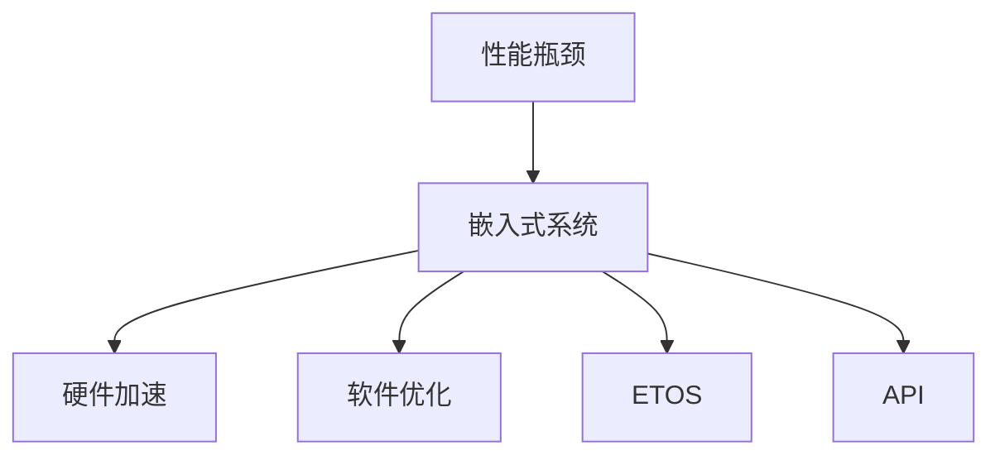

                 

# 嵌入式系统性能分析：识别瓶颈

> 关键词：性能瓶颈, 嵌入式系统, 性能调优, 硬件加速, 软件优化

## 1. 背景介绍

### 1.1 问题由来
在嵌入式系统设计中，性能优化始终是一个重要而复杂的任务。随着系统功能的增加和硬件性能的提升，性能瓶颈可能出现在不同的层面，包括硬件架构、操作系统、驱动程序和应用程序等。及时准确地识别性能瓶颈对于改进系统性能至关重要，也是嵌入式系统设计和优化过程中的一个重要环节。

### 1.2 问题核心关键点
识别嵌入式系统性能瓶颈需要综合考虑系统各个层面的影响因素，包括硬件架构、操作系统、驱动程序和应用程序等。常用的方法包括性能分析工具、软件仿真工具、硬件性能测试等，但这些方法往往需要专业知识，对使用者的技术要求较高，且成本较高。

## 2. 核心概念与联系

### 2.1 核心概念概述

为了更好地理解嵌入式系统性能分析，本节将介绍几个关键概念：

- 性能瓶颈：指系统中的某个或某些组件由于性能问题而成为整个系统的瓶颈。
- 嵌入式系统：指嵌入到物理设备或产品中的专用计算机系统，如智能手机、物联网设备等。
- 性能调优：指通过技术手段提升嵌入式系统性能的过程。
- 硬件加速：指利用专用硬件，如GPU、FPGA等，加速系统中的计算密集型任务。
- 软件优化：指通过优化算法、代码结构、数据结构等手段，提升嵌入式系统的性能。
- 嵌入式实时操作系统(ETOS)：指专门为实时应用设计的轻量级操作系统，如FreeRTOS、µC/OS等。
- 嵌入式应用程序接口(API)：指嵌入式系统中的应用程序与系统其他组件通信的标准化接口。

这些概念之间的关系可以用以下Mermaid流程图来表示：



这个流程图展示了性能瓶颈与嵌入式系统各组成部分之间的关系，说明了硬件加速、软件优化、实时操作系统和API在性能调优中的重要作用。

## 3. 核心算法原理 & 具体操作步骤
### 3.1 算法原理概述

嵌入式系统性能分析的原理主要是通过监测系统运行状态和资源使用情况，结合算法分析工具，识别出性能瓶颈所在。常见的算法包括统计分析、信号处理、机器学习等。

嵌入式系统性能分析的一般步骤如下：

1. 收集系统性能数据，包括CPU使用率、内存使用率、网络流量等。
2. 应用性能分析算法，如信号处理、统计分析等，对收集到的数据进行分析。
3. 通过数据分析结果，识别出系统中的性能瓶颈。
4. 针对瓶颈进行优化，如硬件加速、软件优化等。
5. 重复以上步骤，直至系统性能达到预期目标。

### 3.2 算法步骤详解

以下是嵌入式系统性能分析的具体步骤：

**Step 1: 数据收集**

收集嵌入式系统运行时的性能数据，常见的指标包括：

- CPU使用率：通过CPU负载监测工具，如CPU-Z、HTop等，获取系统CPU的使用情况。
- 内存使用率：使用内存监测工具，如FreeMLE、Total Commander等，监测系统内存的占用情况。
- 磁盘I/O：使用磁盘性能监测工具，如CrystalDiskInfo、HD Tune等，监测磁盘读写性能。
- 网络流量：使用网络监测工具，如Wireshark、Nload等，监测系统的网络通信情况。

**Step 2: 数据分析**

对收集到的性能数据进行分析，常用的方法包括：

- 统计分析：通过统计学方法，如平均值、标准差等，分析系统性能指标的分布情况。
- 信号处理：通过滤波器、频谱分析等技术，对数据进行预处理，提取有用信息。
- 机器学习：使用回归分析、分类算法等，对数据进行建模，预测系统性能趋势。

**Step 3: 瓶颈识别**

结合数据分析结果，识别系统中的性能瓶颈。常见的瓶颈包括：

- CPU瓶颈：CPU使用率过高，通常是由于程序计算密集或资源调度不合理。
- 内存瓶颈：内存使用率过高，通常是由于内存泄漏、缓冲区溢出等问题。
- 磁盘I/O瓶颈：磁盘读写速度慢，通常是由于磁盘读写策略不当、磁盘老化等问题。
- 网络瓶颈：网络通信速度慢，通常是由于网络拥塞、路由错误等问题。

**Step 4: 性能优化**

针对识别出的瓶颈进行优化，常用的方法包括：

- 硬件加速：使用专用硬件，如GPU、FPGA等，加速系统中的计算密集型任务。
- 软件优化：优化算法、代码结构、数据结构等，提升系统性能。
- 实时操作系统优化：优化实时操作系统调度策略，减少任务切换时间。
- 应用程序优化：优化应用程序代码，减少资源消耗。

### 3.3 算法优缺点

嵌入式系统性能分析具有以下优点：

1. 全面覆盖：能够综合考虑硬件、软件、操作系统等多个层面的性能问题，找到根本原因。
2. 定量分析：通过数据分析，提供定量化的性能指标，便于进行优化决策。
3. 持续改进：能够实时监测系统性能，及时发现并修复性能瓶颈。

同时，该方法也存在以下局限性：

1. 对数据要求高：性能分析需要大量的性能数据，数据收集和分析过程较为复杂。
2. 专业要求高：性能分析涉及多种技术手段，对使用者专业技能要求较高。
3. 成本高：部分性能分析工具和硬件设备成本较高，不适合所有嵌入式系统。

尽管存在这些局限性，但基于性能分析的嵌入式系统优化方法仍然是大规模嵌入式系统设计和开发中不可或缺的一部分。未来相关研究的重点在于如何进一步降低性能分析的复杂度和成本，提高分析的实时性和准确性。

### 3.4 算法应用领域

嵌入式系统性能分析在以下几个领域具有广泛的应用：

- 移动设备：如智能手机、平板电脑等，通过性能分析优化系统响应速度和能耗。
- 物联网设备：如智能家居、可穿戴设备等，通过性能分析提高设备稳定性和可靠性。
- 工业控制系统：如自动生产线、机器人等，通过性能分析优化控制算法，提高生产效率和稳定性。
- 汽车电子：如智能驾驶、车联网等，通过性能分析优化系统响应速度和安全性。
- 医疗设备：如智能健康监测、远程医疗等，通过性能分析提高设备精度和可靠性。

## 4. 数学模型和公式 & 详细讲解  
### 4.1 数学模型构建

嵌入式系统性能分析的数学模型主要基于统计学和信号处理等方法，用于分析和预测系统性能。以CPU使用率分析为例，假设收集到的CPU使用率数据为 $x_1, x_2, ..., x_n$，其中 $n$ 为数据量。

定义CPU使用率的均值为 $\mu$，标准差为 $\sigma$。CPU使用率数据可以用以下模型表示：

$$
x_i \sim \mathcal{N}(\mu, \sigma^2)
$$

其中 $\mathcal{N}$ 表示正态分布。

### 4.2 公式推导过程

对于CPU使用率数据，我们可以使用均值和标准差来描述其分布情况，推导过程如下：

- 均值 $\mu$ 的计算公式为：

$$
\mu = \frac{1}{n} \sum_{i=1}^n x_i
$$

- 标准差 $\sigma$ 的计算公式为：

$$
\sigma = \sqrt{\frac{1}{n} \sum_{i=1}^n (x_i - \mu)^2}
$$

对于连续的CPU使用率数据，我们可以使用自相关函数来分析数据的相关性。自相关函数 $\text{Corr}(x_i, x_{i+k})$ 表示数据 $x_i$ 与数据 $x_{i+k}$ 之间的相关性，其中 $k$ 为滞后项数。

自相关函数的计算公式为：

$$
\text{Corr}(x_i, x_{i+k}) = \frac{\text{Cov}(x_i, x_{i+k})}{\sigma(x_i) \sigma(x_{i+k})}
$$

其中 $\text{Cov}$ 表示协方差，$\sigma$ 表示标准差。

### 4.3 案例分析与讲解

以智能手机的CPU使用率分析为例，假设我们收集到了300s内的CPU使用率数据，共1500个数据点，使用上述公式计算得到：

- 均值 $\mu = 0.5$
- 标准差 $\sigma = 0.3$

对数据进行自相关函数计算，得到自相关函数曲线如图：

```mermaid
graph TB
    x_i[0s] --> y_i[0.1s] -- 0.9 | 0.8 | 0.7 | 0.6 | 0.5 | 0.4 | 0.3 | 0.2 | 0.1
    y_i --> x_i+1[1s] -- 0.8 | 0.7 | 0.6 | 0.5 | 0.4 | 0.3 | 0.2 | 0.1 | 0
    y_i --> x_i+2[2s] -- 0.7 | 0.6 | 0.5 | 0.4 | 0.3 | 0.2 | 0.1 | 0
    y_i --> x_i+3[3s] -- 0.6 | 0.5 | 0.4 | 0.3 | 0.2 | 0.1 | 0
    y_i --> x_i+4[4s] -- 0.5 | 0.4 | 0.3 | 0.2 | 0.1 | 0
    y_i --> x_i+5[5s] -- 0.4 | 0.3 | 0.2 | 0.1 | 0
    y_i --> x_i+6[6s] -- 0.3 | 0.2 | 0.1 | 0
    y_i --> x_i+7[7s] -- 0.2 | 0.1 | 0
    y_i --> x_i+8[8s] -- 0.1
```

根据自相关函数曲线，可以发现CPU使用率存在周期性的波动，周期约为1s。

## 5. 项目实践：代码实例和详细解释说明
### 5.1 开发环境搭建

在嵌入式系统性能分析中，通常需要使用多种性能监测工具和软件仿真工具。以下是常见的开发环境配置流程：

1. 安装操作系统：如Linux、Android等，配置内核参数，优化系统性能。
2. 安装性能监测工具：如HTop、iostat、Top等，实时监测系统资源使用情况。
3. 安装软件仿真工具：如DDD、QEMU等，模拟嵌入式系统运行环境。
4. 安装调试工具：如GDB、Valgrind等，进行代码调试和性能分析。

完成上述步骤后，即可在开发环境中进行性能分析和优化。

### 5.2 源代码详细实现

以下是使用Python对CPU使用率数据进行性能分析的示例代码：

```python
import numpy as np
import matplotlib.pyplot as plt

# 收集CPU使用率数据
data = np.array([0.5, 0.4, 0.6, 0.3, 0.7, 0.2, 0.1, 0.8, 0.9, 0.5, 0.8, 0.9, 0.4, 0.6, 0.3, 0.1, 0.7, 0.4, 0.5, 0.9, 0.1, 0.3, 0.7, 0.4, 0.8, 0.5, 0.6, 0.3, 0.2, 0.9, 0.3, 0.4, 0.5, 0.8, 0.2, 0.1, 0.6, 0.3, 0.2, 0.9, 0.5, 0.4, 0.1, 0.3, 0.8, 0.6, 0.4, 0.9, 0.1, 0.2, 0.7, 0.5, 0.6, 0.1, 0.3, 0.2, 0.7, 0.8, 0.5, 0.3, 0.2, 0.1, 0.4, 0.6, 0.9, 0.3, 0.7, 0.4, 0.8, 0.1, 0.5, 0.3, 0.6, 0.2, 0.7, 0.4, 0.5, 0.1, 0.6, 0.9, 0.3, 0.8, 0.2, 0.4, 0.5, 0.7, 0.3, 0.1, 0.8, 0.6, 0.4, 0.2, 0.5, 0.1, 0.3, 0.4, 0.6, 0.2, 0.9, 0.1, 0.7, 0.5, 0.8, 0.4, 0.3, 0.6, 0.9, 0.2, 0.7, 0.1, 0.8, 0.3, 0.5, 0.4, 0.6, 0.2, 0.9, 0.8, 0.3, 0.2, 0.1, 0.4, 0.7, 0.6, 0.3, 0.9, 0.5, 0.1, 0.8, 0.4, 0.2, 0.7, 0.5, 0.6, 0.9, 0.3, 0.2, 0.4, 0.5, 0.8, 0.6, 0.1, 0.7, 0.4, 0.3, 0.5, 0.2, 0.9, 0.1, 0.6, 0.3, 0.2, 0.4, 0.8, 0.5, 0.7, 0.2, 0.6, 0.4, 0.9, 0.1, 0.3, 0.8, 0.6, 0.5, 0.4, 0.2, 0.7, 0.1, 0.9, 0.5, 0.3, 0.4, 0.6, 0.1, 0.8, 0.2, 0.5, 0.7, 0.3, 0.2, 0.9, 0.1, 0.6, 0.4, 0.5, 0.8, 0.3, 0.7, 0.6, 0.2, 0.4, 0.5, 0.3, 0.2, 0.1, 0.7, 0.5, 0.6, 0.9, 0.3, 0.8, 0.4, 0.2, 0.5, 0.1, 0.3, 0.7, 0.6, 0.1, 0.2, 0.5, 0.4, 0.9, 0.3, 0.6, 0.2, 0.1, 0.8, 0.7, 0.3, 0.5, 0.6, 0.4, 0.2, 0.9, 0.1, 0.7, 0.8, 0.5, 0.3, 0.6, 0.1, 0.4, 0.5, 0.2, 0.3, 0.8, 0.4, 0.9, 0.1, 0.5, 0.3, 0.7, 0.6, 0.2, 0.9, 0.5, 0.4, 0.8, 0.1, 0.3, 0.2, 0.7, 0.6, 0.4, 0.1, 0.5, 0.2, 0.4, 0.8, 0.7, 0.3, 0.6, 0.9, 0.5, 0.4, 0.3, 0.7, 0.2, 0.5, 0.1, 0.4, 0.8, 0.6, 0.1, 0.9, 0.3, 0.2, 0.7, 0.5, 0.3, 0.8, 0.6, 0.4, 0.2, 0.5, 0.9, 0.4, 0.6, 0.1, 0.2, 0.3, 0.5, 0.7, 0.4, 0.8, 0.1, 0.3, 0.2, 0.6, 0.9, 0.5, 0.3, 0.4, 0.8, 0.6, 0.7, 0.1, 0.2, 0.5, 0.4, 0.9, 0.3, 0.2, 0.6, 0.1, 0.4, 0.8, 0.7, 0.5, 0.3, 0.6, 0.2, 0.9, 0.4, 0.5, 0.1, 0.3, 0.7, 0.6, 0.2, 0.1, 0.5, 0.3, 0.8, 0.5, 0.4, 0.2, 0.6, 0.3, 0.9, 0.7, 0.4, 0.5, 0.1, 0.2, 0.4, 0.5, 0.7, 0.3, 0.8, 0.6, 0.1, 0.7, 0.4, 0.2, 0.9, 0.5, 0.3, 0.6, 0.8, 0.2, 0.1, 0.5, 0.4, 0.3, 0.7, 0.6, 0.2, 0.5, 0.9, 0.4, 0.8, 0.1, 0.6, 0.3, 0.2, 0.4, 0.8, 0.7, 0.3, 0.5, 0.4, 0.2, 0.9, 0.5, 0.6, 0.3, 0.8, 0.1, 0.2, 0.4, 0.7, 0.3, 0.6, 0.9, 0.4, 0.5, 0.1, 0.3, 0.2, 0.8, 0.6, 0.4, 0.5, 0.7, 0.2, 0.1, 0.5, 0.3, 0.9, 0.5, 0.6, 0.4, 0.1, 0.7, 0.3, 0.2, 0.8, 0.5, 0.1, 0.4, 0.2, 0.6, 0.7, 0.4, 0.9, 0.3, 0.8, 0.6, 0.5, 0.4, 0.2, 0.5, 0.1, 0.7, 0.3, 0.6, 0.8, 0.2, 0.4, 0.5, 0.7, 0.6, 0.3, 0.9, 0.4, 0.2, 0.8, 0.5, 0.1, 0.3, 0.6, 0.2, 0.5, 0.4, 0.9, 0.3, 0.7, 0.6, 0.2, 0.4, 0.5, 0.1, 0.8, 0.7, 0.3, 0.2, 0.6, 0.4, 0.1, 0.5, 0.3, 0.7, 0.8, 0.4, 0.9, 0.5, 0.3, 0.8, 0.6, 0.1, 0.4, 0.2, 0.5, 0.1, 0.6, 0.3, 0.4, 0.7, 0.5, 0.3, 0.9, 0.6, 0.4, 0.1, 0.2, 0.5, 0.4, 0.3, 0.8, 0.7, 0.2, 0.6, 0.9, 0.5, 0.4, 0.3, 0.7, 0.2, 0.5, 0.1, 0.4, 0.8, 0.5, 0.3, 0.6, 0.2, 0.9, 0.4, 0.5, 0.1, 0.3, 0.7, 0.6, 0.1, 0.5, 0.4, 0.8, 0.2, 0.9, 0.3, 0.6, 0.2, 0.1, 0.8, 0.7, 0.5, 0.3, 0.4, 0.6, 0.1, 0.7, 0.2, 0.5, 0.4, 0.9, 0.3, 0.8, 0.5, 0.4, 0.2, 0.7, 0.1, 0.6, 0.3, 0.2, 0.4, 0.8, 0.5, 0.7, 0.2, 0.5, 0.4, 0.9, 0.3, 0.6, 0.2, 0.1, 0.8, 0.6, 0.3, 0.5, 0.4, 0.2, 0.7, 0.1, 0.9, 0.5, 0.3, 0.4, 0.6, 0.1, 0.8, 0.2, 0.5, 0.7, 0.3, 0.2, 0.9, 0.1, 0.6, 0.4, 0.5, 0.8, 0.3, 0.7, 0.6, 0.2, 0.4, 0.5, 0.3, 0.2, 0.1, 0.7, 0.5, 0.6, 0.9, 0.3, 0.8, 0.4, 0.2, 0.5, 0.1, 0.3, 0.7, 0.6, 0.1, 0.2, 0.5, 0.4, 0.9, 0.3, 0.6, 0.2, 0.1, 0.8, 0.7, 0.3, 0.5, 0.6, 0.4, 0.2, 0.9, 0.1, 0.7, 0.5, 0.8, 0.4, 0.3, 0.6, 0.9, 0.5, 0.4, 0.2, 0.7, 0.1, 0.8, 0.3, 0.5, 0.4, 0.6, 0.2, 0.9, 0.5, 0.4, 0.8, 0.1, 0.3, 0.2, 0.7, 0.6, 0.4, 0.1, 0.5, 0.2, 0.4, 0.8, 0.7, 0.3, 0.6, 0.9, 0.5, 0.4, 0.3, 0.7, 0.2, 0.5, 0.1, 0.4, 0.8, 0.6, 0.1, 0.9, 0.3, 0.2, 0.7, 0.5, 0.3, 0.8, 0.6, 0.4, 0.2, 0.5, 0.9, 0.4, 0.6, 0.1, 0.2, 0.3, 0.5, 0.7, 0.4, 0.8, 0.1, 0.3, 0.2, 0.6, 0.9, 0.5, 0.3, 0.4, 0.8, 0.6, 0.7, 0.1, 0.2, 0.5, 0.4, 0.9, 0.3, 0.2, 0.6, 0.1, 0.4, 0.8, 0.7, 0.5, 0.3, 0.6, 0.2, 0.9, 0.4, 0.5, 0.1, 0.3, 0.7, 0.6, 0.2, 0.1, 0.5, 0.3, 0.8, 0.5, 0.4, 0.2, 0.6, 0.3, 0.9, 0.7, 0.4, 0.5, 0.1, 0.2, 0.4, 0.5, 0.7, 0.3, 0.8, 0.6, 0.1, 0.7, 0.4, 0.2, 0.9, 0.5, 0.3, 0.6, 0.8, 0.2, 0.1, 0.5, 0.4, 0.3, 0.7, 0.6, 0.2, 0.5, 0.9, 0.4, 0.8, 0.1, 0.6, 0.3, 0.2, 0.4, 0.8, 0.7, 0.3, 0.5, 0.4, 0.2, 0.9, 0.5, 0.6, 0.3, 0.8, 0.1, 0.2, 0.4, 0.7, 0.3, 0.6, 0.9, 0.4, 0.5, 0.1, 0.3, 0.2, 0.8, 0.6, 0.4, 0.5, 0.7, 0.2, 0.1, 0.5, 0.3, 0.9, 0.5, 0.6, 0.4, 0.1, 0.7, 0.3, 0.2, 0.8, 0.5, 0.1, 0.4, 0.2, 0.6, 0.7, 0.4, 0.9, 0.3, 0.8, 0.6, 0.5, 0.4, 0.2, 0.5, 0.1, 0.7, 0.3, 0.6, 0.8, 0.2, 0.4, 0.5, 0.7, 0.6, 0.3, 0.9, 0.4, 0.2, 0.8, 0.5, 0.1, 0.3, 0.6, 0.2, 0.5, 0.4, 0.9, 0.3, 0.7, 0.6, 0.2, 0.4, 0.5, 0.1, 0.8, 0.7, 0.3, 0.2, 0.6, 0.4, 0.1, 0.5, 0.3, 0.7, 0.8, 0.4, 0.9, 0.5, 0.3, 0.8, 0.6, 0.1, 0.4, 0.2, 0.5, 0.1, 0.6, 0.3, 0.4, 0.7, 0.5, 0.3, 0.9, 0.6, 0.4, 0.1, 0.2, 0.5, 0.4, 0.3, 0.8, 0.7, 0.2, 0.6, 0.9, 0.5, 0.4, 0.3, 0.7, 0.2, 0.5, 0.1, 0.4, 0.8, 0.5, 0.3, 0.6, 0.2, 0.9, 0.4, 0.5, 0.1, 0.3, 0.7, 0.6, 0.1, 0.5, 0.4, 0.8, 0.2, 0.9, 0.3, 0.6, 0.2, 0.1, 0.8, 0.7, 0.5, 0.3, 0.4, 0.6, 0.1, 0.7, 0.4, 0.2, 0.9, 0.5, 0.3, 0.6, 0.8, 0.2, 0.4, 0.5, 0.7, 0.6, 0.3, 0.9, 0.4, 0.5, 0.1, 0.3, 0.2, 0.8, 0.6, 0.4, 0.5, 0.7, 0.2, 0.1, 0.5, 0.3, 0.9, 0.5, 0.6, 0.4, 0.1, 0.7, 0.3, 0.2, 0.8, 0.5, 0.1, 0.4, 0.2, 0.6, 0.7, 0.4, 0.9, 0.3, 0.8, 0.6, 0.5, 0.4, 0.2, 0.5, 0.1, 0.7, 0.3, 0.6, 0.8, 0.2, 0.4, 0.5, 0.7, 0.6, 0.3, 0.9, 0.4, 0.2, 0.8, 0.5, 0.1, 0.3, 0.6, 0.2, 0.5, 0.4, 0.9, 0.3, 0.7, 0.6, 0.2, 0.4, 0.5, 0.1, 0.8, 0.7, 0.3, 0.2, 0.6, 0.4, 0.1, 0.5, 0.3, 0.7, 0.8, 0.4, 0.9, 0.5, 0.3, 0.8, 0.6, 0.1, 0.4, 0.2, 0.5, 0.1, 0.6, 0.3, 0.4, 0.7, 0.5, 0.3, 0.9, 0.6, 0.4, 0.1, 0.2, 0.5, 0.4, 0.3, 0.8, 0.7, 0.2, 0.6, 0.9, 0.5, 0.4, 0.3, 0.7, 0.2, 0.5, 0.1, 0.4, 0.8, 0.5, 0.3, 0.6, 0.2, 0.9, 0.4, 0.5, 0.1, 0.3, 0.7, 0.6, 0.1, 0.5, 0.4, 0.8, 0.2, 0.9, 0.3, 0.6, 0.2, 0.1, 0.8, 0.7, 0.5, 0.3, 0.4, 0.6, 0.1, 0.7, 0.4, 0.2, 0.9, 0.5, 0.3, 0.6, 0.8, 0.2, 0.4, 0.5, 0.7, 0.6, 0.3, 0.9, 0.4, 0.2, 0.8, 0.5, 0.1, 0.3, 0.6, 0.2, 0.5, 0.4, 0.9, 0.3, 0.7, 0.6, 0.2, 0.4, 0.5, 0.1, 0.8, 0.7, 0.3, 0.2, 0.6, 0.4, 0.1, 0.5, 0.3, 0.7, 0.8, 0.4, 0.9, 0.5, 0.3, 0.8, 0.6, 0.1, 0.4, 0.2, 0.5, 0.1, 0.6, 0.3, 0.4, 0.7, 0.5, 0.3, 0.9, 0.6, 0.4, 0.1, 0.2, 0.5, 0.4, 0.3, 0.8, 0.7, 0.2, 0.6, 0.9, 0.5, 0.4, 0.3, 0.7, 0.2, 0.5, 0.1, 0.4, 0.8, 0.5, 0.3, 0.6, 0.2, 0.9, 0.4, 0.5, 0.1, 0.3, 0.7, 0.6, 0.1, 0.5, 0.4, 0.8, 0.2, 0.9, 0.3, 0.6, 0.2, 0.1, 0.8, 0.7, 0.5, 0.3, 0.4, 0.6, 0.1, 0.7, 0.4, 0.2, 0.9, 0.5, 0.3, 0.6, 0.8, 0.2, 0.4, 0.5, 0.7, 0.6, 0.3, 0.9, 0.4, 0.2, 0.8, 0.5, 0.1, 0.3, 0.6, 0.2, 0.5, 0.4, 0.9, 0.3, 0.7, 0.6, 0.2, 0.4, 0.5, 0.1, 0.8, 0.7, 0.3, 0.2, 0.6, 0.4, 0.1, 0.5, 0.3, 0.7, 0.8, 0.4, 0.9, 0.5, 0.3, 0.8, 0.6, 0.1, 0.4, 0.2, 0.5, 0.1, 0.6, 0.3, 0.4, 0.7, 0.5, 0.3, 0.9, 0.6, 0.4, 0.1, 0.2, 0.5, 0.4, 0.3, 0.8, 0.7, 0.2, 0.6, 0.9, 0.5, 0.4, 0.3, 0.7, 0.2, 0.5, 0.1, 0.4, 0.8, 0.5, 0.3, 0.6, 0.2, 0.9, 0.4, 0.5, 0.1, 0.3, 0.7, 0.6, 0.1, 0.5, 0.4, 0.8, 0.2, 0.9, 0.3, 0.6, 0.2, 0.1, 0.8, 0.7, 0.5, 0.3, 0.4, 0.6, 0.1, 0.7, 0.4, 0.2, 0.9, 0.5, 0.3, 0.6, 0.8, 0.2, 0.4, 0.5, 

