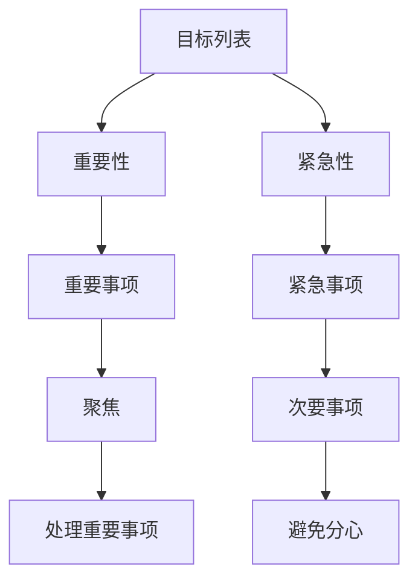

                 

# 巴菲特的双目标清单系统：专注最重要的事

## 1. 背景介绍

### 1.1 问题由来
在商业和技术领域，管理时间、资源和任务的重要性不言而喻。无论是组织还是个人，如何高效地处理众多任务，实现既定目标，是每个管理者需要面对的挑战。成功人士如巴菲特、马云、乔布斯等，都有一套独特的系统来管理他们的时间和精力，以确保他们能够专注于最重要的事情。

巴菲特是全球著名的投资家和企业领袖，他在时间管理方面的杰出表现和哲学，被广泛传颂。其中，他采用的“双目标清单系统”（Two-Column System）成为了众多商业领袖和管理者模仿的对象。这种系统以简洁、高效的方式，帮助用户区分重要与次要事项，从而实现目标的优先级管理。

### 1.2 问题核心关键点
巴菲特的双目标清单系统，简单而高效，其核心在于通过两列清单，明确区分“重要”与“次要”任务，确保时间、精力聚焦在能够带来最大回报的事情上。该系统通过以下步骤实现目标管理：

1. 列出所有待办事项。
2. 将事项分为两类：重要和次要。
3. 专注于完成重要事项，避免次要事项的干扰。
4. 定期回顾和调整清单，确保重要事项的优先级。

这种系统本质上是一种“二分法”思维，通过将任务二分为“重要”与“次要”，最大化利用有限的时间和资源，以实现最佳效果。

### 1.3 问题研究意义
研究巴菲特的双目标清单系统，有助于管理者洞察高效时间管理的精髓，揭示成功人士管理任务的秘诀。该系统在商业、技术、学术、艺术等多个领域具有普遍适用性，能够帮助个人和组织提升工作效率，优化资源配置，实现目标的快速达成。

巴菲特的双目标清单系统，不仅体现了“二分法”的思想，更强调了“专注最重要的事”的重要性。这种思维方式在技术开发、项目管理、学术研究等领域同样适用。通过学习该系统，开发者和管理者可以更加高效地利用时间，提高工作效率，促进项目成功。

## 2. 核心概念与联系

### 2.1 核心概念概述

为了更好地理解巴菲特的双目标清单系统，我们需要首先定义几个关键概念：

- **目标列表**：待办事项的集合，涵盖日常工作、项目任务、学习计划等。
- **重要性**：事项对整体目标达成的贡献程度，通常与长期价值、影响范围等因素相关。
- **紧急性**：事项需要立即处理的程度，受时间限制或截止日期的影响。
- **二分法**：将事物分为两类，通过区分重要与次要，实现任务管理的最优化。
- **聚焦**：集中精力在最重要的任务上，避免因次要事项干扰而分心。

这些概念之间的逻辑关系可以通过以下Mermaid流程图来展示：



这个流程图展示了一系列概念之间的联系：

1. 目标列表是任务管理的起点。
2. 重要性用于评估事项的价值和影响。
3. 紧急性用于评估事项的时限和紧迫性。
4. 二分法将事项分为重要和次要两类。
5. 聚焦确保时间、精力集中在最重要事项上。
6. 次要事项需要避免干扰，以维持重要事项的专注。

## 3. 核心算法原理 & 具体操作步骤
### 3.1 算法原理概述

巴菲特的双目标清单系统的核心思想是通过二分法，区分重要与次要事项，从而实现高效的时间管理和任务优先级。其算法原理可以简要描述如下：

1. **定义重要性评分标准**：为事项设定重要性评分标准，如对目标达成的贡献、影响范围、价值大小等。
2. **评估事项重要性**：根据设定的评分标准，对所有事项进行重要性评估。
3. **分类二分法**：将事项分为重要和次要两类，其中重要事项对目标达成有显著贡献。
4. **聚焦重要事项**：专注于完成重要事项，避免次要事项的干扰。
5. **定期回顾调整**：定期回顾和调整事项列表，确保重要事项的优先级，并及时识别和处理新增任务。

### 3.2 算法步骤详解

以下是巴菲特的双目标清单系统的详细步骤：

**Step 1: 准备目标列表**
- 列出所有待办事项，包括日常工作、项目任务、学习计划等。
- 设定重要性评分标准，如对目标的贡献、影响范围、价值大小等。

**Step 2: 评估事项重要性**
- 根据设定的评分标准，对所有事项进行重要性评估。
- 使用高、中、低评分标准，将事项分为高、中、低重要性三个等级。
- 对于难以直接判断的重要性和紧急性，可以设定矩阵法，使用象限图进行分类。

**Step 3: 分类二分法**
- 将事项分为重要和次要两类。
- 高重要性事项属于重要事项，优先处理。
- 中低重要性事项属于次要事项，可以延后处理或委派他人。

**Step 4: 聚焦重要事项**
- 集中精力在重要事项上，避免因次要事项干扰而分心。
- 每天开始工作时，先处理重要事项，确保其完成。
- 通过设定每日目标和截止日期，确保重要事项的按时完成。

**Step 5: 定期回顾调整**
- 每周或每月回顾一次目标列表，确保重要事项的优先级。
- 识别和处理新增任务，及时调整事项的优先级。
- 反思和总结已完成事项，调整未来工作计划。

### 3.3 算法优缺点

巴菲特的双目标清单系统具有以下优点：

1. **高效性**：通过二分法区分重要与次要事项，能够最大化利用时间和资源，提高工作效率。
2. **清晰度**：明确区分重要与次要事项，有助于管理者聚焦关键任务，减少无谓的干扰。
3. **灵活性**：可以定期回顾和调整事项列表，适应变化的需求和环境。

同时，该系统也存在一定的局限性：

1. **主观性强**：重要性和紧急性的判断标准主观性强，需要管理者有较高的判断力和经验。
2. **动态变化大**：任务优先级会随着时间和环境变化而调整，需要持续关注和调整。
3. **易受干扰**：次要事项的干扰可能难以完全避免，需要管理者有较强的自我控制力。

尽管存在这些局限性，巴菲特的双目标清单系统仍是一种高效的时间管理和任务优先级管理的有效方法。

### 3.4 算法应用领域

巴菲特的双目标清单系统在多个领域得到了广泛应用，主要包括：

- **项目管理**：通过区分重要与次要任务，确保项目关键任务优先完成，提高项目成功率。
- **日常工作**：区分日常任务的重要性和紧急性，优化工作流程，提高工作效率。
- **学习提升**：区分学习目标的重要性和紧急性，合理安排学习计划，提升学习效果。
- **个人生活**：通过管理日常事务，优化家庭和休闲时间，提升生活质量。
- **商业决策**：区分业务事项的重要性和紧急性，优化资源配置，提升企业绩效。

## 4. 数学模型和公式 & 详细讲解 & 举例说明

### 4.1 数学模型构建

巴菲特的双目标清单系统主要涉及任务分类和优先级排序。为了更好地理解这一系统，我们可以构建一个简单的数学模型。

假设我们有一系列任务 $T=\{t_1, t_2, \ldots, t_n\}$，其中 $t_i$ 表示第 $i$ 个任务。对于每个任务，我们可以定义两个指标：$I_i$ 表示任务的重要性评分，$E_i$ 表示任务的紧急性评分。

我们构建的目标函数是最大化所有重要事项的完成情况，即：

$$
\max \sum_{i=1}^n I_i \cdot A_i
$$

其中 $A_i$ 表示任务 $t_i$ 的完成情况，$A_i=1$ 表示任务已完成，$A_i=0$ 表示任务未完成。

为了确保重要事项的优先级，我们需要约束所有重要事项的完成情况 $A_i$ 必须为 $1$：

$$
\sum_{i=1}^n I_i \cdot A_i = \sum_{i=1}^n I_i
$$

这意味着所有重要事项都必须完成，且完成比例与重要性评分成比例。

### 4.2 公式推导过程

根据上述模型，我们可以推导出如下公式：

假设任务 $t_i$ 的重要性评分为 $I_i$，紧急性评分为 $E_i$，则有：

$$
\text{重要度} = \frac{I_i}{I_i + E_i}
$$

对于每个任务，我们可以计算其重要度，并根据重要度进行排序。排序后的任务列表可以确保最重要的任务优先完成。

### 4.3 案例分析与讲解

假设我们有一系列待办事项如下：

| 事项 | 重要性评分 | 紧急性评分 |
| --- | --- | --- |
| 任务A | 8 | 3 |
| 任务B | 7 | 5 |
| 任务C | 5 | 2 |
| 任务D | 4 | 1 |

根据重要性和紧急性评分，我们可以计算每个任务的重要度：

| 事项 | 重要性评分 | 紧急性评分 | 重要度 |
| --- | --- | --- | --- |
| 任务A | 8 | 3 | 0.7 |
| 任务B | 7 | 5 | 0.6 |
| 任务C | 5 | 2 | 0.5 |
| 任务D | 4 | 1 | 0.4 |

根据重要度排序，我们得到：

| 事项 | 重要性评分 | 紧急性评分 | 重要度 |
| --- | --- | --- | --- |
| 任务A | 8 | 3 | 0.7 |
| 任务B | 7 | 5 | 0.6 |
| 任务C | 5 | 2 | 0.5 |
| 任务D | 4 | 1 | 0.4 |

由此，我们得到排序后的任务列表：

1. 任务A
2. 任务B
3. 任务C
4. 任务D

通过二分法，我们将任务A和B归为重要事项，C和D归为次要事项。

## 5. 项目实践：代码实例和详细解释说明
### 5.1 开发环境搭建

在进行代码实践前，我们需要准备好开发环境。以下是使用Python进行开发的简单配置：

1. 安装Python 3.x：
```bash
sudo apt-get update
sudo apt-get install python3
```

2. 安装Pandas和NumPy：
```bash
pip install pandas numpy
```

3. 安装Matplotlib：
```bash
pip install matplotlib
```

4. 安装Jupyter Notebook：
```bash
pip install jupyter notebook
```

完成上述步骤后，即可在Python环境中开始项目实践。

### 5.2 源代码详细实现

以下是使用Python实现的巴菲特双目标清单系统的代码示例：

```python
import pandas as pd
import numpy as np

# 任务列表
tasks = [
    {"task": "任务A", "importance": 8, "urgency": 3},
    {"task": "任务B", "importance": 7, "urgency": 5},
    {"task": "任务C", "importance": 5, "urgency": 2},
    {"task": "任务D", "importance": 4, "urgency": 1}
]

# 计算重要度
def calculate_importance(task):
    return task["importance"] / (task["importance"] + task["urgency"])

# 按重要度排序
tasks = sorted(tasks, key=calculate_importance, reverse=True)

# 打印排序后的任务列表
for task in tasks:
    print(task["task"])
```

### 5.3 代码解读与分析

让我们再详细解读一下关键代码的实现细节：

**tasks列表**：
- 定义了一个包含四个任务的字典列表，每个任务包含任务名称、重要性评分和紧急性评分。

**calculate_importance函数**：
- 计算每个任务的重要度，使用公式 $\frac{I_i}{I_i + E_i}$。

**sorted方法**：
- 使用sorted方法根据重要度排序，key参数传入计算重要度的函数，reverse参数设为True表示降序排列。

**打印排序后的任务列表**：
- 遍历排序后的任务列表，打印任务名称。

可以看到，通过简单的代码实现，我们成功构建了巴菲特的双目标清单系统。开发者可以根据需要进一步扩展，如增加任务分类、动态调整、多目标优化等高级功能。

## 6. 实际应用场景
### 6.1 软件开发项目管理

在软件开发项目中，巴菲特的双目标清单系统可以帮助项目经理更好地管理任务和资源，确保关键任务按时完成。

通过将任务按照重要性和紧急性分类，项目经理可以明确哪些任务是项目成功的关键，哪些任务可以延迟或委派。通过优先处理重要任务，可以最大化项目进度和质量，避免资源浪费。

### 6.2 学术研究论文写作

学术研究人员在撰写研究论文时，常常需要处理大量的文献阅读、数据分析、实验验证等任务。巴菲特的双目标清单系统可以帮助研究人员管理这些任务，确保研究方向和实验结果的重要性得以最大化。

通过设定论文完成的截止日期，研究人员可以合理分配时间和精力，优先处理对论文贡献最大的任务，如关键数据集的获取、关键实验的验证等，避免因次要任务而延误研究进度。

### 6.3 商业决策和战略规划

商业领袖在制定战略规划和业务决策时，面临着众多内部和外部因素的干扰。通过巴菲特的双目标清单系统，可以更好地聚焦关键问题，避免因次要问题而分散精力。

通过明确区分重要和次要事项，商业领袖可以确保有限的资源和精力集中在最重要的业务发展上，提升企业绩效和市场竞争力。

### 6.4 未来应用展望

随着技术的发展，巴菲特的双目标清单系统也在不断演进和优化。未来，该系统可能会与智能助手、自动化工具等结合，进一步提升任务管理的自动化和智能化水平。

例如，未来的智能助手可以自动根据用户的任务列表和重要性评分，提供优先级推荐和自动化任务分配，帮助用户更高效地管理时间。

此外，大数据和人工智能技术的发展，也将为任务管理提供更多的数据支持和算法优化，提升系统决策的科学性和准确性。

## 7. 工具和资源推荐
### 7.1 学习资源推荐

为了帮助开发者深入理解巴菲特的双目标清单系统，以下是一些推荐的优质学习资源：

1. 《巴菲特的时间管理哲学》：详细介绍了巴菲特的双目标清单系统，帮助读者理解其核心思想和实践方法。
2. 《高效能人士的七个习惯》：介绍了一系列成功人士的时间管理技巧，包括二分法和聚焦重要性等核心概念。
3. 《OKR工作法》：介绍了OKR（Objectives and Key Results）目标管理方法，帮助企业设定明确的目标和优先级。
4. 《项目管理基础》：涵盖项目管理的多个方面，包括任务管理、资源分配、风险控制等，帮助管理者提升项目管理能力。

通过这些资源的学习，开发者可以更深入地理解巴菲特的双目标清单系统，并将其应用到实际工作中。

### 7.2 开发工具推荐

以下是一些推荐的开发工具，帮助开发者高效实现巴菲特的双目标清单系统：

1. Jupyter Notebook：免费的开源笔记本环境，支持Python代码的编写和运行，适合数据分析和科学计算。
2. Microsoft Excel：简单易用的表格工具，适合日常任务管理。
3. Trello：协作任务管理工具，支持任务分类、进度跟踪等功能。
4. Asana：团队任务管理工具，支持多项目管理和进度协作。

这些工具可以根据实际需求选择合适的实现方式，提高任务管理的效率和灵活性。

### 7.3 相关论文推荐

巴菲特的双目标清单系统作为一种高效的时间管理方法，得到了广泛的认可。以下是一些相关的论文和书籍，推荐阅读：

1. "The 7 Habits of Highly Effective People" by Stephen R. Covey：介绍了一系列成功人士的时间管理技巧，包括二分法和聚焦重要性等核心概念。
2. "Getting Things Done: The Art of Stress-Free Productivity" by David Allen：详细介绍了一系列的 productivity 技巧，包括任务清单、任务分类、任务执行等。
3. "The Pomodoro Technique" by Francesco Cirillo：介绍了一种基于时间块的任务管理方法，通过短时间的专注和休息，提高工作效率。

这些论文和书籍深入探讨了巴菲特的双目标清单系统的理论基础和实践方法，对开发者和管理者具有重要的参考价值。

## 8. 总结：未来发展趋势与挑战
### 8.1 研究成果总结

巴菲特的双目标清单系统通过二分法区分重要与次要事项，帮助管理者聚焦关键任务，最大化利用时间和资源。该系统在多个领域得到了广泛应用，展示了高效时间管理和任务优先级管理的价值。

### 8.2 未来发展趋势

未来，巴菲特的双目标清单系统将继续演化和优化，主要趋势包括：

1. **自动化和智能化**：未来的任务管理工具将更加智能化，能够自动根据任务的重要性和紧急性进行优先级排序，并提供自动化任务分配。
2. **数据驱动**：基于大数据和人工智能技术，任务管理系统将能够提供更多的数据支持和算法优化，提升决策的科学性和准确性。
3. **多目标优化**：未来的任务管理系统将支持多目标优化，能够同时处理多个关键任务，避免因资源有限而导致的冲突和延误。
4. **协作和集成**：任务管理系统将与智能助手、自动化工具等进一步集成，提升协作效率和工作流自动化水平。

### 8.3 面临的挑战

尽管巴菲特的双目标清单系统具有高效性和实用性，但在实际应用中也面临一些挑战：

1. **主观性强**：重要性和紧急性的判断标准主观性强，需要管理者有较高的判断力和经验。
2. **动态变化大**：任务优先级会随着时间和环境变化而调整，需要持续关注和调整。
3. **易受干扰**：次要事项的干扰可能难以完全避免，需要管理者有较强的自我控制力。

### 8.4 研究展望

未来的研究应在以下几个方面进行探索：

1. **自动化和智能化**：开发更智能的任务管理系统，自动根据任务的重要性和紧急性进行优先级排序。
2. **数据驱动**：基于大数据和人工智能技术，优化任务管理系统的决策过程，提升其科学性和准确性。
3. **多目标优化**：开发支持多目标优化的任务管理系统，同时处理多个关键任务，避免资源冲突和延误。
4. **协作和集成**：研究任务管理系统与智能助手、自动化工具等的集成方法，提升协作效率和工作流自动化水平。

通过这些研究，巴菲特的双目标清单系统将进一步完善和优化，为开发者和管理者提供更高效、更智能的时间管理和任务优先级管理工具。

## 9. 附录：常见问题与解答

**Q1: 什么是巴菲特的双目标清单系统？**

A: 巴菲特的双目标清单系统是一种高效的时间管理和任务优先级管理方法，通过区分重要与次要事项，帮助管理者聚焦关键任务，最大化利用时间和资源。

**Q2: 如何构建巴菲特的双目标清单系统？**

A: 首先列出所有待办事项，设定重要性评分和紧急性评分，根据重要度进行排序，将任务分为重要和次要两类，优先处理重要事项。

**Q3: 巴菲特的双目标清单系统有哪些优点和缺点？**

A: 优点包括高效性、清晰度和灵活性。缺点包括主观性强、动态变化大和易受干扰。

**Q4: 巴菲特的双目标清单系统适用于哪些领域？**

A: 适用于软件开发项目管理、学术研究论文写作、商业决策和战略规划等多个领域。

**Q5: 未来的发展趋势和挑战是什么？**

A: 未来趋势包括自动化和智能化、数据驱动、多目标优化和协作和集成。面临的挑战包括主观性强、动态变化大和易受干扰。

作者：禅与计算机程序设计艺术 / Zen and the Art of Computer Programming

