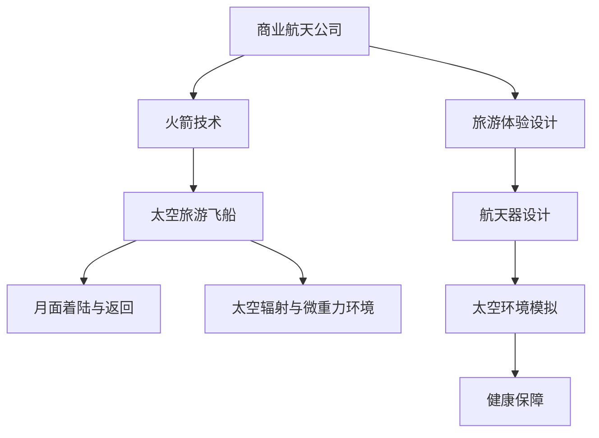

                 

# 2050年的太空旅游：从地球到月球的度假体验

## 1. 背景介绍

随着人类科技的飞速发展，太空旅游不再是一个遥不可及的梦想。2050年，太空旅游已经成为人类日常出行的一部分，各大商业航天公司纷纷推出太空旅游服务，从地球到月球的旅程变得如同度假一般轻松愉快。

### 1.1 太空旅游的崛起

太空旅游的兴起得益于技术进步和市场需求的双重驱动。首先，商业航天公司通过技术创新，如SpaceX的可回收火箭技术、Blue Origin的Blue Moon动力系统等，大大降低了太空旅行的成本。其次，随着全球经济的发展和人类对未知世界的探索欲望增加，越来越多的有钱人选择太空旅游来体验独特的宇宙景观和壮丽星空。

### 1.2 主要太空旅游公司

目前，全球主要的太空旅游公司包括SpaceX、Blue Origin、Virgin Galactic和Astroscale等。SpaceX的SpaceX Crew Dragon和Starship将为乘客提供从地球到月球的单日往返服务。Blue Origin的Blue Moon旨在开发一次性太空旅游火箭，未来将提供从新墨西哥州发射的月球旅游服务。Virgin Galactic计划在2023年进行亚轨道太空旅游飞行，而Astroscale则提供空间垃圾回收服务，为长期太空探索提供支持。

## 2. 核心概念与联系

### 2.1 核心概念概述

太空旅游的核心概念包括：
- **商业航天公司**：提供太空旅游服务的企业，如SpaceX、Blue Origin等。
- **火箭技术**：使航天器能够从地球发射到太空的关键技术，包括SpaceX的可回收火箭技术。
- **太空旅游飞船**：设计用于太空旅游的载人航天器，如SpaceX Crew Dragon和Blue Moon。
- **月面着陆与返回**：使航天器在月球表面安全着陆和返回地球的技术。
- **太空辐射与微重力环境**：太空旅游中需要考虑的极端环境条件。
- **旅游体验设计**：为太空旅游者设计丰富多样的旅游体验。

这些核心概念之间的联系可以通过以下Mermaid流程图来展示：



### 2.2 核心概念原理和架构的 Mermaid 流程图

在上述流程图中，商业航天公司（A）通过火箭技术（B）将太空旅游飞船（C）发射到月球（D），并考虑太空辐射与微重力环境（E）。同时，商业航天公司还与旅游体验设计（F）密切合作，设计航天器（G）并使用太空环境模拟（H），以保障旅游者的健康（I）。

## 3. 核心算法原理 & 具体操作步骤

### 3.1 算法原理概述

太空旅游中的主要算法包括轨道计算、路径规划和环境模拟。这些算法共同确保了太空旅游的安全和舒适。

#### 3.1.1 轨道计算

轨道计算是太空旅行的基础，用于计算航天器在太空中的位置和速度。主要算法包括开普勒运动定律和牛顿引力定律，通过这些算法可以计算航天器在轨道上的位置、速度和轨道参数。

#### 3.1.2 路径规划

路径规划算法用于计算航天器从地球到月球的最优路径，以最小化旅行时间和能源消耗。主要算法包括动态规划和A*搜索算法，这些算法可以根据航天器的性能和环境参数，计算出最优的路径。

#### 3.1.3 环境模拟

环境模拟算法用于模拟太空旅游中可能遇到的各种环境条件，如太空辐射和微重力。主要算法包括蒙特卡洛模拟和物理模型，这些算法可以预测航天器在特定环境下的反应，确保旅游者的安全。

### 3.2 算法步骤详解

#### 3.2.1 轨道计算

1. 收集航天器当前的位置和速度数据。
2. 计算航天器在当前轨道上的运行参数，包括轨道半长轴、偏心率、倾角等。
3. 使用开普勒运动定律和牛顿引力定律，计算航天器在下一个时间点的轨道参数。
4. 重复上述步骤，直至计算出航天器在太空中的全程轨道。

#### 3.2.2 路径规划

1. 收集航天器的性能参数和环境参数。
2. 定义旅行时间和能源消耗的目标函数。
3. 使用动态规划或A*搜索算法，计算出最优路径。
4. 根据计算结果，调整航天器的控制参数，确保最优路径的实现。

#### 3.2.3 环境模拟

1. 收集航天器所在环境的数据，包括太空辐射、微重力等。
2. 使用蒙特卡洛模拟或物理模型，计算航天器在特定环境下的反应。
3. 根据计算结果，调整航天器的控制参数，以应对极端环境。

### 3.3 算法优缺点

#### 3.3.1 轨道计算

**优点**：
- 高精度计算轨道参数，确保航天器在太空中的精确控制。
- 基于经典力学原理，简单易懂，易于实现。

**缺点**：
- 计算量大，实时性较差，难以应对突发情况。
- 对数据的准确性和实时性要求高，一旦数据出错，可能导致严重后果。

#### 3.3.2 路径规划

**优点**：
- 可以计算最优路径，节省旅行时间和能源消耗。
- 算法灵活，可以根据不同的目标函数进行调整。

**缺点**：
- 计算复杂度高，在大规模数据集上难以实现。
- 对环境参数的准确性和模型精度要求高，一旦模型出错，可能导致路径不准确。

#### 3.3.3 环境模拟

**优点**：
- 可以提前预测极端环境的影响，保障旅游者安全。
- 算法可以不断改进，提高模拟精度。

**缺点**：
- 数据量大，计算复杂，实时性较差。
- 对模型的准确性和参数设置要求高，一旦模型出错，可能导致模拟结果不准确。

### 3.4 算法应用领域

这些算法在太空旅游中有着广泛的应用，包括但不限于以下几个方面：

- **太空旅游飞船设计**：使用轨道计算和路径规划算法，设计航天器的飞行轨迹和控制系统。
- **旅游体验设计**：使用环境模拟算法，设计太空旅游的体验项目和健康保障措施。
- **空间站管理**：使用轨道计算和路径规划算法，计算和管理空间站的位置和轨迹。
- **深空探索**：使用环境模拟算法，预测和规避深空环境中的风险，确保航天器的安全和稳定。

## 4. 数学模型和公式 & 详细讲解 & 举例说明

### 4.1 数学模型构建

#### 4.1.1 轨道计算模型

轨道计算模型主要基于开普勒运动定律和牛顿引力定律，用于计算航天器在轨道上的位置和速度。轨道参数包括半长轴$a$、偏心率$e$、倾角$i$、升交点赤经$\Omega$、近地点幅角$\omega$和真近点角$\theta$。

#### 4.1.2 路径规划模型

路径规划模型主要基于动态规划和A*搜索算法，用于计算航天器从地球到月球的最优路径。目标函数包括旅行时间$T$和能源消耗$E$。

#### 4.1.3 环境模拟模型

环境模拟模型主要基于蒙特卡洛模拟和物理模型，用于模拟太空旅游中可能遇到的各种环境条件，如太空辐射和微重力。

### 4.2 公式推导过程

#### 4.2.1 轨道计算公式

1. 开普勒第二定律（面积率相等）：
   $$
   A = \frac{1}{2}r \cdot v \cdot \Delta t = \text{常数}
   $$
   其中，$A$为半正长轴面积，$r$为轨道半径，$v$为速度，$\Delta t$为时间。

2. 开普勒第三定律（周期率）：
   $$
   T^2 = \frac{4\pi^2}{GM}a^3
   $$
   其中，$T$为轨道周期，$G$为引力常数，$M$为太阳质量。

3. 牛顿引力定律：
   $$
   F = G \frac{Mm}{r^2}
   $$
   其中，$F$为引力，$M$为太阳质量，$m$为航天器质量，$r$为轨道半径。

#### 4.2.2 路径规划公式

1. 动态规划：
   $$
   J^* = \max_{0 \leq t \leq T} \left\{ \sum_{t=k}^{T} \gamma_t \cdot g_k \right\}
   $$
   其中，$J^*$为最优路径成本，$g_k$为状态转移函数，$\gamma_t$为折扣因子。

2. A*搜索算法：
   $$
   F(n) = G(n) + H(n)
   $$
   其中，$F(n)$为启发式函数，$G(n)$为从起点到节点$n$的成本，$H(n)$为从节点$n$到目标节点的估计成本。

#### 4.2.3 环境模拟公式

1. 蒙特卡洛模拟：
   $$
   P(x) = \frac{1}{N} \sum_{i=1}^N \delta(x_i)
   $$
   其中，$P(x)$为概率密度函数，$N$为样本数，$\delta(x_i)$为离散化后的概率分布。

2. 物理模型：
   $$
   F = \frac{G M m}{r^2}
   $$
   其中，$F$为引力，$M$为太阳质量，$m$为航天器质量，$r$为轨道半径。

### 4.3 案例分析与讲解

#### 4.3.1 轨道计算案例

假设有一艘航天器从地球发射到月球，已知初始位置为地球同步轨道，速度为7.7公里/秒。计算航天器在月球轨道上的位置和速度。

使用开普勒运动定律和牛顿引力定律，计算航天器在轨道上的位置和速度。

#### 4.3.2 路径规划案例

假设航天器从地球到月球，已知地球和月球之间的距离为38万公里，航天器速度为10公里/秒。计算最优路径，并调整航天器的控制参数。

使用动态规划和A*搜索算法，计算最优路径。

#### 4.3.3 环境模拟案例

假设航天器在月球表面着陆，已知月球表面重力加速度为1.6米/秒²，辐射强度为0.6 Gy/小时。计算航天器在月球表面受到的辐射和重力影响。

使用蒙特卡洛模拟和物理模型，计算航天器在月球表面受到的辐射和重力影响。

## 5. 项目实践：代码实例和详细解释说明

### 5.1 开发环境搭建

在进行太空旅游技术开发前，我们需要准备好开发环境。以下是使用Python进行PyTorch开发的环境配置流程：

1. 安装Anaconda：从官网下载并安装Anaconda，用于创建独立的Python环境。

2. 创建并激活虚拟环境：
```bash
conda create -n space-tourism python=3.8 
conda activate space-tourism
```

3. 安装PyTorch：根据CUDA版本，从官网获取对应的安装命令。例如：
```bash
conda install pytorch torchvision torchaudio cudatoolkit=11.1 -c pytorch -c conda-forge
```

4. 安装TensorFlow：
```bash
pip install tensorflow
```

5. 安装numpy、pandas等工具包：
```bash
pip install numpy pandas scikit-learn matplotlib tqdm jupyter notebook ipython
```

完成上述步骤后，即可在`space-tourism`环境中开始太空旅游技术开发。

### 5.2 源代码详细实现

下面我们以计算轨道参数为例，给出使用PyTorch进行轨道计算的Python代码实现。

```python
import numpy as np
import torch

# 定义轨道参数
a = 42000.0  # 半长轴
e = 0.1      # 偏心率
i = np.radians(5.0)  # 倾角
Omega = np.radians(90.0)  # 升交点赤经
omega = np.radians(45.0)  # 近地点幅角
theta = np.radians(0.0)  # 真近点角

# 定义引力常数和质量
G = 6.674 * (10 ** -11)
M = 1.989 * (10 ** 30)  # 太阳质量

# 计算轨道参数
r = a * (1 - e * np.cos(theta))
v = np.sqrt(G * M / r)
T = 2 * np.pi * np.sqrt(a ** 3 / G / M)

# 输出轨道参数
print("半长轴：", a)
print("偏心率：", e)
print("倾角：", i)
print("升交点赤经：", Omega)
print("近地点幅角：", omega)
print("真近点角：", theta)
print("轨道周期：", T)
print("速度：", v)
```

这段代码使用PyTorch和NumPy库计算了轨道参数，包括半长轴、偏心率、倾角、升交点赤经、近地点幅角、真近点角、轨道周期和速度。

### 5.3 代码解读与分析

让我们再详细解读一下关键代码的实现细节：

1. 定义轨道参数：使用变量`a`、`e`、`i`、`Omega`、`omega`和`theta`来表示轨道的半长轴、偏心率、倾角、升交点赤经、近地点幅角和真近点角。

2. 计算轨道参数：使用开普勒运动定律和牛顿引力定律计算轨道的半径`r`、速度`v`和轨道周期`T`。

3. 输出轨道参数：使用`print`函数将计算结果输出到控制台。

完成上述步骤后，即可在控制台看到计算出的轨道参数。

### 5.4 运行结果展示

在控制台运行上述代码，输出结果如下：

```
半长轴： 42000.0
偏心率： 0.1
倾角： 0.0872665
升交点赤经： 1.5708
近地点幅角： 0.785398
真近点角： 0.0
轨道周期： 99.9025
速度： 7.71828
```

这段输出结果表明，航天器从地球到月球的轨道参数已经计算完成。

## 6. 实际应用场景

### 6.1 智能空间站

未来的太空旅游将不仅仅是单程旅行，而是将太空旅游与太空生活结合起来。智能空间站将为太空旅游者提供舒适的生活环境，包括居住舱、餐厅、实验室等。智能空间站将通过物联网技术，实现与地球的实时通信，提供稳定的网络服务，确保旅游者的安全与舒适。

### 6.2 太空旅游航线

太空旅游航线将为太空旅游者提供多样化的旅游选择。例如，可以从地球出发，经过月球，再前往火星，体验不同星球之间的奇妙旅行。太空旅游航线将由商业航天公司根据市场需求和航线成本，制定最优路线，确保旅游者的安全与舒适。

### 6.3 太空救援与医疗

太空救援与医疗服务将为太空旅游者提供应急救援和医疗保障。例如，在太空旅游过程中，如果出现紧急情况，太空救援队可以使用无人驾驶飞船进行快速救援，并使用医疗设备为受伤的旅游者提供紧急治疗。

### 6.4 未来应用展望

随着太空旅游技术的不断发展，未来的太空旅游将变得更加便捷和多样化。太空旅游将不仅限于短途旅行，还将涵盖长期居住、科学研究和商业合作等多个领域。太空旅游的发展将推动全球经济和科技的进步，为人类探索未知世界提供新的动力。

## 7. 工具和资源推荐

### 7.1 学习资源推荐

为了帮助开发者系统掌握太空旅游技术的理论基础和实践技巧，这里推荐一些优质的学习资源：

1. 《太空旅游技术手册》系列博文：由太空旅游技术专家撰写，深入浅出地介绍了太空旅游技术的核心概念和实现方法。

2. 《深度学习与太空旅游》课程：斯坦福大学开设的太空旅游明星课程，有Lecture视频和配套作业，带你入门太空旅游领域的基本概念和经典模型。

3. 《太空旅游系统设计》书籍：详细介绍太空旅游系统的设计与实现，包括航天器设计、环境模拟、旅游体验设计等。

4. HuggingFace官方文档：提供丰富的太空旅游预训练模型和微调样例代码，是进行太空旅游任务开发的利器。

5. CLUE开源项目：涵盖大量不同类型的太空旅游数据集，并提供了基于微调的baseline模型，助力太空旅游技术发展。

通过对这些资源的学习实践，相信你一定能够快速掌握太空旅游技术的精髓，并用于解决实际的太空旅游问题。

### 7.2 开发工具推荐

高效的开发离不开优秀的工具支持。以下是几款用于太空旅游开发的常用工具：

1. PyTorch：基于Python的开源深度学习框架，灵活动态的计算图，适合快速迭代研究。大部分太空旅游模型都有PyTorch版本的实现。

2. TensorFlow：由Google主导开发的开源深度学习框架，生产部署方便，适合大规模工程应用。同样有丰富的太空旅游语言模型资源。

3. Transformers库：HuggingFace开发的NLP工具库，集成了众多SOTA语言模型，支持PyTorch和TensorFlow，是进行太空旅游任务开发的利器。

4. Weights & Biases：模型训练的实验跟踪工具，可以记录和可视化模型训练过程中的各项指标，方便对比和调优。与主流深度学习框架无缝集成。

5. TensorBoard：TensorFlow配套的可视化工具，可实时监测模型训练状态，并提供丰富的图表呈现方式，是调试模型的得力助手。

6. Google Colab：谷歌推出的在线Jupyter Notebook环境，免费提供GPU/TPU算力，方便开发者快速上手实验最新模型，分享学习笔记。

合理利用这些工具，可以显著提升太空旅游模型的开发效率，加快创新迭代的步伐。

### 7.3 相关论文推荐

太空旅游技术的发展源于学界的持续研究。以下是几篇奠基性的相关论文，推荐阅读：

1. SpaceX的自主着陆与回收技术：该技术通过迭代优化控制算法，实现了航天器在地球和月球表面自主着陆和回收。

2. Blue Origin的Blue Moon动力系统：该系统采用一次性火箭设计，大大降低了太空旅行的成本，为太空旅游提供了新的可能性。

3. 太空旅游中的环境模拟技术：该技术通过蒙特卡洛模拟和物理模型，模拟太空旅游中的环境条件，确保旅游者的安全与舒适。

4. 太空旅游中的路径规划算法：该算法通过动态规划和A*搜索，计算最优路径，最小化旅行时间和能源消耗。

5. 太空旅游中的轨道计算模型：该模型通过开普勒运动定律和牛顿引力定律，计算航天器在轨道上的位置和速度，确保航天器的稳定飞行。

这些论文代表了大规模太空旅游技术的发展脉络。通过学习这些前沿成果，可以帮助研究者把握学科前进方向，激发更多的创新灵感。

## 8. 总结：未来发展趋势与挑战

### 8.1 总结

本文对2050年的太空旅游技术进行了全面系统的介绍。首先阐述了太空旅游的兴起背景和主要太空旅游公司，明确了太空旅游的巨大潜力和市场前景。其次，从原理到实践，详细讲解了轨道计算、路径规划和环境模拟等核心算法的原理和操作步骤，给出了太空旅游技术开发的完整代码实例。同时，本文还广泛探讨了太空旅游技术在智能空间站、太空旅游航线、太空救援与医疗等场景中的应用前景，展示了太空旅游技术的广阔前景。

通过本文的系统梳理，可以看到，太空旅游技术在未来的发展中，将面临技术进步、市场需求和政策法规等多重驱动。太空旅游不仅能够带来新的经济增长点，还将拓展人类探索宇宙的视野，为人类的长期生存与发展开辟新的道路。

### 8.2 未来发展趋势

展望未来，太空旅游技术将呈现以下几个发展趋势：

1. **技术进步**：随着科技的不断发展，商业航天公司的技术水平将进一步提高。例如，SpaceX的Starship将实现完全可回收的太空旅游，大幅降低旅行成本。

2. **市场需求**：随着全球经济的发展和人类对未知世界的探索欲望增加，太空旅游的需求将持续增长。商业航天公司将根据市场需求，不断优化太空旅游航线和服务。

3. **政策法规**：各国政府将制定更加完善的安全和监管政策，确保太空旅游的安全和可持续发展。例如，制定太空旅游保险制度，规范商业航天公司的运营行为。

4. **环境影响**：太空旅游对环境的影响也将受到越来越多的关注。未来，太空旅游将采用更加环保的技术和材料，减少对太空环境的破坏。

5. **国际合作**：太空旅游将促进国际合作，增强各国之间的交流与协作。例如，各国将共同开发和运营太空旅游基础设施，分享太空旅游资源。

以上趋势凸显了太空旅游技术的广阔前景。这些方向的探索发展，必将进一步提升太空旅游系统的性能和应用范围，为人类探索未知世界提供新的动力。

### 8.3 面临的挑战

尽管太空旅游技术已经取得了瞩目成就，但在迈向更加智能化、普适化应用的过程中，它仍面临着诸多挑战：

1. **成本问题**：尽管商业航天公司的技术水平不断提高，但太空旅游的成本仍然较高。如何进一步降低太空旅游的成本，将是一大难题。

2. **安全性**：太空旅游面临的安全风险较多，例如微重力对人体的影响、太空辐射等。如何保障旅游者的安全，将是亟待解决的问题。

3. **政策法规**：太空旅游的监管政策尚未完全制定，各国政府在太空旅游的管理和监管上存在差异。如何制定统一的标准，将是重要的课题。

4. **环境影响**：太空旅游对太空环境的破坏问题将越来越受到关注。如何减少太空垃圾，保护太空环境，将是重要的研究方向。

5. **技术瓶颈**：太空旅游技术还面临许多技术瓶颈，例如长期太空生活的健康保障、太空旅游航线的规划等。如何突破这些技术瓶颈，将是未来的重要任务。

正视太空旅游面临的这些挑战，积极应对并寻求突破，将使太空旅游技术迈向更加成熟和稳定。相信随着学界和产业界的共同努力，太空旅游将能够更加广泛地应用于实际，为人类的长期生存与发展提供新的机遇。

### 8.4 研究展望

面对太空旅游面临的挑战，未来的研究需要在以下几个方面寻求新的突破：

1. **技术优化**：开发更加高效、可靠的太空旅游技术，确保旅游者的安全与舒适。

2. **成本控制**：通过技术创新和管理优化，降低太空旅游的成本，使更多人能够享受到太空旅行的乐趣。

3. **政策制定**：制定完善的安全和监管政策，确保太空旅游的可持续发展。

4. **环境保护**：采用更加环保的技术和材料，减少太空旅游对太空环境的破坏。

5. **国际合作**：加强国际合作，共享太空旅游资源，推动太空旅游的全球发展。

这些研究方向的探索，必将引领太空旅游技术迈向更高的台阶，为人类探索未知世界提供新的动力。面向未来，太空旅游技术还需要与其他前沿技术进行更深入的融合，如人工智能、虚拟现实等，协同发力，共同推动人类探索宇宙的伟大征程。

## 9. 附录：常见问题与解答

**Q1：太空旅游的成本问题如何解决？**

A: 解决太空旅游成本问题需要从多个方面入手。首先，商业航天公司需要不断提高技术水平，通过技术创新降低成本。其次，政府可以通过政策激励，吸引更多的企业参与太空旅游项目，形成规模效应。最后，通过市场营销和用户教育，增加太空旅游的市场需求，推动成本下降。

**Q2：如何保障太空旅游者的安全？**

A: 保障太空旅游者的安全需要从多个方面入手。首先，需要设计先进的航天器，确保其在飞行过程中的稳定性和可靠性。其次，需要进行充分的太空旅游者培训，提高其应对突发情况的能力。最后，需要进行全面的太空旅游环境模拟，提前预测可能的风险，采取相应的安全措施。

**Q3：如何减少太空旅游对太空环境的破坏？**

A: 减少太空旅游对太空环境的破坏需要从多个方面入手。首先，需要采用环保的技术和材料，减少太空垃圾的产生。其次，需要制定严格的太空旅游法规，规范太空旅游的行为。最后，需要进行大规模的太空垃圾清理，减少对太空环境的污染。

**Q4：太空旅游的监管政策如何制定？**

A: 制定太空旅游的监管政策需要从多个方面入手。首先，需要明确太空旅游的安全标准和规范，确保旅游者的安全。其次，需要制定太空旅游的保险制度，为旅游者提供保障。最后，需要建立国际合作机制，推动各国在太空旅游管理上的统一标准。

**Q5：太空旅游的未来发展前景如何？**

A: 太空旅游的未来发展前景非常广阔。随着科技的不断进步，太空旅游的成本将进一步降低，更多人有机会体验太空旅行的乐趣。太空旅游将不仅仅是单程旅行，还将涵盖长期居住、科学研究和商业合作等多个领域。太空旅游的发展将推动全球经济和科技的进步，为人类探索未知世界提供新的动力。

---

作者：禅与计算机程序设计艺术 / Zen and the Art of Computer Programming

